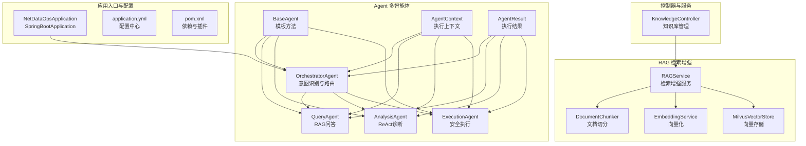
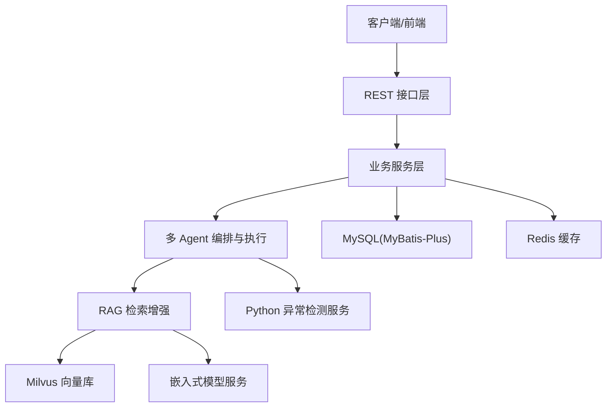
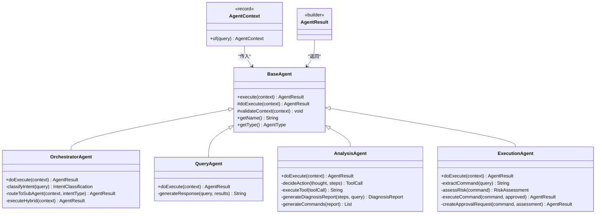
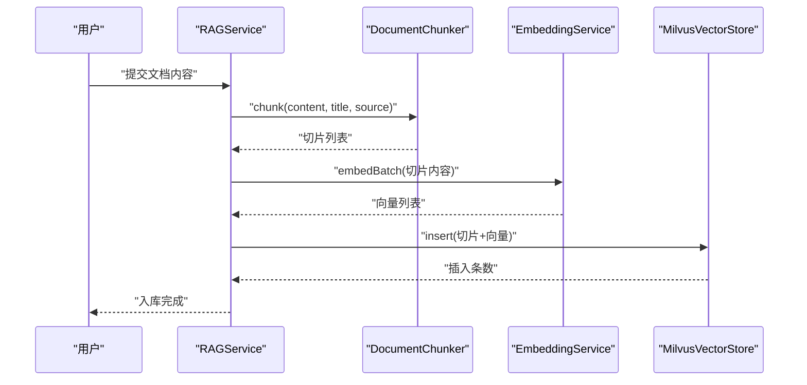
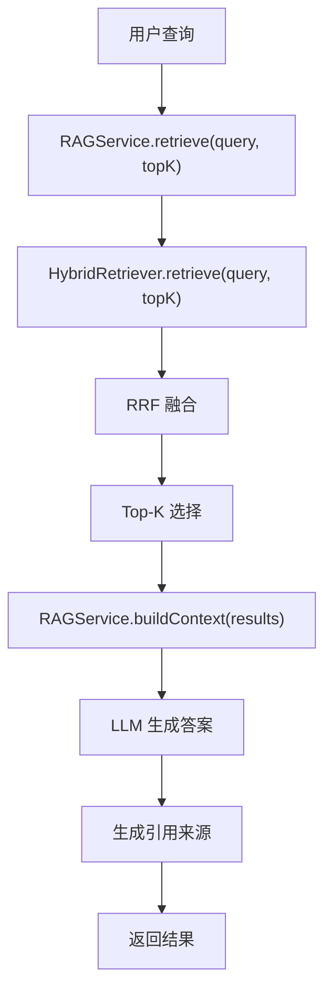
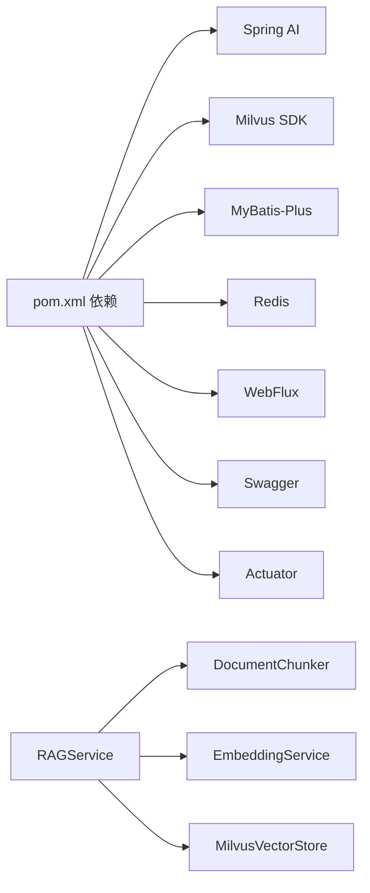

# AI后端服务

<cite>
**本文引用的文件**
- [NetDataOpsApplication.java](file://netdata-ai-backend/src/main/java/com/netdata/ops/NetDataOpsApplication.java)
- [application.yml](file://netdata-ai-backend/src/main/resources/application.yml)
- [pom.xml](file://netdata-ai-backend/pom.xml)
- [BaseAgent.java](file://netdata-ai-backend/src/main/java/com/netdata/ops/core/agent/BaseAgent.java)
- [AgentContext.java](file://netdata-ai-backend/src/main/java/com/netdata/ops/core/agent/AgentContext.java)
- [AgentResult.java](file://netdata-ai-backend/src/main/java/com/netdata/ops/core/agent/AgentResult.java)
- [OrchestratorAgent.java](file://netdata-ai-backend/src/main/java/com/netdata/ops/core/agent/OrchestratorAgent.java)
- [QueryAgent.java](file://netdata-ai-backend/src/main/java/com/netdata/ops/core/agent/QueryAgent.java)
- [AnalysisAgent.java](file://netdata-ai-backend/src/main/java/com/netdata/ops/core/agent/AnalysisAgent.java)
- [ExecutionAgent.java](file://netdata-ai-backend/src/main/java/com/netdata/ops/core/agent/ExecutionAgent.java)
- [RAGService.java](file://netdata-ai-backend/src/main/java/com/netdata/ops/core/rag/RAGService.java)
- [DocumentChunker.java](file://netdata-ai-backend/src/main/java/com/netdata/ops/core/rag/DocumentChunker.java)
- [EmbeddingService.java](file://netdata-ai-backend/src/main/java/com/netdata/ops/core/rag/EmbeddingService.java)
- [MilvusVectorStore.java](file://netdata-ai-backend/src/main/java/com/netdata/ops/core/rag/MilvusVectorStore.java)
- [KnowledgeController.java](file://netdata-ai-backend/src/main/java/com/netdata/ops/controller/KnowledgeController.java)
</cite>

## 目录
1. [简介](#简介)
2. [项目结构](#项目结构)
3. [核心组件](#核心组件)
4. [架构总览](#架构总览)
5. [详细组件分析](#详细组件分析)
6. [依赖分析](#依赖分析)
7. [性能考量](#性能考量)
8. [故障排查指南](#故障排查指南)
9. [结论](#结论)
10. [附录](#附录)

## 简介
本项目是一个面向 NetData 监控数据的智能运维问答与执行系统，采用 Spring Boot 3.3.x 与 Spring AI 1.0.x 技术栈，结合 Milvus 向量数据库与嵌入式模型服务，提供自然语言问答、异常检测与根因分析、以及受控的人机协同命令执行能力。系统通过多 Agent 协作实现意图识别、RAG 检索增强问答、ReAct 故障诊断与安全命令执行。

## 项目结构
后端采用标准 Spring Boot 结构，核心模块包括：
- 应用入口与配置：NetDataOpsApplication、application.yml、pom.xml
- 核心业务：Agent 多智能体系统、RAG 检索增强系统
- 控制器与服务：知识库管理控制器、领域服务与实体、MyBatis Plus 映射
- 安全与基础设施：JWT、拦截器、全局异常处理、WebSocket、Actuator

图表来源
- [NetDataOpsApplication.java:1-36](file://netdata-ai-backend/src/main/java/com/netdata/ops/NetDataOpsApplication.java#L1-L36)
- [application.yml:1-283](file://netdata-ai-backend/src/main/resources/application.yml#L1-L283)
- [pom.xml:1-256](file://netdata-ai-backend/pom.xml#L1-L256)
- [BaseAgent.java:1-167](file://netdata-ai-backend/src/main/java/com/netdata/ops/core/agent/BaseAgent.java#L1-L167)
- [AgentContext.java:1-131](file://netdata-ai-backend/src/main/java/com/netdata/ops/core/agent/AgentContext.java#L1-L131)
- [AgentResult.java:1-194](file://netdata-ai-backend/src/main/java/com/netdata/ops/core/agent/AgentResult.java#L1-L194)
- [RAGService.java:1-212](file://netdata-ai-backend/src/main/java/com/netdata/ops/core/rag/RAGService.java#L1-L212)
- [DocumentChunker.java:1-312](file://netdata-ai-backend/src/main/java/com/netdata/ops/core/rag/DocumentChunker.java#L1-L312)
- [EmbeddingService.java:1-190](file://netdata-ai-backend/src/main/java/com/netdata/ops/core/rag/EmbeddingService.java#L1-L190)
- [MilvusVectorStore.java:1-406](file://netdata-ai-backend/src/main/java/com/netdata/ops/core/rag/MilvusVectorStore.java#L1-L406)
- [KnowledgeController.java:1-82](file://netdata-ai-backend/src/main/java/com/netdata/ops/controller/KnowledgeController.java#L1-L82)

章节来源
- [NetDataOpsApplication.java:1-36](file://netdata-ai-backend/src/main/java/com/netdata/ops/NetDataOpsApplication.java#L1-L36)
- [application.yml:1-283](file://netdata-ai-backend/src/main/resources/application.yml#L1-L283)
- [pom.xml:1-256](file://netdata-ai-backend/pom.xml#L1-L256)

## 核心组件
- 应用入口与组件扫描
  - @SpringBootApplication 启动类负责组件扫描与自动装配，开启异步执行 @EnableAsync。
- 配置管理
  - application.yml 通过 Profiles 区分 dev/prod；集中管理数据源、Redis、Jackson、MyBatis-Plus、Spring AI、Milvus、RAG、异常检测、命令执行安全、JWT、限流、Actuator、Swagger、WebSocket、日志等。
- 依赖注入与容器
  - Maven 依赖覆盖 Web/WebFlux/AOP/Security/JWT/Actuator/Swagger/Milvus/Redis/MyBatis Plus/工具库等，确保多 Agent 与 RAG 模块的运行时依赖完备。

章节来源
- [NetDataOpsApplication.java:28-35](file://netdata-ai-backend/src/main/java/com/netdata/ops/NetDataOpsApplication.java#L28-L35)
- [application.yml:14-283](file://netdata-ai-backend/src/main/resources/application.yml#L14-L283)
- [pom.xml:41-224](file://netdata-ai-backend/pom.xml#L41-L224)

## 架构总览
系统采用“编排器 + 多 Agent + 检索增强”的分层架构：
- 控制层：REST 接口暴露知识库管理等能力
- 业务层：Agent 编排与执行、RAG 检索增强
- 数据层：MySQL(MyBatis-Plus)、Redis、Milvus 向量库
- 外部服务：Python 异常检测服务、嵌入式模型服务

图表来源
- [application.yml:101-147](file://netdata-ai-backend/src/main/resources/application.yml#L101-L147)
- [pom.xml:119-168](file://netdata-ai-backend/pom.xml#L119-L168)

## 详细组件分析

### 多 Agent 系统设计与实现
- 设计模式
  - BaseAgent 采用模板方法 + 策略模式：统一生命周期与错误处理，子类仅实现 doExecute。
  - AgentContext/AgentResult 提供统一的上下文与结果载体，支持链路追踪、优先级、重试、Token 统计等可观测性字段。
- 四个 Agent 的职责与协作
  - OrchestratorAgent：意图识别（关键词匹配 + 置信度），路由到子 Agent 或混合执行。
  - QueryAgent：RAG 检索增强问答，构建上下文并生成答案，附加来源引用。
  - AnalysisAgent：ReAct 循环（思考→行动→观察），调用工具（历史指标、异常检测、知识库等）生成诊断报告与建议命令。
  - ExecutionAgent：命令解析、黑名单/白名单检查、风险评估、审批流程与执行记录。

图表来源
- [BaseAgent.java:24-167](file://netdata-ai-backend/src/main/java/com/netdata/ops/core/agent/BaseAgent.java#L24-L167)
- [AgentContext.java:25-131](file://netdata-ai-backend/src/main/java/com/netdata/ops/core/agent/AgentContext.java#L25-L131)
- [AgentResult.java:23-194](file://netdata-ai-backend/src/main/java/com/netdata/ops/core/agent/AgentResult.java#L23-L194)
- [OrchestratorAgent.java:30-235](file://netdata-ai-backend/src/main/java/com/netdata/ops/core/agent/OrchestratorAgent.java#L30-L235)
- [QueryAgent.java:33-107](file://netdata-ai-backend/src/main/java/com/netdata/ops/core/agent/QueryAgent.java#L33-L107)
- [AnalysisAgent.java:38-290](file://netdata-ai-backend/src/main/java/com/netdata/ops/core/agent/AnalysisAgent.java#L38-L290)
- [ExecutionAgent.java:35-335](file://netdata-ai-backend/src/main/java/com/netdata/ops/core/agent/ExecutionAgent.java#L35-L335)

章节来源
- [BaseAgent.java:50-105](file://netdata-ai-backend/src/main/java/com/netdata/ops/core/agent/BaseAgent.java#L50-L105)
- [AgentContext.java:27-129](file://netdata-ai-backend/src/main/java/com/netdata/ops/core/agent/AgentContext.java#L27-L129)
- [AgentResult.java:25-118](file://netdata-ai-backend/src/main/java/com/netdata/ops/core/agent/AgentResult.java#L25-L118)
- [OrchestratorAgent.java:86-175](file://netdata-ai-backend/src/main/java/com/netdata/ops/core/agent/OrchestratorAgent.java#L86-L175)
- [QueryAgent.java:43-79](file://netdata-ai-backend/src/main/java/com/netdata/ops/core/agent/QueryAgent.java#L43-L79)
- [AnalysisAgent.java:56-103](file://netdata-ai-backend/src/main/java/com/netdata/ops/core/agent/AnalysisAgent.java#L56-L103)
- [ExecutionAgent.java:80-129](file://netdata-ai-backend/src/main/java/com/netdata/ops/core/agent/ExecutionAgent.java#L80-L129)

### RAG 检索增强系统实现
- 文档处理
  - DocumentChunker：预处理（抽取代码块）、按段落/标题/代码块/表格/列表等类型切分，支持语义切分与最小切片合并。
- 向量化
  - EmbeddingService：调用嵌入式模型服务（BGE-M3），支持批量向量化与余弦相似度计算。
- 向量存储与检索
  - MilvusVectorStore：自动创建集合、插入向量、向量搜索、按条件删除、统计信息。
- 检索与融合
  - RAGService：文档入库（切分→向量化→Milvus存储→更新 BM25 索引）、知识检索（混合检索→RRF 融合→Top-K）、构建上下文、生成引用来源。
- 检索流程序列图

图表来源
- [RAGService.java:57-91](file://netdata-ai-backend/src/main/java/com/netdata/ops/core/rag/RAGService.java#L57-L91)
- [DocumentChunker.java:81-104](file://netdata-ai-backend/src/main/java/com/netdata/ops/core/rag/DocumentChunker.java#L81-L104)
- [EmbeddingService.java:101-133](file://netdata-ai-backend/src/main/java/com/netdata/ops/core/rag/EmbeddingService.java#L101-L133)
- [MilvusVectorStore.java:217-254](file://netdata-ai-backend/src/main/java/com/netdata/ops/core/rag/MilvusVectorStore.java#L217-L254)

- 检索与问答流程

图表来源
- [RAGService.java:116-157](file://netdata-ai-backend/src/main/java/com/netdata/ops/core/rag/RAGService.java#L116-L157)

章节来源
- [DocumentChunker.java:112-297](file://netdata-ai-backend/src/main/java/com/netdata/ops/core/rag/DocumentChunker.java#L112-L297)
- [EmbeddingService.java:72-133](file://netdata-ai-backend/src/main/java/com/netdata/ops/core/rag/EmbeddingService.java#L72-L133)
- [MilvusVectorStore.java:274-324](file://netdata-ai-backend/src/main/java/com/netdata/ops/core/rag/MilvusVectorStore.java#L274-L324)
- [RAGService.java:57-200](file://netdata-ai-backend/src/main/java/com/netdata/ops/core/rag/RAGService.java#L57-L200)

### 业务服务层与控制器层设计
- 控制器层
  - KnowledgeController：提供知识库文档的分页查询、详情、创建、删除、分类列表与统计接口，配合权限注解与统一响应包装。
- 服务层与实体
  - 服务层通过 MyBatis-Plus Mapper 访问 MySQL，结合 Redis 缓存提升性能；RAG 服务与 Agent 编排位于 core 层。
- REST API 设计原则
  - 统一路径前缀 /api/v1/knowledge，遵循资源化命名，使用分页参数与筛选条件，返回统一响应体。

章节来源
- [KnowledgeController.java:27-80](file://netdata-ai-backend/src/main/java/com/netdata/ops/controller/KnowledgeController.java#L27-L80)

### AI 客户端集成、嵌入式模型管理与提示词管理
- LLM 客户端
  - application.yml 配置 Spring AI OpenAI 客户端（使用 ChatClient，ChatOptions），支持不同环境下的模型与参数。
- 嵌入式模型管理
  - EmbeddingService 调用本地嵌入式模型服务（BGE-M3），支持批量向量化与超时控制。
- 提示词管理
  - 文档与提示词可通过外部资源目录管理，结合 RAGService 构建上下文时注入检索结果，实现可控的提示词工程。

章节来源
- [application.yml:87-100](file://netdata-ai-backend/src/main/resources/application.yml#L87-L100)
- [EmbeddingService.java:38-49](file://netdata-ai-backend/src/main/java/com/netdata/ops/core/rag/EmbeddingService.java#L38-L49)
- [RAGService.java:140-157](file://netdata-ai-backend/src/main/java/com/netdata/ops/core/rag/RAGService.java#L140-L157)

## 依赖分析
- 外部依赖
  - Spring AI OpenAI Starter：LLM 集成
  - Milvus Java SDK：向量检索
  - MyBatis-Plus：数据库访问
  - Redis：缓存
  - WebFlux：HTTP 客户端调用 Python 服务
  - Swagger/OpenAPI：API 文档
  - Actuator/Prometheus：健康检查与监控
- 内部耦合
  - Agent 之间通过编排器路由，减少直接耦合
  - RAGService 组合多个组件，保持高内聚低耦合

图表来源
- [pom.xml:119-168](file://netdata-ai-backend/pom.xml#L119-L168)
- [RAGService.java:37-41](file://netdata-ai-backend/src/main/java/com/netdata/ops/core/rag/RAGService.java#L37-L41)

章节来源
- [pom.xml:41-224](file://netdata-ai-backend/pom.xml#L41-L224)
- [RAGService.java:37-41](file://netdata-ai-backend/src/main/java/com/netdata/ops/core/rag/RAGService.java#L37-L41)

## 性能考量
- 向量化与检索
  - 批量向量化与分批处理，避免内存溢出；Milvus 使用 IVF_FLAT 索引与 COSINE 度量，平衡性能与精度。
- Agent 执行
  - 统一的执行耗时统计与可观测性字段，便于性能分析与瓶颈定位。
- 缓存与限流
  - Redis 缓存热点数据；JWT 令牌与限流策略保护接口。
- 并发与异步
  - @EnableAsync 支持异步任务，提高吞吐。

## 故障排查指南
- Milvus 不可用
  - MilvusVectorStore 在初始化失败时不中断系统，RAGService 调用前检查可用性，必要时降级为无知识库模式。
- 嵌入式模型服务异常
  - EmbeddingService 设置超时与分批处理，异常时返回错误信息，便于快速定位。
- Agent 执行失败
  - BaseAgent 统一捕获异常并记录错误信息与耗时，便于审计与重试策略制定。
- 控制器权限与参数
  - 使用 @RequirePermission 与统一响应包装，便于排查权限与参数问题。

章节来源
- [MilvusVectorStore.java:80-103](file://netdata-ai-backend/src/main/java/com/netdata/ops/core/rag/MilvusVectorStore.java#L80-L103)
- [EmbeddingService.java:72-93](file://netdata-ai-backend/src/main/java/com/netdata/ops/core/rag/EmbeddingService.java#L72-L93)
- [BaseAgent.java:71-82](file://netdata-ai-backend/src/main/java/com/netdata/ops/core/agent/BaseAgent.java#L71-L82)
- [KnowledgeController.java:27-80](file://netdata-ai-backend/src/main/java/com/netdata/ops/controller/KnowledgeController.java#L27-L80)

## 结论
本系统通过清晰的分层架构与多 Agent 协作，实现了从意图识别到命令执行的闭环；借助 RAG 检索增强与 Milvus 向量库，显著提升了问答质量与效率。配置驱动与可观测性设计使得系统具备良好的可维护性与可扩展性，适合在生产环境中持续演进。

## 附录
- 快速启动
  - 设置环境变量（MySQL/Redis/Milvus/LLM），切换 Profile（dev/prod），启动应用。
- 常用接口
  - 知识库文档 CRUD 与统计：/api/v1/knowledge/documents、/api/v1/knowledge/categories、/api/v1/knowledge/stats
- 最佳实践
  - 将提示词与系统提示词置于资源目录，结合 RAG 上下文构建；对高风险命令实施白/黑名单与审批流程；定期评估 Milvus 索引与检索参数。