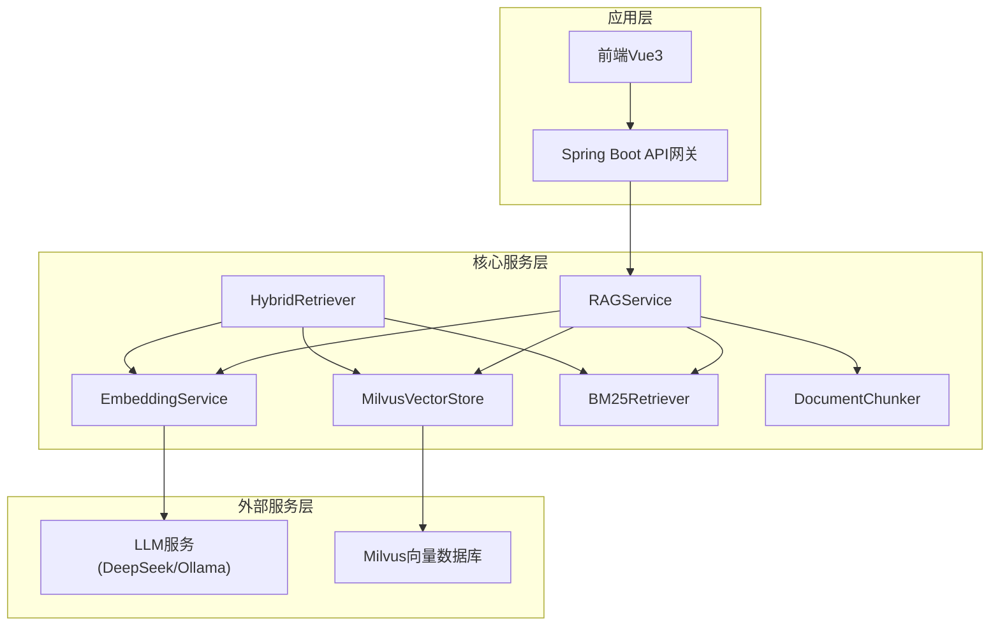
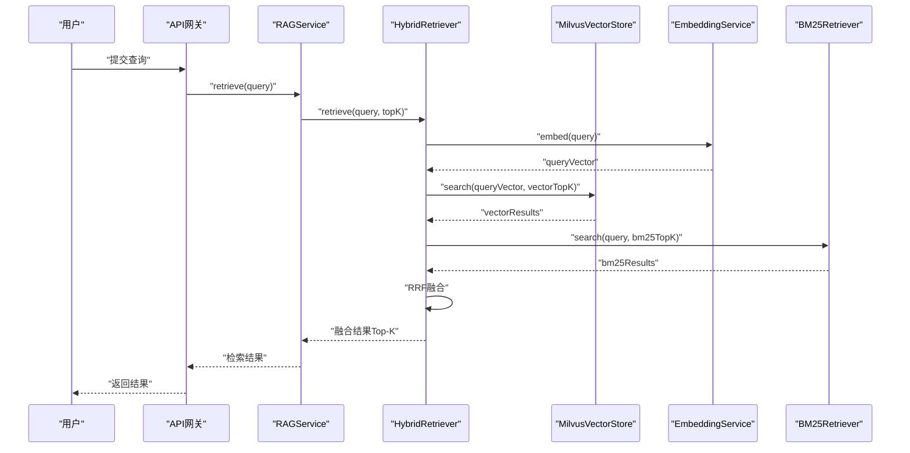
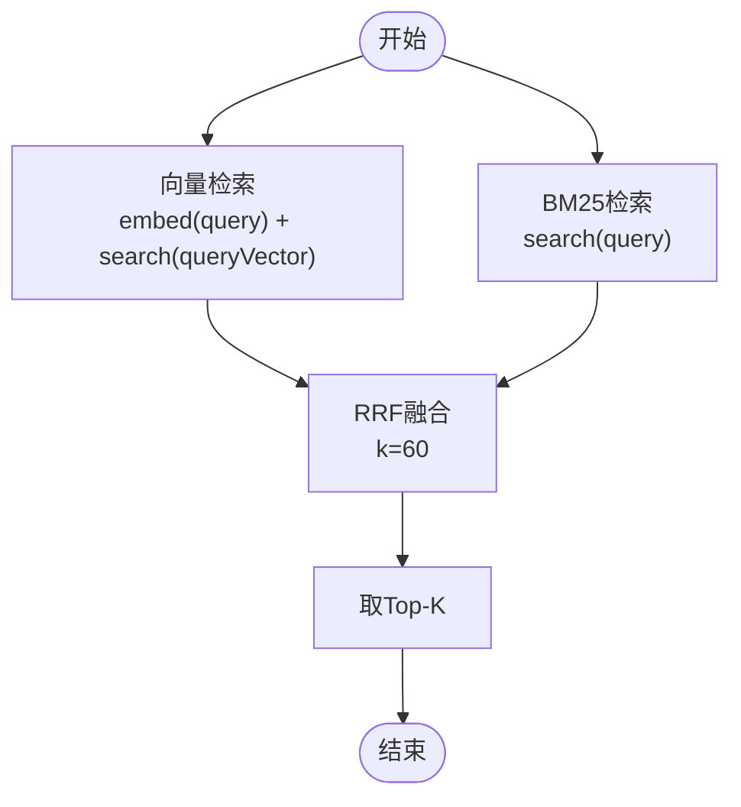
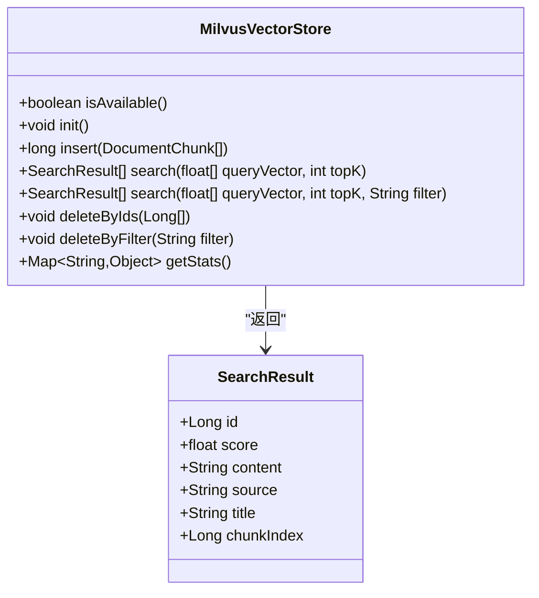
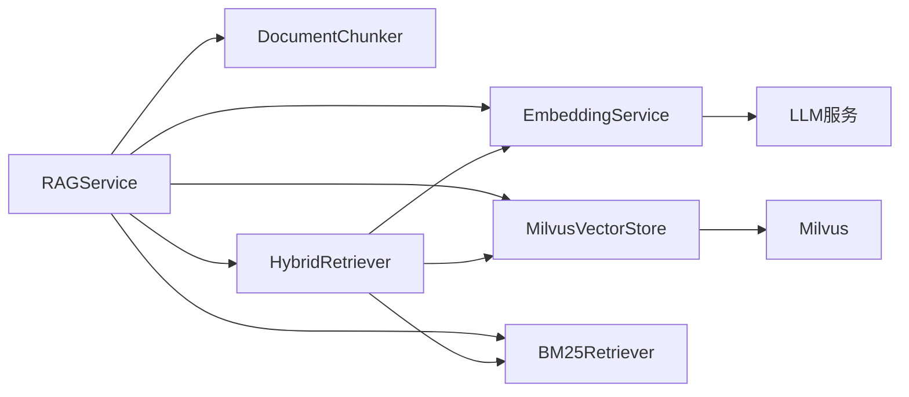

# RAG检索增强系统

<cite>
**本文引用的文件**
- [RAGService.java](file://netdata-ai-backend/src/main/java/com/netdata/ops/core/rag/RAGService.java)
- [HybridRetriever.java](file://netdata-ai-backend/src/main/java/com/netdata/ops/core/rag/HybridRetriever.java)
- [MilvusVectorStore.java](file://netdata-ai-backend/src/main/java/com/netdata/ops/core/rag/MilvusVectorStore.java)
- [EmbeddingService.java](file://netdata-ai-backend/src/main/java/com/netdata/ops/core/rag/EmbeddingService.java)
- [BM25Retriever.java](file://netdata-ai-backend/src/main/java/com/netdata/ops/core/rag/BM25Retriever.java)
- [DocumentChunk.java](file://netdata-ai-backend/src/main/java/com/netdata/ops/core/rag/DocumentChunk.java)
- [DocumentChunker.java](file://netdata-ai-backend/src/main/java/com/netdata/ops/core/rag/DocumentChunker.java)
- [application.yml](file://netdata-ai-backend/src/main/resources/application.yml)
- [milvus_collection.yaml](file://config/milvus_collection.yaml)
- [init_milvus.py](file://scripts/init_milvus.py)
- [system_architecture.md](file://docs/system_architecture.md)
- [orchestrator-system-prompt.md](file://docs/prompts/orchestrator-system-prompt.md)
- [run_evaluation.py](file://evaluation/run_evaluation.py)
</cite>

## 目录
1. [简介](#简介)
2. [项目结构](#项目结构)
3. [核心组件](#核心组件)
4. [架构总览](#架构总览)
5. [详细组件分析](#详细组件分析)
6. [依赖分析](#依赖分析)
7. [性能考量](#性能考量)
8. [故障排查指南](#故障排查指南)
9. [结论](#结论)
10. [附录](#附录)

## 简介
本文件为RAG检索增强系统的全面技术文档，聚焦于整体架构与工作流程，涵盖查询处理、检索增强与答案生成的完整链路；深入解析混合检索器HybridRetriever的实现原理（BM25关键词检索与向量相似度检索的融合策略）、MilvusVectorStore向量存储的设计与管理（向量索引、批量插入与高效查询）、EmbeddingService嵌入服务的实现细节与模型选择策略，并提供检索结果融合算法、性能优化与质量评估方法，以及具体配置示例与使用指南。

## 项目结构
RAG系统位于后端工程的“core/rag”包内，围绕“文档入库—检索—上下文构建—答案生成”的闭环展开。核心文件如下：
- RAGService：对外提供文档入库、检索、上下文构建、引用生成与统计查询等能力
- HybridRetriever：混合检索器，整合向量检索与BM25检索，采用RRF融合策略
- MilvusVectorStore：向量数据库客户端，封装Collection创建、向量插入、搜索与删除
- EmbeddingService：文本向量化服务，调用本地BGE-M3模型，支持批量处理与余弦相似度计算
- BM25Retriever：关键词检索器，基于TF-IDF与BM25公式，补充语义检索不足
- DocumentChunk/DocumentChunker：文档切片实体与语义切分器，保证切片完整性与语义连续性
- application.yml：系统配置，包含Milvus、RAG、LLM等关键参数
- milvus_collection.yaml：Milvus集合结构与索引配置说明
- init_milvus.py：Milvus初始化脚本，演示Collection创建、索引与搜索验证
- system_architecture.md：系统总体架构与RAG流程说明
- orchestrator-system-prompt.md：编排Agent系统提示词，体现RAG在多智能体中的位置
- run_evaluation.py：性能与功能评估脚本，提供评估指标与测试流程

图表来源
- [system_architecture.md](file://docs/system_architecture.md)
- [RAGService.java](file://netdata-ai-backend/src/main/java/com/netdata/ops/core/rag/RAGService.java)
- [HybridRetriever.java](file://netdata-ai-backend/src/main/java/com/netdata/ops/core/rag/HybridRetriever.java)
- [MilvusVectorStore.java](file://netdata-ai-backend/src/main/java/com/netdata/ops/core/rag/MilvusVectorStore.java)
- [EmbeddingService.java](file://netdata-ai-backend/src/main/java/com/netdata/ops/core/rag/EmbeddingService.java)
- [BM25Retriever.java](file://netdata-ai-backend/src/main/java/com/netdata/ops/core/rag/BM25Retriever.java)

章节来源
- [system_architecture.md](file://docs/system_architecture.md)
- [application.yml](file://netdata-ai-backend/src/main/resources/application.yml)

## 核心组件
- RAGService：统一入口，负责文档入库（切分→向量化→存储→更新BM25索引）、检索（委托HybridRetriever）、上下文构建与引用生成、统计查询与文档删除
- HybridRetriever：混合检索器，整合向量检索与BM25检索，采用RRF（Reciprocal Rank Fusion）融合，无需调参、鲁棒性强
- MilvusVectorStore：向量存储客户端，封装Collection创建、向量插入、搜索、删除与统计查询，支持过滤条件与一致性级别
- EmbeddingService：向量化服务，调用本地BGE-M3模型，支持批量处理、超时控制与余弦相似度计算
- BM25Retriever：关键词检索器，基于TF-IDF与BM25公式，解决专有名词、缩写等语义检索难以覆盖的问题
- DocumentChunk/DocumentChunker：文档切片实体与语义切分器，按段落、标题、代码块、列表、表格等类型切分，保证语义完整性

章节来源
- [RAGService.java](file://netdata-ai-backend/src/main/java/com/netdata/ops/core/rag/RAGService.java)
- [HybridRetriever.java](file://netdata-ai-backend/src/main/java/com/netdata/ops/core/rag/HybridRetriever.java)
- [MilvusVectorStore.java](file://netdata-ai-backend/src/main/java/com/netdata/ops/core/rag/MilvusVectorStore.java)
- [EmbeddingService.java](file://netdata-ai-backend/src/main/java/com/netdata/ops/core/rag/EmbeddingService.java)
- [BM25Retriever.java](file://netdata-ai-backend/src/main/java/com/netdata/ops/core/rag/BM25Retriever.java)
- [DocumentChunk.java](file://netdata-ai-backend/src/main/java/com/netdata/ops/core/rag/DocumentChunk.java)
- [DocumentChunker.java](file://netdata-ai-backend/src/main/java/com/netdata/ops/core/rag/DocumentChunker.java)

## 架构总览
RAG系统在整体架构中承担“知识检索与上下文构建”的职责，与编排Agent协同工作，为上层LLM提供高质量上下文，支撑问答、诊断与执行等多智能体任务。

图表来源
- [RAGService.java](file://netdata-ai-backend/src/main/java/com/netdata/ops/core/rag/RAGService.java)
- [HybridRetriever.java](file://netdata-ai-backend/src/main/java/com/netdata/ops/core/rag/HybridRetriever.java)
- [MilvusVectorStore.java](file://netdata-ai-backend/src/main/java/com/netdata/ops/core/rag/MilvusVectorStore.java)
- [EmbeddingService.java](file://netdata-ai-backend/src/main/java/com/netdata/ops/core/rag/EmbeddingService.java)
- [BM25Retriever.java](file://netdata-ai-backend/src/main/java/com/netdata/ops/core/rag/BM25Retriever.java)

## 详细组件分析

### RAGService：文档入库与检索编排
- 文档入库流程：切分→向量化→存储→更新BM25索引
  - 切分：使用DocumentChunker按段落、标题、代码块、列表、表格等类型切分，保证语义完整性
  - 向量化：批量调用EmbeddingService生成向量
  - 存储：写入MilvusVectorStore
  - 索引：将切片内容写入BM25索引，切片索引作为文档ID
- 检索：委托HybridRetriever执行混合检索，返回Top-K
- 上下文构建：将检索结果格式化为Prompt上下文
- 引用生成：输出来源、标题与RRF分数
- 统计查询：返回Milvus与BM25索引统计
- 文档删除：按来源删除Milvus向量，BM25索引删除需重建（生产环境建议增量更新）

章节来源
- [RAGService.java](file://netdata-ai-backend/src/main/java/com/netdata/ops/core/rag/RAGService.java)
- [DocumentChunker.java](file://netdata-ai-backend/src/main/java/com/netdata/ops/core/rag/DocumentChunker.java)
- [EmbeddingService.java](file://netdata-ai-backend/src/main/java/com/netdata/ops/core/rag/EmbeddingService.java)
- [MilvusVectorStore.java](file://netdata-ai-backend/src/main/java/com/netdata/ops/core/rag/MilvusVectorStore.java)
- [BM25Retriever.java](file://netdata-ai-backend/src/main/java/com/netdata/ops/core/rag/BM25Retriever.java)

### HybridRetriever：混合检索与RRF融合
- 检索流程：向量检索→BM25检索→RRF融合→Top-K
- 向量检索：调用EmbeddingService将查询转为向量，再调用MilvusVectorStore.search
- BM25检索：调用BM25Retriever.search
- RRF融合：对每个文档计算其在各检索器中的排名，采用公式Σ(1/(k+rank))，k默认60，无需调参
- 结果结构：包含id/content/source/title/chunkIndex/vectorScore/bm25Score/rrfScore/finalScore

图表来源
- [HybridRetriever.java](file://netdata-ai-backend/src/main/java/com/netdata/ops/core/rag/HybridRetriever.java)
- [EmbeddingService.java](file://netdata-ai-backend/src/main/java/com/netdata/ops/core/rag/EmbeddingService.java)
- [MilvusVectorStore.java](file://netdata-ai-backend/src/main/java/com/netdata/ops/core/rag/MilvusVectorStore.java)
- [BM25Retriever.java](file://netdata-ai-backend/src/main/java/com/netdata/ops/core/rag/BM25Retriever.java)

章节来源
- [HybridRetriever.java](file://netdata-ai-backend/src/main/java/com/netdata/ops/core/rag/HybridRetriever.java)

### MilvusVectorStore：向量存储设计与管理
- 连接与初始化：支持@PostConstruct自动连接，检查并创建Collection，失败不抛异常，RAGService调用前检查isAvailable()
- Collection结构：id(自增)/content/embedding/source/title/chunk_index，向量维度1024，COSINE相似度，IVF_FLAT索引
- 插入：批量插入DocumentChunk，向量序列化为JSON数组
- 查询：支持过滤条件（如source==""），输出content/source/title/chunk_index，一致性级别BOUNDED
- 删除：支持按ID与按过滤条件删除
- 统计：返回集合行数与可用状态
- 配置：通过application.yml与milvus_collection.yaml控制host/port/database/collection/vector-dimension/index参数

图表来源
- [MilvusVectorStore.java](file://netdata-ai-backend/src/main/java/com/netdata/ops/core/rag/MilvusVectorStore.java)

章节来源
- [MilvusVectorStore.java](file://netdata-ai-backend/src/main/java/com/netdata/ops/core/rag/MilvusVectorStore.java)
- [milvus_collection.yaml](file://config/milvus_collection.yaml)
- [application.yml](file://netdata-ai-backend/src/main/resources/application.yml)
- [init_milvus.py](file://scripts/init_milvus.py)

### EmbeddingService：嵌入服务与模型选择
- 模型：BGE-M3（中文优化、1024维、开源、可私有化部署）
- 接口：embed/embedBatch，支持批量处理与超时控制
- 余弦相似度：提供cosineSimilarity计算，便于评估与调试
- 配置：embedding.service.url/model/batch-size/timeout

章节来源
- [EmbeddingService.java](file://netdata-ai-backend/src/main/java/com/netdata/ops/core/rag/EmbeddingService.java)
- [application.yml](file://netdata-ai-backend/src/main/resources/application.yml)

### BM25Retriever：关键词检索与倒排索引
- 检索：基于TF-IDF与BM25公式，支持查询分词、IDF计算、文档长度归一化
- 索引：倒排索引（term→docId列表，含tf），统计avgDocLength与totalDocs
- 分词：简化实现（按空格与标点分割，转小写，过滤单字），生产环境建议使用IK/Jieba
- 配置：bm25TopK与默认k1/b参数

章节来源
- [BM25Retriever.java](file://netdata-ai-backend/src/main/java/com/netdata/ops/core/rag/BM25Retriever.java)

### DocumentChunker与DocumentChunk：文档切片
- 切分策略：按段落/标题/代码块/列表/表格等类型切分，保持语义完整性
- 语义切分：相邻段落的语义相似度低于阈值处切分（基于Embedding）
- 合并：合并过小切片，避免碎片化
- 类型：TITLE/PARAGRAPH/CODE_BLOCK/LIST/TABLE

章节来源
- [DocumentChunker.java](file://netdata-ai-backend/src/main/java/com/netdata/ops/core/rag/DocumentChunker.java)
- [DocumentChunk.java](file://netdata-ai-backend/src/main/java/com/netdata/ops/core/rag/DocumentChunk.java)

## 依赖分析
- 组件耦合与内聚
  - RAGService聚合多个组件，内聚度高，对外提供统一接口
  - HybridRetriever内聚向量与关键词检索，解耦具体实现
  - MilvusVectorStore与EmbeddingService为底层基础设施，提供稳定的CRUD与检索能力
- 直接与间接依赖
  - RAGService直接依赖DocumentChunker、EmbeddingService、MilvusVectorStore、BM25Retriever、HybridRetriever
  - HybridRetriever直接依赖MilvusVectorStore、BM25Retriever、EmbeddingService
  - EmbeddingService依赖外部BGE-M3服务（HTTP）
  - MilvusVectorStore依赖Milvus客户端
- 外部依赖与集成点
  - LLM服务（DeepSeek/Ollama）通过application.yml配置
  - Milvus通过application.yml与milvus_collection.yaml配置
  - 异常检测服务与RAG并行存在，共同构成多智能体系统

图表来源
- [RAGService.java](file://netdata-ai-backend/src/main/java/com/netdata/ops/core/rag/RAGService.java)
- [HybridRetriever.java](file://netdata-ai-backend/src/main/java/com/netdata/ops/core/rag/HybridRetriever.java)
- [MilvusVectorStore.java](file://netdata-ai-backend/src/main/java/com/netdata/ops/core/rag/MilvusVectorStore.java)
- [EmbeddingService.java](file://netdata-ai-backend/src/main/java/com/netdata/ops/core/rag/EmbeddingService.java)
- [BM25Retriever.java](file://netdata-ai-backend/src/main/java/com/netdata/ops/core/rag/BM25Retriever.java)

章节来源
- [RAGService.java](file://netdata-ai-backend/src/main/java/com/netdata/ops/core/rag/RAGService.java)
- [application.yml](file://netdata-ai-backend/src/main/resources/application.yml)

## 性能考量
- 检索性能
  - 向量检索：IVF_FLAT索引，nlist与nprobe决定精度与速度权衡；可通过milvus_collection.yaml与application.yml调整
  - BM25检索：倒排索引构建成本与查询成本，建议预热与缓存常用查询
  - RRF融合：O(N)复杂度，N为合并后的文档数，k=60无需调参
- 向量化性能
  - 批量处理：EmbeddingService按batch-size分批，避免内存溢出
  - 超时控制：合理设置timeout，避免阻塞
- 存储与查询
  - Milvus：使用一致性级别BOUNDED，减少强一致带来的延迟
  - 过滤查询：按source过滤可显著降低搜索范围
- 评估与优化
  - 使用run_evaluation.py进行延迟、吞吐量与功能指标评估
  - 建议结合系统架构图中的多级缓存策略（客户端/Redis/Milvus/MySQL）提升整体性能

章节来源
- [milvus_collection.yaml](file://config/milvus_collection.yaml)
- [application.yml](file://netdata-ai-backend/src/main/resources/application.yml)
- [run_evaluation.py](file://evaluation/run_evaluation.py)
- [system_architecture.md](file://docs/system_architecture.md)

## 故障排查指南
- Milvus不可用
  - 现象：RAGService调用前检查isAvailable()为false，向量检索返回空结果
  - 处理：检查application.yml中的milvus.host/port/database/collection-name，确认init_milvus.py初始化成功
- 向量维度不匹配
  - 现象：Milvus创建后维度不可更改，若Embedding模型维度变化会导致插入失败
  - 处理：确保Embedding模型与milvus_collection.yaml一致（BGE-M3→1024维）
- BM25索引删除问题
  - 现象：按条件删除向量后，BM25索引无法按条件删除
  - 处理：生产环境建议增量更新BM25索引，或定期重建
- LLM服务异常
  - 现象：EmbeddingService调用超时或返回空
  - 处理：检查embedding.service.url与timeout配置，确认BGE-M3服务可用
- 检索结果质量不佳
  - 现象：召回率低或相关性差
  - 处理：调整vectorTopK/bm25TopK/rrfK与finalTopK；优化DocumentChunker切分策略；考虑引入reranker

章节来源
- [MilvusVectorStore.java](file://netdata-ai-backend/src/main/java/com/netdata/ops/core/rag/MilvusVectorStore.java)
- [RAGService.java](file://netdata-ai-backend/src/main/java/com/netdata/ops/core/rag/RAGService.java)
- [EmbeddingService.java](file://netdata-ai-backend/src/main/java/com/netdata/ops/core/rag/EmbeddingService.java)
- [milvus_collection.yaml](file://config/milvus_collection.yaml)
- [application.yml](file://netdata-ai-backend/src/main/resources/application.yml)

## 结论
本RAG系统通过“语义切分+向量检索+BM25关键词+RRF融合”的组合，实现了稳健且高效的检索增强流程。Milvus向量存储与BGE-M3嵌入模型的配合，既保证了语义相似度的精准匹配，又通过BM25补充了关键词层面的精确性。HybridRetriever的RRF融合策略无需调参、鲁棒性强，适合生产环境。建议在生产环境中结合增量索引更新、多级缓存与性能评估脚本，持续优化检索质量与系统性能。

## 附录

### 配置示例与使用指南
- Milvus配置
  - application.yml：milvus.host/port/database/collection-name/vector-dimension
  - milvus_collection.yaml：向量维度、索引类型、nlist/nprobe、字段定义
  - init_milvus.py：创建Collection、索引、加载、插入测试数据与搜索验证
- RAG配置
  - application.yml：rag.chunk与rag.retrieval相关参数（semantic-chunking、chunk-size、chunk-overlap、min-chunk-size、vector-top-k、bm25-top-k、final-top-k、rrf-k）
- Embedding服务
  - application.yml：embedding.service.url/model/batch-size/timeout
  - EmbeddingService：embed/embedBatch/cosineSimilarity
- 使用指南
  - 文档入库：RAGService.ingestDocument/ingestDocuments
  - 知识检索：RAGService.retrieve/retrieve(query, topK)
  - 上下文构建：RAGService.buildContext
  - 引用生成：RAGService.generateCitations
  - 统计查询：RAGService.getStats
  - 文档删除：RAGService.deleteDocument

章节来源
- [application.yml](file://netdata-ai-backend/src/main/resources/application.yml)
- [milvus_collection.yaml](file://config/milvus_collection.yaml)
- [init_milvus.py](file://scripts/init_milvus.py)
- [RAGService.java](file://netdata-ai-backend/src/main/java/com/netdata/ops/core/rag/RAGService.java)
- [EmbeddingService.java](file://netdata-ai-backend/src/main/java/com/netdata/ops/core/rag/EmbeddingService.java)