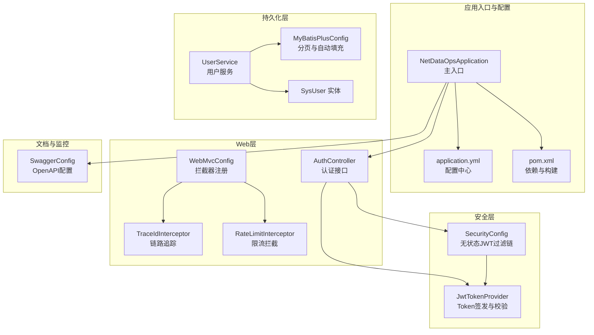
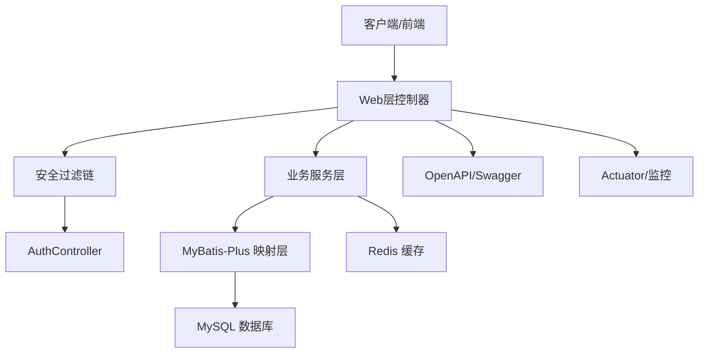
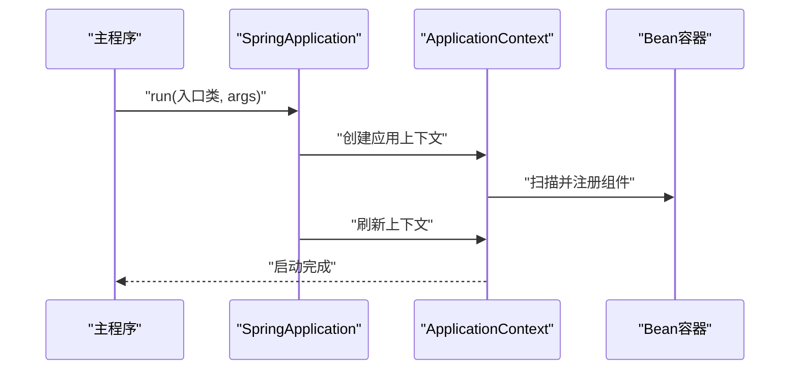
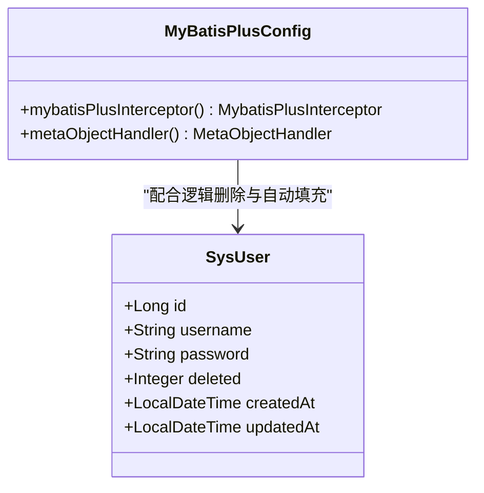
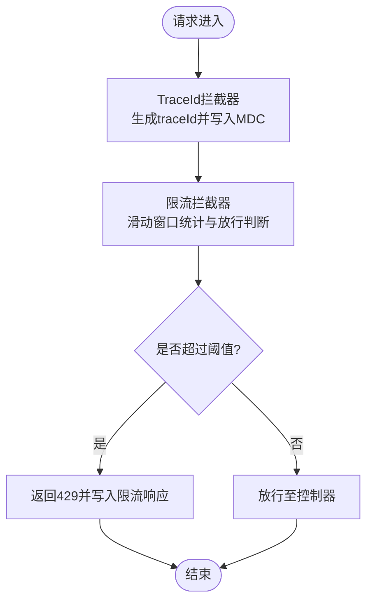
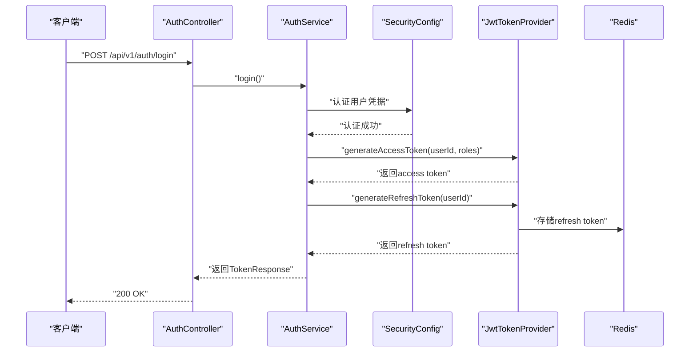
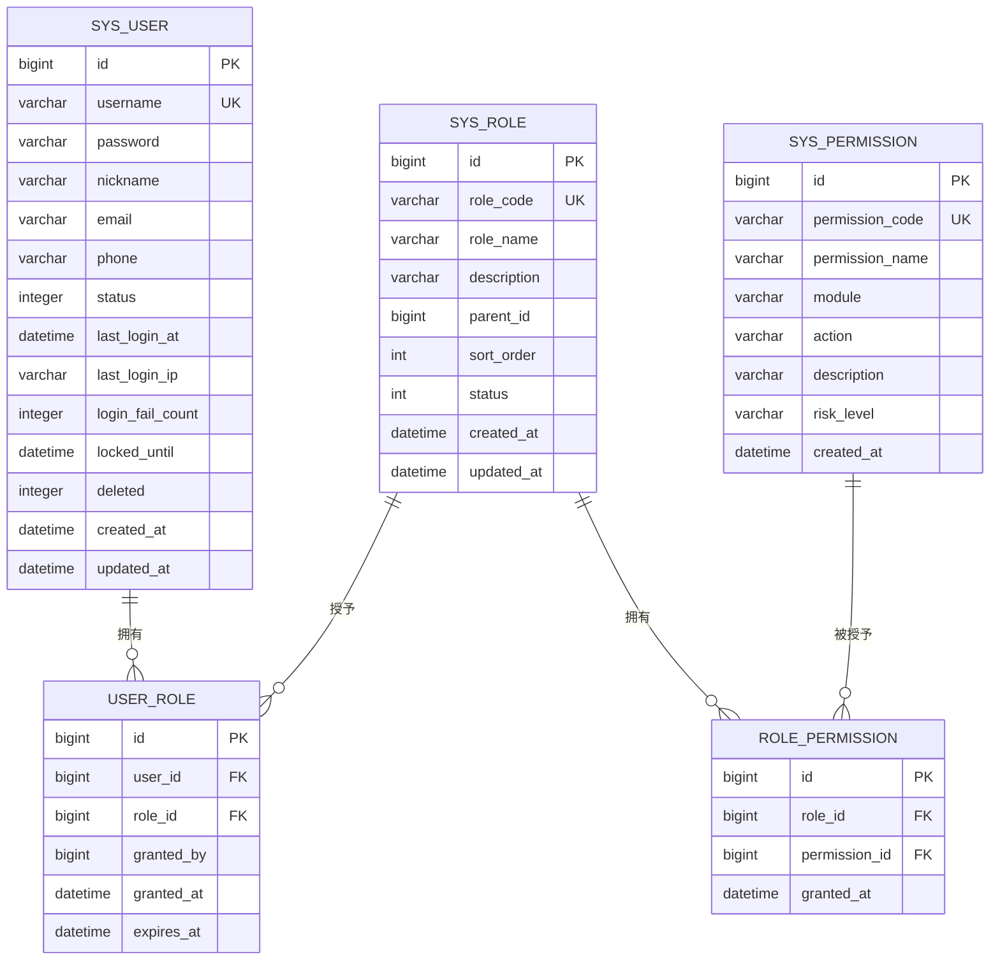
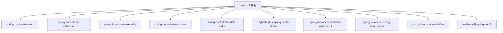

# Spring Boot应用架构

<cite>
**本文引用的文件**
- [NetDataOpsApplication.java](file://netdata-ai-backend/src/main/java/com/netdata/ops/NetDataOpsApplication.java)
- [application.yml](file://netdata-ai-backend/src/main/resources/application.yml)
- [pom.xml](file://netdata-ai-backend/pom.xml)
- [MyBatisPlusConfig.java](file://netdata-ai-backend/src/main/java/com/netdata/ops/config/MyBatisPlusConfig.java)
- [WebMvcConfig.java](file://netdata-ai-backend/src/main/java/com/netdata/ops/config/WebMvcConfig.java)
- [SwaggerConfig.java](file://netdata-ai-backend/src/main/java/com/netdata/ops/config/SwaggerConfig.java)
- [SecurityConfig.java](file://netdata-ai-backend/src/main/java/com/netdata/ops/config/SecurityConfig.java)
- [SysUser.java](file://netdata-ai-backend/src/main/java/com/netdata/ops/entity/SysUser.java)
- [UserService.java](file://netdata-ai-backend/src/main/java/com/netdata/ops/service/UserService.java)
- [AuthController.java](file://netdata-ai-backend/src/main/java/com/netdata/ops/controller/AuthController.java)
- [JwtTokenProvider.java](file://netdata-ai-backend/src/main/java/com/netdata/ops/security/JwtTokenProvider.java)
- [SecurityUtils.java](file://netdata-ai-backend/src/main/java/com/netdata/ops/util/SecurityUtils.java)
- [TraceIdInterceptor.java](file://netdata-ai-backend/src/main/java/com/netdata/ops/interceptor/TraceIdInterceptor.java)
- [RateLimitInterceptor.java](file://netdata-ai-backend/src/main/java/com/netdata/ops/interceptor/RateLimitInterceptor.java)
- [init.sql](file://sql/init.sql)
- [V2__rbac_tables.sql](file://sql/V2__rbac_tables.sql)
</cite>

## 目录
1. [简介](#简介)
2. [项目结构](#项目结构)
3. [核心组件](#核心组件)
4. [架构总览](#架构总览)
5. [详细组件分析](#详细组件分析)
6. [依赖分析](#依赖分析)
7. [性能考虑](#性能考虑)
8. [故障排查指南](#故障排查指南)
9. [结论](#结论)
10. [附录](#附录)

## 简介
本技术文档围绕“智能运维问答与执行系统”的Spring Boot后端实现，系统性梳理主入口类设计、自动配置原理、组件扫描与依赖注入机制、MyBatis-Plus配置、Web MVC与拦截器链、OpenAPI/Swagger文档配置、Spring Security无状态JWT认证、以及配置文件管理与环境变量处理等主题。文档同时提供架构图、序列图、流程图与最佳实践建议，帮助开发者快速理解并高效维护该系统。

## 项目结构
后端采用标准Spring Boot工程布局，核心代码位于netdata-ai-backend模块，主要层次如下：
- 入口类与配置：入口类位于com.netdata.ops包；配置类位于com.netdata.ops.config包
- 控制层：各业务控制器位于com.netdata.ops.controller包
- 服务层：领域服务位于com.netdata.ops.service包
- 安全与工具：安全组件在com.netdata.ops.security，通用工具在com.netdata.ops.util
- 拦截器：请求拦截器位于com.netdata.ops.interceptor
- 实体与映射：实体类位于com.netdata.ops.entity，Mapper接口位于com.netdata.ops.mapper
- 资源：application.yml位于resources根目录，包含多Profile配置与各类组件配置
- SQL：数据库初始化与RBAC迁移脚本位于sql目录

图表来源
- [NetDataOpsApplication.java:28-35](file://netdata-ai-backend/src/main/java/com/netdata/ops/NetDataOpsApplication.java#L28-L35)
- [application.yml:14-314](file://netdata-ai-backend/src/main/resources/application.yml#L14-L314)
- [pom.xml:41-238](file://netdata-ai-backend/pom.xml#L41-L238)
- [WebMvcConfig.java:14-39](file://netdata-ai-backend/src/main/java/com/netdata/ops/config/WebMvcConfig.java#L14-L39)
- [TraceIdInterceptor.java:15-43](file://netdata-ai-backend/src/main/java/com/netdata/ops/interceptor/TraceIdInterceptor.java#L15-L43)
- [RateLimitInterceptor.java:21-99](file://netdata-ai-backend/src/main/java/com/netdata/ops/interceptor/RateLimitInterceptor.java#L21-L99)
- [SecurityConfig.java:32-122](file://netdata-ai-backend/src/main/java/com/netdata/ops/config/SecurityConfig.java#L32-L122)
- [JwtTokenProvider.java:21-203](file://netdata-ai-backend/src/main/java/com/netdata/ops/security/JwtTokenProvider.java#L21-L203)
- [MyBatisPlusConfig.java:18-51](file://netdata-ai-backend/src/main/java/com/netdata/ops/config/MyBatisPlusConfig.java#L18-L51)
- [SysUser.java:11-56](file://netdata-ai-backend/src/main/java/com/netdata/ops/entity/SysUser.java#L11-L56)
- [UserService.java:30-252](file://netdata-ai-backend/src/main/java/com/netdata/ops/service/UserService.java#L30-L252)
- [SwaggerConfig.java:15-37](file://netdata-ai-backend/src/main/java/com/netdata/ops/config/SwaggerConfig.java#L15-L37)

章节来源
- [NetDataOpsApplication.java:1-36](file://netdata-ai-backend/src/main/java/com/netdata/ops/NetDataOpsApplication.java#L1-L36)
- [application.yml:1-314](file://netdata-ai-backend/src/main/resources/application.yml#L1-L314)
- [pom.xml:1-270](file://netdata-ai-backend/pom.xml#L1-L270)

## 核心组件
- 主入口类与启动流程
  - @SpringBootApplication聚合了自动配置、组件扫描与条件装配，简化启动入口
  - @EnableAsync开启异步任务执行能力，便于后台任务与耗时操作解耦
  - main方法通过SpringApplication.run启动应用上下文
- 配置文件管理与环境变量
  - application.yml集中管理服务器、数据源、Redis、Jackson、MyBatis-Plus、Spring AI、Milvus、RAG、LLM降级、异常检测、命令执行安全、JWT、Actuator、Resilience4j、Swagger、WebSocket、日志等配置
  - 通过占位符${VAR:default}实现环境变量覆盖与Profile隔离
- 自动配置与组件扫描
  - Spring Boot根据starter依赖自动装配Web、Security、Actuator、OpenAPI、Redis、MySQL、MyBatis-Plus、Resilience4j等组件
  - 组件扫描默认从入口类所在包向下扫描，确保配置类、拦截器、控制器、服务、实体等被正确发现
- 依赖注入与作用域
  - 通过@Component、@Service、@Configuration、@Bean等注解声明组件，由容器统一管理生命周期与依赖注入
- Web MVC与拦截器链
  - WebMvcConfig注册TraceId与限流拦截器，分别负责链路追踪与请求频率控制
  - 放行健康检查、Actuator、Swagger等路径，避免对监控与文档产生干扰
- Spring Security与JWT
  - 无状态JWT认证，禁用CSRF与Session，基于JWT过滤器链进行鉴权
  - JwtTokenProvider负责Token签发、校验、黑名单与刷新Token存储
- MyBatis-Plus
  - 配置分页插件与自动填充处理器，统一处理createdAt/updatedAt与逻辑删除
  - 实体类使用注解映射表与字段，结合MP提供的逻辑删除字段实现软删除
- OpenAPI/Swagger
  - 通过springdoc-openapi集成，定义API文档与安全方案，便于前后端协作

章节来源
- [NetDataOpsApplication.java:28-35](file://netdata-ai-backend/src/main/java/com/netdata/ops/NetDataOpsApplication.java#L28-L35)
- [application.yml:14-314](file://netdata-ai-backend/src/main/resources/application.yml#L14-L314)
- [WebMvcConfig.java:14-39](file://netdata-ai-backend/src/main/java/com/netdata/ops/config/WebMvcConfig.java#L14-L39)
- [SecurityConfig.java:32-122](file://netdata-ai-backend/src/main/java/com/netdata/ops/config/SecurityConfig.java#L32-L122)
- [JwtTokenProvider.java:21-203](file://netdata-ai-backend/src/main/java/com/netdata/ops/security/JwtTokenProvider.java#L21-L203)
- [MyBatisPlusConfig.java:18-51](file://netdata-ai-backend/src/main/java/com/netdata/ops/config/MyBatisPlusConfig.java#L18-L51)
- [SysUser.java:11-56](file://netdata-ai-backend/src/main/java/com/netdata/ops/entity/SysUser.java#L11-L56)
- [SwaggerConfig.java:15-37](file://netdata-ai-backend/src/main/java/com/netdata/ops/config/SwaggerConfig.java#L15-L37)

## 架构总览
系统采用分层架构，入口类负责启动与装配，Web层处理HTTP请求，安全层保障认证与授权，服务层承载业务逻辑，持久化层对接数据库与缓存，文档与监控层提供API文档与可观测性。

图表来源
- [NetDataOpsApplication.java:28-35](file://netdata-ai-backend/src/main/java/com/netdata/ops/NetDataOpsApplication.java#L28-L35)
- [AuthController.java:22-77](file://netdata-ai-backend/src/main/java/com/netdata/ops/controller/AuthController.java#L22-L77)
- [SecurityConfig.java:44-77](file://netdata-ai-backend/src/main/java/com/netdata/ops/config/SecurityConfig.java#L44-L77)
- [MyBatisPlusConfig.java:24-50](file://netdata-ai-backend/src/main/java/com/netdata/ops/config/MyBatisPlusConfig.java#L24-L50)
- [SwaggerConfig.java:18-36](file://netdata-ai-backend/src/main/java/com/netdata/ops/config/SwaggerConfig.java#L18-L36)

## 详细组件分析

### 主入口类与启动流程
- 设计要点
  - @SpringBootApplication启用自动配置与组件扫描，默认扫描入口类同级及子级包
  - @EnableAsync开启异步任务，适合执行耗时但非阻塞的任务
  - main方法调用SpringApplication.run，触发应用上下文初始化与Bean加载
- 启动流程（序列图）

图表来源
- [NetDataOpsApplication.java:32-34](file://netdata-ai-backend/src/main/java/com/netdata/ops/NetDataOpsApplication.java#L32-L34)

章节来源
- [NetDataOpsApplication.java:28-35](file://netdata-ai-backend/src/main/java/com/netdata/ops/NetDataOpsApplication.java#L28-L35)

### MyBatis-Plus配置
- 分页插件
  - 配置PaginationInnerInterceptor，设置MySQL方言与单次查询最大限制，防止超大数据量查询
- 自动填充
  - MetaObjectHandler在插入与更新时自动填充createdAt/updatedAt，确保数据一致性
- 逻辑删除
  - 在实体类中通过@TableLogic标注deleted字段，配合全局配置实现软删除
- 实体映射
  - 实体类SysUser使用@TableName与@TableField注解映射表与字段，支持驼峰与下划线转换

图表来源
- [MyBatisPlusConfig.java:18-51](file://netdata-ai-backend/src/main/java/com/netdata/ops/config/MyBatisPlusConfig.java#L18-L51)
- [SysUser.java:11-56](file://netdata-ai-backend/src/main/java/com/netdata/ops/entity/SysUser.java#L11-L56)

章节来源
- [MyBatisPlusConfig.java:18-51](file://netdata-ai-backend/src/main/java/com/netdata/ops/config/MyBatisPlusConfig.java#L18-L51)
- [SysUser.java:11-56](file://netdata-ai-backend/src/main/java/com/netdata/ops/entity/SysUser.java#L11-L56)

### Web MVC与拦截器链
- 拦截器注册
  - TraceIdInterceptor：为每个请求生成唯一traceId，写入MDC并在响应头透传
  - RateLimitInterceptor：基于Redis ZSET实现滑动窗口限流，支持按用户或IP限流
- 放行策略
  - 放行登录、刷新、健康检查、Actuator、Swagger等路径，避免影响用户体验与监控
- 顺序控制
  - TraceId拦截器先于限流拦截器执行，保证日志链路与限流统计的准确性

图表来源
- [WebMvcConfig.java:21-38](file://netdata-ai-backend/src/main/java/com/netdata/ops/config/WebMvcConfig.java#L21-L38)
- [TraceIdInterceptor.java:21-38](file://netdata-ai-backend/src/main/java/com/netdata/ops/interceptor/TraceIdInterceptor.java#L21-L38)
- [RateLimitInterceptor.java:35-68](file://netdata-ai-backend/src/main/java/com/netdata/ops/interceptor/RateLimitInterceptor.java#L35-L68)

章节来源
- [WebMvcConfig.java:14-39](file://netdata-ai-backend/src/main/java/com/netdata/ops/config/WebMvcConfig.java#L14-L39)
- [TraceIdInterceptor.java:15-43](file://netdata-ai-backend/src/main/java/com/netdata/ops/interceptor/TraceIdInterceptor.java#L15-L43)
- [RateLimitInterceptor.java:21-99](file://netdata-ai-backend/src/main/java/com/netdata/ops/interceptor/RateLimitInterceptor.java#L21-L99)

### Spring Security与JWT认证
- 过滤链
  - 禁用CSRF与Session，配置CORS，白名单路径直接放行，其余路径需认证
  - 添加JWT过滤器，使用自定义UserDetailsService与BCrypt密码编码器
- Token管理
  - JwtTokenProvider负责生成访问令牌与刷新令牌，支持黑名单与过期控制
  - 刷新令牌存储在Redis，支持主动注销与批量失效
- 工具类
  - SecurityUtils提供获取当前用户、ID、用户名与权限判断的便捷方法

图表来源
- [AuthController.java:30-57](file://netdata-ai-backend/src/main/java/com/netdata/ops/controller/AuthController.java#L30-L57)
- [SecurityConfig.java:44-77](file://netdata-ai-backend/src/main/java/com/netdata/ops/config/SecurityConfig.java#L44-L77)
- [JwtTokenProvider.java:47-84](file://netdata-ai-backend/src/main/java/com/netdata/ops/security/JwtTokenProvider.java#L47-L84)

章节来源
- [SecurityConfig.java:32-122](file://netdata-ai-backend/src/main/java/com/netdata/ops/config/SecurityConfig.java#L32-L122)
- [JwtTokenProvider.java:21-203](file://netdata-ai-backend/src/main/java/com/netdata/ops/security/JwtTokenProvider.java#L21-L203)
- [SecurityUtils.java:10-60](file://netdata-ai-backend/src/main/java/com/netdata/ops/util/SecurityUtils.java#L10-L60)

### OpenAPI/Swagger文档
- 配置要点
  - 定义API基本信息、联系人与安全方案（Bearer JWT）
  - 暴露Swagger UI与OpenAPI文档路径，支持标签排序与操作排序
- 使用建议
  - 为控制器添加Swagger注解，保持文档与接口一致
  - 在生产环境谨慎开放文档访问，必要时加入鉴权

章节来源
- [SwaggerConfig.java:15-37](file://netdata-ai-backend/src/main/java/com/netdata/ops/config/SwaggerConfig.java#L15-L37)
- [application.yml:239-248](file://netdata-ai-backend/src/main/resources/application.yml#L239-L248)

### 配置文件管理与环境变量
- 多Profile隔离
  - dev与prod两个Profile分别覆盖LLM提供商、模型与日志级别
- 环境变量覆盖
  - 数据库、Redis、LLM、JWT密钥、WebSocket等均支持通过环境变量覆盖
- 关键配置项
  - 数据源连接池、Jackson日期格式与时区、MyBatis-Plus映射与逻辑删除、Actuator指标暴露、Resilience4j监控指标、Swagger路径等

章节来源
- [application.yml:14-314](file://netdata-ai-backend/src/main/resources/application.yml#L14-L314)

### 数据模型与业务流程
- 用户实体与服务
  - SysUser实体包含逻辑删除与自动填充字段
  - UserService提供用户分页、创建、更新、删除、角色分配、密码重置等功能，并集成Redis缓存与事务
- 数据库初始化
  - init.sql与V2__rbac_tables.sql定义了系统表结构、默认数据与RBAC权限体系

图表来源
- [SysUser.java:11-56](file://netdata-ai-backend/src/main/java/com/netdata/ops/entity/SysUser.java#L11-L56)
- [init.sql:25-41](file://sql/init.sql#L25-L41)
- [V2__rbac_tables.sql:38-105](file://sql/V2__rbac_tables.sql#L38-L105)

章节来源
- [UserService.java:30-252](file://netdata-ai-backend/src/main/java/com/netdata/ops/service/UserService.java#L30-L252)
- [init.sql:1-274](file://sql/init.sql#L1-L274)
- [V2__rbac_tables.sql:1-256](file://sql/V2__rbac_tables.sql#L1-L256)

## 依赖分析
- 核心Starter
  - spring-boot-starter-web、spring-boot-starter-websocket、validation、aop、security、actuator、data-redis
- 第三方组件
  - springdoc-openapi、spring-ai-openai、mybatis-plus、mysql-connector-j、milvus-sdk-java、webflux、resilience4j
- 构建与仓库
  - 使用spring-boot-starter-parent，Maven插件与Spring里程碑仓库

图表来源
- [pom.xml:41-238](file://netdata-ai-backend/pom.xml#L41-L238)

章节来源
- [pom.xml:1-270](file://netdata-ai-backend/pom.xml#L1-L270)

## 性能考虑
- 数据库连接池
  - HikariCP参数合理设置最小空闲、最大连接、空闲超时与连接超时，避免连接泄漏与抖动
- 查询优化
  - MyBatis-Plus分页插件限制单次最大查询条数，避免大页导致内存压力
  - 合理使用索引与查询条件，避免全表扫描
- 缓存策略
  - Redis用于限流、Token存储与权限缓存，注意键空间过期策略与内存上限
- 并发与异步
  - @EnableAsync适用于非阻塞耗时任务，避免阻塞Web线程
- 监控与指标
  - Actuator与Micrometer Prometheus集成，Resilience4j指标暴露，便于容量规划与问题定位

## 故障排查指南
- 启动失败
  - 检查application.yml语法与Profile激活，确认环境变量是否正确注入
  - 查看日志输出，关注数据库连接、Redis连通性与OpenAPI文档路径
- 认证失败
  - 核对JWT密钥与过期时间配置，确认Redis中是否存在刷新令牌
  - 检查SecurityConfig放行路径与CORS配置
- 限流误伤
  - 调整RateLimitInterceptor的阈值与维度（用户ID/IP），核对Redis中ZSET键值
- 分页异常
  - 确认MyBatis-Plus分页插件与最大限制配置，检查查询条件与排序字段
- 文档无法访问
  - 核对springdoc配置路径与安全方案，确保Swagger UI与API Docs路径未被拦截

章节来源
- [application.yml:14-314](file://netdata-ai-backend/src/main/resources/application.yml#L14-L314)
- [SecurityConfig.java:44-77](file://netdata-ai-backend/src/main/java/com/netdata/ops/config/SecurityConfig.java#L44-L77)
- [RateLimitInterceptor.java:35-68](file://netdata-ai-backend/src/main/java/com/netdata/ops/interceptor/RateLimitInterceptor.java#L35-L68)
- [MyBatisPlusConfig.java:24-31](file://netdata-ai-backend/src/main/java/com/netdata/ops/config/MyBatisPlusConfig.java#L24-L31)
- [SwaggerConfig.java:18-36](file://netdata-ai-backend/src/main/java/com/netdata/ops/config/SwaggerConfig.java#L18-L36)

## 结论
该Spring Boot应用通过合理的架构分层、完善的自动配置与组件装配、严谨的安全与限流策略、以及清晰的文档与监控体系，构建了一个可扩展、可观测且易维护的智能运维平台后端。遵循本文的最佳实践与排障建议，可有效提升系统的稳定性与开发效率。

## 附录
- 配置示例与调试技巧
  - 环境变量示例：SPRING_PROFILES_ACTIVE、MYSQL_HOST、REDIS_HOST、DEEPSEEK_API_KEY、JWT_SECRET
  - 调试技巧：启用DEBUG日志、使用Actuator端点、在Swagger中测试接口、结合Redis Desktop Manager检查限流键
  - 数据库初始化：先执行init.sql，再执行V2__rbac_tables.sql，确保RBAC权限体系就绪

章节来源
- [application.yml:14-314](file://netdata-ai-backend/src/main/resources/application.yml#L14-L314)
- [init.sql:1-274](file://sql/init.sql#L1-L274)
- [V2__rbac_tables.sql:1-256](file://sql/V2__rbac_tables.sql#L1-L256)