# 业务服务层设计

<cite>
**本文引用的文件**
- [AlertService.java](file://netdata-ai-backend/src/main/java/com/netdata/ops/service/AlertService.java)
- [KnowledgeService.java](file://netdata-ai-backend/src/main/java/com/netdata/ops/service/KnowledgeService.java)
- [UserService.java](file://netdata-ai-backend/src/main/java/com/netdata/ops/service/UserService.java)
- [ApprovalService.java](file://netdata-ai-backend/src/main/java/com/netdata/ops/service/ApprovalService.java)
- [AlertRecord.java](file://netdata-ai-backend/src/main/java/com/netdata/ops/entity/AlertRecord.java)
- [KnowledgeDocument.java](file://netdata-ai-backend/src/main/java/com/netdata/ops/entity/KnowledgeDocument.java)
- [SysUser.java](file://netdata-ai-backend/src/main/java/com/netdata/ops/entity/SysUser.java)
- [PermissionRequest.java](file://netdata-ai-backend/src/main/java/com/netdata/ops/entity/PermissionRequest.java)
- [AlertRecordMapper.java](file://netdata-ai-backend/src/main/java/com/netdata/ops/mapper/AlertRecordMapper.java)
- [KnowledgeDocumentMapper.java](file://netdata-ai-backend/src/main/java/com/netdata/ops/mapper/KnowledgeDocumentMapper.java)
- [SysUserMapper.java](file://netdata-ai-backend/src/main/java/com/netdata/ops/mapper/SysUserMapper.java)
- [PermissionRequestMapper.java](file://netdata-ai-backend/src/main/java/com/netdata/ops/mapper/PermissionRequestMapper.java)
- [UserVO.java](file://netdata-ai-backend/src/main/java/com/netdata/ops/dto/response/UserVO.java)
- [BusinessException.java](file://netdata-ai-backend/src/main/java/com/netdata/ops/exception/BusinessException.java)
- [ErrorCode.java](file://netdata-ai-backend/src/main/java/com/netdata/ops/exception/ErrorCode.java)
- [application.yml](file://netdata-ai-backend/src/main/resources/application.yml)
</cite>

## 目录
1. [引言](#引言)
2. [项目结构](#项目结构)
3. [核心组件](#核心组件)
4. [架构总览](#架构总览)
5. [详细组件分析](#详细组件分析)
6. [依赖分析](#依赖分析)
7. [性能考虑](#性能考虑)
8. [故障排查指南](#故障排查指南)
9. [结论](#结论)
10. [附录](#附录)

## 引言
本文件围绕业务服务层设计，系统性梳理并解读以下服务类的职责边界、设计模式、事务管理、异常处理与数据访问模式：告警服务（AlertService）、知识服务（KnowledgeService）、用户服务（UserService）与审批服务（ApprovalService）。文档同时阐述服务层与数据访问层的交互方式、缓存策略、性能优化方法，并给出典型业务流程与最佳实践。

## 项目结构
服务层位于后端工程 netdata-ai-backend 的 service 包中，采用 Spring 注解驱动的服务类组织方式，结合 MyBatis-Plus Mapper 进行数据持久化；异常体系统一由 BusinessException 与 ErrorCode 枚举承载；应用配置集中于 application.yml，涵盖数据源、Redis、AI/Milvus/RAG 等关键能力。

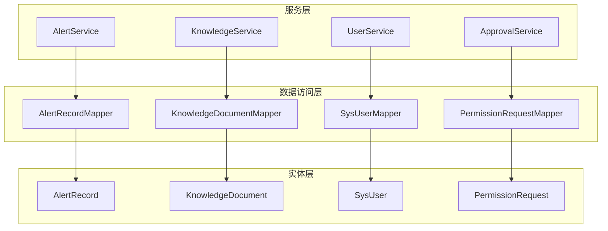

图表来源
- [AlertService.java:24-27](file://netdata-ai-backend/src/main/java/com/netdata/ops/service/AlertService.java#L24-L27)
- [KnowledgeService.java:24-27](file://netdata-ai-backend/src/main/java/com/netdata/ops/service/KnowledgeService.java#L24-L27)
- [UserService.java:27-33](file://netdata-ai-backend/src/main/java/com/netdata/ops/service/UserService.java#L27-L33)
- [ApprovalService.java:24-27](file://netdata-ai-backend/src/main/java/com/netdata/ops/service/ApprovalService.java#L24-L27)
- [AlertRecordMapper.java:11-24](file://netdata-ai-backend/src/main/java/com/netdata/ops/mapper/AlertRecordMapper.java#L11-L24)
- [KnowledgeDocumentMapper.java:7-9](file://netdata-ai-backend/src/main/java/com/netdata/ops/mapper/KnowledgeDocumentMapper.java#L7-L9)
- [SysUserMapper.java:11-33](file://netdata-ai-backend/src/main/java/com/netdata/ops/mapper/SysUserMapper.java#L11-L33)
- [PermissionRequestMapper.java:7-9](file://netdata-ai-backend/src/main/java/com/netdata/ops/mapper/PermissionRequestMapper.java#L7-L9)

章节来源
- [AlertService.java:1-237](file://netdata-ai-backend/src/main/java/com/netdata/ops/service/AlertService.java#L1-L237)
- [KnowledgeService.java:1-148](file://netdata-ai-backend/src/main/java/com/netdata/ops/service/KnowledgeService.java#L1-L148)
- [UserService.java:1-253](file://netdata-ai-backend/src/main/java/com/netdata/ops/service/UserService.java#L1-L253)
- [ApprovalService.java:1-501](file://netdata-ai-backend/src/main/java/com/netdata/ops/service/ApprovalService.java#L1-L501)

## 核心组件
- 告警服务（AlertService）
  - 职责：告警接收、去重、状态流转、批量处理、统计与趋势分析、AI诊断触发。
  - 关键点：基于注解的事务控制、条件查询与分页、统计聚合、日志与审计。
- 知识服务（KnowledgeService）
  - 职责：知识文档的创建、删除、分页查询、分类统计与状态管理。
  - 关键点：与RAG入库流程的异步衔接、状态机（处理中/已完成/失败）。
- 用户服务（UserService）
  - 职责：用户全生命周期管理、角色分配、密码重置与修改、权限缓存清理。
  - 关键点：Redis权限缓存前缀、逻辑删除、密码编码器集成。
- 审批服务（ApprovalService）
  - 职责：权限请求提交、风险评估、审批路由、多级审批、执行权限变更。
  - 关键点：请求类型区分（角色分配/权限授予/临时提权）、审批流记录、过期控制。

章节来源
- [AlertService.java:21-237](file://netdata-ai-backend/src/main/java/com/netdata/ops/service/AlertService.java#L21-L237)
- [KnowledgeService.java:21-148](file://netdata-ai-backend/src/main/java/com/netdata/ops/service/KnowledgeService.java#L21-L148)
- [UserService.java:27-253](file://netdata-ai-backend/src/main/java/com/netdata/ops/service/UserService.java#L27-L253)
- [ApprovalService.java:19-501](file://netdata-ai-backend/src/main/java/com/netdata/ops/service/ApprovalService.java#L19-L501)

## 架构总览
服务层通过 Mapper 接口与数据库交互，实体类映射表结构；异常体系统一抛出业务异常；应用配置集中管理数据源、Redis、AI/Milvus/RAG 等能力。WebSocket 用于实时通知（告警与审批），JWT 用于认证与鉴权。

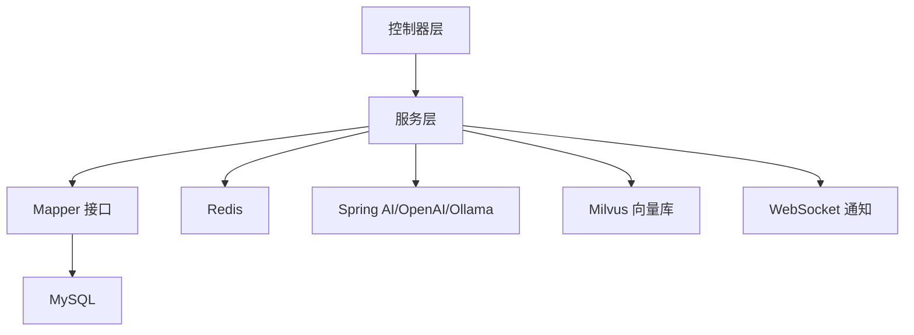

图表来源
- [application.yml:31-42](file://netdata-ai-backend/src/main/resources/application.yml#L31-L42)
- [application.yml:47-58](file://netdata-ai-backend/src/main/resources/application.yml#L47-L58)
- [application.yml:90-99](file://netdata-ai-backend/src/main/resources/application.yml#L90-L99)
- [application.yml:103-109](file://netdata-ai-backend/src/main/resources/application.yml#L103-L109)
- [application.yml:250-254](file://netdata-ai-backend/src/main/resources/application.yml#L250-L254)

## 详细组件分析

### 告警服务（AlertService）
- 设计模式与职责
  - 服务类采用注解驱动，职责清晰：查询、创建、状态变更、统计与趋势、AI诊断。
  - 使用分页包装器与条件查询实现灵活筛选。
- 事务管理
  - 关键写操作（创建、解决、批量解决、AI诊断）均标注事务，确保一致性。
- 异常处理
  - 通过 BusinessException 与 ErrorCode 统一错误码与消息。
- 数据访问模式
  - 直接使用 Mapper 进行 CRUD；通过自定义 SQL 统计聚合。
- 与实体/映射关系
  - 实体：AlertRecord；映射：AlertRecordMapper。
- 缓存与性能
  - 未在服务层直接使用缓存；可通过后续引入 Redis 缓存热点统计结果。
- 业务流程示例
  - 外部告警接入：去重判断 → 插入记录 → 返回实体。
  - 告警解决：读取 → 校验状态 → 写入解决字段 → 更新时间戳。
  - AI诊断：读取 → 生成诊断内容 → 写回 → 返回结果。
- 最佳实践
  - 对高频查询增加索引（如状态、创建时间、告警标识）。
  - 对趋势统计可做周期性归档或物化视图。

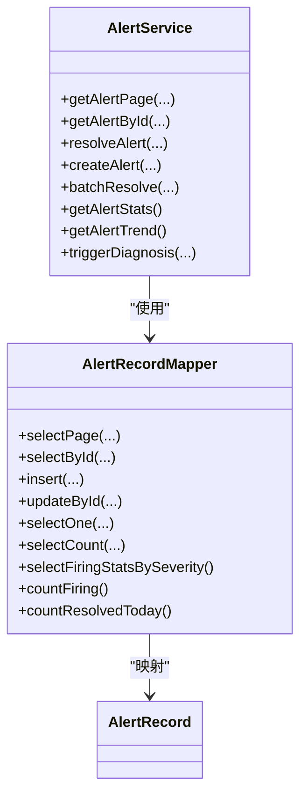

图表来源
- [AlertService.java:24-27](file://netdata-ai-backend/src/main/java/com/netdata/ops/service/AlertService.java#L24-L27)
- [AlertRecordMapper.java:11-24](file://netdata-ai-backend/src/main/java/com/netdata/ops/mapper/AlertRecordMapper.java#L11-L24)
- [AlertRecord.java:11-55](file://netdata-ai-backend/src/main/java/com/netdata/ops/entity/AlertRecord.java#L11-L55)

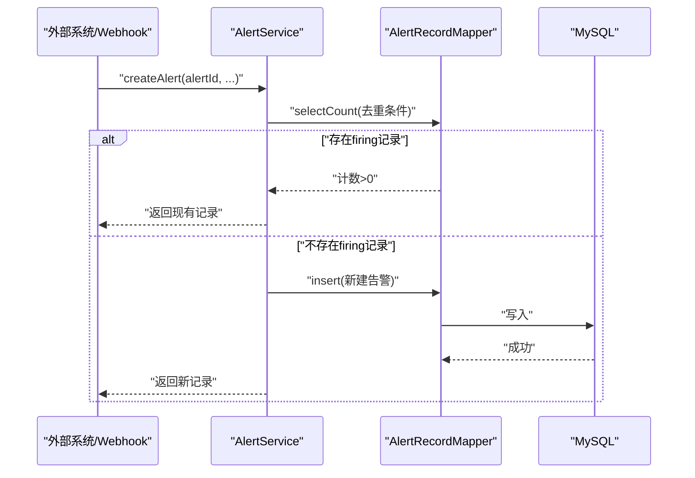

图表来源
- [AlertService.java:94-128](file://netdata-ai-backend/src/main/java/com/netdata/ops/service/AlertService.java#L94-L128)
- [AlertRecordMapper.java:11-24](file://netdata-ai-backend/src/main/java/com/netdata/ops/mapper/AlertRecordMapper.java#L11-L24)

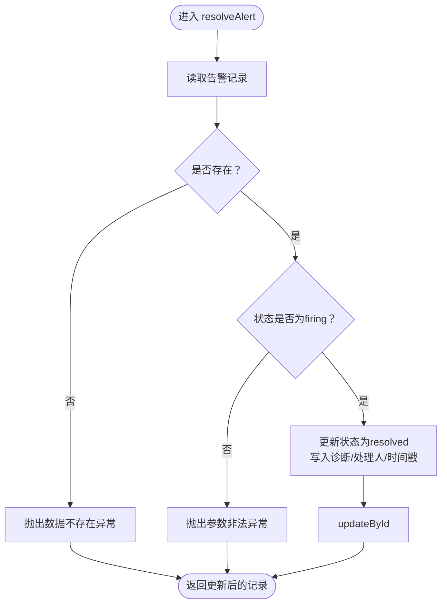

图表来源
- [AlertService.java:70-92](file://netdata-ai-backend/src/main/java/com/netdata/ops/service/AlertService.java#L70-L92)

章节来源
- [AlertService.java:21-237](file://netdata-ai-backend/src/main/java/com/netdata/ops/service/AlertService.java#L21-L237)
- [AlertRecord.java:8-55](file://netdata-ai-backend/src/main/java/com/netdata/ops/entity/AlertRecord.java#L8-L55)
- [AlertRecordMapper.java:11-24](file://netdata-ai-backend/src/main/java/com/netdata/ops/mapper/AlertRecordMapper.java#L11-L24)

### 知识服务（KnowledgeService）
- 设计模式与职责
  - 服务类负责知识文档的生命周期管理与统计。
  - 创建流程预留与 RAG 流水线的异步对接点。
- 事务管理
  - 创建与删除标注事务，保证状态一致性。
- 异常处理
  - 通过统一异常体系处理“数据不存在”等场景。
- 数据访问模式
  - 使用分页与条件查询；统计通过聚合查询实现。
- 与实体/映射关系
  - 实体：KnowledgeDocument；映射：KnowledgeDocumentMapper。
- 缓存与性能
  - 可在分类统计与文档列表上引入缓存，降低聚合成本。
- 业务流程示例
  - 文档创建：写入基础信息 → 状态置为“处理中” → 异步入库完成后更新状态。
  - 分类统计：按分类分组计数，返回分类与数量。
- 最佳实践
  - 对大文本内容进行分块与向量化入库，避免单条记录过大。
  - 对统计接口增加缓存与刷新策略。

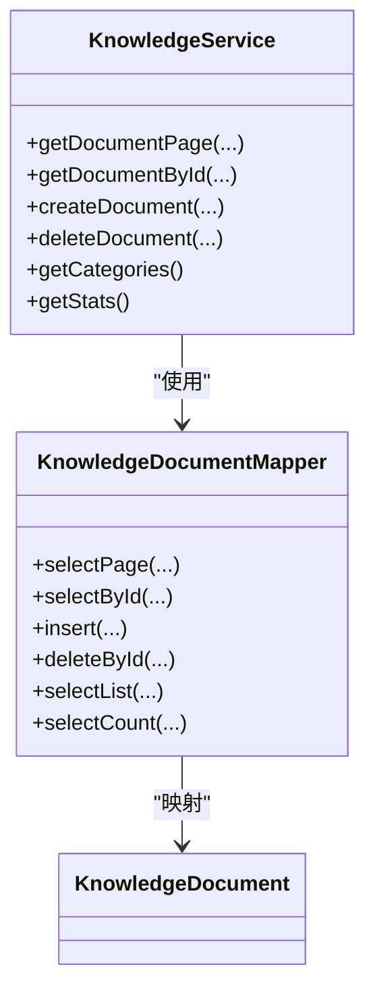

图表来源
- [KnowledgeService.java:24-27](file://netdata-ai-backend/src/main/java/com/netdata/ops/service/KnowledgeService.java#L24-L27)
- [KnowledgeDocumentMapper.java:7-9](file://netdata-ai-backend/src/main/java/com/netdata/ops/mapper/KnowledgeDocumentMapper.java#L7-L9)
- [KnowledgeDocument.java:11-46](file://netdata-ai-backend/src/main/java/com/netdata/ops/entity/KnowledgeDocument.java#L11-L46)

章节来源
- [KnowledgeService.java:21-148](file://netdata-ai-backend/src/main/java/com/netdata/ops/service/KnowledgeService.java#L21-L148)
- [KnowledgeDocument.java:8-46](file://netdata-ai-backend/src/main/java/com/netdata/ops/entity/KnowledgeDocument.java#L8-L46)
- [KnowledgeDocumentMapper.java:7-9](file://netdata-ai-backend/src/main/java/com/netdata/ops/mapper/KnowledgeDocumentMapper.java#L7-L9)

### 用户服务（UserService）
- 设计模式与职责
  - 用户全生命周期管理：创建、更新、删除（逻辑删除）、角色分配、密码管理。
  - VO 转换与权限缓存清理。
- 事务管理
  - 所有写操作标注事务，确保一致性。
- 异常处理
  - 统一使用 BusinessException 与 ErrorCode。
- 数据访问模式
  - 使用 SysUserMapper 与 UserRoleMapper；集成 RedisTemplate 进行权限缓存清理。
- 与实体/映射关系
  - 实体：SysUser；映射：SysUserMapper、UserRoleMapper。
- 缓存与性能
  - 使用 Redis 缓存用户权限，缓存键带前缀，便于失效。
- 业务流程示例
  - 创建用户：校验唯一性 → 写入用户 → 分配角色 → 记录日志。
  - 分配角色：清空旧关联 → 新增关联 → 清理权限缓存。
- 最佳实践
  - 密码必须经编码器加密存储；避免明文或弱加密。
  - 逻辑删除字段配合 MyBatis-Plus 全局逻辑删除配置。

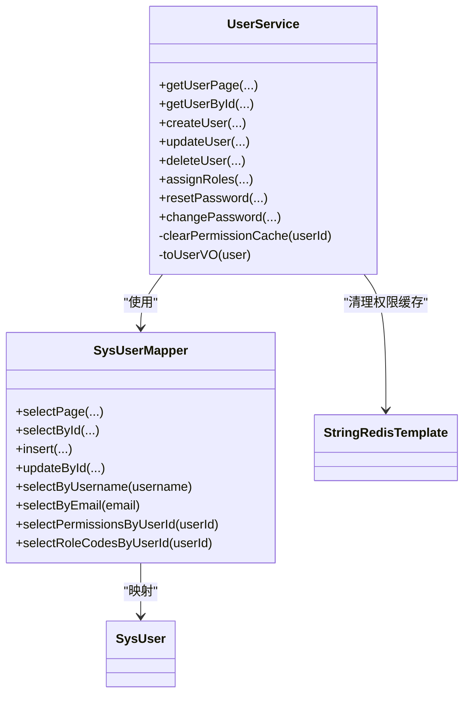

图表来源
- [UserService.java:27-38](file://netdata-ai-backend/src/main/java/com/netdata/ops/service/UserService.java#L27-L38)
- [SysUserMapper.java:11-33](file://netdata-ai-backend/src/main/java/com/netdata/ops/mapper/SysUserMapper.java#L11-L33)
- [SysUser.java:11-55](file://netdata-ai-backend/src/main/java/com/netdata/ops/entity/SysUser.java#L11-L55)

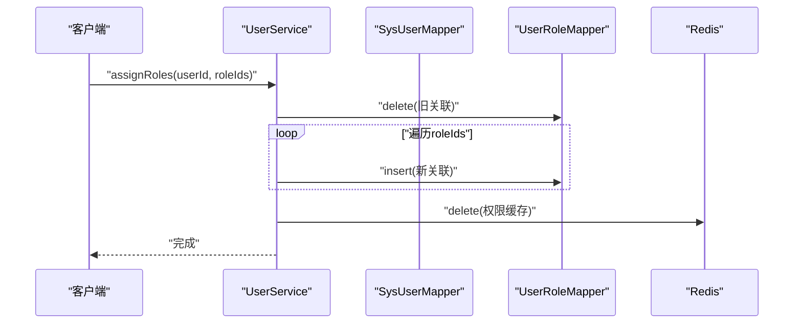

图表来源
- [UserService.java:163-187](file://netdata-ai-backend/src/main/java/com/netdata/ops/service/UserService.java#L163-L187)
- [SysUserMapper.java:11-33](file://netdata-ai-backend/src/main/java/com/netdata/ops/mapper/SysUserMapper.java#L11-L33)

章节来源
- [UserService.java:27-253](file://netdata-ai-backend/src/main/java/com/netdata/ops/service/UserService.java#L27-L253)
- [SysUser.java:8-55](file://netdata-ai-backend/src/main/java/com/netdata/ops/entity/SysUser.java#L8-L55)
- [SysUserMapper.java:11-33](file://netdata-ai-backend/src/main/java/com/netdata/ops/mapper/SysUserMapper.java#L11-L33)

### 审批服务（ApprovalService）
- 设计模式与职责
  - 审批工作流：请求提交、风险评估、审批路由、多级审批、执行权限变更。
  - 支持三类请求：角色分配、权限授予、临时提权。
- 事务管理
  - 所有审批动作标注事务，确保状态与权限变更一致。
- 异常处理
  - 严格的状态校验与权限校验，防止越权与重复处理。
- 数据访问模式
  - 多 Mapper 协作：PermissionRequestMapper、ApprovalFlowMapper、UserRoleMapper、RolePermissionMapper、SysRoleMapper、SysUserMapper。
- 与实体/映射关系
  - 实体：PermissionRequest；映射：PermissionRequestMapper。
- 缓存与性能
  - 可对审批统计与路由决策结果进行缓存。
- 业务流程示例
  - 提交请求：校验目标用户/角色 → 评估风险 → 确定审批人 → 写入请求与审批流。
  - 审批通过：高风险二级审批 → 更新请求状态 → 设置过期时间（临时提权）→ 执行权限变更。
- 最佳实践
  - 审批流记录必须完整，支持审计追溯。
  - 临时提权应设置明确过期时间并定期清理。

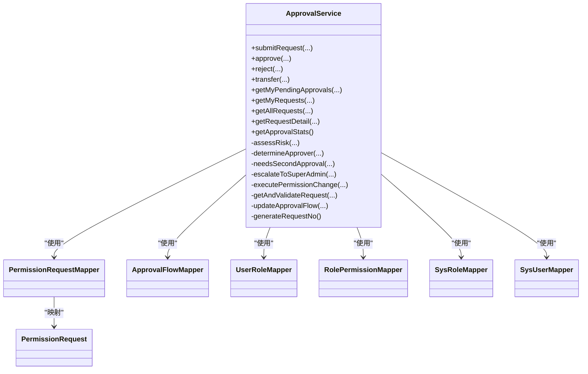

图表来源
- [ApprovalService.java:24-34](file://netdata-ai-backend/src/main/java/com/netdata/ops/service/ApprovalService.java#L24-L34)
- [PermissionRequestMapper.java:7-9](file://netdata-ai-backend/src/main/java/com/netdata/ops/mapper/PermissionRequestMapper.java#L7-L9)
- [PermissionRequest.java:11-68](file://netdata-ai-backend/src/main/java/com/netdata/ops/entity/PermissionRequest.java#L11-L68)

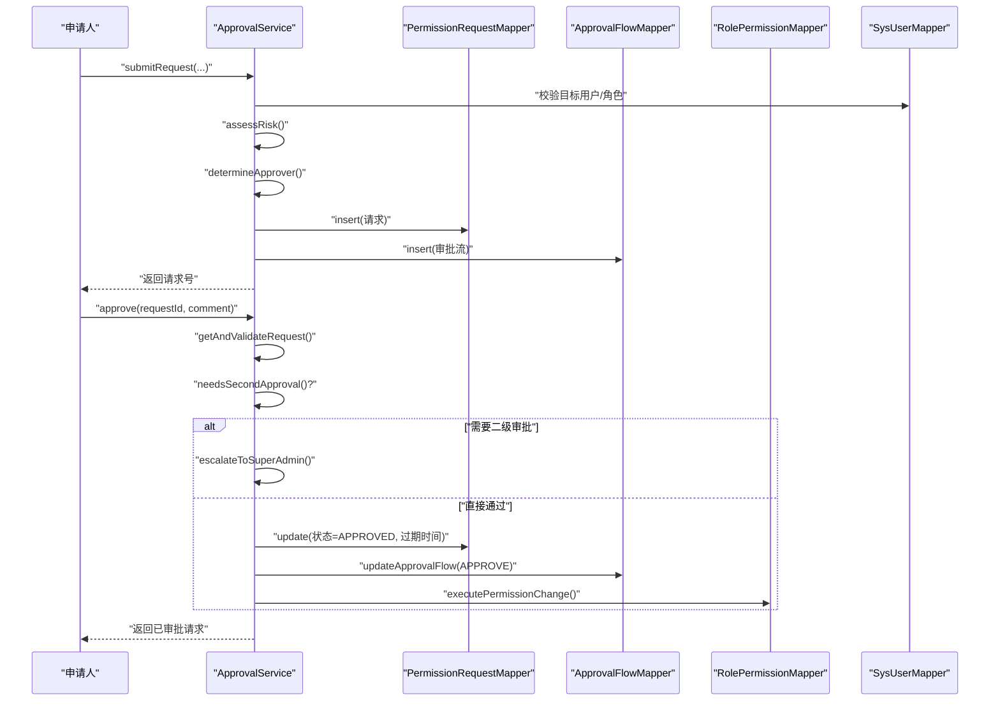

图表来源
- [ApprovalService.java:36-130](file://netdata-ai-backend/src/main/java/com/netdata/ops/service/ApprovalService.java#L36-L130)
- [ApprovalService.java:418-466](file://netdata-ai-backend/src/main/java/com/netdata/ops/service/ApprovalService.java#L418-L466)

章节来源
- [ApprovalService.java:19-501](file://netdata-ai-backend/src/main/java/com/netdata/ops/service/ApprovalService.java#L19-L501)
- [PermissionRequest.java:8-68](file://netdata-ai-backend/src/main/java/com/netdata/ops/entity/PermissionRequest.java#L8-L68)
- [PermissionRequestMapper.java:7-9](file://netdata-ai-backend/src/main/java/com/netdata/ops/mapper/PermissionRequestMapper.java#L7-L9)

## 依赖分析
- 服务层耦合
  - 各服务相对独立，通过 Mapper 与实体交互；审批服务跨多个 Mapper 协作。
- 外部依赖
  - MySQL：数据持久化；Redis：权限缓存；Spring AI/OpenAI/Ollama：LLM；Milvus：向量检索；WebSocket：实时通知。
- 配置影响
  - 数据源连接池、Redis 连接参数、AI 模型配置、RAG 参数、限流与熔断指标等。

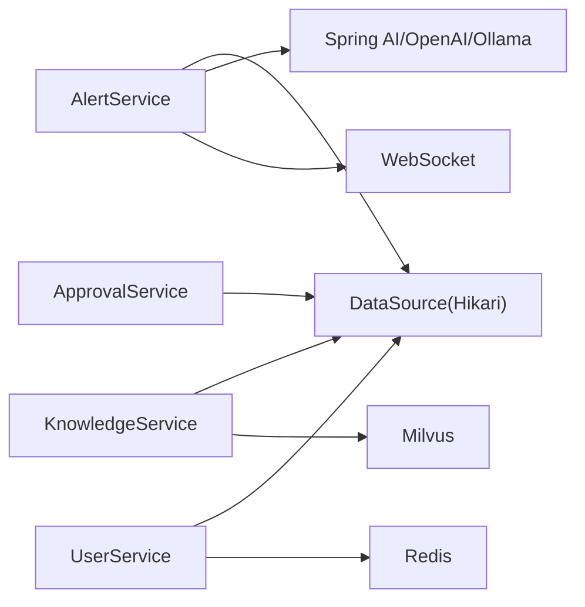

图表来源
- [application.yml:31-42](file://netdata-ai-backend/src/main/resources/application.yml#L31-L42)
- [application.yml:47-58](file://netdata-ai-backend/src/main/resources/application.yml#L47-L58)
- [application.yml:90-99](file://netdata-ai-backend/src/main/resources/application.yml#L90-L99)
- [application.yml:103-109](file://netdata-ai-backend/src/main/resources/application.yml#L103-L109)
- [application.yml:250-254](file://netdata-ai-backend/src/main/resources/application.yml#L250-L254)

章节来源
- [application.yml:1-314](file://netdata-ai-backend/src/main/resources/application.yml#L1-L314)

## 性能考虑
- 数据库层面
  - 为高频查询字段建立索引（如告警状态、创建时间、用户唯一键）。
  - 对统计类查询（趋势、分布）采用物化视图或归档表。
- 缓存策略
  - 用户权限缓存键带前缀，变更后及时失效。
  - 知识分类与统计结果可缓存，设定合理过期时间。
- 异步化
  - 知识入库与向量化可异步执行，服务快速返回。
- 并发与限流
  - 结合全局异常与限流拦截器，保障系统稳定性。
- 监控与可观测性
  - 开启 Actuator 指标、Resilience4j 熔断与重试指标，辅助容量规划。

## 故障排查指南
- 常见异常定位
  - 业务异常：检查 BusinessException 抛出位置与 ErrorCode 映射。
  - 数据不存在：核对 Mapper 查询条件与实体主键。
  - 权限不足：确认当前用户身份与审批流当前审批人匹配。
- 日志与追踪
  - application.yml 中配置了 TraceId 与日志格式，便于问题定位。
- 事务回滚
  - 确认事务注解覆盖范围与异常传播行为，避免非运行时异常导致回滚缺失。

章节来源
- [BusinessException.java:8-27](file://netdata-ai-backend/src/main/java/com/netdata/ops/exception/BusinessException.java#L8-L27)
- [ErrorCode.java:9-54](file://netdata-ai-backend/src/main/java/com/netdata/ops/exception/ErrorCode.java#L9-L54)
- [application.yml:258-270](file://netdata-ai-backend/src/main/resources/application.yml#L258-L270)

## 结论
本服务层设计遵循单一职责与清晰边界，通过注解事务、统一异常与 Mapper 访问模式，实现了告警、知识、用户与审批四大核心域的稳定运行。建议在后续迭代中完善缓存策略、异步化与可观测性建设，进一步提升性能与可维护性。

## 附录
- 接口设计原则
  - 方法职责单一，输入输出清晰；异常显式化；事务边界明确。
- 服务间协作
  - 审批服务与用户/角色/权限映射紧密协作；知识服务与 Milvus/RAG 协同；告警服务与 AI 诊断联动。
- 最佳实践清单
  - 密码加密、逻辑删除、权限缓存失效、审批流完整记录、统计结果缓存与刷新。