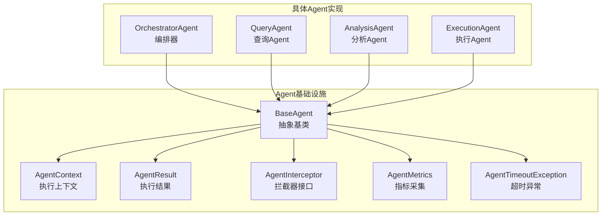
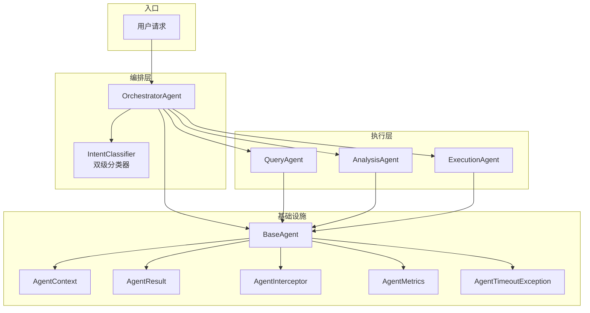
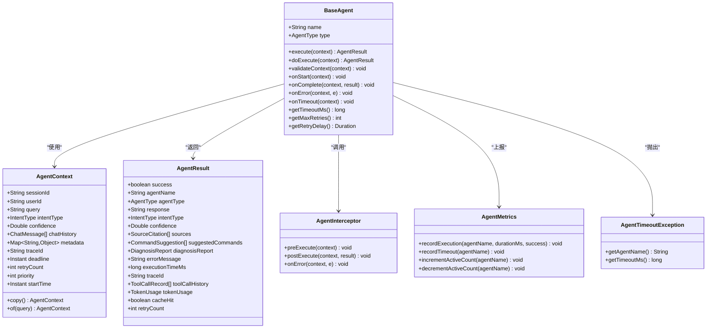
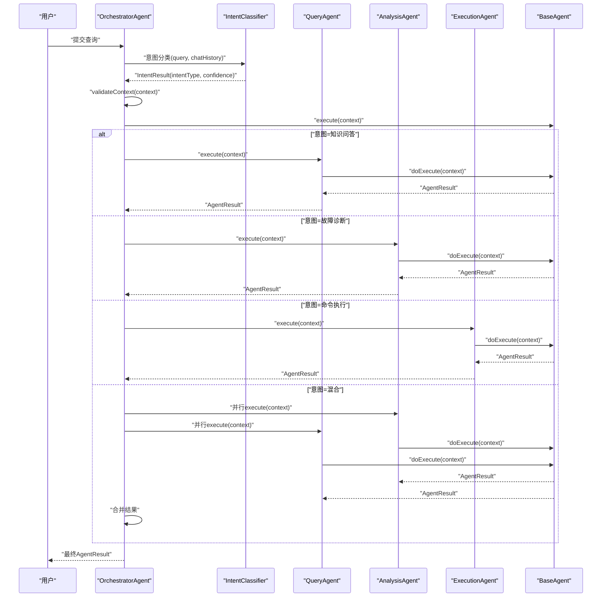
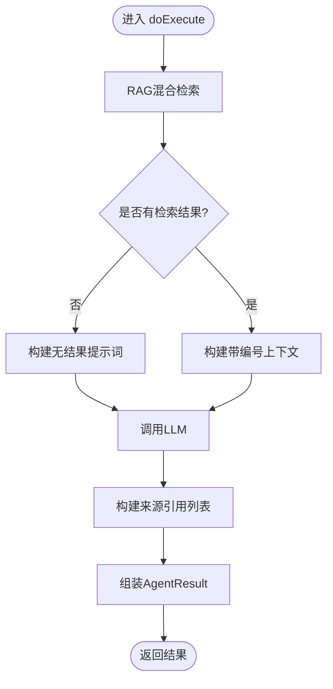
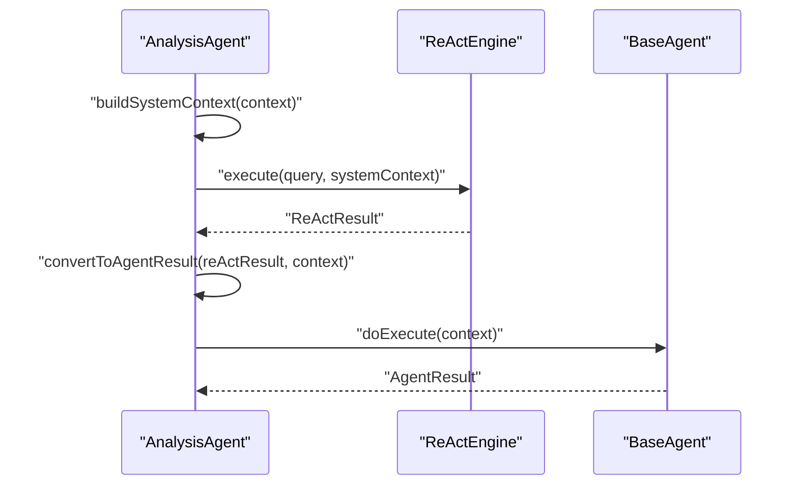
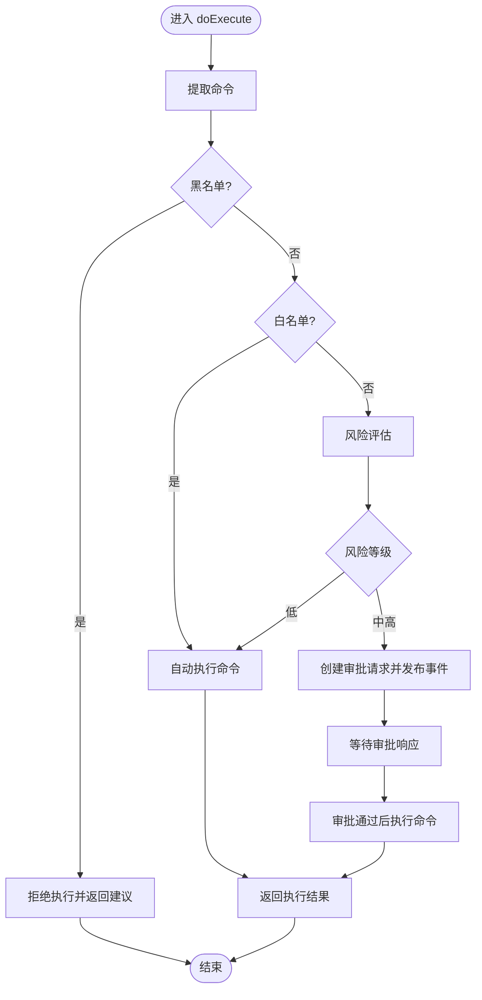
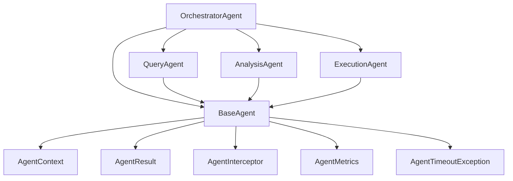

# Agent基类设计

<cite>
**本文档引用的文件**
- [BaseAgent.java](file://netdata-ai-backend/src/main/java/com/netdata/ops/core/agent/BaseAgent.java)
- [AgentContext.java](file://netdata-ai-backend/src/main/java/com/netdata/ops/core/agent/AgentContext.java)
- [AgentResult.java](file://netdata-ai-backend/src/main/java/com/netdata/ops/core/agent/AgentResult.java)
- [AgentInterceptor.java](file://netdata-ai-backend/src/main/java/com/netdata/ops/core/agent/AgentInterceptor.java)
- [LoggingAgentInterceptor.java](file://netdata-ai-backend/src/main/java/com/netdata/ops/core/agent/LoggingAgentInterceptor.java)
- [AgentMetrics.java](file://netdata-ai-backend/src/main/java/com/netdata/ops/core/agent/AgentMetrics.java)
- [AgentTimeoutException.java](file://netdata-ai-backend/src/main/java/com/netdata/ops/core/agent/AgentTimeoutException.java)
- [OrchestratorAgent.java](file://netdata-ai-backend/src/main/java/com/netdata/ops/core/agent/OrchestratorAgent.java)
- [QueryAgent.java](file://netdata-ai-backend/src/main/java/com/netdata/ops/core/agent/QueryAgent.java)
- [AnalysisAgent.java](file://netdata-ai-backend/src/main/java/com/netdata/ops/core/agent/AnalysisAgent.java)
- [ExecutionAgent.java](file://netdata-ai-backend/src/main/java/com/netdata/ops/core/agent/ExecutionAgent.java)
</cite>

## 目录
1. [简介](#简介)
2. [项目结构](#项目结构)
3. [核心组件](#核心组件)
4. [架构概览](#架构概览)
5. [详细组件分析](#详细组件分析)
6. [依赖关系分析](#依赖关系分析)
7. [性能考虑](#性能考虑)
8. [故障排查指南](#故障排查指南)
9. [结论](#结论)
10. [附录](#附录)

## 简介
本技术文档围绕Agent基类设计展开，深入解析BaseAgent抽象基类的设计模式实现（模板方法模式与策略模式）、Agent生命周期管理机制（execute方法骨架、validateContext前置验证、doExecute核心逻辑、AgentResult结果封装）、Agent类型枚举与意图类型枚举的设计理念，以及上下文管理、错误处理与性能监控等关键能力。文档还提供了继承示例与最佳实践指南，帮助开发者高效、安全地扩展Agent体系。

## 项目结构
Agent相关代码位于后端工程的core.agent包内，采用“基类 + 具体Agent实现 + 上下文/结果封装 + 拦截器/指标/异常”的分层组织方式：
- 基类与基础设施：BaseAgent、AgentContext、AgentResult、AgentInterceptor、AgentMetrics、AgentTimeoutException
- 具体Agent实现：OrchestratorAgent、QueryAgent、AnalysisAgent、ExecutionAgent
- 示例拦截器：LoggingAgentInterceptor

图表来源
- [BaseAgent.java:1-488](file://netdata-ai-backend/src/main/java/com/netdata/ops/core/agent/BaseAgent.java#L1-L488)
- [AgentContext.java:1-152](file://netdata-ai-backend/src/main/java/com/netdata/ops/core/agent/AgentContext.java#L1-L152)
- [AgentResult.java:1-194](file://netdata-ai-backend/src/main/java/com/netdata/ops/core/agent/AgentResult.java#L1-L194)
- [AgentInterceptor.java:1-48](file://netdata-ai-backend/src/main/java/com/netdata/ops/core/agent/AgentInterceptor.java#L1-L48)
- [AgentMetrics.java:1-113](file://netdata-ai-backend/src/main/java/com/netdata/ops/core/agent/AgentMetrics.java#L1-L113)
- [AgentTimeoutException.java:1-45](file://netdata-ai-backend/src/main/java/com/netdata/ops/core/agent/AgentTimeoutException.java#L1-L45)
- [OrchestratorAgent.java:1-261](file://netdata-ai-backend/src/main/java/com/netdata/ops/core/agent/OrchestratorAgent.java#L1-L261)
- [QueryAgent.java:1-181](file://netdata-ai-backend/src/main/java/com/netdata/ops/core/agent/QueryAgent.java#L1-L181)
- [AnalysisAgent.java:1-261](file://netdata-ai-backend/src/main/java/com/netdata/ops/core/agent/AnalysisAgent.java#L1-L261)
- [ExecutionAgent.java:1-425](file://netdata-ai-backend/src/main/java/com/netdata/ops/core/agent/ExecutionAgent.java#L1-L425)

章节来源
- [BaseAgent.java:1-488](file://netdata-ai-backend/src/main/java/com/netdata/ops/core/agent/BaseAgent.java#L1-L488)
- [AgentContext.java:1-152](file://netdata-ai-backend/src/main/java/com/netdata/ops/core/agent/AgentContext.java#L1-L152)
- [AgentResult.java:1-194](file://netdata-ai-backend/src/main/java/com/netdata/ops/core/agent/AgentResult.java#L1-L194)
- [AgentInterceptor.java:1-48](file://netdata-ai-backend/src/main/java/com/netdata/ops/core/agent/AgentInterceptor.java#L1-L48)
- [AgentMetrics.java:1-113](file://netdata-ai-backend/src/main/java/com/netdata/ops/core/agent/AgentMetrics.java#L1-L113)
- [AgentTimeoutException.java:1-45](file://netdata-ai-backend/src/main/java/com/netdata/ops/core/agent/AgentTimeoutException.java#L1-L45)
- [OrchestratorAgent.java:1-261](file://netdata-ai-backend/src/main/java/com/netdata/ops/core/agent/OrchestratorAgent.java#L1-L261)
- [QueryAgent.java:1-181](file://netdata-ai-backend/src/main/java/com/netdata/ops/core/agent/QueryAgent.java#L1-L181)
- [AnalysisAgent.java:1-261](file://netdata-ai-backend/src/main/java/com/netdata/ops/core/agent/AnalysisAgent.java#L1-L261)
- [ExecutionAgent.java:1-425](file://netdata-ai-backend/src/main/java/com/netdata/ops/core/agent/ExecutionAgent.java#L1-L425)

## 核心组件
本节聚焦于Agent基类与核心数据结构，阐明其职责、设计要点与扩展点。

- BaseAgent（抽象基类）
  - 设计模式：模板方法模式（execute为模板方法，doExecute为可覆写的抽象步骤）、策略模式（通过构造函数注入AgentMetrics与AgentInterceptor列表实现策略化行为）
  - 生命周期钩子：onStart/onComplete/onError/onTimeout，子类可按需覆盖
  - 超时控制：基于CompletableFuture与deadline计算，支持可配置超时与重试
  - 指标采集：通过AgentMetrics上报执行耗时、成功/失败计数、超时事件与活跃并发数
  - 拦截器链：preExecute/postExecute/onError按注册顺序执行，实现关注点分离
  - 上下文验证：validateContext对必要字段进行前置校验
  - 结果封装：统一返回AgentResult，包含业务结果与运行时元信息

- AgentContext（执行上下文）
  - 封装查询、意图、历史对话、元数据、链路追踪、截止时间、重试次数、优先级、开始时间等
  - 提供copy方法，支持并行执行场景下的上下文隔离
  - 提供of静态工厂方法，简化默认上下文创建

- AgentResult（执行结果）
  - 统一封装成功标志、响应内容、意图、置信度、来源引用、建议命令、诊断报告、错误信息、执行耗时、traceId等
  - 内置工具调用历史、Token用量、缓存命中、实际重试次数等可观测性字段
  - 内部类：SourceCitation、CommandSuggestion、DiagnosisReport、ToolCallRecord、TokenUsage

- AgentInterceptor（拦截器接口）
  - 提供preExecute/postExecute/onError三个阶段的默认空实现，便于按需覆盖
  - 与BaseAgent的拦截器链配合，实现横切关注点（日志、审计、限流、权限校验等）

- AgentMetrics（指标采集）
  - 基于Micrometer，统一采集执行耗时分布、成功/失败计数、超时事件与活跃并发数
  - 通过MeterRegistry对接Prometheus/Grafana，支持P50/P99等分位数分析

- AgentTimeoutException（超时异常）
  - 专用异常类型，携带agentName与timeoutMs，便于上层进行针对性处理（告警、降级、重试策略调整）

章节来源
- [BaseAgent.java:16-488](file://netdata-ai-backend/src/main/java/com/netdata/ops/core/agent/BaseAgent.java#L16-L488)
- [AgentContext.java:11-152](file://netdata-ai-backend/src/main/java/com/netdata/ops/core/agent/AgentContext.java#L11-L152)
- [AgentResult.java:10-194](file://netdata-ai-backend/src/main/java/com/netdata/ops/core/agent/AgentResult.java#L10-L194)
- [AgentInterceptor.java:3-48](file://netdata-ai-backend/src/main/java/com/netdata/ops/core/agent/AgentInterceptor.java#L3-L48)
- [AgentMetrics.java:12-113](file://netdata-ai-backend/src/main/java/com/netdata/ops/core/agent/AgentMetrics.java#L12-L113)
- [AgentTimeoutException.java:3-45](file://netdata-ai-backend/src/main/java/com/netdata/ops/core/agent/AgentTimeoutException.java#L3-L45)

## 架构概览
Agent体系采用“编排器-子Agent”分层架构，OrchestratorAgent负责意图识别与任务路由，QueryAgent负责知识问答，AnalysisAgent负责故障诊断，ExecutionAgent负责命令执行与审批。

图表来源
- [OrchestratorAgent.java:12-261](file://netdata-ai-backend/src/main/java/com/netdata/ops/core/agent/OrchestratorAgent.java#L12-L261)
- [QueryAgent.java:13-181](file://netdata-ai-backend/src/main/java/com/netdata/ops/core/agent/QueryAgent.java#L13-L181)
- [AnalysisAgent.java:12-261](file://netdata-ai-backend/src/main/java/com/netdata/ops/core/agent/AnalysisAgent.java#L12-L261)
- [ExecutionAgent.java:13-425](file://netdata-ai-backend/src/main/java/com/netdata/ops/core/agent/ExecutionAgent.java#L13-L425)
- [BaseAgent.java:16-488](file://netdata-ai-backend/src/main/java/com/netdata/ops/core/agent/BaseAgent.java#L16-L488)

## 详细组件分析

### BaseAgent：模板方法与策略模式的实现
- 模板方法模式
  - execute为模板方法，定义了完整的执行骨架：链路追踪初始化、deadline设置、活跃计数增加、前置拦截器、上下文验证、生命周期钩子onStart、带超时与重试的核心执行、成功路径后置拦截器与指标上报、异常路径onError与异常拦截器、finally清理
  - doExecute为抽象方法，子类仅需实现核心业务逻辑，无需感知超时、重试、拦截器等横切关注点
- 策略模式
  - 通过构造函数注入AgentMetrics与AgentInterceptor列表，实现策略化行为（指标采集、拦截器链）
  - 可配置参数（getTimeoutMs/getMaxRetries/getRetryDelay）支持子类差异化定制
- 生命周期钩子
  - onStart/onComplete/onError/onTimeout，子类可按需覆盖以实现资源初始化/释放、异常告警、超时分析等
- 上下文验证
  - validateContext对AgentContext进行前置校验（如查询内容不能为空），保证后续执行的安全性
- 结果封装
  - 统一返回AgentResult，填充agentName、agentType、traceId、executionTimeMs、success等字段

图表来源
- [BaseAgent.java:39-488](file://netdata-ai-backend/src/main/java/com/netdata/ops/core/agent/BaseAgent.java#L39-L488)
- [AgentContext.java:25-152](file://netdata-ai-backend/src/main/java/com/netdata/ops/core/agent/AgentContext.java#L25-L152)
- [AgentResult.java:23-194](file://netdata-ai-backend/src/main/java/com/netdata/ops/core/agent/AgentResult.java#L23-L194)
- [AgentInterceptor.java:17-48](file://netdata-ai-backend/src/main/java/com/netdata/ops/core/agent/AgentInterceptor.java#L17-L48)
- [AgentMetrics.java:31-113](file://netdata-ai-backend/src/main/java/com/netdata/ops/core/agent/AgentMetrics.java#L31-L113)
- [AgentTimeoutException.java:20-45](file://netdata-ai-backend/src/main/java/com/netdata/ops/core/agent/AgentTimeoutException.java#L20-L45)

章节来源
- [BaseAgent.java:87-226](file://netdata-ai-backend/src/main/java/com/netdata/ops/core/agent/BaseAgent.java#L87-L226)
- [BaseAgent.java:228-318](file://netdata-ai-backend/src/main/java/com/netdata/ops/core/agent/BaseAgent.java#L228-L318)
- [BaseAgent.java:335-367](file://netdata-ai-backend/src/main/java/com/netdata/ops/core/agent/BaseAgent.java#L335-L367)
- [BaseAgent.java:397-424](file://netdata-ai-backend/src/main/java/com/netdata/ops/core/agent/BaseAgent.java#L397-L424)

### OrchestratorAgent：意图识别与任务路由
- 职责
  - 双级意图分类：规则快速路径 + LLM语义分类，结合缓存避免重复分类
  - 任务路由：根据意图类型将任务分发给QueryAgent/AnalysisAgent/ExecutionAgent
  - 结果汇总：混合意图场景下并行执行多个子Agent并合并结果
- 并行执行
  - 使用CompletableFuture并行调用子Agent，带超时控制；异常时降级为串行执行
- 低置信度处理
  - 返回澄清响应，引导用户提供更明确的需求

图表来源
- [OrchestratorAgent.java:73-152](file://netdata-ai-backend/src/main/java/com/netdata/ops/core/agent/OrchestratorAgent.java#L73-L152)
- [OrchestratorAgent.java:154-232](file://netdata-ai-backend/src/main/java/com/netdata/ops/core/agent/OrchestratorAgent.java#L154-L232)
- [BaseAgent.java:107-226](file://netdata-ai-backend/src/main/java/com/netdata/ops/core/agent/BaseAgent.java#L107-L226)

章节来源
- [OrchestratorAgent.java:12-261](file://netdata-ai-backend/src/main/java/com/netdata/ops/core/agent/OrchestratorAgent.java#L12-L261)

### QueryAgent：RAG + LLM知识问答
- 职责
  - RAG混合检索（向量+BM25+RRF融合）
  - 构建带编号引用的Prompt上下文
  - LLM生成结构化答案（DeepSeek→Ollama降级）
  - 组装来源引用列表返回
- 安全调用
  - 通过LLMFallbackHandler获得自动降级、熔断、重试能力
  - 再次包装callLLMSafely，确保极端情况下仍返回兜底文本

图表来源
- [QueryAgent.java:63-100](file://netdata-ai-backend/src/main/java/com/netdata/ops/core/agent/QueryAgent.java#L63-L100)
- [QueryAgent.java:113-126](file://netdata-ai-backend/src/main/java/com/netdata/ops/core/agent/QueryAgent.java#L113-L126)
- [QueryAgent.java:139-151](file://netdata-ai-backend/src/main/java/com/netdata/ops/core/agent/QueryAgent.java#L139-L151)
- [QueryAgent.java:164-179](file://netdata-ai-backend/src/main/java/com/netdata/ops/core/agent/QueryAgent.java#L164-L179)

章节来源
- [QueryAgent.java:13-181](file://netdata-ai-backend/src/main/java/com/netdata/ops/core/agent/QueryAgent.java#L13-L181)

### AnalysisAgent：ReAct故障诊断
- 职责
  - 委托ReActEngine执行LLM驱动的推理循环
  - 将ReActResult转换为AgentResult（含诊断报告与命令建议）
  - 覆盖超时时间（默认2分钟），满足ReAct循环的时长需求
- 系统上下文构建
  - 意图信息、置信度、历史对话摘要、元数据、角色定位等

图表来源
- [AnalysisAgent.java:47-59](file://netdata-ai-backend/src/main/java/com/netdata/ops/core/agent/AnalysisAgent.java#L47-L59)
- [AnalysisAgent.java:108-133](file://netdata-ai-backend/src/main/java/com/netdata/ops/core/agent/AnalysisAgent.java#L108-L133)
- [AnalysisAgent.java:255-259](file://netdata-ai-backend/src/main/java/com/netdata/ops/core/agent/AnalysisAgent.java#L255-L259)

章节来源
- [AnalysisAgent.java:12-261](file://netdata-ai-backend/src/main/java/com/netdata/ops/core/agent/AnalysisAgent.java#L12-L261)

### ExecutionAgent：Human-in-the-Loop命令执行
- 职责
  - 解析用户命令、风险评估、生成审批请求、执行命令（审批通过后）、记录审计日志
  - 安全机制：黑名单（禁止执行）、白名单（自动执行）、灰名单（需要人工审批）
- 风险评估维度
  - 命令类型（40%）、影响范围（30%）、可逆性（20%）、执行频率（10%）
- 事件驱动
  - 通过AgentEventBus发布审批请求事件，等待审批响应后执行命令
  - 使用分布式锁防止重复执行

图表来源
- [ExecutionAgent.java:149-198](file://netdata-ai-backend/src/main/java/com/netdata/ops/core/agent/ExecutionAgent.java#L149-L198)
- [ExecutionAgent.java:342-395](file://netdata-ai-backend/src/main/java/com/netdata/ops/core/agent/ExecutionAgent.java#L342-L395)

章节来源
- [ExecutionAgent.java:13-425](file://netdata-ai-backend/src/main/java/com/netdata/ops/core/agent/ExecutionAgent.java#L13-L425)

## 依赖关系分析
- 组件耦合与内聚
  - BaseAgent与AgentContext/AgentResult高度内聚，形成稳定的执行骨架
  - 具体Agent实现通过继承BaseAgent获得统一的生命周期与基础设施能力
  - OrchestratorAgent对QueryAgent/AnalysisAgent/ExecutionAgent存在依赖，体现编排器-子Agent的分层关系
- 外部依赖
  - AgentMetrics依赖Micrometer进行指标采集
  - QueryAgent依赖RAGService与LLMFallbackHandler
  - ExecutionAgent依赖AgentEventBus、AgentStateManager、DistributedLockService
- 潜在循环依赖
  - 未发现循环依赖；各Agent通过接口与服务注入解耦

图表来源
- [BaseAgent.java:39-488](file://netdata-ai-backend/src/main/java/com/netdata/ops/core/agent/BaseAgent.java#L39-L488)
- [OrchestratorAgent.java:38-71](file://netdata-ai-backend/src/main/java/com/netdata/ops/core/agent/OrchestratorAgent.java#L38-L71)
- [QueryAgent.java:36-51](file://netdata-ai-backend/src/main/java/com/netdata/ops/core/agent/QueryAgent.java#L36-L51)
- [AnalysisAgent.java:33-45](file://netdata-ai-backend/src/main/java/com/netdata/ops/core/agent/AnalysisAgent.java#L33-L45)
- [ExecutionAgent.java:41-93](file://netdata-ai-backend/src/main/java/com/netdata/ops/core/agent/ExecutionAgent.java#L41-L93)

章节来源
- [BaseAgent.java:39-488](file://netdata-ai-backend/src/main/java/com/netdata/ops/core/agent/BaseAgent.java#L39-L488)
- [OrchestratorAgent.java:38-71](file://netdata-ai-backend/src/main/java/com/netdata/ops/core/agent/OrchestratorAgent.java#L38-L71)
- [QueryAgent.java:36-51](file://netdata-ai-backend/src/main/java/com/netdata/ops/core/agent/QueryAgent.java#L36-L51)
- [AnalysisAgent.java:33-45](file://netdata-ai-backend/src/main/java/com/netdata/ops/core/agent/AnalysisAgent.java#L33-L45)
- [ExecutionAgent.java:41-93](file://netdata-ai-backend/src/main/java/com/netdata/ops/core/agent/ExecutionAgent.java#L41-L93)

## 性能考虑
- 超时控制
  - 基于CompletableFuture与deadline计算，支持可配置超时与重试，避免LLM调用卡死
  - AnalysisAgent覆盖getTimeoutMs，默认2分钟，满足ReAct循环时长需求
- 指标采集
  - 通过AgentMetrics统一上报执行耗时分布、成功/失败计数、超时事件与活跃并发数，便于容量规划与性能分析
- 并行执行
  - OrchestratorAgent在混合意图场景下使用CompletableFuture并行调用子Agent，提升响应速度；异常时降级为串行执行
- 日志与链路追踪
  - 每次执行生成唯一traceId，写入SLF4J MDC，实现日志自动关联与问题定位

章节来源
- [BaseAgent.java:273-303](file://netdata-ai-backend/src/main/java/com/netdata/ops/core/agent/BaseAgent.java#L273-L303)
- [AnalysisAgent.java:255-259](file://netdata-ai-backend/src/main/java/com/netdata/ops/core/agent/AnalysisAgent.java#L255-L259)
- [AgentMetrics.java:45-97](file://netdata-ai-backend/src/main/java/com/netdata/ops/core/agent/AgentMetrics.java#L45-L97)
- [OrchestratorAgent.java:123-152](file://netdata-ai-backend/src/main/java/com/netdata/ops/core/agent/OrchestratorAgent.java#L123-L152)

## 故障排查指南
- 超时异常
  - AgentTimeoutException携带agentName与timeoutMs，便于定位超时Agent与阈值配置
  - BaseAgent在超时路径中触发onTimeout钩子与指标上报，便于告警与降级处理
- 异常路径
  - BaseAgent在异常路径中触发onError钩子与异常拦截器，统一记录ERROR日志并上报失败指标
- 日志拦截器
  - LoggingAgentInterceptor提供结构化日志输出，包含traceId、duration、success、cacheHit等关键字段，便于日志平台检索与告警规则配置
- 重试机制
  - executeWithRetry按最大重试次数与重试间隔进行重试，最后一次失败抛出RuntimeException，便于上层捕获与处理

章节来源
- [AgentTimeoutException.java:20-45](file://netdata-ai-backend/src/main/java/com/netdata/ops/core/agent/AgentTimeoutException.java#L20-L45)
- [BaseAgent.java:170-226](file://netdata-ai-backend/src/main/java/com/netdata/ops/core/agent/BaseAgent.java#L170-L226)
- [LoggingAgentInterceptor.java:23-116](file://netdata-ai-backend/src/main/java/com/netdata/ops/core/agent/LoggingAgentInterceptor.java#L23-L116)
- [BaseAgent.java:238-271](file://netdata-ai-backend/src/main/java/com/netdata/ops/core/agent/BaseAgent.java#L238-L271)

## 结论
BaseAgent通过模板方法模式与策略模式，将Agent执行的横切关注点（超时控制、重试、拦截器、指标采集、链路追踪）与核心业务逻辑解耦，实现了高内聚、低耦合的Agent基础设施。具体Agent实现（OrchestratorAgent、QueryAgent、AnalysisAgent、ExecutionAgent）在继承基础上，专注于各自领域的业务逻辑，既保证了扩展性，又确保了统一的生命周期与可观测性。该设计为工业级Agent系统提供了稳定、可维护、可扩展的基石。

## 附录

### Agent类型枚举与意图类型枚举
- Agent类型枚举（AgentType）
  - ORCHESTRATOR：编排器Agent
  - QUERY：查询Agent（RAG问答）
  - ANALYSIS：分析Agent（ReAct诊断）
  - EXECUTION：执行Agent（Human-in-Loop）
- 意图类型枚举（IntentType）
  - KNOWLEDGE_QUERY：知识问答
  - FAULT_DIAGNOSIS：故障诊断
  - COMMAND_EXECUTE：命令执行
  - HYBRID：混合意图

章节来源
- [BaseAgent.java:447-486](file://netdata-ai-backend/src/main/java/com/netdata/ops/core/agent/BaseAgent.java#L447-L486)

### 继承示例与最佳实践
- 继承示例
  - QueryAgent：继承BaseAgent，实现doExecute，专注RAG检索与LLM调用
  - AnalysisAgent：继承BaseAgent，实现doExecute，委托ReActEngine执行推理
  - ExecutionAgent：继承BaseAgent并实现AgentMessageHandler，实现命令解析、风险评估、审批流程与事件处理
- 最佳实践
  - 子类仅实现doExecute，避免在execute模板方法中添加业务逻辑
  - 合理覆盖生命周期钩子（onStart/onComplete/onError/onTimeout）以实现资源管理与异常处理
  - 通过构造函数注入AgentMetrics与AgentInterceptor列表，启用策略化能力
  - 在混合意图场景下使用并行执行与降级策略，提升系统吞吐与稳定性
  - 使用LoggingAgentInterceptor等拦截器实现统一的日志输出与可观测性

章节来源
- [QueryAgent.java:36-51](file://netdata-ai-backend/src/main/java/com/netdata/ops/core/agent/QueryAgent.java#L36-L51)
- [AnalysisAgent.java:33-45](file://netdata-ai-backend/src/main/java/com/netdata/ops/core/agent/AnalysisAgent.java#L33-L45)
- [ExecutionAgent.java:41-93](file://netdata-ai-backend/src/main/java/com/netdata/ops/core/agent/ExecutionAgent.java#L41-L93)
- [LoggingAgentInterceptor.java:23-116](file://netdata-ai-backend/src/main/java/com/netdata/ops/core/agent/LoggingAgentInterceptor.java#L23-L116)