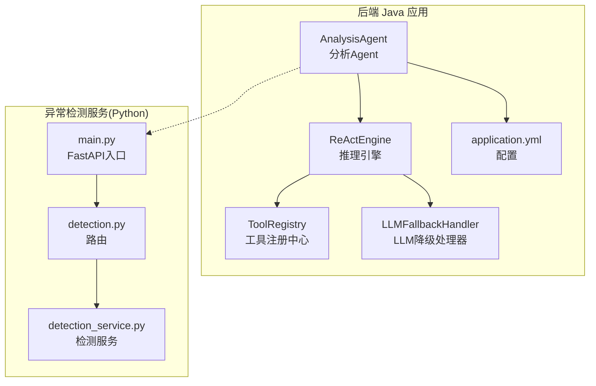
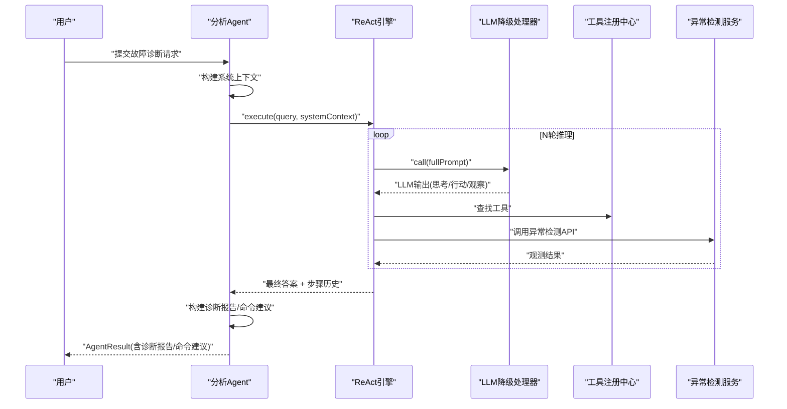
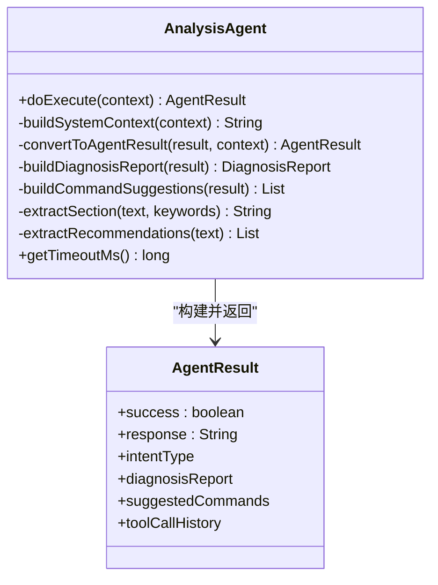
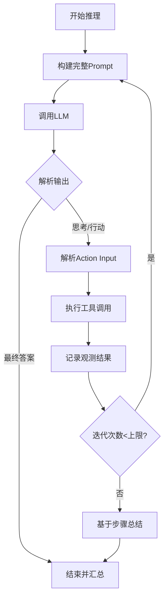
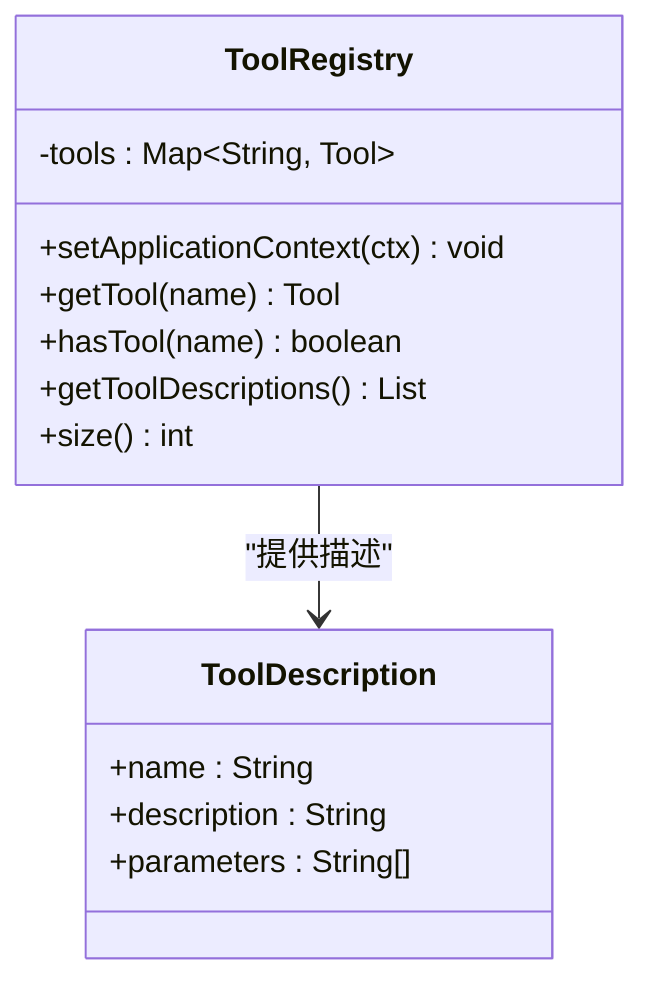
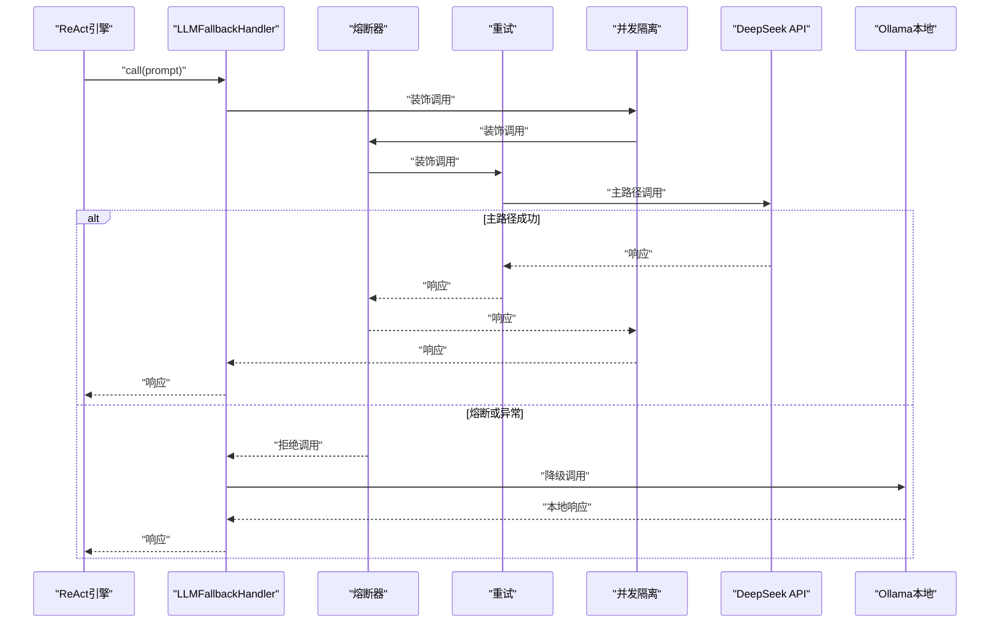
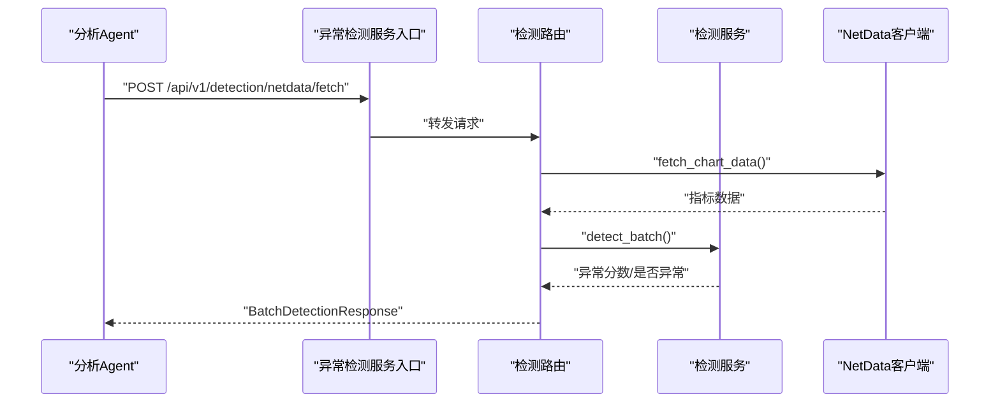
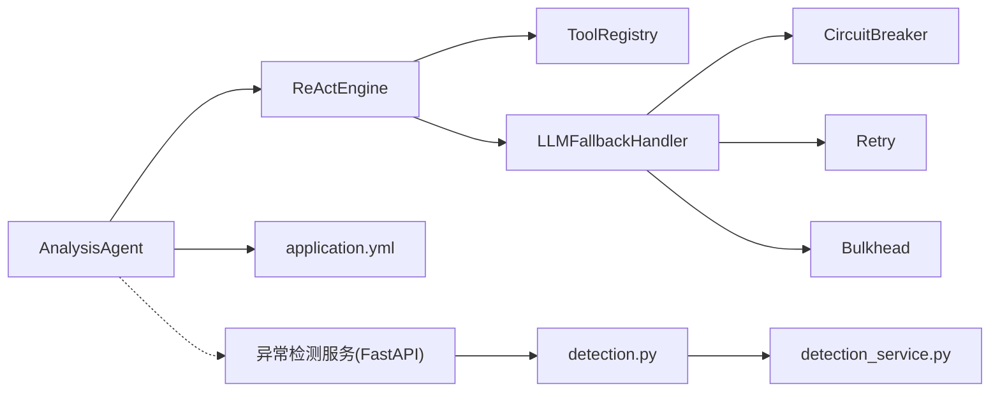

# 分析Agent

<cite>
**本文引用的文件**
- [AnalysisAgent.java](file://netdata-ai-backend/src/main/java/com/netdata/ops/core/agent/AnalysisAgent.java)
- [BaseAgent.java](file://netdata-ai-backend/src/main/java/com/netdata/ops/core/agent/BaseAgent.java)
- [ReActEngine.java](file://netdata-ai-backend/src/main/java/com/netdata/ops/core/agent/tools/ReActEngine.java)
- [ToolRegistry.java](file://netdata-ai-backend/src/main/java/com/netdata/ops/core/agent/tools/ToolRegistry.java)
- [LLMFallbackHandler.java](file://netdata-ai-backend/src/main/java/com/netdata/ops/core/ai/LLMFallbackHandler.java)
- [AgentContext.java](file://netdata-ai-backend/src/main/java/com/netdata/ops/core/agent/AgentContext.java)
- [AgentResult.java](file://netdata-ai-backend/src/main/java/com/netdata/ops/core/agent/AgentResult.java)
- [application.yml](file://netdata-ai-backend/src/main/resources/application.yml)
- [detection.py](file://anomaly-detection-service/app/api/routes/detection.py)
- [detection_service.py](file://anomaly-detection-service/app/services/detection_service.py)
- [main.py](file://anomaly-detection-service/app/main.py)
- [orchestrator-system-prompt.md](file://docs/prompts/orchestrator-system-prompt.md)
</cite>

## 目录
1. [简介](#简介)
2. [项目结构](#项目结构)
3. [核心组件](#核心组件)
4. [架构总览](#架构总览)
5. [详细组件分析](#详细组件分析)
6. [依赖关系分析](#依赖关系分析)
7. [性能考量](#性能考量)
8. [故障排查指南](#故障排查指南)
9. [结论](#结论)
10. [附录](#附录)

## 简介
本文件围绕“分析Agent”展开，重点阐述其在故障诊断中的核心作用以及ReAct推理循环的实现方式。分析Agent通过委托ReAct引擎，驱动大模型进行“思考-行动-观察”的多轮推理，结合异常检测服务、监控数据与知识库检索，完成复杂运维问题的根因分析与诊断建议生成。文档同时给出推理策略、工具调用机制、结果解释方法，并提供实际诊断案例与使用示例。

## 项目结构
该系统由后端Java应用与Python异常检测微服务组成，前后端通过HTTP API交互。分析Agent位于后端，负责接收用户查询、构建系统提示、驱动ReAct推理、调用工具（如异常检测服务）并生成诊断报告与命令建议。

**图表来源**
- [AnalysisAgent.java:1-261](file://netdata-ai-backend/src/main/java/com/netdata/ops/core/agent/AnalysisAgent.java#L1-L261)
- [ReActEngine.java:1-421](file://netdata-ai-backend/src/main/java/com/netdata/ops/core/agent/tools/ReActEngine.java#L1-L421)
- [ToolRegistry.java:1-130](file://netdata-ai-backend/src/main/java/com/netdata/ops/core/agent/tools/ToolRegistry.java#L1-L130)
- [LLMFallbackHandler.java:1-235](file://netdata-ai-backend/src/main/java/com/netdata/ops/core/ai/LLMFallbackHandler.java#L1-L235)
- [application.yml:147-155](file://netdata-ai-backend/src/main/resources/application.yml#L147-L155)
- [main.py:1-217](file://anomaly-detection-service/app/main.py#L1-L217)
- [detection.py:1-378](file://anomaly-detection-service/app/api/routes/detection.py#L1-L378)
- [detection_service.py:1-334](file://anomaly-detection-service/app/services/detection_service.py#L1-L334)

**章节来源**
- [AnalysisAgent.java:1-261](file://netdata-ai-backend/src/main/java/com/netdata/ops/core/agent/AnalysisAgent.java#L1-L261)
- [application.yml:147-155](file://netdata-ai-backend/src/main/resources/application.yml#L147-L155)
- [main.py:1-217](file://anomaly-detection-service/app/main.py#L1-L217)

## 核心组件
- 分析Agent：负责构建系统上下文、委托ReAct引擎执行推理、将结果转换为统一的AgentResult。
- ReAct引擎：驱动LLM进行多轮“思考-行动-观察”，动态选择工具并基于观测结果迭代推理。
- 工具注册中心：自动扫描并注册具备AgentTool注解的工具Bean，供ReAct引擎调用。
- LLM降级处理器：集成熔断、重试、并发隔离与主备模型切换，保障推理链路稳定。
- 异常检测服务：提供批量/流式异常检测、模型训练与NetData数据抓取能力，作为分析Agent的重要工具。
- 配置中心：集中管理LLM、Milvus、RAG、异常检测服务等配置项。

**章节来源**
- [AnalysisAgent.java:38-59](file://netdata-ai-backend/src/main/java/com/netdata/ops/core/agent/AnalysisAgent.java#L38-L59)
- [ReActEngine.java:36-60](file://netdata-ai-backend/src/main/java/com/netdata/ops/core/agent/tools/ReActEngine.java#L36-L60)
- [ToolRegistry.java:36-67](file://netdata-ai-backend/src/main/java/com/netdata/ops/core/agent/tools/ToolRegistry.java#L36-L67)
- [LLMFallbackHandler.java:41-75](file://netdata-ai-backend/src/main/java/com/netdata/ops/core/ai/LLMFallbackHandler.java#L41-L75)
- [detection.py:1-378](file://anomaly-detection-service/app/api/routes/detection.py#L1-L378)
- [application.yml:147-155](file://netdata-ai-backend/src/main/resources/application.yml#L147-L155)

## 架构总览
分析Agent在执行时遵循“模板方法 + 拦截器链 + 超时/重试/指标”的基础设施，核心流程如下：
- 接收AgentContext，构建系统上下文（包含意图、置信度、历史对话、元数据、角色定位等）。
- 委托ReAct引擎执行推理循环，LLM输出“思考-行动-观察”，ReAct引擎解析并调用工具。
- 将ReAct结果转换为AgentResult，包含诊断报告、命令建议、工具调用历史等。
- 通过异常检测服务获取监控数据，进行异常检测与根因分析。

**图表来源**
- [AnalysisAgent.java:47-59](file://netdata-ai-backend/src/main/java/com/netdata/ops/core/agent/AnalysisAgent.java#L47-L59)
- [ReActEngine.java:69-143](file://netdata-ai-backend/src/main/java/com/netdata/ops/core/agent/tools/ReActEngine.java#L69-L143)
- [LLMFallbackHandler.java:85-104](file://netdata-ai-backend/src/main/java/com/netdata/ops/core/ai/LLMFallbackHandler.java#L85-L104)
- [ToolRegistry.java:75-87](file://netdata-ai-backend/src/main/java/com/netdata/ops/core/agent/tools/ToolRegistry.java#L75-L87)
- [detection.py:291-368](file://anomaly-detection-service/app/api/routes/detection.py#L291-L368)

## 详细组件分析

### 分析Agent（故障诊断核心）
- 职责与架构
  - 委托ReAct引擎执行LLM驱动的推理循环。
  - 动态决策工具选择，替代硬编码流程。
  - 将ReAct结果转换为统一的AgentResult，包含诊断报告、命令建议与工具调用历史。
  - 超时时间覆盖为2分钟，满足复杂推理需求。
- 系统上下文构建
  - 意图类型、置信度、历史对话摘要、附加元数据、角色定位等。
  - 为LLM提供明确的“先取指标-异常检测-知识库-服务状态-综合分析”的步骤指导。
- 结果转换
  - 诊断报告：摘要、根因、证据列表、建议。
  - 命令建议：默认建议与LLM覆盖建议。
  - 工具调用历史：记录每步动作、参数与观测结果。

**图表来源**
- [AnalysisAgent.java:38-133](file://netdata-ai-backend/src/main/java/com/netdata/ops/core/agent/AnalysisAgent.java#L38-L133)
- [AgentResult.java:25-194](file://netdata-ai-backend/src/main/java/com/netdata/ops/core/agent/AgentResult.java#L25-L194)

**章节来源**
- [AnalysisAgent.java:47-133](file://netdata-ai-backend/src/main/java/com/netdata/ops/core/agent/AnalysisAgent.java#L47-L133)
- [AgentResult.java:68-176](file://netdata-ai-backend/src/main/java/com/netdata/ops/core/agent/AgentResult.java#L68-L176)

### ReAct推理引擎
- 推理循环
  - 构建包含工具列表与格式要求的完整Prompt。
  - 循环解析LLM输出，若为最终答案则结束；否则执行工具调用并将观测结果加入历史。
  - 最大迭代次数限制，达到上限后基于已有步骤总结。
- 输出解析
  - 正则解析“思考/行动/行动输入/最终答案”。
  - 容错解析Action Input JSON，支持宽松键值对解析。
- 工具调用
  - 通过工具注册中心查找工具，执行并记录耗时与结果。
- 降级与稳定性
  - LLM调用通过降级处理器集成熔断、重试、并发隔离与主备模型切换。

**图表来源**
- [ReActEngine.java:69-143](file://netdata-ai-backend/src/main/java/com/netdata/ops/core/agent/tools/ReActEngine.java#L69-L143)
- [ReActEngine.java:214-268](file://netdata-ai-backend/src/main/java/com/netdata/ops/core/agent/tools/ReActEngine.java#L214-L268)
- [ReActEngine.java:315-338](file://netdata-ai-backend/src/main/java/com/netdata/ops/core/agent/tools/ReActEngine.java#L315-L338)

**章节来源**
- [ReActEngine.java:69-143](file://netdata-ai-backend/src/main/java/com/netdata/ops/core/agent/tools/ReActEngine.java#L69-L143)
- [LLMFallbackHandler.java:85-104](file://netdata-ai-backend/src/main/java/com/netdata/ops/core/ai/LLMFallbackHandler.java#L85-L104)

### 工具注册中心
- 自动扫描：在Spring容器启动后扫描带AgentTool注解的Bean并注册。
- 描述提供：向LLM提供工具名称、描述与参数列表，辅助其进行工具选择。
- 并发安全：使用ConcurrentHashMap保证并发安全。

**图表来源**
- [ToolRegistry.java:36-105](file://netdata-ai-backend/src/main/java/com/netdata/ops/core/agent/tools/ToolRegistry.java#L36-L105)

**章节来源**
- [ToolRegistry.java:36-105](file://netdata-ai-backend/src/main/java/com/netdata/ops/core/agent/tools/ToolRegistry.java#L36-L105)

### LLM降级处理器
- 主路径：通过Spring AI ChatClient调用DeepSeek API。
- 降级路径：熔断或重试耗尽后自动切换到Ollama本地模型。
- 容错：集成Resilience4j熔断器、重试与并发隔离，记录降级次数与状态。
- 监控：提供降级次数、总调用次数、降级率与熔断器状态查询。

**图表来源**
- [LLMFallbackHandler.java:85-104](file://netdata-ai-backend/src/main/java/com/netdata/ops/core/ai/LLMFallbackHandler.java#L85-L104)
- [LLMFallbackHandler.java:159-199](file://netdata-ai-backend/src/main/java/com/netdata/ops/core/ai/LLMFallbackHandler.java#L159-L199)

**章节来源**
- [LLMFallbackHandler.java:41-235](file://netdata-ai-backend/src/main/java/com/netdata/ops/core/ai/LLMFallbackHandler.java#L41-L235)

### 异常检测服务（与分析Agent集成）
- 批量检测：对一批时序数据进行离线异常检测，支持多种算法（隔离森林、LOF、KNN等）。
- 流式检测：对单条数据进行实时异常检测，适合在线学习与告警。
- 模型训练：使用历史数据训练离线检测器并持久化。
- NetData集成：直接从NetData API抓取指标数据并进行检测。
- 配置：通过application.yml中的anomaly-detection节配置服务URL、超时与重试策略。

**图表来源**
- [detection.py:291-368](file://anomaly-detection-service/app/api/routes/detection.py#L291-L368)
- [detection_service.py:76-118](file://anomaly-detection-service/app/services/detection_service.py#L76-L118)
- [application.yml:149-154](file://netdata-ai-backend/src/main/resources/application.yml#L149-L154)

**章节来源**
- [detection.py:55-146](file://anomaly-detection-service/app/api/routes/detection.py#L55-L146)
- [detection.py:158-219](file://anomaly-detection-service/app/api/routes/detection.py#L158-L219)
- [detection.py:224-279](file://anomaly-detection-service/app/api/routes/detection.py#L224-L279)
- [detection.py:285-368](file://anomaly-detection-service/app/api/routes/detection.py#L285-L368)
- [detection_service.py:76-153](file://anomaly-detection-service/app/services/detection_service.py#L76-L153)
- [application.yml:149-154](file://netdata-ai-backend/src/main/resources/application.yml#L149-L154)

### 推理策略与工具调用机制
- 推理策略
  - 明确的角色定位与步骤指导，确保分析Agent按序执行指标获取、异常检测、知识库检索、服务状态检查与综合分析。
  - 通过AgentContext携带意图、置信度与历史对话，提升LLM决策质量。
- 工具调用机制
  - ReAct引擎解析LLM输出，动态选择工具并传入参数。
  - 工具注册中心提供工具描述列表，LLM据此做出选择。
  - 工具执行结果作为Observation反馈给LLM，形成闭环推理。
- 结果解释方法
  - 诊断报告摘要与根因截断展示，建议列表从最终答案中抽取。
  - 工具调用历史用于审计与回溯，便于定位问题环节。

**章节来源**
- [AnalysisAgent.java:64-103](file://netdata-ai-backend/src/main/java/com/netdata/ops/core/agent/AnalysisAgent.java#L64-L103)
- [AnalysisAgent.java:108-160](file://netdata-ai-backend/src/main/java/com/netdata/ops/core/agent/AnalysisAgent.java#L108-L160)
- [ReActEngine.java:168-209](file://netdata-ai-backend/src/main/java/com/netdata/ops/core/agent/tools/ReActEngine.java#L168-L209)
- [ToolRegistry.java:94-105](file://netdata-ai-backend/src/main/java/com/netdata/ops/core/agent/tools/ToolRegistry.java#L94-L105)

### 实际诊断案例与使用示例
- 场景：CPU使用率飙升
  - 用户输入：「CPU使用率突然飙升到95%，帮我排查」
  - 编排器识别意图：故障诊断（置信度高）
  - 分析Agent执行：获取指标数据、异常检测、知识库检索、服务状态检查
  - 输出：诊断报告（摘要、根因、证据）、命令建议（如查看CPU占用最高进程、按CPU排序进程、查看服务日志）
- 场景：磁盘空间不足
  - 用户输入：「告警显示磁盘满了，帮我清理临时文件」
  - 编排器识别意图：混合意图（诊断+执行）
  - 分析Agent先诊断磁盘问题，再路由执行Agent执行清理操作
  - 输出：诊断报告与执行建议

**章节来源**
- [orchestrator-system-prompt.md:28-57](file://docs/prompts/orchestrator-system-prompt.md#L28-L57)
- [AnalysisAgent.java:165-187](file://netdata-ai-backend/src/main/java/com/netdata/ops/core/agent/AnalysisAgent.java#L165-L187)

## 依赖关系分析
- 分析Agent依赖ReAct引擎与WebClient（用于直接API调用，尽管当前实现主要通过工具调用异常检测服务）。
- ReAct引擎依赖工具注册中心与LLM降级处理器。
- LLM降级处理器依赖Resilience4j组件与主备ChatClient。
- 异常检测服务通过FastAPI路由提供批量/流式检测与NetData数据抓取能力。
- 配置中心集中管理异常检测服务URL、超时与重试策略。

**图表来源**
- [AnalysisAgent.java:35-44](file://netdata-ai-backend/src/main/java/com/netdata/ops/core/agent/AnalysisAgent.java#L35-L44)
- [ReActEngine.java:36-60](file://netdata-ai-backend/src/main/java/com/netdata/ops/core/agent/tools/ReActEngine.java#L36-L60)
- [LLMFallbackHandler.java:48-69](file://netdata-ai-backend/src/main/java/com/netdata/ops/core/ai/LLMFallbackHandler.java#L48-L69)
- [application.yml:149-154](file://netdata-ai-backend/src/main/resources/application.yml#L149-L154)
- [main.py:177-187](file://anomaly-detection-service/app/main.py#L177-L187)

**章节来源**
- [AnalysisAgent.java:35-44](file://netdata-ai-backend/src/main/java/com/netdata/ops/core/agent/AnalysisAgent.java#L35-L44)
- [ReActEngine.java:36-60](file://netdata-ai-backend/src/main/java/com/netdata/ops/core/agent/tools/ReActEngine.java#L36-L60)
- [LLMFallbackHandler.java:48-69](file://netdata-ai-backend/src/main/java/com/netdata/ops/core/ai/LLMFallbackHandler.java#L48-L69)
- [application.yml:149-154](file://netdata-ai-backend/src/main/resources/application.yml#L149-L154)
- [main.py:177-187](file://anomaly-detection-service/app/main.py#L177-L187)

## 性能考量
- 超时与重试
  - 分析Agent超时时间延长至2分钟，适应复杂ReAct推理。
  - 基类提供可配置的最大重试次数与重试间隔，统一的超时控制与异常处理。
- LLM稳定性
  - 通过Resilience4j熔断、重试与并发隔离降低远端API抖动影响。
  - 主备模型切换保障服务可用性。
- 工具调用开销
  - ReAct引擎对工具执行耗时进行记录，便于审计与优化。
- 异常检测性能
  - 批量检测与流式检测分别针对离线分析与实时监控场景，合理选择算法与窗口大小。

**章节来源**
- [AnalysisAgent.java:255-259](file://netdata-ai-backend/src/main/java/com/netdata/ops/core/agent/AnalysisAgent.java#L255-L259)
- [BaseAgent.java:238-271](file://netdata-ai-backend/src/main/java/com/netdata/ops/core/agent/BaseAgent.java#L238-L271)
- [LLMFallbackHandler.java:85-126](file://netdata-ai-backend/src/main/java/com/netdata/ops/core/ai/LLMFallbackHandler.java#L85-L126)
- [ReActEngine.java:329-337](file://netdata-ai-backend/src/main/java/com/netdata/ops/core/agent/tools/ReActEngine.java#L329-L337)

## 故障排查指南
- LLM调用失败
  - 现象：推理中断，最终答案为空。
  - 排查：检查主备模型可用性、网络连通性、Resilience4j熔断状态与降级计数。
- 工具不存在或执行异常
  - 现象：Observation显示“工具不存在/执行失败”。
  - 排查：确认工具名称拼写、参数格式、工具注册情况与工具实现。
- 异常检测服务不可用
  - 现象：工具调用返回错误或超时。
  - 排查：检查服务URL、超时与重试配置、服务健康状态与日志。
- 配置问题
  - 现象：分析Agent无法连接异常检测服务或LLM。
  - 排查：核对application.yml中的anomaly-detection节与LLM配置。

**章节来源**
- [ReActEngine.java:323-337](file://netdata-ai-backend/src/main/java/com/netdata/ops/core/agent/tools/ReActEngine.java#L323-L337)
- [application.yml:149-154](file://netdata-ai-backend/src/main/resources/application.yml#L149-L154)
- [LLMFallbackHandler.java:159-199](file://netdata-ai-backend/src/main/java/com/netdata/ops/core/ai/LLMFallbackHandler.java#L159-L199)

## 结论
分析Agent通过ReAct推理引擎实现了智能化、自动化的故障诊断流程，结合异常检测服务与工具注册中心，能够对复杂运维问题进行多步骤推理与根因分析。其稳定的基础设施（超时/重试/指标/拦截器）与LLM降级策略确保了在生产环境中的可靠性。配合编排器的意图识别与路由，系统形成了从“问题识别—工具选择—数据获取—根因分析—建议生成”的完整闭环。

## 附录
- 关键配置项
  - 异常检测服务URL、超时与重试：anomaly-detection节
  - LLM主备模型与降级策略：application.yml中的LLM与Resilience4j配置
- 上下文与结果对象
  - AgentContext：封装查询、意图、历史、元数据与追踪信息
  - AgentResult：封装诊断报告、命令建议、工具调用历史与运行指标

**章节来源**
- [application.yml:149-154](file://netdata-ai-backend/src/main/resources/application.yml#L149-L154)
- [AgentContext.java:27-151](file://netdata-ai-backend/src/main/java/com/netdata/ops/core/agent/AgentContext.java#L27-L151)
- [AgentResult.java:25-194](file://netdata-ai-backend/src/main/java/com/netdata/ops/core/agent/AgentResult.java#L25-L194)