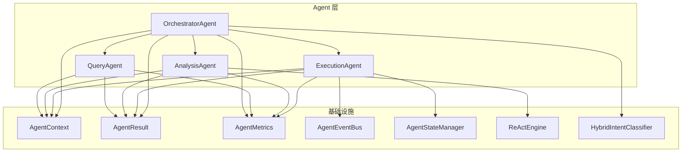
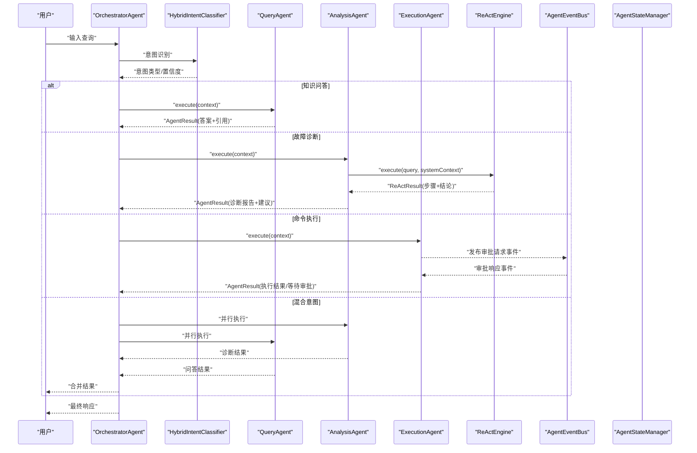
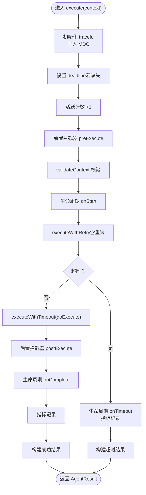
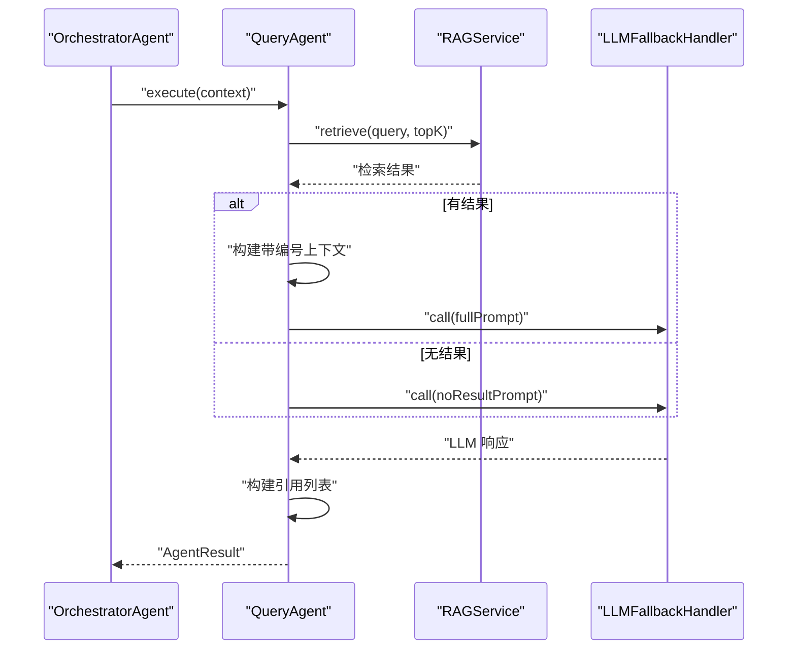
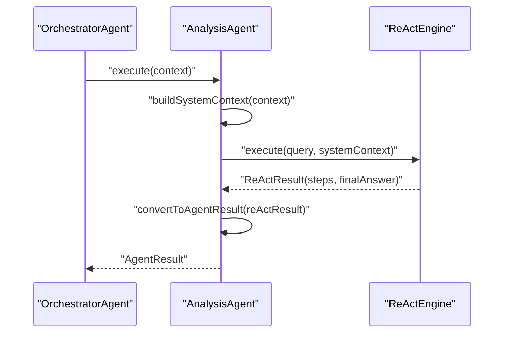
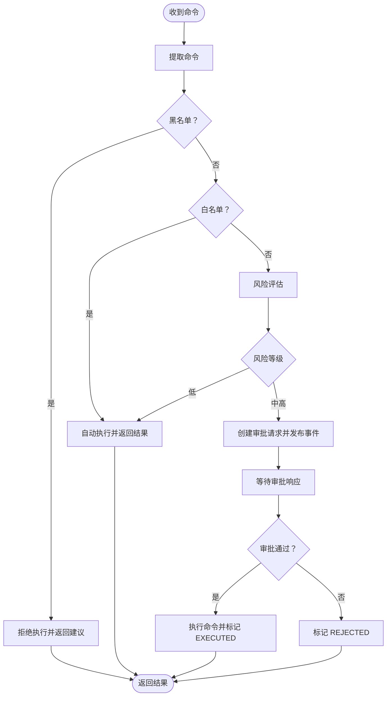
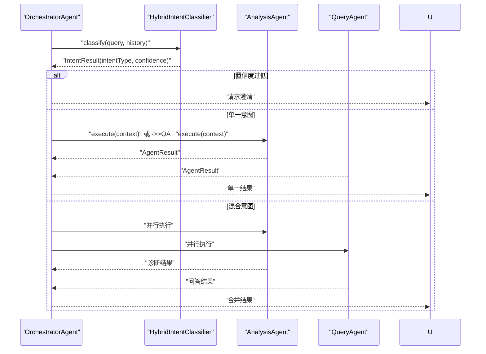
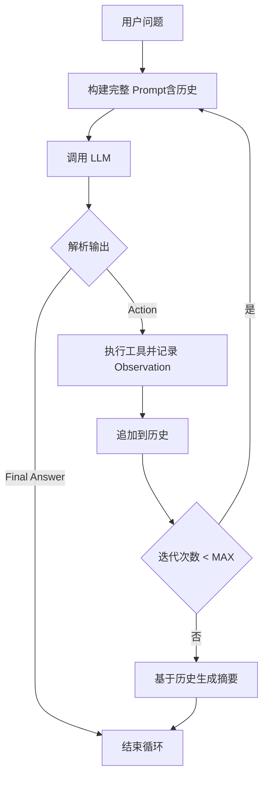
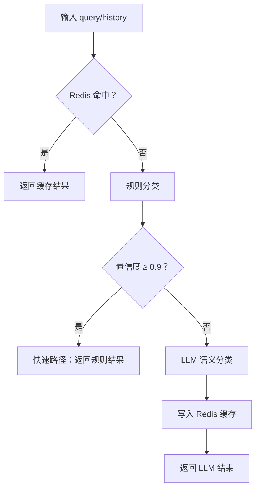
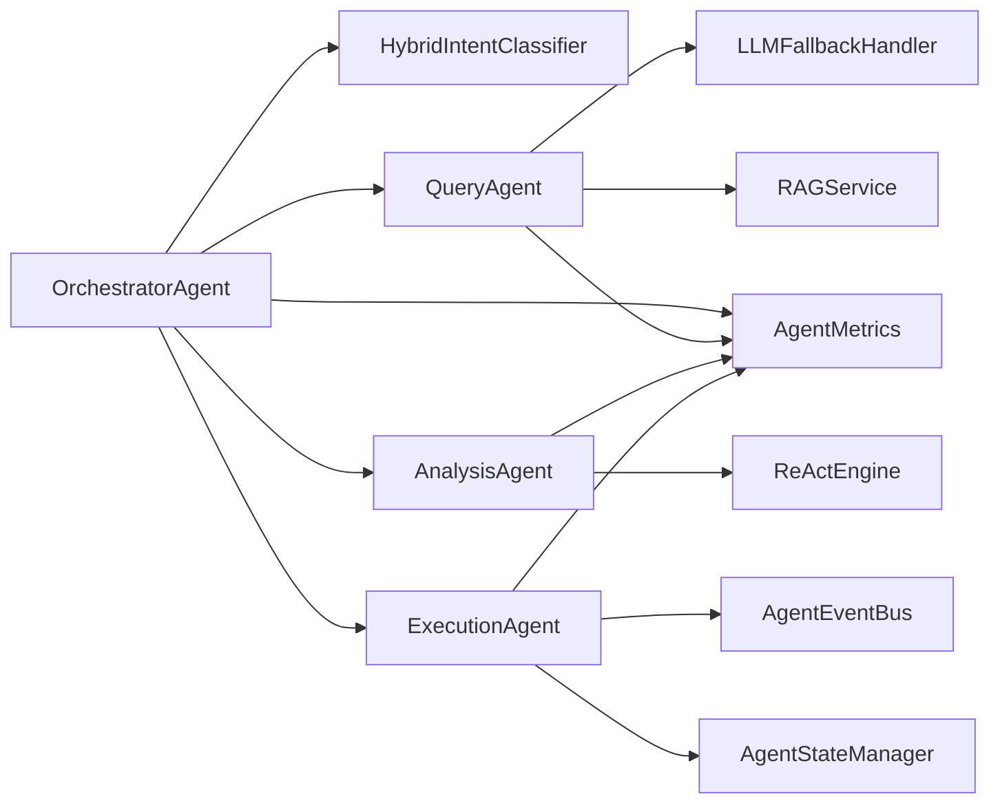

# 多智能体系统

<cite>
**本文引用的文件**
- [BaseAgent.java](file://netdata-ai-backend/src/main/java/com/netdata/ops/core/agent/BaseAgent.java)
- [QueryAgent.java](file://netdata-ai-backend/src/main/java/com/netdata/ops/core/agent/QueryAgent.java)
- [AnalysisAgent.java](file://netdata-ai-backend/src/main/java/com/netdata/ops/core/agent/AnalysisAgent.java)
- [ExecutionAgent.java](file://netdata-ai-backend/src/main/java/com/netdata/ops/core/agent/ExecutionAgent.java)
- [OrchestratorAgent.java](file://netdata-ai-backend/src/main/java/com/netdata/ops/core/agent/OrchestratorAgent.java)
- [AgentContext.java](file://netdata-ai-backend/src/main/java/com/netdata/ops/core/agent/AgentContext.java)
- [AgentResult.java](file://netdata-ai-backend/src/main/java/com/netdata/ops/core/agent/AgentResult.java)
- [AgentMetrics.java](file://netdata-ai-backend/src/main/java/com/netdata/ops/core/agent/AgentMetrics.java)
- [AgentEventBus.java](file://netdata-ai-backend/src/main/java/com/netdata/ops/core/agent/event/AgentEventBus.java)
- [AgentStateManager.java](file://netdata-ai-backend/src/main/java/com/netdata/ops/core/agent/AgentStateManager.java)
- [ReActEngine.java](file://netdata-ai-backend/src/main/java/com/netdata/ops/core/agent/tools/ReActEngine.java)
- [HybridIntentClassifier.java](file://netdata-ai-backend/src/main/java/com/netdata/ops/core/agent/intent/HybridIntentClassifier.java)
- [application.yml](file://netdata-ai-backend/src/main/resources/application.yml)
</cite>

## 目录
1. [简介](#简介)
2. [项目结构](#项目结构)
3. [核心组件](#核心组件)
4. [架构总览](#架构总览)
5. [详细组件分析](#详细组件分析)
6. [依赖分析](#依赖分析)
7. [性能考虑](#性能考虑)
8. [故障排查指南](#故障排查指南)
9. [结论](#结论)
10. [附录](#附录)

## 简介
本项目实现了一个面向运维场景的多智能体系统，围绕“编排-问答-分析-执行”的闭环设计，采用模板方法模式与拦截器链路，结合链路追踪、超时控制、重试与指标采集，提供稳定可靠的工业级 Agent 基础设施。系统包含四个核心 Agent：QueryAgent（知识问答）、AnalysisAgent（故障分析）、ExecutionAgent（命令执行）、OrchestratorAgent（意图识别与任务编排），并通过 ReAct 推理循环与工具调用实现动态决策与可观测的执行过程。

## 项目结构
- 后端采用 Spring Boot，Agent 位于 core/agent 下，按职责划分为编排、问答、分析、执行四类 Agent，以及公共基础设施（上下文、结果、指标、事件总线、状态管理、意图分类、ReAct 引擎等）。
- 配置集中在 application.yml，涵盖数据库、Redis、Milvus、RAG、LLM 降级、限流与监控等。

图表来源
- [OrchestratorAgent.java:37-68](file://netdata-ai-backend/src/main/java/com/netdata/ops/core/agent/OrchestratorAgent.java#L37-L68)
- [QueryAgent.java:36-49](file://netdata-ai-backend/src/main/java/com/netdata/ops/core/agent/QueryAgent.java#L36-L49)
- [AnalysisAgent.java:33-44](file://netdata-ai-backend/src/main/java/com/netdata/ops/core/agent/AnalysisAgent.java#L33-L44)
- [ExecutionAgent.java:41-89](file://netdata-ai-backend/src/main/java/com/netdata/ops/core/agent/ExecutionAgent.java#L41-L89)
- [AgentContext.java:27-130](file://netdata-ai-backend/src/main/java/com/netdata/ops/core/agent/AgentContext.java#L27-L130)
- [AgentResult.java:25-193](file://netdata-ai-backend/src/main/java/com/netdata/ops/core/agent/AgentResult.java#L25-L193)
- [AgentMetrics.java:31-112](file://netdata-ai-backend/src/main/java/com/netdata/ops/core/agent/AgentMetrics.java#L31-L112)
- [AgentEventBus.java:32-51](file://netdata-ai-backend/src/main/java/com/netdata/ops/core/agent/event/AgentEventBus.java#L32-L51)
- [AgentStateManager.java:32-61](file://netdata-ai-backend/src/main/java/com/netdata/ops/core/agent/AgentStateManager.java#L32-L61)
- [ReActEngine.java:38-60](file://netdata-ai-backend/src/main/java/com/netdata/ops/core/agent/tools/ReActEngine.java#L38-L60)
- [HybridIntentClassifier.java:40-72](file://netdata-ai-backend/src/main/java/com/netdata/ops/core/agent/intent/HybridIntentClassifier.java#L40-L72)

章节来源
- [application.yml:14-314](file://netdata-ai-backend/src/main/resources/application.yml#L14-L314)

## 核心组件
- BaseAgent：模板方法 + 拦截器链 + 指标采集 + 超时/重试控制，统一 Agent 生命周期与横切关注点。
- AgentContext/AgentResult：标准化上下文与结果载体，支持链路追踪、工具调用历史、Token 消耗、缓存命中等。
- AgentMetrics：基于 Micrometer 的统一指标采集，支持耗时分布、成功/失败计数、超时计数与并发数。
- AgentEventBus/AgentStateManager：事件总线与状态管理，支撑跨 Agent 通信与审批流程状态机。
- ReActEngine：LLM 驱动的 ReAct 推理引擎，动态工具选择与观察记录。
- HybridIntentClassifier：双级意图分类（规则快速路径 + LLM 语义分类 + Redis 缓存）。

章节来源
- [BaseAgent.java:39-480](file://netdata-ai-backend/src/main/java/com/netdata/ops/core/agent/BaseAgent.java#L39-L480)
- [AgentContext.java:27-130](file://netdata-ai-backend/src/main/java/com/netdata/ops/core/agent/AgentContext.java#L27-L130)
- [AgentResult.java:25-193](file://netdata-ai-backend/src/main/java/com/netdata/ops/core/agent/AgentResult.java#L25-L193)
- [AgentMetrics.java:31-112](file://netdata-ai-backend/src/main/java/com/netdata/ops/core/agent/AgentMetrics.java#L31-L112)
- [AgentEventBus.java:32-154](file://netdata-ai-backend/src/main/java/com/netdata/ops/core/agent/event/AgentEventBus.java#L32-L154)
- [AgentStateManager.java:32-258](file://netdata-ai-backend/src/main/java/com/netdata/ops/core/agent/AgentStateManager.java#L32-L258)
- [ReActEngine.java:38-420](file://netdata-ai-backend/src/main/java/com/netdata/ops/core/agent/tools/ReActEngine.java#L38-L420)
- [HybridIntentClassifier.java:40-181](file://netdata-ai-backend/src/main/java/com/netdata/ops/core/agent/intent/HybridIntentClassifier.java#L40-L181)

## 架构总览
系统采用“编排-子 Agent”分层架构：
- OrchestratorAgent 负责意图识别与任务路由，支持混合意图并行执行与降级策略。
- QueryAgent 基于 RAG + LLM 的问答流程，提供结构化答案与引用。
- AnalysisAgent 基于 ReAct 引擎进行动态推理，输出诊断报告与命令建议。
- ExecutionAgent 实现命令解析、风险评估、审批流程与执行，保障安全可控。

图表来源
- [OrchestratorAgent.java:70-145](file://netdata-ai-backend/src/main/java/com/netdata/ops/core/agent/OrchestratorAgent.java#L70-L145)
- [HybridIntentClassifier.java:74-109](file://netdata-ai-backend/src/main/java/com/netdata/ops/core/agent/intent/HybridIntentClassifier.java#L74-L109)
- [QueryAgent.java:61-98](file://netdata-ai-backend/src/main/java/com/netdata/ops/core/agent/QueryAgent.java#L61-L98)
- [AnalysisAgent.java:46-58](file://netdata-ai-backend/src/main/java/com/netdata/ops/core/agent/AnalysisAgent.java#L46-L58)
- [ExecutionAgent.java:133-182](file://netdata-ai-backend/src/main/java/com/netdata/ops/core/agent/ExecutionAgent.java#L133-L182)
- [ReActEngine.java:69-143](file://netdata-ai-backend/src/main/java/com/netdata/ops/core/agent/tools/ReActEngine.java#L69-L143)
- [AgentEventBus.java:96-133](file://netdata-ai-backend/src/main/java/com/netdata/ops/core/agent/event/AgentEventBus.java#L96-L133)
- [AgentStateManager.java:112-171](file://netdata-ai-backend/src/main/java/com/netdata/ops/core/agent/AgentStateManager.java#L112-L171)

## 详细组件分析

### BaseAgent 抽象基类与模板方法
- 设计模式：模板方法 + 策略 + 拦截器链，统一生命周期钩子（onStart/onComplete/onError/onTimeout）与超时/重试控制。
- 关键能力：
  - 链路追踪：traceId 注入 MDC，支持父子 traceId 传递。
  - 超时控制：基于剩余时间计算与 CompletableFuture 超时取消。
  - 重试机制：可配置最大重试次数与间隔，区分超时与异常路径。
  - 指标采集：基于 Micrometer 的 Timer/Counter/Gauge。
  - 拦截器链：preExecute/postExecute/onError 可插拔。
- 可配置项：超时时间、最大重试次数、重试间隔、上下文校验。
- 生命周期钩子：子类可覆盖 onStart/onComplete/onError/onTimeout 实现审计、降级、告警等。

图表来源
- [BaseAgent.java:107-222](file://netdata-ai-backend/src/main/java/com/netdata/ops/core/agent/BaseAgent.java#L107-L222)
- [BaseAgent.java:234-295](file://netdata-ai-backend/src/main/java/com/netdata/ops/core/agent/BaseAgent.java#L234-L295)
- [BaseAgent.java:318-325](file://netdata-ai-backend/src/main/java/com/netdata/ops/core/agent/BaseAgent.java#L318-L325)
- [BaseAgent.java:397-404](file://netdata-ai-backend/src/main/java/com/netdata/ops/core/agent/BaseAgent.java#L397-L404)

章节来源
- [BaseAgent.java:39-480](file://netdata-ai-backend/src/main/java/com/netdata/ops/core/agent/BaseAgent.java#L39-L480)

### QueryAgent：问答 Agent
- 职责：RAG 检索 + Prompt 构建 + LLM 生成 + 引用构建。
- 特性：
  - 混合检索（向量 + BM25 + RRF 融合），无结果时使用兜底提示词。
  - LLM 调用通过降级处理器（DeepSeek → Ollama），极端异常时兜底返回。
  - 结构化引用列表，前端可点击溯源。
- 输出：AgentResult（success/response/sources/confidence/cacheHit）。

图表来源
- [QueryAgent.java:61-98](file://netdata-ai-backend/src/main/java/com/netdata/ops/core/agent/QueryAgent.java#L61-L98)
- [QueryAgent.java:111-124](file://netdata-ai-backend/src/main/java/com/netdata/ops/core/agent/QueryAgent.java#L111-L124)
- [QueryAgent.java:137-149](file://netdata-ai-backend/src/main/java/com/netdata/ops/core/agent/QueryAgent.java#L137-L149)
- [QueryAgent.java:162-177](file://netdata-ai-backend/src/main/java/com/netdata/ops/core/agent/QueryAgent.java#L162-L177)

章节来源
- [QueryAgent.java:36-179](file://netdata-ai-backend/src/main/java/com/netdata/ops/core/agent/QueryAgent.java#L36-L179)

### AnalysisAgent：故障分析 Agent
- 职责：委托 ReActEngine 执行推理循环，动态工具选择，输出诊断报告与命令建议。
- 特性：
  - 构建系统上下文（意图、置信度、历史、元数据、角色定位）。
  - 将 ReActResult 转换为 AgentResult（诊断摘要、根因、证据、建议、工具调用历史）。
  - 覆盖超时时间（默认 2 分钟），适配 ReAct 循环较长的推理时间。
- 输出：AgentResult（diagnosisReport/suggestedCommands/toolCallHistory）。

图表来源
- [AnalysisAgent.java:46-58](file://netdata-ai-backend/src/main/java/com/netdata/ops/core/agent/AnalysisAgent.java#L46-L58)
- [AnalysisAgent.java:107-132](file://netdata-ai-backend/src/main/java/com/netdata/ops/core/agent/AnalysisAgent.java#L107-L132)
- [AnalysisAgent.java:255-258](file://netdata-ai-backend/src/main/java/com/netdata/ops/core/agent/AnalysisAgent.java#L255-L258)
- [ReActEngine.java:69-143](file://netdata-ai-backend/src/main/java/com/netdata/ops/core/agent/tools/ReActEngine.java#L69-L143)

章节来源
- [AnalysisAgent.java:33-260](file://netdata-ai-backend/src/main/java/com/netdata/ops/core/agent/AnalysisAgent.java#L33-L260)

### ExecutionAgent：命令执行 Agent
- 职责：命令解析、风险评估、审批流程、执行与审计。
- 特性：
  - 命令黑名单/白名单/灰名单策略，自动执行/人工审批/拒绝执行。
  - 多维度风险评估（命令类型、影响范围、可逆性、执行频率）。
  - 事件驱动审批：通过 AgentEventBus 发布/订阅审批请求与响应。
  - 审批状态管理：基于 Redis 的状态机（PENDING/APPROVED/REJECTED/EXECUTED/EXPIRED）。
- 输出：AgentResult（success/response/suggestedCommands）。

图表来源
- [ExecutionAgent.java:133-182](file://netdata-ai-backend/src/main/java/com/netdata/ops/core/agent/ExecutionAgent.java#L133-L182)
- [ExecutionAgent.java:147-181](file://netdata-ai-backend/src/main/java/com/netdata/ops/core/agent/ExecutionAgent.java#L147-L181)
- [ExecutionAgent.java:326-379](file://netdata-ai-backend/src/main/java/com/netdata/ops/core/agent/ExecutionAgent.java#L326-L379)
- [AgentEventBus.java:96-133](file://netdata-ai-backend/src/main/java/com/netdata/ops/core/agent/event/AgentEventBus.java#L96-L133)
- [AgentStateManager.java:144-171](file://netdata-ai-backend/src/main/java/com/netdata/ops/core/agent/AgentStateManager.java#L144-L171)

章节来源
- [ExecutionAgent.java:41-409](file://netdata-ai-backend/src/main/java/com/netdata/ops/core/agent/ExecutionAgent.java#L41-L409)
- [AgentEventBus.java:32-154](file://netdata-ai-backend/src/main/java/com/netdata/ops/core/agent/event/AgentEventBus.java#L32-L154)
- [AgentStateManager.java:32-258](file://netdata-ai-backend/src/main/java/com/netdata/ops/core/agent/AgentStateManager.java#L32-L258)

### OrchestratorAgent：编排与路由
- 职责：意图识别、任务路由、混合意图并行执行与降级。
- 特性：
  - 双级意图分类（规则快速路径 + LLM 语义分类 + Redis 缓存）。
  - 低置信度时请求澄清。
  - 混合意图通过 CompletableFuture 并行执行，超时降级为串行。
  - 合并多个子 Agent 的结果，统一输出。
- 输出：AgentResult（合并后的 response/suggestedCommands/diagnosisReport）。

图表来源
- [OrchestratorAgent.java:70-145](file://netdata-ai-backend/src/main/java/com/netdata/ops/core/agent/OrchestratorAgent.java#L70-L145)
- [HybridIntentClassifier.java:74-109](file://netdata-ai-backend/src/main/java/com/netdata/ops/core/agent/intent/HybridIntentClassifier.java#L74-L109)

章节来源
- [OrchestratorAgent.java:37-254](file://netdata-ai-backend/src/main/java/com/netdata/ops/core/agent/OrchestratorAgent.java#L37-L254)
- [HybridIntentClassifier.java:40-181](file://netdata-ai-backend/src/main/java/com/netdata/ops/core/agent/intent/HybridIntentClassifier.java#L40-L181)

### ReAct 推理引擎
- 职责：LLM 驱动的 ReAct 推理循环，动态工具选择与观察记录。
- 特性：
  - 最大迭代次数限制，支持 Final Answer 提前终止。
  - 正则解析 Thought/Action/Action Input/Final Answer。
  - 工具注册表与容错解析，失败时返回错误信息。
  - 历史步骤拼接到 Prompt，指导下一步推理。
- 输出：ReActResult（finalAnswer/steps/iterationCount/completed）。

图表来源
- [ReActEngine.java:69-143](file://netdata-ai-backend/src/main/java/com/netdata/ops/core/agent/tools/ReActEngine.java#L69-L143)
- [ReActEngine.java:214-268](file://netdata-ai-backend/src/main/java/com/netdata/ops/core/agent/tools/ReActEngine.java#L214-L268)
- [ReActEngine.java:315-338](file://netdata-ai-backend/src/main/java/com/netdata/ops/core/agent/tools/ReActEngine.java#L315-L338)

章节来源
- [ReActEngine.java:38-420](file://netdata-ai-backend/src/main/java/com/netdata/ops/core/agent/tools/ReActEngine.java#L38-L420)

### 意图分类器（HybridIntentClassifier）
- 职责：双级分类（规则快速路径 + LLM 语义分类）+ Redis 缓存。
- 特性：
  - 规则高置信度（>0.9）直接命中，跳过 LLM。
  - 低置信度走 LLM 分类，并将结果写入 Redis 缓存（TTL 5 分钟）。
  - 缓存 key 使用 MD5，避免过长 key。
- 输出：IntentResult（intentType/confidence/classifierSource/fromCache）。

图表来源
- [HybridIntentClassifier.java:74-109](file://netdata-ai-backend/src/main/java/com/netdata/ops/core/agent/intent/HybridIntentClassifier.java#L74-L109)
- [HybridIntentClassifier.java:117-151](file://netdata-ai-backend/src/main/java/com/netdata/ops/core/agent/intent/HybridIntentClassifier.java#L117-L151)
- [HybridIntentClassifier.java:160-180](file://netdata-ai-backend/src/main/java/com/netdata/ops/core/agent/intent/HybridIntentClassifier.java#L160-L180)

章节来源
- [HybridIntentClassifier.java:40-181](file://netdata-ai-backend/src/main/java/com/netdata/ops/core/agent/intent/HybridIntentClassifier.java#L40-L181)

## 依赖分析
- 组件耦合：
  - OrchestratorAgent 依赖 QueryAgent/AnalysisAgent/ExecutionAgent 与 HybridIntentClassifier。
  - AnalysisAgent 依赖 ReActEngine。
  - ExecutionAgent 依赖 AgentEventBus 与 AgentStateManager。
  - 所有 Agent 依赖 BaseAgent 的模板方法与基础设施。
- 外部依赖：
  - LLM：Spring AI ChatClient（DeepSeek API + Ollama 本地）。
  - 检索：Milvus 向量库 + BM25 + RRF 融合。
  - 缓存：Redis（意图分类缓存、审批状态）。
  - 监控：Micrometer + Actuator + Prometheus/Grafana。
- 可能的循环依赖：当前设计通过接口与注入避免直接循环，OrchestratorAgent 仅向上游依赖，下游 Agent 通过事件与状态管理间接交互。

图表来源
- [OrchestratorAgent.java:58-67](file://netdata-ai-backend/src/main/java/com/netdata/ops/core/agent/OrchestratorAgent.java#L58-L67)
- [AnalysisAgent.java:38-43](file://netdata-ai-backend/src/main/java/com/netdata/ops/core/agent/AnalysisAgent.java#L38-L43)
- [ExecutionAgent.java:83-88](file://netdata-ai-backend/src/main/java/com/netdata/ops/core/agent/ExecutionAgent.java#L83-L88)
- [QueryAgent.java:42-48](file://netdata-ai-backend/src/main/java/com/netdata/ops/core/agent/QueryAgent.java#L42-L48)
- [ReActEngine.java:56-59](file://netdata-ai-backend/src/main/java/com/netdata/ops/core/agent/tools/ReActEngine.java#L56-L59)
- [AgentEventBus.java:49-50](file://netdata-ai-backend/src/main/java/com/netdata/ops/core/agent/event/AgentEventBus.java#L49-L50)
- [AgentStateManager.java:57-60](file://netdata-ai-backend/src/main/java/com/netdata/ops/core/agent/AgentStateManager.java#L57-L60)
- [AgentMetrics.java:42-43](file://netdata-ai-backend/src/main/java/com/netdata/ops/core/agent/AgentMetrics.java#L42-L43)

章节来源
- [application.yml:47-154](file://netdata-ai-backend/src/main/resources/application.yml#L47-L154)

## 性能考虑
- 超时与重试：BaseAgent 统一超时控制与重试策略，避免 LLM 卡顿与外部依赖抖动。
- 并行执行：混合意图使用 CompletableFuture 并行，超时降级为串行，平衡吞吐与延迟。
- 缓存策略：意图分类缓存（Redis）与检索结果缓存（可扩展），降低 LLM 调用与检索成本。
- 指标监控：Micrometer 指标暴露至 Prometheus，支持 P50/P99 耗时分析与并发数监控。
- 配置优化：开发/生产双配置，按环境切换 LLM 与日志级别，避免生产环境过度日志。

章节来源
- [BaseAgent.java:234-295](file://netdata-ai-backend/src/main/java/com/netdata/ops/core/agent/BaseAgent.java#L234-L295)
- [OrchestratorAgent.java:120-145](file://netdata-ai-backend/src/main/java/com/netdata/ops/core/agent/OrchestratorAgent.java#L120-L145)
- [HybridIntentClassifier.java:117-151](file://netdata-ai-backend/src/main/java/com/netdata/ops/core/agent/intent/HybridIntentClassifier.java#L117-L151)
- [AgentMetrics.java:52-111](file://netdata-ai-backend/src/main/java/com/netdata/ops/core/agent/AgentMetrics.java#L52-L111)
- [application.yml:274-314](file://netdata-ai-backend/src/main/resources/application.yml#L274-L314)

## 故障排查指南
- 链路追踪：通过 MDC 中的 traceId 快速定位一次请求的完整日志。
- 超时与异常：BaseAgent 的超时与异常路径会记录详细信息，结合 AgentResult.errorMessage 定位问题。
- 审批流程：检查 AgentEventBus 的消息历史与消费计数，确认审批事件是否正确发布/订阅。
- 状态管理：通过 AgentStateManager 查询审批状态机流转是否合法，是否存在过期未处理的请求。
- LLM 降级：确认 LLMFallbackHandler 的降级链路是否生效，必要时切换到本地 Ollama 模型验证。

章节来源
- [BaseAgent.java:166-222](file://netdata-ai-backend/src/main/java/com/netdata/ops/core/agent/BaseAgent.java#L166-L222)
- [AgentEventBus.java:96-133](file://netdata-ai-backend/src/main/java/com/netdata/ops/core/agent/event/AgentEventBus.java#L96-L133)
- [AgentStateManager.java:144-204](file://netdata-ai-backend/src/main/java/com/netdata/ops/core/agent/AgentStateManager.java#L144-L204)

## 结论
本多智能体系统以 BaseAgent 为核心，通过模板方法与拦截器链实现统一的生命周期与横切关注点，结合链路追踪、超时控制、重试与指标采集，构建了稳定可靠的工业级 Agent 基础设施。四个核心 Agent 各司其职：QueryAgent 提供结构化问答与引用，AnalysisAgent 借助 ReAct 引擎进行动态推理与诊断，ExecutionAgent 实现安全可控的命令执行与审批流程，OrchestratorAgent 则负责意图识别与任务编排。系统具备良好的扩展性、可观测性与安全性，适合在运维场景中落地应用。

## 附录
- 集成指南（概要）：
  - 配置 LLM：在 application.yml 中配置 DeepSeek API 或本地 Ollama。
  - 启用 RAG：配置 Milvus 与 RAG 参数，确保向量维度与集合一致。
  - 启用 Redis：为意图分类缓存与审批状态提供持久化存储。
  - 监控接入：启用 Actuator 与 Micrometer，对接 Prometheus/Grafana。
  - 扩展 Agent：继承 BaseAgent，实现 doExecute，按需覆盖生命周期钩子与超时/重试策略。
  - 扩展工具：在 ReActEngine 的工具注册表中注册新工具，配合 AnalysisAgent 使用。

章节来源
- [application.yml:86-154](file://netdata-ai-backend/src/main/resources/application.yml#L86-L154)
- [BaseAgent.java:368-387](file://netdata-ai-backend/src/main/java/com/netdata/ops/core/agent/BaseAgent.java#L368-L387)
- [ReActEngine.java:56-60](file://netdata-ai-backend/src/main/java/com/netdata/ops/core/agent/tools/ReActEngine.java#L56-L60)