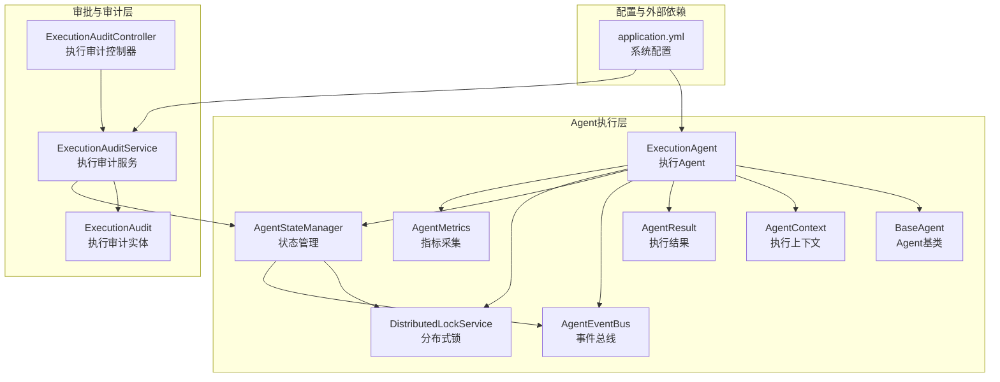
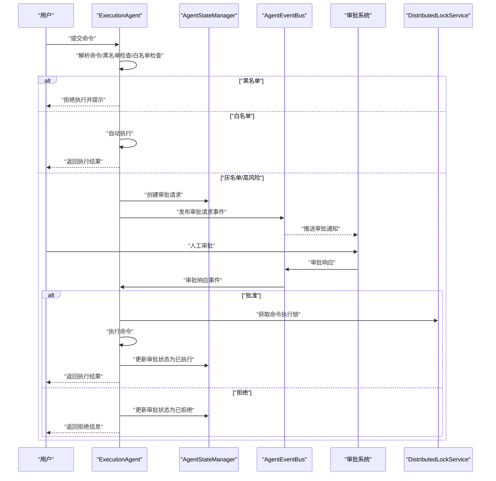
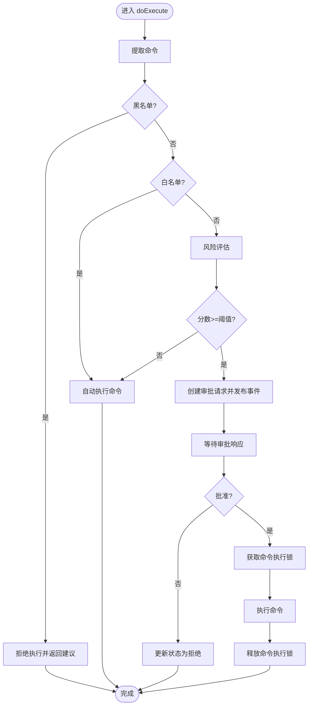
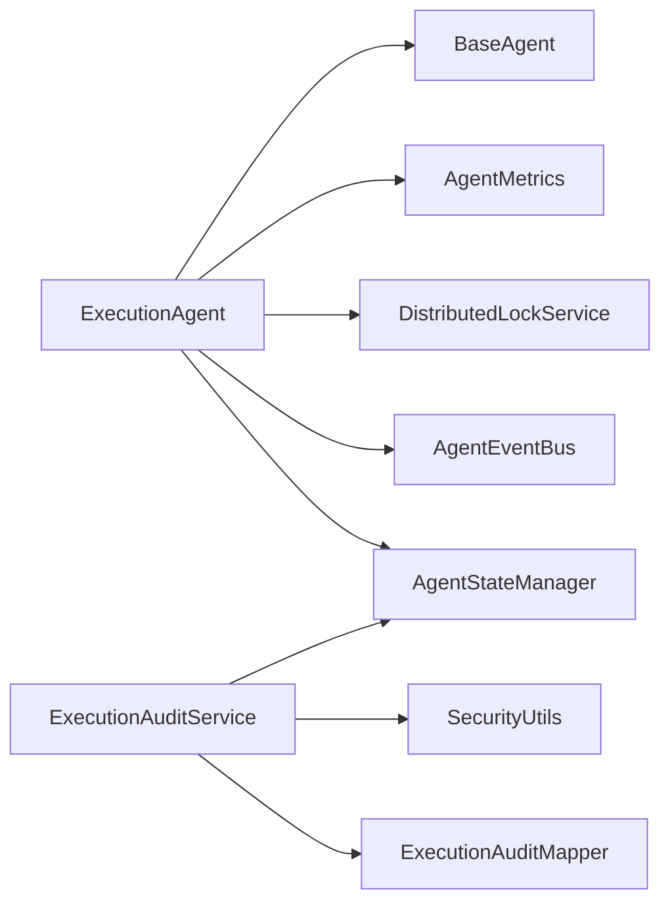

# 执行Agent

<cite>
**本文引用的文件**
- [ExecutionAgent.java](file://netdata-ai-backend/src/main/java/com/netdata/ops/core/agent/ExecutionAgent.java)
- [BaseAgent.java](file://netdata-ai-backend/src/main/java/com/netdata/ops/core/agent/BaseAgent.java)
- [AgentContext.java](file://netdata-ai-backend/src/main/java/com/netdata/ops/core/agent/AgentContext.java)
- [AgentResult.java](file://netdata-ai-backend/src/main/java/com/netdata/ops/core/agent/AgentResult.java)
- [AgentEventBus.java](file://netdata-ai-backend/src/main/java/com/netdata/ops/core/agent/event/AgentEventBus.java)
- [AgentStateManager.java](file://netdata-ai-backend/src/main/java/com/netdata/ops/core/agent/AgentStateManager.java)
- [DistributedLockService.java](file://netdata-ai-backend/src/main/java/com/netdata/ops/core/agent/DistributedLockService.java)
- [AgentMetrics.java](file://netdata-ai-backend/src/main/java/com/netdata/ops/core/agent/AgentMetrics.java)
- [ExecutionAuditController.java](file://netdata-ai-backend/src/main/java/com/netdata/ops/controller/ExecutionAuditController.java)
- [ExecutionAuditService.java](file://netdata-ai-backend/src/main/java/com/netdata/ops/service/ExecutionAuditService.java)
- [ExecutionAudit.java](file://netdata-ai-backend/src/main/java/com/netdata/ops/entity/ExecutionAudit.java)
- [application.yml](file://netdata-ai-backend/src/main/resources/application.yml)
</cite>

## 目录
1. [简介](#简介)
2. [项目结构](#项目结构)
3. [核心组件](#核心组件)
4. [架构总览](#架构总览)
5. [详细组件分析](#详细组件分析)
6. [依赖分析](#依赖分析)
7. [性能考量](#性能考量)
8. [故障排查指南](#故障排查指南)
9. [结论](#结论)
10. [附录](#附录)

## 简介
本技术文档围绕“执行Agent”展开，系统性阐述其在命令执行与人工协作中的关键角色。执行Agent负责接收用户命令、进行安全与风险评估、生成审批请求、协调人工审批流程，并在审批通过后执行命令、记录审计与监控。文档还涵盖与审批系统的集成、命令安全评估、执行日志与结果反馈、风险控制策略、安全协议与合规检查，以及具体命令执行示例、安全配置与故障恢复机制。

## 项目结构
执行Agent位于后端Java工程的智能运维模块中，采用“Agent基座 + 事件总线 + 状态管理 + 分布式锁 + 指标监控”的架构设计，配合前端审批界面与后端审计服务，形成闭环的命令执行与审计体系。

**图表来源**
- [ExecutionAgent.java:1-425](file://netdata-ai-backend/src/main/java/com/netdata/ops/core/agent/ExecutionAgent.java#L1-L425)
- [BaseAgent.java:1-488](file://netdata-ai-backend/src/main/java/com/netdata/ops/core/agent/BaseAgent.java#L1-L488)
- [AgentEventBus.java:1-155](file://netdata-ai-backend/src/main/java/com/netdata/ops/core/agent/event/AgentEventBus.java#L1-L155)
- [AgentStateManager.java:1-259](file://netdata-ai-backend/src/main/java/com/netdata/ops/core/agent/AgentStateManager.java#L1-L259)
- [DistributedLockService.java:1-170](file://netdata-ai-backend/src/main/java/com/netdata/ops/core/agent/DistributedLockService.java#L1-L170)
- [AgentMetrics.java:1-113](file://netdata-ai-backend/src/main/java/com/netdata/ops/core/agent/AgentMetrics.java#L1-L113)
- [ExecutionAuditController.java:1-94](file://netdata-ai-backend/src/main/java/com/netdata/ops/controller/ExecutionAuditController.java#L1-L94)
- [ExecutionAuditService.java:1-297](file://netdata-ai-backend/src/main/java/com/netdata/ops/service/ExecutionAuditService.java#L1-L297)
- [ExecutionAudit.java:1-54](file://netdata-ai-backend/src/main/java/com/netdata/ops/entity/ExecutionAudit.java#L1-L54)
- [application.yml:157-189](file://netdata-ai-backend/src/main/resources/application.yml#L157-L189)

**章节来源**
- [ExecutionAgent.java:1-425](file://netdata-ai-backend/src/main/java/com/netdata/ops/core/agent/ExecutionAgent.java#L1-L425)
- [application.yml:157-189](file://netdata-ai-backend/src/main/resources/application.yml#L157-L189)

## 核心组件
- 执行Agent（ExecutionAgent）：解析用户命令、黑名单/白名单/灰名单判定、风险评估、审批请求创建、审批响应处理、命令执行、分布式锁防重复执行、审计日志与结果反馈。
- Agent基类（BaseAgent）：统一的超时控制、重试、拦截器链、生命周期钩子、指标采集、链路追踪（TraceId）。
- 事件总线（AgentEventBus）：Agent间异步通信，支持点对点与广播路由。
- 状态管理（AgentStateManager）：基于Redis的审批状态机与TTL清理。
- 分布式锁（DistributedLockService）：基于Redis原子操作的命令执行防重复锁。
- 指标采集（AgentMetrics）：Micrometer指标上报，支持执行耗时、成功/失败计数、超时计数与并发数。
- 审计服务（ExecutionAuditService）：命令风险评估、审批、执行结果记录与统计。
- 审计控制器（ExecutionAuditController）：对外暴露执行审计API。
- 执行审计实体（ExecutionAudit）：持久化存储执行审计记录。

**章节来源**
- [ExecutionAgent.java:13-425](file://netdata-ai-backend/src/main/java/com/netdata/ops/core/agent/ExecutionAgent.java#L13-L425)
- [BaseAgent.java:16-488](file://netdata-ai-backend/src/main/java/com/netdata/ops/core/agent/BaseAgent.java#L16-L488)
- [AgentEventBus.java:15-155](file://netdata-ai-backend/src/main/java/com/netdata/ops/core/agent/event/AgentEventBus.java#L15-L155)
- [AgentStateManager.java:14-259](file://netdata-ai-backend/src/main/java/com/netdata/ops/core/agent/AgentStateManager.java#L14-L259)
- [DistributedLockService.java:11-170](file://netdata-ai-backend/src/main/java/com/netdata/ops/core/agent/DistributedLockService.java#L11-L170)
- [AgentMetrics.java:12-113](file://netdata-ai-backend/src/main/java/com/netdata/ops/core/agent/AgentMetrics.java#L12-L113)
- [ExecutionAuditService.java:20-297](file://netdata-ai-backend/src/main/java/com/netdata/ops/service/ExecutionAuditService.java#L20-L297)
- [ExecutionAuditController.java:15-94](file://netdata-ai-backend/src/main/java/com/netdata/ops/controller/ExecutionAuditController.java#L15-L94)
- [ExecutionAudit.java:8-54](file://netdata-ai-backend/src/main/java/com/netdata/ops/entity/ExecutionAudit.java#L8-L54)

## 架构总览
执行Agent采用“人类在回路（Human-in-the-Loop）”模式，结合黑名单/白名单/灰名单策略与风险评估，实现安全可控的命令执行闭环。整体流程包括：命令解析、安全检查、风险评估、审批请求创建、审批响应处理、命令执行、结果记录与监控。

**图表来源**
- [ExecutionAgent.java:149-198](file://netdata-ai-backend/src/main/java/com/netdata/ops/core/agent/ExecutionAgent.java#L149-L198)
- [AgentEventBus.java:67-92](file://netdata-ai-backend/src/main/java/com/netdata/ops/core/agent/event/AgentEventBus.java#L67-L92)
- [AgentStateManager.java:104-171](file://netdata-ai-backend/src/main/java/com/netdata/ops/core/agent/AgentStateManager.java#L104-L171)
- [DistributedLockService.java:116-140](file://netdata-ai-backend/src/main/java/com/netdata/ops/core/agent/DistributedLockService.java#L116-L140)

## 详细组件分析

### 执行Agent（ExecutionAgent）
- 角色与职责
  - 解析用户命令
  - 黑名单/白名单/灰名单判定
  - 风险评估（命令类型、影响范围、可逆性、执行频率）
  - 审批请求创建与事件发布
  - 审批响应处理与命令执行
  - 分布式锁防重复执行
  - 结果封装与建议命令返回
- 关键机制
  - 安全三色模型：黑名单（禁止）、白名单（自动）、灰名单（审批）
  - 风险评估维度与阈值：命令类型（40%）、影响范围（30%）、可逆性（20%）、执行频率（10%）
  - 事件驱动：通过AgentEventBus发布/订阅审批请求与响应
  - 分布式锁：命令执行锁，TTL 5分钟，防重复执行
  - 审批状态机：PENDING → APPROVED → EXECUTED；REJECTED；EXPIRED
- 处理流程
  - 命令提取与校验
  - 黑名单检查（拒绝）
  - 白名单检查（自动执行）
  - 风险评估（低风险自动执行；中高风险创建审批请求）
  - 审批通过后获取锁、执行命令、更新状态、释放锁
  - 审批拒绝或超时（EXPIRED）更新状态

**图表来源**
- [ExecutionAgent.java:149-198](file://netdata-ai-backend/src/main/java/com/netdata/ops/core/agent/ExecutionAgent.java#L149-L198)
- [ExecutionAgent.java:342-395](file://netdata-ai-backend/src/main/java/com/netdata/ops/core/agent/ExecutionAgent.java#L342-L395)
- [DistributedLockService.java:116-140](file://netdata-ai-backend/src/main/java/com/netdata/ops/core/agent/DistributedLockService.java#L116-L140)

**章节来源**
- [ExecutionAgent.java:13-425](file://netdata-ai-backend/src/main/java/com/netdata/ops/core/agent/ExecutionAgent.java#L13-L425)

### Agent基类（BaseAgent）
- 模板方法与生命周期
  - 超时控制：CompletableFuture + deadline
  - 重试机制：可配置最大重试次数与间隔
  - 拦截器链：preExecute/postExecute/onError/onTimeout
  - 指标采集：AgentMetrics
  - 链路追踪：TraceId写入MDC
- 可配置参数
  - getTimeoutMs()/getMaxRetries()/getRetryDelay()

**章节来源**
- [BaseAgent.java:16-488](file://netdata-ai-backend/src/main/java/com/netdata/ops/core/agent/BaseAgent.java#L16-L488)

### 事件总线（AgentEventBus）
- 功能
  - 注册/注销消息处理器
  - 发布消息（自动补全元数据）
  - 异步监听与路由（点对点/广播）
  - 消息历史与统计
- 与执行Agent集成
  - 执行Agent创建审批请求后发布事件
  - 审批系统通过事件总线接收并返回审批响应

**章节来源**
- [AgentEventBus.java:15-155](file://netdata-ai-backend/src/main/java/com/netdata/ops/core/agent/event/AgentEventBus.java#L15-L155)

### 状态管理（AgentStateManager）
- 审批状态机
  - PENDING → APPROVED → EXECUTED
  - PENDING → REJECTED
  - PENDING → EXPIRED（30分钟超时）
- TTL与清理
  - 默认24小时TTL，到期自动清理
- Redis序列化
  - ObjectMapper序列化/反序列化

**章节来源**
- [AgentStateManager.java:14-259](file://netdata-ai-backend/src/main/java/com/netdata/ops/core/agent/AgentStateManager.java#L14-L259)

### 分布式锁（DistributedLockService）
- 锁策略
  - SET NX EX 原子获取锁
  - Lua脚本安全释放锁（owner匹配）
  - 命令执行锁前缀，TTL 5分钟
- 防重复执行
  - 以命令哈希作为key，traceId作为owner
  - 避免同一命令并发执行

**章节来源**
- [DistributedLockService.java:11-170](file://netdata-ai-backend/src/main/java/com/netdata/ops/core/agent/DistributedLockService.java#L11-L170)

### 指标采集（AgentMetrics）
- 指标类型
  - 执行耗时Timer（agent.execution.duration）
  - 成功/失败计数Counter（agent.execution.count）
  - 超时计数Counter（agent.execution.timeout）
  - 并发数Gauge（agent.active.count）
- 与Agent基类集成
  - 执行成功/失败/超时上报

**章节来源**
- [AgentMetrics.java:12-113](file://netdata-ai-backend/src/main/java/com/netdata/ops/core/agent/AgentMetrics.java#L12-L113)

### 审计服务（ExecutionAuditService）
- 风险评估
  - 危险命令（critical）直接拦截
  - 高风险（high）中风险（medium）需审批
  - 低风险（low）自动批准
- 审批与结果记录
  - approveExecution/rejectExecution/recordResult
- 统计与查询
  - 分页查询、状态统计、风险分布统计

**章节来源**
- [ExecutionAuditService.java:20-297](file://netdata-ai-backend/src/main/java/com/netdata/ops/service/ExecutionAuditService.java#L20-L297)

### 审计控制器（ExecutionAuditController）
- 接口
  - 提交执行请求、审批通过/拒绝、记录结果
  - 分页查询审计记录、统计接口、风险预评估

**章节来源**
- [ExecutionAuditController.java:15-94](file://netdata-ai-backend/src/main/java/com/netdata/ops/controller/ExecutionAuditController.java#L15-L94)

### 执行审计实体（ExecutionAudit）
- 字段
  - requestId、userId、command、commandType、targetHost
  - riskLevel、riskScore、status、approverId、executionResult
  - approvedAt、executedAt、createdAt、updatedAt

**章节来源**
- [ExecutionAudit.java:8-54](file://netdata-ai-backend/src/main/java/com/netdata/ops/entity/ExecutionAudit.java#L8-L54)

## 依赖分析
- 执行Agent依赖
  - AgentEventBus：事件发布/订阅
  - AgentStateManager：审批状态持久化与状态机
  - DistributedLockService：命令执行锁
  - AgentMetrics：执行指标上报
  - BaseAgent：模板方法与基础设施
- 审计服务依赖
  - ExecutionAuditMapper：持久化访问
  - SecurityUtils：当前用户信息
  - Redis（AgentStateManager）：审批状态存储
  - MySQL（ExecutionAuditMapper）：审计记录存储

**图表来源**
- [ExecutionAgent.java:84-93](file://netdata-ai-backend/src/main/java/com/netdata/ops/core/agent/ExecutionAgent.java#L84-L93)
- [AgentStateManager.java:34-61](file://netdata-ai-backend/src/main/java/com/netdata/ops/core/agent/AgentStateManager.java#L34-L61)
- [DistributedLockService.java:34-64](file://netdata-ai-backend/src/main/java/com/netdata/ops/core/agent/DistributedLockService.java#L34-L64)
- [AgentMetrics.java:33-43](file://netdata-ai-backend/src/main/java/com/netdata/ops/core/agent/AgentMetrics.java#L33-L43)
- [ExecutionAuditService.java:29-17](file://netdata-ai-backend/src/main/java/com/netdata/ops/service/ExecutionAuditService.java#L29-L17)

**章节来源**
- [ExecutionAgent.java:84-93](file://netdata-ai-backend/src/main/java/com/netdata/ops/core/agent/ExecutionAgent.java#L84-L93)
- [AgentStateManager.java:34-61](file://netdata-ai-backend/src/main/java/com/netdata/ops/core/agent/AgentStateManager.java#L34-L61)
- [DistributedLockService.java:34-64](file://netdata-ai-backend/src/main/java/com/netdata/ops/core/agent/DistributedLockService.java#L34-L64)
- [AgentMetrics.java:33-43](file://netdata-ai-backend/src/main/java/com/netdata/ops/core/agent/AgentMetrics.java#L33-L43)
- [ExecutionAuditService.java:29-17](file://netdata-ai-backend/src/main/java/com/netdata/ops/service/ExecutionAuditService.java#L29-L17)

## 性能考量
- 超时与重试
  - BaseAgent内置超时控制与可配置重试，避免长时间阻塞
- 指标监控
  - Micrometer指标支持P50/P99耗时分析、成功/失败/超时统计、并发数监控
- 并发与锁
  - 分布式锁防重复执行，TTL避免死锁
  - Redis原子操作保障状态一致性
- I/O与序列化
  - 审批状态与命令锁使用JSON序列化，注意Key长度与热点命令哈希

[本节为通用性能讨论，不直接分析具体文件]

## 故障排查指南
- 审批未到或未达
  - 检查事件总线注册与消息路由
  - 确认审批状态机状态流转合法
- 命令重复执行
  - 检查分布式锁是否正确获取/释放
  - 核对命令哈希Key与traceId
- 风险评估异常
  - 检查黑名单/白名单正则匹配
  - 确认风险阈值配置与评估维度权重
- 审计记录缺失
  - 检查MySQL连接与Mapper映射
  - 确认事务与异常处理

**章节来源**
- [AgentEventBus.java:94-133](file://netdata-ai-backend/src/main/java/com/netdata/ops/core/agent/event/AgentEventBus.java#L94-L133)
- [AgentStateManager.java:104-171](file://netdata-ai-backend/src/main/java/com/netdata/ops/core/agent/AgentStateManager.java#L104-L171)
- [DistributedLockService.java:116-160](file://netdata-ai-backend/src/main/java/com/netdata/ops/core/agent/DistributedLockService.java#L116-L160)
- [ExecutionAuditService.java:65-103](file://netdata-ai-backend/src/main/java/com/netdata/ops/service/ExecutionAuditService.java#L65-L103)

## 结论
执行Agent通过“黑名单/白名单/灰名单 + 风险评估 + 事件驱动 + 分布式锁 + 审计闭环”的设计，在保障安全的前提下实现了高效的人机协同。其与审批系统、指标监控、事件总线与状态管理紧密耦合，形成可扩展、可观测、可治理的命令执行平台。建议在生产环境中强化正则规则、完善异常分支与告警联动，并持续优化风险评估维度与阈值。

[本节为总结性内容，不直接分析具体文件]

## 附录

### 命令执行示例
- 低风险命令（白名单）
  - 示例：查看系统日志、列出目录、查看内存使用
  - 结果：自动执行并返回结果
- 中高风险命令（灰名单）
  - 示例：重启服务、停止进程、网络状态查询
  - 流程：创建审批请求 → 人工审批 → 审批通过后执行 → 记录结果
- 危险命令（黑名单）
  - 示例：格式化磁盘、删除根目录、无限循环
  - 结果：直接拒绝并提示

**章节来源**
- [ExecutionAgent.java:48-75](file://netdata-ai-backend/src/main/java/com/netdata/ops/core/agent/ExecutionAgent.java#L48-L75)
- [ExecutionAgent.java:163-178](file://netdata-ai-backend/src/main/java/com/netdata/ops/core/agent/ExecutionAgent.java#L163-L178)
- [ExecutionAgent.java:190-197](file://netdata-ai-backend/src/main/java/com/netdata/ops/core/agent/ExecutionAgent.java#L190-L197)

### 安全配置
- 命令安全配置（application.yml）
  - 黑名单命令列表
  - 白名单命令列表
  - 风险阈值（低/中/高）

**章节来源**
- [application.yml:157-189](file://netdata-ai-backend/src/main/resources/application.yml#L157-L189)

### 故障恢复机制
- 审批超时自动过期（30分钟）
- 执行锁TTL（5分钟），避免死锁
- Redis TTL（24小时）自动清理
- 事件总线消息历史（最近100条）便于审计与调试

**章节来源**
- [AgentStateManager.java:47-56](file://netdata-ai-backend/src/main/java/com/netdata/ops/core/agent/AgentStateManager.java#L47-L56)
- [DistributedLockService.java:47-49](file://netdata-ai-backend/src/main/java/com/netdata/ops/core/agent/DistributedLockService.java#L47-L49)
- [AgentEventBus.java:45-47](file://netdata-ai-backend/src/main/java/com/netdata/ops/core/agent/event/AgentEventBus.java#L45-L47)