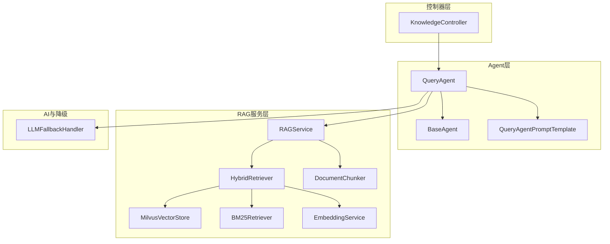
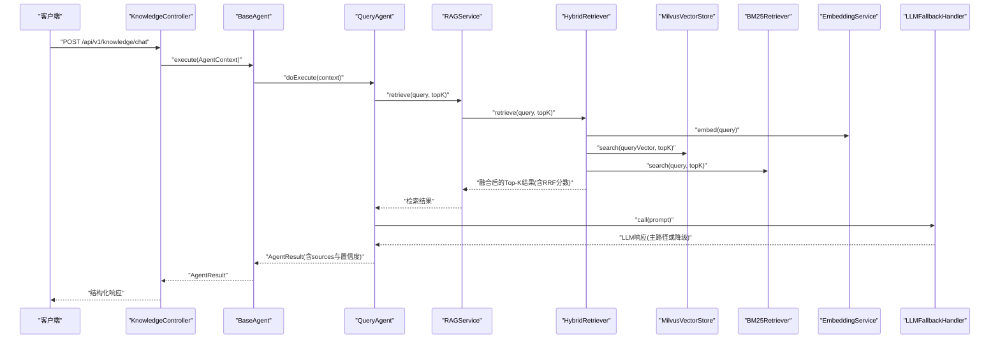
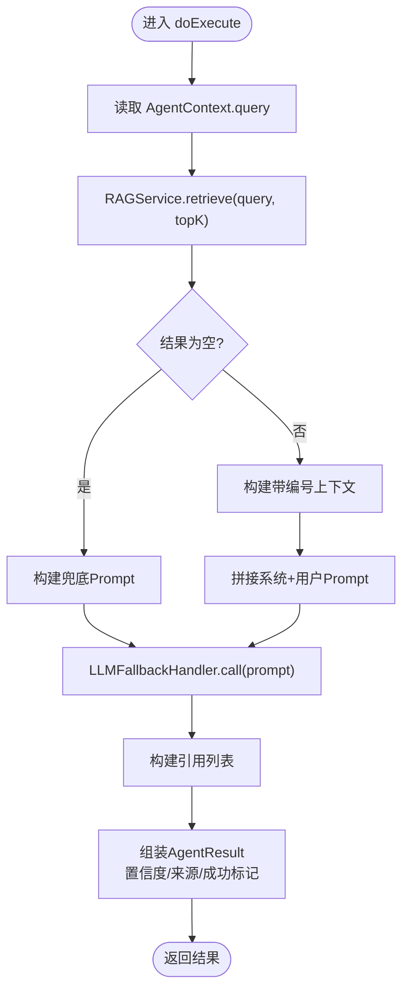
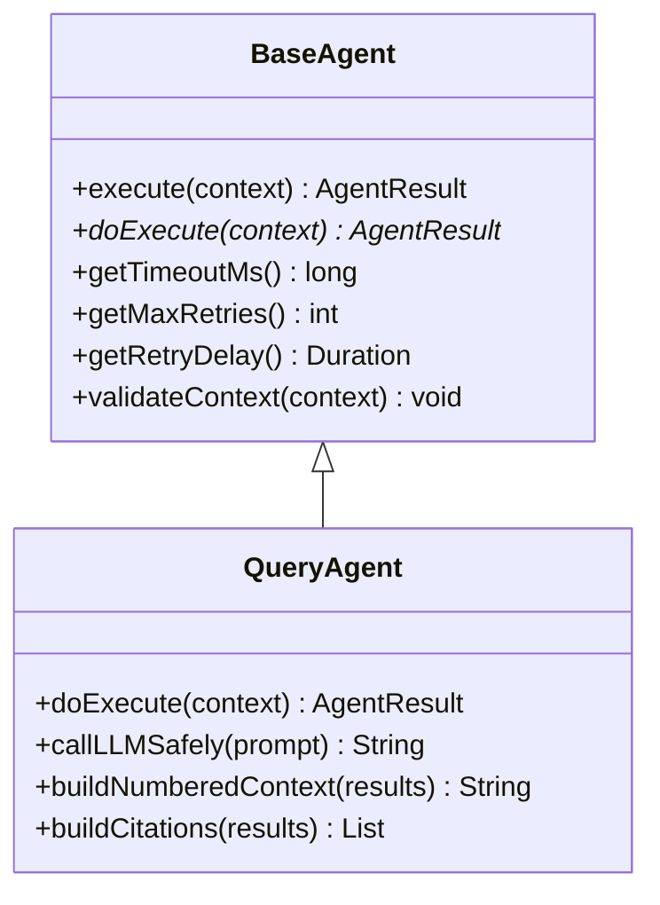
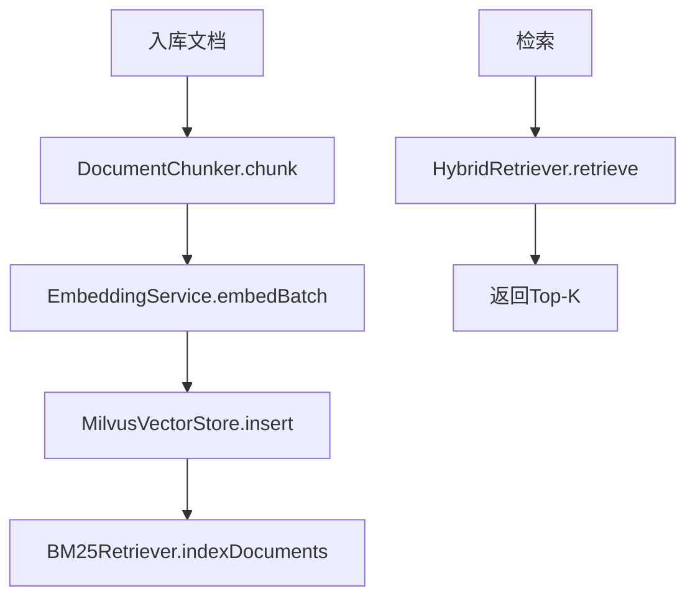
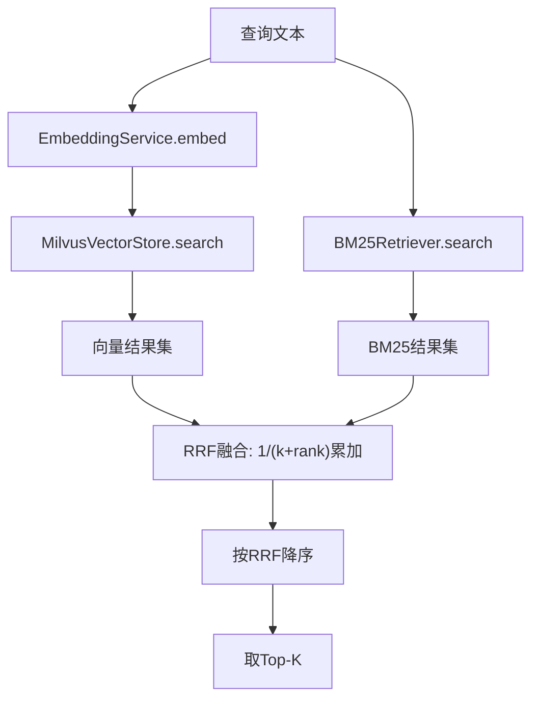
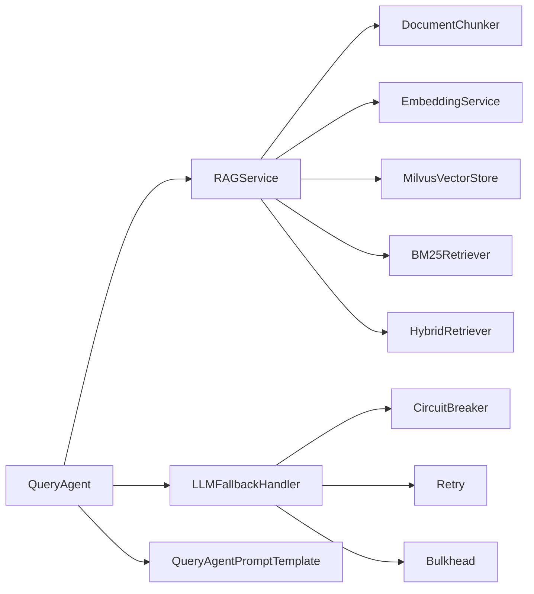

# 查询Agent

<cite>
**本文引用的文件**
- [QueryAgent.java](file://netdata-ai-backend/src/main/java/com/netdata/ops/core/agent/QueryAgent.java)
- [BaseAgent.java](file://netdata-ai-backend/src/main/java/com/netdata/ops/core/agent/BaseAgent.java)
- [AgentContext.java](file://netdata-ai-backend/src/main/java/com/netdata/ops/core/agent/AgentContext.java)
- [AgentResult.java](file://netdata-ai-backend/src/main/java/com/netdata/ops/core/agent/AgentResult.java)
- [QueryAgentPromptTemplate.java](file://netdata-ai-backend/src/main/java/com/netdata/ops/core/agent/QueryAgentPromptTemplate.java)
- [RAGService.java](file://netdata-ai-backend/src/main/java/com/netdata/ops/core/rag/RAGService.java)
- [HybridRetriever.java](file://netdata-ai-backend/src/main/java/com/netdata/ops/core/rag/HybridRetriever.java)
- [BM25Retriever.java](file://netdata-ai-backend/src/main/java/com/netdata/ops/core/rag/BM25Retriever.java)
- [MilvusVectorStore.java](file://netdata-ai-backend/src/main/java/com/netdata/ops/core/rag/MilvusVectorStore.java)
- [EmbeddingService.java](file://netdata-ai-backend/src/main/java/com/netdata/ops/core/rag/EmbeddingService.java)
- [DocumentChunker.java](file://netdata-ai-backend/src/main/java/com/netdata/ops/core/rag/DocumentChunker.java)
- [LLMFallbackHandler.java](file://netdata-ai-backend/src/main/java/com/netdata/ops/core/ai/LLMFallbackHandler.java)
- [application.yml](file://netdata-ai-backend/src/main/resources/application.yml)
- [KnowledgeController.java](file://netdata-ai-backend/src/main/java/com/netdata/ops/controller/KnowledgeController.java)
</cite>

## 目录
1. [简介](#简介)
2. [项目结构](#项目结构)
3. [核心组件](#核心组件)
4. [架构总览](#架构总览)
5. [详细组件分析](#详细组件分析)
6. [依赖关系分析](#依赖关系分析)
7. [性能考量](#性能考量)
8. [故障排查指南](#故障排查指南)
9. [结论](#结论)
10. [附录](#附录)

## 简介
本技术文档围绕查询Agent（QueryAgent）展开，系统阐述其在RAG问答系统中的核心作用与实现机制。QueryAgent负责接收用户查询、通过RAG服务进行混合检索（向量检索+BM25检索+RRF融合）、构建带编号引用的Prompt上下文、调用LLM（具备DeepSeek→Ollama自动降级能力）生成自然语言回答，并管理来源引用与置信度。文档还涵盖与RAGService的集成方式、向量检索调用、BM25检索配合、RRF融合算法应用、配置参数、性能优化策略、错误处理机制以及使用示例与集成指南。

## 项目结构
查询Agent位于后端工程的“core.agent”模块，与RAG服务（core.rag）及AI降级处理（core.ai）共同构成问答链路的关键层。其上层通过控制器对外提供知识库管理与问答接口，底层依赖Milvus向量库、Embedding服务与BM25索引。

**图表来源**
- [KnowledgeController.java:1-82](file://netdata-ai-backend/src/main/java/com/netdata/ops/controller/KnowledgeController.java#L1-L82)
- [QueryAgent.java:1-181](file://netdata-ai-backend/src/main/java/com/netdata/ops/core/agent/QueryAgent.java#L1-L181)
- [BaseAgent.java:1-488](file://netdata-ai-backend/src/main/java/com/netdata/ops/core/agent/BaseAgent.java#L1-L488)
- [QueryAgentPromptTemplate.java:1-143](file://netdata-ai-backend/src/main/java/com/netdata/ops/core/agent/QueryAgentPromptTemplate.java#L1-L143)
- [RAGService.java:1-212](file://netdata-ai-backend/src/main/java/com/netdata/ops/core/rag/RAGService.java#L1-L212)
- [HybridRetriever.java:1-247](file://netdata-ai-backend/src/main/java/com/netdata/ops/core/rag/HybridRetriever.java#L1-L247)
- [MilvusVectorStore.java:1-406](file://netdata-ai-backend/src/main/java/com/netdata/ops/core/rag/MilvusVectorStore.java#L1-L406)
- [BM25Retriever.java:1-257](file://netdata-ai-backend/src/main/java/com/netdata/ops/core/rag/BM25Retriever.java#L1-L257)
- [EmbeddingService.java:1-190](file://netdata-ai-backend/src/main/java/com/netdata/ops/core/rag/EmbeddingService.java#L1-L190)
- [DocumentChunker.java:1-312](file://netdata-ai-backend/src/main/java/com/netdata/ops/core/rag/DocumentChunker.java#L1-L312)
- [LLMFallbackHandler.java:1-235](file://netdata-ai-backend/src/main/java/com/netdata/ops/core/ai/LLMFallbackHandler.java#L1-L235)

**章节来源**
- [QueryAgent.java:1-181](file://netdata-ai-backend/src/main/java/com/netdata/ops/core/agent/QueryAgent.java#L1-L181)
- [RAGService.java:1-212](file://netdata-ai-backend/src/main/java/com/netdata/ops/core/rag/RAGService.java#L1-L212)

## 核心组件
- QueryAgent：执行RAG问答流程，负责检索、构建Prompt、调用LLM、生成引用列表与结构化结果。
- BaseAgent：提供统一的执行框架，包括超时控制、重试、拦截器链、链路追踪、生命周期钩子与指标采集。
- RAGService：封装文档入库、检索与上下文构建，协调向量与BM25检索、RRF融合与可选rerank。
- HybridRetriever：整合向量与BM25检索，使用RRF算法融合排序，返回最终Top-K结果。
- MilvusVectorStore：向量数据库客户端，负责集合创建、向量插入、搜索与统计。
- BM25Retriever：基于词频的关键词检索，补充向量检索在专有名词方面的不足。
- EmbeddingService：文本向量化服务，调用本地BGE-M3模型，支持批量处理与余弦相似度计算。
- DocumentChunker：文档切分器，采用语义切分策略，保证切片语义完整性。
- LLMFallbackHandler：LLM调用降级处理器，集成Resilience4j重试、熔断、并发隔离，主路径失败自动切换到本地模型。
- QueryAgentPromptTemplate：提示词模板管理，支持系统提示与用户提示的外部化配置与A/B测试。

**章节来源**
- [QueryAgent.java:34-100](file://netdata-ai-backend/src/main/java/com/netdata/ops/core/agent/QueryAgent.java#L34-L100)
- [BaseAgent.java:38-424](file://netdata-ai-backend/src/main/java/com/netdata/ops/core/agent/BaseAgent.java#L38-L424)
- [RAGService.java:32-130](file://netdata-ai-backend/src/main/java/com/netdata/ops/core/rag/RAGService.java#L32-L130)
- [HybridRetriever.java:37-100](file://netdata-ai-backend/src/main/java/com/netdata/ops/core/rag/HybridRetriever.java#L37-L100)
- [MilvusVectorStore.java:40-114](file://netdata-ai-backend/src/main/java/com/netdata/ops/core/rag/MilvusVectorStore.java#L40-L114)
- [BM25Retriever.java:35-142](file://netdata-ai-backend/src/main/java/com/netdata/ops/core/rag/BM25Retriever.java#L35-L142)
- [EmbeddingService.java:33-133](file://netdata-ai-backend/src/main/java/com/netdata/ops/core/rag/EmbeddingService.java#L33-L133)
- [DocumentChunker.java:30-104](file://netdata-ai-backend/src/main/java/com/netdata/ops/core/rag/DocumentChunker.java#L30-L104)
- [LLMFallbackHandler.java:41-104](file://netdata-ai-backend/src/main/java/com/netdata/ops/core/ai/LLMFallbackHandler.java#L41-L104)
- [QueryAgentPromptTemplate.java:21-142](file://netdata-ai-backend/src/main/java/com/netdata/ops/core/agent/QueryAgentPromptTemplate.java#L21-L142)

## 架构总览
查询Agent的执行链路由控制器触发，经由BaseAgent的统一执行框架，调用RAGService进行混合检索，随后根据检索结果构建Prompt并交由LLMFallbackHandler调用LLM生成答案，最后封装AgentResult返回。

**图表来源**
- [KnowledgeController.java:1-82](file://netdata-ai-backend/src/main/java/com/netdata/ops/controller/KnowledgeController.java#L1-L82)
- [BaseAgent.java:107-226](file://netdata-ai-backend/src/main/java/com/netdata/ops/core/agent/BaseAgent.java#L107-L226)
- [QueryAgent.java:63-100](file://netdata-ai-backend/src/main/java/com/netdata/ops/core/agent/QueryAgent.java#L63-L100)
- [RAGService.java:116-130](file://netdata-ai-backend/src/main/java/com/netdata/ops/core/rag/RAGService.java#L116-L130)
- [HybridRetriever.java:75-100](file://netdata-ai-backend/src/main/java/com/netdata/ops/core/rag/HybridRetriever.java#L75-L100)
- [MilvusVectorStore.java:274-324](file://netdata-ai-backend/src/main/java/com/netdata/ops/core/rag/MilvusVectorStore.java#L274-L324)
- [BM25Retriever.java:143-178](file://netdata-ai-backend/src/main/java/com/netdata/ops/core/rag/BM25Retriever.java#L143-L178)
- [EmbeddingService.java:72-93](file://netdata-ai-backend/src/main/java/com/netdata/ops/core/rag/EmbeddingService.java#L72-L93)
- [LLMFallbackHandler.java:85-104](file://netdata-ai-backend/src/main/java/com/netdata/ops/core/ai/LLMFallbackHandler.java#L85-L104)

## 详细组件分析

### QueryAgent：RAG问答执行器
- 职责与流程
  - 接收AgentContext中的query，调用RAGService进行混合检索（向量+BM25+RRF融合）。
  - 若检索结果为空，使用兜底提示词模板让LLM基于通用知识回答并明确标注无佐证；若有结果，则构建带编号引用的上下文并注入Prompt。
  - 通过LLMFallbackHandler安全调用LLM，内部具备重试、熔断、并发隔离与主/降级路径切换。
  - 构建来源引用列表（包含来源、标题、分数与摘要），组装AgentResult返回。
- 安全调用与兜底
  - 在LLMFallbackHandler之外再包一层try-catch，确保极端情况下不会因LLM异常导致整体失败，遵循“宁可降级也不能报错”的原则。
- 上下文与引用
  - 编号格式便于LLM在回答中标注引用；引用列表用于前端展示与审计追溯。
- 置信度策略
  - 无检索结果时置信度降低至0.5，有结果时为1.0，便于上层决策与可视化。

**图表来源**
- [QueryAgent.java:63-100](file://netdata-ai-backend/src/main/java/com/netdata/ops/core/agent/QueryAgent.java#L63-L100)
- [QueryAgent.java:113-126](file://netdata-ai-backend/src/main/java/com/netdata/ops/core/agent/QueryAgent.java#L113-L126)
- [QueryAgent.java:139-151](file://netdata-ai-backend/src/main/java/com/netdata/ops/core/agent/QueryAgent.java#L139-L151)
- [QueryAgent.java:164-179](file://netdata-ai-backend/src/main/java/com/netdata/ops/core/agent/QueryAgent.java#L164-L179)

**章节来源**
- [QueryAgent.java:34-100](file://netdata-ai-backend/src/main/java/com/netdata/ops/core/agent/QueryAgent.java#L34-L100)
- [QueryAgent.java:113-126](file://netdata-ai-backend/src/main/java/com/netdata/ops/core/agent/QueryAgent.java#L113-L126)
- [QueryAgent.java:139-179](file://netdata-ai-backend/src/main/java/com/netdata/ops/core/agent/QueryAgent.java#L139-L179)

### BaseAgent：统一执行框架
- 模板方法与生命周期
  - 提供execute模板方法，封装超时控制（CompletableFuture + deadline）、重试（可配置次数与间隔）、拦截器链（pre/post/error/timeout钩子）、链路追踪（traceId/MDC）与指标采集。
- 上下文校验
  - 必须包含query，否则抛出非法参数异常。
- 可配置参数
  - getTimeoutMs、getMaxRetries、getRetryDelay可由子类覆盖以适配不同Agent的特性。

**图表来源**
- [BaseAgent.java:38-424](file://netdata-ai-backend/src/main/java/com/netdata/ops/core/agent/BaseAgent.java#L38-L424)
- [QueryAgent.java:34-100](file://netdata-ai-backend/src/main/java/com/netdata/ops/core/agent/QueryAgent.java#L34-L100)

**章节来源**
- [BaseAgent.java:107-226](file://netdata-ai-backend/src/main/java/com/netdata/ops/core/agent/BaseAgent.java#L107-L226)
- [BaseAgent.java:397-412](file://netdata-ai-backend/src/main/java/com/netdata/ops/core/agent/BaseAgent.java#L397-L412)
- [BaseAgent.java:376-395](file://netdata-ai-backend/src/main/java/com/netdata/ops/core/agent/BaseAgent.java#L376-L395)

### RAGService：检索增强生成服务
- 文档入库
  - 文档切分（DocumentChunker）→ 向量化（EmbeddingService）→ Milvus存储（MilvusVectorStore）→ BM25索引更新（BM25Retriever）。
- 知识检索
  - 通过HybridRetriever执行向量+BM25检索与RRF融合，返回Top-K结果。
- 上下文构建与引用
  - 提供buildContext与generateCitations，便于LLM消费与溯源。

**图表来源**
- [RAGService.java:57-91](file://netdata-ai-backend/src/main/java/com/netdata/ops/core/rag/RAGService.java#L57-L91)
- [RAGService.java:116-130](file://netdata-ai-backend/src/main/java/com/netdata/ops/core/rag/RAGService.java#L116-L130)
- [RAGService.java:140-157](file://netdata-ai-backend/src/main/java/com/netdata/ops/core/rag/RAGService.java#L140-L157)
- [RAGService.java:165-175](file://netdata-ai-backend/src/main/java/com/netdata/ops/core/rag/RAGService.java#L165-L175)

**章节来源**
- [RAGService.java:32-130](file://netdata-ai-backend/src/main/java/com/netdata/ops/core/rag/RAGService.java#L32-L130)
- [RAGService.java:140-175](file://netdata-ai-backend/src/main/java/com/netdata/ops/core/rag/RAGService.java#L140-L175)

### HybridRetriever：混合检索与RRF融合
- 检索流程
  - 向量检索（EmbeddingService + MilvusVectorStore）→ BM25检索（BM25Retriever）→ RRF融合（1/(k+rank)累加）→ Top-K输出。
- RRF参数
  - rrfK默认60，向量与BM25各贡献其排名的RRF分数，最终按分数降序排序。
- 结果结构
  - RetrievalResult包含id/content/source/title/chunkIndex/vectorScore/bm25Score/rrfScore/finalScore。

**图表来源**
- [HybridRetriever.java:75-100](file://netdata-ai-backend/src/main/java/com/netdata/ops/core/rag/HybridRetriever.java#L75-L100)
- [HybridRetriever.java:134-193](file://netdata-ai-backend/src/main/java/com/netdata/ops/core/rag/HybridRetriever.java#L134-L193)
- [EmbeddingService.java:72-93](file://netdata-ai-backend/src/main/java/com/netdata/ops/core/rag/EmbeddingService.java#L72-L93)
- [MilvusVectorStore.java:274-324](file://netdata-ai-backend/src/main/java/com/netdata/ops/core/rag/MilvusVectorStore.java#L274-L324)
- [BM25Retriever.java:143-178](file://netdata-ai-backend/src/main/java/com/netdata/ops/core/rag/BM25Retriever.java#L143-L178)

**章节来源**
- [HybridRetriever.java:37-100](file://netdata-ai-backend/src/main/java/com/netdata/ops/core/rag/HybridRetriever.java#L37-L100)
- [HybridRetriever.java:134-193](file://netdata-ai-backend/src/main/java/com/netdata/ops/core/rag/HybridRetriever.java#L134-L193)

### MilvusVectorStore：向量数据库客户端
- 连接与集合管理
  - 初始化时检查并创建集合，字段包含content/embedding/source/title/chunk_index，索引类型IVF_FLAT，度量COSINE。
- 搜索与过滤
  - 支持带过滤条件的向量搜索，输出包含content/source/title/chunk_index与相似度分数。
- 可用性与降级
  - 连接失败不抛异常，isAvailable()用于上游降级处理。

**章节来源**
- [MilvusVectorStore.java:80-114](file://netdata-ai-backend/src/main/java/com/netdata/ops/core/rag/MilvusVectorStore.java#L80-L114)
- [MilvusVectorStore.java:274-324](file://netdata-ai-backend/src/main/java/com/netdata/ops/core/rag/MilvusVectorStore.java#L274-L324)
- [MilvusVectorStore.java:355-368](file://netdata-ai-backend/src/main/java/com/netdata/ops/core/rag/MilvusVectorStore.java#L355-L368)

### BM25Retriever：关键词检索
- 索引与搜索
  - 倒排索引（词→文档 Posting 列表），统计文档长度与平均长度，按BM25公式计算分数并排序。
- 分词与参数
  - 简化分词（按非字母数字分割），参数k1=1.5，b=0.75，支持批量索引与清空。

**章节来源**
- [BM25Retriever.java:35-142](file://netdata-ai-backend/src/main/java/com/netdata/ops/core/rag/BM25Retriever.java#L35-L142)
- [BM25Retriever.java:188-224](file://netdata-ai-backend/src/main/java/com/netdata/ops/core/rag/BM25Retriever.java#L188-L224)

### EmbeddingService：文本向量化
- 模型与接口
  - 调用本地BGE-M3模型，支持单条与批量向量化，默认模型名与URL可配置。
- 批处理与超时
  - 批大小可配置，超时时间可配置，避免内存溢出与请求阻塞。
- 相似度计算
  - 提供余弦相似度计算，便于语义评估。

**章节来源**
- [EmbeddingService.java:33-133](file://netdata-ai-backend/src/main/java/com/netdata/ops/core/rag/EmbeddingService.java#L33-L133)
- [EmbeddingService.java:145-161](file://netdata-ai-backend/src/main/java/com/netdata/ops/core/rag/EmbeddingService.java#L145-L161)

### DocumentChunker：文档切分
- 切分策略
  - 预处理提取代码块，按段落/标题/代码块边界分割，再按句子切分，最后合并过小切片，确保语义完整性。
- 参数
  - chunk-size、chunk-overlap、min-chunk-size、semantic-chunking可配置。

**章节来源**
- [DocumentChunker.java:30-104](file://netdata-ai-backend/src/main/java/com/netdata/ops/core/rag/DocumentChunker.java#L30-L104)
- [DocumentChunker.java:267-297](file://netdata-ai-backend/src/main/java/com/netdata/ops/core/rag/DocumentChunker.java#L267-L297)

### LLMFallbackHandler：LLM降级与容错
- 调用链路
  - Bulkhead → Retry → CircuitBreaker → Primary（DeepSeek API）→ Fallback（Ollama本地模型）。
- 监控指标
  - 统计降级次数、总调用次数与降级率，暴露熔断器状态。
- 流式与同步
  - 同步与流式两种调用方式，均支持降级与错误恢复。

**章节来源**
- [LLMFallbackHandler.java:41-104](file://netdata-ai-backend/src/main/java/com/netdata/ops/core/ai/LLMFallbackHandler.java#L41-L104)
- [LLMFallbackHandler.java:159-199](file://netdata-ai-backend/src/main/java/com/netdata/ops/core/ai/LLMFallbackHandler.java#L159-L199)

### 提示词模板：QueryAgentPromptTemplate
- 系统提示与用户提示
  - 系统提示限定“仅基于参考资料”，要求标注引用来源，使用Markdown格式；用户提示模板注入检索上下文与问题。
- 无结果兜底
  - 无检索结果时使用兜底提示，明确标注“无佐证”并鼓励通用知识回答。
- 外部化与A/B测试
  - 支持通过配置覆盖，便于调优与实验。

**章节来源**
- [QueryAgentPromptTemplate.java:21-142](file://netdata-ai-backend/src/main/java/com/netdata/ops/core/agent/QueryAgentPromptTemplate.java#L21-L142)

## 依赖关系分析
- QueryAgent依赖
  - RAGService（检索）、LLMFallbackHandler（LLM调用）、QueryAgentPromptTemplate（提示词）、BaseAgent（执行框架）。
- RAGService依赖
  - DocumentChunker（切分）、EmbeddingService（向量化）、MilvusVectorStore（存储）、BM25Retriever（关键词检索）、HybridRetriever（融合）。
- LLMFallbackHandler依赖
  - Resilience4j（熔断、重试、并发隔离）、Spring AI ChatClient（主/降级路径）。

**图表来源**
- [QueryAgent.java:38-51](file://netdata-ai-backend/src/main/java/com/netdata/ops/core/agent/QueryAgent.java#L38-L51)
- [RAGService.java:37-41](file://netdata-ai-backend/src/main/java/com/netdata/ops/core/rag/RAGService.java#L37-L41)
- [LLMFallbackHandler.java:48-69](file://netdata-ai-backend/src/main/java/com/netdata/ops/core/ai/LLMFallbackHandler.java#L48-L69)

**章节来源**
- [QueryAgent.java:38-51](file://netdata-ai-backend/src/main/java/com/netdata/ops/core/agent/QueryAgent.java#L38-L51)
- [RAGService.java:37-41](file://netdata-ai-backend/src/main/java/com/netdata/ops/core/rag/RAGService.java#L37-L41)
- [LLMFallbackHandler.java:48-69](file://netdata-ai-backend/src/main/java/com/netdata/ops/core/ai/LLMFallbackHandler.java#L48-L69)

## 性能考量
- 检索参数调优
  - vector-top-k、bm25-top-k、final-top-k、rrf-k：在召回质量与延迟间权衡，建议在生产环境通过A/B实验确定最优值。
  - 相似度阈值（similarity-threshold）可用于过滤低质量结果，减少LLM负担。
- 向量化与存储
  - Milvus索引类型IVF_FLAT与nlist参数影响吞吐与精度，需结合数据规模与硬件资源调优。
  - 批量向量化与分批Embedding（batch-size）可提升吞吐，避免内存峰值过高。
- LLM调用
  - Resilience4j熔断与重试可提升可用性，但需合理设置阈值与超时，避免雪崩。
  - 本地模型（Ollama）作为降级路径，需评估推理性能与显存占用。
- 日志与追踪
  - BaseAgent统一注入traceId，便于端到端性能分析与问题定位。

[本节为通用性能指导，不直接分析具体文件]

## 故障排查指南
- LLM调用异常
  - LLMFallbackHandler会在主路径失败时自动切换到本地模型；若本地模型也失败，返回兜底文本。可通过监控指标（降级次数/降级率）与日志定位问题。
- Milvus不可用
  - MilvusVectorStore连接失败不会抛异常，RAGService会降级为无知识库模式。检查连接配置与服务状态。
- 检索结果为空
  - QueryAgent对空结果使用兜底提示词，但仍建议检查BM25索引与向量索引是否正确构建。
- 超时与重试
  - BaseAgent提供超时控制与重试机制，若持续超时，检查下游依赖（Embedding、Milvus、LLM）健康状况与资源配额。

**章节来源**
- [LLMFallbackHandler.java:95-104](file://netdata-ai-backend/src/main/java/com/netdata/ops/core/ai/LLMFallbackHandler.java#L95-L104)
- [LLMFallbackHandler.java:159-199](file://netdata-ai-backend/src/main/java/com/netdata/ops/core/ai/LLMFallbackHandler.java#L159-L199)
- [MilvusVectorStore.java:98-102](file://netdata-ai-backend/src/main/java/com/netdata/ops/core/rag/MilvusVectorStore.java#L98-L102)
- [BaseAgent.java:281-303](file://netdata-ai-backend/src/main/java/com/netdata/ops/core/agent/BaseAgent.java#L281-L303)

## 结论
QueryAgent通过统一的Agent执行框架与完善的RAG检索链路，实现了稳定、可降级、可观测的智能问答能力。其关键优势在于：
- 检索融合（向量+BM25+RRF）兼顾语义与关键词匹配；
- 提示词模板外部化，便于持续优化与A/B测试；
- LLM降级与容错保障系统可用性；
- 统一的上下文与引用管理，提升答案可追溯性与用户体验。

[本节为总结性内容，不直接分析具体文件]

## 附录

### 配置参数清单（application.yml）
- RAG检索参数
  - rag.chunk.semantic-chunking、rag.chunk.chunk-size、rag.chunk.chunk-overlap、rag.chunk.min-chunk-size
  - rag.retrieval.vector-top-k、rag.retrieval.bm25-top-k、rag.retrieval.final-top-k、rag.retrieval.rrf-k、rag.retrieval.similarity-threshold
- Embedding服务
  - embedding.service.url、embedding.model、embedding.batch-size、embedding.timeout
- Milvus
  - milvus.host、milvus.port、milvus.database、milvus.collection-name、milvus.vector-dimension
- LLM降级
  - llm.fallback.base-url、llm.fallback.model
- LLM主路径（开发/生产）
  - spring.ai.openai.base-url、spring.ai.openai.api-key、spring.ai.openai.chat.options.model（开发使用Ollama，生产使用DeepSeek）

**章节来源**
- [application.yml:114-145](file://netdata-ai-backend/src/main/resources/application.yml#L114-L145)
- [application.yml:103-110](file://netdata-ai-backend/src/main/resources/application.yml#L103-L110)
- [application.yml:274-314](file://netdata-ai-backend/src/main/resources/application.yml#L274-L314)

### 使用示例与集成指南
- 控制器接口
  - 知识库管理：分页查询、创建/删除文档、分类与统计。
  - 问答接口：通过控制器触发Agent执行，返回结构化结果（响应文本、来源引用、置信度、执行耗时等）。
- 集成步骤
  - 配置RAG参数与LLM降级参数；
  - 准备知识库（文档入库：切分→向量化→Milvus存储→BM25索引）；
  - 调用控制器接口发起问答，Agent自动完成检索、Prompt构建与LLM生成。

**章节来源**
- [KnowledgeController.java:23-81](file://netdata-ai-backend/src/main/java/com/netdata/ops/controller/KnowledgeController.java#L23-L81)
- [RAGService.java:57-91](file://netdata-ai-backend/src/main/java/com/netdata/ops/core/rag/RAGService.java#L57-L91)