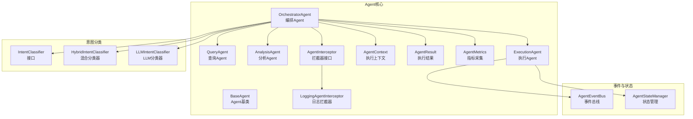
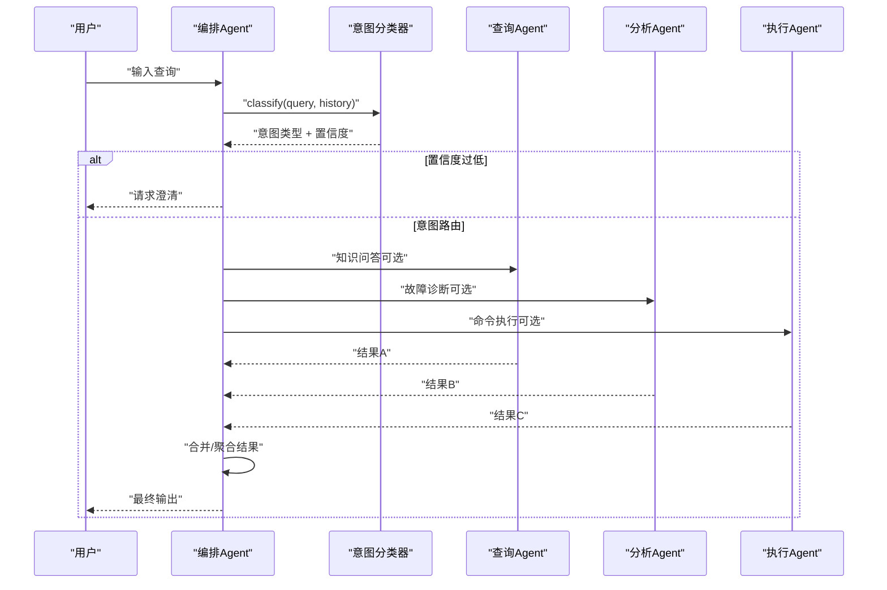
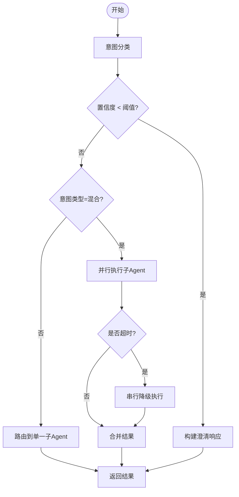
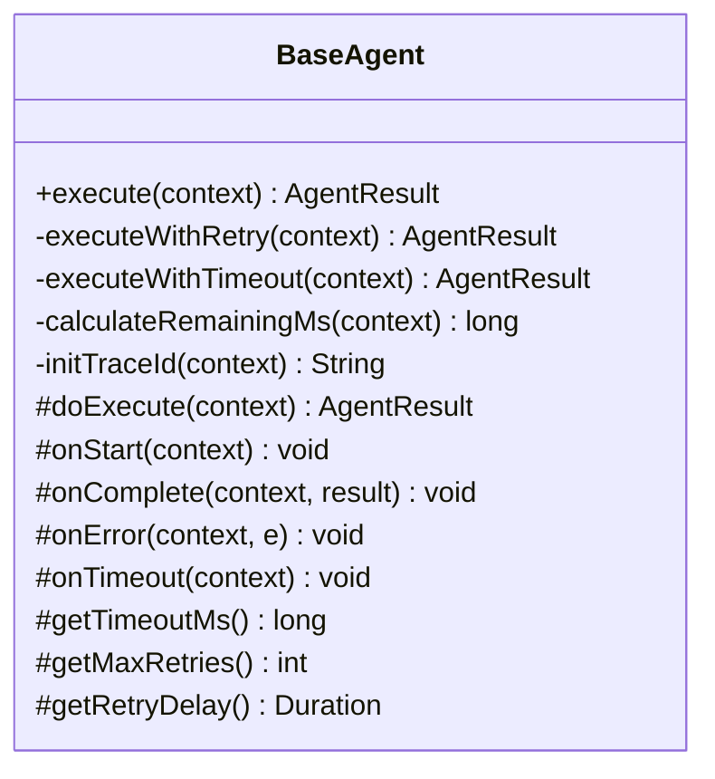
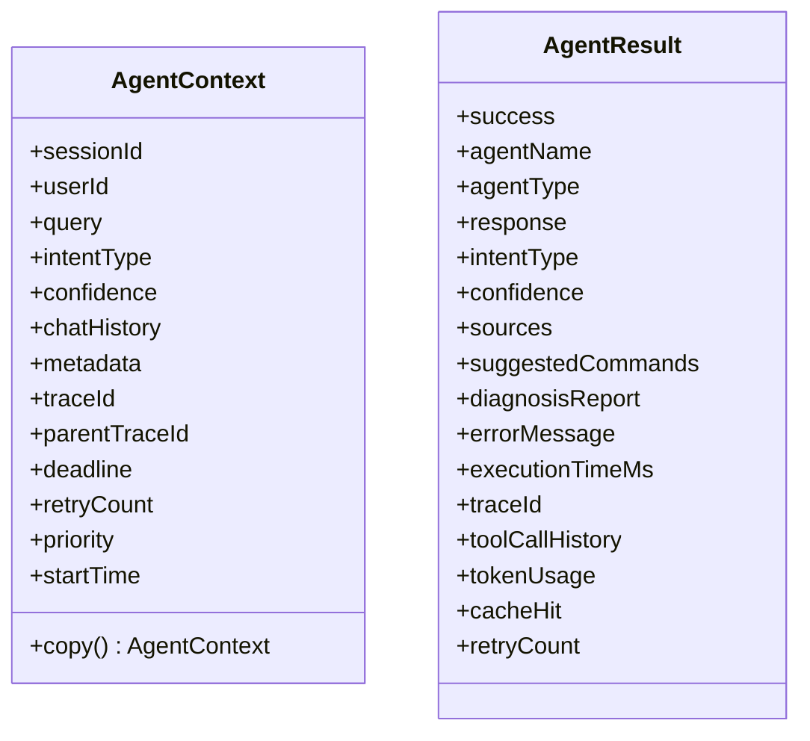
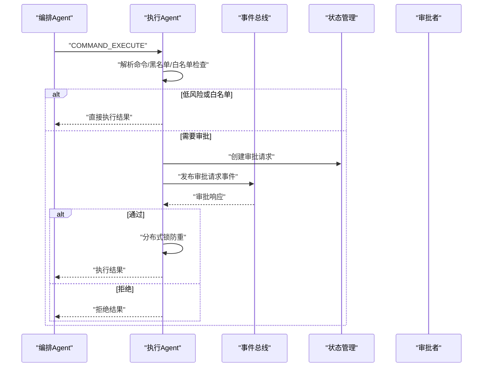
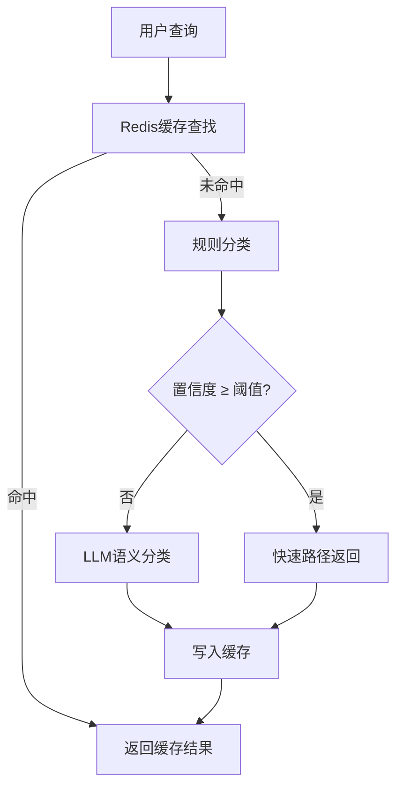
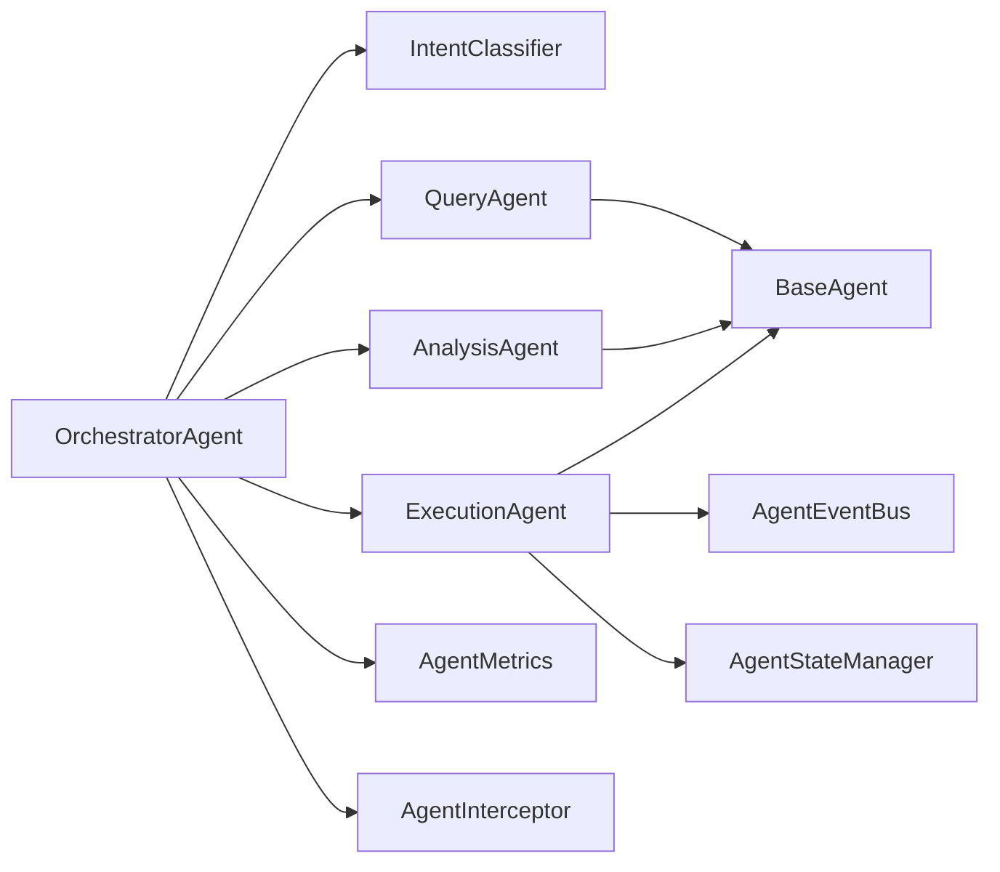

# 编排Agent

<cite>
**本文档引用的文件**
- [OrchestratorAgent.java](file://netdata-ai-backend/src/main/java/com/netdata/ops/core/agent/OrchestratorAgent.java)
- [BaseAgent.java](file://netdata-ai-backend/src/main/java/com/netdata/ops/core/agent/BaseAgent.java)
- [AgentContext.java](file://netdata-ai-backend/src/main/java/com/netdata/ops/core/agent/AgentContext.java)
- [AgentResult.java](file://netdata-ai-backend/src/main/java/com/netdata/ops/core/agent/AgentResult.java)
- [QueryAgent.java](file://netdata-ai-backend/src/main/java/com/netdata/ops/core/agent/QueryAgent.java)
- [AnalysisAgent.java](file://netdata-ai-backend/src/main/java/com/netdata/ops/core/agent/AnalysisAgent.java)
- [ExecutionAgent.java](file://netdata-ai-backend/src/main/java/com/netdata/ops/core/agent/ExecutionAgent.java)
- [IntentClassifier.java](file://netdata-ai-backend/src/main/java/com/netdata/ops/core/agent/intent/IntentClassifier.java)
- [HybridIntentClassifier.java](file://netdata-ai-backend/src/main/java/com/netdata/ops/core/agent/intent/HybridIntentClassifier.java)
- [LLMIntentClassifier.java](file://netdata-ai-backend/src/main/java/com/netdata/ops/core/agent/intent/LLMIntentClassifier.java)
- [AgentMetrics.java](file://netdata-ai-backend/src/main/java/com/netdata/ops/core/agent/AgentMetrics.java)
- [AgentInterceptor.java](file://netdata-ai-backend/src/main/java/com/netdata/ops/core/agent/AgentInterceptor.java)
- [LoggingAgentInterceptor.java](file://netdata-ai-backend/src/main/java/com/netdata/ops/core/agent/LoggingAgentInterceptor.java)
- [AgentEventBus.java](file://netdata-ai-backend/src/main/java/com/netdata/ops/core/agent/event/AgentEventBus.java)
- [AgentStateManager.java](file://netdata-ai-backend/src/main/java/com/netdata/ops/core/agent/AgentStateManager.java)
</cite>

## 目录
1. [简介](#简介)
2. [项目结构](#项目结构)
3. [核心组件](#核心组件)
4. [架构总览](#架构总览)
5. [详细组件分析](#详细组件分析)
6. [依赖关系分析](#依赖关系分析)
7. [性能考量](#性能考量)
8. [故障排查指南](#故障排查指南)
9. [结论](#结论)
10. [附录](#附录)

## 简介
本文件围绕“编排Agent”（OrchestratorAgent）在多智能体系统中的核心职责与工作机制展开，系统阐述其如何：
- 识别用户意图（规则快速路径 + LLM语义分类）
- 路由到对应子Agent（查询/分析/执行）
- 并行与串行混合执行策略
- 结果聚合与最终输出
- 超时控制、重试、拦截器、指标采集与可观测性
- 事件驱动的命令审批与执行
- 安全策略（黑白灰名单）与分布式锁防重

目标是帮助读者全面理解编排Agent如何作为协调中心，管理多个Agent的协作、分配任务优先级、协调执行顺序与监控整体流程。

## 项目结构
本项目采用“按领域分层 + 按职责聚合”的组织方式：
- core.agent：Agent基类与四大Agent（编排/查询/分析/执行）
- core.agent.intent：意图分类器（规则 + LLM + 混合）
- core.agent.event：事件总线与状态管理（审批流程）
- core.ai：LLM容错与降级（fallback）
- core.rag：RAG检索与向量化
- config：拦截器配置与Spring Bean装配

图表来源
- [OrchestratorAgent.java:1-261](file://netdata-ai-backend/src/main/java/com/netdata/ops/core/agent/OrchestratorAgent.java#L1-L261)
- [BaseAgent.java:1-488](file://netdata-ai-backend/src/main/java/com/netdata/ops/core/agent/BaseAgent.java#L1-L488)
- [AgentContext.java:1-152](file://netdata-ai-backend/src/main/java/com/netdata/ops/core/agent/AgentContext.java#L1-L152)
- [AgentResult.java:1-194](file://netdata-ai-backend/src/main/java/com/netdata/ops/core/agent/AgentResult.java#L1-L194)
- [IntentClassifier.java:1-31](file://netdata-ai-backend/src/main/java/com/netdata/ops/core/agent/intent/IntentClassifier.java#L1-L31)
- [HybridIntentClassifier.java:1-182](file://netdata-ai-backend/src/main/java/com/netdata/ops/core/agent/intent/HybridIntentClassifier.java#L1-L182)
- [LLMIntentClassifier.java:1-214](file://netdata-ai-backend/src/main/java/com/netdata/ops/core/agent/intent/LLMIntentClassifier.java#L1-L214)
- [AgentMetrics.java:1-113](file://netdata-ai-backend/src/main/java/com/netdata/ops/core/agent/AgentMetrics.java#L1-L113)
- [AgentInterceptor.java](file://netdata-ai-backend/src/main/java/com/netdata/ops/core/agent/AgentInterceptor.java)
- [LoggingAgentInterceptor.java](file://netdata-ai-backend/src/main/java/com/netdata/ops/core/agent/LoggingAgentInterceptor.java)
- [AgentEventBus.java](file://netdata-ai-backend/src/main/java/com/netdata/ops/core/agent/event/AgentEventBus.java)
- [AgentStateManager.java](file://netdata-ai-backend/src/main/java/com/netdata/ops/core/agent/AgentStateManager.java)

章节来源
- [OrchestratorAgent.java:1-261](file://netdata-ai-backend/src/main/java/com/netdata/ops/core/agent/OrchestratorAgent.java#L1-L261)
- [BaseAgent.java:1-488](file://netdata-ai-backend/src/main/java/com/netdata/ops/core/agent/BaseAgent.java#L1-L488)

## 核心组件
- 编排Agent（OrchestratorAgent）：负责意图识别、任务路由、混合意图并行/串行执行、结果聚合与澄清响应。
- 四大子Agent：
  - 查询Agent（QueryAgent）：RAG检索 + LLM问答，返回结构化答案与来源引用。
  - 分析Agent（AnalysisAgent）：ReAct引擎驱动的推理循环，输出诊断报告与命令建议。
  - 执行Agent（ExecutionAgent）：命令解析、风险评估、审批流程、分布式锁防重执行。
- 基础设施：
  - Agent基类（BaseAgent）：模板方法 + 超时/重试/拦截器/指标/链路追踪。
  - 执行上下文（AgentContext）：封装查询、历史、优先级、截止时间、traceId等。
  - 执行结果（AgentResult）：封装业务结果、来源引用、命令建议、诊断报告、Token用量等。
  - 意图分类器（IntentClassifier/HybridIntentClassifier/LLMIntentClassifier）：双级分类 + 缓存。
  - 指标采集（AgentMetrics）：Micrometer对接Prometheus/Grafana。
  - 拦截器（AgentInterceptor/LoggingAgentInterceptor）：统一的横切关注点。
  - 事件总线与状态（AgentEventBus/AgentStateManager）：审批事件发布与状态持久化。

章节来源
- [OrchestratorAgent.java:12-35](file://netdata-ai-backend/src/main/java/com/netdata/ops/core/agent/OrchestratorAgent.java#L12-L35)
- [BaseAgent.java:16-37](file://netdata-ai-backend/src/main/java/com/netdata/ops/core/agent/BaseAgent.java#L16-L37)
- [AgentContext.java:11-24](file://netdata-ai-backend/src/main/java/com/netdata/ops/core/agent/AgentContext.java#L11-L24)
- [AgentResult.java:10-22](file://netdata-ai-backend/src/main/java/com/netdata/ops/core/agent/AgentResult.java#L10-L22)
- [IntentClassifier.java:7-30](file://netdata-ai-backend/src/main/java/com/netdata/ops/core/agent/intent/IntentClassifier.java#L7-L30)
- [HybridIntentClassifier.java:16-36](file://netdata-ai-backend/src/main/java/com/netdata/ops/core/agent/intent/HybridIntentClassifier.java#L16-L36)
- [LLMIntentClassifier.java:15-31](file://netdata-ai-backend/src/main/java/com/netdata/ops/core/agent/intent/LLMIntentClassifier.java#L15-L31)
- [AgentMetrics.java:12-29](file://netdata-ai-backend/src/main/java/com/netdata/ops/core/agent/AgentMetrics.java#L12-L29)
- [AgentInterceptor.java](file://netdata-ai-backend/src/main/java/com/netdata/ops/core/agent/AgentInterceptor.java)
- [LoggingAgentInterceptor.java](file://netdata-ai-backend/src/main/java/com/netdata/ops/core/agent/LoggingAgentInterceptor.java)
- [AgentEventBus.java](file://netdata-ai-backend/src/main/java/com/netdata/ops/core/agent/event/AgentEventBus.java)
- [AgentStateManager.java](file://netdata-ai-backend/src/main/java/com/netdata/ops/core/agent/AgentStateManager.java)

## 架构总览
编排Agent作为多智能体系统的协调中心，承担“意图识别—任务路由—结果聚合—异常处理—可观测性”的闭环职责。其核心流程如下：

图表来源
- [OrchestratorAgent.java:73-96](file://netdata-ai-backend/src/main/java/com/netdata/ops/core/agent/OrchestratorAgent.java#L73-L96)
- [HybridIntentClassifier.java:74-109](file://netdata-ai-backend/src/main/java/com/netdata/ops/core/agent/intent/HybridIntentClassifier.java#L74-L109)
- [QueryAgent.java:63-100](file://netdata-ai-backend/src/main/java/com/netdata/ops/core/agent/QueryAgent.java#L63-L100)
- [AnalysisAgent.java:47-59](file://netdata-ai-backend/src/main/java/com/netdata/ops/core/agent/AnalysisAgent.java#L47-L59)
- [ExecutionAgent.java:149-198](file://netdata-ai-backend/src/main/java/com/netdata/ops/core/agent/ExecutionAgent.java#L149-L198)

## 详细组件分析

### 编排Agent（OrchestratorAgent）
- 职责与能力
  - 双级意图识别：规则快速路径（高置信度直达）+ LLM语义分类（模糊/复合意图）+ Redis缓存。
  - 任务路由：根据意图类型路由到对应子Agent（知识查询/故障诊断/命令执行/混合意图）。
  - 混合意图并行执行：使用CompletableFuture并行调用多个子Agent，带超时控制与降级串行执行。
  - 结果聚合：将多个子Agent结果合并为统一输出，包含诊断结果、知识片段、命令建议等。
  - 低置信度澄清：当置信度低于阈值时，引导用户提供更明确的需求。
- 关键参数
  - 置信度阈值：低于阈值触发澄清。
  - 混合意图并行超时：超过时限时降级为串行执行。
- 并行/串行降级流程

图表来源
- [OrchestratorAgent.java:73-96](file://netdata-ai-backend/src/main/java/com/netdata/ops/core/agent/OrchestratorAgent.java#L73-L96)
- [OrchestratorAgent.java:123-152](file://netdata-ai-backend/src/main/java/com/netdata/ops/core/agent/OrchestratorAgent.java#L123-L152)
- [OrchestratorAgent.java:199-232](file://netdata-ai-backend/src/main/java/com/netdata/ops/core/agent/OrchestratorAgent.java#L199-L232)

章节来源
- [OrchestratorAgent.java:12-35](file://netdata-ai-backend/src/main/java/com/netdata/ops/core/agent/OrchestratorAgent.java#L12-L35)
- [OrchestratorAgent.java:73-96](file://netdata-ai-backend/src/main/java/com/netdata/ops/core/agent/OrchestratorAgent.java#L73-L96)
- [OrchestratorAgent.java:123-152](file://netdata-ai-backend/src/main/java/com/netdata/ops/core/agent/OrchestratorAgent.java#L123-L152)
- [OrchestratorAgent.java:199-232](file://netdata-ai-backend/src/main/java/com/netdata/ops/core/agent/OrchestratorAgent.java#L199-L232)
- [OrchestratorAgent.java:240-259](file://netdata-ai-backend/src/main/java/com/netdata/ops/core/agent/OrchestratorAgent.java#L240-L259)

### Agent基类（BaseAgent）
- 模板方法：统一的执行生命周期（traceId、deadline、拦截器、校验、超时+重试、指标上报、清理）。
- 超时控制：基于CompletableFuture与剩余时间预算，支持嵌套调用的时间传递。
- 重试机制：可配置最大重试次数与间隔，异常路径与超时路径分别处理。
- 指标采集：Micrometer Timer/Counter/Gauge，支持成功/失败/超时统计与并发数监控。
- 生命周期钩子：onStart/onComplete/onError/onTimeout，便于子类扩展。

图表来源
- [BaseAgent.java:87-226](file://netdata-ai-backend/src/main/java/com/netdata/ops/core/agent/BaseAgent.java#L87-L226)
- [BaseAgent.java:238-303](file://netdata-ai-backend/src/main/java/com/netdata/ops/core/agent/BaseAgent.java#L238-L303)
- [BaseAgent.java:320-333](file://netdata-ai-backend/src/main/java/com/netdata/ops/core/agent/BaseAgent.java#L320-L333)
- [BaseAgent.java:335-367](file://netdata-ai-backend/src/main/java/com/netdata/ops/core/agent/BaseAgent.java#L335-L367)
- [BaseAgent.java:376-395](file://netdata-ai-backend/src/main/java/com/netdata/ops/core/agent/BaseAgent.java#L376-L395)

章节来源
- [BaseAgent.java:87-226](file://netdata-ai-backend/src/main/java/com/netdata/ops/core/agent/BaseAgent.java#L87-L226)
- [BaseAgent.java:238-303](file://netdata-ai-backend/src/main/java/com/netdata/ops/core/agent/BaseAgent.java#L238-L303)

### 执行上下文与结果（AgentContext / AgentResult）
- AgentContext：封装查询、历史、优先级、截止时间、traceId、重试次数等，支持copy()避免并行竞态。
- AgentResult：封装业务结果、来源引用、命令建议、诊断报告、Token用量、工具调用历史、错误信息等。

图表来源
- [AgentContext.java:27-151](file://netdata-ai-backend/src/main/java/com/netdata/ops/core/agent/AgentContext.java#L27-L151)
- [AgentResult.java:25-194](file://netdata-ai-backend/src/main/java/com/netdata/ops/core/agent/AgentResult.java#L25-L194)

章节来源
- [AgentContext.java:27-151](file://netdata-ai-backend/src/main/java/com/netdata/ops/core/agent/AgentContext.java#L27-L151)
- [AgentResult.java:25-194](file://netdata-ai-backend/src/main/java/com/netdata/ops/core/agent/AgentResult.java#L25-L194)

### 查询Agent（QueryAgent）
- 职责：RAG混合检索（向量+BM25+RRF）+ LLM问答（DeepSeek→Ollama降级）+ 来源引用。
- 安全调用：即使底层LLM异常也返回兜底文本，保障系统可用性。
- 上下文构建：带编号引用的检索上下文，便于LLM引用与溯源。

章节来源
- [QueryAgent.java:13-33](file://netdata-ai-backend/src/main/java/com/netdata/ops/core/agent/QueryAgent.java#L13-L33)
- [QueryAgent.java:63-100](file://netdata-ai-backend/src/main/java/com/netdata/ops/core/agent/QueryAgent.java#L63-L100)
- [QueryAgent.java:113-126](file://netdata-ai-backend/src/main/java/com/netdata/ops/core/agent/QueryAgent.java#L113-L126)
- [QueryAgent.java:139-151](file://netdata-ai-backend/src/main/java/com/netdata/ops/core/agent/QueryAgent.java#L139-L151)
- [QueryAgent.java:164-179](file://netdata-ai-backend/src/main/java/com/netdata/ops/core/agent/QueryAgent.java#L164-L179)

### 分析Agent（AnalysisAgent）
- 职责：委托ReAct引擎执行推理循环，动态决策工具调用，输出诊断报告与命令建议。
- 系统上下文：注入意图、置信度、历史对话、元数据等，指导LLM推理。
- 报告抽取：从最终答案中提取摘要、根因、建议，构建结构化诊断报告。

章节来源
- [AnalysisAgent.java:12-30](file://netdata-ai-backend/src/main/java/com/netdata/ops/core/agent/AnalysisAgent.java#L12-L30)
- [AnalysisAgent.java:47-59](file://netdata-ai-backend/src/main/java/com/netdata/ops/core/agent/AnalysisAgent.java#L47-L59)
- [AnalysisAgent.java:64-103](file://netdata-ai-backend/src/main/java/com/netdata/ops/core/agent/AnalysisAgent.java#L64-L103)
- [AnalysisAgent.java:108-133](file://netdata-ai-backend/src/main/java/com/netdata/ops/core/agent/AnalysisAgent.java#L108-L133)
- [AnalysisAgent.java:138-160](file://netdata-ai-backend/src/main/java/com/netdata/ops/core/agent/AnalysisAgent.java#L138-L160)
- [AnalysisAgent.java:165-187](file://netdata-ai-backend/src/main/java/com/netdata/ops/core/agent/AnalysisAgent.java#L165-L187)
- [AnalysisAgent.java:192-214](file://netdata-ai-backend/src/main/java/com/netdata/ops/core/agent/AnalysisAgent.java#L192-L214)
- [AnalysisAgent.java:219-251](file://netdata-ai-backend/src/main/java/com/netdata/ops/core/agent/AnalysisAgent.java#L219-L251)
- [AnalysisAgent.java:255-260](file://netdata-ai-backend/src/main/java/com/netdata/ops/core/agent/AnalysisAgent.java#L255-L260)

### 执行Agent（ExecutionAgent）
- 职责：命令解析、风险评估、审批请求创建、审批响应处理、分布式锁防重执行。
- 安全策略：黑名单（禁止）、白名单（自动）、灰名单（审批）。
- 风险评估维度：命令类型（40%）、影响范围（30%）、可逆性（20%）、执行频率（10%）。
- 事件驱动：通过AgentEventBus发布审批请求事件，等待审批响应后执行命令。

图表来源
- [ExecutionAgent.java:149-198](file://netdata-ai-backend/src/main/java/com/netdata/ops/core/agent/ExecutionAgent.java#L149-L198)
- [ExecutionAgent.java:342-395](file://netdata-ai-backend/src/main/java/com/netdata/ops/core/agent/ExecutionAgent.java#L342-L395)
- [ExecutionAgent.java:95-145](file://netdata-ai-backend/src/main/java/com/netdata/ops/core/agent/ExecutionAgent.java#L95-L145)
- [AgentEventBus.java](file://netdata-ai-backend/src/main/java/com/netdata/ops/core/agent/event/AgentEventBus.java)
- [AgentStateManager.java](file://netdata-ai-backend/src/main/java/com/netdata/ops/core/agent/AgentStateManager.java)

章节来源
- [ExecutionAgent.java:14-38](file://netdata-ai-backend/src/main/java/com/netdata/ops/core/agent/ExecutionAgent.java#L14-L38)
- [ExecutionAgent.java:149-198](file://netdata-ai-backend/src/main/java/com/netdata/ops/core/agent/ExecutionAgent.java#L149-L198)
- [ExecutionAgent.java:216-227](file://netdata-ai-backend/src/main/java/com/netdata/ops/core/agent/ExecutionAgent.java#L216-L227)
- [ExecutionAgent.java:232-257](file://netdata-ai-backend/src/main/java/com/netdata/ops/core/agent/ExecutionAgent.java#L232-L257)
- [ExecutionAgent.java:342-395](file://netdata-ai-backend/src/main/java/com/netdata/ops/core/agent/ExecutionAgent.java#L342-L395)
- [ExecutionAgent.java:95-145](file://netdata-ai-backend/src/main/java/com/netdata/ops/core/agent/ExecutionAgent.java#L95-L145)

### 意图分类器（IntentClassifier / HybridIntentClassifier / LLMIntentClassifier）
- 接口：统一的classify契约，支持规则/LLM/混合实现。
- 混合分类：Redis缓存 → 规则快速路径（高置信度直达）→ LLM语义分类（模糊/复合意图）。
- LLM分类：JSON结构化输出，解析失败时降级为默认知识问答 + 低置信度。

图表来源
- [IntentClassifier.java:7-30](file://netdata-ai-backend/src/main/java/com/netdata/ops/core/agent/intent/IntentClassifier.java#L7-L30)
- [HybridIntentClassifier.java:74-109](file://netdata-ai-backend/src/main/java/com/netdata/ops/core/agent/intent/HybridIntentClassifier.java#L74-L109)
- [HybridIntentClassifier.java:117-151](file://netdata-ai-backend/src/main/java/com/netdata/ops/core/agent/intent/HybridIntentClassifier.java#L117-L151)
- [LLMIntentClassifier.java:72-92](file://netdata-ai-backend/src/main/java/com/netdata/ops/core/agent/intent/LLMIntentClassifier.java#L72-L92)
- [LLMIntentClassifier.java:118-157](file://netdata-ai-backend/src/main/java/com/netdata/ops/core/agent/intent/LLMIntentClassifier.java#L118-L157)

章节来源
- [IntentClassifier.java:7-30](file://netdata-ai-backend/src/main/java/com/netdata/ops/core/agent/intent/IntentClassifier.java#L7-L30)
- [HybridIntentClassifier.java:16-36](file://netdata-ai-backend/src/main/java/com/netdata/ops/core/agent/intent/HybridIntentClassifier.java#L16-L36)
- [HybridIntentClassifier.java:74-109](file://netdata-ai-backend/src/main/java/com/netdata/ops/core/agent/intent/HybridIntentClassifier.java#L74-L109)
- [LLMIntentClassifier.java:15-31](file://netdata-ai-backend/src/main/java/com/netdata/ops/core/agent/intent/LLMIntentClassifier.java#L15-L31)
- [LLMIntentClassifier.java:72-92](file://netdata-ai-backend/src/main/java/com/netdata/ops/core/agent/intent/LLMIntentClassifier.java#L72-L92)

### 指标采集（AgentMetrics）
- Timer：记录执行耗时分布（P50/P99等）。
- Counter：按Agent与成功/失败分类统计执行次数。
- Gauge：并发活跃数（AtomicInteger + MeterRegistry）。
- 超时事件：单独计数，便于容量与SLA监控。

章节来源
- [AgentMetrics.java:12-29](file://netdata-ai-backend/src/main/java/com/netdata/ops/core/agent/AgentMetrics.java#L12-L29)
- [AgentMetrics.java:52-78](file://netdata-ai-backend/src/main/java/com/netdata/ops/core/agent/AgentMetrics.java#L52-L78)
- [AgentMetrics.java:86-111](file://netdata-ai-backend/src/main/java/com/netdata/ops/core/agent/AgentMetrics.java#L86-L111)

### 拦截器（AgentInterceptor / LoggingAgentInterceptor）
- 拦截器链：preExecute/postExecute/onError，统一处理日志、限流、鉴权、审计等横切关注点。
- 日志拦截器：基于MDC自动携带traceId与agentName，便于链路追踪与问题定位。

章节来源
- [AgentInterceptor.java](file://netdata-ai-backend/src/main/java/com/netdata/ops/core/agent/AgentInterceptor.java)
- [LoggingAgentInterceptor.java](file://netdata-ai-backend/src/main/java/com/netdata/ops/core/agent/LoggingAgentInterceptor.java)
- [BaseAgent.java:133-157](file://netdata-ai-backend/src/main/java/com/netdata/ops/core/agent/BaseAgent.java#L133-L157)

## 依赖关系分析
- 编排Agent依赖四大子Agent与意图分类器、指标采集与拦截器。
- 子Agent共享BaseAgent的超时/重试/拦截器/指标能力，实现一致的基础设施体验。
- 执行Agent通过事件总线与状态管理实现审批流程解耦。
- 意图分类器通过缓存与规则快速路径降低LLM调用压力。

图表来源
- [OrchestratorAgent.java:39-71](file://netdata-ai-backend/src/main/java/com/netdata/ops/core/agent/OrchestratorAgent.java#L39-L71)
- [BaseAgent.java:39-85](file://netdata-ai-backend/src/main/java/com/netdata/ops/core/agent/BaseAgent.java#L39-L85)
- [ExecutionAgent.java:84-93](file://netdata-ai-backend/src/main/java/com/netdata/ops/core/agent/ExecutionAgent.java#L84-L93)

章节来源
- [OrchestratorAgent.java:39-71](file://netdata-ai-backend/src/main/java/com/netdata/ops/core/agent/OrchestratorAgent.java#L39-L71)
- [BaseAgent.java:39-85](file://netdata-ai-backend/src/main/java/com/netdata/ops/core/agent/BaseAgent.java#L39-L85)

## 性能考量
- 超时控制：基于deadline的剩余时间预算，避免长尾阻塞；AnalysisAgent超时更长以适配ReAct循环。
- 并行执行：混合意图使用CompletableFuture并行调用，显著降低端到端延迟。
- 缓存策略：意图分类Redis缓存（5分钟TTL），减少重复分类与LLM调用。
- 指标监控：通过Micrometer暴露执行耗时、成功率、超时次数与并发数，支撑容量规划与SLA治理。
- 重试策略：可配置重试次数与间隔，结合异常类型（超时不可重试）避免雪崩。

章节来源
- [BaseAgent.java:281-303](file://netdata-ai-backend/src/main/java/com/netdata/ops/core/agent/BaseAgent.java#L281-L303)
- [AnalysisAgent.java:255-260](file://netdata-ai-backend/src/main/java/com/netdata/ops/core/agent/AnalysisAgent.java#L255-L260)
- [HybridIntentClassifier.java:53-56](file://netdata-ai-backend/src/main/java/com/netdata/ops/core/agent/intent/HybridIntentClassifier.java#L53-L56)
- [AgentMetrics.java:52-78](file://netdata-ai-backend/src/main/java/com/netdata/ops/core/agent/AgentMetrics.java#L52-L78)

## 故障排查指南
- 超时问题：检查BaseAgent的超时控制与剩余时间预算；必要时延长子Agent超时（如AnalysisAgent）。
- 混合意图失败：观察并行执行是否超时，系统会自动降级为串行；若仍失败，检查子Agent健康状态。
- 低置信度：编排Agent会返回澄清响应，引导用户提供更明确需求。
- 执行Agent异常：查看黑名单/白名单匹配与风险评估维度；审批事件是否正确发布与消费。
- 指标异常：通过AgentMetrics查看执行耗时分布、超时次数与并发数，定位瓶颈。

章节来源
- [BaseAgent.java:170-190](file://netdata-ai-backend/src/main/java/com/netdata/ops/core/agent/BaseAgent.java#L170-L190)
- [OrchestratorAgent.java:147-151](file://netdata-ai-backend/src/main/java/com/netdata/ops/core/agent/OrchestratorAgent.java#L147-L151)
- [OrchestratorAgent.java:240-259](file://netdata-ai-backend/src/main/java/com/netdata/ops/core/agent/OrchestratorAgent.java#L240-L259)
- [ExecutionAgent.java:163-178](file://netdata-ai-backend/src/main/java/com/netdata/ops/core/agent/ExecutionAgent.java#L163-L178)
- [AgentMetrics.java:52-78](file://netdata-ai-backend/src/main/java/com/netdata/ops/core/agent/AgentMetrics.java#L52-L78)

## 结论
编排Agent通过“双级意图识别 + 任务路由 + 并行/串行混合执行 + 结果聚合 + 完整可观测性”，实现了对多Agent系统的高效协调。其设计兼顾性能（缓存、并行、超时控制）、可靠性（重试、降级、拦截器、指标）与安全性（命令风险评估、审批、分布式锁）。配合事件驱动的审批流程与结构化的上下文/结果模型，系统能够稳定支撑复杂工作流的编排与执行。

## 附录
- 复杂工作流编排示例（混合意图）：用户同时询问“CPU飙升的原因”和“如何查询相关知识”，编排Agent并行执行分析与查询，合并输出并附带诊断建议与知识引用。
- Agent协作模式：编排Agent作为协调中心，子Agent各司其职并通过统一的上下文/结果模型交互；执行Agent通过事件总线与状态管理实现解耦。
- 系统集成指南：在Spring容器中装配Agent、拦截器、指标与事件总线；通过Micrometer接入Prometheus/Grafana；在生产环境启用Redis缓存与分布式锁。