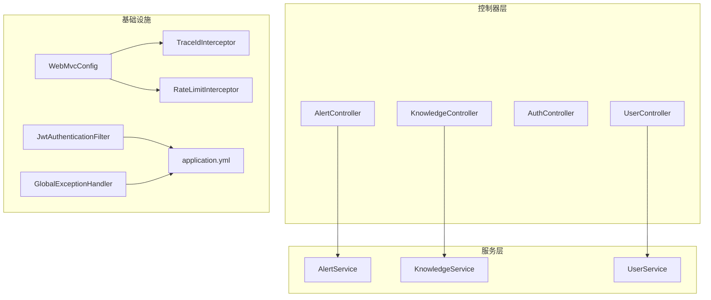
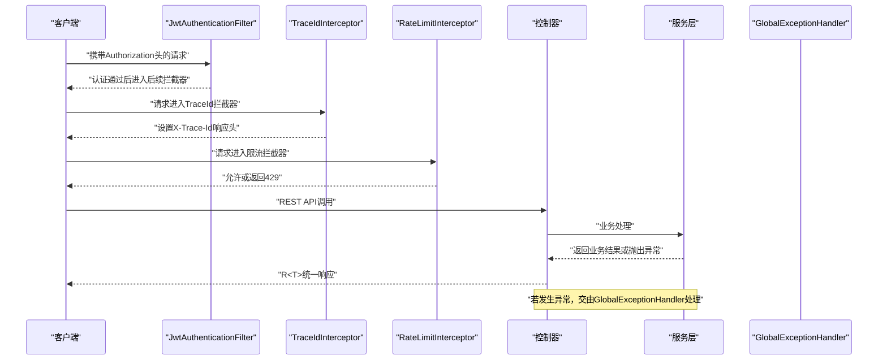
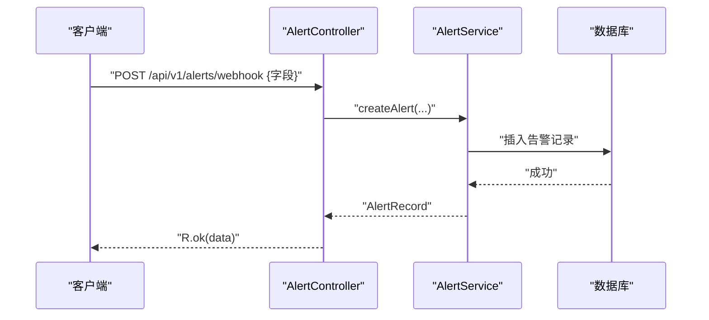
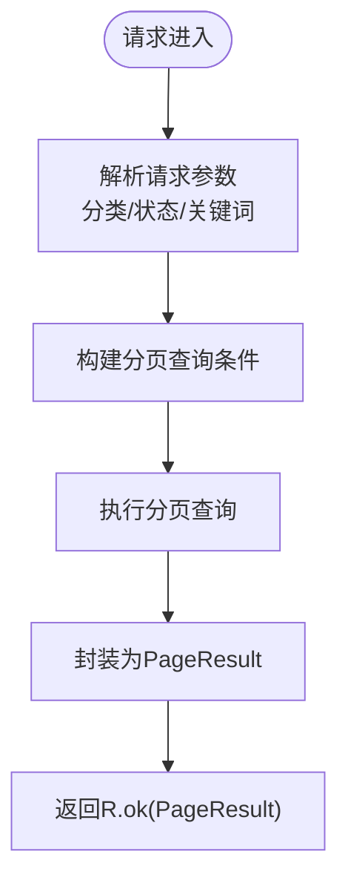
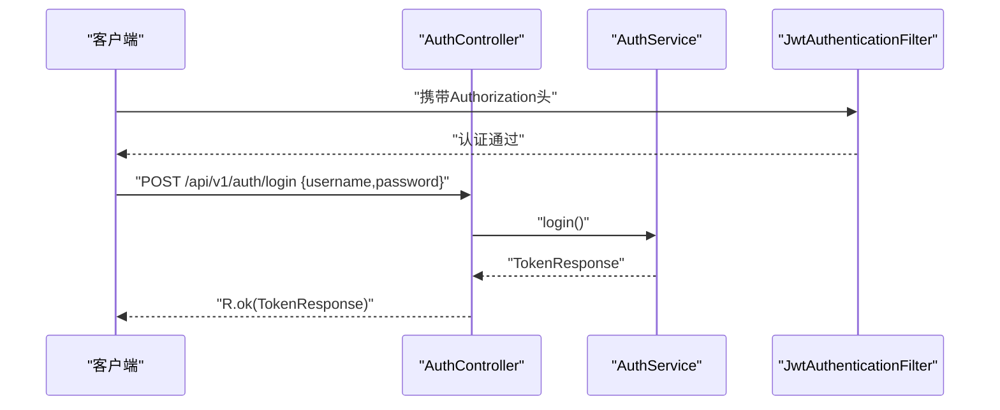
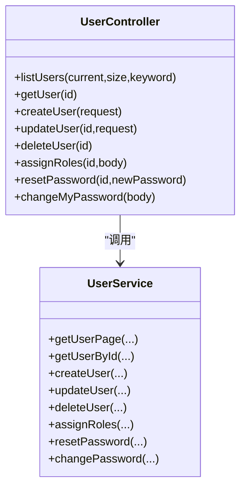
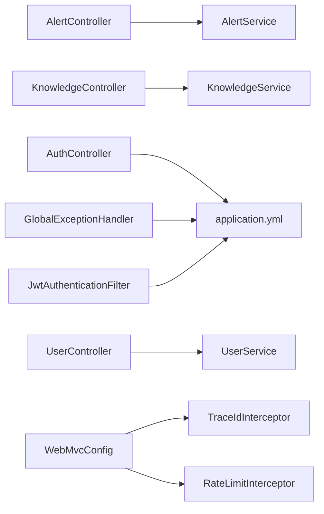

# 控制器层设计

<cite>
**本文引用的文件**
- [AlertController.java](file://netdata-ai-backend/src/main/java/com/netdata/ops/controller/AlertController.java)
- [KnowledgeController.java](file://netdata-ai-backend/src/main/java/com/netdata/ops/controller/KnowledgeController.java)
- [AuthController.java](file://netdata-ai-backend/src/main/java/com/netdata/ops/controller/AuthController.java)
- [UserController.java](file://netdata-ai-backend/src/main/java/com/netdata/ops/controller/UserController.java)
- [R.java](file://netdata-ai-backend/src/main/java/com/netdata/ops/dto/response/R.java)
- [GlobalExceptionHandler.java](file://netdata-ai-backend/src/main/java/com/netdata/ops/exception/GlobalExceptionHandler.java)
- [RequirePermission.java](file://netdata-ai-backend/src/main/java/com/netdata/ops/annotation/RequirePermission.java)
- [WebMvcConfig.java](file://netdata-ai-backend/src/main/java/com/netdata/ops/config/WebMvcConfig.java)
- [TraceIdInterceptor.java](file://netdata-ai-backend/src/main/java/com/netdata/ops/interceptor/TraceIdInterceptor.java)
- [RateLimitInterceptor.java](file://netdata-ai-backend/src/main/java/com/netdata/ops/interceptor/RateLimitInterceptor.java)
- [JwtAuthenticationFilter.java](file://netdata-ai-backend/src/main/java/com/netdata/ops/security/JwtAuthenticationFilter.java)
- [AlertService.java](file://netdata-ai-backend/src/main/java/com/netdata/ops/service/AlertService.java)
- [KnowledgeService.java](file://netdata-ai-backend/src/main/java/com/netdata/ops/service/KnowledgeService.java)
- [UserService.java](file://netdata-ai-backend/src/main/java/com/netdata/ops/service/UserService.java)
- [AlertRecord.java](file://netdata-ai-backend/src/main/java/com/netdata/ops/entity/AlertRecord.java)
- [application.yml](file://netdata-ai-backend/src/main/resources/application.yml)
</cite>

## 目录
1. [简介](#简介)
2. [项目结构](#项目结构)
3. [核心组件](#核心组件)
4. [架构总览](#架构总览)
5. [详细组件分析](#详细组件分析)
6. [依赖分析](#依赖分析)
7. [性能考虑](#性能考虑)
8. [故障排查指南](#故障排查指南)
9. [结论](#结论)
10. [附录](#附录)

## 简介
本文件针对控制器层设计进行系统化技术文档编制，重点覆盖以下控制器类的设计模式与REST API实现：
- 告警控制器：AlertController
- 知识控制器：KnowledgeController
- 认证控制器：AuthController
- 用户控制器：UserController

内容涵盖HTTP请求处理流程、参数验证策略、统一响应格式化、异常映射机制、权限控制、API版本管理、跨域与限流、性能监控与追踪、以及客户端集成示例与最佳实践。

## 项目结构
控制器层位于后端工程的controller包下，采用Spring MVC的@RestController注解，结合Swagger注解提供OpenAPI文档；配合全局异常处理器、拦截器与安全过滤器，形成完整的请求生命周期闭环。

图表来源
- [AlertController.java:1-108](file://netdata-ai-backend/src/main/java/com/netdata/ops/controller/AlertController.java#L1-L108)
- [KnowledgeController.java:1-82](file://netdata-ai-backend/src/main/java/com/netdata/ops/controller/KnowledgeController.java#L1-L82)
- [AuthController.java:1-78](file://netdata-ai-backend/src/main/java/com/netdata/ops/controller/AuthController.java#L1-L78)
- [UserController.java:1-95](file://netdata-ai-backend/src/main/java/com/netdata/ops/controller/UserController.java#L1-L95)
- [GlobalExceptionHandler.java:1-140](file://netdata-ai-backend/src/main/java/com/netdata/ops/exception/GlobalExceptionHandler.java#L1-L140)
- [WebMvcConfig.java:1-40](file://netdata-ai-backend/src/main/java/com/netdata/ops/config/WebMvcConfig.java#L1-L40)
- [TraceIdInterceptor.java:1-44](file://netdata-ai-backend/src/main/java/com/netdata/ops/interceptor/TraceIdInterceptor.java#L1-L44)
- [RateLimitInterceptor.java:1-100](file://netdata-ai-backend/src/main/java/com/netdata/ops/interceptor/RateLimitInterceptor.java#L1-L100)
- [JwtAuthenticationFilter.java:1-75](file://netdata-ai-backend/src/main/java/com/netdata/ops/security/JwtAuthenticationFilter.java#L1-L75)
- [application.yml:1-314](file://netdata-ai-backend/src/main/resources/application.yml#L1-L314)

章节来源
- [AlertController.java:1-108](file://netdata-ai-backend/src/main/java/com/netdata/ops/controller/AlertController.java#L1-L108)
- [KnowledgeController.java:1-82](file://netdata-ai-backend/src/main/java/com/netdata/ops/controller/KnowledgeController.java#L1-L82)
- [AuthController.java:1-78](file://netdata-ai-backend/src/main/java/com/netdata/ops/controller/AuthController.java#L1-L78)
- [UserController.java:1-95](file://netdata-ai-backend/src/main/java/com/netdata/ops/controller/UserController.java#L1-L95)
- [application.yml:1-314](file://netdata-ai-backend/src/main/resources/application.yml#L1-L314)

## 核心组件
- 统一响应包装器：R<T> 提供标准响应结构（code/message/data/traceId/timestamp），并内置常用状态构造方法。
- 全局异常处理器：GlobalExceptionHandler 将各类异常映射为统一响应，覆盖参数校验、认证授权、业务异常等场景。
- 权限注解：RequirePermission 用于标注方法级权限，结合拦截器/切面实现细粒度权限控制。
- Web MVC配置：注册TraceId与限流拦截器，排除健康检查与文档路径，确保性能与可观测性。
- 安全过滤器：JwtAuthenticationFilter 从请求头提取Bearer Token，解析并注入SecurityContext。
- 实体与服务：控制器通过服务层完成业务逻辑，如AlertRecord实体承载告警数据。

章节来源
- [R.java:1-81](file://netdata-ai-backend/src/main/java/com/netdata/ops/dto/response/R.java#L1-L81)
- [GlobalExceptionHandler.java:1-140](file://netdata-ai-backend/src/main/java/com/netdata/ops/exception/GlobalExceptionHandler.java#L1-L140)
- [RequirePermission.java:1-20](file://netdata-ai-backend/src/main/java/com/netdata/ops/annotation/RequirePermission.java#L1-L20)
- [WebMvcConfig.java:1-40](file://netdata-ai-backend/src/main/java/com/netdata/ops/config/WebMvcConfig.java#L1-L40)
- [JwtAuthenticationFilter.java:1-75](file://netdata-ai-backend/src/main/java/com/netdata/ops/security/JwtAuthenticationFilter.java#L1-L75)
- [AlertRecord.java:1-56](file://netdata-ai-backend/src/main/java/com/netdata/ops/entity/AlertRecord.java#L1-L56)

## 架构总览
控制器层遵循“薄控制器、厚服务”的设计原则，控制器仅负责：
- 映射HTTP请求到服务方法
- 参数校验与类型转换
- 统一响应封装
- 权限与安全控制入口

服务层承担业务规则、事务控制与数据访问；异常处理器集中处理错误映射；拦截器与过滤器提供横切能力（追踪、限流、认证）。

图表来源
- [JwtAuthenticationFilter.java:1-75](file://netdata-ai-backend/src/main/java/com/netdata/ops/security/JwtAuthenticationFilter.java#L1-L75)
- [TraceIdInterceptor.java:1-44](file://netdata-ai-backend/src/main/java/com/netdata/ops/interceptor/TraceIdInterceptor.java#L1-L44)
- [RateLimitInterceptor.java:1-100](file://netdata-ai-backend/src/main/java/com/netdata/ops/interceptor/RateLimitInterceptor.java#L1-L100)
- [AlertController.java:1-108](file://netdata-ai-backend/src/main/java/com/netdata/ops/controller/AlertController.java#L1-L108)
- [GlobalExceptionHandler.java:1-140](file://netdata-ai-backend/src/main/java/com/netdata/ops/exception/GlobalExceptionHandler.java#L1-L140)

## 详细组件分析

### 告警控制器（AlertController）
职责边界
- 提供告警查询、详情、确认/解决、批量解决、外部webhook接入、统计与趋势、AI诊断触发等接口。
- 通过RequirePermission注解声明模块级权限，确保最小授权。

HTTP请求处理与参数验证
- GET /api/v1/alerts：分页查询，支持按严重级别、状态、主机、关键词筛选。
- GET /api/v1/alerts/{id}：获取单条告警详情。
- PUT /api/v1/alerts/{id}/resolve：确认/解决告警，Body包含诊断结果。
- PUT /api/v1/alerts/batch-resolve：批量解决，Body包含ID列表与诊断结果。
- POST /api/v1/alerts/webhook：外部告警webhook，接收告警字段并入库。
- GET /api/v1/alerts/stats：统计概览（待命中数、今日解决数、严重级别分布、受影响主机数）。
- GET /api/v1/alerts/trend：最近7天告警趋势（按严重级别聚合）。
- POST /api/v1/alerts/{id}/diagnose：触发AI诊断，返回诊断结果。

响应格式化与异常映射
- 所有接口返回R<T>统一结构；业务异常由GlobalExceptionHandler映射为带code/message的响应。

安全控制
- 使用RequirePermission("alert:read"/"alert:write"/"alert:execute")进行权限控制。
- 认证由JwtAuthenticationFilter完成，控制器方法可基于SecurityUtils获取当前用户上下文。

API版本管理
- 路径前缀/api/v1明确版本号，便于未来演进。

客户端集成要点
- 认证：请求头携带Authorization: Bearer <token>。
- 权限：根据功能选择对应权限标识。
- 错误处理：依据R.code判断，401/403/400/429等场景需分别处理。

图表来源
- [AlertController.java:69-85](file://netdata-ai-backend/src/main/java/com/netdata/ops/controller/AlertController.java#L69-L85)
- [AlertService.java:96-128](file://netdata-ai-backend/src/main/java/com/netdata/ops/service/AlertService.java#L96-L128)

章节来源
- [AlertController.java:1-108](file://netdata-ai-backend/src/main/java/com/netdata/ops/controller/AlertController.java#L1-L108)
- [AlertService.java:1-237](file://netdata-ai-backend/src/main/java/com/netdata/ops/service/AlertService.java#L1-L237)
- [AlertRecord.java:1-56](file://netdata-ai-backend/src/main/java/com/netdata/ops/entity/AlertRecord.java#L1-L56)

### 知识控制器（KnowledgeController）
职责边界
- 提供知识文档的CRUD、分类管理、分页查询、统计等能力。

HTTP请求处理与参数验证
- GET /api/v1/knowledge/documents：分页查询，支持按分类、状态、关键词筛选。
- GET /api/v1/knowledge/documents/{id}：获取文档详情。
- POST /api/v1/knowledge/documents：创建文档，Body包含标题、来源、内容类型、分类、内容。
- DELETE /api/v1/knowledge/documents/{id}：删除文档。
- GET /api/v1/knowledge/categories：获取分类列表及各分类文档数量。
- GET /api/v1/knowledge/stats：知识库统计（总数、已完成、处理中）。

响应格式化与异常映射
- 返回R<T>；异常统一由GlobalExceptionHandler处理。

安全控制
- RequirePermission("knowledge:read"/"knowledge:write"/"knowledge:delete")。

API版本管理
- 路径前缀/api/v1。

图表来源
- [KnowledgeController.java:27-37](file://netdata-ai-backend/src/main/java/com/netdata/ops/controller/KnowledgeController.java#L27-L37)
- [KnowledgeService.java:31-52](file://netdata-ai-backend/src/main/java/com/netdata/ops/service/KnowledgeService.java#L31-L52)

章节来源
- [KnowledgeController.java:1-82](file://netdata-ai-backend/src/main/java/com/netdata/ops/controller/KnowledgeController.java#L1-L82)
- [KnowledgeService.java:1-148](file://netdata-ai-backend/src/main/java/com/netdata/ops/service/KnowledgeService.java#L1-L148)

### 认证控制器（AuthController）
职责边界
- 处理登录、登出、Token刷新、获取当前用户信息。

HTTP请求处理与参数验证
- POST /api/v1/auth/login：接收LoginRequest，返回TokenResponse。
- POST /api/v1/auth/logout：从Authorization头提取Token并执行登出。
- POST /api/v1/auth/refresh：刷新Token，校验refreshToken非空。
- GET /api/v1/auth/me：获取当前用户信息，未登录返回401。

响应格式化与异常映射
- 返回R<T>；参数校验、认证异常、权限不足等由GlobalExceptionHandler统一处理。

安全控制
- 登录/刷新/获取当前用户均依赖JwtAuthenticationFilter提供的认证上下文。

图表来源
- [AuthController.java:30-36](file://netdata-ai-backend/src/main/java/com/netdata/ops/controller/AuthController.java#L30-L36)
- [JwtAuthenticationFilter.java:1-75](file://netdata-ai-backend/src/main/java/com/netdata/ops/security/JwtAuthenticationFilter.java#L1-L75)

章节来源
- [AuthController.java:1-78](file://netdata-ai-backend/src/main/java/com/netdata/ops/controller/AuthController.java#L1-L78)

### 用户控制器（UserController）
职责边界
- 提供用户CRUD、角色分配、密码管理、个人信息修改等。

HTTP请求处理与参数验证
- GET /api/v1/users：分页查询，支持关键词模糊匹配。
- GET /api/v1/users/{id}：获取用户详情。
- POST /api/v1/users：创建用户，使用UserCreateRequest校验。
- PUT /api/v1/users/{id}：更新用户，使用UserUpdateRequest校验。
- DELETE /api/v1/users/{id}：逻辑删除用户。
- POST /api/v1/users/{id}/roles：为用户分配角色。
- PUT /api/v1/users/{id}/password：重置用户密码。
- PUT /api/v1/users/me/password：修改当前用户密码。

响应格式化与异常映射
- 返回R<T>；参数校验、业务异常、权限不足等由GlobalExceptionHandler处理。

安全控制
- RequirePermission("user:read"/"user:write"/"user:role_assign"/"user:delete")。
- 修改/重置密码无需额外权限，但需满足业务规则（如当前用户不可删除自己）。

图表来源
- [UserController.java:1-95](file://netdata-ai-backend/src/main/java/com/netdata/ops/controller/UserController.java#L1-L95)
- [UserService.java:1-253](file://netdata-ai-backend/src/main/java/com/netdata/ops/service/UserService.java#L1-L253)

章节来源
- [UserController.java:1-95](file://netdata-ai-backend/src/main/java/com/netdata/ops/controller/UserController.java#L1-L95)
- [UserService.java:1-253](file://netdata-ai-backend/src/main/java/com/netdata/ops/service/UserService.java#L1-L253)

## 依赖分析
- 控制器依赖服务层：控制器通过@Autowired注入服务实例，避免业务逻辑下沉至控制器。
- 服务层依赖数据访问层：服务层使用MyBatis-Plus进行分页与条件查询，并在必要时开启事务。
- 全局异常处理器：通过@RestControllerAdvice对控制器抛出的异常进行统一映射。
- 拦截器与过滤器：WebMvcConfig注册TraceId与限流拦截器；JwtAuthenticationFilter负责认证。
- 配置文件：application.yml定义JWT密钥、限流配额、Actuator监控、Swagger文档路径等。

图表来源
- [AlertController.java:1-108](file://netdata-ai-backend/src/main/java/com/netdata/ops/controller/AlertController.java#L1-L108)
- [KnowledgeController.java:1-82](file://netdata-ai-backend/src/main/java/com/netdata/ops/controller/KnowledgeController.java#L1-L82)
- [AuthController.java:1-78](file://netdata-ai-backend/src/main/java/com/netdata/ops/controller/AuthController.java#L1-L78)
- [UserController.java:1-95](file://netdata-ai-backend/src/main/java/com/netdata/ops/controller/UserController.java#L1-L95)
- [GlobalExceptionHandler.java:1-140](file://netdata-ai-backend/src/main/java/com/netdata/ops/exception/GlobalExceptionHandler.java#L1-L140)
- [WebMvcConfig.java:1-40](file://netdata-ai-backend/src/main/java/com/netdata/ops/config/WebMvcConfig.java#L1-L40)
- [TraceIdInterceptor.java:1-44](file://netdata-ai-backend/src/main/java/com/netdata/ops/interceptor/TraceIdInterceptor.java#L1-L44)
- [RateLimitInterceptor.java:1-100](file://netdata-ai-backend/src/main/java/com/netdata/ops/interceptor/RateLimitInterceptor.java#L1-L100)
- [JwtAuthenticationFilter.java:1-75](file://netdata-ai-backend/src/main/java/com/netdata/ops/security/JwtAuthenticationFilter.java#L1-L75)
- [application.yml:1-314](file://netdata-ai-backend/src/main/resources/application.yml#L1-L314)

章节来源
- [application.yml:1-314](file://netdata-ai-backend/src/main/resources/application.yml#L1-L314)

## 性能考虑
- 请求追踪：TraceIdInterceptor为每个请求生成traceId并写入MDC，便于日志与链路追踪。
- 限流策略：RateLimitInterceptor基于Redis ZSET实现滑动窗口限流，默认每分钟60次，可通过配置调整。
- 监控指标：Actuator启用health、metrics、prometheus等端点，Resilience4j集成熔断、重试、舱壁等能力。
- 日志格式：application.yml配置控制台与文件输出格式，包含traceId字段，便于问题定位。

章节来源
- [TraceIdInterceptor.java:1-44](file://netdata-ai-backend/src/main/java/com/netdata/ops/interceptor/TraceIdInterceptor.java#L1-L44)
- [RateLimitInterceptor.java:1-100](file://netdata-ai-backend/src/main/java/com/netdata/ops/interceptor/RateLimitInterceptor.java#L1-L100)
- [application.yml:204-237](file://netdata-ai-backend/src/main/resources/application.yml#L204-L237)

## 故障排查指南
常见问题与处理
- 参数校验失败：返回400，message包含字段错误提示，检查请求体格式与必填字段。
- 认证失败：返回401，检查Authorization头是否正确、Token是否过期。
- 权限不足：返回403，确认当前用户是否具备所需权限标识。
- 业务异常：返回自定义code与message，依据错误码定位具体业务问题。
- 请求过于频繁：返回429，检查限流配置或降低请求频率。

定位步骤
- 查看响应中的traceId，结合日志定位请求链路。
- 关注GlobalExceptionHandler日志输出，区分业务异常与系统异常。
- 检查JwtAuthenticationFilter是否正确解析Token，确认SecurityContext是否注入。

章节来源
- [GlobalExceptionHandler.java:1-140](file://netdata-ai-backend/src/main/java/com/netdata/ops/exception/GlobalExceptionHandler.java#L1-L140)
- [TraceIdInterceptor.java:1-44](file://netdata-ai-backend/src/main/java/com/netdata/ops/interceptor/TraceIdInterceptor.java#L1-L44)
- [JwtAuthenticationFilter.java:1-75](file://netdata-ai-backend/src/main/java/com/netdata/ops/security/JwtAuthenticationFilter.java#L1-L75)

## 结论
控制器层通过统一的响应包装、权限注解、拦截器与异常处理机制，实现了清晰的职责边界与一致的错误处理体验。结合JWT认证、限流与追踪能力，整体具备良好的安全性、可维护性与可观测性。建议在后续迭代中持续完善API文档、增强灰度发布与A/B测试能力，并逐步引入更细粒度的鉴权与审计日志。

## 附录

### API版本管理
- 版本前缀：/api/v1
- 建议后续通过新增/v2路径进行兼容性变更，保持向后兼容或提供迁移指引。

章节来源
- [AlertController.java:21-21](file://netdata-ai-backend/src/main/java/com/netdata/ops/controller/AlertController.java#L21-L21)
- [KnowledgeController.java:21-21](file://netdata-ai-backend/src/main/java/com/netdata/ops/controller/KnowledgeController.java#L21-L21)
- [AuthController.java:24-24](file://netdata-ai-backend/src/main/java/com/netdata/ops/controller/AuthController.java#L24-L24)
- [UserController.java:25-25](file://netdata-ai-backend/src/main/java/com/netdata/ops/controller/UserController.java#L25-L25)

### 跨域与文档
- 跨域：WebSocket允许所有来源，Swagger UI与API Docs路径已排除在限流之外。
- 文档：Swagger UI路径为/swagger-ui.html，OpenAPI文档路径为/v3/api-docs。

章节来源
- [application.yml:240-248](file://netdata-ai-backend/src/main/resources/application.yml#L240-L248)
- [application.yml:250-255](file://netdata-ai-backend/src/main/resources/application.yml#L250-L255)

### 客户端集成指南
- 认证流程
  1) 登录：POST /api/v1/auth/login，Body包含用户名与密码。
  2) 成功后保存返回的Token。
  3) 后续请求在Authorization头添加Bearer <token>。
- 权限控制
  - 不同功能需要不同权限标识，如"alert:read"、"knowledge:write"等。
  - 未授权时将收到403响应。
- 错误处理
  - 400：请求参数错误，检查请求体与字段。
  - 401：未认证或Token无效，重新登录。
  - 403：权限不足，确认角色与权限。
  - 404：接口不存在或资源不存在。
  - 429：请求过于频繁，等待后重试。
  - 5xx：服务器内部错误，联系管理员。

章节来源
- [AuthController.java:30-68](file://netdata-ai-backend/src/main/java/com/netdata/ops/controller/AuthController.java#L30-L68)
- [GlobalExceptionHandler.java:1-140](file://netdata-ai-backend/src/main/java/com/netdata/ops/exception/GlobalExceptionHandler.java#L1-L140)
- [RequirePermission.java:1-20](file://netdata-ai-backend/src/main/java/com/netdata/ops/annotation/RequirePermission.java#L1-L20)