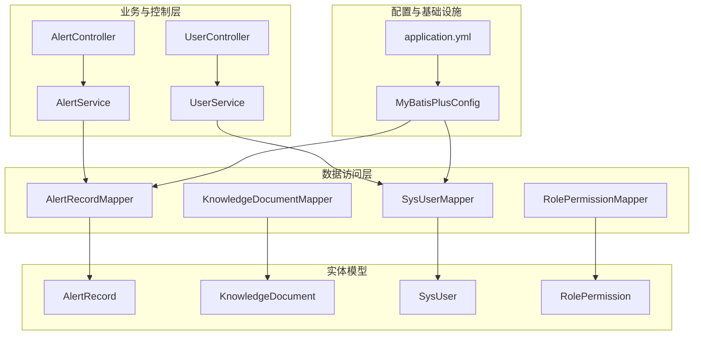
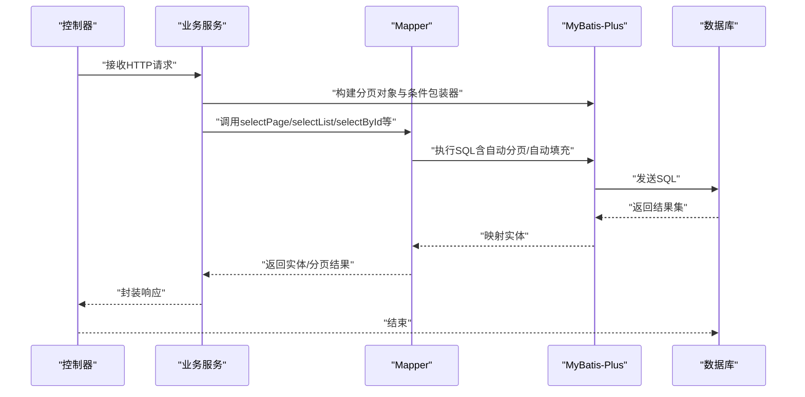
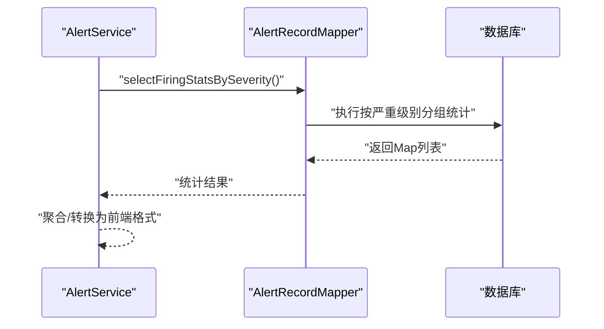
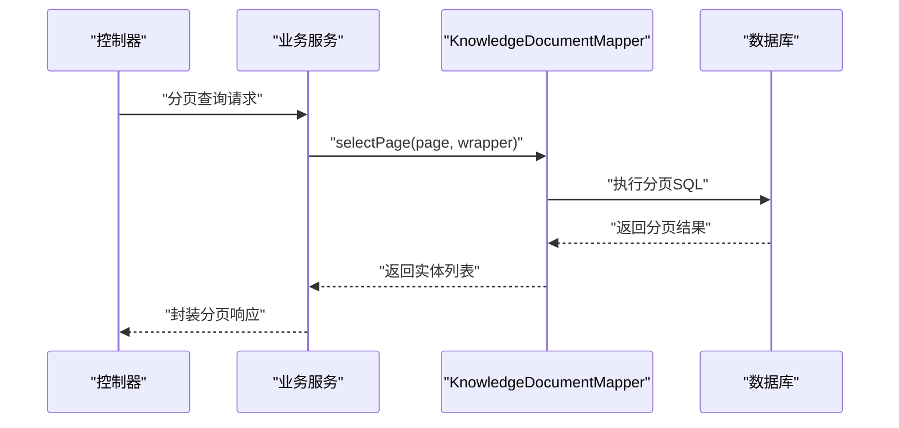
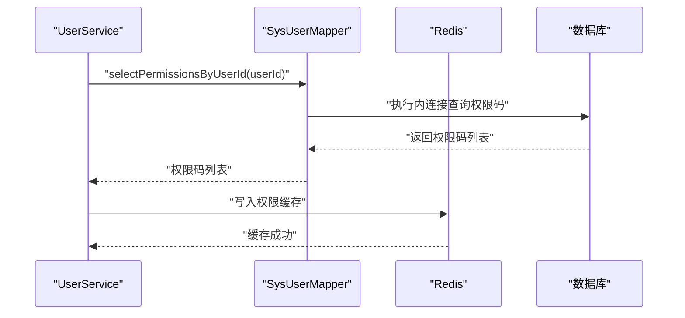
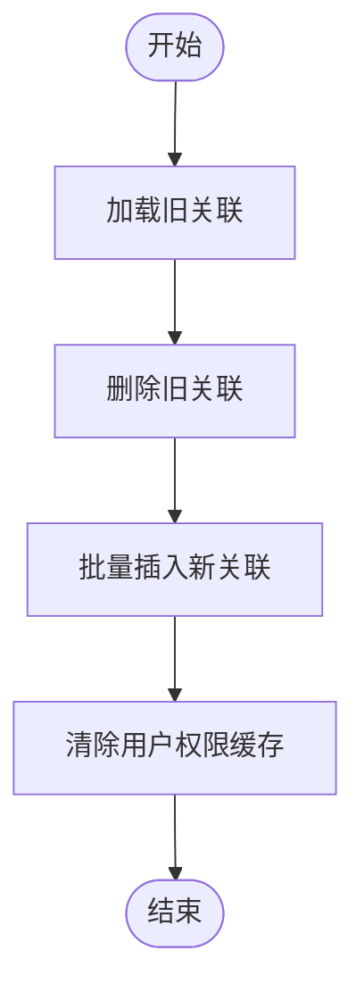
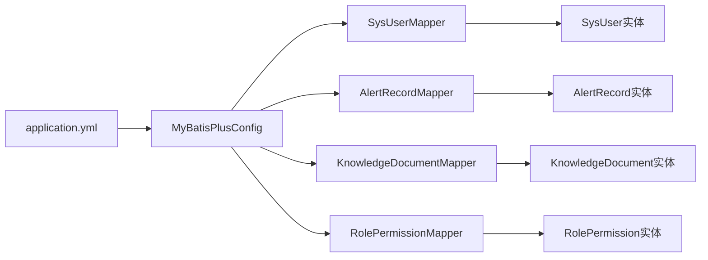

# 数据访问层设计

<cite>
**本文引用的文件**
- [AlertRecordMapper.java](file://netdata-ai-backend/src/main/java/com/netdata/ops/mapper/AlertRecordMapper.java)
- [KnowledgeDocumentMapper.java](file://netdata-ai-backend/src/main/java/com/netdata/ops/mapper/KnowledgeDocumentMapper.java)
- [SysUserMapper.java](file://netdata-ai-backend/src/main/java/com/netdata/ops/mapper/SysUserMapper.java)
- [RolePermissionMapper.java](file://netdata-ai-backend/src/main/java/com/netdata/ops/mapper/RolePermissionMapper.java)
- [AlertRecord.java](file://netdata-ai-backend/src/main/java/com/netdata/ops/entity/AlertRecord.java)
- [KnowledgeDocument.java](file://netdata-ai-backend/src/main/java/com/netdata/ops/entity/KnowledgeDocument.java)
- [SysUser.java](file://netdata-ai-backend/src/main/java/com/netdata/ops/entity/SysUser.java)
- [RolePermission.java](file://netdata-ai-backend/src/main/java/com/netdata/ops/entity/RolePermission.java)
- [MyBatisPlusConfig.java](file://netdata-ai-backend/src/main/java/com/netdata/ops/config/MyBatisPlusConfig.java)
- [application.yml](file://netdata-ai-backend/src/main/resources/application.yml)
- [AlertService.java](file://netdata-ai-backend/src/main/java/com/netdata/ops/service/AlertService.java)
- [UserService.java](file://netdata-ai-backend/src/main/java/com/netdata/ops/service/UserService.java)
- [AlertController.java](file://netdata-ai-backend/src/main/java/com/netdata/ops/controller/AlertController.java)
- [UserController.java](file://netdata-ai-backend/src/main/java/com/netdata/ops/controller/UserController.java)
</cite>

## 目录
1. [引言](#引言)
2. [项目结构](#项目结构)
3. [核心组件](#核心组件)
4. [架构总览](#架构总览)
5. [详细组件分析](#详细组件分析)
6. [依赖分析](#依赖分析)
7. [性能考虑](#性能考虑)
8. [故障排查指南](#故障排查指南)
9. [结论](#结论)
10. [附录](#附录)

## 引言
本技术文档聚焦于数据访问层（DAO）设计，围绕 MyBatis-Plus 的 Mapper 接口展开，深入解析以下四个核心 Mapper 的设计与实现模式：AlertRecordMapper（告警记录映射）、KnowledgeDocumentMapper（知识文档映射）、SysUserMapper（用户映射）、RolePermissionMapper（角色权限映射）。文档将覆盖 CRUD 操作、条件查询、分页处理、批量操作的实现范式；阐述 SQL 注入防护、性能优化与连接池管理的最佳实践；说明数据访问层与业务服务层的交互模式及事务管理策略，并提供可直接落地的查询示例与优化技巧。

## 项目结构
数据访问层位于后端工程的 mapper 包，配合实体类 entity、MyBatis-Plus 配置 config、以及业务服务层 service 和控制器 controller，形成清晰的分层架构。下图展示与数据访问层直接相关的模块关系：

图表来源
- [AlertRecordMapper.java:1-25](file://netdata-ai-backend/src/main/java/com/netdata/ops/mapper/AlertRecordMapper.java#L1-L25)
- [KnowledgeDocumentMapper.java:1-10](file://netdata-ai-backend/src/main/java/com/netdata/ops/mapper/KnowledgeDocumentMapper.java#L1-L10)
- [SysUserMapper.java:1-34](file://netdata-ai-backend/src/main/java/com/netdata/ops/mapper/SysUserMapper.java#L1-L34)
- [RolePermissionMapper.java:1-10](file://netdata-ai-backend/src/main/java/com/netdata/ops/mapper/RolePermissionMapper.java#L1-L10)
- [AlertRecord.java:1-56](file://netdata-ai-backend/src/main/java/com/netdata/ops/entity/AlertRecord.java#L1-L56)
- [KnowledgeDocument.java:1-47](file://netdata-ai-backend/src/main/java/com/netdata/ops/entity/KnowledgeDocument.java#L1-L47)
- [SysUser.java:1-57](file://netdata-ai-backend/src/main/java/com/netdata/ops/entity/SysUser.java#L1-L57)
- [RolePermission.java:1-24](file://netdata-ai-backend/src/main/java/com/netdata/ops/entity/RolePermission.java#L1-L24)
- [MyBatisPlusConfig.java:1-52](file://netdata-ai-backend/src/main/java/com/netdata/ops/config/MyBatisPlusConfig.java#L1-L52)
- [application.yml:31-85](file://netdata-ai-backend/src/main/resources/application.yml#L31-L85)
- [AlertService.java:1-237](file://netdata-ai-backend/src/main/java/com/netdata/ops/service/AlertService.java#L1-L237)
- [UserService.java:1-253](file://netdata-ai-backend/src/main/java/com/netdata/ops/service/UserService.java#L1-L253)
- [AlertController.java:1-108](file://netdata-ai-backend/src/main/java/com/netdata/ops/controller/AlertController.java#L1-L108)
- [UserController.java:1-95](file://netdata-ai-backend/src/main/java/com/netdata/ops/controller/UserController.java#L1-L95)

章节来源
- [AlertRecordMapper.java:1-25](file://netdata-ai-backend/src/main/java/com/netdata/ops/mapper/AlertRecordMapper.java#L1-L25)
- [KnowledgeDocumentMapper.java:1-10](file://netdata-ai-backend/src/main/java/com/netdata/ops/mapper/KnowledgeDocumentMapper.java#L1-L10)
- [SysUserMapper.java:1-34](file://netdata-ai-backend/src/main/java/com/netdata/ops/mapper/SysUserMapper.java#L1-L34)
- [RolePermissionMapper.java:1-10](file://netdata-ai-backend/src/main/java/com/netdata/ops/mapper/RolePermissionMapper.java#L1-L10)
- [MyBatisPlusConfig.java:18-52](file://netdata-ai-backend/src/main/java/com/netdata/ops/config/MyBatisPlusConfig.java#L18-L52)
- [application.yml:31-85](file://netdata-ai-backend/src/main/resources/application.yml#L31-L85)

## 核心组件
本节对四个 Mapper 的职责、扩展点与典型用法进行归纳总结，帮助读者快速掌握数据访问层的实现模式。

- AlertRecordMapper
  - 继承自 BaseMapper，具备标准 CRUD 与分页能力。
  - 提供专用统计查询：按严重级别统计“正在告警”数量、统计当日“已解决”数量、统计“正在告警”的分布。
  - 典型用途：告警统计、趋势分析、批量处理等。

- KnowledgeDocumentMapper
  - 继承自 BaseMapper，提供标准 CRUD 与分页。
  - 典型用途：知识库文档的增删改查与分页检索。

- SysUserMapper
  - 继承自 BaseMapper，提供标准 CRUD 与分页。
  - 提供专用查询：按用户名/邮箱查询用户（排除逻辑删除）、按用户 ID 查询权限码列表、按用户 ID 查询角色码列表。
  - 典型用途：用户认证与授权、权限与角色查询。

- RolePermissionMapper
  - 继承自 BaseMapper，提供标准 CRUD 与分页。
  - 典型用途：角色与权限的关联管理。

章节来源
- [AlertRecordMapper.java:12-24](file://netdata-ai-backend/src/main/java/com/netdata/ops/mapper/AlertRecordMapper.java#L12-L24)
- [KnowledgeDocumentMapper.java:7-9](file://netdata-ai-backend/src/main/java/com/netdata/ops/mapper/KnowledgeDocumentMapper.java#L7-L9)
- [SysUserMapper.java:12-32](file://netdata-ai-backend/src/main/java/com/netdata/ops/mapper/SysUserMapper.java#L12-L32)
- [RolePermissionMapper.java:7-9](file://netdata-ai-backend/src/main/java/com/netdata/ops/mapper/RolePermissionMapper.java#L7-L9)

## 架构总览
数据访问层通过 MyBatis-Plus 的自动分页与自动填充机制，结合 Spring Boot 的配置，实现统一的 CRUD、条件查询与分页能力。业务服务层在需要时开启事务，调用 Mapper 完成数据持久化与查询。控制器负责请求参数校验与鉴权，随后委派给服务层。

图表来源
- [AlertService.java:34-57](file://netdata-ai-backend/src/main/java/com/netdata/ops/service/AlertService.java#L34-L57)
- [UserService.java:45-63](file://netdata-ai-backend/src/main/java/com/netdata/ops/service/UserService.java#L45-L63)
- [MyBatisPlusConfig.java:24-31](file://netdata-ai-backend/src/main/java/com/netdata/ops/config/MyBatisPlusConfig.java#L24-L31)

## 详细组件分析

### AlertRecordMapper 分析
- 设计要点
  - 继承 BaseMapper，天然支持 insert/update/delete/selectById/selectList/selectPage 等。
  - 自定义 SQL：统计“正在告警”数量、统计当日“已解决”数量、按严重级别统计“正在告警”分布。
  - 参数绑定采用注解方式，避免硬编码 SQL 字符串拼接，降低 SQL 注入风险。
- 典型流程（统计“正在告警”分布）
  - Mapper 层：执行自定义 SQL 返回 Map 列表。
  - Service 层：聚合统计结果，返回前端所需格式。
- 性能与安全
  - 使用注解 SQL，参数通过占位符绑定，有效防止 SQL 注入。
  - 对于高频统计，建议结合数据库索引与物化视图（如需）提升性能。

图表来源
- [AlertRecordMapper.java:14-16](file://netdata-ai-backend/src/main/java/com/netdata/ops/mapper/AlertRecordMapper.java#L14-L16)
- [AlertService.java:155-170](file://netdata-ai-backend/src/main/java/com/netdata/ops/service/AlertService.java#L155-L170)

章节来源
- [AlertRecordMapper.java:12-24](file://netdata-ai-backend/src/main/java/com/netdata/ops/mapper/AlertRecordMapper.java#L12-L24)
- [AlertService.java:155-170](file://netdata-ai-backend/src/main/java/com/netdata/ops/service/AlertService.java#L155-L170)

### KnowledgeDocumentMapper 分析
- 设计要点
  - 继承 BaseMapper，提供标准 CRUD 与分页。
  - 可根据业务扩展自定义 SQL，如按标题/分类/状态等条件查询。
- 典型流程（分页查询）
  - 控制器接收分页参数与过滤条件，服务层构造条件包装器，Mapper 执行分页查询。

图表来源
- [KnowledgeDocumentMapper.java:7-9](file://netdata-ai-backend/src/main/java/com/netdata/ops/mapper/KnowledgeDocumentMapper.java#L7-L9)
- [AlertController.java:30-38](file://netdata-ai-backend/src/main/java/com/netdata/ops/controller/AlertController.java#L30-L38)

章节来源
- [KnowledgeDocumentMapper.java:7-9](file://netdata-ai-backend/src/main/java/com/netdata/ops/mapper/KnowledgeDocumentMapper.java#L7-L9)
- [AlertController.java:30-38](file://netdata-ai-backend/src/main/java/com/netdata/ops/controller/AlertController.java#L30-L38)

### SysUserMapper 分析
- 设计要点
  - 继承 BaseMapper，提供标准 CRUD 与分页。
  - 自定义查询：按用户名/邮箱查询未删除用户；按用户 ID 查询权限码列表；按用户 ID 查询角色码列表。
  - 权限与角色查询采用内连接，确保只返回有效期内的角色与权限。
- 典型流程（按用户 ID 查询权限）
  - Mapper 层：执行内连接查询，返回权限码列表。
  - 服务层：将权限码缓存至 Redis，后续鉴权直接读取缓存。

图表来源
- [SysUserMapper.java:20-25](file://netdata-ai-backend/src/main/java/com/netdata/ops/mapper/SysUserMapper.java#L20-L25)
- [UserService.java:229-231](file://netdata-ai-backend/src/main/java/com/netdata/ops/service/UserService.java#L229-L231)

章节来源
- [SysUserMapper.java:12-32](file://netdata-ai-backend/src/main/java/com/netdata/ops/mapper/SysUserMapper.java#L12-L32)
- [UserService.java:229-231](file://netdata-ai-backend/src/main/java/com/netdata/ops/service/UserService.java#L229-L231)

### RolePermissionMapper 分析
- 设计要点
  - 继承 BaseMapper，提供标准 CRUD 与分页。
  - 典型用途：维护角色与权限的多对多关系，支持角色授权与撤销。
- 典型流程（批量授权）
  - 服务层先清理旧关联，再批量插入新关联，最后清除用户权限缓存。

图表来源
- [UserService.java:166-187](file://netdata-ai-backend/src/main/java/com/netdata/ops/service/UserService.java#L166-L187)

章节来源
- [RolePermissionMapper.java:7-9](file://netdata-ai-backend/src/main/java/com/netdata/ops/mapper/RolePermissionMapper.java#L7-L9)
- [UserService.java:166-187](file://netdata-ai-backend/src/main/java/com/netdata/ops/service/UserService.java#L166-L187)

## 依赖分析
- Mapper 与实体
  - 各 Mapper 与对应实体通过注解映射，遵循命名规范与字段映射规则。
- 配置依赖
  - MyBatis-Plus 配置提供分页插件与自动填充处理器，全局生效。
  - 数据源与连接池配置在 application.yml 中集中管理。
- 服务层依赖
  - 服务层通过 @Transactional 管理事务边界，调用 Mapper 完成数据操作。
  - 控制器负责鉴权与参数校验，调用服务层完成业务处理。

图表来源
- [SysUserMapper.java:12](file://netdata-ai-backend/src/main/java/com/netdata/ops/mapper/SysUserMapper.java#L12)
- [AlertRecordMapper.java:12](file://netdata-ai-backend/src/main/java/com/netdata/ops/mapper/AlertRecordMapper.java#L12)
- [KnowledgeDocumentMapper.java:8](file://netdata-ai-backend/src/main/java/com/netdata/ops/mapper/KnowledgeDocumentMapper.java#L8)
- [RolePermissionMapper.java:8](file://netdata-ai-backend/src/main/java/com/netdata/ops/mapper/RolePermissionMapper.java#L8)
- [MyBatisPlusConfig.java:24-31](file://netdata-ai-backend/src/main/java/com/netdata/ops/config/MyBatisPlusConfig.java#L24-L31)
- [application.yml:31-85](file://netdata-ai-backend/src/main/resources/application.yml#L31-L85)

章节来源
- [MyBatisPlusConfig.java:18-52](file://netdata-ai-backend/src/main/java/com/netdata/ops/config/MyBatisPlusConfig.java#L18-L52)
- [application.yml:31-85](file://netdata-ai-backend/src/main/resources/application.yml#L31-L85)

## 性能考虑
- 连接池与分页
  - application.yml 中配置了 Hikari 连接池参数（最小空闲、最大池大小、连接超时、最大生命周期等），建议根据并发与查询复杂度调整。
  - MyBatis-Plus 分页插件限制单次最大查询条数，避免大页扫描导致内存压力。
- 自动填充与索引
  - 自动填充统一设置 createdAt/updatedAt，减少业务代码重复。
  - 建议为常用查询字段（如 username、email、deleted、status、host、severity 等）建立合适索引。
- 缓存策略
  - 用户权限码缓存至 Redis，降低频繁鉴权的数据库压力。
- SQL 注入防护
  - 所有参数化查询均使用注解 SQL 与占位符绑定，避免字符串拼接，有效防范注入攻击。
- 批量操作
  - 批量授权与批量解决告警采用循环逐条更新，若对吞吐要求更高，可考虑 MyBatis-Plus 的批量插入/更新（需满足驱动与数据库版本要求）。

章节来源
- [application.yml:36-42](file://netdata-ai-backend/src/main/resources/application.yml#L36-L42)
- [MyBatisPlusConfig.java:24-31](file://netdata-ai-backend/src/main/java/com/netdata/ops/config/MyBatisPlusConfig.java#L24-L31)
- [UserService.java:229-231](file://netdata-ai-backend/src/main/java/com/netdata/ops/service/UserService.java#L229-L231)
- [AlertService.java:133-150](file://netdata-ai-backend/src/main/java/com/netdata/ops/service/AlertService.java#L133-L150)

## 故障排查指南
- 常见问题与定位
  - 分页无效：确认是否正确传入 Page 对象与条件包装器，检查分页插件配置。
  - 逻辑删除未生效：确认实体字段标注与全局配置一致，查询时注意过滤 deleted 字段。
  - 权限缓存不同步：角色变更后需清除用户权限缓存键，避免脏读。
  - SQL 注入风险：避免手写 SQL 字符串拼接，优先使用注解 SQL 或条件包装器。
- 关键日志与监控
  - application.yml 中配置了日志输出格式与级别，便于定位问题。
  - Actuator 暴露健康检查与指标，可用于运行时监控。

章节来源
- [application.yml:259-270](file://netdata-ai-backend/src/main/resources/application.yml#L259-L270)
- [application.yml:206-237](file://netdata-ai-backend/src/main/resources/application.yml#L206-L237)

## 结论
本数据访问层基于 MyBatis-Plus 的标准化 Mapper 接口，结合注解 SQL 与条件包装器，实现了安全、可维护、可扩展的 CRUD、条件查询与分页能力。通过全局分页插件与自动填充处理器，统一了分页与时间戳管理；通过连接池与缓存策略，兼顾了性能与稳定性。服务层在关键路径上使用事务管理，确保数据一致性。整体架构清晰、职责分明，适合在中大型项目中推广使用。

## 附录
- 查询示例与优化技巧
  - 分页查询（告警）
    - 控制器参数：current、size、severity、status、host、keyword。
    - 服务层：根据参数动态组装条件包装器，调用 selectPage。
    - 优化：为 status、severity、host、createdAt 建立复合索引；限制分页 size 上限。
  - 条件查询（用户）
    - 通过用户名/邮箱精确查询，排除 deleted=1 的记录。
    - 优化：为 username、email、deleted 建立索引；避免 SELECT *，按需选择列。
  - 统计查询（告警）
    - 使用自定义 SQL 按严重级别分组统计，返回 Map 列表。
    - 优化：为 status、severity、created_at 建立索引；必要时引入物化视图。
  - 批量操作（角色授权）
    - 先清后增，批量插入新关联，最后清除权限缓存。
    - 优化：使用事务包裹整个过程，确保原子性；Redis 缓存键前缀统一管理。

章节来源
- [AlertController.java:30-38](file://netdata-ai-backend/src/main/java/com/netdata/ops/controller/AlertController.java#L30-L38)
- [AlertService.java:34-57](file://netdata-ai-backend/src/main/java/com/netdata/ops/service/AlertService.java#L34-L57)
- [SysUserMapper.java:14-18](file://netdata-ai-backend/src/main/java/com/netdata/ops/mapper/SysUserMapper.java#L14-L18)
- [UserService.java:166-187](file://netdata-ai-backend/src/main/java/com/netdata/ops/service/UserService.java#L166-L187)
- [AlertRecordMapper.java:14-23](file://netdata-ai-backend/src/main/java/com/netdata/ops/mapper/AlertRecordMapper.java#L14-L23)