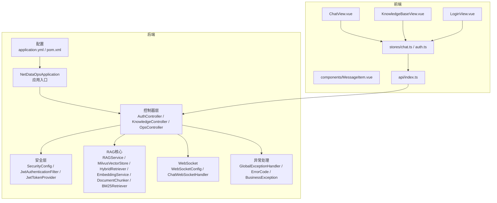
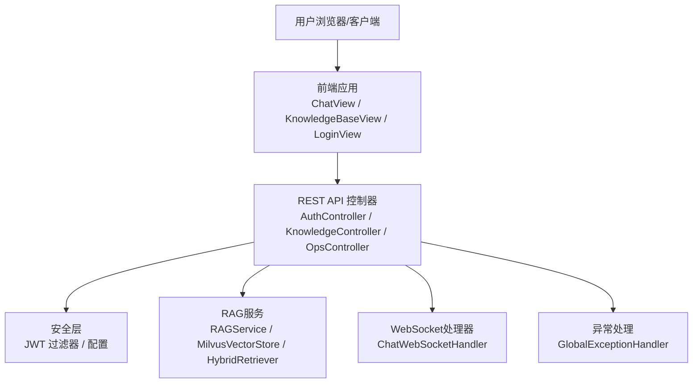
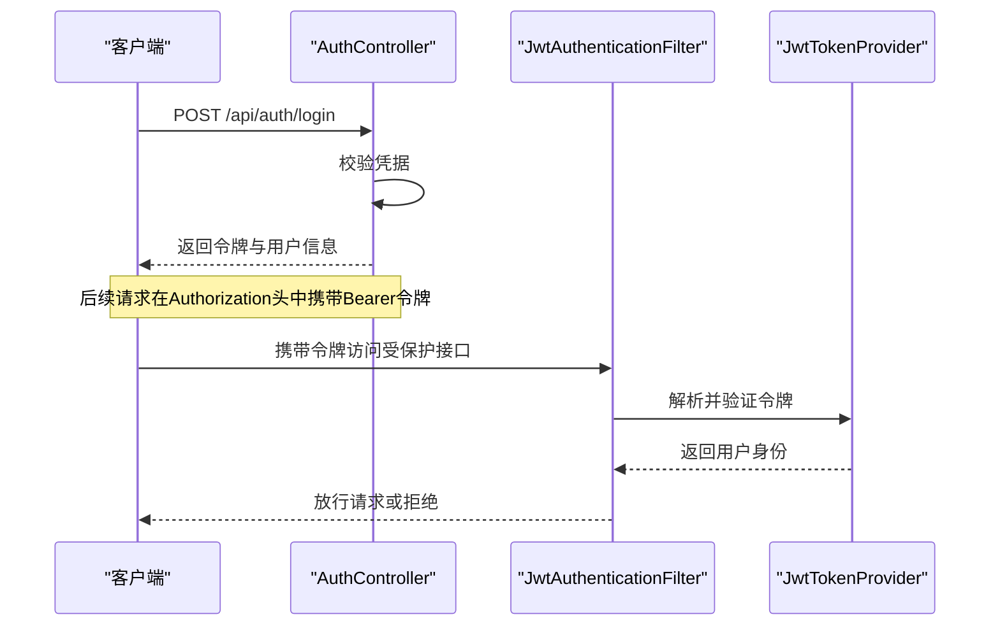
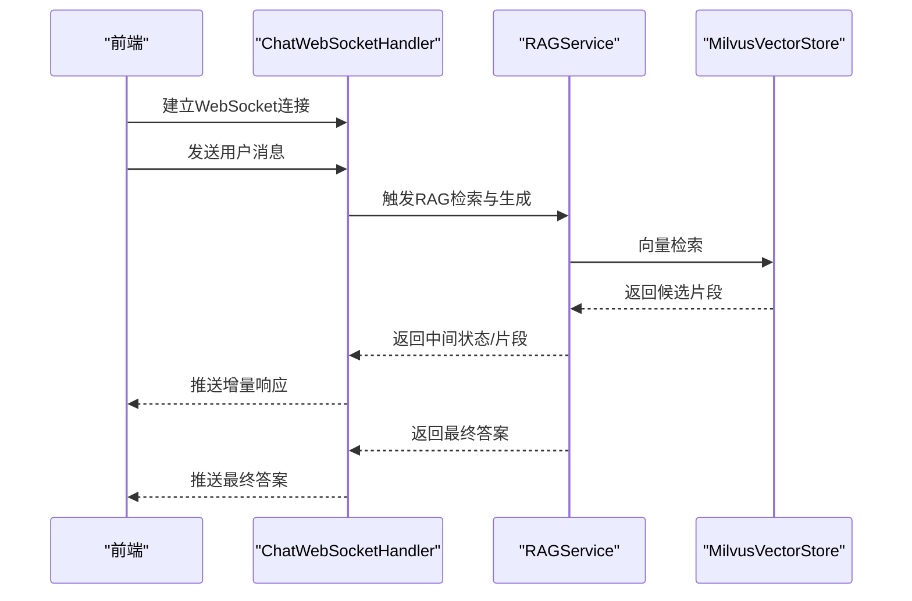
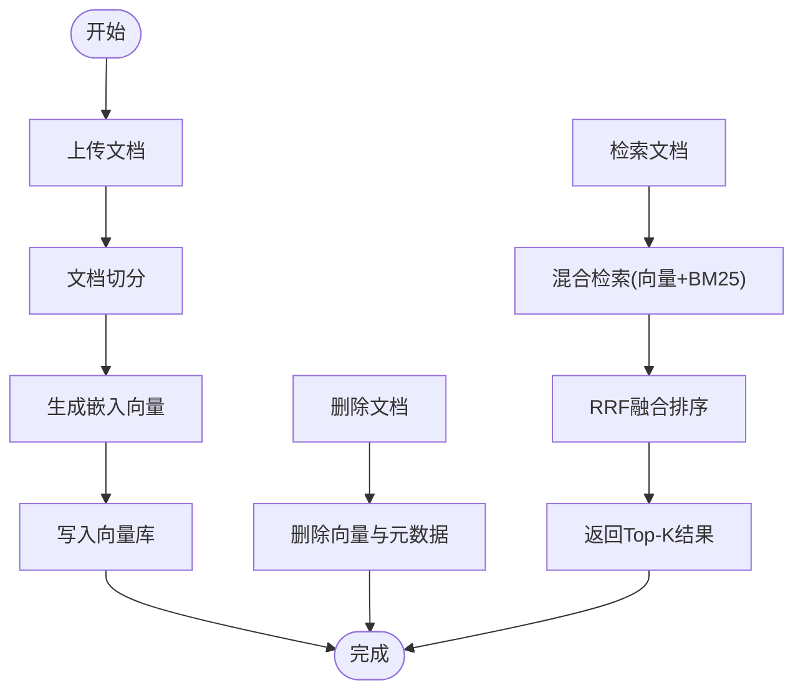
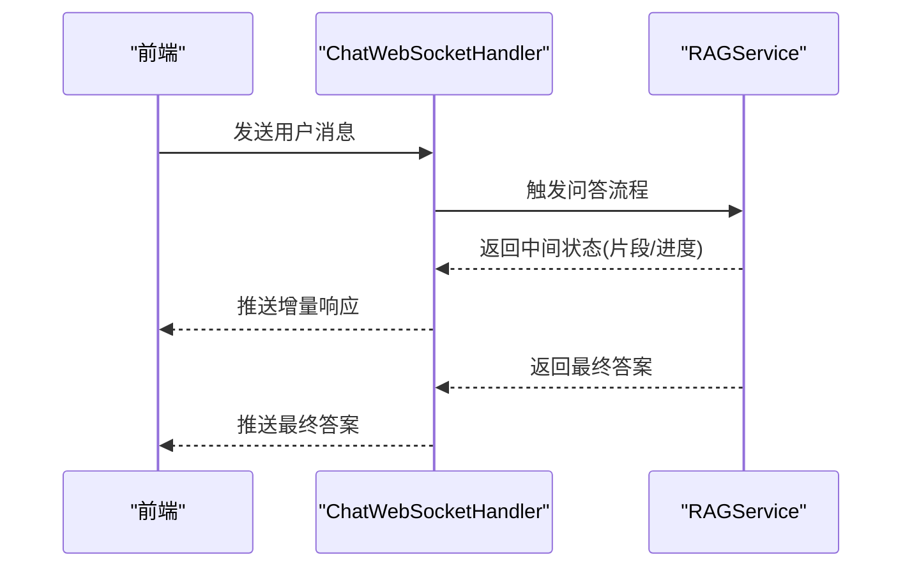
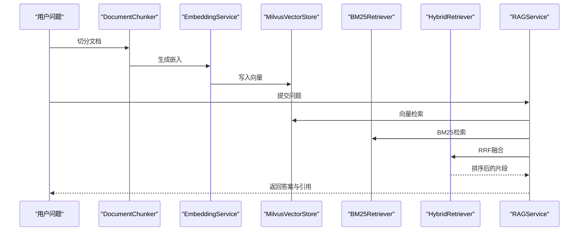
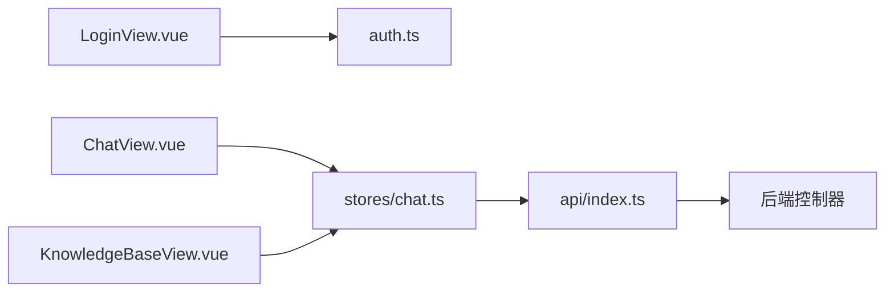
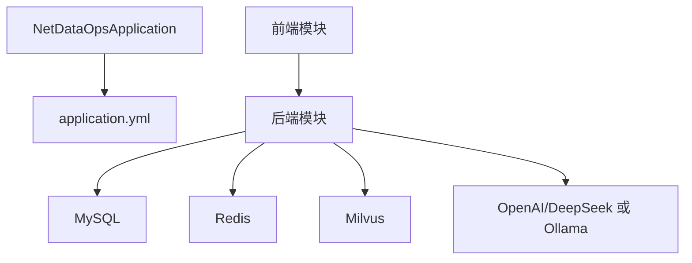

# AI问答API

<cite>
**本文引用的文件**
- [NetDataOpsApplication.java](file://netdata-ai-backend/src/main/java/com/netdata/ops/NetDataOpsApplication.java)
- [application.yml](file://netdata-ai-backend/src/main/resources/application.yml)
- [AuthController.java](file://netdata-ai-backend/src/main/java/com/netdata/ops/controller/AuthController.java)
- [KnowledgeController.java](file://netdata-ai-backend/src/main/java/com/netdata/ops/controller/KnowledgeController.java)
- [OpsController.java](file://netdata-ai-backend/src/main/java/com/netdata/ops/controller/OpsController.java)
- [WebSocketConfig.java](file://netdata-ai-backend/src/main/java/com/netdata/ops/websocket/WebSocketConfig.java)
- [ChatWebSocketHandler.java](file://netdata-ai-backend/src/main/java/com/netdata/ops/websocket/ChatWebSocketHandler.java)
- [SecurityConfig.java](file://netdata-ai-backend/src/main/java/com/netdata/ops/config/SecurityConfig.java)
- [JwtAuthenticationFilter.java](file://netdata-ai-backend/src/main/java/com/netdata/ops/security/JwtAuthenticationFilter.java)
- [JwtTokenProvider.java](file://netdata-ai-backend/src/main/java/com/netdata/ops/security/JwtTokenProvider.java)
- [RAGService.java](file://netdata-ai-backend/src/main/java/com/netdata/ops/core/rag/RAGService.java)
- [MilvusVectorStore.java](file://netdata-ai-backend/src/main/java/com/netdata/ops/core/rag/MilvusVectorStore.java)
- [HybridRetriever.java](file://netdata-ai-backend/src/main/java/com/netdata/ops/core/rag/HybridRetriever.java)
- [EmbeddingService.java](file://netdata-ai-backend/src/main/java/com/netdata/ops/core/rag/EmbeddingService.java)
- [DocumentChunker.java](file://netdata-ai-backend/src/main/java/com/netdata/ops/core/rag/DocumentChunker.java)
- [BM25Retriever.java](file://netdata-ai-backend/src/main/java/com/netdata/ops/core/rag/BM25Retriever.java)
- [GlobalExceptionHandler.java](file://netdata-ai-backend/src/main/java/com/netdata/ops/exception/GlobalExceptionHandler.java)
- [ErrorCode.java](file://netdata-ai-backend/src/main/java/com/netdata/ops/exception/ErrorCode.java)
- [BusinessException.java](file://netdata-ai-backend/src/main/java/com/netdata/ops/exception/BusinessException.java)
- [index.ts](file://netdata-ai-frontend/src/api/index.ts)
- [chat.ts](file://netdata-ai-frontend/src/stores/chat.ts)
- [MessageItem.vue](file://netdata-ai-frontend/src/components/MessageItem.vue)
- [ChatView.vue](file://netdata-ai-frontend/src/views/ChatView.vue)
- [KnowledgeBaseView.vue](file://netdata-ai-frontend/src/views/KnowledgeBaseView.vue)
- [LoginView.vue](file://netdata-ai-frontend/src/views/LoginView.vue)
- [auth.ts](file://netdata-ai-frontend/src/stores/auth.ts)
- [docker-compose.yml](file://docker-compose.yml)
- [requirements.txt](file://anomaly-detection-service/requirements.txt)
- [pom.xml](file://netdata-ai-backend/pom.xml)
</cite>

## 目录
1. [简介](#简介)
2. [项目结构](#项目结构)
3. [核心组件](#核心组件)
4. [架构总览](#架构总览)
5. [详细组件分析](#详细组件分析)
6. [依赖分析](#依赖分析)
7. [性能考虑](#性能考虑)
8. [故障排除指南](#故障排除指南)
9. [结论](#结论)
10. [附录](#附录)

## 简介
本文件为“智能运维问答与执行系统”的AI问答API文档，覆盖以下主题：
- 聊天接口的WebSocket连接协议、消息格式与实时交互模式
- 知识库管理接口的CRUD操作（文档上传、删除、检索）
- 问答系统的消息传递协议（用户消息、系统响应、中间状态）
- RAG检索过程中的API调用序列与数据流转
- 认证方法、权限控制与会话管理机制
- WebSocket连接示例、消息格式示例与错误处理策略
- API版本管理、兼容性保证与性能优化建议

该系统基于Spring Boot后端与Vue前端，采用RAG增强的问答流程，结合Milvus向量检索与BM25混合检索，并通过JWT进行认证与授权。

## 项目结构
后端采用标准Spring Boot结构，核心模块包括：
- 控制器层：认证、知识库、运维问答等控制器
- 安全层：JWT配置与过滤器
- RAG核心：嵌入、切分、向量存储、混合检索
- WebSocket：聊天消息推送
- 异常处理：统一错误码与异常转换
- 配置：应用配置、OpenAPI/Swagger、WebSocket、安全、限流等

前端采用Vue 3 + TypeScript，包含聊天视图、知识库视图、登录视图及状态管理。

**图表来源**
- [NetDataOpsApplication.java:1-36](file://netdata-ai-backend/src/main/java/com/netdata/ops/NetDataOpsApplication.java#L1-L36)
- [application.yml:1-314](file://netdata-ai-backend/src/main/resources/application.yml#L1-L314)

**章节来源**
- [NetDataOpsApplication.java:1-36](file://netdata-ai-backend/src/main/java/com/netdata/ops/NetDataOpsApplication.java#L1-L36)
- [application.yml:1-314](file://netdata-ai-backend/src/main/resources/application.yml#L1-L314)

## 核心组件
- 应用入口与启动：负责加载配置与启用异步支持
- 控制器：提供认证、知识库、运维问答等REST接口
- 安全：基于JWT的认证与权限拦截
- RAG：文档切分、嵌入、向量检索与融合排序
- WebSocket：聊天消息的实时推送
- 异常处理：统一业务异常与错误码

**章节来源**
- [NetDataOpsApplication.java:1-36](file://netdata-ai-backend/src/main/java/com/netdata/ops/NetDataOpsApplication.java#L1-L36)
- [application.yml:190-202](file://netdata-ai-backend/src/main/resources/application.yml#L190-L202)

## 架构总览
系统整体架构围绕“认证—RAG—对话—通知”展开，前端通过REST与WebSocket与后端交互，后端通过RAG服务完成知识检索与生成式回答。

**图表来源**
- [AuthController.java](file://netdata-ai-backend/src/main/java/com/netdata/ops/controller/AuthController.java)
- [KnowledgeController.java](file://netdata-ai-backend/src/main/java/com/netdata/ops/controller/KnowledgeController.java)
- [OpsController.java](file://netdata-ai-backend/src/main/java/com/netdata/ops/controller/OpsController.java)
- [SecurityConfig.java](file://netdata-ai-backend/src/main/java/com/netdata/ops/config/SecurityConfig.java)
- [JwtAuthenticationFilter.java](file://netdata-ai-backend/src/main/java/com/netdata/ops/security/JwtAuthenticationFilter.java)
- [RAGService.java](file://netdata-ai-backend/src/main/java/com/netdata/ops/core/rag/RAGService.java)
- [ChatWebSocketHandler.java](file://netdata-ai-backend/src/main/java/com/netdata/ops/websocket/ChatWebSocketHandler.java)
- [GlobalExceptionHandler.java](file://netdata-ai-backend/src/main/java/com/netdata/ops/exception/GlobalExceptionHandler.java)

## 详细组件分析

### 认证与会话管理
- JWT配置：密钥、访问令牌与刷新令牌过期时间
- 安全配置：拦截规则、跨域策略
- JWT过滤器：解析请求头中的令牌并注入认证信息
- 控制器：提供登录接口，返回令牌与用户信息

**图表来源**
- [application.yml:190-202](file://netdata-ai-backend/src/main/resources/application.yml#L190-L202)
- [SecurityConfig.java](file://netdata-ai-backend/src/main/java/com/netdata/ops/config/SecurityConfig.java)
- [JwtAuthenticationFilter.java](file://netdata-ai-backend/src/main/java/com/netdata/ops/security/JwtAuthenticationFilter.java)
- [JwtTokenProvider.java](file://netdata-ai-backend/src/main/java/com/netdata/ops/security/JwtTokenProvider.java)
- [AuthController.java](file://netdata-ai-backend/src/main/java/com/netdata/ops/controller/AuthController.java)

**章节来源**
- [application.yml:190-202](file://netdata-ai-backend/src/main/resources/application.yml#L190-L202)
- [SecurityConfig.java](file://netdata-ai-backend/src/main/java/com/netdata/ops/config/SecurityConfig.java)
- [JwtAuthenticationFilter.java](file://netdata-ai-backend/src/main/java/com/netdata/ops/security/JwtAuthenticationFilter.java)
- [JwtTokenProvider.java](file://netdata-ai-backend/src/main/java/com/netdata/ops/security/JwtTokenProvider.java)
- [AuthController.java](file://netdata-ai-backend/src/main/java/com/netdata/ops/controller/AuthController.java)

### WebSocket聊天协议与实时交互
- WebSocket路径：由配置定义
- 消息格式：文本消息与JSON结构（包含消息类型、内容、时间戳、会话标识等）
- 交互模式：建立连接后，前端发送用户消息；后端处理并分片推送中间状态与最终结果
- 错误处理：连接失败、消息格式错误、服务异常时返回错误码与提示

**图表来源**
- [application.yml:250-255](file://netdata-ai-backend/src/main/resources/application.yml#L250-L255)
- [ChatWebSocketHandler.java](file://netdata-ai-backend/src/main/java/com/netdata/ops/websocket/ChatWebSocketHandler.java)
- [RAGService.java](file://netdata-ai-backend/src/main/java/com/netdata/ops/core/rag/RAGService.java)
- [MilvusVectorStore.java](file://netdata-ai-backend/src/main/java/com/netdata/ops/core/rag/MilvusVectorStore.java)

**章节来源**
- [application.yml:250-255](file://netdata-ai-backend/src/main/resources/application.yml#L250-L255)
- [ChatWebSocketHandler.java](file://netdata-ai-backend/src/main/java/com/netdata/ops/websocket/ChatWebSocketHandler.java)

### 知识库管理接口（CRUD）
- 文档上传：接收文件，进行切分与嵌入，写入向量库
- 文档删除：根据ID删除向量与元数据
- 文档检索：支持关键词与向量混合检索，返回相关片段
- 分页与查询：支持分页列表与条件查询

**图表来源**
- [KnowledgeController.java](file://netdata-ai-backend/src/main/java/com/netdata/ops/controller/KnowledgeController.java)
- [DocumentChunker.java](file://netdata-ai-backend/src/main/java/com/netdata/ops/core/rag/DocumentChunker.java)
- [EmbeddingService.java](file://netdata-ai-backend/src/main/java/com/netdata/ops/core/rag/EmbeddingService.java)
- [MilvusVectorStore.java](file://netdata-ai-backend/src/main/java/com/netdata/ops/core/rag/MilvusVectorStore.java)
- [HybridRetriever.java](file://netdata-ai-backend/src/main/java/com/netdata/ops/core/rag/HybridRetriever.java)
- [BM25Retriever.java](file://netdata-ai-backend/src/main/java/com/netdata/ops/core/rag/BM25Retriever.java)

**章节来源**
- [KnowledgeController.java](file://netdata-ai-backend/src/main/java/com/netdata/ops/controller/KnowledgeController.java)
- [DocumentChunker.java](file://netdata-ai-backend/src/main/java/com/netdata/ops/core/rag/DocumentChunker.java)
- [EmbeddingService.java](file://netdata-ai-backend/src/main/java/com/netdata/ops/core/rag/EmbeddingService.java)
- [MilvusVectorStore.java](file://netdata-ai-backend/src/main/java/com/netdata/ops/core/rag/MilvusVectorStore.java)
- [HybridRetriever.java](file://netdata-ai-backend/src/main/java/com/netdata/ops/core/rag/HybridRetriever.java)
- [BM25Retriever.java](file://netdata-ai-backend/src/main/java/com/netdata/ops/core/rag/BM25Retriever.java)

### 问答消息传递协议
- 用户消息：包含会话ID、问题文本、上下文
- 中间状态：检索到的片段、生成进度、提示词模板
- 系统响应：最终答案、引用来源、错误信息
- 协议字段：消息类型、内容、时间戳、会话ID、状态码、错误码

**图表来源**
- [ChatWebSocketHandler.java](file://netdata-ai-backend/src/main/java/com/netdata/ops/websocket/ChatWebSocketHandler.java)
- [RAGService.java](file://netdata-ai-backend/src/main/java/com/netdata/ops/core/rag/RAGService.java)

**章节来源**
- [ChatWebSocketHandler.java](file://netdata-ai-backend/src/main/java/com/netdata/ops/websocket/ChatWebSocketHandler.java)
- [RAGService.java](file://netdata-ai-backend/src/main/java/com/netdata/ops/core/rag/RAGService.java)

### RAG检索调用序列与数据流转
- 输入：用户问题
- 流程：文档切分 → 嵌入向量 → 向量检索 → BM25检索 → RRF融合 → 排序裁剪 → 生成回答
- 输出：Top-K片段与最终答案

**图表来源**
- [DocumentChunker.java](file://netdata-ai-backend/src/main/java/com/netdata/ops/core/rag/DocumentChunker.java)
- [EmbeddingService.java](file://netdata-ai-backend/src/main/java/com/netdata/ops/core/rag/EmbeddingService.java)
- [MilvusVectorStore.java](file://netdata-ai-backend/src/main/java/com/netdata/ops/core/rag/MilvusVectorStore.java)
- [BM25Retriever.java](file://netdata-ai-backend/src/main/java/com/netdata/ops/core/rag/BM25Retriever.java)
- [HybridRetriever.java](file://netdata-ai-backend/src/main/java/com/netdata/ops/core/rag/HybridRetriever.java)
- [RAGService.java](file://netdata-ai-backend/src/main/java/com/netdata/ops/core/rag/RAGService.java)

**章节来源**
- [RAGService.java](file://netdata-ai-backend/src/main/java/com/netdata/ops/core/rag/RAGService.java)
- [MilvusVectorStore.java](file://netdata-ai-backend/src/main/java/com/netdata/ops/core/rag/MilvusVectorStore.java)
- [HybridRetriever.java](file://netdata-ai-backend/src/main/java/com/netdata/ops/core/rag/HybridRetriever.java)
- [BM25Retriever.java](file://netdata-ai-backend/src/main/java/com/netdata/ops/core/rag/BM25Retriever.java)

### 前端集成与示例
- 登录：调用登录接口获取令牌，保存至状态管理
- 聊天：通过WebSocket连接发送消息，接收增量与最终响应
- 知识库：上传文档、分页查询、删除操作
- 消息展示：使用消息组件渲染用户与系统消息

**图表来源**
- [LoginView.vue](file://netdata-ai-frontend/src/views/LoginView.vue)
- [ChatView.vue](file://netdata-ai-frontend/src/views/ChatView.vue)
- [KnowledgeBaseView.vue](file://netdata-ai-frontend/src/views/KnowledgeBaseView.vue)
- [auth.ts](file://netdata-ai-frontend/src/stores/auth.ts)
- [chat.ts](file://netdata-ai-frontend/src/stores/chat.ts)
- [MessageItem.vue](file://netdata-ai-frontend/src/components/MessageItem.vue)
- [index.ts](file://netdata-ai-frontend/src/api/index.ts)

**章节来源**
- [LoginView.vue](file://netdata-ai-frontend/src/views/LoginView.vue)
- [ChatView.vue](file://netdata-ai-frontend/src/views/ChatView.vue)
- [KnowledgeBaseView.vue](file://netdata-ai-frontend/src/views/KnowledgeBaseView.vue)
- [auth.ts](file://netdata-ai-frontend/src/stores/auth.ts)
- [chat.ts](file://netdata-ai-frontend/src/stores/chat.ts)
- [MessageItem.vue](file://netdata-ai-frontend/src/components/MessageItem.vue)
- [index.ts](file://netdata-ai-frontend/src/api/index.ts)

## 依赖分析
- 外部依赖：MySQL、Redis、Milvus、OpenAI/DeepSeek、Ollama
- 内部模块：控制器、服务、RAG、WebSocket、安全、异常处理
- 配置驱动：通过application.yml集中管理各组件配置

**图表来源**
- [NetDataOpsApplication.java:1-36](file://netdata-ai-backend/src/main/java/com/netdata/ops/NetDataOpsApplication.java#L1-L36)
- [application.yml:14-154](file://netdata-ai-backend/src/main/resources/application.yml#L14-L154)

**章节来源**
- [NetDataOpsApplication.java:1-36](file://netdata-ai-backend/src/main/java/com/netdata/ops/NetDataOpsApplication.java#L1-L36)
- [application.yml:14-154](file://netdata-ai-backend/src/main/resources/application.yml#L14-L154)

## 性能考虑
- 检索参数：向量Top-K、BM25 Top-K、最终Top-K、相似度阈值、RRF融合参数
- 限流策略：默认每分钟请求次数、问答与登录限流
- 降级策略：LLM降级至本地模型
- 并发与异步：启用异步处理以提升吞吐
- 缓存：Redis用于会话与临时数据缓存
- 日志与监控：Actuator与Resilience4j指标暴露

**章节来源**
- [application.yml:112-137](file://netdata-ai-backend/src/main/resources/application.yml#L112-L137)
- [application.yml:198-201](file://netdata-ai-backend/src/main/resources/application.yml#L198-L201)
- [application.yml:140-145](file://netdata-ai-backend/src/main/resources/application.yml#L140-L145)
- [application.yml:224-236](file://netdata-ai-backend/src/main/resources/application.yml#L224-L236)
- [NetDataOpsApplication.java:28-30](file://netdata-ai-backend/src/main/java/com/netdata/ops/NetDataOpsApplication.java#L28-L30)

## 故障排除指南
- 统一异常处理：定义业务异常与错误码，前端据此展示友好提示
- 常见问题：
  - 认证失败：检查令牌是否过期或格式错误
  - 检索失败：确认Milvus连接与集合存在
  - LLM调用失败：检查API Key与网络连通性，必要时启用本地降级
  - WebSocket连接失败：检查路径与跨域配置
- 建议：开启调试日志，收集traceId定位问题

**章节来源**
- [GlobalExceptionHandler.java](file://netdata-ai-backend/src/main/java/com/netdata/ops/exception/GlobalExceptionHandler.java)
- [ErrorCode.java](file://netdata-ai-backend/src/main/java/com/netdata/ops/exception/ErrorCode.java)
- [BusinessException.java](file://netdata-ai-backend/src/main/java/com/netdata/ops/exception/BusinessException.java)

## 结论
本API文档系统性地梳理了AI问答系统的认证、知识库管理、RAG检索与实时聊天交互。通过清晰的消息协议、完善的异常处理与性能优化建议，可支撑稳定高效的运维问答与执行场景。

## 附录

### API版本管理与兼容性
- 版本策略：遵循语义化版本，保持REST接口向后兼容
- 兼容性：新增字段采用非必填，变更字段提供迁移脚本
- 文档：OpenAPI/Swagger自动生成，便于联调与测试

**章节来源**
- [application.yml:239-248](file://netdata-ai-backend/src/main/resources/application.yml#L239-L248)

### 部署与运行
- 容器编排：使用Docker Compose一键部署
- 后端依赖：MySQL、Redis、Milvus、异常检测服务
- 前端构建：Vite + Vue 3，打包后静态部署

**章节来源**
- [docker-compose.yml](file://docker-compose.yml)
- [requirements.txt](file://anomaly-detection-service/requirements.txt)
- [pom.xml](file://netdata-ai-backend/pom.xml)