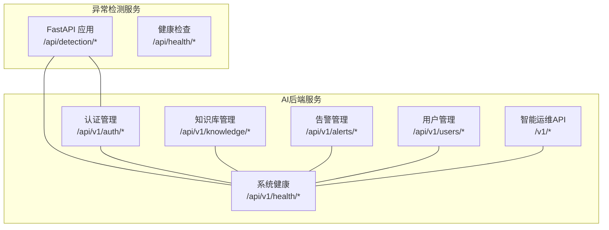
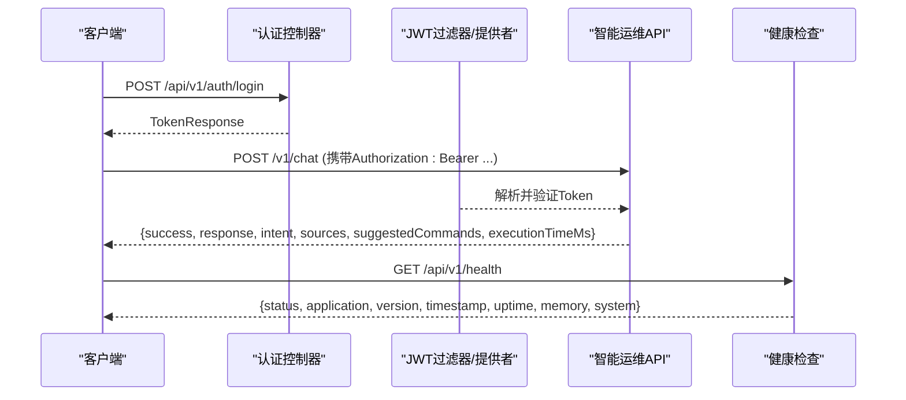
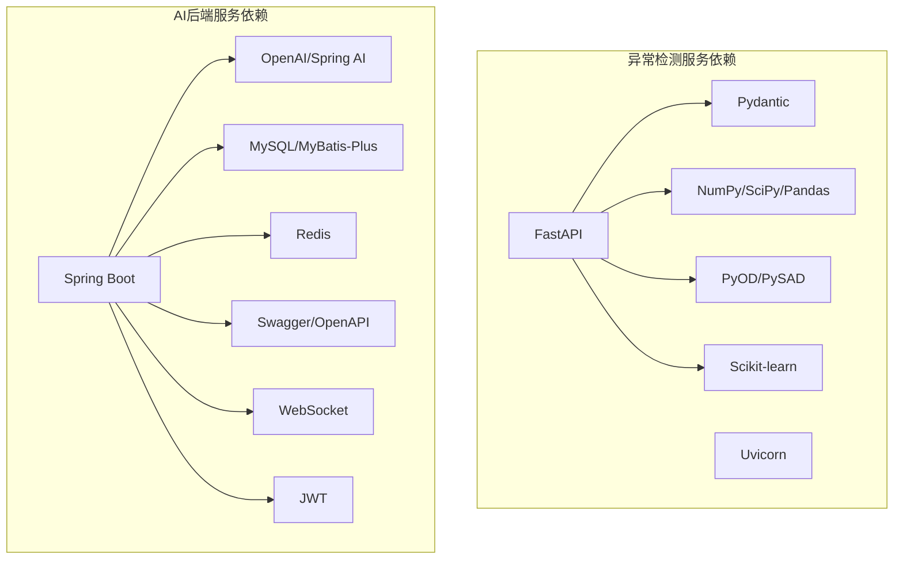

# API接口文档

<cite>
**本文引用的文件**
- [anomaly-detection-service/app/api/routes/detection.py](file://anomaly-detection-service/app/api/routes/detection.py)
- [anomaly-detection-service/app/api/routes/health.py](file://anomaly-detection-service/app/api/routes/health.py)
- [anomaly-detection-service/app/models/schemas.py](file://anomaly-detection-service/app/models/schemas.py)
- [anomaly-detection-service/app/config.py](file://anomaly-detection-service/app/config.py)
- [anomaly-detection-service/requirements.txt](file://anomaly-detection-service/requirements.txt)
- [netdata-ai-backend/src/main/java/com/netdata/ops/controller/AuthController.java](file://netdata-ai-backend/src/main/java/com/netdata/ops/controller/AuthController.java)
- [netdata-ai-backend/src/main/java/com/netdata/ops/controller/KnowledgeController.java](file://netdata-ai-backend/src/main/java/com/netdata/ops/controller/KnowledgeController.java)
- [netdata-ai-backend/src/main/java/com/netdata/ops/controller/AlertController.java](file://netdata-ai-backend/src/main/java/com/netdata/ops/controller/AlertController.java)
- [netdata-ai-backend/src/main/java/com/netdata/ops/controller/UserController.java](file://netdata-ai-backend/src/main/java/com/netdata/ops/controller/UserController.java)
- [netdata-ai-backend/src/main/java/com/netdata/ops/controller/HealthController.java](file://netdata-ai-backend/src/main/java/com/netdata/ops/controller/HealthController.java)
- [netdata-ai-backend/src/main/java/com/netdata/ops/controller/OpsController.java](file://netdata-ai-backend/src/main/java/com/netdata/ops/controller/OpsController.java)
- [netdata-ai-backend/src/main/java/com/netdata/ops/dto/response/R.java](file://netdata-ai-backend/src/main/java/com/netdata/ops/dto/response/R.java)
- [netdata-ai-backend/src/main/java/com/netdata/ops/exception/ErrorCode.java](file://netdata-ai-backend/src/main/java/com/netdata/ops/exception/ErrorCode.java)
- [netdata-ai-backend/src/main/java/com/netdata/ops/security/JwtAuthenticationFilter.java](file://netdata-ai-backend/src/main/java/com/netdata/ops/security/JwtAuthenticationFilter.java)
- [netdata-ai-backend/src/main/java/com/netdata/ops/security/JwtTokenProvider.java](file://netdata-ai-backend/src/main/java/com/netdata/ops/security/JwtTokenProvider.java)
- [netdata-ai-backend/src/main/resources/application.yml](file://netdata-ai-backend/src/main/resources/application.yml)
</cite>

## 目录
1. [简介](#简介)
2. [项目结构](#项目结构)
3. [核心组件](#核心组件)
4. [架构总览](#架构总览)
5. [详细组件分析](#详细组件分析)
6. [依赖分析](#依赖分析)
7. [性能考虑](#性能考虑)
8. [故障排除指南](#故障排除指南)
9. [结论](#结论)
10. [附录](#附录)

## 简介
本文件为系统所有API接口的完整文档，涵盖以下内容：
- 异常检测服务的REST API：批量检测、流式检测、训练检测器、从NetData获取并检测、健康检查等。
- AI后端服务的REST API：认证管理、聊天问答、知识库管理、告警管理、用户管理、系统健康检查等。
- WebSocket接口：连接协议、消息格式与事件类型说明。
- 认证与权限：基于JWT的认证方式、权限注解与拦截器。
- 错误码与异常处理策略。
- 接口使用示例、参数说明与返回值解析。
- API版本管理、兼容性与迁移指南。
- 性能优化建议与最佳实践。

## 项目结构
系统由两个主要服务组成：
- 异常检测服务（FastAPI + Pydantic）：提供批量/流式异常检测、模型训练、健康检查与NetData集成。
- AI后端服务（Spring Boot）：提供认证、聊天问答、知识库、告警、用户管理与系统健康检查，并通过WebSocket推送实时事件。

图表来源
- [anomaly-detection-service/app/api/routes/detection.py:55-378](file://anomaly-detection-service/app/api/routes/detection.py#L55-L378)
- [anomaly-detection-service/app/api/routes/health.py:25-88](file://anomaly-detection-service/app/api/routes/health.py#L25-L88)
- [netdata-ai-backend/src/main/java/com/netdata/ops/controller/AuthController.java:24-78](file://netdata-ai-backend/src/main/java/com/netdata/ops/controller/AuthController.java#L24-L78)
- [netdata-ai-backend/src/main/java/com/netdata/ops/controller/KnowledgeController.java:21-82](file://netdata-ai-backend/src/main/java/com/netdata/ops/controller/KnowledgeController.java#L21-L82)
- [netdata-ai-backend/src/main/java/com/netdata/ops/controller/AlertController.java:21-108](file://netdata-ai-backend/src/main/java/com/netdata/ops/controller/AlertController.java#L21-L108)
- [netdata-ai-backend/src/main/java/com/netdata/ops/controller/UserController.java:25-95](file://netdata-ai-backend/src/main/java/com/netdata/ops/controller/UserController.java#L25-L95)
- [netdata-ai-backend/src/main/java/com/netdata/ops/controller/HealthController.java:23-71](file://netdata-ai-backend/src/main/java/com/netdata/ops/controller/HealthController.java#L23-L71)
- [netdata-ai-backend/src/main/java/com/netdata/ops/controller/OpsController.java:25-81](file://netdata-ai-backend/src/main/java/com/netdata/ops/controller/OpsController.java#L25-L81)

章节来源
- [anomaly-detection-service/app/api/routes/detection.py:1-378](file://anomaly-detection-service/app/api/routes/detection.py#L1-L378)
- [anomaly-detection-service/app/api/routes/health.py:1-88](file://anomaly-detection-service/app/api/routes/health.py#L1-L88)
- [netdata-ai-backend/src/main/java/com/netdata/ops/controller/AuthController.java:1-78](file://netdata-ai-backend/src/main/java/com/netdata/ops/controller/AuthController.java#L1-L78)
- [netdata-ai-backend/src/main/java/com/netdata/ops/controller/KnowledgeController.java:1-82](file://netdata-ai-backend/src/main/java/com/netdata/ops/controller/KnowledgeController.java#L1-L82)
- [netdata-ai-backend/src/main/java/com/netdata/ops/controller/AlertController.java:1-108](file://netdata-ai-backend/src/main/java/com/netdata/ops/controller/AlertController.java#L1-L108)
- [netdata-ai-backend/src/main/java/com/netdata/ops/controller/UserController.java:1-95](file://netdata-ai-backend/src/main/java/com/netdata/ops/controller/UserController.java#L1-L95)
- [netdata-ai-backend/src/main/java/com/netdata/ops/controller/HealthController.java:1-71](file://netdata-ai-backend/src/main/java/com/netdata/ops/controller/HealthController.java#L1-L71)
- [netdata-ai-backend/src/main/java/com/netdata/ops/controller/OpsController.java:1-81](file://netdata-ai-backend/src/main/java/com/netdata/ops/controller/OpsController.java#L1-L81)

## 核心组件
- 异常检测服务：提供批量/流式异常检测、模型训练、从NetData获取数据并检测、健康检查。
- AI后端服务：提供统一响应包装R<T>、错误码ErrorCode、JWT认证过滤器与Token提供者、各业务控制器。
- WebSocket：通过配置暴露WS路径，用于实时事件推送（如告警、审批通知）。

章节来源
- [anomaly-detection-service/app/models/schemas.py:28-329](file://anomaly-detection-service/app/models/schemas.py#L28-L329)
- [netdata-ai-backend/src/main/java/com/netdata/ops/dto/response/R.java:1-81](file://netdata-ai-backend/src/main/java/com/netdata/ops/dto/response/R.java#L1-L81)
- [netdata-ai-backend/src/main/java/com/netdata/ops/exception/ErrorCode.java:1-55](file://netdata-ai-backend/src/main/java/com/netdata/ops/exception/ErrorCode.java#L1-L55)
- [netdata-ai-backend/src/main/java/com/netdata/ops/security/JwtAuthenticationFilter.java:1-75](file://netdata-ai-backend/src/main/java/com/netdata/ops/security/JwtAuthenticationFilter.java#L1-L75)
- [netdata-ai-backend/src/main/java/com/netdata/ops/security/JwtTokenProvider.java:1-204](file://netdata-ai-backend/src/main/java/com/netdata/ops/security/JwtTokenProvider.java#L1-L204)
- [netdata-ai-backend/src/main/resources/application.yml:220-224](file://netdata-ai-backend/src/main/resources/application.yml#L220-L224)

## 架构总览
系统采用前后端分离架构，异常检测服务与AI后端服务通过REST API交互，AI后端服务负责统一认证、权限控制与业务编排，异常检测服务专注于时序数据异常检测。

图表来源
- [netdata-ai-backend/src/main/java/com/netdata/ops/controller/AuthController.java:30-36](file://netdata-ai-backend/src/main/java/com/netdata/ops/controller/AuthController.java#L30-L36)
- [netdata-ai-backend/src/main/java/com/netdata/ops/controller/OpsController.java:37-59](file://netdata-ai-backend/src/main/java/com/netdata/ops/controller/OpsController.java#L37-L59)
- [netdata-ai-backend/src/main/java/com/netdata/ops/security/JwtAuthenticationFilter.java:35-62](file://netdata-ai-backend/src/main/java/com/netdata/ops/security/JwtAuthenticationFilter.java#L35-L62)
- [netdata-ai-backend/src/main/java/com/netdata/ops/controller/HealthController.java:32-62](file://netdata-ai-backend/src/main/java/com/netdata/ops/controller/HealthController.java#L32-L62)

## 详细组件分析

### 异常检测服务API

#### 批量异常检测
- 方法与路径
  - POST /api/detection/batch
- 功能说明
  - 对一批时序数据进行离线异常检测，适用于历史分析、离线报表与模型验证。
- 请求参数
  - data: 数组，元素为指标数据点，包含时间戳、指标名称、数值、主机、标签等。
  - detector_type: 检测器类型（离线：isolation_forest、lof、knn；默认隔离森林）。
  - threshold: 自定义异常阈值（可选，覆盖默认）。
  - return_scores: 是否返回异常分数（可选，默认true）。
- 响应
  - status: 检测状态（success/failed/partial）。
  - detector_type: 使用的检测器类型。
  - threshold: 使用的阈值。
  - total_count/anomaly_count: 总数据点数与异常数。
  - processing_time_ms: 处理耗时（毫秒）。
  - results: 当return_scores为true时返回异常结果数组。
- 示例
  - 请求体字段参考：指标名称、数值、时间戳、主机、标签等。
  - 返回字段参考：状态、检测器、阈值、计数、耗时、结果列表。
- 错误处理
  - 服务器内部错误返回500及错误详情。
- 性能与限制
  - 默认最大批量大小与阈值配置见配置文件。

章节来源
- [anomaly-detection-service/app/api/routes/detection.py:55-153](file://anomaly-detection-service/app/api/routes/detection.py#L55-L153)
- [anomaly-detection-service/app/models/schemas.py:95-130](file://anomaly-detection-service/app/models/schemas.py#L95-L130)
- [anomaly-detection-service/app/config.py:132-146](file://anomaly-detection-service/app/config.py#L132-L146)

#### 流式异常检测
- 方法与路径
  - POST /api/detection/stream
- 功能说明
  - 对单条数据进行实时异常检测，适用于实时监控与在线学习。
- 请求参数
  - data_point: 指标数据点（同上）。
  - detector_type: 在线检测器类型（half_space_trees、xstream；默认半空间树）。
  - threshold: 自定义阈值（可选）。
- 响应
  - is_anomaly: 是否异常。
  - anomaly_score: 异常分数（0-1）。
  - level: 异常等级（normal/warning/critical）。
  - detector_type: 检测器类型。
  - processing_time_ms: 处理耗时。
- 示例
  - 请求体字段参考：指标名称、数值、时间戳等。
  - 返回字段参考：异常标识、分数、等级、耗时。
- 错误处理
  - 服务器内部错误返回500及错误详情。

章节来源
- [anomaly-detection-service/app/api/routes/detection.py:158-219](file://anomaly-detection-service/app/api/routes/detection.py#L158-L219)
- [anomaly-detection-service/app/models/schemas.py:132-153](file://anomaly-detection-service/app/models/schemas.py#L132-L153)

#### 训练检测器
- 方法与路径
  - POST /api/detection/train
- 功能说明
  - 使用历史数据训练离线检测器，初始化或更新模型。
- 请求参数
  - training_data: 训练数据点数组（至少10个样本）。
  - detector_type: 检测器类型（离线）。
  - contamination: 预期异常比例（0.01-0.5）。
  - model_name: 模型名称（可选，用于保存与加载）。
- 响应
  - status: 训练状态（success）。
  - detector_type: 检测器类型。
  - model_name: 模型名称。
  - training_samples: 训练样本数。
  - training_time_ms: 训练耗时。
- 示例
  - 请求体字段参考：训练数据、检测器类型、异常比例、模型名。
  - 返回字段参考：状态、类型、名称、样本数、耗时。
- 错误处理
  - 服务器内部错误返回500及错误详情。

章节来源
- [anomaly-detection-service/app/api/routes/detection.py:224-280](file://anomaly-detection-service/app/api/routes/detection.py#L224-L280)
- [anomaly-detection-service/app/models/schemas.py:155-183](file://anomaly-detection-service/app/models/schemas.py#L155-L183)

#### 从NetData获取并检测
- 方法与路径
  - POST /api/detection/netdata/fetch
- 功能说明
  - 直接从NetData API获取指标数据并进行批量异常检测。
- 请求参数
  - chart: 图表名称（如 system.cpu, system.ram）。
  - after/before: 时间范围（相对当前，秒）。
  - points: 返回数据点数量（1-1000）。
  - host: 目标主机（可选）。
- 响应
  - 同批量检测响应。
- 错误处理
  - 未获取到数据返回404。
  - 其他异常返回500及错误详情。

章节来源
- [anomaly-detection-service/app/api/routes/detection.py:285-378](file://anomaly-detection-service/app/api/routes/detection.py#L285-L378)
- [anomaly-detection-service/app/models/schemas.py:185-214](file://anomaly-detection-service/app/models/schemas.py#L185-L214)

#### 健康检查
- 方法与路径
  - GET /api/health/health：服务健康状态。
  - GET /api/health/ready：就绪检查（Kubernetes就绪探针）。
  - GET /api/health/live：存活检查（Kubernetes存活探针）。
- 响应
  - 健康接口返回状态、版本、已加载检测器列表、运行时长等。
  - 就绪/存活接口返回简单状态字符串。
- 示例
  - 健康响应字段参考：status、version、detectors_loaded、uptime_seconds。
  - 就绪/存活响应字段参考：status。

章节来源
- [anomaly-detection-service/app/api/routes/health.py:25-88](file://anomaly-detection-service/app/api/routes/health.py#L25-L88)
- [anomaly-detection-service/app/models/schemas.py:286-298](file://anomaly-detection-service/app/models/schemas.py#L286-L298)

### AI后端服务API

#### 认证管理
- 方法与路径
  - POST /api/v1/auth/login：用户登录。
  - POST /api/v1/auth/logout：用户登出。
  - POST /api/v1/auth/refresh：刷新Token。
  - GET /api/v1/auth/me：获取当前用户信息。
- 请求参数
  - 登录：用户名、密码等（具体字段以请求体模型为准）。
  - 刷新：refreshToken（必填）。
  - 登出/获取当前用户：Authorization头（Bearer Token）。
- 响应
  - 统一响应包装R<T>，包含code、message、data、traceId、timestamp。
  - 登录成功返回TokenResponse（包含用户信息与令牌）。
  - 获取当前用户失败返回401未认证。
- 权限与认证
  - 使用JWT过滤器解析与验证Token，设置SecurityContext。
  - 登出时将Token加入黑名单，支持主动注销。
- 示例
  - 登录请求体字段参考：用户名、密码。
  - 登录响应字段参考：code、message、data（TokenResponse）。
- 错误处理
  - 未认证返回401，权限不足返回403，参数错误返回400，请求过于频繁返回429。

章节来源
- [netdata-ai-backend/src/main/java/com/netdata/ops/controller/AuthController.java:30-68](file://netdata-ai-backend/src/main/java/com/netdata/ops/controller/AuthController.java#L30-L68)
- [netdata-ai-backend/src/main/java/com/netdata/ops/security/JwtAuthenticationFilter.java:35-62](file://netdata-ai-backend/src/main/java/com/netdata/ops/security/JwtAuthenticationFilter.java#L35-L62)
- [netdata-ai-backend/src/main/java/com/netdata/ops/security/JwtTokenProvider.java:88-107](file://netdata-ai-backend/src/main/java/com/netdata/ops/security/JwtTokenProvider.java#L88-L107)
- [netdata-ai-backend/src/main/java/com/netdata/ops/dto/response/R.java:27-75](file://netdata-ai-backend/src/main/java/com/netdata/ops/dto/response/R.java#L27-L75)
- [netdata-ai-backend/src/main/java/com/netdata/ops/exception/ErrorCode.java:18-28](file://netdata-ai-backend/src/main/java/com/netdata/ops/exception/ErrorCode.java#L18-L28)

#### 知识库管理
- 方法与路径
  - GET /api/v1/knowledge/documents：分页查询文档列表（支持分类、状态、关键词筛选）。
  - GET /api/v1/knowledge/documents/{id}：获取文档详情。
  - POST /api/v1/knowledge/documents：上传/创建文档。
  - DELETE /api/v1/knowledge/documents/{id}：删除文档。
  - GET /api/v1/knowledge/categories：获取分类列表。
  - GET /api/v1/knowledge/stats：知识库统计。
- 权限要求
  - 读操作需具备knowledge:read权限。
  - 写/删操作需具备knowledge:write/delete权限。
- 请求参数
  - 分页查询：current（默认1）、size（默认10）、category、status、keyword。
  - 创建文档：title、source、contentType、category、content。
  - 删除文档：路径参数id。
- 响应
  - 统一响应包装R<T>，分页查询返回PageResult<KnowledgeDocument>。
- 示例
  - 创建文档请求体字段参考：标题、来源、内容类型、分类、内容。
  - 统计接口返回字段参考：各类统计指标。
- 错误处理
  - 无权限返回403，数据不存在返回404，请求过于频繁返回429。

章节来源
- [netdata-ai-backend/src/main/java/com/netdata/ops/controller/KnowledgeController.java:27-80](file://netdata-ai-backend/src/main/java/com/netdata/ops/controller/KnowledgeController.java#L27-L80)

#### 告警管理
- 方法与路径
  - GET /api/v1/alerts：分页查询告警列表（支持严重程度、状态、主机、关键词筛选）。
  - GET /api/v1/alerts/{id}：获取告警详情。
  - PUT /api/v1/alerts/{id}/resolve：确认/解决告警。
  - PUT /api/v1/alerts/batch-resolve：批量解决告警。
  - POST /api/v1/alerts/webhook：接收外部告警webhook。
  - GET /api/v1/alerts/stats：告警统计概览。
  - GET /api/v1/alerts/trend：告警趋势（最近7天）。
  - POST /api/v1/alerts/{id}/diagnose：触发AI智能诊断。
- 权限要求
  - 读操作需具备alert:read权限。
  - 写/解决操作需具备alert:write权限。
  - 触发诊断需具备alert:execute权限。
- 请求参数
  - 分页查询：current、size、severity、status、host、keyword。
  - 解决告警：路径参数id，请求体包含diagnosisResult。
  - 批量解决：请求体包含ids（数组）与diagnosisResult。
  - 接收webhook：alertId、source、severity、alertName、message、host、metricName、metricValue、threshold。
  - 触发诊断：路径参数id。
- 响应
  - 统一响应包装R<T>，部分接口返回PageResult或统计结果。
- 示例
  - 接收webhook请求体字段参考：告警标识、来源、严重程度、指标名、阈值等。
  - 统计接口返回字段参考：各类统计指标与趋势。
- 错误处理
  - 无权限返回403，数据不存在返回404，请求过于频繁返回429。

章节来源
- [netdata-ai-backend/src/main/java/com/netdata/ops/controller/AlertController.java:27-106](file://netdata-ai-backend/src/main/java/com/netdata/ops/controller/AlertController.java#L27-L106)

#### 用户管理
- 方法与路径
  - GET /api/v1/users：分页查询用户列表（支持关键词筛选）。
  - GET /api/v1/users/{id}：获取用户详情。
  - POST /api/v1/users：创建用户。
  - PUT /api/v1/users/{id}：更新用户信息。
  - DELETE /api/v1/users/{id}：删除用户。
  - POST /api/v1/users/{id}/roles：为用户分配角色。
  - PUT /api/v1/users/{id}/password：重置用户密码。
  - PUT /api/v1/users/me/password：修改自己的密码。
- 权限要求
  - 读操作需具备user:read权限。
  - 写/删/分配角色/重置密码操作需具备user:write/role_assign权限。
- 请求参数
  - 分页查询：current、size、keyword。
  - 创建/更新：请求体包含用户基本信息（具体字段以请求体模型为准）。
  - 分配角色：请求体包含roleIds（数组）。
  - 重置密码/修改自己密码：请求体包含新密码或旧/新密码。
- 响应
  - 统一响应包装R<T>，分页查询返回PageResult<UserVO>。
- 示例
  - 创建用户请求体字段参考：用户名、邮箱、手机号等（以实际模型为准）。
  - 分配角色请求体字段参考：roleIds数组。
- 错误处理
  - 无权限返回403，数据不存在返回404，请求过于频繁返回429。

章节来源
- [netdata-ai-backend/src/main/java/com/netdata/ops/controller/UserController.java:31-93](file://netdata-ai-backend/src/main/java/com/netdata/ops/controller/UserController.java#L31-L93)

#### 系统健康检查
- 方法与路径
  - GET /api/v1/health：系统健康检查，返回状态、应用名、版本、时间戳、运行时长、内存与系统信息。
- 响应
  - 统一响应包装R<T>，data字段包含status、application、version、timestamp、uptime、memory、system等。
- 示例
  - 响应字段参考：status、application、version、timestamp、uptime、memory（max/total/free/usedMB）、system（javaVersion/os/processors）。

章节来源
- [netdata-ai-backend/src/main/java/com/netdata/ops/controller/HealthController.java:32-62](file://netdata-ai-backend/src/main/java/com/netdata/ops/controller/HealthController.java#L32-L62)

#### 智能运维API
- 方法与路径
  - POST /v1/chat：智能问答。
  - GET /v1/health：服务健康检查。
- 请求参数
  - /v1/chat：ChatRequest（sessionId、userId、query）。
- 响应
  - /v1/chat：Map<String, Object>，包含success、response、intent、sources、suggestedCommands、executionTimeMs。
  - /v1/health：Map<String, Object>，包含status、service。
- 示例
  - /v1/chat请求体字段参考：会话ID、用户ID、问题。
  - /v1/chat响应字段参考：成功标志、回答文本、意图类型、来源列表、建议命令、执行耗时。

章节来源
- [netdata-ai-backend/src/main/java/com/netdata/ops/controller/OpsController.java:37-70](file://netdata-ai-backend/src/main/java/com/netdata/ops/controller/OpsController.java#L37-L70)

### WebSocket接口
- 连接协议
  - WS路径：/ws（由配置文件定义）。
  - 允许来源：*（可在配置中调整）。
- 消息格式
  - 文本帧：JSON对象，包含事件类型与数据负载。
  - 二进制帧：根据业务需要扩展。
- 事件类型
  - 告警推送：当告警状态变化或新增告警时推送。
  - 审批通知：当审批流程状态变更时推送。
  - 系统通知：系统维护、升级等通知。
- 示例
  - 告警事件：{ event: "ALERT_CREATED", data: { alertId, severity, message, host, timestamp } }
  - 审批事件：{ event: "APPROVAL_UPDATED", data: { flowId, status, approver, actionTime } }

章节来源
- [netdata-ai-backend/src/main/resources/application.yml:221-224](file://netdata-ai-backend/src/main/resources/application.yml#L221-L224)

## 依赖分析
- 异常检测服务依赖
  - FastAPI、Pydantic、Pydantic Settings、NumPy、PyOD、PySAD、Scikit-learn、日志与测试工具。
- AI后端服务依赖
  - Spring Boot、Spring AI、MySQL、Redis、MyBatis-Plus、OpenAPI/Swagger、WebSocket、JWT、限流与拦截器。

图表来源
- [anomaly-detection-service/requirements.txt:20-50](file://anomaly-detection-service/requirements.txt#L20-L50)
- [netdata-ai-backend/src/main/resources/application.yml:31-59](file://netdata-ai-backend/src/main/resources/application.yml#L31-L59)
- [netdata-ai-backend/src/main/resources/application.yml:90-99](file://netdata-ai-backend/src/main/resources/application.yml#L90-L99)
- [netdata-ai-backend/src/main/resources/application.yml:185-189](file://netdata-ai-backend/src/main/resources/application.yml#L185-L189)

章节来源
- [anomaly-detection-service/requirements.txt:1-94](file://anomaly-detection-service/requirements.txt#L1-L94)
- [netdata-ai-backend/src/main/resources/application.yml:1-283](file://netdata-ai-backend/src/main/resources/application.yml#L1-L283)

## 性能考虑
- 异常检测
  - 批量检测：合理设置max_batch_size，避免超大数据集导致内存压力。
  - 流式检测：选择合适的在线检测器（如half_space_trees），关注processing_time_ms。
  - 缓存：利用cache_ttl减少重复计算。
- AI后端
  - JWT：短时间有效，结合Redis黑名单实现快速注销。
  - 限流：默认每分钟60次，AI问答与登录分别限流，防止滥用。
  - RAG：向量与BM25检索Top-K、RRF融合参数可调优召回与速度平衡。
- 网络与并发
  - 异常检测服务使用异步HTTP客户端，提升外部API调用效率。
  - Spring Boot使用Hikari连接池与Redis连接池，合理配置最大连接数与等待时间。

章节来源
- [anomaly-detection-service/app/config.py:144-146](file://anomaly-detection-service/app/config.py#L144-L146)
- [netdata-ai-backend/src/main/resources/application.yml:190-194](file://netdata-ai-backend/src/main/resources/application.yml#L190-L194)
- [netdata-ai-backend/src/main/resources/application.yml:36-42](file://netdata-ai-backend/src/main/resources/application.yml#L36-L42)
- [netdata-ai-backend/src/main/resources/application.yml:47-59](file://netdata-ai-backend/src/main/resources/application.yml#L47-L59)

## 故障排除指南
- 认证与权限
  - 401未认证：检查Authorization头是否为Bearer Token且格式正确。
  - 403权限不足：确认用户角色与所需权限（如knowledge:read/write/delete）。
  - Token过期/无效：使用refresh接口刷新Token，或重新登录。
- 错误码对照
  - 通用：SUCCESS、INTERNAL_ERROR、PARAM_INVALID、DATA_NOT_FOUND、DATA_ALREADY_EXISTS。
  - 认证：UNAUTHORIZED、TOKEN_EXPIRED、TOKEN_INVALID、LOGIN_FAILED、ACCOUNT_LOCKED、ACCOUNT_DISABLED。
  - 授权：FORBIDDEN、PERMISSION_DENIED、ROLE_NOT_FOUND。
  - 用户：USER_NOT_FOUND、USERNAME_EXISTS、EMAIL_EXISTS、PASSWORD_INVALID、OLD_PASSWORD_WRONG。
  - 审批：APPROVAL_NOT_FOUND、APPROVAL_ALREADY_PROCESSED、APPROVAL_NOT_AUTHORIZED、APPROVAL_EXPIRED。
  - 限流：RATE_LIMIT_EXCEEDED。
- 健康检查
  - 异常检测服务：GET /api/health/health查看detectors_loaded与uptime_seconds。
  - AI后端服务：GET /api/v1/health查看JVM与系统信息。

章节来源
- [netdata-ai-backend/src/main/java/com/netdata/ops/dto/response/R.java:27-75](file://netdata-ai-backend/src/main/java/com/netdata/ops/dto/response/R.java#L27-L75)
- [netdata-ai-backend/src/main/java/com/netdata/ops/exception/ErrorCode.java:11-45](file://netdata-ai-backend/src/main/java/com/netdata/ops/exception/ErrorCode.java#L11-L45)
- [anomaly-detection-service/app/api/routes/health.py:31-52](file://anomaly-detection-service/app/api/routes/health.py#L31-L52)
- [netdata-ai-backend/src/main/java/com/netdata/ops/controller/HealthController.java:32-62](file://netdata-ai-backend/src/main/java/com/netdata/ops/controller/HealthController.java#L32-L62)

## 结论
本API文档全面覆盖了异常检测服务与AI后端服务的REST与WebSocket接口，明确了认证授权、错误码与异常处理策略，并提供了性能优化与最佳实践建议。建议在生产环境中启用HTTPS、严格权限控制与限流策略，并定期审查与更新接口版本与兼容性。

## 附录

### API版本管理与兼容性
- 版本策略
  - 异常检测服务：版本号在配置中定义，建议遵循语义化版本。
  - AI后端服务：统一在健康检查接口返回版本信息，便于客户端识别。
- 兼容性保证
  - 保持向后兼容的响应字段，新增字段以非必需形式提供。
  - 对于破坏性变更，提供迁移指南并在健康检查中标注版本差异。
- 迁移指南
  - 字段变更：客户端需兼容旧字段与新字段并逐步替换。
  - 权限变更：更新角色与权限映射，确保业务不受影响。
  - 配置变更：更新application.yml中的相关配置项并验证。

章节来源
- [anomaly-detection-service/app/config.py:52-54](file://anomaly-detection-service/app/config.py#L52-L54)
- [netdata-ai-backend/src/main/java/com/netdata/ops/controller/HealthController.java:37-38](file://netdata-ai-backend/src/main/java/com/netdata/ops/controller/HealthController.java#L37-L38)