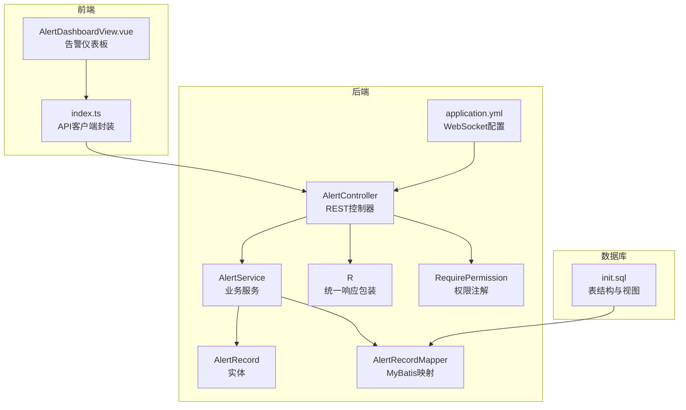
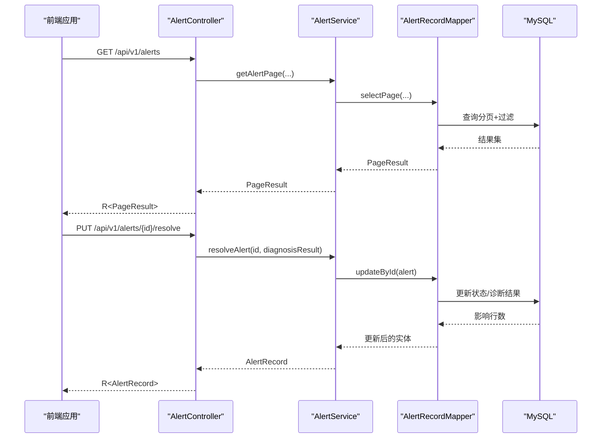
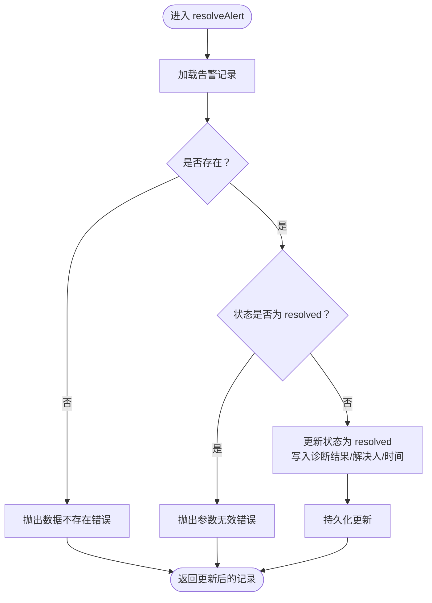
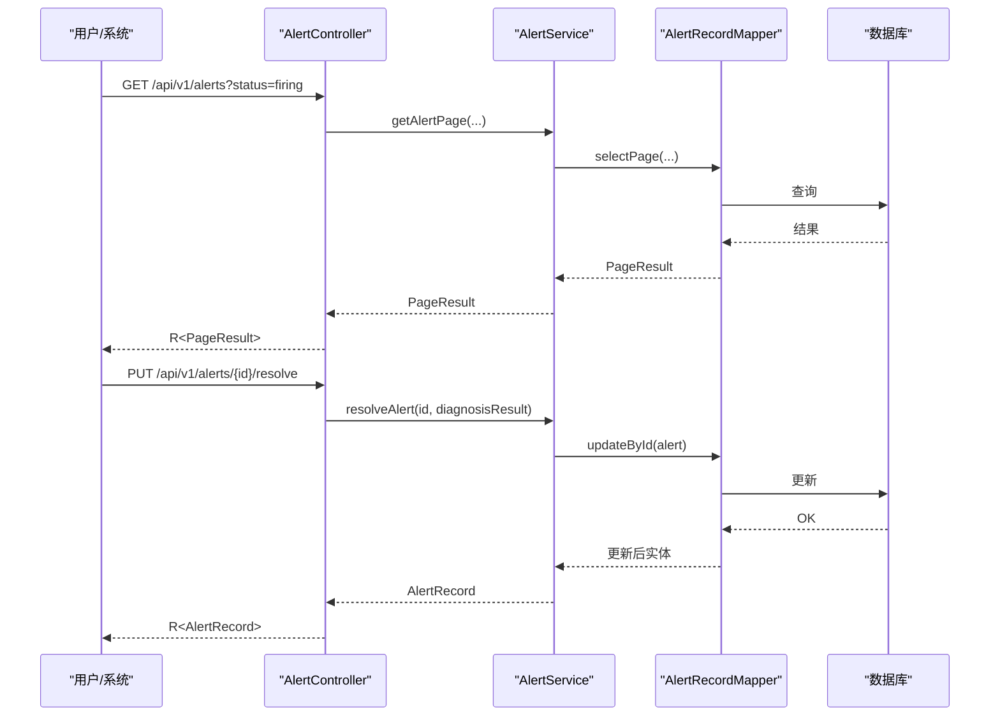
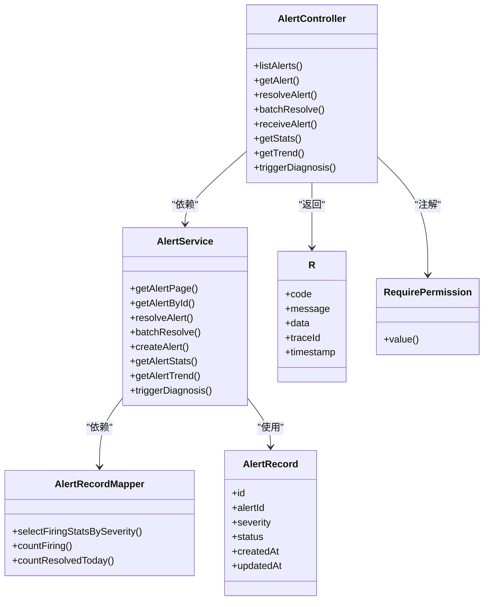
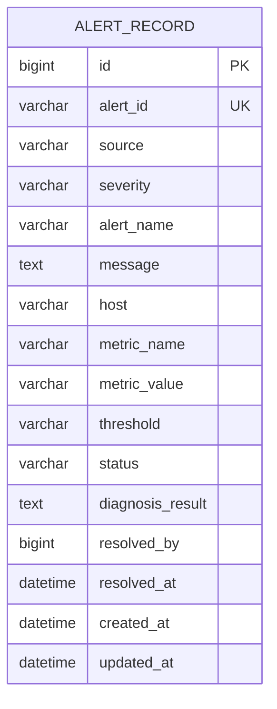

# 告警管理API

<cite>
**本文引用的文件**
- [AlertController.java](file://netdata-ai-backend/src/main/java/com/netdata/ops/controller/AlertController.java)
- [AlertService.java](file://netdata-ai-backend/src/main/java/com/netdata/ops/service/AlertService.java)
- [AlertRecord.java](file://netdata-ai-backend/src/main/java/com/netdata/ops/entity/AlertRecord.java)
- [AlertRecordMapper.java](file://netdata-ai-backend/src/main/java/com/netdata/ops/mapper/AlertRecordMapper.java)
- [R.java](file://netdata-ai-backend/src/main/java/com/netdata/ops/dto/response/R.java)
- [RequirePermission.java](file://netdata-ai-backend/src/main/java/com/netdata/ops/annotation/RequirePermission.java)
- [application.yml](file://netdata-ai-backend/src/main/resources/application.yml)
- [index.ts](file://netdata-ai-frontend/src/api/index.ts)
- [AlertDashboardView.vue](file://netdata-ai-frontend/src/views/AlertDashboardView.vue)
- [init.sql](file://sql/init.sql)
</cite>

## 目录
1. [简介](#简介)
2. [项目结构](#项目结构)
3. [核心组件](#核心组件)
4. [架构总览](#架构总览)
5. [详细组件分析](#详细组件分析)
6. [依赖分析](#依赖分析)
7. [性能考虑](#性能考虑)
8. [故障排查指南](#故障排查指南)
9. [结论](#结论)
10. [附录](#附录)

## 简介
本文件为告警管理系统提供完整的API文档，覆盖告警查询、状态更新、通知推送、统计报表、规则配置、WebSocket实时推送、历史查询及处理流程。文档基于后端Java控制器与服务层实现，结合前端API封装与数据库表结构，给出HTTP方法、参数、响应格式、权限与错误处理策略，并提供可视化流程图帮助理解。

## 项目结构
告警管理相关代码主要位于后端模块的控制器、服务、实体、映射与配置中；前端提供API封装与视图层展示。

图表来源
- [AlertController.java:21-107](file://netdata-ai-backend/src/main/java/com/netdata/ops/controller/AlertController.java#L21-L107)
- [AlertService.java:27-237](file://netdata-ai-backend/src/main/java/com/netdata/ops/service/AlertService.java#L27-L237)
- [AlertRecord.java:13-55](file://netdata-ai-backend/src/main/java/com/netdata/ops/entity/AlertRecord.java#L13-L55)
- [AlertRecordMapper.java:12-24](file://netdata-ai-backend/src/main/java/com/netdata/ops/mapper/AlertRecordMapper.java#L12-L24)
- [R.java:14-80](file://netdata-ai-backend/src/main/java/com/netdata/ops/dto/response/R.java#L14-L80)
- [RequirePermission.java:12-19](file://netdata-ai-backend/src/main/java/com/netdata/ops/annotation/RequirePermission.java#L12-L19)
- [application.yml:250-255](file://netdata-ai-backend/src/main/resources/application.yml#L250-L255)
- [index.ts:173-189](file://netdata-ai-frontend/src/api/index.ts#L173-L189)
- [AlertDashboardView.vue:111-162](file://netdata-ai-frontend/src/views/AlertDashboardView.vue#L111-L162)
- [init.sql:175-196](file://sql/init.sql#L175-L196)

章节来源
- [AlertController.java:21-107](file://netdata-ai-backend/src/main/java/com/netdata/ops/controller/AlertController.java#L21-L107)
- [AlertService.java:27-237](file://netdata-ai-backend/src/main/java/com/netdata/ops/service/AlertService.java#L27-L237)
- [AlertRecord.java:13-55](file://netdata-ai-backend/src/main/java/com/netdata/ops/entity/AlertRecord.java#L13-L55)
- [AlertRecordMapper.java:12-24](file://netdata-ai-backend/src/main/java/com/netdata/ops/mapper/AlertRecordMapper.java#L12-L24)
- [R.java:14-80](file://netdata-ai-backend/src/main/java/com/netdata/ops/dto/response/R.java#L14-L80)
- [RequirePermission.java:12-19](file://netdata-ai-backend/src/main/java/com/netdata/ops/annotation/RequirePermission.java#L12-L19)
- [application.yml:250-255](file://netdata-ai-backend/src/main/resources/application.yml#L250-L255)
- [index.ts:173-189](file://netdata-ai-frontend/src/api/index.ts#L173-L189)
- [AlertDashboardView.vue:111-162](file://netdata-ai-frontend/src/views/AlertDashboardView.vue#L111-L162)
- [init.sql:175-196](file://sql/init.sql#L175-L196)

## 核心组件
- 控制器：提供告警查询、详情、解决、批量解决、Webhook接收、统计与趋势、AI诊断等接口。
- 服务层：实现分页查询、去重入库、状态变更、批量解决、统计聚合与趋势计算、AI诊断模拟。
- 实体与映射：定义告警记录字段、MyBatis统计查询。
- 统一响应：标准化返回结构，包含状态码、消息、数据、追踪ID与时间戳。
- 权限注解：基于模块动作的权限校验。
- 配置：WebSocket路径与跨域配置。

章节来源
- [AlertController.java:27-107](file://netdata-ai-backend/src/main/java/com/netdata/ops/controller/AlertController.java#L27-L107)
- [AlertService.java:34-237](file://netdata-ai-backend/src/main/java/com/netdata/ops/service/AlertService.java#L34-L237)
- [AlertRecord.java:22-42](file://netdata-ai-backend/src/main/java/com/netdata/ops/entity/AlertRecord.java#L22-L42)
- [AlertRecordMapper.java:14-23](file://netdata-ai-backend/src/main/java/com/netdata/ops/mapper/AlertRecordMapper.java#L14-L23)
- [R.java:16-20](file://netdata-ai-backend/src/main/java/com/netdata/ops/dto/response/R.java#L16-L20)
- [RequirePermission.java:14-18](file://netdata-ai-backend/src/main/java/com/netdata/ops/annotation/RequirePermission.java#L14-L18)
- [application.yml:252-254](file://netdata-ai-backend/src/main/resources/application.yml#L252-L254)

## 架构总览
告警管理API采用前后端分离架构，前端通过Axios封装的API客户端访问后端REST接口；后端以Spring MVC提供HTTP端点，MyBatis访问MySQL数据库，应用配置启用WebSocket用于实时推送。

图表来源
- [AlertController.java:28-54](file://netdata-ai-backend/src/main/java/com/netdata/ops/controller/AlertController.java#L28-L54)
- [AlertService.java:34-92](file://netdata-ai-backend/src/main/java/com/netdata/ops/service/AlertService.java#L34-L92)
- [AlertRecordMapper.java:12-24](file://netdata-ai-backend/src/main/java/com/netdata/ops/mapper/AlertRecordMapper.java#L12-L24)
- [index.ts:178-181](file://netdata-ai-frontend/src/api/index.ts#L178-L181)

## 详细组件分析

### 告警查询接口
- 方法与路径
  - GET /api/v1/alerts
- 权限要求
  - 需具备 alert:read
- 分页参数
  - current: 当前页（默认1）
  - size: 每页条数（默认10）
- 过滤条件
  - severity: 严重级别（info/warning/critical）
  - status: 状态（firing/resolved）
  - host: 主机名
  - keyword: 关键词（对告警名称与消息进行模糊匹配）
- 响应
  - PageResult<AlertRecord>，包含记录列表、总数、当前页、每页大小
- 错误处理
  - 403：权限不足
  - 通用错误通过统一响应包装类返回

章节来源
- [AlertController.java:28-38](file://netdata-ai-backend/src/main/java/com/netdata/ops/controller/AlertController.java#L28-L38)
- [AlertService.java:34-57](file://netdata-ai-backend/src/main/java/com/netdata/ops/service/AlertService.java#L34-L57)
- [R.java:42-48](file://netdata-ai-backend/src/main/java/com/netdata/ops/dto/response/R.java#L42-L48)
- [RequirePermission.java:14-18](file://netdata-ai-backend/src/main/java/com/netdata/ops/annotation/RequirePermission.java#L14-L18)

### 告警详情接口
- 方法与路径
  - GET /api/v1/alerts/{id}
- 权限要求
  - 需具备 alert:read
- 响应
  - AlertRecord
- 错误处理
  - 404：告警记录不存在
  - 403：权限不足

章节来源
- [AlertController.java:41-45](file://netdata-ai-backend/src/main/java/com/netdata/ops/controller/AlertController.java#L41-L45)
- [AlertService.java:62-68](file://netdata-ai-backend/src/main/java/com/netdata/ops/service/AlertService.java#L62-L68)
- [R.java:69-71](file://netdata-ai-backend/src/main/java/com/netdata/ops/dto/response/R.java#L69-L71)

### 告警状态更新接口（确认/解决）
- 方法与路径
  - PUT /api/v1/alerts/{id}/resolve
- 权限要求
  - 需具备 alert:write
- 请求体
  - diagnosisResult: 诊断结果（字符串）
- 状态转换规则
  - 仅对状态为 firing 的告警有效
  - 成功后状态变更为 resolved，写入诊断结果、解决人、解决时间
- 响应
  - AlertRecord
- 错误处理
  - 400：告警不存在或已被解决
  - 403：权限不足

图表来源
- [AlertService.java:74-92](file://netdata-ai-backend/src/main/java/com/netdata/ops/service/AlertService.java#L74-L92)

章节来源
- [AlertController.java:48-54](file://netdata-ai-backend/src/main/java/com/netdata/ops/controller/AlertController.java#L48-L54)
- [AlertService.java:74-92](file://netdata-ai-backend/src/main/java/com/netdata/ops/service/AlertService.java#L74-L92)
- [R.java:50-55](file://netdata-ai-backend/src/main/java/com/netdata/ops/dto/response/R.java#L50-L55)

### 批量解决告警接口
- 方法与路径
  - PUT /api/v1/alerts/batch-resolve
- 权限要求
  - 需具备 alert:write
- 请求体
  - ids: 告警ID数组（整数转长整型）
  - diagnosisResult: 诊断结果（字符串）
- 行为
  - 仅对状态为 firing 的告警进行解决
  - 返回已解决数量
- 响应
  - Map<String,Object>，包含 resolved 字段为解决数量
- 错误处理
  - 403：权限不足

章节来源
- [AlertController.java:57-67](file://netdata-ai-backend/src/main/java/com/netdata/ops/controller/AlertController.java#L57-L67)
- [AlertService.java:134-150](file://netdata-ai-backend/src/main/java/com/netdata/ops/service/AlertService.java#L134-L150)
- [R.java:42-48](file://netdata-ai-backend/src/main/java/com/netdata/ops/dto/response/R.java#L42-L48)

### 外部告警Webhook接收接口
- 方法与路径
  - POST /api/v1/alerts/webhook
- 权限要求
  - 需具备 alert:write
- 请求体字段
  - alertId: 告警唯一标识
  - source: 告警来源（默认 netdata）
  - severity: 严重级别（默认 warning）
  - alertName: 告警名称
  - message: 告警消息
  - host: 告警主机
  - metricName: 指标名称
  - metricValue: 指标值
  - threshold: 阈值
- 去重逻辑
  - 若同 alertId 且状态为 firing 的记录已存在，则不重复创建
- 响应
  - AlertRecord
- 错误处理
  - 403：权限不足

章节来源
- [AlertController.java:70-85](file://netdata-ai-backend/src/main/java/com/netdata/ops/controller/AlertController.java#L70-L85)
- [AlertService.java:98-128](file://netdata-ai-backend/src/main/java/com/netdata/ops/service/AlertService.java#L98-L128)
- [R.java:42-48](file://netdata-ai-backend/src/main/java/com/netdata/ops/dto/response/R.java#L42-L48)

### 告警统计接口
- 方法与路径
  - GET /api/v1/alerts/stats
- 权限要求
  - 需具备 alert:read
- 返回字段
  - firingCount: 正在触发的告警总数
  - resolvedToday: 今日已解决数量
  - severityDistribution: 正在触发告警按严重级别的分布
  - affectedHosts: 受影响主机数（状态为 firing 的主机去重计数）
- 错误处理
  - 403：权限不足

章节来源
- [AlertController.java:88-92](file://netdata-ai-backend/src/main/java/com/netdata/ops/controller/AlertController.java#L88-L92)
- [AlertService.java:155-170](file://netdata-ai-backend/src/main/java/com/netdata/ops/service/AlertService.java#L155-L170)
- [AlertRecordMapper.java:14-23](file://netdata-ai-backend/src/main/java/com/netdata/ops/mapper/AlertRecordMapper.java#L14-L23)
- [R.java:42-48](file://netdata-ai-backend/src/main/java/com/netdata/ops/dto/response/R.java#L42-L48)

### 告警趋势接口（最近7天）
- 方法与路径
  - GET /api/v1/alerts/trend
- 权限要求
  - 需具备 alert:read
- 返回结构
  - 列表项：包含 date（日期）、critical、warning、info（各严重级别的计数）
- 错误处理
  - 403：权限不足

章节来源
- [AlertController.java:95-99](file://netdata-ai-backend/src/main/java/com/netdata/ops/controller/AlertController.java#L95-L99)
- [AlertService.java:175-202](file://netdata-ai-backend/src/main/java/com/netdata/ops/service/AlertService.java#L175-L202)
- [R.java:42-48](file://netdata-ai-backend/src/main/java/com/netdata/ops/dto/response/R.java#L42-L48)

### AI智能诊断接口
- 方法与路径
  - POST /api/v1/alerts/{id}/diagnose
- 权限要求
  - 需具备 alert:execute
- 行为
  - 模拟AI诊断，生成诊断内容并写回告警记录
- 返回字段
  - alertId、diagnosis、timestamp
- 错误处理
  - 404：告警不存在
  - 403：权限不足

章节来源
- [AlertController.java:102-106](file://netdata-ai-backend/src/main/java/com/netdata/ops/controller/AlertController.java#L102-L106)
- [AlertService.java:208-235](file://netdata-ai-backend/src/main/java/com/netdata/ops/service/AlertService.java#L208-L235)
- [R.java:42-48](file://netdata-ai-backend/src/main/java/com/netdata/ops/dto/response/R.java#L42-L48)

### WebSocket实时告警推送
- 配置
  - 路径：/ws
  - 允许来源：*
- 说明
  - 后端配置启用WebSocket，可用于向客户端推送实时告警事件与通知
- 前端集成
  - 前端Axios客户端未直接体现WebSocket订阅逻辑，实际订阅需在前端页面中实现

章节来源
- [application.yml:252-254](file://netdata-ai-backend/src/main/resources/application.yml#L252-L254)

### 告警历史查询（前端封装）
- 方法与路径
  - GET /api/v1/alerts（带查询参数）
- 前端封装
  - 支持按 status、severity 过滤
- 示例
  - getAlerts({ status: 'firing', severity: 'critical' })

章节来源
- [index.ts:179-181](file://netdata-ai-frontend/src/api/index.ts#L179-L181)
- [AlertDashboardView.vue:143-149](file://netdata-ai-frontend/src/views/AlertDashboardView.vue#L143-L149)

### 告警处理流程（API调用序列）

图表来源
- [AlertController.java:28-54](file://netdata-ai-backend/src/main/java/com/netdata/ops/controller/AlertController.java#L28-L54)
- [AlertService.java:34-92](file://netdata-ai-backend/src/main/java/com/netdata/ops/service/AlertService.java#L34-L92)
- [AlertRecordMapper.java:12-24](file://netdata-ai-backend/src/main/java/com/netdata/ops/mapper/AlertRecordMapper.java#L12-L24)

## 依赖分析
- 控制器依赖服务层，服务层依赖映射层与实体，统一响应包装用于标准化输出。
- 权限注解在控制器方法上生效，确保不同操作具备相应权限。
- 前端通过API封装调用后端REST接口，未直接体现WebSocket订阅。

图表来源
- [AlertController.java:25-107](file://netdata-ai-backend/src/main/java/com/netdata/ops/controller/AlertController.java#L25-L107)
- [AlertService.java:29-237](file://netdata-ai-backend/src/main/java/com/netdata/ops/service/AlertService.java#L29-L237)
- [AlertRecordMapper.java:12-24](file://netdata-ai-backend/src/main/java/com/netdata/ops/mapper/AlertRecordMapper.java#L12-L24)
- [AlertRecord.java:15-55](file://netdata-ai-backend/src/main/java/com/netdata/ops/entity/AlertRecord.java#L15-L55)
- [R.java:16-20](file://netdata-ai-backend/src/main/java/com/netdata/ops/dto/response/R.java#L16-L20)
- [RequirePermission.java:12-19](file://netdata-ai-backend/src/main/java/com/netdata/ops/annotation/RequirePermission.java#L12-L19)

章节来源
- [AlertController.java:25-107](file://netdata-ai-backend/src/main/java/com/netdata/ops/controller/AlertController.java#L25-L107)
- [AlertService.java:29-237](file://netdata-ai-backend/src/main/java/com/netdata/ops/service/AlertService.java#L29-L237)
- [AlertRecordMapper.java:12-24](file://netdata-ai-backend/src/main/java/com/netdata/ops/mapper/AlertRecordMapper.java#L12-L24)
- [AlertRecord.java:15-55](file://netdata-ai-backend/src/main/java/com/netdata/ops/entity/AlertRecord.java#L15-L55)
- [R.java:16-20](file://netdata-ai-backend/src/main/java/com/netdata/ops/dto/response/R.java#L16-L20)
- [RequirePermission.java:12-19](file://netdata-ai-backend/src/main/java/com/netdata/ops/annotation/RequirePermission.java#L12-L19)

## 性能考虑
- 分页查询：服务层使用MyBatis-Plus分页，避免一次性加载大量数据。
- 过滤条件：按严重级别、状态、主机与关键词进行条件查询，建议在数据库层面建立索引以提升性能。
- 统计查询：使用原生SQL统计，减少复杂聚合逻辑在Java层的开销。
- 去重入库：Webhook接收时先查重，避免重复写入，降低存储与查询压力。
- WebSocket：实时推送建议按需订阅，避免广播过多造成网络与服务器压力。

## 故障排查指南
- 400 参数错误
  - 解决告警时传入已解决状态或不存在的ID
- 401 未认证
  - 缺少或过期的JWT令牌，前端会尝试刷新令牌
- 403 权限不足
  - 当前用户不具备 alert:read/alert:write/alert:execute 权限时触发
- 404 数据不存在
  - 查询详情或诊断时，告警记录不存在
- 429 请求过于频繁
  - 触发限流，前端提示稍后再试
- 日志与追踪
  - 统一响应包含 traceId，便于定位问题

章节来源
- [R.java:50-79](file://netdata-ai-backend/src/main/java/com/netdata/ops/dto/response/R.java#L50-L79)
- [index.ts:48-112](file://netdata-ai-frontend/src/api/index.ts#L48-L112)
- [AlertService.java:76-81](file://netdata-ai-backend/src/main/java/com/netdata/ops/service/AlertService.java#L76-L81)

## 结论
告警管理API围绕查询、状态更新、统计与趋势、Webhook接收与AI诊断构建，配合权限注解与统一响应包装，形成清晰、可扩展的REST接口体系。前端通过Axios封装提供便捷调用，WebSocket配置为后续实时推送奠定基础。建议在生产环境中完善WebSocket订阅、增加更细粒度的鉴权与限流策略，并持续优化数据库索引与查询性能。

## 附录

### 数据模型（告警记录）

图表来源
- [AlertRecord.java:15-55](file://netdata-ai-backend/src/main/java/com/netdata/ops/entity/AlertRecord.java#L15-L55)
- [init.sql:176-196](file://sql/init.sql#L176-L196)

### 数据库初始化脚本要点
- 告警记录表：包含唯一告警ID、来源、严重级别、状态、诊断结果、解决人与时间等字段
- 统计视图：提供按日期与严重级别的聚合统计

章节来源
- [init.sql:175-196](file://sql/init.sql#L175-L196)
- [init.sql:249-259](file://sql/init.sql#L249-L259)