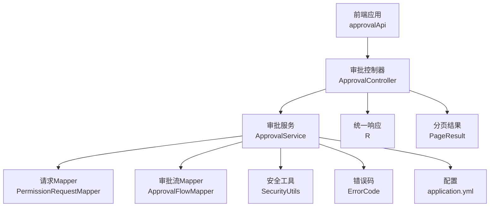
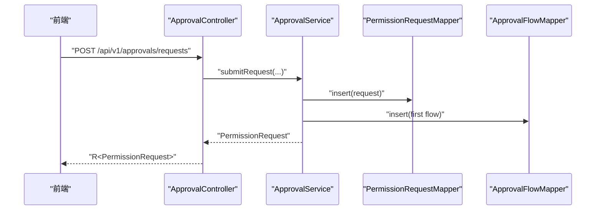
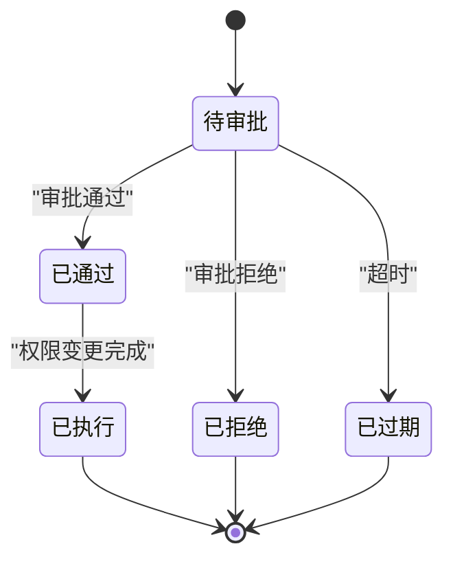
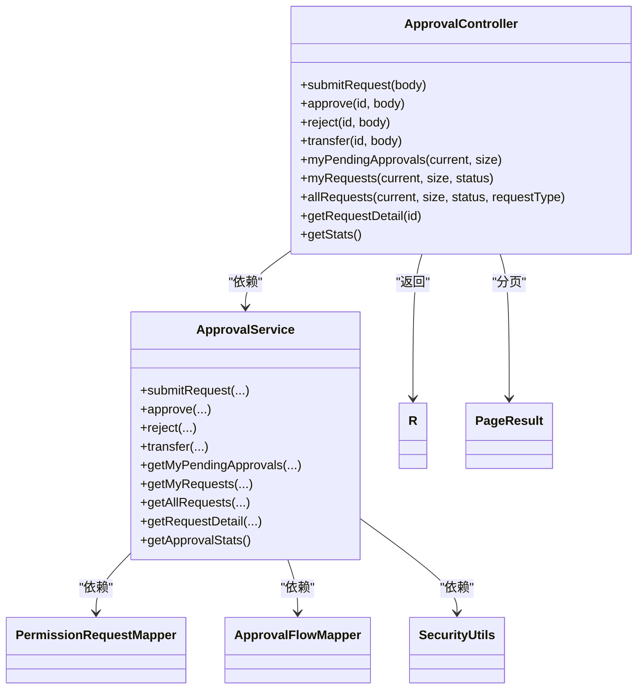

# 审批流程API

<cite>
**本文引用的文件**
- [ApprovalController.java](file://netdata-ai-backend/src/main/java/com/netdata/ops/controller/ApprovalController.java)
- [ApprovalService.java](file://netdata-ai-backend/src/main/java/com/netdata/ops/service/ApprovalService.java)
- [PermissionRequest.java](file://netdata-ai-backend/src/main/java/com/netdata/ops/entity/PermissionRequest.java)
- [ApprovalFlow.java](file://netdata-ai-backend/src/main/java/com/netdata/ops/entity/ApprovalFlow.java)
- [PermissionRequestMapper.java](file://netdata-ai-backend/src/main/java/com/netdata/ops/mapper/PermissionRequestMapper.java)
- [ApprovalFlowMapper.java](file://netdata-ai-backend/src/main/java/com/netdata/ops/mapper/ApprovalFlowMapper.java)
- [R.java](file://netdata-ai-backend/src/main/java/com/netdata/ops/dto/response/R.java)
- [PageResult.java](file://netdata-ai-backend/src/main/java/com/netdata/ops/dto/response/PageResult.java)
- [ErrorCode.java](file://netdata-ai-backend/src/main/java/com/netdata/ops/exception/ErrorCode.java)
- [RequirePermission.java](file://netdata-ai-backend/src/main/java/com/netdata/ops/annotation/RequirePermission.java)
- [SecurityUtils.java](file://netdata-ai-backend/src/main/java/com/netdata/ops/util/SecurityUtils.java)
- [application.yml](file://netdata-ai-backend/src/main/resources/application.yml)
- [index.ts](file://netdata-ai-frontend/src/api/index.ts)
</cite>

## 目录
1. [简介](#简介)
2. [项目结构](#项目结构)
3. [核心组件](#核心组件)
4. [架构总览](#架构总览)
5. [详细组件分析](#详细组件分析)
6. [依赖分析](#依赖分析)
7. [性能考虑](#性能考虑)
8. [故障排查指南](#故障排查指南)
9. [结论](#结论)
10. [附录](#附录)

## 简介
本文件为审批流程系统的API文档，覆盖权限申请、审批处理、审批历史查询、权限申请规则、审批统计、状态机与转换规则、统一响应与分页机制、以及安全与审计要求。文档同时提供请求/响应示例路径与业务逻辑说明，帮助前后端协同对接。

## 项目结构
审批流程API位于后端Spring Boot工程中，采用标准分层架构：
- 控制器层：提供REST接口，负责参数接收与权限注解校验
- 服务层：实现业务逻辑，包括风险评估、审批人路由、状态流转、权限变更执行
- 数据访问层：MyBatis-Plus Mapper封装数据库操作
- 实体层：持久化模型，包含审批请求与审批流
- DTO与工具：统一响应包装、分页结果、权限注解、安全工具
- 配置：OpenAPI/Swagger、WebSocket、Redis、JWT等

图表来源
- [ApprovalController.java:1-111](file://netdata-ai-backend/src/main/java/com/netdata/ops/controller/ApprovalController.java#L1-L111)
- [ApprovalService.java:1-501](file://netdata-ai-backend/src/main/java/com/netdata/ops/service/ApprovalService.java#L1-L501)
- [PermissionRequestMapper.java:1-10](file://netdata-ai-backend/src/main/java/com/netdata/ops/mapper/PermissionRequestMapper.java#L1-L10)
- [ApprovalFlowMapper.java:1-10](file://netdata-ai-backend/src/main/java/com/netdata/ops/mapper/ApprovalFlowMapper.java#L1-L10)
- [R.java:1-81](file://netdata-ai-backend/src/main/java/com/netdata/ops/dto/response/R.java#L1-L81)
- [PageResult.java:1-31](file://netdata-ai-backend/src/main/java/com/netdata/ops/dto/response/PageResult.java#L1-L31)
- [SecurityUtils.java:1-61](file://netdata-ai-backend/src/main/java/com/netdata/ops/util/SecurityUtils.java#L1-L61)
- [ErrorCode.java:1-55](file://netdata-ai-backend/src/main/java/com/netdata/ops/exception/ErrorCode.java#L1-L55)
- [application.yml:1-314](file://netdata-ai-backend/src/main/resources/application.yml#L1-L314)

章节来源
- [ApprovalController.java:1-111](file://netdata-ai-backend/src/main/java/com/netdata/ops/controller/ApprovalController.java#L1-L111)
- [ApprovalService.java:1-501](file://netdata-ai-backend/src/main/java/com/netdata/ops/service/ApprovalService.java#L1-L501)

## 核心组件
- 审批控制器：提供提交申请、审批通过/拒绝、转交、查询待审批、我的申请、全部记录、详情、统计等接口，并通过权限注解进行访问控制
- 审批服务：实现风险评估、审批人路由、状态机流转、权限变更执行、二级审批与升级、审批流记录、统计计算
- 实体模型：PermissionRequest（审批请求）、ApprovalFlow（审批流）
- 统一响应与分页：R<T>、PageResult<T>，保证前后端一致的响应格式
- 安全与权限：RequirePermission注解、SecurityUtils工具、ErrorCode错误码

章节来源
- [ApprovalController.java:26-110](file://netdata-ai-backend/src/main/java/com/netdata/ops/controller/ApprovalController.java#L26-L110)
- [ApprovalService.java:36-300](file://netdata-ai-backend/src/main/java/com/netdata/ops/service/ApprovalService.java#L36-L300)
- [PermissionRequest.java:8-69](file://netdata-ai-backend/src/main/java/com/netdata/ops/entity/PermissionRequest.java#L8-L69)
- [ApprovalFlow.java:8-36](file://netdata-ai-backend/src/main/java/com/netdata/ops/entity/ApprovalFlow.java#L8-L36)
- [R.java:9-81](file://netdata-ai-backend/src/main/java/com/netdata/ops/dto/response/R.java#L9-L81)
- [PageResult.java:8-31](file://netdata-ai-backend/src/main/java/com/netdata/ops/dto/response/PageResult.java#L8-L31)
- [RequirePermission.java:5-20](file://netdata-ai-backend/src/main/java/com/netdata/ops/annotation/RequirePermission.java#L5-L20)
- [SecurityUtils.java:7-61](file://netdata-ai-backend/src/main/java/com/netdata/ops/util/SecurityUtils.java#L7-L61)
- [ErrorCode.java:5-55](file://netdata-ai-backend/src/main/java/com/netdata/ops/exception/ErrorCode.java#L5-L55)

## 架构总览
审批API遵循“控制器-服务-数据访问”的分层设计，配合统一响应与权限注解，确保接口一致性与安全性。

图表来源
- [ApprovalController.java:26-40](file://netdata-ai-backend/src/main/java/com/netdata/ops/controller/ApprovalController.java#L26-L40)
- [ApprovalService.java:39-94](file://netdata-ai-backend/src/main/java/com/netdata/ops/service/ApprovalService.java#L39-L94)
- [PermissionRequestMapper.java:1-10](file://netdata-ai-backend/src/main/java/com/netdata/ops/mapper/PermissionRequestMapper.java#L1-L10)
- [ApprovalFlowMapper.java:1-10](file://netdata-ai-backend/src/main/java/com/netdata/ops/mapper/ApprovalFlowMapper.java#L1-L10)

## 详细组件分析

### 审批申请接口
- 接口：POST /api/v1/approvals/requests
- 权限：approval:submit
- 功能：提交权限申请，支持三种请求类型：角色分配、权限授予、临时提权
- 参数验证：
  - 自己不能给自己审批
  - 目标用户/角色存在性校验
  - 风险评估：临时提权超过24小时、角色为超级管理员/管理员判定为高风险
  - 审批人路由：低/中风险路由至ADMIN，高风险路由至SUPER_ADMIN
  - 初始化状态：PENDING；当前审批人设为审批人；创建第一条审批流记录
- 响应：统一响应R<PermissionRequest>

请求示例路径
- [ApprovalController.java:29](file://netdata-ai-backend/src/main/java/com/netdata/ops/controller/ApprovalController.java#L29)

响应示例路径
- [R.java:27-48](file://netdata-ai-backend/src/main/java/com/netdata/ops/dto/response/R.java#L27-L48)

章节来源
- [ApprovalController.java:26-40](file://netdata-ai-backend/src/main/java/com/netdata/ops/controller/ApprovalController.java#L26-L40)
- [ApprovalService.java:39-94](file://netdata-ai-backend/src/main/java/com/netdata/ops/service/ApprovalService.java#L39-L94)
- [PermissionRequest.java:22-51](file://netdata-ai-backend/src/main/java/com/netdata/ops/entity/PermissionRequest.java#L22-L51)

### 审批处理接口
- 审批通过：PUT /api/v1/approvals/requests/{id}/approve
  - 权限：approval:approve
  - 决策逻辑：高风险且需要二级审批时，升级到SUPER_ADMIN；否则直接通过
  - 状态更新：APPROVED；记录审批人、审批时间；临时提权设置过期时间
  - 权限变更：根据请求类型执行角色分配、权限授予、临时提权
- 审批拒绝：PUT /api/v1/approvals/requests/{id}/reject
  - 权限：approval:approve
  - 状态更新：REJECTED；记录拒绝原因
- 转交审批：PUT /api/v1/approvals/requests/{id}/transfer
  - 权限：approval:approve
  - 当前状态改为REVIEWING；更新当前审批人为转交用户；新增审批流步骤

请求示例路径
- [ApprovalController.java:42-65](file://netdata-ai-backend/src/main/java/com/netdata/ops/controller/ApprovalController.java#L42-L65)

章节来源
- [ApprovalController.java:42-65](file://netdata-ai-backend/src/main/java/com/netdata/ops/controller/ApprovalController.java#L42-L65)
- [ApprovalService.java:99-188](file://netdata-ai-backend/src/main/java/com/netdata/ops/service/ApprovalService.java#L99-L188)

### 审批历史查询接口
- 我的待审批列表：GET /api/v1/approvals/pending
  - 权限：approval:approve
  - 过滤：当前审批人且状态为PENDING/REVIEWING
  - 分页：默认第1页，每页10条
- 我的申请记录：GET /api/v1/approvals/my-requests
  - 权限：approval:submit
  - 可选过滤：status
  - 分页：默认第1页，每页10条
- 所有审批记录（管理员）：GET /api/v1/approvals/requests
  - 权限：approval:approve
  - 可选过滤：status、requestType
  - 分页：默认第1页，每页10条
- 审批详情（含审批流）：GET /api/v1/approvals/requests/{id}
  - 权限：approval:submit
  - 返回：请求详情+审批流+补充用户名/角色名

请求示例路径
- [ApprovalController.java:67-102](file://netdata-ai-backend/src/main/java/com/netdata/ops/controller/ApprovalController.java#L67-L102)

章节来源
- [ApprovalController.java:67-102](file://netdata-ai-backend/src/main/java/com/netdata/ops/controller/ApprovalController.java#L67-L102)
- [ApprovalService.java:193-277](file://netdata-ai-backend/src/main/java/com/netdata/ops/service/ApprovalService.java#L193-L277)
- [PageResult.java:21-29](file://netdata-ai-backend/src/main/java/com/netdata/ops/dto/response/PageResult.java#L21-L29)

### 权限申请接口（规则与范围）
- 请求类型：
  - 角色分配（ROLE_ASSIGN）：对目标用户授予目标角色
  - 权限授予（PERMISSION_GRANT）：对目标角色授予目标权限集合（JSON数组格式）
  - 临时提权（TEMP_ELEVATION）：对目标用户授予目标角色，带过期时间（小时）
- 范围限制：
  - 不能给自己提交申请
  - 目标用户/角色必须存在
  - 临时提权超过24小时为高风险
  - 角色为超级管理员/管理员时为高风险
- 审批规则：
  - 低/中风险：ADMIN审批
  - 高风险：SUPER_ADMIN审批
  - 高风险可能需要二级审批（由服务层判断）

章节来源
- [ApprovalService.java:307-371](file://netdata-ai-backend/src/main/java/com/netdata/ops/service/ApprovalService.java#L307-L371)
- [ApprovalService.java:419-466](file://netdata-ai-backend/src/main/java/com/netdata/ops/service/ApprovalService.java#L419-L466)
- [PermissionRequest.java:22-41](file://netdata-ai-backend/src/main/java/com/netdata/ops/entity/PermissionRequest.java#L22-L41)

### 审批统计接口
- 接口：GET /api/v1/approvals/stats
- 权限：approval:approve
- 统计内容：待审批数、已批准数、已拒绝数、总数

请求示例路径
- [ApprovalController.java:104-109](file://netdata-ai-backend/src/main/java/com/netdata/ops/controller/ApprovalController.java#L104-L109)

章节来源
- [ApprovalController.java:104-109](file://netdata-ai-backend/src/main/java/com/netdata/ops/controller/ApprovalController.java#L104-L109)
- [ApprovalService.java:282-300](file://netdata-ai-backend/src/main/java/com/netdata/ops/service/ApprovalService.java#L282-L300)

### 审批通知接口（邮件/短信/消息）
- WebSocket：后端配置了WebSocket路径，可用于实时通知
- 邮件/短信：代码中未发现具体实现，建议通过消息队列或第三方服务在审批状态变更时触发通知

章节来源
- [application.yml:250-255](file://netdata-ai-backend/src/main/resources/application.yml#L250-L255)

### 审批状态机与转换规则
- 状态：PENDING、REVIEWING、APPROVED、REJECTED、EXPIRED
- 转换规则：
  - PENDING → APPROVED/REJECTED/EXPIRED
  - APPROVED → EXECUTED（由外部执行阶段完成）
- 服务层还包含一个Agent审批状态机（不同上下文），其状态与转换规则与上述业务状态机不同，此处不作混同。

图表来源
- [ApprovalService.java:104-130](file://netdata-ai-backend/src/main/java/com/netdata/ops/service/ApprovalService.java#L104-L130)
- [ApprovalService.java:135-152](file://netdata-ai-backend/src/main/java/com/netdata/ops/service/ApprovalService.java#L135-L152)
- [ApprovalService.java:157-188](file://netdata-ai-backend/src/main/java/com/netdata/ops/service/ApprovalService.java#L157-L188)

## 依赖分析
- 控制器依赖服务；服务依赖Mapper、安全工具、错误码；控制器返回统一响应与分页结果
- 权限注解RequirePermission作用于控制器方法，结合SecurityUtils进行权限校验
- 配置文件提供OpenAPI/Swagger、WebSocket、Redis、JWT等基础设施

图表来源
- [ApprovalController.java:22-110](file://netdata-ai-backend/src/main/java/com/netdata/ops/controller/ApprovalController.java#L22-L110)
- [ApprovalService.java:29-35](file://netdata-ai-backend/src/main/java/com/netdata/ops/service/ApprovalService.java#L29-L35)
- [PermissionRequestMapper.java:1-10](file://netdata-ai-backend/src/main/java/com/netdata/ops/mapper/PermissionRequestMapper.java#L1-L10)
- [ApprovalFlowMapper.java:1-10](file://netdata-ai-backend/src/main/java/com/netdata/ops/mapper/ApprovalFlowMapper.java#L1-L10)
- [R.java:14-25](file://netdata-ai-backend/src/main/java/com/netdata/ops/dto/response/R.java#L14-L25)
- [PageResult.java:13-29](file://netdata-ai-backend/src/main/java/com/netdata/ops/dto/response/PageResult.java#L13-L29)

章节来源
- [ApprovalController.java:22-110](file://netdata-ai-backend/src/main/java/com/netdata/ops/controller/ApprovalController.java#L22-L110)
- [ApprovalService.java:29-35](file://netdata-ai-backend/src/main/java/com/netdata/ops/service/ApprovalService.java#L29-L35)

## 性能考虑
- 分页查询：默认每页10条，避免一次性返回大量数据
- 索引建议：对PermissionRequest的requester_id、current_approver_id、status、created_at建立索引
- 审批人查找：基于角色的用户查询应走缓存或索引优化
- 统一响应：R<T>与PageResult<T>减少前端解析成本

## 故障排查指南
- 参数校验失败：检查请求体字段是否缺失或类型不符
- 数据不存在：确认目标用户/角色是否存在
- 权限不足：确认当前用户是否具备approval:submit/approval:approve权限
- 请求已处理：当前请求状态非PENDING/REVIEWING时无法再次处理
- 审批请求不存在：请求ID无效或已被删除

章节来源
- [ErrorCode.java:38-45](file://netdata-ai-backend/src/main/java/com/netdata/ops/exception/ErrorCode.java#L38-L45)
- [ApprovalService.java:468-480](file://netdata-ai-backend/src/main/java/com/netdata/ops/service/ApprovalService.java#L468-L480)

## 结论
该审批流程API提供了完整的权限申请、审批处理、历史查询与统计能力，配合统一响应与权限注解，满足企业级安全与合规需求。建议在现有基础上完善通知机制与审计日志，以满足更严格的合规要求。

## 附录

### 请求/响应示例路径
- 提交申请
  - 请求：[ApprovalController.java:29](file://netdata-ai-backend/src/main/java/com/netdata/ops/controller/ApprovalController.java#L29)
  - 响应：[R.java:27-48](file://netdata-ai-backend/src/main/java/com/netdata/ops/dto/response/R.java#L27-L48)
- 审批通过
  - 请求：[ApprovalController.java:45](file://netdata-ai-backend/src/main/java/com/netdata/ops/controller/ApprovalController.java#L45)
  - 响应：[R.java:27-48](file://netdata-ai-backend/src/main/java/com/netdata/ops/dto/response/R.java#L27-L48)
- 我的待审批列表
  - 请求：[ApprovalController.java:70-74](file://netdata-ai-backend/src/main/java/com/netdata/ops/controller/ApprovalController.java#L70-L74)
  - 响应：[R.java:27-48](file://netdata-ai-backend/src/main/java/com/netdata/ops/dto/response/R.java#L27-L48)，分页：[PageResult.java:21-29](file://netdata-ai-backend/src/main/java/com/netdata/ops/dto/response/PageResult.java#L21-L29)
- 审批详情
  - 请求：[ApprovalController.java:100](file://netdata-ai-backend/src/main/java/com/netdata/ops/controller/ApprovalController.java#L100)
  - 响应：[R.java:27-48](file://netdata-ai-backend/src/main/java/com/netdata/ops/dto/response/R.java#L27-L48)

### 审批安全策略与审计日志
- 安全策略
  - 权限注解RequirePermission保护接口
  - SecurityUtils获取当前用户ID，防止越权处理
  - 审批人路由基于风险等级，高风险强制SUPER_ADMIN
- 审计日志
  - 服务层关键操作记录日志（如提交、通过、拒绝、转交、升级）
  - 建议扩展：将审批操作写入OperationLog或专用审计表，保留traceId便于追踪

章节来源
- [RequirePermission.java:5-20](file://netdata-ai-backend/src/main/java/com/netdata/ops/annotation/RequirePermission.java#L5-L20)
- [SecurityUtils.java:25-31](file://netdata-ai-backend/src/main/java/com/netdata/ops/util/SecurityUtils.java#L25-L31)
- [ApprovalService.java:91-93](file://netdata-ai-backend/src/main/java/com/netdata/ops/service/ApprovalService.java#L91-L93)
- [ApprovalService.java:128-129](file://netdata-ai-backend/src/main/java/com/netdata/ops/service/ApprovalService.java#L128-L129)
- [ApprovalService.java:150-151](file://netdata-ai-backend/src/main/java/com/netdata/ops/service/ApprovalService.java#L150-L151)
- [ApprovalService.java:186-187](file://netdata-ai-backend/src/main/java/com/netdata/ops/service/ApprovalService.java#L186-L187)
- [ApprovalService.java:412-413](file://netdata-ai-backend/src/main/java/com/netdata/ops/service/ApprovalService.java#L412-L413)