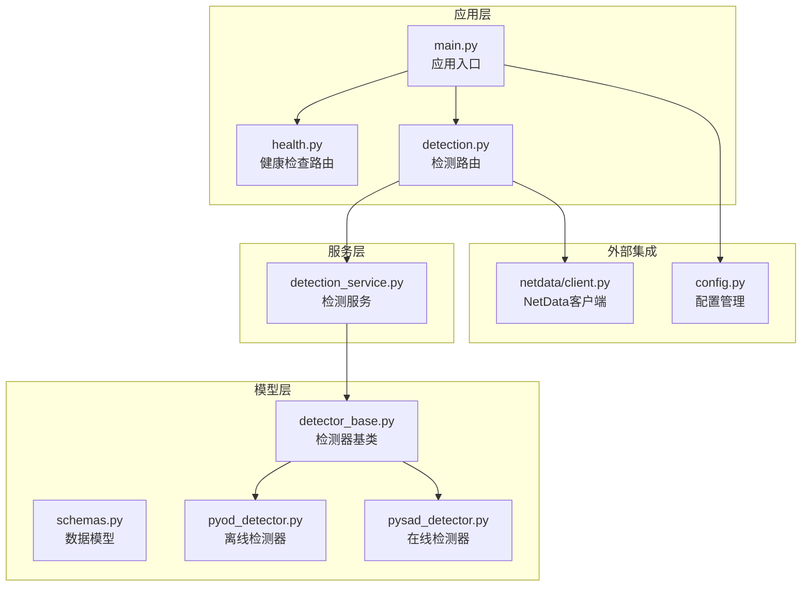
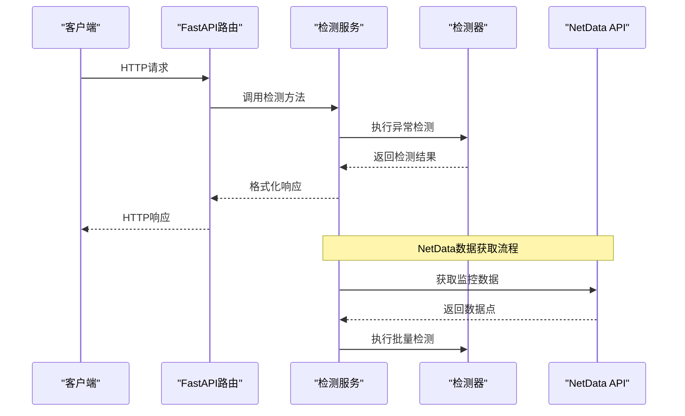
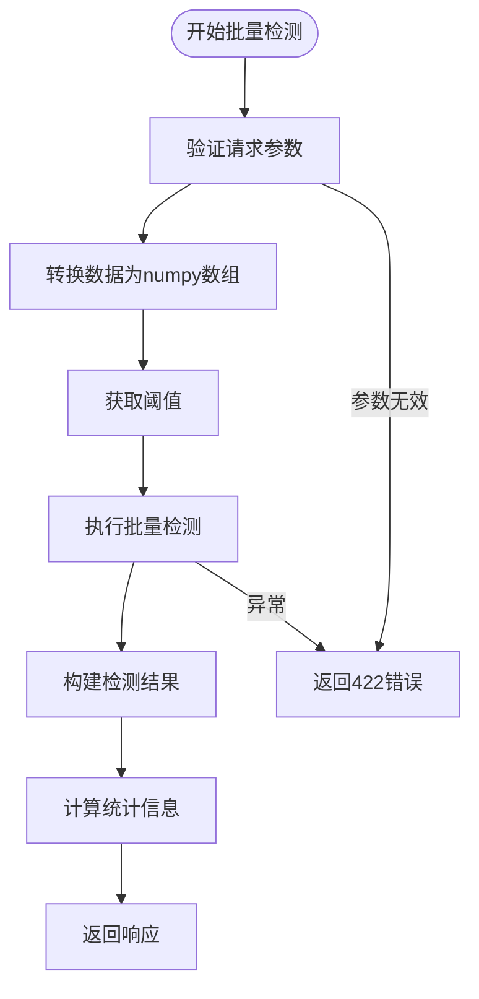
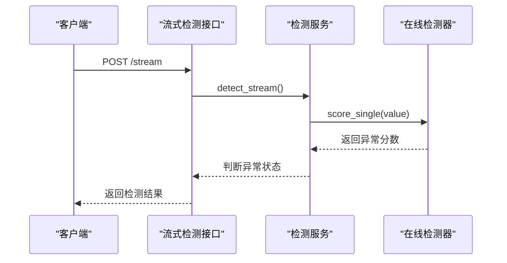
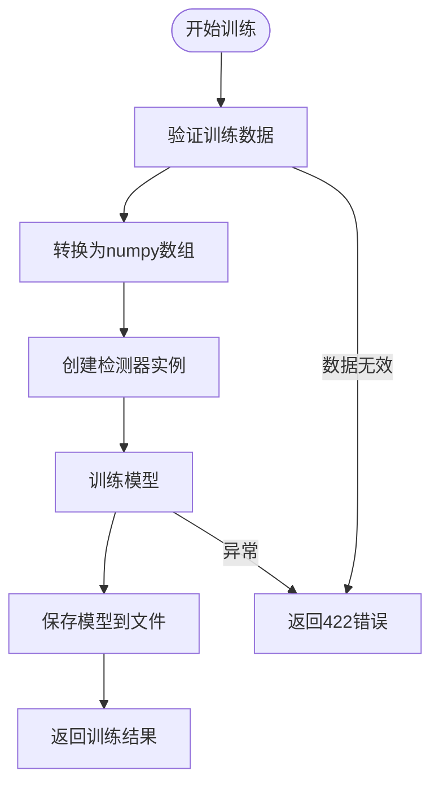
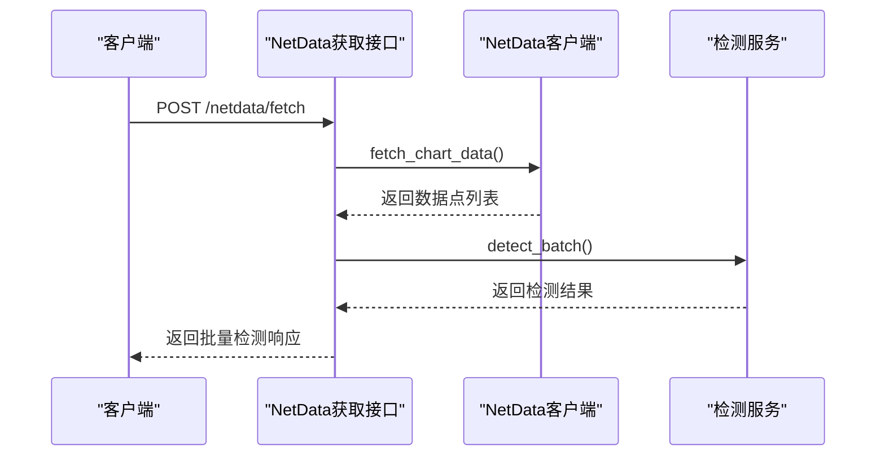
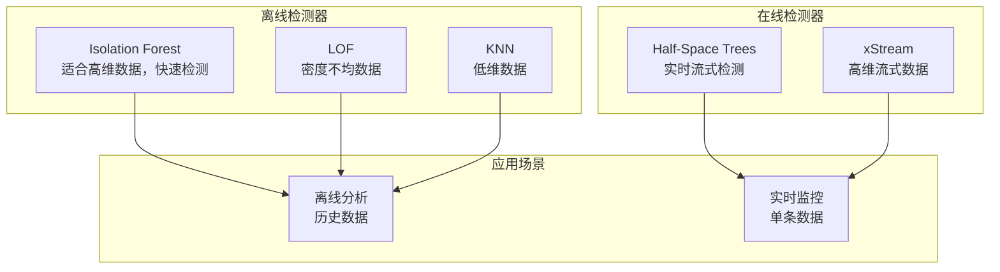
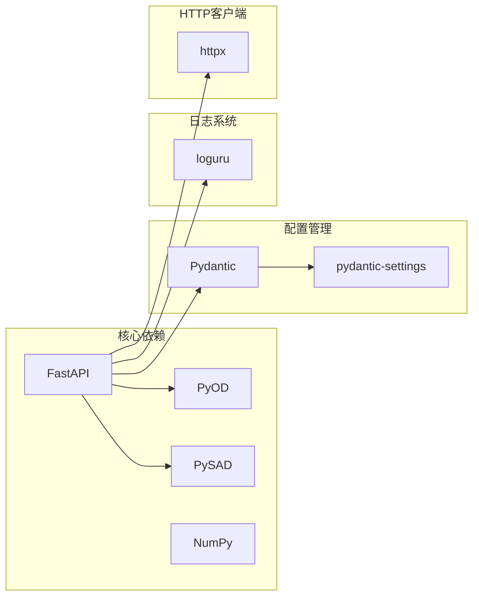
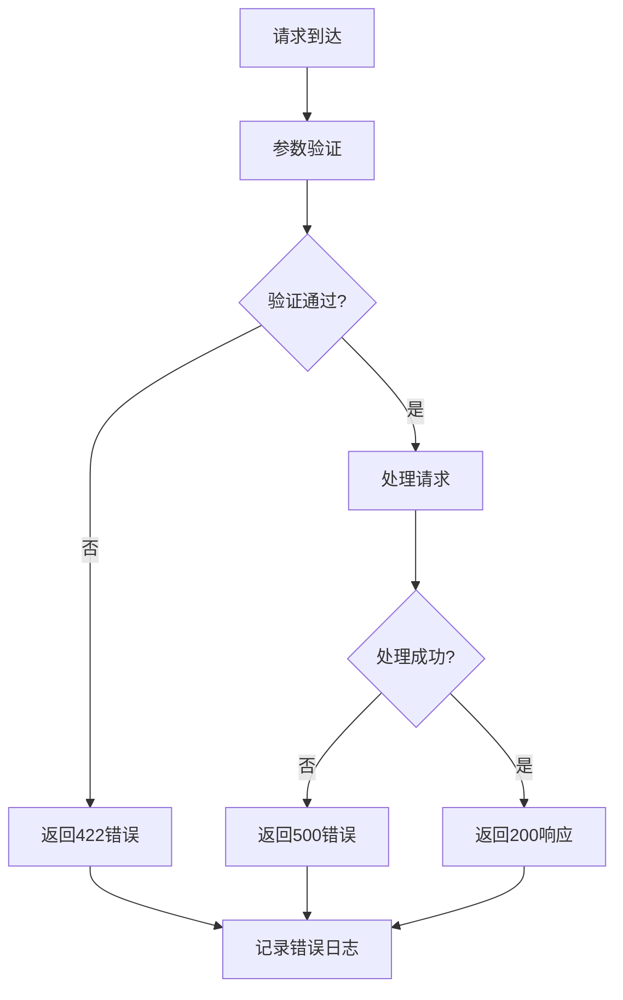

# 异常检测API

<cite>
**本文档引用的文件**
- [app/main.py](file://anomaly-detection-service/app/main.py)
- [app/api/routes/detection.py](file://anomaly-detection-service/app/api/routes/detection.py)
- [app/api/routes/health.py](file://anomaly-detection-service/app/api/routes/health.py)
- [app/services/detection_service.py](file://anomaly-detection-service/app/services/detection_service.py)
- [app/models/schemas.py](file://anomaly-detection-service/app/models/schemas.py)
- [app/netdata/client.py](file://anomaly-detection-service/app/netdata/client.py)
- [app/config.py](file://anomaly-detection-service/app/config.py)
- [app/core/detector_base.py](file://anomaly-detection-service/app/core/detector_base.py)
- [app/core/pyod_detector.py](file://anomaly-detection-service/app/core/pyod_detector.py)
- [app/core/pysad_detector.py](file://anomaly-detection-service/app/core/pysad_detector.py)
- [tests/test_api.py](file://anomaly-detection-service/tests/test_api.py)
- [README.md](file://anomaly-detection-service/README.md)
</cite>

## 目录
1. [简介](#简介)
2. [项目结构](#项目结构)
3. [核心组件](#核心组件)
4. [架构概览](#架构概览)
5. [详细组件分析](#详细组件分析)
6. [依赖分析](#依赖分析)
7. [性能考虑](#性能考虑)
8. [故障排除指南](#故障排除指南)
9. [结论](#结论)
10. [附录](#附录)

## 简介
本项目是一个基于FastAPI构建的智能运维异常检测服务，集成了NetData监控系统，提供批量异常检测、流式异常检测和检测器训练功能。系统基于PyOD和PySAD库，支持多种异常检测算法，包括离线检测器（Isolation Forest、LOF、KNN）和在线检测器（Half-Space Trees、xStream）。

## 项目结构
异常检测服务采用标准的FastAPI项目结构，主要分为以下几个层次：



**图表来源**
- [app/main.py:1-217](file://anomaly-detection-service/app/main.py#L1-L217)
- [app/api/routes/detection.py:1-378](file://anomaly-detection-service/app/api/routes/detection.py#L1-L378)
- [app/services/detection_service.py:1-334](file://anomaly-detection-service/app/services/detection_service.py#L1-L334)

**章节来源**
- [app/main.py:1-217](file://anomaly-detection-service/app/main.py#L1-L217)
- [README.md:1-42](file://anomaly-detection-service/README.md#L1-L42)

## 核心组件
系统的核心组件包括：

### 1. 应用入口与配置
- **FastAPI应用实例**：负责路由注册、中间件配置和异常处理
- **配置管理系统**：集中管理所有配置参数，支持环境变量覆盖

### 2. 检测服务层
- **DetectionService**：协调检测器的使用，管理检测器实例生命周期
- **检测器工厂**：支持动态创建不同类型的检测器

### 3. 数据模型层
- **Pydantic模型**：定义API请求/响应格式，提供数据验证
- **枚举类型**：定义检测器类型、异常等级等

### 4. 外部集成
- **NetData客户端**：直接从NetData API获取监控指标数据
- **检测器实现**：基于PyOD和PySAD库的具体算法实现

**章节来源**
- [app/config.py:1-183](file://anomaly-detection-service/app/config.py#L1-L183)
- [app/services/detection_service.py:37-334](file://anomaly-detection-service/app/services/detection_service.py#L37-L334)
- [app/models/schemas.py:28-329](file://anomaly-detection-service/app/models/schemas.py#L28-L329)

## 架构概览
系统采用分层架构设计，各层职责明确：



**图表来源**
- [app/api/routes/detection.py:55-378](file://anomaly-detection-service/app/api/routes/detection.py#L55-L378)
- [app/services/detection_service.py:76-192](file://anomaly-detection-service/app/services/detection_service.py#L76-L192)

## 详细组件分析

### 批量异常检测接口 (/batch)
批量检测接口适用于离线分析场景，支持对大量历史数据进行异常检测。

#### 接口定义
- **URL**: `/api/v1/detection/batch`
- **方法**: POST
- **认证**: 无
- **内容类型**: application/json

#### 请求参数
| 参数名 | 类型 | 必填 | 默认值 | 说明 |
|--------|------|------|--------|------|
| data | List[MetricDataPoint] | ✓ | - | 待检测的数据点列表 |
| detector_type | DetectorType | - | isolation_forest | 检测器类型 |
| threshold | float | - | settings.anomaly_threshold | 异常阈值 |
| return_scores | bool | - | true | 是否返回异常分数 |

#### 数据点模型 (MetricDataPoint)
| 字段名 | 类型 | 必填 | 说明 |
|--------|------|------|------|
| timestamp | datetime | - | 时间戳 |
| metric_name | string | ✓ | 指标名称 |
| value | float | ✓ | 指标值 |
| host | string | - | 主机名或IP |
| labels | dict | - | 附加标签 |

#### 响应格式
```json
{
  "status": "success",
  "detector_type": "isolation_forest",
  "threshold": 0.7,
  "total_count": 100,
  "anomaly_count": 5,
  "processing_time_ms": 150.5,
  "results": [
    {
      "index": 0,
      "is_anomaly": true,
      "anomaly_score": 0.85,
      "level": "warning",
      "metric_name": "cpu.usage",
      "value": 95.5,
      "timestamp": "2026-01-01T12:00:00Z"
    }
  ]
}
```

#### 检测流程


**图表来源**
- [app/api/routes/detection.py:62-153](file://anomaly-detection-service/app/api/routes/detection.py#L62-L153)

#### 参数验证规则
- 数据点数量必须≥3（异常检测需要足够样本）
- 异常分数阈值范围：0.0-1.0
- 检测器类型必须在支持列表中

**章节来源**
- [app/api/routes/detection.py:55-153](file://anomaly-detection-service/app/api/routes/detection.py#L55-L153)
- [app/models/schemas.py:95-130](file://anomaly-detection-service/app/models/schemas.py#L95-L130)

### 流式异常检测接口 (/stream)
流式检测接口适用于实时监控场景，支持对单条数据进行实时异常检测。

#### 接口定义
- **URL**: `/api/v1/detection/stream`
- **方法**: POST
- **认证**: 无
- **内容类型**: application/json

#### 请求参数
| 参数名 | 类型 | 必填 | 默认值 | 说明 |
|--------|------|------|--------|------|
| data_point | MetricDataPoint | ✓ | - | 待检测的数据点 |
| detector_type | DetectorType | - | half_space_trees | 在线检测器类型 |
| threshold | float | - | settings.anomaly_threshold | 异常阈值 |

#### 响应格式
```json
{
  "is_anomaly": true,
  "anomaly_score": 0.85,
  "level": "warning",
  "detector_type": "half_space_trees",
  "processing_time_ms": 2.3
}
```

#### 检测流程


**图表来源**
- [app/api/routes/detection.py:165-219](file://anomaly-detection-service/app/api/routes/detection.py#L165-L219)

#### 异常等级判断
- **正常**: score < threshold
- **警告**: threshold ≤ score < alert_threshold  
- **严重**: score ≥ alert_threshold

**章节来源**
- [app/api/routes/detection.py:158-219](file://anomaly-detection-service/app/api/routes/detection.py#L158-L219)

### 检测器训练接口 (/train)
训练接口用于使用历史数据训练离线检测器，并保存训练好的模型。

#### 接口定义
- **URL**: `/api/v1/detection/train`
- **方法**: POST
- **认证**: 无
- **内容类型**: application/json

#### 请求参数
| 参数名 | 类型 | 必填 | 默认值 | 说明 |
|--------|------|------|--------|------|
| training_data | List[MetricDataPoint] | ✓ | - | 训练数据 |
| detector_type | DetectorType | - | isolation_forest | 检测器类型 |
| contamination | float | - | 0.1 | 预期异常比例 |
| model_name | string | - | 自动生成 | 模型名称 |

#### 响应格式
```json
{
  "status": "success",
  "detector_type": "isolation_forest",
  "model_name": "isolation_forest_a1b2c3d4",
  "training_samples": 1000,
  "training_time_ms": 1200.5
}
```

#### 训练流程


**图表来源**
- [app/api/routes/detection.py:231-280](file://anomaly-detection-service/app/api/routes/detection.py#L231-L280)

#### 模型保存机制
- 模型文件保存在`models/`目录下
- 文件命名格式：`{model_name}.joblib`
- 支持模型加载和重用

**章节来源**
- [app/api/routes/detection.py:224-280](file://anomaly-detection-service/app/api/routes/detection.py#L224-L280)
- [app/services/detection_service.py:154-212](file://anomaly-detection-service/app/services/detection_service.py#L154-L212)

### NetData数据获取接口 (/netdata/fetch)
该接口直接从NetData API获取指标数据并进行异常检测。

#### 接口定义
- **URL**: `/api/v1/detection/netdata/fetch`
- **方法**: POST
- **认证**: 无
- **内容类型**: application/json

#### 请求参数
| 参数名 | 类型 | 必填 | 默认值 | 说明 |
|--------|------|------|--------|------|
| chart | string | ✓ | - | NetData图表名称 |
| after | int | - | -60 | 起始时间（秒） |
| before | int | - | 0 | 结束时间（秒） |
| points | int | - | 60 | 数据点数量 |
| host | string | - | - | 目标主机 |

#### 响应格式
与批量检测接口相同，但使用默认检测器类型。

#### 数据获取流程


**图表来源**
- [app/api/routes/detection.py:291-378](file://anomaly-detection-service/app/api/routes/detection.py#L291-L378)

**章节来源**
- [app/api/routes/detection.py:285-378](file://anomaly-detection-service/app/api/routes/detection.py#L285-L378)
- [app/netdata/client.py:138-198](file://anomaly-detection-service/app/netdata/client.py#L138-L198)

### 健康检查接口
系统提供多个健康检查端点用于监控服务状态。

#### 健康检查 (/health)
- **URL**: `/api/health`
- **方法**: GET
- **响应**: 包含服务状态、版本、运行时间和已加载的检测器列表

#### 就绪检查 (/ready)
- **URL**: `/api/ready`
- **方法**: GET
- **响应**: 检查服务是否准备好接收请求

#### 存活检查 (/live)
- **URL**: `/api/live`
- **方法**: GET
- **响应**: 检查服务是否存活

**章节来源**
- [app/api/routes/health.py:25-88](file://anomaly-detection-service/app/api/routes/health.py#L25-L88)

## 依赖分析

### 检测器类型与适用场景



**图表来源**
- [app/models/schemas.py:31-42](file://anomaly-detection-service/app/models/schemas.py#L31-L42)
- [app/main.py:89-96](file://anomaly-detection-service/app/main.py#L89-L96)

### 外部依赖关系



**图表来源**
- [app/main.py:21-27](file://anomaly-detection-service/app/main.py#L21-L27)
- [app/core/pyod_detector.py:24-26](file://anomaly-detection-service/app/core/pyod_detector.py#L24-L26)
- [app/core/pysad_detector.py:28-31](file://anomaly-detection-service/app/core/pysad_detector.py#L28-L31)

**章节来源**
- [app/core/detector_base.py:31-339](file://anomaly-detection-service/app/core/detector_base.py#L31-L339)

## 性能考虑

### 1. 检测器性能对比

| 检测器类型 | 训练时间 | 预测速度 | 内存占用 | 适用场景 |
|------------|----------|----------|----------|----------|
| Isolation Forest | 中等 | 快速 | 低 | 高维数据，批量分析 |
| LOF | 慢 | 中等 | 中等 | 密度不均数据 |
| KNN | 很慢 | 慢 | 高 | 低维数据，小样本 |
| Half-Space Trees | 无 | 极快 | 低 | 实时监控 |
| xStream | 无 | 快 | 中等 | 高维流式数据 |

### 2. 性能优化建议
- **批量处理**：对于离线分析，尽量使用批量接口而非多次流式请求
- **阈值调优**：根据业务需求调整异常阈值和告警阈值
- **模型复用**：训练完成后保存模型，避免重复训练
- **并发处理**：合理配置Uvicorn工作进程数

### 3. 内存管理
- 在线检测器使用滑动窗口，内存占用相对固定
- 离线检测器需要完整的训练数据集
- 模型保存使用joblib序列化，支持增量加载

## 故障排除指南

### 常见错误码
- **400 Bad Request**: 参数格式错误
- **404 Not Found**: 未找到数据或资源
- **422 Unprocessable Entity**: 数据验证失败
- **500 Internal Server Error**: 服务器内部错误

### 错误处理策略



**图表来源**
- [app/main.py:145-172](file://anomaly-detection-service/app/main.py#L145-L172)

### 调试技巧
1. **启用调试模式**：设置`debug=true`获取详细错误信息
2. **查看日志**：使用`logs/app.log`文件定位问题
3. **性能监控**：检查`X-Process-Time-Ms`响应头了解处理耗时
4. **健康检查**：定期调用`/api/health`确认服务状态

**章节来源**
- [app/main.py:145-172](file://anomaly-detection-service/app/main.py#L145-L172)
- [tests/test_api.py:32-172](file://anomaly-detection-service/tests/test_api.py#L32-L172)

## 结论
异常检测服务提供了完整的异常检测解决方案，具有以下特点：

1. **功能完整**：支持批量检测、流式检测和模型训练
2. **算法丰富**：集成多种先进的异常检测算法
3. **易于使用**：提供清晰的API接口和详细的文档
4. **可扩展性**：基于工厂模式，支持新增检测器类型
5. **生产就绪**：包含健康检查、错误处理和性能监控

该服务特别适合与NetData监控系统集成，能够实现实时的异常检测和告警功能。

## 附录

### API端点一览
| 端点 | 方法 | 功能 | 认证 |
|------|------|------|------|
| `/api/health` | GET | 健康检查 | 无 |
| `/api/ready` | GET | 就绪检查 | 无 |
| `/api/live` | GET | 存活检查 | 无 |
| `/api/v1/detection/batch` | POST | 批量异常检测 | 无 |
| `/api/v1/detection/stream` | POST | 流式异常检测 | 无 |
| `/api/v1/detection/train` | POST | 训练检测器 | 无 |
| `/api/v1/detection/netdata/fetch` | POST | NetData数据获取 | 无 |

### 配置参数说明
- **默认检测器**: `isolation_forest`
- **异常阈值**: 0.7（0-1之间）
- **告警阈值**: 0.85（0-1之间）
- **最大批量大小**: 10000
- **NetData超时**: 10秒

### 检测器参数配置
- **Isolation Forest**: `n_estimators=100`, `contamination=0.1`
- **LOF**: `n_neighbors=20`, `contamination=0.1`
- **KNN**: `n_neighbors=5`, `method='largest'`
- **在线检测器**: `window_size=100`