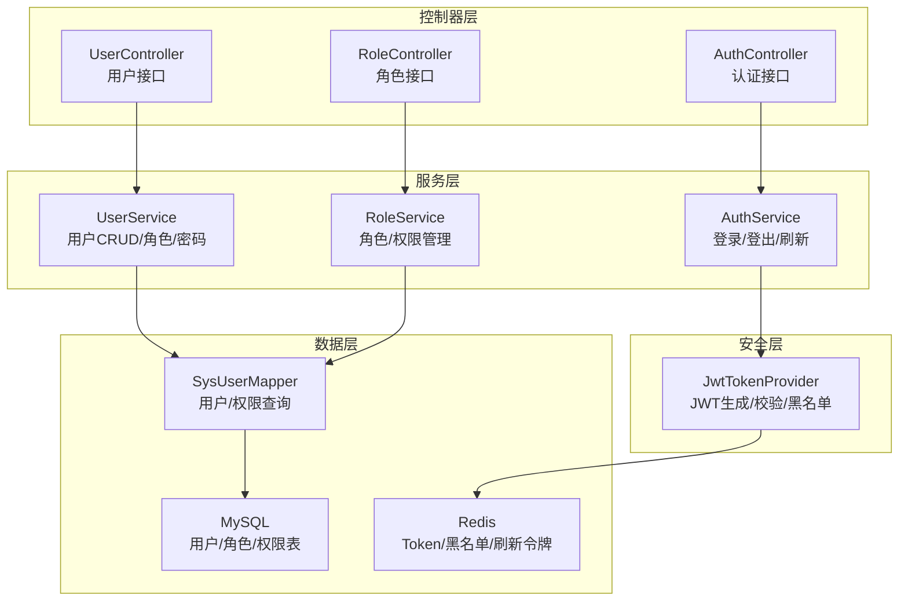
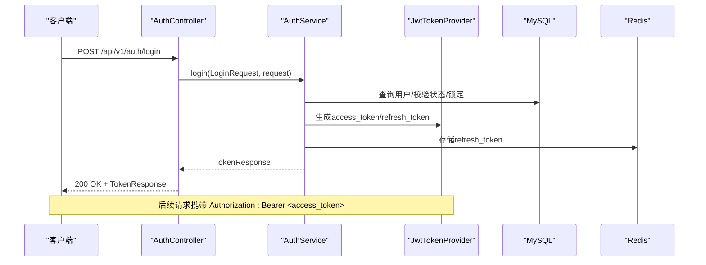
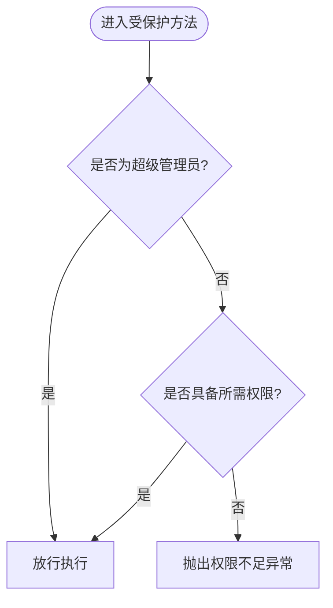
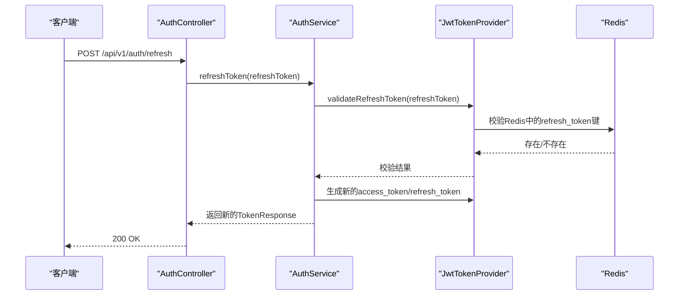
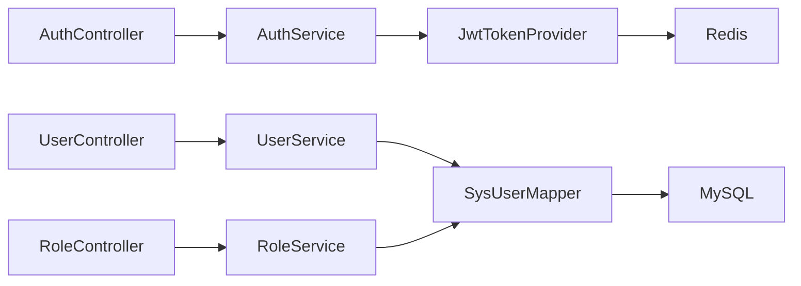

# 用户管理API

<cite>
**本文引用的文件**
- [UserController.java](file://netdata-ai-backend/src/main/java/com/netdata/ops/controller/UserController.java)
- [AuthController.java](file://netdata-ai-backend/src/main/java/com/netdata/ops/controller/AuthController.java)
- [RoleController.java](file://netdata-ai-backend/src/main/java/com/netdata/ops/controller/RoleController.java)
- [UserService.java](file://netdata-ai-backend/src/main/java/com/netdata/ops/service/UserService.java)
- [AuthService.java](file://netdata-ai-backend/src/main/java/com/netdata/ops/service/AuthService.java)
- [SysUser.java](file://netdata-ai-backend/src/main/java/com/netdata/ops/entity/SysUser.java)
- [LoginRequest.java](file://netdata-ai-backend/src/main/java/com/netdata/ops/dto/request/LoginRequest.java)
- [UserCreateRequest.java](file://netdata-ai-backend/src/main/java/com/netdata/ops/dto/request/UserCreateRequest.java)
- [UserUpdateRequest.java](file://netdata-ai-backend/src/main/java/com/netdata/ops/dto/request/UserUpdateRequest.java)
- [JwtTokenProvider.java](file://netdata-ai-backend/src/main/java/com/netdata/ops/security/JwtTokenProvider.java)
- [ErrorCode.java](file://netdata-ai-backend/src/main/java/com/netdata/ops/exception/ErrorCode.java)
- [RequirePermission.java](file://netdata-ai-backend/src/main/java/com/netdata/ops/annotation/RequirePermission.java)
- [PermissionAspect.java](file://netdata-ai-backend/src/main/java/com/netdata/ops/aspect/PermissionAspect.java)
- [application.yml](file://netdata-ai-backend/src/main/resources/application.yml)
- [SysUserMapper.java](file://netdata-ai-backend/src/main/java/com/netdata/ops/mapper/SysUserMapper.java)
</cite>

## 目录
1. [简介](#简介)
2. [项目结构](#项目结构)
3. [核心组件](#核心组件)
4. [架构总览](#架构总览)
5. [详细组件分析](#详细组件分析)
6. [依赖分析](#依赖分析)
7. [性能考虑](#性能考虑)
8. [故障排查指南](#故障排查指南)
9. [结论](#结论)
10. [附录](#附录)

## 简介
本文件为用户管理系统的完整API文档，覆盖认证与授权、用户信息管理、角色权限管理、状态管理与密码重置等能力。重点说明：
- 登录流程、JWT访问令牌与刷新令牌生成与校验
- 注册流程中的参数校验、密码加密与默认状态
- 用户信息CRUD与字段校验规则
- 角色与权限的创建、分配与访问控制
- 用户状态启用/禁用与权限变更
- 密码重置与个人密码修改流程
- 认证方式、权限注解与安全策略
- 请求与响应示例、错误码定义、会话与安全防护

## 项目结构
后端采用Spring Boot + MyBatis-Plus + JWT + Redis实现RBAC权限体系，核心模块如下：
- 控制器层：认证、用户、角色相关REST接口
- 服务层：业务逻辑封装，含事务、缓存与安全处理
- 安全层：JWT签发与校验、Redis黑名单与刷新令牌存储
- 数据层：Mapper接口与实体映射
- 配置层：应用配置、Swagger文档、限流与安全参数

图表来源
- [AuthController.java:22-78](file://netdata-ai-backend/src/main/java/com/netdata/ops/controller/AuthController.java#L22-L78)
- [UserController.java:23-95](file://netdata-ai-backend/src/main/java/com/netdata/ops/controller/UserController.java#L23-L95)
- [RoleController.java:19-73](file://netdata-ai-backend/src/main/java/com/netdata/ops/controller/RoleController.java#L19-L73)
- [AuthService.java:22-193](file://netdata-ai-backend/src/main/java/com/netdata/ops/service/AuthService.java#L22-L193)
- [UserService.java:27-253](file://netdata-ai-backend/src/main/java/com/netdata/ops/service/UserService.java#L27-L253)
- [JwtTokenProvider.java:17-204](file://netdata-ai-backend/src/main/java/com/netdata/ops/security/JwtTokenProvider.java#L17-L204)
- [SysUserMapper.java:11-34](file://netdata-ai-backend/src/main/java/com/netdata/ops/mapper/SysUserMapper.java#L11-L34)

章节来源
- [AuthController.java:22-78](file://netdata-ai-backend/src/main/java/com/netdata/ops/controller/AuthController.java#L22-L78)
- [UserController.java:23-95](file://netdata-ai-backend/src/main/java/com/netdata/ops/controller/UserController.java#L23-L95)
- [RoleController.java:19-73](file://netdata-ai-backend/src/main/java/com/netdata/ops/controller/RoleController.java#L19-L73)
- [application.yml:191-202](file://netdata-ai-backend/src/main/resources/application.yml#L191-L202)

## 核心组件
- 认证控制器：提供登录、登出、刷新Token、获取当前用户信息
- 用户控制器：提供分页查询、详情、创建、更新、删除、角色分配、密码重置、个人密码修改
- 角色控制器：提供角色列表、详情、创建、更新、角色权限查询、权限分配、权限列表
- 服务组件：AuthService、UserService、RoleService封装业务逻辑
- 安全组件：JwtTokenProvider负责JWT生命周期管理
- 权限注解与切面：RequirePermission + PermissionAspect实现基于注解的权限拦截
- 错误码：统一错误码定义，便于前端与客户端处理

章节来源
- [AuthController.java:22-78](file://netdata-ai-backend/src/main/java/com/netdata/ops/controller/AuthController.java#L22-L78)
- [UserController.java:23-95](file://netdata-ai-backend/src/main/java/com/netdata/ops/controller/UserController.java#L23-L95)
- [RoleController.java:19-73](file://netdata-ai-backend/src/main/java/com/netdata/ops/controller/RoleController.java#L19-L73)
- [RequirePermission.java:5-20](file://netdata-ai-backend/src/main/java/com/netdata/ops/annotation/RequirePermission.java#L5-L20)
- [PermissionAspect.java:13-40](file://netdata-ai-backend/src/main/java/com/netdata/ops/aspect/PermissionAspect.java#L13-L40)
- [ErrorCode.java:8-55](file://netdata-ai-backend/src/main/java/com/netdata/ops/exception/ErrorCode.java#L8-L55)

## 架构总览
系统采用前后端分离，后端通过JWT进行无状态认证；使用Redis存储刷新令牌与Token黑名单，实现登出与撤销能力；权限通过注解+切面在方法级别控制。

图表来源
- [AuthController.java:30-36](file://netdata-ai-backend/src/main/java/com/netdata/ops/controller/AuthController.java#L30-L36)
- [AuthService.java:51-106](file://netdata-ai-backend/src/main/java/com/netdata/ops/service/AuthService.java#L51-L106)
- [JwtTokenProvider.java:47-84](file://netdata-ai-backend/src/main/java/com/netdata/ops/security/JwtTokenProvider.java#L47-L84)

## 详细组件分析

### 认证接口
- 登录
  - 方法：POST /api/v1/auth/login
  - 请求体：LoginRequest（用户名、密码）
  - 成功响应：TokenResponse（access_token、refresh_token、过期秒数、用户信息）
  - 安全要点：密码匹配、账户状态与锁定检查、登录成功更新最近登录IP与时间
- 登出
  - 方法：POST /api/v1/auth/logout
  - 请求头：Authorization: Bearer <access_token>
  - 行为：将access_token加入黑名单，并撤销该用户的全部refresh_token
- 刷新Token
  - 方法：POST /api/v1/auth/refresh
  - 请求体：{ "refreshToken": "<refresh_token>" }
  - 行为：校验refresh_token有效性，重新签发新的access_token与refresh_token
- 获取当前用户
  - 方法：GET /api/v1/auth/me
  - 行为：返回当前登录用户的角色与权限列表

请求与响应示例（路径参考）
- 登录请求示例：[LoginRequest.java:10-21](file://netdata-ai-backend/src/main/java/com/netdata/ops/dto/request/LoginRequest.java#L10-L21)
- 登录响应示例：[AuthService.java:91-105](file://netdata-ai-backend/src/main/java/com/netdata/ops/service/AuthService.java#L91-L105)
- 刷新请求示例：[AuthController.java:50-56](file://netdata-ai-backend/src/main/java/com/netdata/ops/controller/AuthController.java#L50-L56)
- 当前用户响应示例：[AuthService.java:158-176](file://netdata-ai-backend/src/main/java/com/netdata/ops/service/AuthService.java#L158-L176)

章节来源
- [AuthController.java:30-68](file://netdata-ai-backend/src/main/java/com/netdata/ops/controller/AuthController.java#L30-L68)
- [AuthService.java:51-153](file://netdata-ai-backend/src/main/java/com/netdata/ops/service/AuthService.java#L51-L153)
- [JwtTokenProvider.java:169-194](file://netdata-ai-backend/src/main/java/com/netdata/ops/security/JwtTokenProvider.java#L169-L194)

### 用户信息管理接口
- 分页查询用户列表
  - 方法：GET /api/v1/users
  - 参数：current、size、keyword（可选）
  - 权限：user:read
- 获取用户详情
  - 方法：GET /api/v1/users/{id}
  - 权限：user:read
- 创建用户
  - 方法：POST /api/v1/users
  - 请求体：UserCreateRequest（用户名、密码、昵称、邮箱、手机、roleIds）
  - 权限：user:write
  - 行为：校验唯一性、密码加密、默认启用状态、可选分配角色
- 更新用户信息
  - 方法：PUT /api/v1/users/{id}
  - 请求体：UserUpdateRequest（昵称、邮箱、手机、头像、状态）
  - 权限：user:write
- 删除用户
  - 方法：DELETE /api/v1/users/{id}
  - 权限：user:delete
  - 行为：逻辑删除，禁止删除当前登录用户
- 为用户分配角色
  - 方法：POST /api/v1/users/{id}/roles
  - 请求体：{ "roleIds": [1,2] }
  - 权限：user:role_assign
- 重置用户密码
  - 方法：PUT /api/v1/users/{id}/password
  - 请求体：{ "newPassword": "..." }
  - 权限：user:write
- 修改自己的密码
  - 方法：PUT /api/v1/users/me/password
  - 请求体：{ "oldPassword": "...", "newPassword": "..." }

请求与响应示例（路径参考）
- 创建请求示例：[UserCreateRequest.java:14-40](file://netdata-ai-backend/src/main/java/com/netdata/ops/dto/request/UserCreateRequest.java#L14-L40)
- 更新请求示例：[UserUpdateRequest.java:11-30](file://netdata-ai-backend/src/main/java/com/netdata/ops/dto/request/UserUpdateRequest.java#L11-L30)
- 用户详情响应示例：[UserService.java:68-74](file://netdata-ai-backend/src/main/java/com/netdata/ops/service/UserService.java#L68-L74)

章节来源
- [UserController.java:31-93](file://netdata-ai-backend/src/main/java/com/netdata/ops/controller/UserController.java#L31-L93)
- [UserService.java:79-224](file://netdata-ai-backend/src/main/java/com/netdata/ops/service/UserService.java#L79-L224)
- [SysUser.java:8-57](file://netdata-ai-backend/src/main/java/com/netdata/ops/entity/SysUser.java#L8-L57)

### 角色权限管理接口
- 获取所有角色列表
  - 方法：GET /api/v1/roles
- 获取角色详情
  - 方法：GET /api/v1/roles/{id}
- 创建角色
  - 方法：POST /api/v1/roles
  - 权限：system:config
- 更新角色
  - 方法：PUT /api/v1/roles/{id}
  - 权限：system:config
- 获取角色的权限列表
  - 方法：GET /api/v1/roles/{id}/permissions
- 给角色分配权限
  - 方法：PUT /api/v1/roles/{id}/permissions
  - 请求体：{ "permissionIds": [1,2] }
  - 权限：system:config
- 获取所有权限列表
  - 方法：GET /api/v1/roles/permissions/all

章节来源
- [RoleController.java:27-71](file://netdata-ai-backend/src/main/java/com/netdata/ops/controller/RoleController.java#L27-L71)

### 权限注解与访问控制
- 注解：@RequirePermission("module:action")
- 切面：PermissionAspect在方法执行前检查当前用户是否具备所需权限
- 特殊角色：SUPER_ADMIN拥有所有权限
- 权限来源：SysUserMapper根据用户ID查询角色与权限列表

图表来源
- [PermissionAspect.java:22-38](file://netdata-ai-backend/src/main/java/com/netdata/ops/aspect/PermissionAspect.java#L22-L38)
- [RequirePermission.java:12-18](file://netdata-ai-backend/src/main/java/com/netdata/ops/annotation/RequirePermission.java#L12-L18)
- [SysUserMapper.java:20-32](file://netdata-ai-backend/src/main/java/com/netdata/ops/mapper/SysUserMapper.java#L20-L32)

章节来源
- [PermissionAspect.java:13-40](file://netdata-ai-backend/src/main/java/com/netdata/ops/aspect/PermissionAspect.java#L13-L40)
- [RequirePermission.java:5-20](file://netdata-ai-backend/src/main/java/com/netdata/ops/annotation/RequirePermission.java#L5-L20)
- [SysUserMapper.java:20-32](file://netdata-ai-backend/src/main/java/com/netdata/ops/mapper/SysUserMapper.java#L20-L32)

### JWT令牌生成与刷新机制
- Access Token：短期有效，用于日常请求鉴权
- Refresh Token：长期有效，用于刷新access_token
- 黑名单：登出时将access_token加入黑名单，防止继续使用
- 刷新流程：校验refresh_token有效性，重新签发新的access_token与refresh_token

图表来源
- [AuthController.java:48-57](file://netdata-ai-backend/src/main/java/com/netdata/ops/controller/AuthController.java#L48-L57)
- [AuthService.java:119-153](file://netdata-ai-backend/src/main/java/com/netdata/ops/service/AuthService.java#L119-L153)
- [JwtTokenProvider.java:169-194](file://netdata-ai-backend/src/main/java/com/netdata/ops/security/JwtTokenProvider.java#L169-L194)

章节来源
- [JwtTokenProvider.java:47-84](file://netdata-ai-backend/src/main/java/com/netdata/ops/security/JwtTokenProvider.java#L47-L84)
- [AuthService.java:119-153](file://netdata-ai-backend/src/main/java/com/netdata/ops/service/AuthService.java#L119-L153)

### 用户状态管理与权限变更
- 状态字段：SysUser.status（0禁用/1启用）
- 禁用影响：登录时拒绝禁用账户
- 权限缓存：分配角色或删除用户后清除权限缓存键
- 逻辑删除：删除用户时标记deleted=1，不影响数据完整性

章节来源
- [SysUser.java:35-46](file://netdata-ai-backend/src/main/java/com/netdata/ops/entity/SysUser.java#L35-L46)
- [UserService.java:142-161](file://netdata-ai-backend/src/main/java/com/netdata/ops/service/UserService.java#L142-L161)

### 密码重置与安全策略
- 管理员重置：PUT /api/v1/users/{id}/password
- 个人修改：PUT /api/v1/users/me/password（需提供旧密码）
- 加密策略：使用PasswordEncoder对密码进行加密存储
- 登录失败：连续失败超过阈值将锁定账户一段时间

章节来源
- [UserService.java:190-224](file://netdata-ai-backend/src/main/java/com/netdata/ops/service/UserService.java#L190-L224)
- [AuthService.java:179-191](file://netdata-ai-backend/src/main/java/com/netdata/ops/service/AuthService.java#L179-L191)

## 依赖分析
- 控制器依赖服务层，服务层依赖Mapper与安全组件
- 权限注解通过切面在运行时拦截并校验
- JWT组件依赖Redis存储刷新令牌与黑名单
- 配置文件集中管理JWT密钥、过期时间与限流策略

图表来源
- [AuthController.java:23-26](file://netdata-ai-backend/src/main/java/com/netdata/ops/controller/AuthController.java#L23-L26)
- [UserController.java:23-29](file://netdata-ai-backend/src/main/java/com/netdata/ops/controller/UserController.java#L23-L29)
- [RoleController.java:19-25](file://netdata-ai-backend/src/main/java/com/netdata/ops/controller/RoleController.java#L19-L25)
- [JwtTokenProvider.java:21-42](file://netdata-ai-backend/src/main/java/com/netdata/ops/security/JwtTokenProvider.java#L21-L42)
- [SysUserMapper.java:11-34](file://netdata-ai-backend/src/main/java/com/netdata/ops/mapper/SysUserMapper.java#L11-L34)

章节来源
- [application.yml:191-202](file://netdata-ai-backend/src/main/resources/application.yml#L191-L202)

## 性能考虑
- Redis缓存：刷新令牌与黑名单存储于Redis，降低数据库压力
- 权限缓存：用户权限变更后清理缓存键，避免脏读
- 分页查询：用户列表支持分页与关键词过滤，减少一次性传输数据量
- 密码加密：使用高性能PasswordEncoder，建议结合硬件加速

## 故障排查指南
常见错误码（节选）
- 认证错误：UNAUTHORIZED、TOKEN_EXPIRED、TOKEN_INVALID、LOGIN_FAILED、ACCOUNT_LOCKED、ACCOUNT_DISABLED
- 授权错误：FORBIDDEN、PERMISSION_DENIED
- 用户模块：USER_NOT_FOUND、USERNAME_EXISTS、EMAIL_EXISTS、PASSWORD_INVALID、OLD_PASSWORD_WRONG

章节来源
- [ErrorCode.java:18-45](file://netdata-ai-backend/src/main/java/com/netdata/ops/exception/ErrorCode.java#L18-L45)

## 结论
本系统通过清晰的REST接口、完善的JWT认证与权限控制、以及Redis辅助的令牌管理，提供了安全可靠的用户管理能力。建议在生产环境中：
- 使用强密钥与HTTPS
- 合理设置Token过期时间与刷新周期
- 对高频接口开启限流
- 定期审计日志与权限变更

## 附录

### API定义与示例

- 认证
  - POST /api/v1/auth/login
    - 请求体：[LoginRequest.java:10-21](file://netdata-ai-backend/src/main/java/com/netdata/ops/dto/request/LoginRequest.java#L10-L21)
    - 响应体：[AuthService.java:91-105](file://netdata-ai-backend/src/main/java/com/netdata/ops/service/AuthService.java#L91-L105)
  - POST /api/v1/auth/logout
    - 请求头：Authorization: Bearer <access_token>
    - 响应：空对象
  - POST /api/v1/auth/refresh
    - 请求体：{ "refreshToken": "<token>" }
    - 响应体：同登录响应
  - GET /api/v1/auth/me
    - 响应体：TokenResponse.UserVO

- 用户管理
  - GET /api/v1/users?page=1&size=10&keyword=张三
    - 响应体：PageResult<UserVO>
  - GET /api/v1/users/{id}
    - 响应体：UserVO
  - POST /api/v1/users
    - 请求体：UserCreateRequest
    - 响应体：UserVO
  - PUT /api/v1/users/{id}
    - 请求体：UserUpdateRequest
    - 响应体：UserVO
  - DELETE /api/v1/users/{id}
    - 响应体：空对象
  - POST /api/v1/users/{id}/roles
    - 请求体：{ "roleIds": [1,2] }
  - PUT /api/v1/users/{id}/password
    - 请求体：{ "newPassword": "..." }
  - PUT /api/v1/users/me/password
    - 请求体：{ "oldPassword": "...", "newPassword": "..." }

- 角色管理
  - GET /api/v1/roles
  - GET /api/v1/roles/{id}
  - POST /api/v1/roles
  - PUT /api/v1/roles/{id}
  - GET /api/v1/roles/{id}/permissions
  - PUT /api/v1/roles/{id}/permissions
  - GET /api/v1/roles/permissions/all

章节来源
- [AuthController.java:30-68](file://netdata-ai-backend/src/main/java/com/netdata/ops/controller/AuthController.java#L30-L68)
- [UserController.java:31-93](file://netdata-ai-backend/src/main/java/com/netdata/ops/controller/UserController.java#L31-L93)
- [RoleController.java:27-71](file://netdata-ai-backend/src/main/java/com/netdata/ops/controller/RoleController.java#L27-L71)

### 安全策略与配置
- JWT配置项
  - security.jwt.secret：签名密钥
  - security.jwt.access-token-expiration：访问令牌过期毫秒数
  - security.jwt.refresh-token-expiration：刷新令牌过期毫秒数
- 限流配置
  - security.rate-limit.default-limit：默认每分钟请求数
  - security.rate-limit.chat-limit：AI问答每分钟请求数
  - security.rate-limit.login-limit：登录每分钟请求数

章节来源
- [application.yml:193-202](file://netdata-ai-backend/src/main/resources/application.yml#L193-L202)