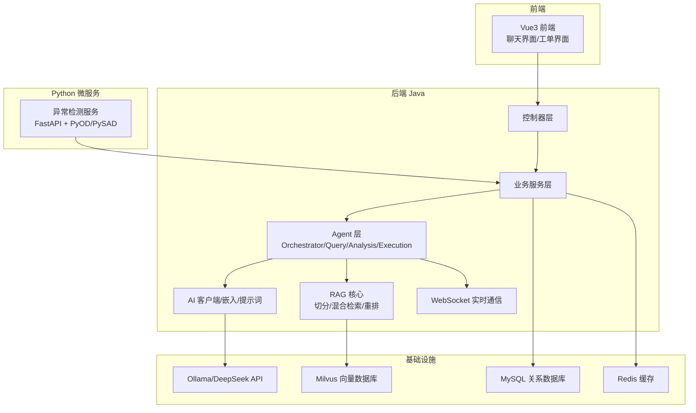
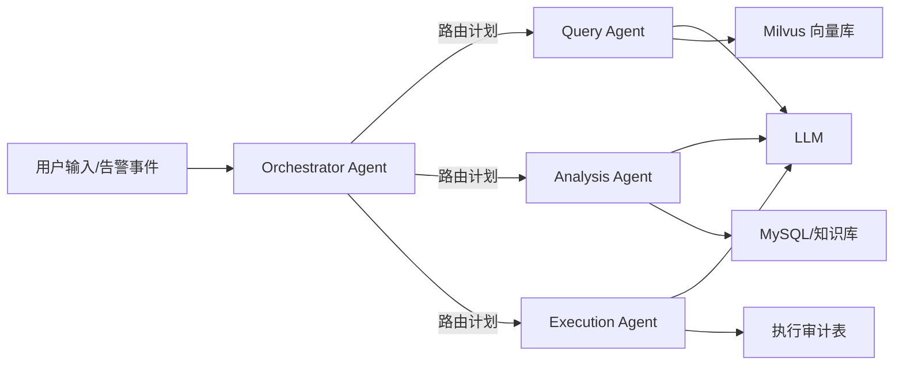
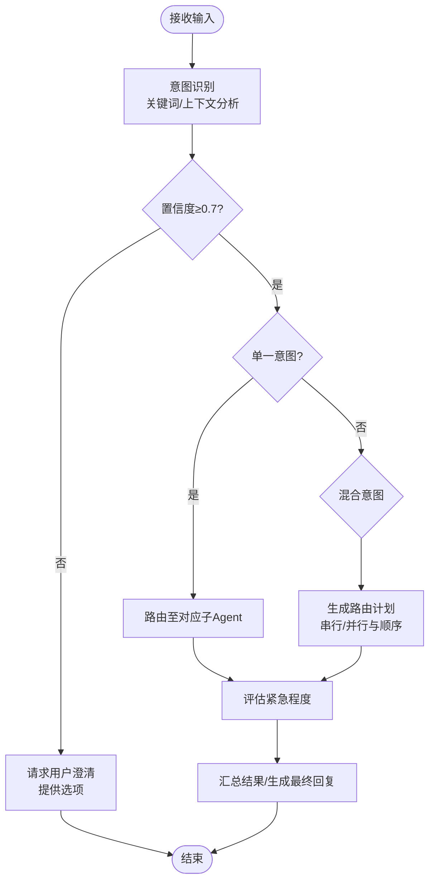
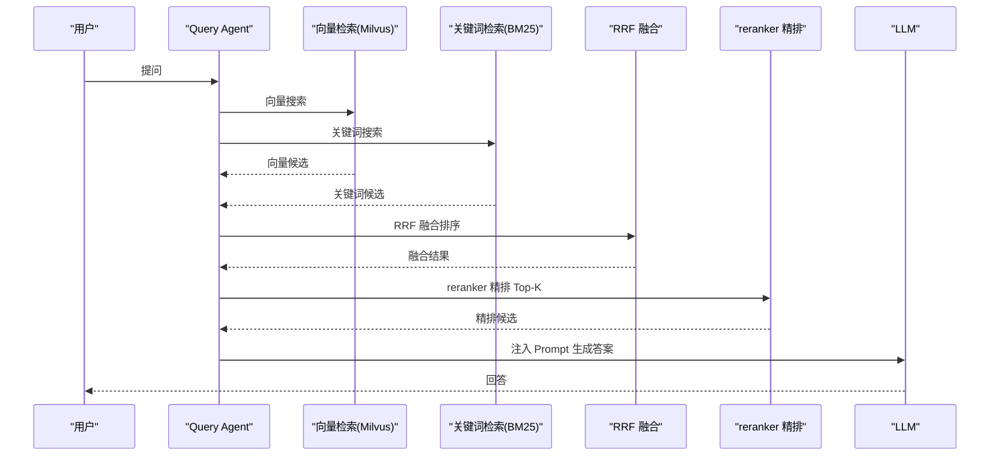
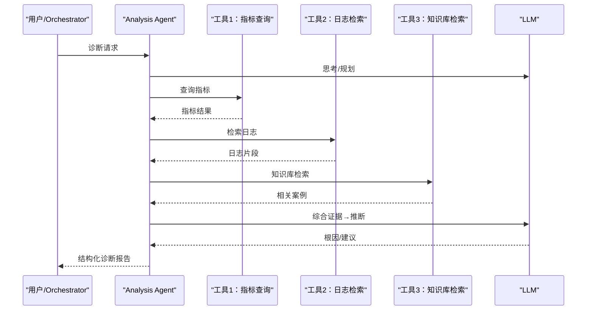
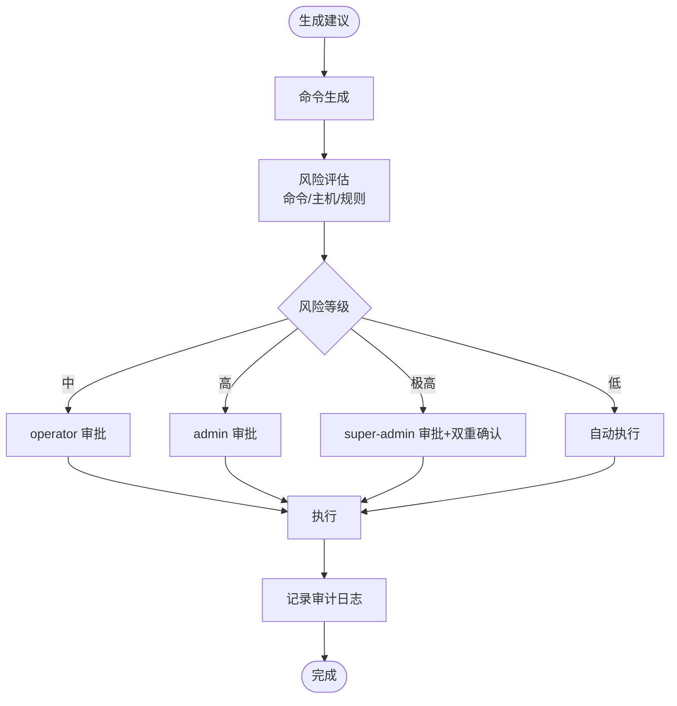
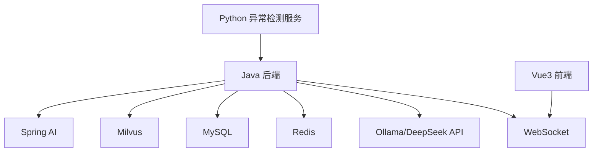

# Agent 架构系统

<cite>
**本文引用的文件**
- [PROJECT_CONTEXT.md](file://PROJECT_CONTEXT.md)
- [开题报告_精简版.md](file://开题报告_精简版.md)
- [orchestrator-system-prompt.md](file://docs/prompts/orchestrator-system-prompt.md)
- [shared-safety-constraints.md](file://docs/prompts/shared-safety-constraints.md)
- [milvus_collection.yaml](file://config/milvus_collection.yaml)
- [docker-compose.yml](file://docker-compose.yml)
- [init_milvus.py](file://scripts/init_milvus.py)
- [init.sql](file://sql/init.sql)
- [文献知识库_完整版.md](file://文献/文献知识库_完整版.md)
- [文献综述汇编.md](file://文献/文献综述汇编.md)
</cite>

## 目录
1. [简介](#简介)
2. [项目结构](#项目结构)
3. [核心组件](#核心组件)
4. [架构总览](#架构总览)
5. [详细组件分析](#详细组件分析)
6. [依赖分析](#依赖分析)
7. [性能考虑](#性能考虑)
8. [故障排查指南](#故障排查指南)
9. [结论](#结论)
10. [附录](#附录)

## 简介
本项目围绕 NetData 监控数据，构建“Orchestrator-Subagent”多 Agent 协同系统，实现“意图识别 + 任务路由 + 多 Agent 协作”的闭环。系统包含四个核心 Agent：
- Orchestrator Agent：负责意图识别、路由与结果汇总
- Query Agent：基于混合检索 RAG 的问答 Agent
- Analysis Agent：基于 ReAct 的诊断 Agent
- Execution Agent：命令生成、风险评估与 Human-in-the-Loop 审批执行 Agent

系统采用 Spring Boot + Spring AI 作为后端主框架，Milvus 作为向量数据库，配合 MySQL、Redis、Ollama/DeepSeek API 等基础设施，形成“感知-分析-决策-执行”的智能运维闭环。

## 项目结构
项目采用分层与模块化组织，后端 Java 侧包含 Agent 实现、AI 客户端、RAG 核心、控制器、业务服务、WebSocket 实时通信与配置；同时提供 Python 异常检测服务、Vue3 前端与 Docker 编排。

图表来源
- [PROJECT_CONTEXT.md:120-149](file://PROJECT_CONTEXT.md#L120-L149)
- [开题报告_精简版.md:118-152](file://开题报告_精简版.md#L118-L152)

章节来源
- [PROJECT_CONTEXT.md:120-149](file://PROJECT_CONTEXT.md#L120-L149)
- [开题报告_精简版.md:118-152](file://开题报告_精简版.md#L118-L152)

## 核心组件
- Orchestrator Agent：基于系统提示词进行意图识别、路由决策与结果汇总，输出 JSON 结构的路由计划与紧急程度评估。
- Query Agent：混合检索 RAG（向量 + BM25）+ RRF 融合 + reranker 精排，Top-K 注入 Prompt，由 LLM 生成答案。
- Analysis Agent：ReAct 推理循环（思考→行动→观察→再思考），结合工具调用与外部知识，输出结构化诊断报告。
- Execution Agent：命令生成、风险评估、人工审批、执行与审计记录，严格遵循安全约束与权限矩阵。

章节来源
- [PROJECT_CONTEXT.md:43-61](file://PROJECT_CONTEXT.md#L43-L61)
- [开题报告_精简版.md:191-301](file://开题报告_精简版.md#L191-L301)

## 架构总览
系统采用“Orchestrator-Subagent”模式，Orchestrator 作为编排中枢，根据用户输入或告警事件进行意图识别与路由，子 Agent 各司其职，最终由 Orchestrator 汇总输出一致、连贯的回复。

图表来源
- [PROJECT_CONTEXT.md:45-55](file://PROJECT_CONTEXT.md#L45-L55)
- [开题报告_精简版.md:118-152](file://开题报告_精简版.md#L118-L152)

## 详细组件分析

### Orchestrator Agent：意图识别、路由与混合执行
- 意图识别：基于关键词与上下文，识别为“知识问答/故障诊断/命令执行/混合意图”，并给出置信度。
- 路由策略：单一意图直连对应 Agent；混合意图按既定顺序串行执行（如“诊断+执行”先 Analysis 再 Execution）。
- 紧急程度：根据服务影响面与风险评估，划分 CRITICAL/HIGH/MEDIUM/LOW。
- 输出格式：严格 JSON，包含 routing_plan、extracted_entities、urgency_level 等字段。
- 安全边界：禁止直接生成执行命令；涉及删除/修改/重启的操作必须进入 Execution Agent 并触发审批。

图表来源
- [orchestrator-system-prompt.md:16-284](file://docs/prompts/orchestrator-system-prompt.md#L16-L284)

章节来源
- [orchestrator-system-prompt.md:26-136](file://docs/prompts/orchestrator-system-prompt.md#L26-L136)
- [PROJECT_CONTEXT.md:45-55](file://PROJECT_CONTEXT.md#L45-L55)

### Query Agent：RAG 检索流程、混合检索与精排
- 文档切分：采用语义切分（Semantic Chunking），避免固定长度带来的语义割裂。
- 检索策略：向量检索（Milvus + BGE-M3 1024 维）+ BM25 关键词检索，RRF 融合重排序，bge-reranker-v2-m3 精排，Top-K 注入 Prompt，LLM 生成答案。
- 向量维度与索引：Collection 配置固定 1024 维，COSINE 相似度，IVF_FLAT 索引，nlist/nprobe 参数平衡精度与性能。
- Python 初始化脚本：提供 Milvus 连接、Collection 创建、索引创建、加载、测试数据插入与搜索验证。

图表来源
- [开题报告_精简版.md:191-221](file://开题报告_精简版.md#L191-L221)
- [milvus_collection.yaml:66-101](file://config/milvus_collection.yaml#L66-L101)
- [init_milvus.py:244-294](file://scripts/init_milvus.py#L244-L294)

章节来源
- [开题报告_精简版.md:191-221](file://开题报告_精简版.md#L191-L221)
- [milvus_collection.yaml:39-101](file://config/milvus_collection.yaml#L39-L101)
- [init_milvus.py:133-242](file://scripts/init_milvus.py#L133-L242)

### Analysis Agent：ReAct 推理、工具调用与结构化报告
- ReAct 模式：思考（反思）→行动（工具调用/查询）→观察（反馈）→再思考，直至满足终止条件。
- 工具调用：结合外部知识库（MySQL/Neo4j 可选）、日志检索、指标查询等工具，逐步缩小根因范围。
- 结构化诊断报告：包含异常现象、可能原因、证据链、建议措施、后续观察点等。

图表来源
- [开题报告_精简版.md:223-266](file://开题报告_精简版.md#L223-L266)

章节来源
- [开题报告_精简版.md:223-266](file://开题报告_精简版.md#L223-L266)

### Execution Agent：命令生成、风险评估与审批执行
- 命令生成：将诊断建议转化为可执行命令，支持 Linux 命令、SQL、配置修改等。
- 风险评估：基于命令类型、目标主机、历史风险评分与系统规则，判定风险等级（低/中/高/极高）。
- 人工审批：根据风险等级与权限矩阵，自动或人工审批；高风险需双人审批。
- 执行与审计：执行命令、记录执行结果、错误信息、耗时与审计日志，支持回滚与异常恢复。

图表来源
- [开题报告_精简版.md:268-301](file://开题报告_精简版.md#L268-L301)
- [shared-safety-constraints.md:29-258](file://docs/prompts/shared-safety-constraints.md#L29-L258)

章节来源
- [开题报告_精简版.md:268-301](file://开题报告_精简版.md#L268-L301)
- [shared-safety-constraints.md:29-258](file://docs/prompts/shared-safety-constraints.md#L29-L258)

## 依赖分析
- 技术栈与版本：Spring Boot 3.3.x、Spring AI 1.0.x、Milvus 2.4、BGE-M3 1024 维、MySQL 8.0、Redis 7.x、Ollama/DeepSeek API。
- 组件耦合：Agent 通过统一的 AI 客户端与 LLM 交互；RAG 依赖 Milvus；执行审计依赖 MySQL；缓存依赖 Redis。
- 外部依赖：Python 异常检测服务通过 REST 与 Java 层通信；前端通过 WebSocket 接收实时告警与审批状态。

图表来源
- [PROJECT_CONTEXT.md:25-40](file://PROJECT_CONTEXT.md#L25-L40)
- [docker-compose.yml:23-357](file://docker-compose.yml#L23-L357)

章节来源
- [PROJECT_CONTEXT.md:25-40](file://PROJECT_CONTEXT.md#L25-L40)
- [docker-compose.yml:23-357](file://docker-compose.yml#L23-L357)

## 性能考虑
- Milvus 索引与搜索参数：根据数据规模选择合适索引类型（IVF_FLAT/HNSW）与 nlist/nprobe，平衡精度与延迟。
- RAG 检索 Top-K：合理设置 Top-K 与 reranker 阈值，减少无关结果对 LLM 的干扰。
- 缓存策略：利用 Redis 缓存检索结果、会话状态与热点命令模板，降低重复计算与数据库压力。
- 并发与超时：Python 与 Java 通信设置合理超时与重试；LLM 调用设置超时与降级策略。
- 数据库与索引：MySQL 建议为高频查询字段建立索引；视图用于统计分析，避免复杂查询阻塞。

## 故障排查指南
- Milvus 连接失败：检查 gRPC 端口映射与健康检查；确认 etcd/minio 依赖服务可用。
- 向量检索异常：验证 BGE-M3 维度与 Milvus Collection 维度一致；确认索引已创建并加载。
- LLM 调用失败：检查 API Key、模型名称与温度参数；切换 Ollama/DeepSeek Profile。
- 执行审批卡住：检查 Redis 分布式锁与审批队列；核对权限矩阵与审批流程。
- 前端无实时消息：检查 WebSocket 连接与后端广播通道。

章节来源
- [docker-compose.yml:100-154](file://docker-compose.yml#L100-L154)
- [init_milvus.py:106-131](file://scripts/init_milvus.py#L106-L131)
- [init.sql:114-138](file://sql/init.sql#L114-L138)

## 结论
本系统以“Orchestrator-Subagent”为核心，结合混合检索 RAG、ReAct 推理与 Human-in-the-Loop 执行，形成从“感知-分析-决策-执行”的闭环。通过严格的意图识别、路由策略与安全约束，系统在保证安全性的同时提升了运维智能化水平。后续可在知识图谱增强、Graph RAG 与前端可视化等方面进一步深化。

## 附录

### 配置与部署要点
- Docker Compose：一键启动 Milvus、MySQL、Redis、Ollama；按需启用 Neo4j。
- Milvus Collection：固定 1024 维 BGE-M3，COSINE 相似度，IVF_FLAT 索引；nlist/nprobe 依据数据规模调整。
- MySQL 初始化：创建用户、对话、执行审计、命令模板、告警与异常检测表；插入默认配置项。
- Python 初始化脚本：连接 Milvus、创建 Collection、创建索引、加载数据、测试搜索。

章节来源
- [docker-compose.yml:23-357](file://docker-compose.yml#L23-L357)
- [milvus_collection.yaml:70-101](file://config/milvus_collection.yaml#L70-L101)
- [init_milvus.py:457-516](file://scripts/init_milvus.py#L457-L516)
- [init.sql:25-170](file://sql/init.sql#L25-L170)

### 相关文献与背景
- 文献综述与知识库：涵盖多智能体运维、RAG 增强、知识图谱、ReAct 推理与安全约束等主题，支撑系统设计与实现。

章节来源
- [文献综述汇编.md:1-800](file://文献/文献综述汇编.md#L1-L800)
- [文献知识库_完整版.md:1-623](file://文献/文献知识库_完整版.md#L1-L623)