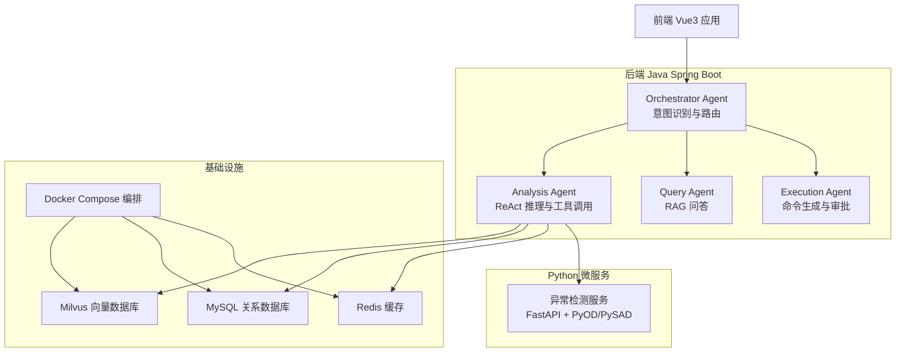
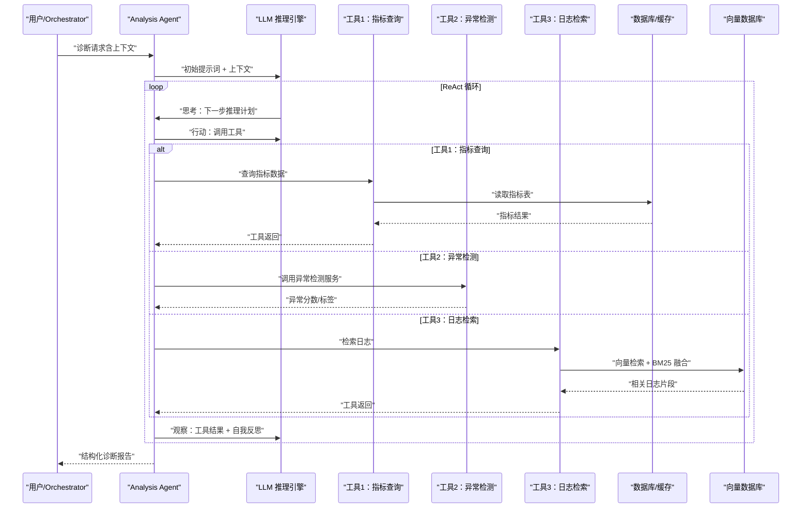
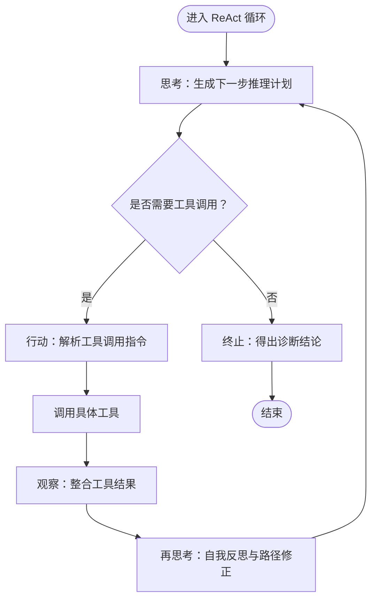
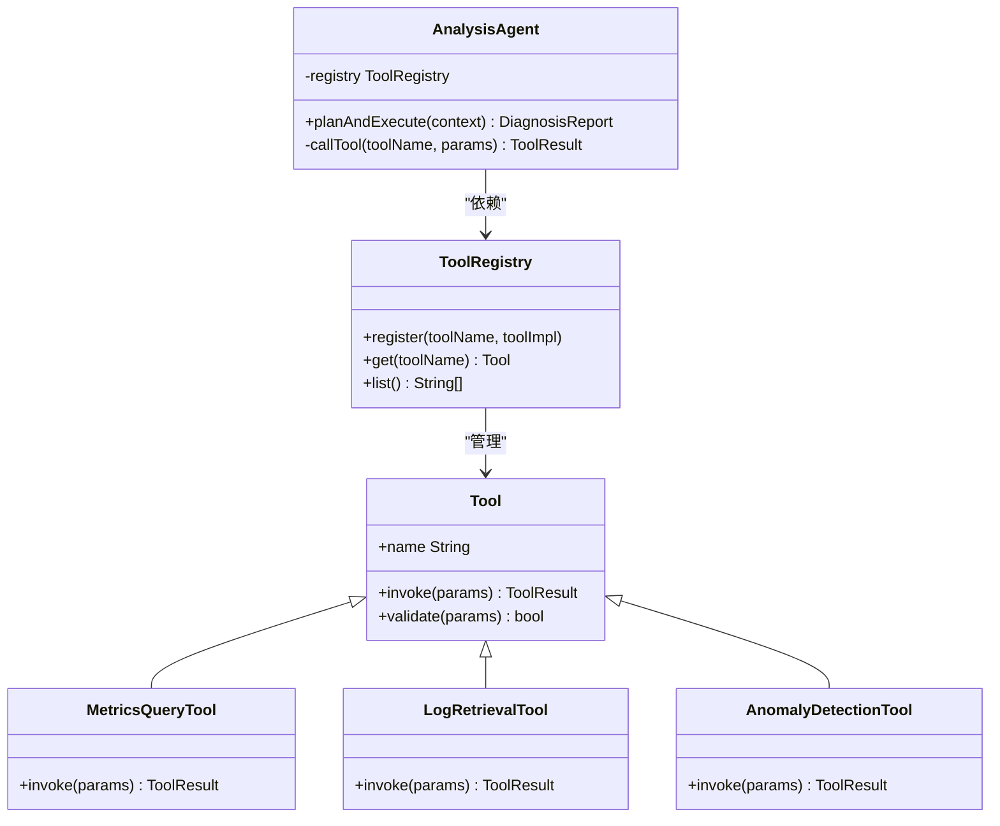
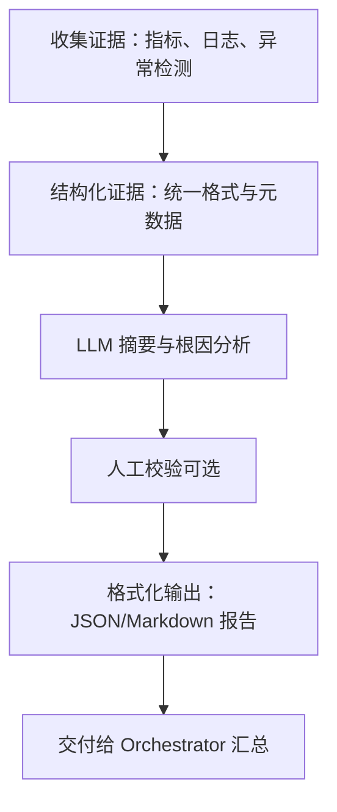
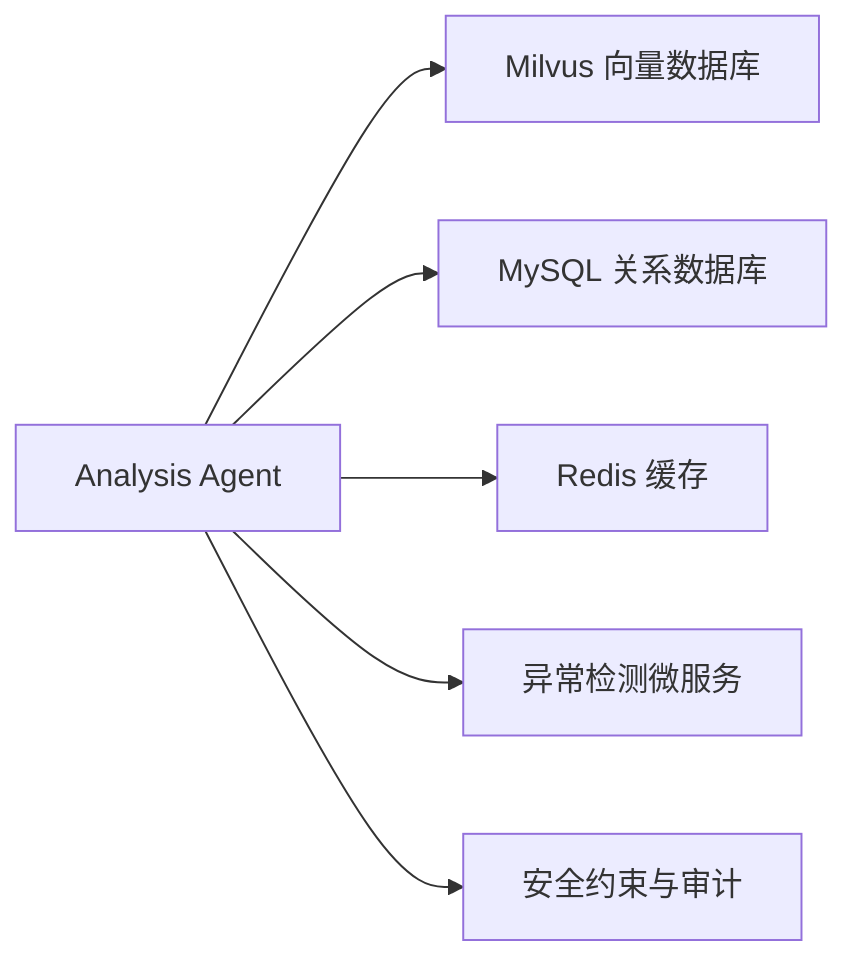

# Analysis Agent 设计

<cite>
**本文引用的文件**
- [PROJECT_CONTEXT.md](file://PROJECT_CONTEXT.md)
- [orchestrator-system-prompt.md](file://docs/prompts/orchestrator-system-prompt.md)
- [shared-safety-constraints.md](file://docs/prompts/shared-safety-constraints.md)
- [init_milvus.py](file://scripts/init_milvus.py)
- [test_milvus_connection.py](file://tests/test_milvus_connection.py)
- [init.sql](file://sql/init.sql)
- [milvus_collection.yaml](file://config/milvus_collection.yaml)
- [docker-compose.yml](file://docker-compose.yml)
</cite>

## 目录
1. [引言](#引言)
2. [项目结构](#项目结构)
3. [核心组件](#核心组件)
4. [架构总览](#架构总览)
5. [详细组件分析](#详细组件分析)
6. [依赖关系分析](#依赖关系分析)
7. [性能考虑](#性能考虑)
8. [故障排除指南](#故障排除指南)
9. [结论](#结论)
10. [附录](#附录)

## 引言
本设计文档围绕 Analysis Agent（分析代理）展开，聚焦其在 Orchestrator-Subagent 模式下的职责与实现要点。Analysis Agent 采用 ReAct（推理-行动）范式，通过“思考-行动-观察-再思考”的循环机制，结合工具调用与结构化诊断报告生成，完成对 NetData 监控数据的智能故障诊断与根因分析。本文将系统阐述：
- ReAct 推理循环的实现原理与控制流
- 工具调用机制：LLM 如何决定何时调用哪些工具及如何处理工具返回结果
- 结构化诊断报告生成：如何将多步推理结果整理为可读、可审计的报告
- 工具扩展机制与错误恢复策略
- 与系统其他模块（RAG、向量检索、安全约束）的集成点

## 项目结构
该项目采用多模块分层架构，Analysis Agent 位于后端 Java Spring Boot 服务中，配合 Python 异常检测微服务、前端 Vue3 应用、容器编排与数据库/缓存/向量库基础设施。Analysis Agent 的核心职责是基于用户输入或告警事件，进行多步工具调用与推理，输出结构化诊断报告。

图表来源
- [PROJECT_CONTEXT.md:120-149](file://PROJECT_CONTEXT.md#L120-L149)

章节来源
- [PROJECT_CONTEXT.md:120-149](file://PROJECT_CONTEXT.md#L120-L149)

## 核心组件
- Orchestrator Agent：负责意图识别与任务路由，将用户输入分流至 Query、Analysis、Execution 子 Agent，并汇总结果。
- Analysis Agent：ReAct 推理模式，多步工具调用，输出结构化诊断报告。
- Query Agent：基于 RAG 的知识问答。
- Execution Agent：命令生成、风险评估、人工审批与执行。
- 异常检测微服务：提供异常检测能力，作为 Analysis Agent 的工具之一。
- 向量数据库（Milvus）、关系数据库（MySQL）、缓存（Redis）：为 Analysis Agent 提供检索、存储与缓存支持。

章节来源
- [PROJECT_CONTEXT.md:43-61](file://PROJECT_CONTEXT.md#L43-L61)
- [PROJECT_CONTEXT.md:120-149](file://PROJECT_CONTEXT.md#L120-L149)

## 架构总览
Analysis Agent 的整体工作流如下：
- 接收来自 Orchestrator 的诊断请求
- 构建上下文（历史对话、活跃告警、实体抽取）
- 以 ReAct 循环进行多步推理与工具调用
- 将工具结果与推理过程整合为结构化诊断报告
- 返回给 Orchestrator 汇总

图表来源
- [PROJECT_CONTEXT.md:43-61](file://PROJECT_CONTEXT.md#L43-L61)
- [orchestrator-system-prompt.md:16-23](file://docs/prompts/orchestrator-system-prompt.md#L16-L23)

## 详细组件分析

### ReAct 推理循环设计
ReAct 循环由“思考（Reasoning）-行动（Act）-观察（Observation）-再思考（Reflection）”构成，Analysis Agent 通过以下机制实现：
- 思考阶段：LLM 基于当前上下文与历史交互，生成下一步推理计划与工具调用意图。
- 行动阶段：Analysis Agent 解析 LLM 的工具调用指令，构造工具调用请求，执行工具并收集结果。
- 观察阶段：将工具返回结果与当前上下文一起反馈给 LLM，进行自我反思与修正。
- 再思考阶段：根据观察结果调整推理路径，直至达到诊断目标或满足终止条件。

图表来源
- [PROJECT_CONTEXT.md:153-160](file://PROJECT_CONTEXT.md#L153-L160)

章节来源
- [PROJECT_CONTEXT.md:153-160](file://PROJECT_CONTEXT.md#L153-L160)

### 工具调用机制设计
工具调用的核心在于“LLM 决策 + Analysis Agent 执行”的解耦设计：
- 工具定义与注册：Analysis Agent 维护工具注册表，每个工具定义清晰的输入参数、输出格式与错误处理策略。
- LLM 决策：在思考阶段，LLM 输出结构化工具调用指令（包含工具名称、参数、调用理由）。
- 执行与结果处理：Analysis Agent 解析指令，调用对应工具，捕获异常并进行错误恢复，将结果注入上下文继续推理。
- 工具扩展：新增工具只需实现统一接口并注册，即可无缝接入 ReAct 循环。

图表来源
- [PROJECT_CONTEXT.md:153-160](file://PROJECT_CONTEXT.md#L153-L160)

章节来源
- [PROJECT_CONTEXT.md:153-160](file://PROJECT_CONTEXT.md#L153-L160)

### 结构化诊断报告生成
诊断报告需满足可读性、完整性与可审计性，Analysis Agent 采用以下策略：
- 报告模板：定义标准化字段（摘要、指标异常、根因分析、影响范围、建议措施、证据链）。
- 多源证据整合：将工具返回结果、日志片段、指标趋势、异常检测标签等整合为证据链。
- 自动化生成：通过 LLM 对整合后的证据进行归纳总结，生成自然语言摘要与建议。
- 可追溯性：记录每一步推理与工具调用的上下文，便于审计与回溯。

图表来源
- [PROJECT_CONTEXT.md:153-160](file://PROJECT_CONTEXT.md#L153-L160)

章节来源
- [PROJECT_CONTEXT.md:153-160](file://PROJECT_CONTEXT.md#L153-L160)

### 工具扩展机制
为支持未来新增工具，Analysis Agent 提供以下扩展点：
- 工具接口：统一的工具接口定义，确保新工具与现有流程兼容。
- 注册中心：集中管理工具注册与版本控制，支持动态启用/禁用。
- 参数校验：在调用前对工具参数进行严格校验，避免无效调用。
- 结果归一化：将不同工具的返回结果映射到统一的数据结构，便于后续处理。

章节来源
- [PROJECT_CONTEXT.md:153-160](file://PROJECT_CONTEXT.md#L153-L160)

### 错误恢复策略
Analysis Agent 在工具调用与推理过程中实施多层次错误恢复：
- 超时与重试：对远程工具（如异常检测服务）设置合理超时与指数退避重试。
- 降级策略：当某工具不可用时，切换到替代工具或使用近似结果继续推理。
- 错误脱敏：对外返回用户友好的错误信息，内部记录详细日志。
- 回滚与补偿：对可能产生副作用的操作，提供回滚方案或补偿动作。
- 审计与告警：记录关键错误事件，触发告警以便运维介入。

章节来源
- [shared-safety-constraints.md:262-292](file://docs/prompts/shared-safety-constraints.md#L262-L292)

## 依赖关系分析
Analysis Agent 的关键依赖包括：
- 向量数据库（Milvus）：用于日志检索与知识检索，支持混合检索与重排。
- 关系数据库（MySQL）：存储指标元数据、告警历史与用户配置。
- 缓存（Redis）：缓存热点查询结果与会话状态，降低延迟。
- 异常检测微服务：提供异常检测能力，作为工具接入 Analysis Agent。
- 安全约束：贯穿工具调用与报告生成，确保操作安全与审计可追溯。

图表来源
- [PROJECT_CONTEXT.md:25-40](file://PROJECT_CONTEXT.md#L25-L40)
- [shared-safety-constraints.md:1-396](file://docs/prompts/shared-safety-constraints.md#L1-L396)

章节来源
- [PROJECT_CONTEXT.md:25-40](file://PROJECT_CONTEXT.md#L25-L40)
- [shared-safety-constraints.md:1-396](file://docs/prompts/shared-safety-constraints.md#L1-L396)

## 性能考虑
- 工具调用并发：对独立工具调用进行并发执行，缩短总响应时间。
- 缓存命中：对常用查询与历史会话进行缓存，减少重复计算。
- 检索优化：在日志检索中采用 RRF 融合与 reranker 精排，提高相关性与召回质量。
- 超时与资源限制：为每个工具调用设置上限，防止雪崩效应。
- 监控与可观测性：记录关键指标（响应时间、错误率、工具耗时），持续优化性能。

## 故障排除指南
- 工具调用失败
  - 检查工具可用性与网络连通性
  - 查看重试日志与超时配置
  - 使用降级工具或近似结果继续推理
- 结果不一致
  - 对比不同工具的返回，确认数据一致性
  - 校验参数与上下文是否正确
- 报告缺失关键证据
  - 检查日志检索是否命中相关片段
  - 确认异常检测服务是否正常返回
- 安全与审计
  - 按照安全约束对敏感信息进行脱敏
  - 确保所有关键操作均有审计日志

章节来源
- [shared-safety-constraints.md:262-292](file://docs/prompts/shared-safety-constraints.md#L262-L292)

## 结论
Analysis Agent 通过 ReAct 推理循环与工具调用机制，实现了对 NetData 监控数据的智能诊断与根因分析。结合结构化报告生成与严格的错误恢复策略，系统在准确性、可扩展性与安全性方面取得平衡。未来可在工具生态、检索质量与人机交互方面持续优化，进一步提升诊断效率与用户体验。

## 附录
- 环境与配置
  - Docker Compose 编排：一键启动 Milvus、MySQL、Redis、Ollama 等基础服务
  - Milvus Collection 配置：固定维度与索引参数，确保检索稳定性
  - 初始化脚本：数据库初始化与 Milvus 集合创建
  - 测试脚本：验证 Milvus 连接与基本功能

章节来源
- [docker-compose.yml](file://docker-compose.yml)
- [milvus_collection.yaml](file://config/milvus_collection.yaml)
- [init.sql](file://sql/init.sql)
- [init_milvus.py](file://scripts/init_milvus.py)
- [test_milvus_connection.py](file://tests/test_milvus_connection.py)