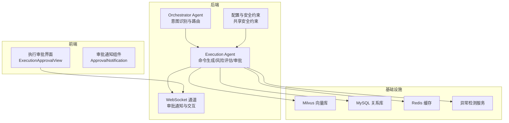
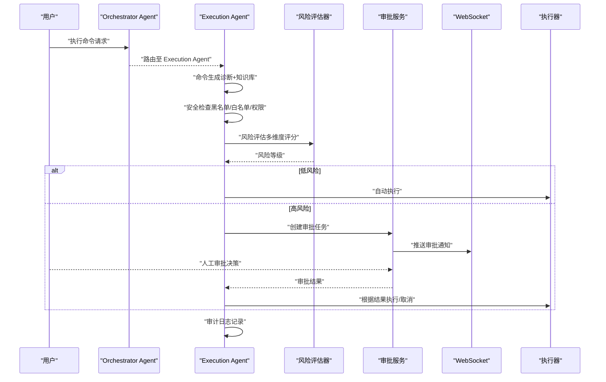
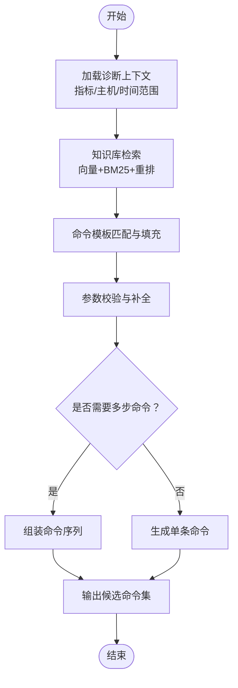
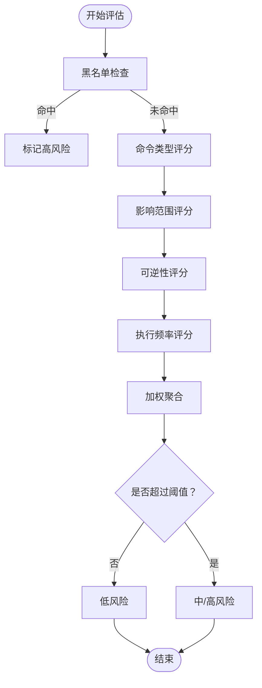
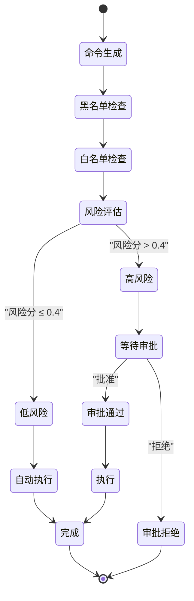
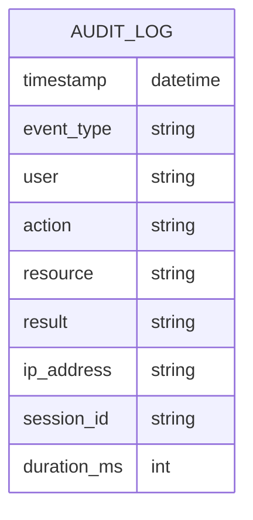
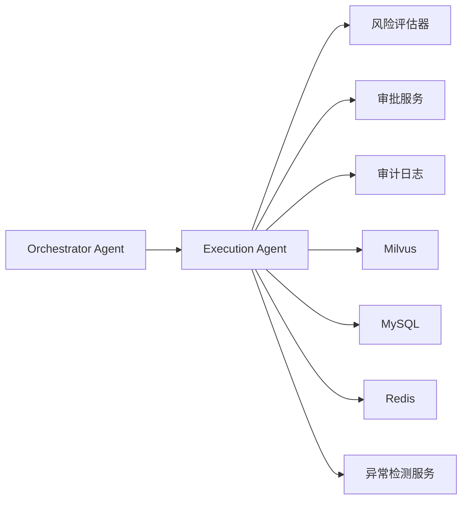

# Execution Agent 实现

<cite>
**本文引用的文件**
- [PROJECT_CONTEXT.md](file://PROJECT_CONTEXT.md)
- [orchestrator-system-prompt.md](file://docs/prompts/orchestrator-system-prompt.md)
- [shared-safety-constraints.md](file://docs/prompts/shared-safety-constraints.md)
- [development-prompt-library.md](file://docs/prompts/development-prompt-library.md)
- [init_milvus.py](file://scripts/init_milvus.py)
- [milvus_collection.yaml](file://config/milvus_collection.yaml)
- [test_milvus_connection.py](file://tests/test_milvus_connection.py)
</cite>

## 目录
1. [简介](#简介)
2. [项目结构](#项目结构)
3. [核心组件](#核心组件)
4. [架构总览](#架构总览)
5. [详细组件分析](#详细组件分析)
6. [依赖分析](#依赖分析)
7. [性能考虑](#性能考虑)
8. [故障排除指南](#故障排除指南)
9. [结论](#结论)
10. [附录](#附录)

## 简介
本文件面向“Execution Agent（执行代理）”的实现，围绕以下目标展开：
- 命令生成逻辑的设计原理：如何结合诊断结果与知识库信息生成修复命令
- 风险评估算法：命令危险性评分、影响范围评估与安全阈值设定
- Human-in-the-Loop 审批流程：审批界面设计、审批决策逻辑与执行控制机制
- 安全约束与审计日志：黑名单/白名单检查、权限控制、审计日志记录规范

该实现以 Orchestrator-Subagent 模式为基础，Execution Agent 位于“命令执行”子代理位置，负责将意图识别与分析结果转化为受控的修复命令，并通过风险评估与人工审批保障安全。

章节来源
- [PROJECT_CONTEXT.md:43-61](file://PROJECT_CONTEXT.md#L43-L61)
- [orchestrator-system-prompt.md:26-34](file://docs/prompts/orchestrator-system-prompt.md#L26-L34)

## 项目结构
后端采用 Spring Boot（Java），前端采用 Vue3，执行代理位于后端 Agent 层，前端提供审批界面。系统还包含 Milvus 向量数据库、MySQL、Redis、异常检测微服务等基础设施。

图表来源
- [PROJECT_CONTEXT.md:120-149](file://PROJECT_CONTEXT.md#L120-L149)
- [orchestrator-system-prompt.md:48-54](file://docs/prompts/orchestrator-system-prompt.md#L48-L54)

章节来源
- [PROJECT_CONTEXT.md:120-149](file://PROJECT_CONTEXT.md#L120-L149)

## 核心组件
- 命令生成器：基于诊断报告与知识库检索结果，构造修复命令模板并填充参数
- 风险评估器：对命令进行多维度打分，判定是否需要人工审批
- 审批服务：维护审批状态机，通过 WebSocket 推送审批请求，接收审批决策
- 审计日志：记录命令生成、风险评估、审批决策、执行结果等关键事件
- 安全约束：黑名单/白名单检查、权限矩阵、超时与回滚策略

章节来源
- [development-prompt-library.md:303-336](file://docs/prompts/development-prompt-library.md#L303-L336)
- [shared-safety-constraints.md:29-127](file://docs/prompts/shared-safety-constraints.md#L29-L127)

## 架构总览
Execution Agent 的端到端流程如下：
1. 接收来自 Orchestrator 的执行意图与上下文
2. 生成候选命令（结合诊断结果与知识库）
3. 安全检查（黑名单/白名单/权限）
4. 风险评估（命令类型、影响范围、可逆性、执行频率）
5. 审批决策（低风险自动执行，高风险进入审批）
6. 执行与审计（记录全过程）

图表来源
- [development-prompt-library.md:315-319](file://docs/prompts/development-prompt-library.md#L315-L319)
- [shared-safety-constraints.md:244-258](file://docs/prompts/shared-safety-constraints.md#L244-L258)

## 详细组件分析

### 命令生成逻辑
- 输入来源
  - 诊断报告：包含异常指标、受影响主机、根因线索
  - 知识库检索：向量检索 + BM25 + Rerank，获取可执行修复步骤
- 生成策略
  - 命令模板系统：预定义常见修复场景的模板，动态填充参数（主机、服务、路径、数值阈值等）
  - 上下文增强：将诊断实体（metrics、hosts、time_range）注入模板
  - 多命令组合：针对复杂问题拆分为“检查→修复→验证”的序列命令
- 输出规范
  - 结构化命令对象：包含原始命令、参数、预期结果、回滚命令、执行频率建议

图表来源
- [development-prompt-library.md:228-260](file://docs/prompts/development-prompt-library.md#L228-L260)

章节来源
- [development-prompt-library.md:228-260](file://docs/prompts/development-prompt-library.md#L228-L260)

### 风险评估算法
- 评估维度与权重
  - 命令类型（40%）：删除/重启/权限修改/网络变更等高危命令权重更高
  - 影响范围（30%）：主机数量、服务覆盖、数据影响面
  - 可逆性（20%）：是否存在回滚方案与备份
  - 执行频率（10%）：近期执行次数与并发度
- 评分与阈值
  - 每维度独立评分（0~1），加权求和得到综合风险分
  - 阈值：低风险（≤0.4）、中风险（0.41~0.7）、高风险（>0.7）
- 安全阈值设定
  - 绝对禁令：黑名单命令直接判定为高风险
  - 审批阈值：≥中风险需人工审批

图表来源
- [shared-safety-constraints.md:31-95](file://docs/prompts/shared-safety-constraints.md#L31-L95)
- [development-prompt-library.md:321-326](file://docs/prompts/development-prompt-library.md#L321-L326)

章节来源
- [shared-safety-constraints.md:31-95](file://docs/prompts/shared-safety-constraints.md#L31-L95)
- [development-prompt-library.md:321-326](file://docs/prompts/development-prompt-library.md#L321-L326)

### Human-in-the-Loop 审批流程
- 状态机
  - 命令生成 → 黑名单检查 → 白名单检查 → 风险评估 →（低风险自动执行 | 高风险等待审批）
- 审批界面设计
  - 执行审批视图：展示命令详情、风险评分、影响范围、回滚建议
  - 审批通知组件：WebSocket 推送新任务，支持快速批准/拒绝
- 决策逻辑
  - 低风险：自动执行并记录
  - 中/高风险：推送审批，审批人按角色矩阵进行审批
  - 审批拒绝：记录拒绝原因并终止执行
- 执行控制
  - 审批通过后执行命令，失败自动回滚
  - 设置超时与重试策略，避免长时间阻塞

图表来源
- [development-prompt-library.md:315-319](file://docs/prompts/development-prompt-library.md#L315-L319)
- [shared-safety-constraints.md:244-258](file://docs/prompts/shared-safety-constraints.md#L244-L258)

章节来源
- [development-prompt-library.md:315-319](file://docs/prompts/development-prompt-library.md#L315-L319)
- [shared-safety-constraints.md:244-258](file://docs/prompts/shared-safety-constraints.md#L244-L258)

### 审计日志与安全约束
- 审计日志字段
  - 事件类型、用户、操作命令、资源、结果、IP、会话ID、耗时等
  - 必须记录：命令生成、风险评估、审批决策、执行结果
- 安全约束
  - 最小权限、防御优先、审计追溯
  - 绝对禁令命令、需要审批的命令、自动执行命令清单
  - 权限矩阵：viewer/operator/admin/super-admin
- 数据安全
  - 敏感数据脱敏、日志安全、输入验证（SQL注入、命令注入、XSS）

图表来源
- [shared-safety-constraints.md:296-323](file://docs/prompts/shared-safety-constraints.md#L296-L323)

章节来源
- [shared-safety-constraints.md:296-323](file://docs/prompts/shared-safety-constraints.md#L296-L323)
- [shared-safety-constraints.md:130-168](file://docs/prompts/shared-safety-constraints.md#L130-L168)
- [shared-safety-constraints.md:233-258](file://docs/prompts/shared-safety-constraints.md#L233-L258)

## 依赖分析
- 组件耦合
  - Execution Agent 依赖 Orchestrator 的路由与上下文
  - 风险评估器与审批服务相互独立但共同依赖安全约束
  - 审计日志贯穿所有关键节点
- 外部依赖
  - Milvus：知识库检索
  - MySQL/Redis：配置与缓存
  - 异常检测服务：提供告警与上下文

图表来源
- [PROJECT_CONTEXT.md:120-149](file://PROJECT_CONTEXT.md#L120-L149)

章节来源
- [PROJECT_CONTEXT.md:120-149](file://PROJECT_CONTEXT.md#L120-L149)

## 性能考虑
- 命令生成
  - 模板预编译与参数缓存，减少重复解析开销
  - 并行检索知识库（向量+BM25），使用 Rerank 精排
- 风险评估
  - 向量化评分与规则评分并行，阈值提前短路
- 审批流程
  - WebSocket 长连接复用，批量推送与去重
  - 审批界面懒加载与虚拟滚动
- 执行控制
  - 超时与重试策略，失败自动回滚
  - 执行队列与并发度限制

## 故障排除指南
- 命令生成失败
  - 检查知识库检索是否成功、模板参数是否缺失
  - 参考：[development-prompt-library.md:228-260](file://docs/prompts/development-prompt-library.md#L228-L260)
- 风险评估异常
  - 核对黑名单/白名单规则、评分权重是否正确
  - 参考：[shared-safety-constraints.md:31-95](file://docs/prompts/shared-safety-constraints.md#L31-L95)
- 审批不生效
  - 检查 WebSocket 连接、审批服务状态、权限矩阵
  - 参考：[shared-safety-constraints.md:244-258](file://docs/prompts/shared-safety-constraints.md#L244-L258)
- 审计日志缺失
  - 确认关键事件是否记录、字段是否完整
  - 参考：[shared-safety-constraints.md:296-323](file://docs/prompts/shared-safety-constraints.md#L296-L323)

章节来源
- [shared-safety-constraints.md:296-323](file://docs/prompts/shared-safety-constraints.md#L296-L323)
- [shared-safety-constraints.md:31-95](file://docs/prompts/shared-safety-constraints.md#L31-L95)
- [shared-safety-constraints.md:244-258](file://docs/prompts/shared-safety-constraints.md#L244-L258)

## 结论
Execution Agent 通过“命令生成—安全检查—风险评估—人工审批—执行审计”的闭环，实现了可控、可观测、可追溯的自动化运维执行。其设计遵循最小权限、防御优先与审计追溯三大原则，配合严格的阈值与权限矩阵，有效降低误操作风险。后续可在模板系统扩展、评估维度细化与前端交互优化方面持续演进。

## 附录
- 向量数据库初始化脚本与配置
  - 参考：[init_milvus.py](file://scripts/init_milvus.py)
  - 参考：[milvus_collection.yaml](file://config/milvus_collection.yaml)
  - 参考：[test_milvus_connection.py](file://tests/test_milvus_connection.py)
- 系统 Prompt 与安全约束
  - 参考：[orchestrator-system-prompt.md](file://docs/prompts/orchestrator-system-prompt.md)
  - 参考：[shared-safety-constraints.md](file://docs/prompts/shared-safety-constraints.md)
- 开发阶段 Prompt 模板库
  - 参考：[development-prompt-library.md](file://docs/prompts/development-prompt-library.md)