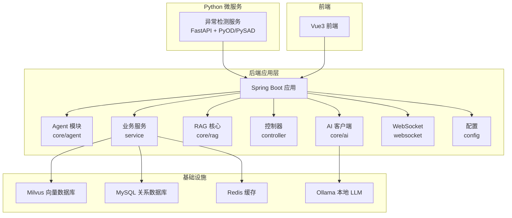
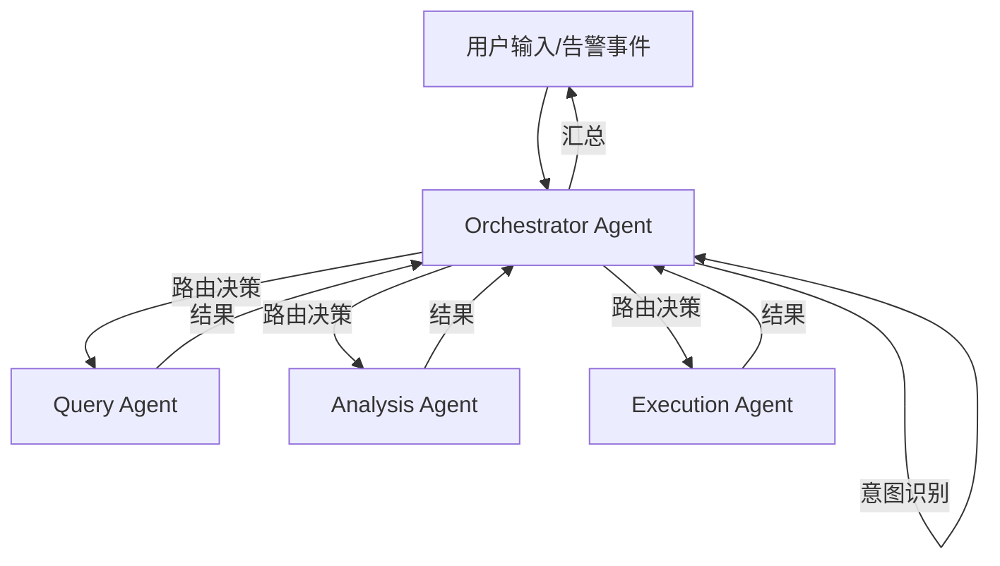
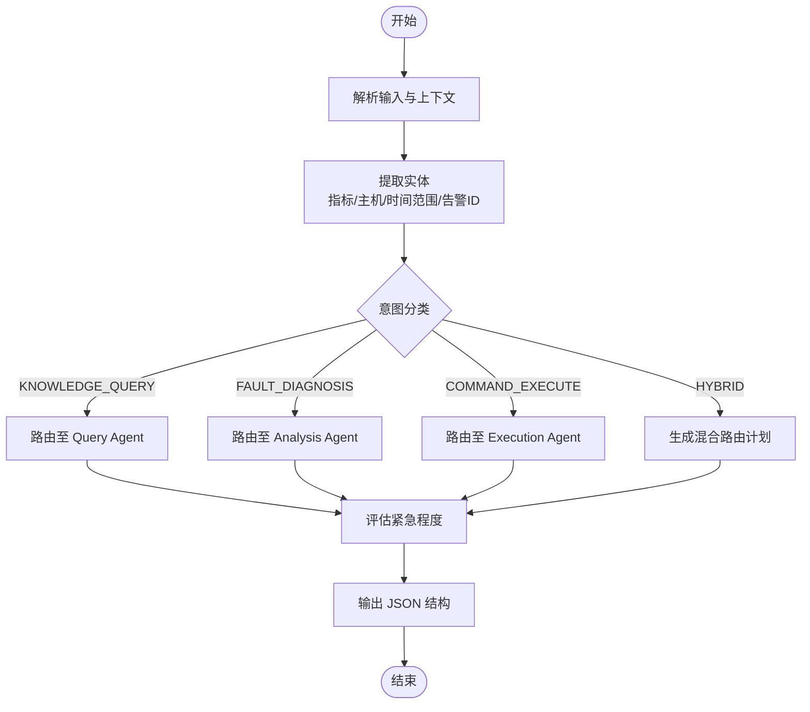
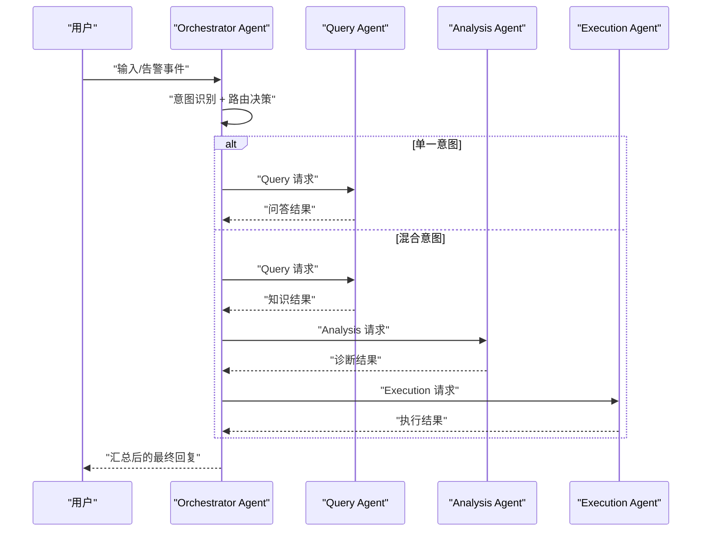
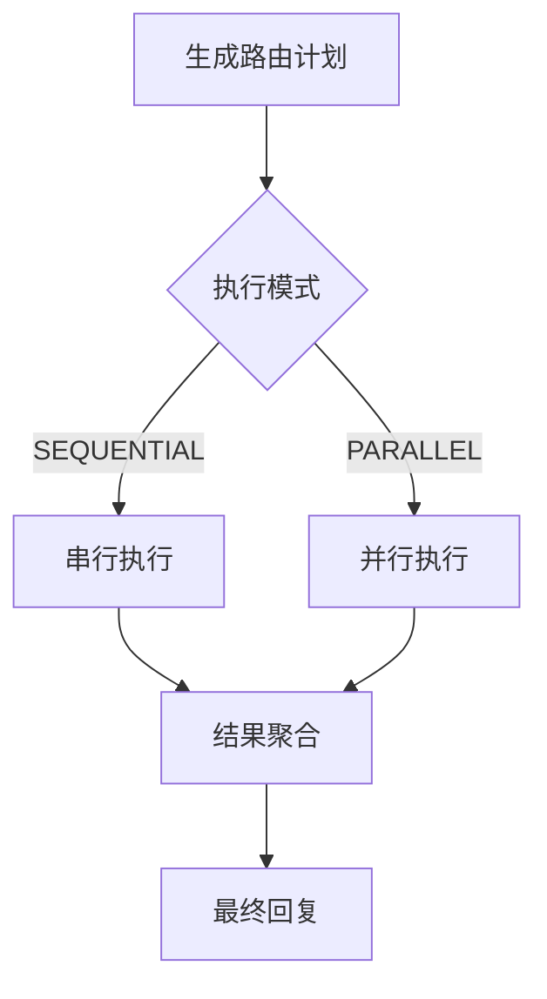
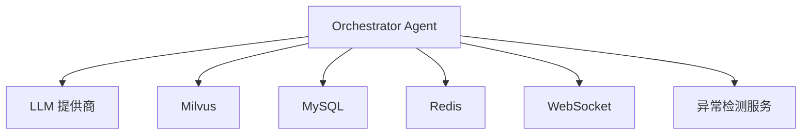

# Orchestrator Agent 设计

<cite>
**本文引用的文件**
- [PROJECT_CONTEXT.md](file://PROJECT_CONTEXT.md)
- [开题报告_精简版.md](file://开题报告_精简版.md)
- [orchestrator-system-prompt.md](file://docs/prompts/orchestrator-system-prompt.md)
- [shared-safety-constraints.md](file://docs/prompts/shared-safety-constraints.md)
- [docker-compose.yml](file://docker-compose.yml)
- [milvus_collection.yaml](file://config/milvus_collection.yaml)
- [init_milvus.py](file://scripts/init_milvus.py)
- [test_milvus_connection.py](file://tests/test_milvus_connection.py)
- [init.sql](file://sql/init.sql)
</cite>

## 目录
1. [简介](#简介)
2. [项目结构](#项目结构)
3. [核心组件](#核心组件)
4. [架构总览](#架构总览)
5. [详细组件分析](#详细组件分析)
6. [依赖分析](#依赖分析)
7. [性能考虑](#性能考虑)
8. [故障排查指南](#故障排查指南)
9. [结论](#结论)
10. [附录](#附录)

## 简介
本设计文档围绕 Orchestrator Agent 的架构与实现展开，重点解释以下内容：
- 意图识别算法：如何解析用户输入与告警事件，判定任务类型（知识问答、故障诊断、命令执行、混合意图）
- 任务路由策略：如何根据意图将请求分发给 Query Agent、Analysis Agent 或 Execution Agent，并在混合意图下进行有序协作
- 混合并发执行模式：Orchestrator Agent 如何协调多个子 Agent 的协作与结果汇总
- 配置选项与扩展点：系统级配置、安全约束、提示词模板与可扩展点

该设计以“Orchestrator-Subagent 模式”为核心，强调“意图识别 + 任务路由 + 结果汇总”的编排能力。

章节来源
- [PROJECT_CONTEXT.md:43-61](file://PROJECT_CONTEXT.md#L43-L61)
- [开题报告_精简版.md:118-152](file://开题报告_精简版.md#L118-L152)

## 项目结构
项目采用多模块分层组织，后端以 Spring Boot 为基础，包含 Agent 实现、AI 客户端、RAG 核心、控制器、业务服务、WebSocket 与配置等模块。同时提供异常检测服务（Python）、前端 Vue3 应用以及 Docker Compose 编排。

图表来源
- [PROJECT_CONTEXT.md:120-149](file://PROJECT_CONTEXT.md#L120-L149)

章节来源
- [PROJECT_CONTEXT.md:120-149](file://PROJECT_CONTEXT.md#L120-L149)

## 核心组件
- Orchestrator Agent：接收用户输入或告警事件，执行意图识别、路由决策与结果汇总
- Query Agent：基于 RAG 的知识问答
- Analysis Agent：ReAct 模式，多步工具调用，输出结构化诊断报告
- Execution Agent：生成命令 → 风险评估 → 人工审批 → 执行 → 记录

章节来源
- [PROJECT_CONTEXT.md:43-61](file://PROJECT_CONTEXT.md#L43-L61)

## 架构总览
Orchestrator Agent 位于系统入口，负责将用户输入或告警事件转化为子 Agent 的任务序列，并在必要时进行并发协调与结果融合。

图表来源
- [PROJECT_CONTEXT.md:43-61](file://PROJECT_CONTEXT.md#L43-L61)
- [orchestrator-system-prompt.md:16-23](file://docs/prompts/orchestrator-system-prompt.md#L16-L23)

## 详细组件分析

### 意图识别算法
- 输入来源：用户自然语言输入、告警事件上下文、对话历史
- 关键特征词与路由目标：
  - 知识问答：如何、什么是、怎么配置、原理、最佳实践 → Query Agent
  - 故障诊断：告警、异常、故障、排查、根因、诊断、飙升、下降 → Analysis Agent
  - 命令执行：执行、运行、重启、清理、部署、停止、启动 → Execution Agent
  - 混合意图：包含多个意图 → 多 Agent 协作
- 紧急程度评估：生产服务宕机/数据丢失风险 → CRITICAL；服务性能严重下降/关键告警 → HIGH；一般告警/性能波动 → MEDIUM；知识问答/配置咨询 → LOW
- 输出格式：JSON 结构，包含 intent、confidence、routing_plan、extracted_entities、urgency_level、response_to_user 等字段

图表来源
- [orchestrator-system-prompt.md:26-106](file://docs/prompts/orchestrator-system-prompt.md#L26-L106)
- [orchestrator-system-prompt.md:119-136](file://docs/prompts/orchestrator-system-prompt.md#L119-L136)

章节来源
- [orchestrator-system-prompt.md:26-106](file://docs/prompts/orchestrator-system-prompt.md#L26-L106)
- [orchestrator-system-prompt.md:119-136](file://docs/prompts/orchestrator-system-prompt.md#L119-L136)

### 任务路由策略
- 单一意图路由：直接映射到对应 Agent
- 混合意图路由顺序：
  - 诊断 + 执行：Analysis → Execution
  - 问答 + 诊断：Query → Analysis
  - 诊断 + 问答 + 执行：Query → Analysis → Execution
- 执行模式：SEQUENTIAL（串行）或 PARALLEL（并行），由 routing_plan.execution_mode 指定
- 超时控制：单个请求最多路由 3 个 Agent，避免过长等待，优先返回部分结果

图表来源
- [orchestrator-system-prompt.md:37-57](file://docs/prompts/orchestrator-system-prompt.md#L37-L57)
- [orchestrator-system-prompt.md:70-92](file://docs/prompts/orchestrator-system-prompt.md#L70-L92)

章节来源
- [orchestrator-system-prompt.md:37-57](file://docs/prompts/orchestrator-system-prompt.md#L37-L57)
- [orchestrator-system-prompt.md:70-92](file://docs/prompts/orchestrator-system-prompt.md#L70-L92)

### 混合并发执行模式
- 串行模式：按路由顺序依次执行，适合诊断-执行链路
- 并发模式：在满足安全与一致性前提下，对独立任务并行处理
- 结果聚合：将各 Agent 的输出按统一格式整合，形成最终回复；对简单问题可直接返回 response_to_user

图表来源
- [orchestrator-system-prompt.md:78-82](file://docs/prompts/orchestrator-system-prompt.md#L78-L82)
- [orchestrator-system-prompt.md:70-92](file://docs/prompts/orchestrator-system-prompt.md#L70-L92)

章节来源
- [orchestrator-system-prompt.md:78-82](file://docs/prompts/orchestrator-system-prompt.md#L78-L82)
- [orchestrator-system-prompt.md:70-92](file://docs/prompts/orchestrator-system-prompt.md#L70-L92)

### 安全与合规约束
- 最小权限原则、防御优先原则、审计追溯原则
- 命令执行安全规则：绝对禁止的命令清单、需要审批的命令清单、可自动执行的命令清单
- 数据安全：敏感数据识别、脱敏规则、日志安全
- 网络安全：访问限制、URL 安全验证
- 用户输入安全：输入验证、长度限制、注入防护
- 权限控制：角色权限矩阵、审批流程
- 错误处理与应急响应：错误信息脱敏、异常恢复、安全事件响应流程

章节来源
- [shared-safety-constraints.md:7-26](file://docs/prompts/shared-safety-constraints.md#L7-L26)
- [shared-safety-constraints.md:29-127](file://docs/prompts/shared-safety-constraints.md#L29-L127)
- [shared-safety-constraints.md:130-169](file://docs/prompts/shared-safety-constraints.md#L130-L169)
- [shared-safety-constraints.md:172-196](file://docs/prompts/shared-safety-constraints.md#L172-L196)
- [shared-safety-constraints.md:199-231](file://docs/prompts/shared-safety-constraints.md#L199-L231)
- [shared-safety-constraints.md:233-259](file://docs/prompts/shared-safety-constraints.md#L233-L259)
- [shared-safety-constraints.md:262-293](file://docs/prompts/shared-safety-constraints.md#L262-L293)
- [shared-safety-constraints.md:296-324](file://docs/prompts/shared-safety-constraints.md#L296-L324)
- [shared-safety-constraints.md:326-388](file://docs/prompts/shared-safety-constraints.md#L326-L388)

### 配置选项与扩展点
- LLM 配置：提供商（DeepSeek/Ollama）、模型名称、温度、最大 Token 数
- RAG 配置：Top-K、相似度阈值
- 执行配置：是否自动批准低风险命令、命令执行最大等待时间
- 扩展点：提示词模板（Prompt 管理）、Agent 扩展（新增 Agent 时需遵循路由与安全约束）

章节来源
- [init.sql:220-246](file://sql/init.sql#L220-L246)

## 依赖分析
- Orchestrator Agent 依赖：
  - AI 客户端（Spring AI）与 LLM 提供商（DeepSeek API 或 Ollama）
  - Milvus 向量数据库（RAG 检索）
  - MySQL（审计日志、命令模板、系统配置）
  - Redis（缓存、分布式锁、实时告警去重）
  - WebSocket（实时通信，支持告警与审批推送）
  - Python 异常检测服务（FastAPI + PyOD/PySAD）

图表来源
- [PROJECT_CONTEXT.md:25-40](file://PROJECT_CONTEXT.md#L25-L40)
- [docker-compose.yml:23-357](file://docker-compose.yml#L23-L357)

章节来源
- [PROJECT_CONTEXT.md:25-40](file://PROJECT_CONTEXT.md#L25-L40)
- [docker-compose.yml:23-357](file://docker-compose.yml#L23-L357)

## 性能考虑
- 向量检索与混合检索：Milvus 配置（索引类型、nlist、nprobe、Top-K）直接影响检索性能与准确率
- RAG 管线：向量检索 + BM25 + RRF 融合 + reranker 精排，需平衡延迟与质量
- 缓存策略：Redis 缓存检索结果与会话状态，减少重复计算
- 并发与超时：路由链路设置最大 Agent 数与超时控制，避免长时间等待
- 数据库与索引：为高频查询字段建立合适索引，定期维护统计信息

章节来源
- [milvus_collection.yaml:54-101](file://config/milvus_collection.yaml#L54-L101)
- [init_milvus.py:244-294](file://scripts/init_milvus.py#L244-L294)
- [init_milvus.py:380-433](file://scripts/init_milvus.py#L380-L433)

## 故障排查指南
- Milvus 连接与健康检查：使用测试脚本验证 gRPC 连接与健康端点
- 初始化与索引：确认 Collection 创建、索引构建、加载到内存、测试搜索流程
- 数据库初始化：确认表结构、默认数据、视图创建
- 常见问题定位：
  - Milvus 服务异常：查看容器日志、确认端口映射与资源分配
  - LLM 连接失败：检查提供商配置、API 密钥、网络策略
  - 命令执行失败：检查安全约束、审批流程、日志审计

章节来源
- [test_milvus_connection.py:33-79](file://tests/test_milvus_connection.py#L33-L79)
- [test_milvus_connection.py:81-116](file://tests/test_milvus_connection.py#L81-L116)
- [init_milvus.py:457-516](file://scripts/init_milvus.py#L457-L516)
- [init.sql:18-246](file://sql/init.sql#L18-L246)

## 结论
Orchestrator Agent 通过清晰的意图识别与路由策略，将复杂的运维需求拆解为可编排的任务序列，并在安全与合规的前提下实现多 Agent 的协同与结果汇总。结合 RAG 管线与执行审批流程，系统能够在保证安全性的同时，提供高效、可扩展的智能运维能力。

## 附录
- 提示词与安全约束：系统通过提示词模板与安全约束文档统一 Agent 的行为边界
- 配置管理：系统配置表集中管理 LLM、RAG、执行等关键参数，便于切换与调优

章节来源
- [orchestrator-system-prompt.md:139-157](file://docs/prompts/orchestrator-system-prompt.md#L139-L157)
- [shared-safety-constraints.md:296-324](file://docs/prompts/shared-safety-constraints.md#L296-L324)
- [init.sql:220-246](file://sql/init.sql#L220-L246)