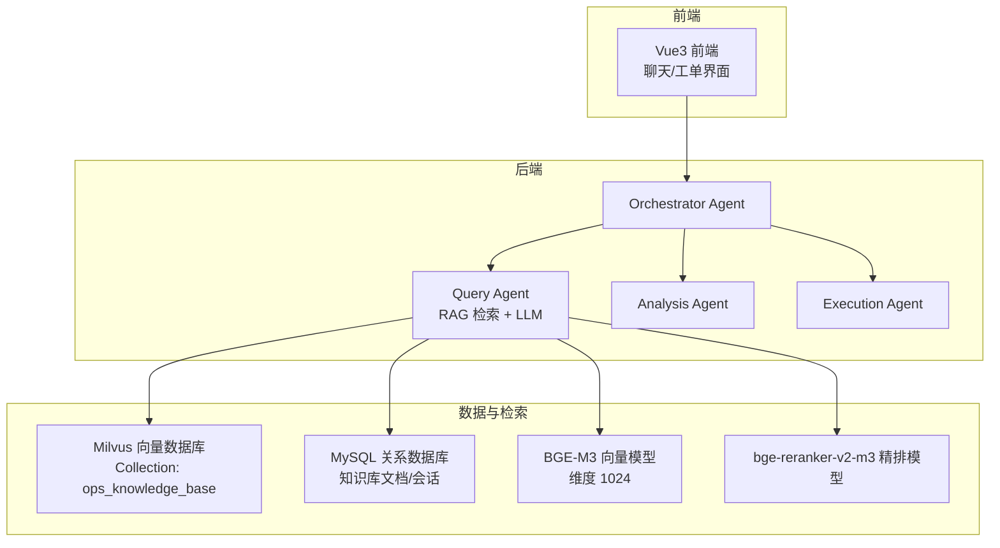
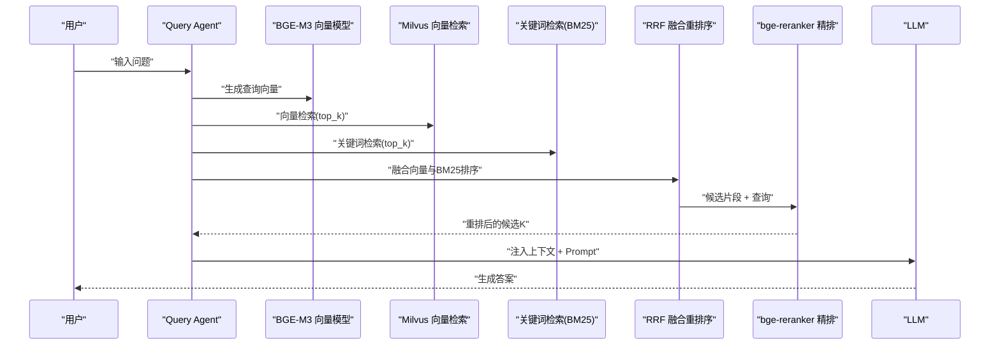
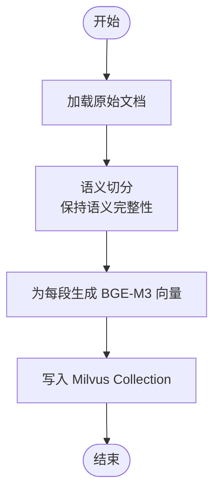
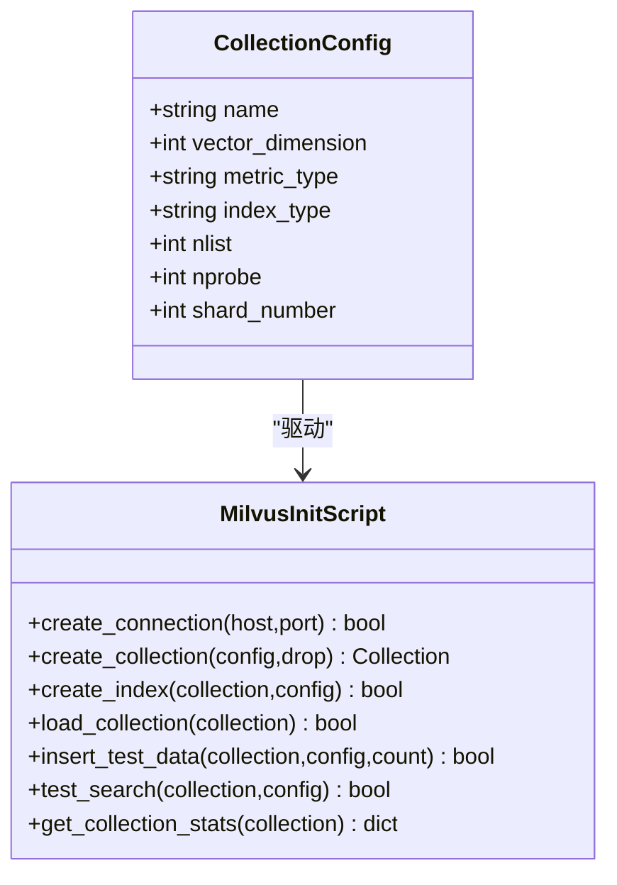
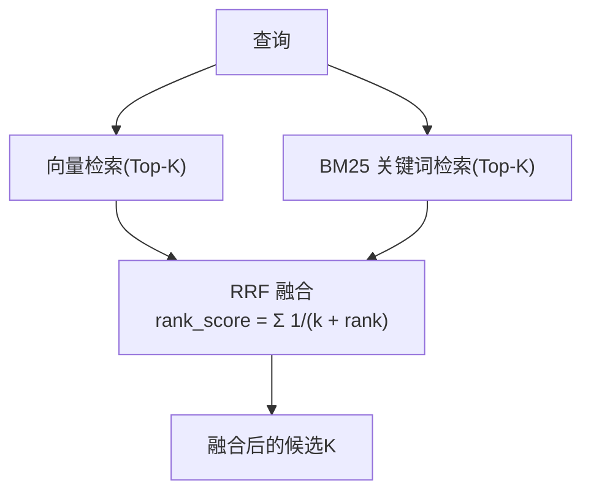
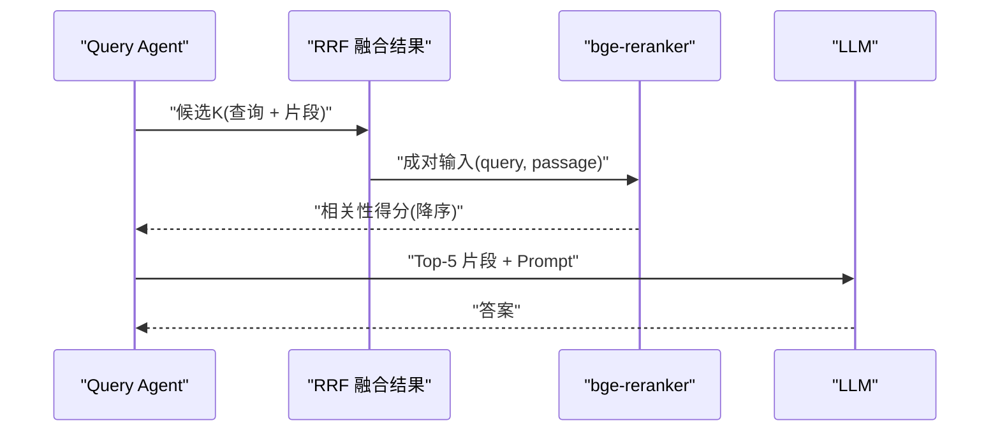
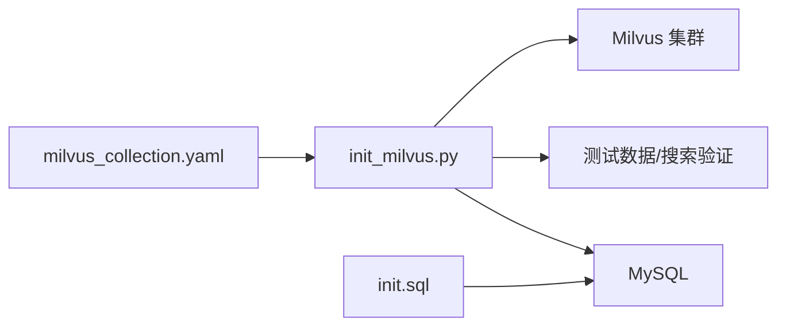
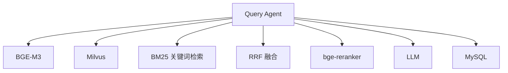
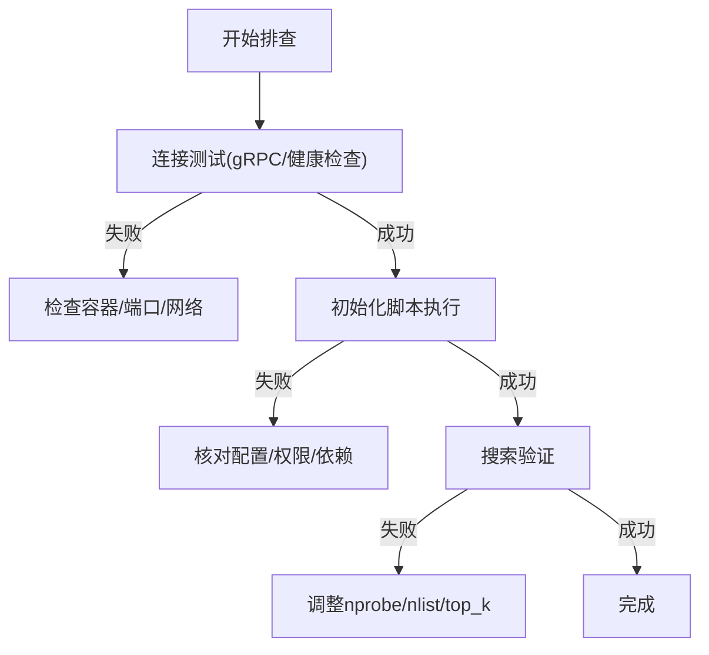

# Query Agent 实现

<cite>
**本文引用的文件**
- [PROJECT_CONTEXT.md](file://PROJECT_CONTEXT.md)
- [开题报告_精简版.md](file://开题报告_精简版.md)
- [milvus_collection.yaml](file://config/milvus_collection.yaml)
- [init_milvus.py](file://scripts/init_milvus.py)
- [test_milvus_connection.py](file://tests/test_milvus_connection.py)
- [init.sql](file://sql/init.sql)
- [文献知识库_完整版.md](file://文献/文献知识库_完整版.md)
</cite>

## 目录
1. [简介](#简介)
2. [项目结构](#项目结构)
3. [核心组件](#核心组件)
4. [架构总览](#架构总览)
5. [详细组件分析](#详细组件分析)
6. [依赖关系分析](#依赖关系分析)
7. [性能考量](#性能考量)
8. [故障排查指南](#故障排查指南)
9. [结论](#结论)
10. [附录](#附录)

## 简介
本文件面向“Query Agent”的实现，聚焦于 RAG 检索流程的完整落地，包括：
- 文档切分算法（语义切分优先，兼顾关键词检索）
- 向量嵌入生成与 Milvus 向量检索
- 混合检索（向量检索 + BM25 关键词检索）与 RRF 融合重排序
- 精排重排（bge-reranker 模型）与参数调优
- 错误处理与异常情况处理方案
- 配置参数与性能优化技巧

目标是帮助读者从“为什么这样设计”到“如何实现与优化”，全面掌握 Query Agent 的工程化落地。

## 项目结构
仓库采用多模块分层组织，与 Query Agent 相关的关键位置如下：
- 后端（Java/Spring Boot）：netdata-ai-backend（Agent 实现、RAG 核心、AI 客户端、Prompt 管理、配置）
- 异常检测服务（Python/FastAPI）：anomaly-detection-service（PyOD/PySAD）
- 前端（Vue3）：netdata-ai-frontend（聊天界面、运维工单）
- 向量数据库（Milvus 2.4）：scripts/init_milvus.py、config/milvus_collection.yaml
- 关系数据库（MySQL）：sql/init.sql
- 文档与知识库：文献/（含知识库构建与检索策略讨论）

**图表来源**
- [PROJECT_CONTEXT.md: 43-61:43-61](file://PROJECT_CONTEXT.md#L43-L61)
- [PROJECT_CONTEXT.md: 120-149:120-149](file://PROJECT_CONTEXT.md#L120-L149)
- [milvus_collection.yaml: 22-101:22-101](file://config/milvus_collection.yaml#L22-L101)

**章节来源**
- [PROJECT_CONTEXT.md: 16-61:16-61](file://PROJECT_CONTEXT.md#L16-L61)
- [PROJECT_CONTEXT.md: 120-149:120-149](file://PROJECT_CONTEXT.md#L120-L149)

## 核心组件
- Query Agent：负责 RAG 检索与 LLM 答案生成，采用混合检索与 RRF 融合重排序，并引入 bge-reranker 进行精排。
- Milvus 向量数据库：承载知识库向量，提供高维近似最近邻检索。
- 关系数据库：存储知识库文档元数据、会话历史等。
- 向量嵌入：BGE-M3（1024 维），固定维度，不可更改。
- 精排模型：bge-reranker-v2-m3，用于对混合检索结果进行细粒度重排。

**章节来源**
- [PROJECT_CONTEXT.md: 64-82:64-82](file://PROJECT_CONTEXT.md#L64-L82)
- [milvus_collection.yaml: 41-49:41-49](file://config/milvus_collection.yaml#L41-L49)

## 架构总览
Query Agent 的检索链路遵循“语义 + 关键词 + 融合 + 精排”的闭环：
- 输入问题 → 语义切分（可选）→ 向量化 → Milvus ANN 检索（Top-K）→ BM25 关键词检索（Top-K）→ RRF 融合 → bge-reranker 精排 → LLM 上下文注入 → 答案生成

**图表来源**
- [PROJECT_CONTEXT.md: 64-78:64-78](file://PROJECT_CONTEXT.md#L64-L78)
- [文献知识库_完整版.md: 2424-2526:2424-2526](file://文献/文献知识库_完整版.md#L2424-L2526)

## 详细组件分析

### 文档切分算法
- 采用“语义切分（Semantic Chunking）”优先策略，避免固定长度切分导致的语义断裂。
- 语义切分依据文档结构与语义边界，结合分句/分段规则，形成更利于检索的片段。
- 切分后为每个片段生成 BGE-M3 向量，并写入 Milvus Collection（ops_knowledge_base）。
- 切分质量直接影响检索效果，需配合合适的重排与精排策略。

**图表来源**
- [PROJECT_CONTEXT.md: 80](file://PROJECT_CONTEXT.md#L80)
- [开题报告_精简版.md: 191-221:191-221](file://开题报告_精简版.md#L191-L221)

**章节来源**
- [PROJECT_CONTEXT.md: 80](file://PROJECT_CONTEXT.md#L80)
- [开题报告_精简版.md: 191-221:191-221](file://开题报告_精简版.md#L191-L221)

### 向量嵌入生成与 Milvus 向量检索
- 向量维度：1024（BGE-M3 固定），创建 Collection 后不可更改。
- 相似度度量：COSINE，适合文本语义检索。
- 索引类型：IVF_FLAT，nlist 控制聚类中心数量，平衡精度与性能。
- 搜索参数：nprobe 控制搜索的聚类数量，越大越准但越慢；top_k 控制返回数量。
- 输出字段：content、source、title、chunk_index 等，便于后续重排与上下文注入。

**图表来源**
- [init_milvus.py: 75-104:75-104](file://scripts/init_milvus.py#L75-L104)
- [init_milvus.py: 133-242:133-242](file://scripts/init_milvus.py#L133-L242)
- [init_milvus.py: 244-294:244-294](file://scripts/init_milvus.py#L244-L294)
- [init_milvus.py: 296-319:296-319](file://scripts/init_milvus.py#L296-L319)
- [init_milvus.py: 321-378:321-378](file://scripts/init_milvus.py#L321-L378)
- [init_milvus.py: 380-433:380-433](file://scripts/init_milvus.py#L380-L433)
- [init_milvus.py: 435-455:435-455](file://scripts/init_milvus.py#L435-L455)

**章节来源**
- [milvus_collection.yaml: 41-49:41-49](file://config/milvus_collection.yaml#L41-L49)
- [milvus_collection.yaml: 70-94:70-94](file://config/milvus_collection.yaml#L70-L94)
- [milvus_collection.yaml: 105-142:105-142](file://config/milvus_collection.yaml#L105-L142)
- [init_milvus.py: 106-131:106-131](file://scripts/init_milvus.py#L106-L131)
- [init_milvus.py: 133-242:133-242](file://scripts/init_milvus.py#L133-L242)
- [init_milvus.py: 244-294:244-294](file://scripts/init_milvus.py#L244-L294)
- [init_milvus.py: 296-319:296-319](file://scripts/init_milvus.py#L296-L319)
- [init_milvus.py: 321-378:321-378](file://scripts/init_milvus.py#L321-L378)
- [init_milvus.py: 380-433:380-433](file://scripts/init_milvus.py#L380-L433)
- [init_milvus.py: 435-455:435-455](file://scripts/init_milvus.py#L435-L455)

### 混合检索与 RRF 融合重排序
- 向量检索：基于 Milvus 的 ANN 搜索，返回 Top-K 向量相似片段。
- BM25 关键词检索：基于关键词匹配，补充语义检索的覆盖不足。
- RRF（Reciprocal Rank Fusion）融合：
  - 数学原理：对同一查询的多个检索器结果进行统一排序，公式为 Σ (1/(k + rank_k))，其中 k 为常数（通常取 60）。
  - 实现要点：分别计算向量与 BM25 的倒数排名，按权重融合，得到统一排序。
- 融合收益：在召回覆盖率与相关性之间取得平衡，减少单一检索器偏差。

**图表来源**
- [PROJECT_CONTEXT.md: 64-78:64-78](file://PROJECT_CONTEXT.md#L64-L78)
- [文献知识库_完整版.md: 2424-2526:2424-2526](file://文献/文献知识库_完整版.md#L2424-L2526)

**章节来源**
- [PROJECT_CONTEXT.md: 64-78:64-78](file://PROJECT_CONTEXT.md#L64-L78)
- [文献知识库_完整版.md: 2424-2526:2424-2526](file://文献/文献知识库_完整版.md#L2424-L2526)

### 精排重排机制（bge-reranker）
- bge-reranker-v2-m3：对融合后的候选 K 进行细粒度重排，提升答案相关性。
- 使用方式：将“查询 + 片段内容”拼接为成对输入，模型输出相关性得分，按得分降序排列。
- 参数调优策略：
  - 候选 K：建议 5~20，结合业务召回成本与 LLM 上下文窗口限制。
  - 批量重排：批量输入提升吞吐，注意内存与并发控制。
  - 得分阈值：可设置最低阈值过滤低相关片段，减少噪声。
  - 与 LLM 的上下文注入：取 Top-5 片段注入 Prompt，避免上下文过长。

**图表来源**
- [PROJECT_CONTEXT.md: 75](file://PROJECT_CONTEXT.md#L75)

**章节来源**
- [PROJECT_CONTEXT.md: 75](file://PROJECT_CONTEXT.md#L75)

### 检索流程实现要点与配置
- 配置文件（milvus_collection.yaml）定义了 Collection 字段、索引类型、搜索参数与输出字段，确保检索一致性与可维护性。
- 初始化脚本（init_milvus.py）提供连接、建表、建索引、加载、测试数据与搜索的完整流程，便于验证与部署。
- 关系数据库（init.sql）提供知识库文档表结构，支撑文档入库、切分与 Milvus ID 映射。

**图表来源**
- [milvus_collection.yaml: 22-142:22-142](file://config/milvus_collection.yaml#L22-L142)
- [init_milvus.py: 457-516:457-516](file://scripts/init_milvus.py#L457-L516)
- [init.sql: 51-70:51-70](file://sql/init.sql#L51-L70)

**章节来源**
- [milvus_collection.yaml: 22-142:22-142](file://config/milvus_collection.yaml#L22-L142)
- [init_milvus.py: 457-516:457-516](file://scripts/init_milvus.py#L457-L516)
- [init.sql: 51-70:51-70](file://sql/init.sql#L51-L70)

## 依赖关系分析
- Query Agent 依赖：
  - 向量嵌入：BGE-M3（1024 维）
  - Milvus：向量检索与索引
  - 关键词检索：BM25（可基于 ES/Elasticsearch 或自研）
  - RRF：融合排序
  - 精排：bge-reranker-v2-m3
  - LLM：答案生成
- 数据依赖：
  - MySQL：知识库文档元数据、会话历史
  - Milvus：向量与片段映射

**图表来源**
- [PROJECT_CONTEXT.md: 64-82:64-82](file://PROJECT_CONTEXT.md#L64-L82)
- [开题报告_精简版.md: 191-266:191-266](file://开题报告_精简版.md#L191-L266)

**章节来源**
- [PROJECT_CONTEXT.md: 64-82:64-82](file://PROJECT_CONTEXT.md#L64-L82)
- [开题报告_精简版.md: 191-266:191-266](file://开题报告_精简版.md#L191-L266)

## 性能考量
- Milvus 搜索参数调优
  - nlist：数据量越大，nlist 建议增大；参考配置中的建议范围。
  - nprobe：越高越准但越慢；建议 nprobe≈nlist/8（平衡）。
  - top_k：结合 LLM 上下文窗口与业务成本设定。
- 向量维度与索引
  - BGE-M3 固定 1024 维，创建后不可更改；确保嵌入与 Collection 维度一致。
  - IVF_FLAT 适合中等规模（10-50 万级），兼顾精度与内存。
- RRF 调参
  - k 常数（如 60）影响融合强度，较小值更偏向高分片段，较大值更平滑。
- 精排吞吐
  - 批量重排提升吞吐，注意并发与显存/内存上限。
  - 可设置相关性阈值过滤低分片段，减少无效 LLM 调用。
- 网络与 I/O
  - Milvus 与后端服务在同一局域网，降低延迟。
  - 批量写入/查询，减少 RPC 次数。

[本节为通用性能建议，不直接分析具体文件]

## 故障排查指南
- Milvus 连接与健康检查
  - 使用连接测试脚本验证 gRPC 连接与健康检查端点。
  - 若连接失败，检查容器状态与端口映射。
- 初始化与索引
  - 确认 Collection 字段与索引参数与配置一致。
  - 索引创建后需加载到内存方可搜索。
- 搜索验证
  - 插入测试数据后执行搜索，核对返回字段与 Top-K。
- 数据一致性
  - MySQL 知识库文档表记录入库状态与错误信息，便于追踪问题。

**图表来源**
- [test_milvus_connection.py: 33-79:33-79](file://tests/test_milvus_connection.py#L33-L79)
- [test_milvus_connection.py: 81-116:81-116](file://tests/test_milvus_connection.py#L81-L116)
- [init_milvus.py: 457-516:457-516](file://scripts/init_milvus.py#L457-L516)

**章节来源**
- [test_milvus_connection.py: 33-148:33-148](file://tests/test_milvus_connection.py#L33-L148)
- [init_milvus.py: 457-516:457-516](file://scripts/init_milvus.py#L457-L516)

## 结论
Query Agent 的实现围绕“语义 + 关键词 + 融合 + 精排”的检索链路展开，结合 Milvus 的 ANN 检索、BM25 关键词检索与 RRF 融合，以及 bge-reranker 的精排，形成稳定高效的 RAG 答案生成路径。通过合理的配置与参数调优，可在召回覆盖率与相关性之间取得良好平衡，并为后续 LLM 答案生成提供高质量上下文。

[本节为总结性内容，不直接分析具体文件]

## 附录
- 配置与参数参考
  - Collection 字段与索引参数：见 [milvus_collection.yaml:22-142](file://config/milvus_collection.yaml#L22-L142)
  - 初始化脚本与参数：见 [init_milvus.py:75-104](file://scripts/init_milvus.py#L75-L104)
  - 数据库表结构：见 [init.sql:51-70](file://sql/init.sql#L51-L70)
- 相关技术背景
  - RRF 融合与 BM25：见 [文献知识库_完整版.md:2424-2526](file://文献/文献知识库_完整版.md#L2424-L2526)
  - Query Agent 架构与 RAG 方案：见 [PROJECT_CONTEXT.md:43-82](file://PROJECT_CONTEXT.md#L43-L82)