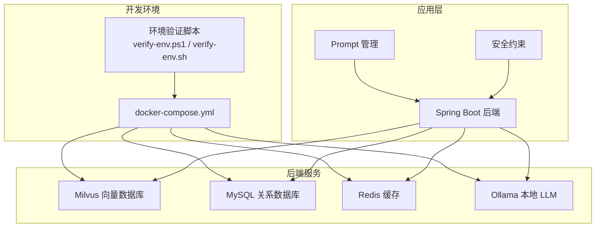
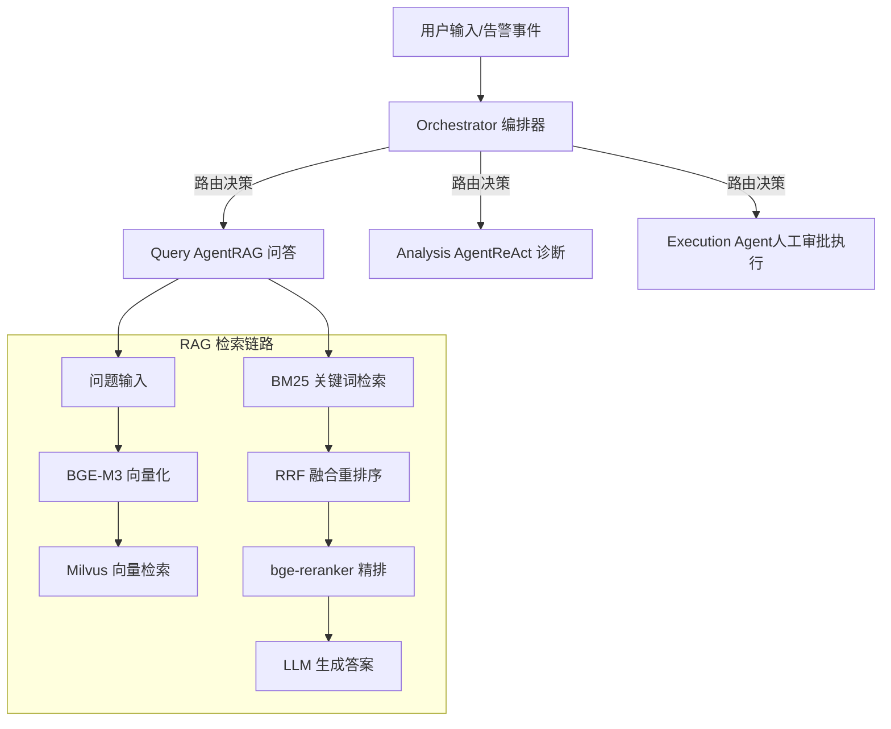
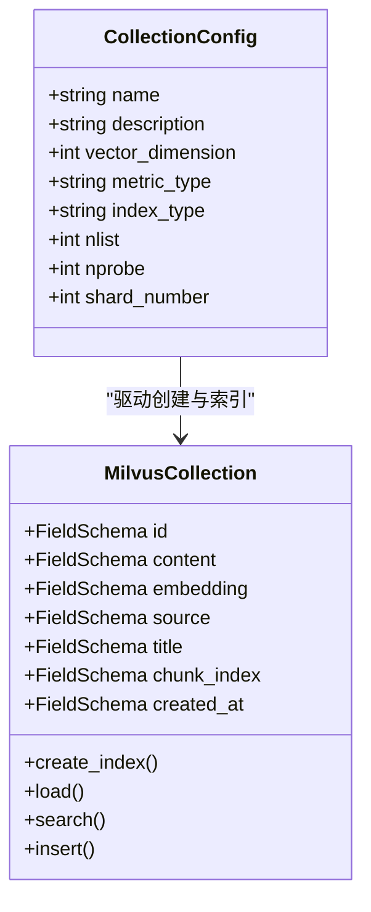
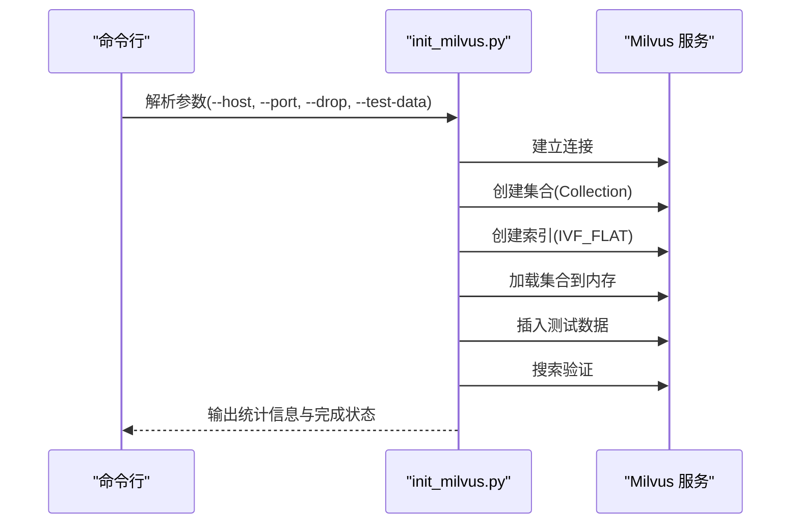
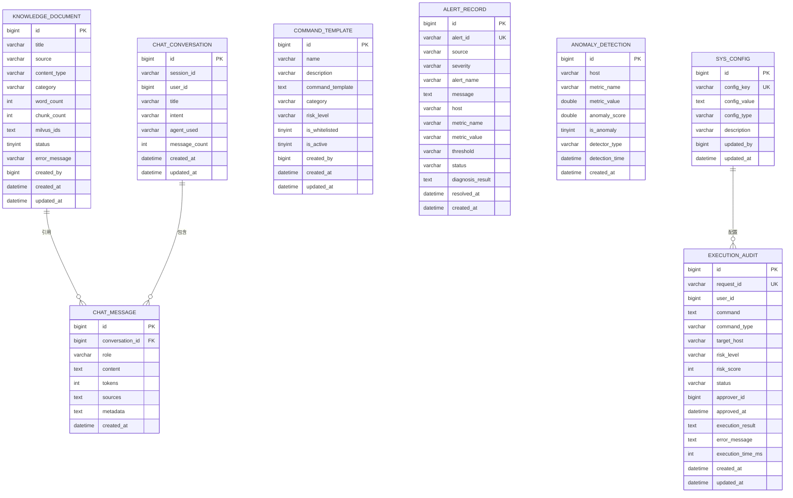
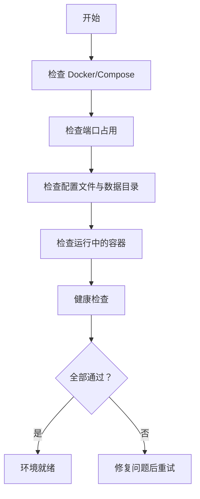
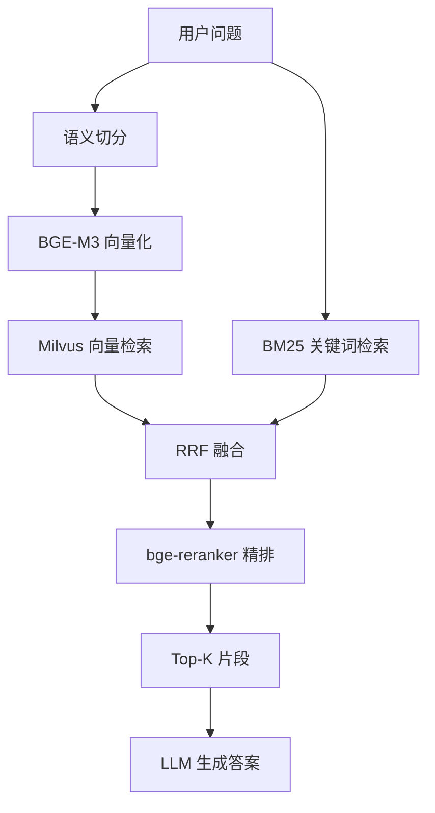
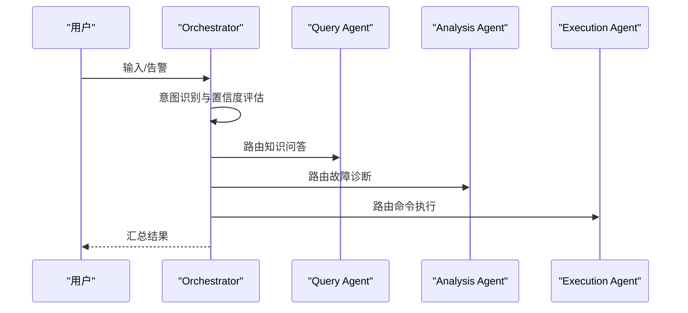
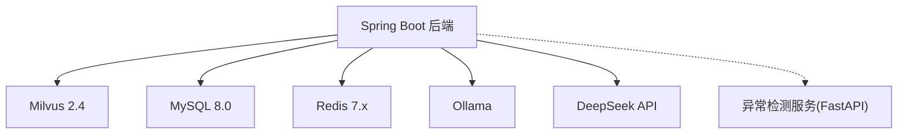

# RAG 知识库系统

<cite>
**本文档引用的文件**
- [milvus_collection.yaml](file://config/milvus_collection.yaml)
- [init_milvus.py](file://scripts/init_milvus.py)
- [init.sql](file://sql/init.sql)
- [docker-compose.yml](file://docker-compose.yml)
- [test_milvus_connection.py](file://tests/test_milvus_connection.py)
- [verify-env.ps1](file://scripts/verify-env.ps1)
- [verify-env.sh](file://scripts/verify-env.sh)
- [PROJECT_CONTEXT.md](file://PROJECT_CONTEXT.md)
- [orchestrator-system-prompt.md](file://docs/prompts/orchestrator-system-prompt.md)
- [shared-safety-constraints.md](file://docs/prompts/shared-safety-constraints.md)
- [文献知识库_完整版.md](file://文献/文献知识库_完整版.md)
</cite>

## 目录
1. [简介](#简介)
2. [项目结构](#项目结构)
3. [核心组件](#核心组件)
4. [架构总览](#架构总览)
5. [详细组件分析](#详细组件分析)
6. [依赖分析](#依赖分析)
7. [性能考虑](#性能考虑)
8. [故障排除指南](#故障排除指南)
9. [结论](#结论)
10. [附录](#附录)

## 简介
本项目围绕“面向 NetData 监控数据的智能运维问答与执行系统”，构建一套基于混合检索的 RAG 知识库系统。系统采用向量检索（Milvus + BGE-M3）与关键词检索（BM25）相结合的方式，并通过 RRF（Reciprocal Rank Fusion）融合与 bge-reranker-v2-m3 精排，最终将高质量候选注入 LLM Prompt 生成运维建议。后端以 Spring Boot 为核心，配合异常检测微服务、MySQL 元数据管理、Redis 缓存与 Milvus 向量数据库，形成完整的多 Agent 协同体系。

## 项目结构
项目采用多模块分层组织，核心目录如下：
- config：Milvus 集合配置与索引参数
- scripts：环境验证与 Milvus 初始化脚本
- sql：MySQL 初始化脚本（知识库元数据、对话历史、命令审计等）
- tests：Milvus 连接与健康检查测试
- docs/prompts：Agent 系统 Prompt 与安全约束
- docker-compose.yml：服务编排（Milvus、MySQL、Redis、Ollama、MinIO、Etcd）
- 文献：RAG 相关研究资料与知识库文档

**图表来源**
- [docker-compose.yml:1-357](file://docker-compose.yml#L1-L357)
- [verify-env.ps1:1-251](file://scripts/verify-env.ps1#L1-L251)
- [verify-env.sh:1-318](file://scripts/verify-env.sh#L1-L318)

**章节来源**
- [docker-compose.yml:1-357](file://docker-compose.yml#L1-L357)
- [PROJECT_CONTEXT.md:120-166](file://PROJECT_CONTEXT.md#L120-L166)

## 核心组件
- Milvus 向量数据库：存储文档向量与元数据，提供高效近似最近邻检索
- MySQL：存储知识库文档元数据、对话历史、命令执行审计等结构化数据
- Redis：会话缓存、检索结果缓存、分布式锁与实时告警去重
- Ollama：本地 LLM 推理（开发调试），生产环境使用 DeepSeek API
- RAG 核心：混合检索（向量+BM25）+ RRF 融合 + bge-reranker 精排 + LLM 生成

**章节来源**
- [PROJECT_CONTEXT.md:25-40](file://PROJECT_CONTEXT.md#L25-L40)
- [PROJECT_CONTEXT.md:64-82](file://PROJECT_CONTEXT.md#L64-L82)

## 架构总览
系统采用 Orchestrator-Subagent 模式，用户输入经编排器识别意图后路由至 Query/Analysis/Execution Agent，其中 Query Agent 走 RAG 流程，Analysis Agent 进行 ReAct 诊断，Execution Agent 生成命令并经人工审批后执行。

**图表来源**
- [PROJECT_CONTEXT.md:43-61](file://PROJECT_CONTEXT.md#L43-L61)
- [PROJECT_CONTEXT.md:64-82](file://PROJECT_CONTEXT.md#L64-L82)

## 详细组件分析

### Milvus 集合配置与初始化
- 集合结构：包含自增主键、内容片段、1024 维向量、来源、标题、片段索引、创建时间戳等字段
- 索引策略：采用 IVF_FLAT，nlist 控制倒排表簇数量，nprobe 控制搜索时扫描簇数
- 搜索参数：top_k 控制返回数量，output_fields 指定返回字段
- 动态字段：禁用以保证数据结构一致性
- 分区与 TTL：预留分区与 TTL 配置开关，便于后续扩展

**图表来源**
- [init_milvus.py:75-104](file://scripts/init_milvus.py#L75-L104)
- [init_milvus.py:133-242](file://scripts/init_milvus.py#L133-L242)
- [milvus_collection.yaml:22-140](file://config/milvus_collection.yaml#L22-L140)

**章节来源**
- [milvus_collection.yaml:22-186](file://config/milvus_collection.yaml#L22-L186)
- [init_milvus.py:133-294](file://scripts/init_milvus.py#L133-L294)

### 初始化脚本工作流
初始化脚本提供完整的 Milvus 集合生命周期管理：连接、创建集合、创建索引、加载到内存、插入测试数据、搜索验证、统计信息输出。

**图表来源**
- [init_milvus.py:457-516](file://scripts/init_milvus.py#L457-L516)

**章节来源**
- [init_milvus.py:457-516](file://scripts/init_milvus.py#L457-L516)

### MySQL 初始化与元数据表
MySQL 初始化脚本创建知识库文档表、对话历史表、消息表、命令执行审计表、命令模板表、告警记录表、异常检测结果表、系统配置表等，支撑 RAG 知识库的元数据管理与检索结果关联。

**图表来源**
- [init.sql:25-274](file://sql/init.sql#L25-L274)

**章节来源**
- [init.sql:25-274](file://sql/init.sql#L25-L274)

### 环境验证与健康检查
- 环境验证脚本（PowerShell/Bash）：检查 Docker、Compose、端口占用、配置文件、数据目录、容器健康状态
- Milvus 连接测试：验证 gRPC 连接、健康检查端点、列出集合
- Docker Compose：一键启动 Milvus（Standalone）、MySQL、Redis、Ollama、MinIO、Etcd

**图表来源**
- [verify-env.ps1:35-227](file://scripts/verify-env.ps1#L35-L227)
- [verify-env.sh:64-286](file://scripts/verify-env.sh#L64-L286)
- [test_milvus_connection.py:33-144](file://tests/test_milvus_connection.py#L33-L144)

**章节来源**
- [verify-env.ps1:35-227](file://scripts/verify-env.ps1#L35-L227)
- [verify-env.sh:64-286](file://scripts/verify-env.sh#L64-L286)
- [test_milvus_connection.py:33-144](file://tests/test_milvus_connection.py#L33-L144)

### RAG 检索与重排流程
- 文档预处理：语义切分（Semantic Chunking），避免固定长度带来的语义断裂
- 向量化：BGE-M3 生成 1024 维向量，Milvus 存储并建立 IVF_FLAT 索引
- 检索：向量检索（COSINE 相似度）与 BM25 关键词检索并行
- 融合：RRF（Reciprocal Rank Fusion）将不同来源排序融合
- 精排：bge-reranker-v2-m3 对候选进行细粒度重排序
- 生成：Top-K 片段注入 Prompt，交由 LLM 生成运维建议

**图表来源**
- [PROJECT_CONTEXT.md:64-82](file://PROJECT_CONTEXT.md#L64-L82)
- [文献知识库_完整版.md:2448-2526](file://文献/文献知识库_完整版.md#L2448-L2526)

**章节来源**
- [PROJECT_CONTEXT.md:64-82](file://PROJECT_CONTEXT.md#L64-L82)
- [文献知识库_完整版.md:2448-2526](file://文献/文献知识库_完整版.md#L2448-L2526)

### Agent 编排与安全约束
- Orchestrator：意图识别（知识问答/故障诊断/命令执行/混合意图），路由至子 Agent，汇总结果
- 安全约束：最小权限、防御优先、审计追溯；命令黑名单、审批流程、日志脱敏、输入校验

**图表来源**
- [orchestrator-system-prompt.md:16-137](file://docs/prompts/orchestrator-system-prompt.md#L16-L137)
- [shared-safety-constraints.md:29-293](file://docs/prompts/shared-safety-constraints.md#L29-L293)

**章节来源**
- [orchestrator-system-prompt.md:16-137](file://docs/prompts/orchestrator-system-prompt.md#L16-L137)
- [shared-safety-constraints.md:29-293](file://docs/prompts/shared-safety-constraints.md#L29-L293)

## 依赖分析
- 技术栈与版本：Spring Boot 3.3.x、Spring AI 1.0.x、Milvus 2.4、BGE-M3、DeepSeek API/Ollama、MySQL 8.0、Redis 7.x
- 组件耦合：后端通过 SDK 访问 Milvus/MySQL/Redis；异常检测服务独立部署并通过 REST 交互
- 外部依赖：Docker Compose 管理服务生命周期；Milvus 依赖 MinIO（对象存储）与 Etcd（KV）

**图表来源**
- [PROJECT_CONTEXT.md:25-40](file://PROJECT_CONTEXT.md#L25-L40)
- [docker-compose.yml:23-357](file://docker-compose.yml#L23-L357)

**章节来源**
- [PROJECT_CONTEXT.md:25-40](file://PROJECT_CONTEXT.md#L25-L40)
- [docker-compose.yml:23-357](file://docker-compose.yml#L23-L357)

## 性能考虑
- Milvus 索引与参数
  - nlist：倒排簇数量，建议根据数据规模选择（参考配置文件中的估算建议）
  - nprobe：搜索时扫描簇数，越高越准确但越慢，建议按 nlist 的 10%-20%
  - metric_type：COSINE 适合文本语义检索
  - index_type：IVF_FLAT 平衡精度与性能，适合中等规模数据
- 内存与容量
  - 每条记录约 4.5KB，100 万条约 4.5GB；索引约为原始数据的 10%-20%
  - Milvus Standalone 模式建议分配 4G 内存，开发环境适度限制
- 检索性能
  - 搜索前确保集合已加载到内存
  - 搜索参数与输出字段需与业务需求匹配，避免不必要的字段返回
- 缓存策略
  - Redis 缓存检索结果与会话，降低 Milvus 查询压力
  - 合理设置 TTL，避免缓存污染

**章节来源**
- [milvus_collection.yaml:164-185](file://config/milvus_collection.yaml#L164-L185)
- [docker-compose.yml:147-154](file://docker-compose.yml#L147-L154)
- [init_milvus.py:296-319](file://scripts/init_milvus.py#L296-L319)

## 故障排除指南
- Milvus 连接失败
  - 检查 gRPC 端口（19530）与健康检查端口（9091）是否可用
  - 使用连接测试脚本验证服务状态
- 容器健康异常
  - 查看 Milvus、MySQL、Redis、Ollama 的健康状态与日志
  - 确认 Docker 分配内存充足（建议至少 8GB）
- 端口冲突
  - 使用环境验证脚本检查端口占用，关闭占用进程或调整 .env 中端口
- 初始化失败
  - 确认 Milvus 已启动且可访问
  - 检查集合名称、维度与索引参数是否与配置一致

**章节来源**
- [test_milvus_connection.py:33-144](file://tests/test_milvus_connection.py#L33-L144)
- [verify-env.ps1:82-197](file://scripts/verify-env.ps1#L82-L197)
- [verify-env.sh:124-260](file://scripts/verify-env.sh#L124-L260)
- [docker-compose.yml:132-139](file://docker-compose.yml#L132-L139)

## 结论
本 RAG 知识库系统通过混合检索（向量+BM25）+ RRF 融合 + bge-reranker 精排，有效提升了运维问答的准确性与鲁棒性。结合 MySQL 元数据管理、Redis 缓存与严格的 Agent 安全约束，系统在开发与生产环境中均具备良好的可维护性与扩展性。建议在实际部署中根据数据规模调整 Milvus 参数，并持续优化检索与重排策略以提升用户体验。

## 附录
- 环境准备
  - 复制并编辑 .env 文件，设置数据库与服务密码
  - 使用环境验证脚本检查 Docker、端口与容器健康状态
  - 启动服务：docker-compose up -d
- Milvus 初始化
  - 安装 pymilvus，运行初始化脚本创建集合、索引并插入测试数据
  - 搜索验证通过后，可导入生产数据
- 数据导入与维护
  - 文档预处理采用语义切分，避免固定长度导致的语义断裂
  - 批量导入时注意分批与 flush，确保数据持久化
  - 定期清理与归档：利用 MySQL 记录文档状态与错误信息，便于追踪与修复

**章节来源**
- [verify-env.ps1:135-169](file://scripts/verify-env.ps1#L135-L169)
- [verify-env.sh:179-230](file://scripts/verify-env.sh#L179-L230)
- [init_milvus.py:457-516](file://scripts/init_milvus.py#L457-L516)
- [文献知识库_完整版.md:2448-2450](file://文献/文献知识库_完整版.md#L2448-L2450)