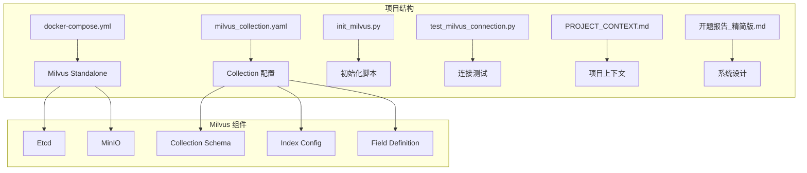
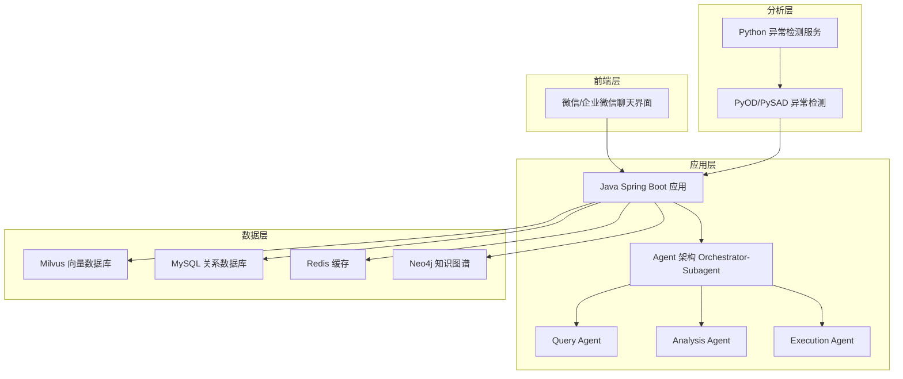
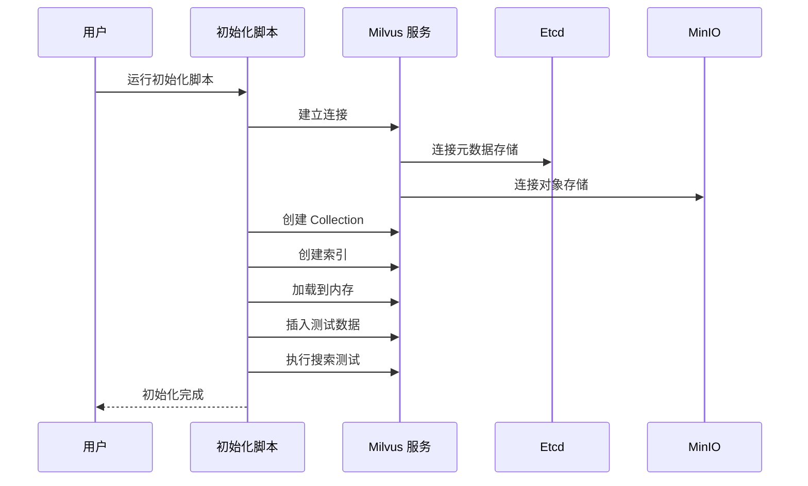
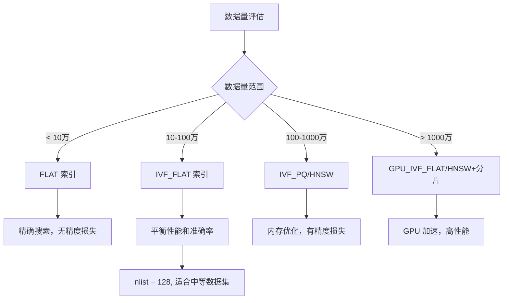
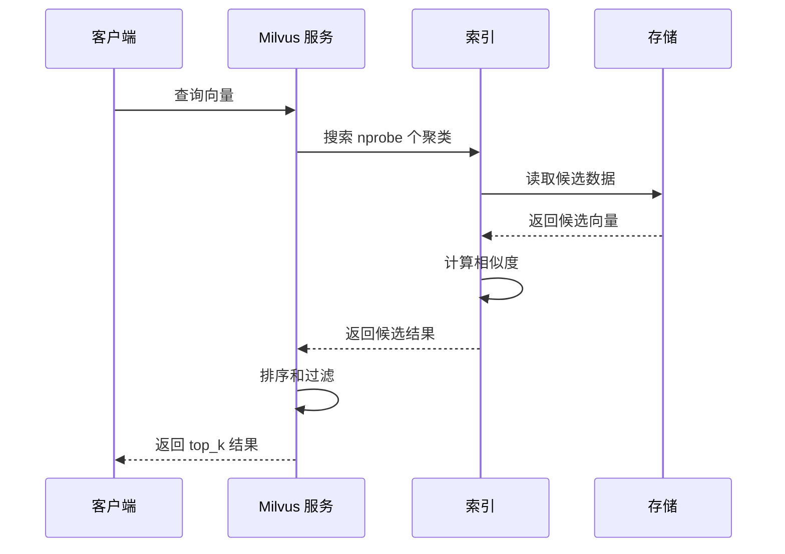
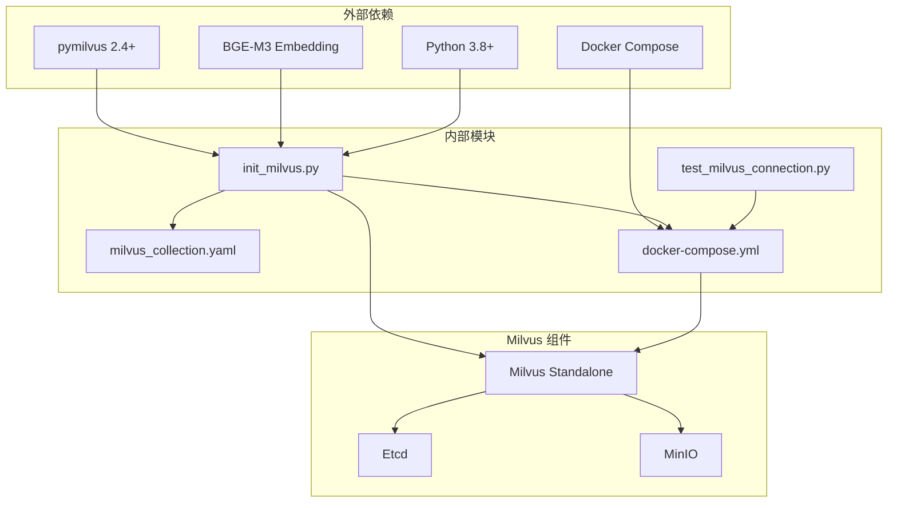
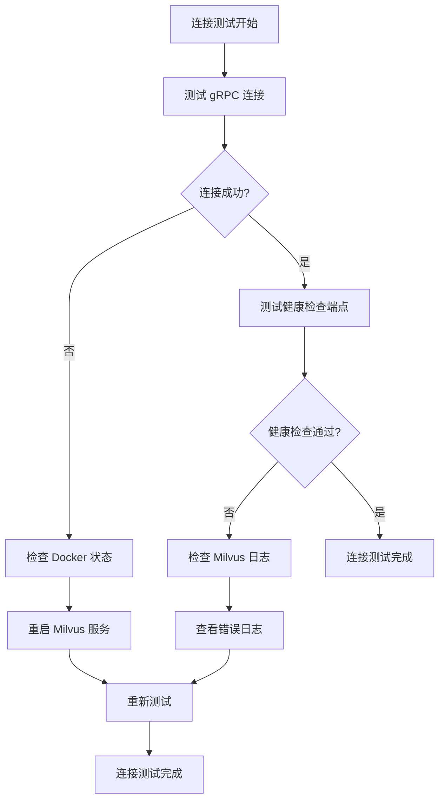

# 向量数据库设计

<cite>
**本文档引用的文件**
- [milvus_collection.yaml](file://config/milvus_collection.yaml)
- [init_milvus.py](file://scripts/init_milvus.py)
- [docker-compose.yml](file://docker-compose.yml)
- [test_milvus_connection.py](file://tests/test_milvus_connection.py)
- [PROJECT_CONTEXT.md](file://PROJECT_CONTEXT.md)
- [开题报告_精简版.md](file://开题报告_精简版.md)
</cite>

## 目录
1. [简介](#简介)
2. [项目结构](#项目结构)
3. [核心组件](#核心组件)
4. [架构概览](#架构概览)
5. [详细组件分析](#详细组件分析)
6. [依赖关系分析](#依赖关系分析)
7. [性能考虑](#性能考虑)
8. [故障排除指南](#故障排除指南)
9. [结论](#结论)

## 简介

本项目为面向 NetData 监控数据的智能运维问答与执行系统设计的向量数据库解决方案。该系统基于 Milvus 2.4 向量数据库，采用 BGE-M3 1024 维嵌入模型，构建智能运维知识库，支持自然语言问答、智能故障诊断和自动化命令执行。

系统采用混合检索 RAG（Retrieval Augmented Generation）架构，结合向量检索和关键词检索，通过 RRF（Reciprocal Rank Fusion）融合重排序和 bge-reranker-v2-m3 精排，实现高精度的运维知识检索。

## 项目结构

该项目采用模块化设计，包含以下核心组件：

**图表来源**
- [docker-compose.yml:1-357](file://docker-compose.yml#L1-L357)
- [milvus_collection.yaml:1-186](file://config/milvus_collection.yaml#L1-L186)

**章节来源**
- [docker-compose.yml:1-357](file://docker-compose.yml#L1-L357)
- [PROJECT_CONTEXT.md:120-166](file://PROJECT_CONTEXT.md#L120-L166)

## 核心组件

### Milvus Collection 配置

系统使用 YAML 配置文件定义 Milvus Collection 的完整结构，包括基础配置、向量配置、索引配置、搜索配置和字段定义。

### Collection 基础配置

- **名称**: `ops_knowledge_base` - 智能运维知识库向量集合
- **描述**: 智能运维知识库向量集合，存储运维文档的向量表示
- **分片数量**: 1 - 单机模式使用，分布式部署时可根据需要调整
- **动态字段**: 禁用 - 确保数据结构一致性

### 向量配置

- **维度**: 1024 - BGE-M3 模型固定输出维度
- **相似度度量**: COSINE - 余弦相似度，适合文本语义检索

### 索引配置

- **索引类型**: IVF_FLAT - 平衡性能和准确率
- **nlist 参数**: 128 - 聚类中心数量

### 搜索配置

- **nprobe**: 16 - 搜索的聚类数量
- **top_k**: 5 - 返回结果数量
- **输出字段**: content, source, title, chunk_index

**章节来源**
- [milvus_collection.yaml:22-101](file://config/milvus_collection.yaml#L22-L101)

## 架构概览

系统采用分层架构设计，结合 Python 异常检测和 Java 应用层，通过 Milvus 向量数据库实现智能运维知识检索。

**图表来源**
- [开题报告_精简版.md:118-152](file://开题报告_精简版.md#L118-L152)
- [PROJECT_CONTEXT.md:43-61](file://PROJECT_CONTEXT.md#L43-L61)

## 详细组件分析

### Collection 配置实现

系统通过 Python 脚本实现 Milvus Collection 的完整生命周期管理：

**图表来源**
- [init_milvus.py:457-516](file://scripts/init_milvus.py#L457-L516)

### 字段定义详解

系统定义了完整的字段结构，每种字段都有明确的作用和约束：

#### 主键字段 (id)
- **类型**: INT64
- **约束**: 主键，自增
- **作用**: 唯一标识每条记录
- **特点**: 自动生成，无需手动提供

#### 内容字段 (content)
- **类型**: VARCHAR
- **最大长度**: 8000 字符
- **作用**: 存储文档内容片段
- **特点**: 支持长文本内容

#### 向量字段 (embedding)
- **类型**: FLOAT_VECTOR
- **维度**: 1024
- **作用**: 存储 BGE-M3 生成的向量表示
- **重要性**: 创建后不可更改

#### 来源字段 (source)
- **类型**: VARCHAR
- **最大长度**: 512 字符
- **作用**: 记录文档来源（URL 或文件名）

#### 标题字段 (title)
- **类型**: VARCHAR
- **最大长度**: 256 字符
- **作用**: 存储文档标题

#### 片段索引字段 (chunk_index)
- **类型**: INT64
- **作用**: 标识同一文档的第几个片段

#### 创建时间字段 (created_at)
- **类型**: INT64
- **作用**: 存储记录创建的时间戳

**章节来源**
- [milvus_collection.yaml:105-139](file://config/milvus_collection.yaml#L105-L139)
- [init_milvus.py:170-220](file://scripts/init_milvus.py#L170-L220)

### 索引配置策略

系统采用 IVF_FLAT 索引类型，这是针对中等规模数据集的最佳选择：

**图表来源**
- [milvus_collection.yaml:54-69](file://config/milvus_collection.yaml#L54-L69)

#### 索引参数调优

- **nlist 参数**: 128 - 聚类中心数量
- **选择原则**: 数据量越大，nlist 应越大
- **建议范围**: sqrt(N) 到 N/100 之间

**章节来源**
- [milvus_collection.yaml:70-89](file://config/milvus_collection.yaml#L70-L89)
- [init_milvus.py:244-294](file://scripts/init_milvus.py#L244-L294)

### 搜索配置参数

系统提供了完整的搜索参数配置：

#### 搜索参数
- **nprobe**: 16 - 搜索的聚类数量
- **选择策略**: nlist 的 10%-20%
- **影响**: 越大越准确但越慢

#### 结果配置
- **top_k**: 5 - 返回前 5 个最相关的结果
- **输出字段**: content, source, title, chunk_index

#### 搜索流程

**图表来源**
- [init_milvus.py:380-433](file://scripts/init_milvus.py#L380-L433)

**章节来源**
- [milvus_collection.yaml:84-101](file://config/milvus_collection.yaml#L84-L101)
- [init_milvus.py:380-433](file://scripts/init_milvus.py#L380-L433)

## 依赖关系分析

系统各组件之间的依赖关系如下：

**图表来源**
- [init_milvus.py:40-54](file://scripts/init_milvus.py#L40-L54)
- [docker-compose.yml:102-149](file://docker-compose.yml#L102-L149)

**章节来源**
- [init_milvus.py:40-54](file://scripts/init_milvus.py#L40-L54)
- [docker-compose.yml:102-149](file://docker-compose.yml#L102-L149)

## 性能考虑

### 内存估算

系统提供了详细的内存使用估算：

- **每条记录大小**: 约 1024 × 4 字节 (向量) + 500 字节 (元数据) ≈ 4.5 KB
- **10万条记录**: 约 450 MB
- **100万条记录**: 约 4.5 GB

### 索引大小估算

- **IVF_FLAT 索引大小**: 约为原始数据大小的 10%-20%

### 参数调优建议

#### nlist 选择策略
- **10万数据**: nlist = 32-64
- **50万数据**: nlist = 64-128
- **100万数据**: nlist = 128-256
- **500万数据**: nlist = 256-512

#### nprobe 选择策略
- **高精度**: nprobe = nlist / 2
- **平衡**: nprobe = nlist / 8
- **高速**: nprobe = nlist / 16

### 硬件资源配置

系统在 Docker Compose 中配置了合理的硬件资源：

- **Milvus**: 4GB 内存上限，2GB 预留
- **Etcd**: 1GB 内存上限，512MB 预留
- **MinIO**: 1GB 内存上限，256MB 预留

**章节来源**
- [milvus_collection.yaml:167-184](file://config/milvus_collection.yaml#L167-L184)
- [docker-compose.yml:148-154](file://docker-compose.yml#L148-L154)

## 故障排除指南

### 连接问题排查

系统提供了完整的连接测试脚本：

**图表来源**
- [test_milvus_connection.py:118-148](file://tests/test_milvus_connection.py#L118-L148)

### 常见问题及解决方案

#### Milvus 启动失败
- **检查 etcd 连接**: 确保 etcd 服务正常运行
- **检查 MinIO 连接**: 确保对象存储可用
- **检查内存配置**: 确保 Docker 分配足够内存

#### Collection 创建失败
- **检查向量维度**: 确保与 Embedding 模型匹配
- **检查字段定义**: 确保字段类型和约束正确
- **检查索引参数**: 确保 nlist 值在合理范围内

#### 搜索性能问题
- **调整 nprobe 参数**: 根据准确率需求调整
- **优化 nlist 参数**: 根据数据量调整聚类中心数量
- **检查内存使用**: 确保有足够的内存加载 Collection

**章节来源**
- [test_milvus_connection.py:33-79](file://tests/test_milvus_connection.py#L33-L79)
- [init_milvus.py:106-131](file://scripts/init_milvus.py#L106-L131)

## 结论

本向量数据库设计方案为智能运维系统提供了坚实的技术基础。通过精心设计的 Collection 结构、合理的索引策略和完善的性能调优方案，系统能够有效支持运维知识库的构建和管理。

### 主要优势

1. **架构清晰**: 采用分层设计，各组件职责明确
2. **配置灵活**: 通过 YAML 文件实现配置管理
3. **性能优化**: 针对中等规模数据集优化索引参数
4. **易于维护**: 提供完整的初始化和测试脚本
5. **扩展性强**: 支持后续的功能扩展和性能优化

### 技术特色

- **BGE-M3 嵌入模型**: 1024 维向量表示，适合文本语义检索
- **IVF_FLAT 索引**: 平衡性能和准确率的最佳选择
- **混合检索架构**: 结合向量检索和关键词检索的优势
- **Docker 化部署**: 简化部署和运维复杂度

该设计方案为后续的 RAG 系统集成、Agent 架构实现和系统性能优化奠定了良好的技术基础，能够有效支撑智能运维问答与执行系统的开发和部署。