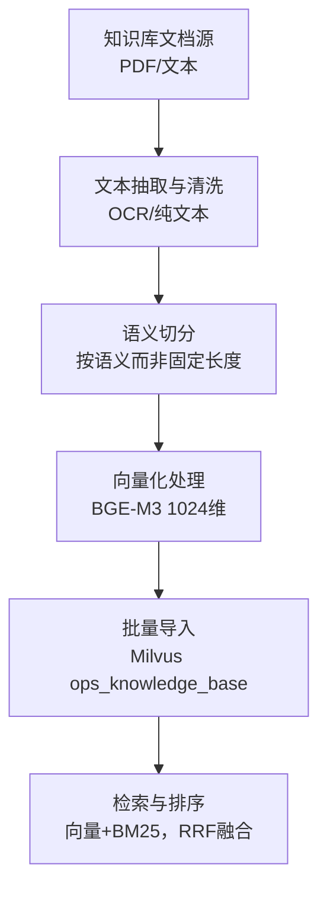
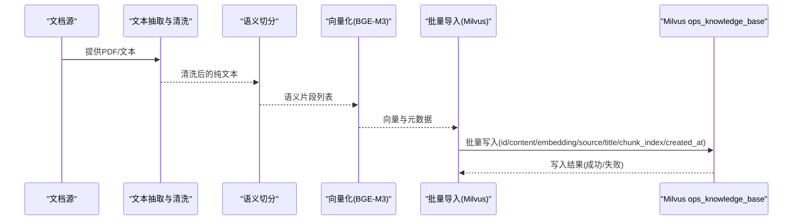
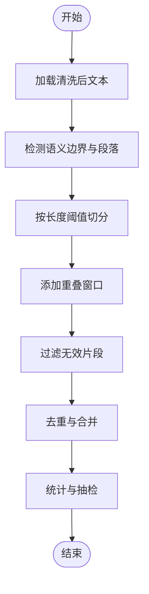
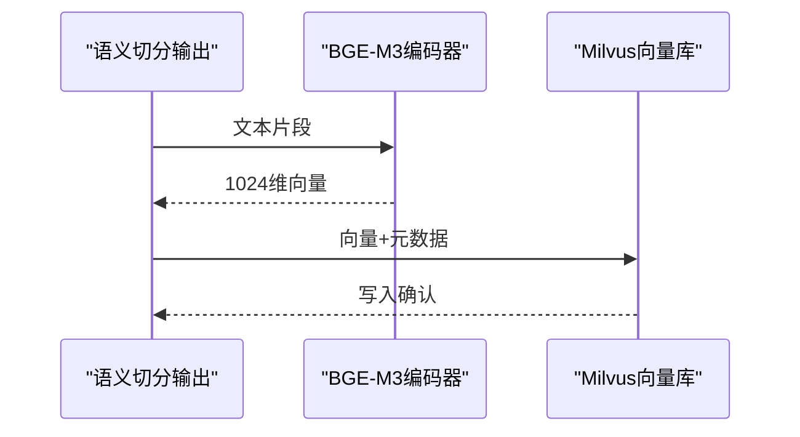
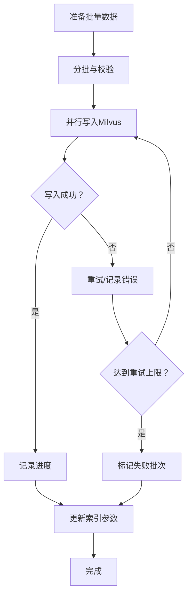
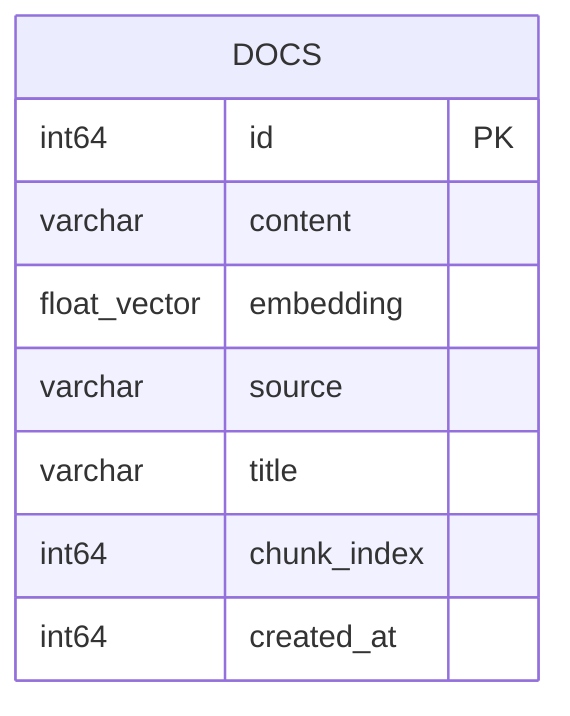

# 文档预处理流程

<cite>
**本文引用的文件**
- [PROJECT_CONTEXT.md](file://PROJECT_CONTEXT.md)
- [开题报告_精简版.md](file://开题报告_精简版.md)
- [文献知识库_完整版.md](file://文献/文献知识库_完整版.md)
- [文献综述汇编.md](file://文献/文献综述汇编.md)
- [milvus_collection.yaml](file://config/milvus_collection.yaml)
- [_paper_index.json](file://文献/_paper_index.json)
- [_paper_index_template.json](file://文献/_paper_index_template.json)
- [_pdf_metadata.json](file://文献/_pdf_metadata.json)
- [_extracted_text_content.json](file://文献/_extracted_text_content.json)
</cite>

## 目录
1. [引言](#引言)
2. [项目结构](#项目结构)
3. [核心组件](#核心组件)
4. [架构总览](#架构总览)
5. [详细组件分析](#详细组件分析)
6. [依赖关系分析](#依赖关系分析)
7. [性能考虑](#性能考虑)
8. [故障排查指南](#故障排查指南)
9. [结论](#结论)
10. [附录](#附录)

## 引言
本文件面向“文档预处理流程”的技术实现，聚焦知识库中文档的预处理算法与工程落地，覆盖以下主题：
- 语义切分算法：如何将长文档拆分为语义连贯的片段，以及切分长度与重叠策略的选择依据
- 向量化处理流程：BGE-M3 模型的使用、文本编码与向量生成机制
- 批量导入机制：数据格式转换、批量插入优化与错误处理策略
- 文档元数据处理：来源信息、标题提取、时间戳记录等
- 最佳实践：文本清洗、格式标准化与质量控制
- 性能优化与大规模数据处理策略

上述内容均基于仓库中的项目上下文、技术方案与配置文件进行归纳总结，并辅以可视化图示帮助理解。

## 项目结构
项目围绕“知识库构建与RAG检索”展开，文档预处理是RAG流水线的起点。知识库文档来源于文献收集与解析，预处理后进入Milvus向量数据库，供后续检索与排序使用。

**图表来源**
- [PROJECT_CONTEXT.md:64-82](file://PROJECT_CONTEXT.md#L64-L82)
- [milvus_collection.yaml:22-139](file://config/milvus_collection.yaml#L22-L139)

**章节来源**
- [PROJECT_CONTEXT.md:64-82](file://PROJECT_CONTEXT.md#L64-L82)
- [开题报告_精简版.md:118-152](file://开题报告_精简版.md#L118-L152)

## 核心组件
- 文档来源与元数据
  - 文档来源：PDF、网页、Markdown等
  - 元数据字段：标题、来源URL/文件名、页码、创建时间戳、语言等
- 文本抽取与清洗
  - 从PDF中抽取纯文本，去除噪声、空白行、页眉页脚
  - 统一编码与格式，确保后续切分稳定
- 语义切分
  - 基于语义而非固定长度，保证每个片段的完整性与可读性
  - 切分长度与重叠策略：平衡召回与检索效率
- 向量化处理
  - 使用BGE-M3模型生成1024维向量
  - 向量维度固定，影响后续索引与检索策略
- 批量导入
  - 将切分后的片段与向量批量写入Milvus
  - 错误处理：失败重试、断点续传、数据校验
- 元数据持久化
  - 记录source、title、chunk_index、created_at等字段

**章节来源**
- [PROJECT_CONTEXT.md:64-82](file://PROJECT_CONTEXT.md#L64-L82)
- [milvus_collection.yaml:105-139](file://config/milvus_collection.yaml#L105-L139)
- [文献知识库_完整版.md:1-623](file://文献/文献知识库_完整版.md#L1-L623)
- [文献综述汇编.md:1-800](file://文献/文献综述汇编.md#L1-L800)

## 架构总览
文档预处理的整体流程如下：

**图表来源**
- [PROJECT_CONTEXT.md:64-82](file://PROJECT_CONTEXT.md#L64-L82)
- [milvus_collection.yaml:105-139](file://config/milvus_collection.yaml#L105-L139)

## 详细组件分析

### 语义切分算法
- 目标：将长文档拆分为语义连贯的片段，避免跨主题断裂
- 策略：
  - 基于语义密度与句子边界检测，动态确定切分点
  - 控制每片段最大字符数，避免过长导致检索精度下降
  - 设置片段间重叠窗口，保留上下文连续性
- 参数选择依据：
  - 长度上限：兼顾检索速度与上下文完整性
  - 重叠比例：通常为10%-30%，平衡召回与冗余
- 质量控制：
  - 过短片段剔除（如少于阈值的标题/空行）
  - 重复与近似重复片段去重
  - 人工抽检与统计指标（平均长度、覆盖率）

**图表来源**
- [PROJECT_CONTEXT.md:80-81](file://PROJECT_CONTEXT.md#L80-L81)

**章节来源**
- [PROJECT_CONTEXT.md:80-81](file://PROJECT_CONTEXT.md#L80-L81)

### 向量化处理流程（BGE-M3）
- 模型选择：BGE-M3，输出1024维向量
- 维度约束：Collection创建后不可更改，需在前期确定
- 处理流程：
  - 输入：切分后的文本片段
  - 编码：模型将文本编码为向量
  - 归一化/存储：向量写入Milvus embedding字段
- 索引与检索：
  - metric_type：COSINE
  - index.type：IVF_FLAT（可按数据规模调整）
  - search.top_k：返回Top-K片段

**图表来源**
- [milvus_collection.yaml:41-49](file://config/milvus_collection.yaml#L41-L49)
- [milvus_collection.yaml:117-120](file://config/milvus_collection.yaml#L117-L120)

**章节来源**
- [PROJECT_CONTEXT.md:34](file://PROJECT_CONTEXT.md#L34)
- [milvus_collection.yaml:41-49](file://config/milvus_collection.yaml#L41-L49)
- [milvus_collection.yaml:117-120](file://config/milvus_collection.yaml#L117-L120)

### 批量导入机制
- 数据格式：
  - id：自增主键
  - content：片段文本
  - embedding：1024维向量
  - source：来源URL或文件名
  - title：文档标题
  - chunk_index：同一文档内的片段序号
  - created_at：时间戳
- 批量写入：
  - 使用批量API减少网络往返
  - 分批大小：根据内存与网络带宽动态调整
  - 写入顺序：先写入content与元数据，再写embedding
- 错误处理：
  - 单条失败重试与记录
  - 断点续传：记录已写入的最大chunk_index
  - 数据校验：长度、编码、维度一致性检查
- 性能优化：
  - 向量压缩/索引参数随数据规模动态调整
  - 并行写入与队列缓冲

**图表来源**
- [milvus_collection.yaml:105-139](file://config/milvus_collection.yaml#L105-L139)

**章节来源**
- [milvus_collection.yaml:105-139](file://config/milvus_collection.yaml#L105-L139)

### 文档元数据处理
- 来源信息：优先使用URL，否则回退到文件名
- 标题提取：优先使用PDF元数据中的title，其次使用文件名或首段标题
- 时间戳：created_at记录入库时间，便于增量更新与TTL策略
- 其他字段：source、title、chunk_index、created_at

**图表来源**
- [milvus_collection.yaml:105-139](file://config/milvus_collection.yaml#L105-L139)

**章节来源**
- [milvus_collection.yaml:105-139](file://config/milvus_collection.yaml#L105-L139)

### 文档预处理最佳实践
- 文本清洗
  - 去除多余空白、页眉页脚、水印
  - 统一编码（UTF-8），处理特殊字符
  - 段落规范化：合并小段、拆分超长段
- 格式标准化
  - 统一标题层级、编号样式
  - 保留关键结构（表格、列表、公式）的可读形式
- 质量控制
  - 人工抽检：随机抽样评估切分质量
  - 指标监控：平均长度、重复率、覆盖率
  - 回归测试：版本升级前后一致性对比

**章节来源**
- [PROJECT_CONTEXT.md:64-82](file://PROJECT_CONTEXT.md#L64-L82)

## 依赖关系分析
- 技术栈依赖
  - 向量数据库：Milvus（维度固定、索引类型、搜索参数）
  - 模型：BGE-M3（1024维，不可变更）
  - 检索：向量检索（COSINE）+ BM25（关键词检索）+ RRF融合
- 数据依赖
  - 文档源：PDF/文本
  - 元数据：标题、来源、页码、语言
  - 抽取内容：纯文本

**图表来源**
- [PROJECT_CONTEXT.md:64-82](file://PROJECT_CONTEXT.md#L64-L82)
- [milvus_collection.yaml:41-49](file://config/milvus_collection.yaml#L41-L49)

**章节来源**
- [PROJECT_CONTEXT.md:64-82](file://PROJECT_CONTEXT.md#L64-L82)
- [milvus_collection.yaml:41-49](file://config/milvus_collection.yaml#L41-L49)

## 性能考虑
- 向量维度与索引
  - 维度固定为1024，避免后续重建Collection
  - 根据数据规模选择索引类型与参数（nlist/nprobe）
- 批量写入
  - 分批大小与并发度：平衡吞吐与稳定性
  - 写入队列与背压控制：避免内存峰值
- 检索性能
  - top_k与nprobe权衡精度与速度
  - 输出字段最小化，减少网络与解析开销
- 存储与TTL
  - 可选TTL策略，定期清理过期文档
  - 分区策略：按来源/时间分区，提升查询效率

**章节来源**
- [milvus_collection.yaml:70-101](file://config/milvus_collection.yaml#L70-L101)
- [milvus_collection.yaml:157-185](file://config/milvus_collection.yaml#L157-L185)

## 故障排查指南
- 常见问题
  - 向量维度不匹配：检查BGE-M3输出维度与Collection定义一致
  - 写入失败：核对content长度、embedding维度、字段类型
  - 检索效果差：调整top_k、nprobe、metric_type或索引类型
- 排查步骤
  - 样本验证：对少量文档全流程跑通
  - 指标监控：长度分布、重复率、写入失败率
  - 日志与重试：记录失败原因，设置指数退避重试
- 参考配置
  - Collection字段与索引参数
  - 搜索输出字段与top_k

**章节来源**
- [milvus_collection.yaml:105-139](file://config/milvus_collection.yaml#L105-L139)
- [milvus_collection.yaml:84-101](file://config/milvus_collection.yaml#L84-L101)

## 结论
文档预处理是RAG系统的关键基石。通过“语义切分+向量化+BGE-M3+批量导入+元数据管理”，可构建高质量的知识库。结合Milvus的索引与检索策略，配合严格的性能与质量控制，能够支撑大规模运维知识库的构建与高效检索。

## 附录
- 文档来源与元数据样例
  - 索引文件：包含文件名、标题、路径、页数、摘要预览、引用标识
  - 模板文件：用于补充作者、年份、关键词、摘要要点、引用次数、文件大小、添加日期、笔记等
  - PDF元数据：页面数、标题、作者、主题、关键词、创建/生产者信息
  - 抽取文本：按文件组织的纯文本内容，供后续清洗与切分

**章节来源**
- [_paper_index.json:1-185](file://文献/_paper_index.json#L1-L185)
- [_paper_index_template.json:1-30](file://文献/_paper_index_template.json#L1-L30)
- [_pdf_metadata.json:1-196](file://文献/_pdf_metadata.json#L1-L196)
- [_extracted_text_content.json:1-102](file://文献/_extracted_text_content.json#L1-L102)