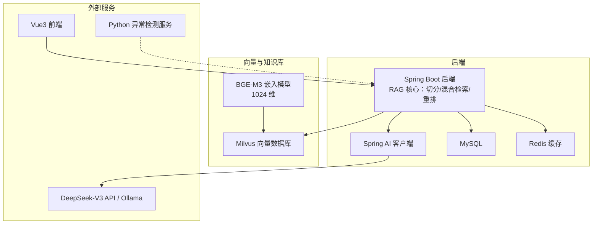
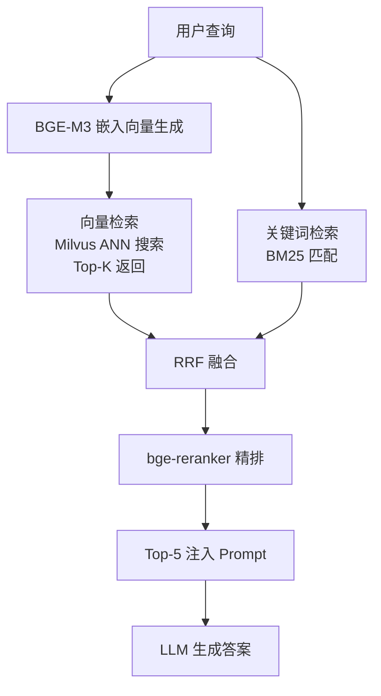
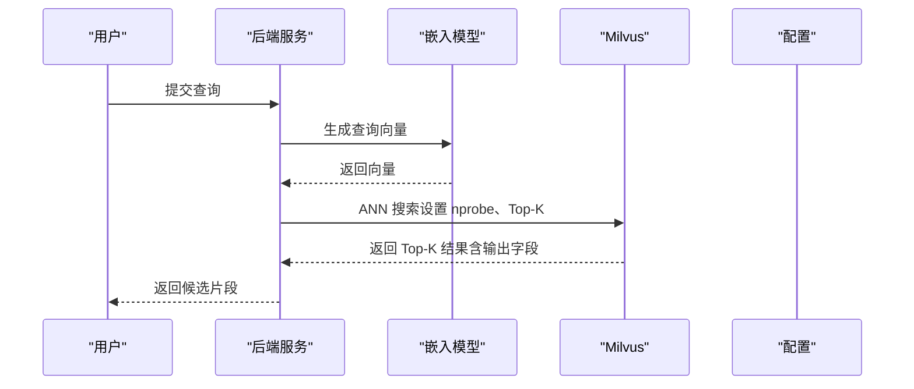
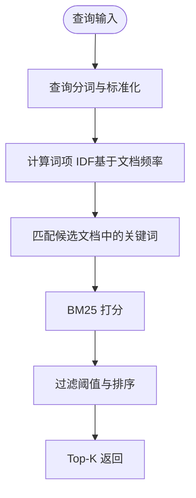
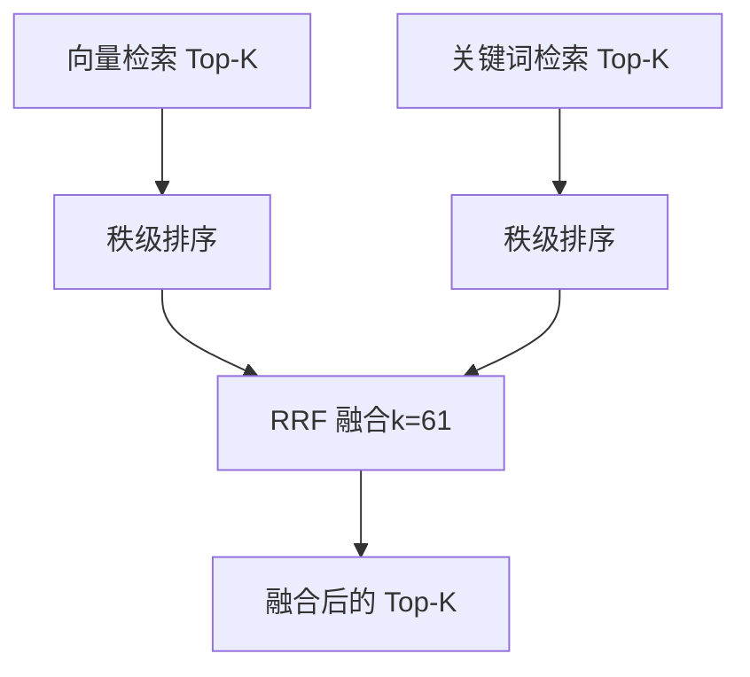
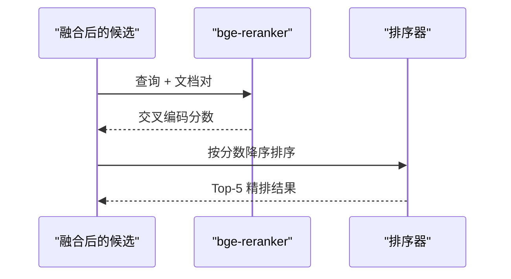
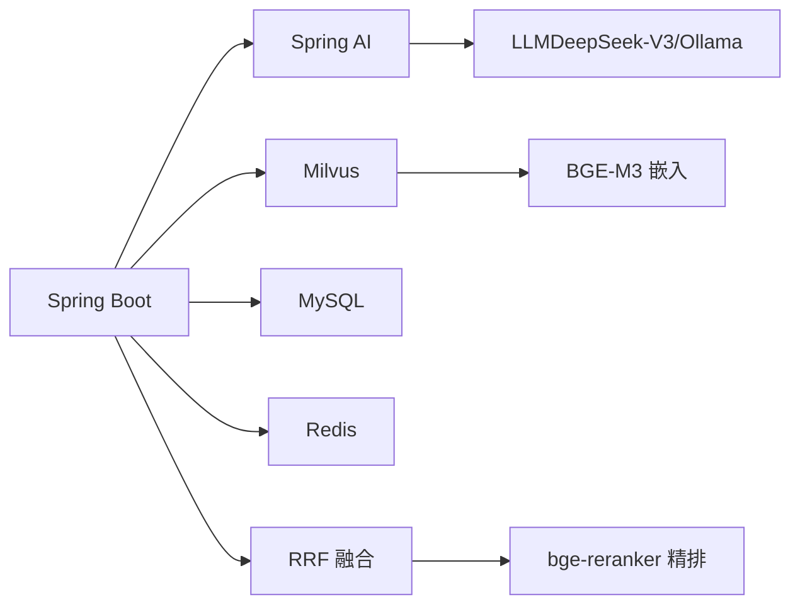

# 混合检索实现

<cite>
**本文引用的文件**
- [PROJECT_CONTEXT.md](file://PROJECT_CONTEXT.md)
- [docker-compose.yml](file://docker-compose.yml)
- [config/milvus_collection.yaml](file://config/milvus_collection.yaml)
- [scripts/init_milvus.py](file://scripts/init_milvus.py)
- [tests/test_milvus_connection.py](file://tests/test_milvus_connection.py)
- [文献/文献知识库_完整版.md](file://文献/文献知识库_完整版.md)
</cite>

## 目录
1. [简介](#简介)
2. [项目结构](#项目结构)
3. [核心组件](#核心组件)
4. [架构总览](#架构总览)
5. [详细组件分析](#详细组件分析)
6. [依赖分析](#依赖分析)
7. [性能考量](#性能考量)
8. [故障排查指南](#故障排查指南)
9. [结论](#结论)
10. [附录](#附录)

## 简介
本技术文档围绕“混合检索 RAG”方案展开，系统性阐述向量检索与关键词检索的融合实现，重点覆盖以下方面：
- 向量检索：嵌入向量相似度计算、Top-K 检索、结果过滤与输出字段控制
- 关键词检索（BM25）：词项权重、文档频率统计与查询匹配策略
- RRF（Reciprocal Rank Fusion）融合：秩级融合公式、参数调优与效果评估
- bge-reranker 精排：交叉编码、相似度重计算与排序优化
- 混合检索配置参数与调优策略：组件权重分配、融合参数设置与性能平衡
- 检索效果评估方法与优化建议

该方案以 Milvus 作为向量数据库，BGE-M3 作为固定维度的嵌入模型，结合 RRF 融合与 reranker 精排，形成“语义+关键词”的双通道检索与重排序流水线。

## 项目结构
项目采用多服务容器化部署，后端以 Spring Boot + Spring AI 为核心，向量数据库采用 Milvus，关系数据库为 MySQL，缓存为 Redis，异常检测服务为独立 Python 微服务，前端为 Vue3 应用。RAG 检索位于后端核心模块中，贯穿“文档切分 → 向量入库 → 混合检索 → RRF 融合 → reranker 精排 → LLM 生成答案”的完整链路。

图表来源
- [docker-compose.yml:1-357](file://docker-compose.yml#L1-L357)
- [PROJECT_CONTEXT.md:120-149](file://PROJECT_CONTEXT.md#L120-L149)

章节来源
- [PROJECT_CONTEXT.md:16-42](file://PROJECT_CONTEXT.md#L16-L42)
- [docker-compose.yml:23-357](file://docker-compose.yml#L23-L357)

## 核心组件
- 向量检索组件：基于 Milvus 的 ANN 搜索，使用余弦相似度度量，Top-K 返回，输出字段由配置控制
- 关键词检索组件：基于 BM25 的关键词匹配，结合文档频率统计与词项权重
- RRF 融合组件：对向量与关键词两条检索流的排序列表进行秩级融合，综合排序
- reranker 精排组件：使用 bge-reranker-v2-m3 对 Top-K 结果进行交叉编码重排
- RAG 流水线：将上述组件串联，形成“检索 → 融合 → 精排 → 生成”的闭环

章节来源
- [PROJECT_CONTEXT.md:64-82](file://PROJECT_CONTEXT.md#L64-L82)
- [文献/文献知识库_完整版.md:2524-2541](file://文献/文献知识库_完整版.md#L2524-L2541)

## 架构总览
混合检索的整体流程如下：

图表来源
- [PROJECT_CONTEXT.md:68-78](file://PROJECT_CONTEXT.md#L68-L78)
- [文献/文献知识库_完整版.md:2532-2541](file://文献/文献知识库_完整版.md#L2532-L2541)

## 详细组件分析

### 向量检索机制
- 相似度计算：采用余弦相似度（COSINE），适合文本语义检索
- Top-K 检索：通过 nprobe 控制搜索的聚类数量，平衡精度与性能
- 结果过滤：输出字段由配置控制，包含内容、来源、标题、片段索引等
- 索引类型：IVF_FLAT，nlist 控制聚类中心数量，兼顾精度与内存占用

图表来源
- [config/milvus_collection.yaml:84-101](file://config/milvus_collection.yaml#L84-L101)
- [config/milvus_collection.yaml:105-140](file://config/milvus_collection.yaml#L105-L140)
- [scripts/init_milvus.py:405-432](file://scripts/init_milvus.py#L405-L432)

章节来源
- [config/milvus_collection.yaml:45-49](file://config/milvus_collection.yaml#L45-L49)
- [config/milvus_collection.yaml:84-101](file://config/milvus_collection.yaml#L84-L101)
- [config/milvus_collection.yaml:105-140](file://config/milvus_collection.yaml#L105-L140)
- [scripts/init_milvus.py:244-294](file://scripts/init_milvus.py#L244-L294)
- [scripts/init_milvus.py:380-432](file://scripts/init_milvus.py#L380-L432)

### BM25 关键词检索
- 词项权重：基于词频、逆文档频率（IDF）与长度归约，提升关键词匹配的准确性
- 文档频率统计：用于计算 IDF，衡量词项的稀有程度
- 查询匹配策略：对查询词进行分词与标准化，匹配候选文档中的关键词并打分

图表来源
- [文献/文献知识库_完整版.md:2513-2527](file://文献/文献知识库_完整版.md#L2513-L2527)

章节来源
- [文献/文献知识库_完整版.md:2513-2527](file://文献/文献知识库_完整版.md#L2513-L2527)

### RRF 融合算法
- 秩级融合公式：对来自不同检索流的候选结果进行秩级重排，综合排序
- 参数调优：k 值（通常取 61）影响融合深度与召回稳定性
- 效果评估：通过对比融合前后命中率、平均倒数排名等指标评估融合收益

图表来源
- [文献/文献知识库_完整版.md:2524-2527](file://文献/文献知识库_完整版.md#L2524-L2527)

章节来源
- [文献/文献知识库_完整版.md:2524-2527](file://文献/文献知识库_完整版.md#L2524-L2527)

### bge-reranker 精排
- 交叉编码：对查询与候选文档进行联合编码，捕捉细粒度语义匹配
- 相似度重计算：基于交叉编码得到的分数进行重排
- 排序优化：优先保留与查询语义最相关的结果，减少噪声干扰

图表来源
- [文献/文献知识库_完整版.md:2532-2541](file://文献/文献知识库_完整版.md#L2532-L2541)

章节来源
- [文献/文献知识库_完整版.md:2532-2541](file://文献/文献知识库_完整版.md#L2532-L2541)

### 检索配置参数与调优策略
- 向量检索参数
  - metric_type：COSINE（余弦相似度）
  - index_type：IVF_FLAT，nlist：128（聚类中心数量）
  - nprobe：16（搜索聚类数量，影响精度与速度）
  - top_k：5（返回结果数量）
  - output_fields：content、source、title、chunk_index
- 融合参数
  - k：61（RRF 融合深度）
- 精排参数
  - Top-5 注入 Prompt，结合上下文与监控指标生成答案

章节来源
- [config/milvus_collection.yaml:45-49](file://config/milvus_collection.yaml#L45-L49)
- [config/milvus_collection.yaml:70-101](file://config/milvus_collection.yaml#L70-L101)
- [文献/文献知识库_完整版.md:2532-2541](file://文献/文献知识库_完整版.md#L2532-L2541)

## 依赖分析
- 后端依赖
  - Spring Boot 3.3.x：后端框架
  - Spring AI 1.0.x：统一的 LLM 客户端抽象
  - Milvus 2.4：向量数据库
  - MySQL 8.0：关系数据库
  - Redis 7.x：缓存与会话
  - Ollama / DeepSeek-V3 API：LLM 推理
- 检索链路依赖
  - BGE-M3 嵌入模型（1024 维）：固定维度，不可更改
  - RRF 融合与 bge-reranker 精排：提升检索质量与相关性

图表来源
- [PROJECT_CONTEXT.md:25-40](file://PROJECT_CONTEXT.md#L25-L40)
- [docker-compose.yml:23-357](file://docker-compose.yml#L23-L357)

章节来源
- [PROJECT_CONTEXT.md:25-40](file://PROJECT_CONTEXT.md#L25-L40)
- [docker-compose.yml:23-357](file://docker-compose.yml#L23-L357)

## 性能考量
- 向量检索性能
  - nlist 与 nprobe：nlist 越大，召回越稳定；nprobe 越大，精度越高但耗时增加
  - 索引类型：IVF_FLAT 在中等数据量下平衡精度与内存占用
- 融合与精排
  - RRF 的 k 值需根据召回稳定性与多样性权衡
  - reranker 的 Top-K 数量与 Prompt 注入长度共同影响响应时延
- 缓存与并发
  - Redis 缓存检索结果与会话，降低重复请求压力
  - 合理设置线程池与超时，避免下游服务阻塞

## 故障排查指南
- Milvus 连接与健康检查
  - 使用连接测试脚本验证 gRPC 连接与健康检查端点
  - 若健康检查失败，检查容器日志与端口映射
- 初始化与索引
  - 确认 Collection 配置与索引参数一致
  - 确保加载到内存后再进行搜索
- 检索结果异常
  - 调整 nprobe 与 top_k，观察精度与性能变化
  - 检查输出字段与数据类型是否匹配

章节来源
- [tests/test_milvus_connection.py:33-116](file://tests/test_milvus_connection.py#L33-L116)
- [scripts/init_milvus.py:457-516](file://scripts/init_milvus.py#L457-L516)

## 结论
混合检索通过“向量语义 + 关键词精确”的双通道互补，结合 RRF 融合与 reranker 精排，显著提升了检索的相关性与鲁棒性。在本项目中，Milvus 2.4 与 BGE-M3 的组合为中等规模知识库提供了高性价比的检索基础设施；通过合理的参数调优与缓存策略，可在保证响应速度的同时提升命中质量。

## 附录
- Docker Compose 服务清单与端口映射
  - Milvus standalone、etcd、minio
  - MySQL、Redis、Ollama
  - 端口：19530（Milvus gRPC）、9091（Milvus Metrics）、3306（MySQL）、6379（Redis）、11434（Ollama）

章节来源
- [docker-compose.yml:23-357](file://docker-compose.yml#L23-L357)