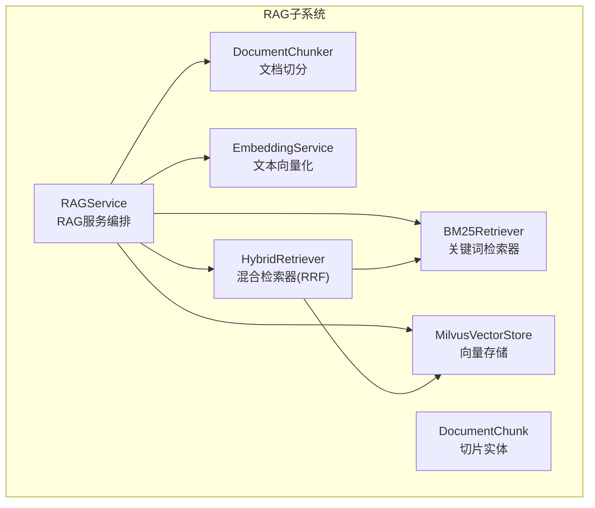
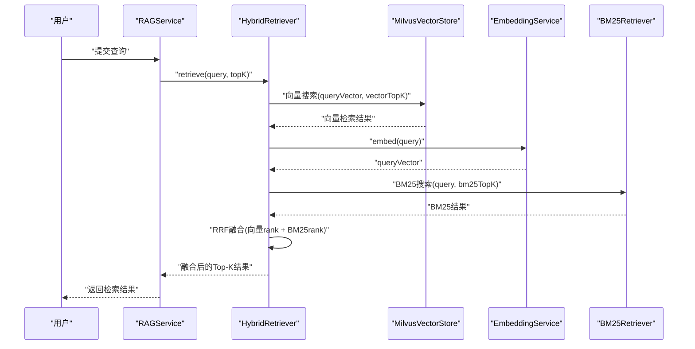
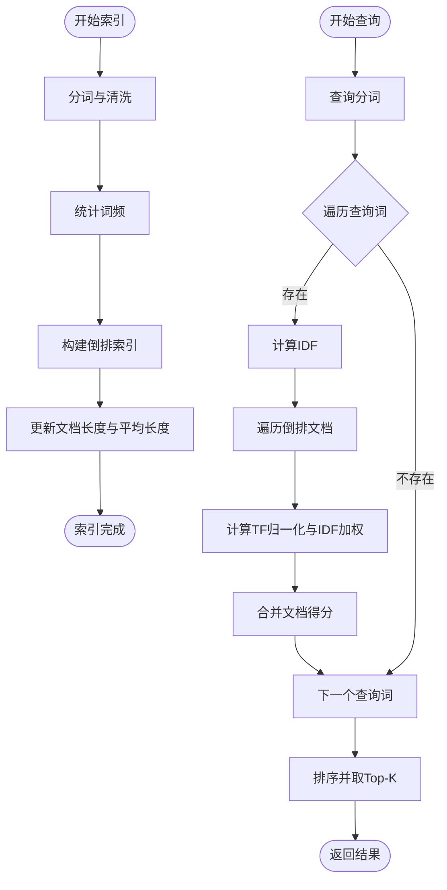
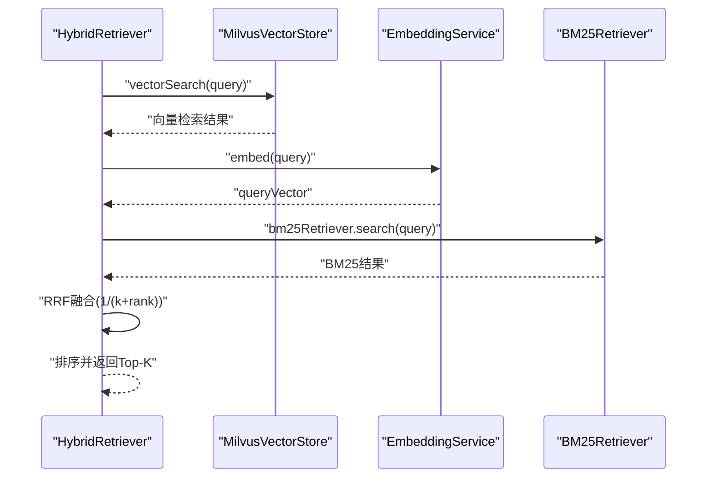
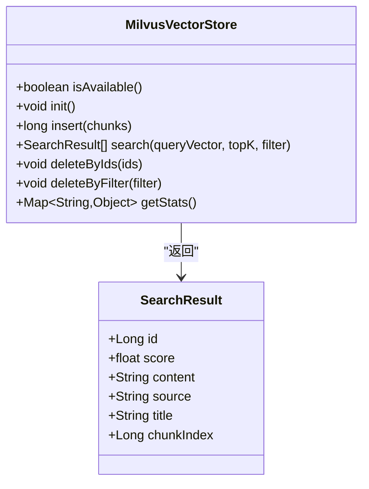
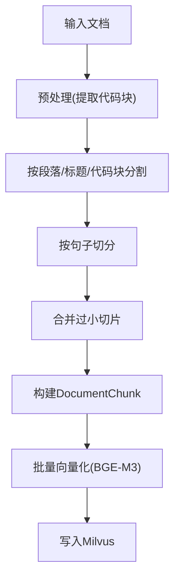
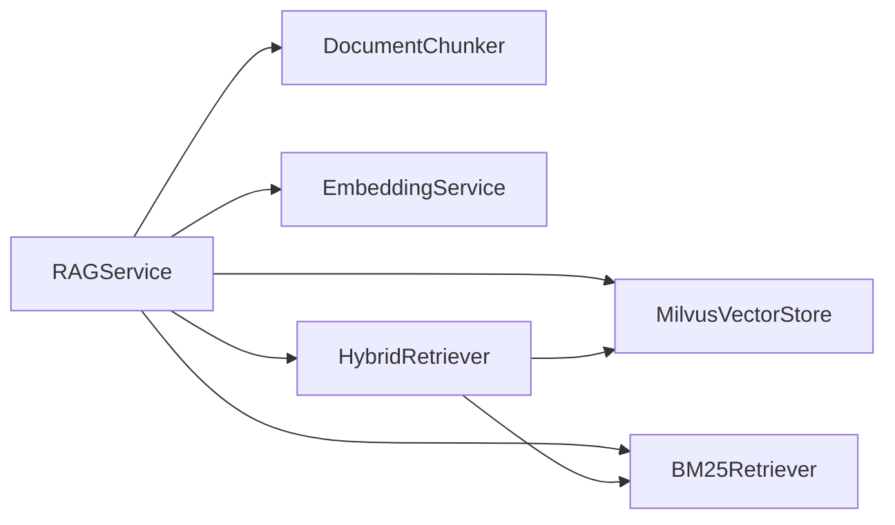

# BM25关键词检索

<cite>
**本文引用的文件**
- [BM25Retriever.java](file://netdata-ai-backend/src/main/java/com/netdata/ops/core/rag/BM25Retriever.java)
- [HybridRetriever.java](file://netdata-ai-backend/src/main/java/com/netdata/ops/core/rag/HybridRetriever.java)
- [MilvusVectorStore.java](file://netdata-ai-backend/src/main/java/com/netdata/ops/core/rag/MilvusVectorStore.java)
- [EmbeddingService.java](file://netdata-ai-backend/src/main/java/com/netdata/ops/core/rag/EmbeddingService.java)
- [DocumentChunk.java](file://netdata-ai-backend/src/main/java/com/netdata/ops/core/rag/DocumentChunk.java)
- [DocumentChunker.java](file://netdata-ai-backend/src/main/java/com/netdata/ops/core/rag/DocumentChunker.java)
- [RAGService.java](file://netdata-ai-backend/src/main/java/com/netdata/ops/core/rag/RAGService.java)
- [application.yml](file://netdata-ai-backend/src/main/resources/application.yml)
- [milvus_collection.yaml](file://config/milvus_collection.yaml)
</cite>

## 目录
1. [简介](#简介)
2. [项目结构](#项目结构)
3. [核心组件](#核心组件)
4. [架构总览](#架构总览)
5. [详细组件分析](#详细组件分析)
6. [依赖分析](#依赖分析)
7. [性能考量](#性能考量)
8. [故障排查指南](#故障排查指南)
9. [结论](#结论)
10. [附录](#附录)

## 简介
本技术文档围绕BM25关键词检索器展开，系统阐述其理论基础、实现原理与工程实践，覆盖以下要点：
- 理论基础：词频、逆文档频率（IDF）、文档长度归一化与BM25评分函数
- 实现细节：索引构建（文档预处理、词典与倒排索引）、查询评分与Top-K返回
- 检索策略：关键词精确匹配与向量检索互补，结合RRF融合策略
- 集成方式：与向量检索（Milvus + BGE-M3）协同，形成混合检索系统
- 参数调优：k1、b、Top-K、RRF平滑参数等关键参数的作用与调优建议
- 性能优化：分词策略、批量向量化、索引参数、缓存与降级策略
- 使用示例：查询流程、结果融合与上下文构建

## 项目结构
本项目采用模块化设计，BM25检索器位于RAG子系统中，与向量检索、文档切分、嵌入服务共同组成完整的检索增强生成（RAG）能力。

图表来源
- [RAGService.java:35-41](file://netdata-ai-backend/src/main/java/com/netdata/ops/core/rag/RAGService.java#L35-L41)
- [HybridRetriever.java:40-44](file://netdata-ai-backend/src/main/java/com/netdata/ops/core/rag/HybridRetriever.java#L40-L44)
- [MilvusVectorStore.java:40-60](file://netdata-ai-backend/src/main/java/com/netdata/ops/core/rag/MilvusVectorStore.java#L40-L60)
- [EmbeddingService.java:34-50](file://netdata-ai-backend/src/main/java/com/netdata/ops/core/rag/EmbeddingService.java#L34-L50)
- [DocumentChunker.java:30-56](file://netdata-ai-backend/src/main/java/com/netdata/ops/core/rag/DocumentChunker.java#L30-L56)
- [DocumentChunk.java:25-70](file://netdata-ai-backend/src/main/java/com/netdata/ops/core/rag/DocumentChunk.java#L25-L70)

章节来源
- [RAGService.java:35-41](file://netdata-ai-backend/src/main/java/com/netdata/ops/core/rag/RAGService.java#L35-L41)
- [application.yml:112-137](file://netdata-ai-backend/src/main/resources/application.yml#L112-L137)

## 核心组件
- BM25Retriever：基于词频与IDF的关键词检索器，维护倒排索引、文档长度统计与平均文档长度，提供批量索引与查询评分。
- HybridRetriever：混合检索器，整合向量检索与BM25检索，使用RRF（Reciprocal Rank Fusion）进行融合排序。
- MilvusVectorStore：向量数据库客户端，负责集合创建、向量插入、相似度搜索与删除。
- EmbeddingService：文本向量化服务，调用本地BGE-M3模型生成1024维向量。
- DocumentChunker：文档切分器，按语义切分生成切片，支持代码块、标题、表格、列表等类型识别。
- DocumentChunk：切片实体，承载内容、向量、元数据与类型信息。
- RAGService：RAG服务编排器，串联文档入库、检索与上下文构建。

章节来源
- [BM25Retriever.java:38-67](file://netdata-ai-backend/src/main/java/com/netdata/ops/core/rag/BM25Retriever.java#L38-L67)
- [HybridRetriever.java:40-56](file://netdata-ai-backend/src/main/java/com/netdata/ops/core/rag/HybridRetriever.java#L40-L56)
- [MilvusVectorStore.java:40-60](file://netdata-ai-backend/src/main/java/com/netdata/ops/core/rag/MilvusVectorStore.java#L40-L60)
- [EmbeddingService.java:34-50](file://netdata-ai-backend/src/main/java/com/netdata/ops/core/rag/EmbeddingService.java#L34-L50)
- [DocumentChunker.java:30-56](file://netdata-ai-backend/src/main/java/com/netdata/ops/core/rag/DocumentChunker.java#L30-L56)
- [DocumentChunk.java:25-70](file://netdata-ai-backend/src/main/java/com/netdata/ops/core/rag/DocumentChunk.java#L25-L70)
- [RAGService.java:35-41](file://netdata-ai-backend/src/main/java/com/netdata/ops/core/rag/RAGService.java#L35-L41)

## 架构总览
BM25与向量检索在RAG流程中协同工作：BM25负责关键词精确匹配，向量检索负责语义相似度，混合检索通过RRF融合两者排名，最终输出Top-K结果供LLM生成使用。

图表来源
- [RAGService.java:116-130](file://netdata-ai-backend/src/main/java/com/netdata/ops/core/rag/RAGService.java#L116-L130)
- [HybridRetriever.java:64-100](file://netdata-ai-backend/src/main/java/com/netdata/ops/core/rag/HybridRetriever.java#L64-L100)
- [EmbeddingService.java:72-93](file://netdata-ai-backend/src/main/java/com/netdata/ops/core/rag/EmbeddingService.java#L72-L93)
- [MilvusVectorStore.java:274-324](file://netdata-ai-backend/src/main/java/com/netdata/ops/core/rag/MilvusVectorStore.java#L274-L324)
- [BM25Retriever.java:132-178](file://netdata-ai-backend/src/main/java/com/netdata/ops/core/rag/BM25Retriever.java#L132-L178)

## 详细组件分析

### BM25关键词检索器（BM25Retriever）
- 索引构建
  - 文档预处理：分词（按空格与标点分割，转小写，过滤单字），统计词频，构建倒排索引；同时记录文档长度、更新平均文档长度。
  - 倒排索引结构：词 -> 文档 Posting（docId, tf），便于快速定位包含某词的文档集合。
- 查询评分
  - 对查询词逐词检索倒排索引，计算IDF与TF归一化因子，累加得到文档得分。
  - TF归一化：考虑词频饱和与文档长度归一化，缓解长文档偏置。
  - 返回Top-K结果，按分数降序排列。
- 关键参数
  - k1：词频饱和参数，默认1.5；k1越大，词频对分数影响越平滑。
  - b：文档长度归一化参数，默认0.75；b越大，长度归一化越强。
  - topK：默认20，可通过配置调整。
- 分词策略
  - 简化实现：按非字母数字与中文字符分割，过滤长度≤1的token；生产环境建议使用专业分词器（如IK、Jieba）。
- 统计与清空
  - 提供索引统计（文档总数、词典大小、平均文档长度）与清空接口，便于调试与重建。

图表来源
- [BM25Retriever.java:84-124](file://netdata-ai-backend/src/main/java/com/netdata/ops/core/rag/BM25Retriever.java#L84-L124)
- [BM25Retriever.java:132-178](file://netdata-ai-backend/src/main/java/com/netdata/ops/core/rag/BM25Retriever.java#L132-L178)
- [BM25Retriever.java:188-190](file://netdata-ai-backend/src/main/java/com/netdata/ops/core/rag/BM25Retriever.java#L188-L190)
- [BM25Retriever.java:201-212](file://netdata-ai-backend/src/main/java/com/netdata/ops/core/rag/BM25Retriever.java#L201-L212)

章节来源
- [BM25Retriever.java:38-67](file://netdata-ai-backend/src/main/java/com/netdata/ops/core/rag/BM25Retriever.java#L38-L67)
- [BM25Retriever.java:84-124](file://netdata-ai-backend/src/main/java/com/netdata/ops/core/rag/BM25Retriever.java#L84-L124)
- [BM25Retriever.java:132-178](file://netdata-ai-backend/src/main/java/com/netdata/ops/core/rag/BM25Retriever.java#L132-L178)
- [BM25Retriever.java:188-190](file://netdata-ai-backend/src/main/java/com/netdata/ops/core/rag/BM25Retriever.java#L188-L190)
- [BM25Retriever.java:201-212](file://netdata-ai-backend/src/main/java/com/netdata/ops/core/rag/BM25Retriever.java#L201-L212)
- [BM25Retriever.java:239-245](file://netdata-ai-backend/src/main/java/com/netdata/ops/core/rag/BM25Retriever.java#L239-L245)

### 混合检索器（HybridRetriever）
- 功能概述
  - 整合向量检索与BM25检索，使用RRF（Reciprocal Rank Fusion）融合，无需调参且鲁棒性好。
- RRF融合
  - 公式：对每个文档d，RRF_score(d) = Σ (1 / (k + rank_i(d)))，其中k为平滑参数（默认60）。
  - 融合后按RRF分数降序排序，返回最终Top-K。
- 配置参数
  - vectorTopK、bm25TopK、finalTopK、rrfK，均可通过配置文件调整。
- 结果封装
  - 提供统一的检索结果对象，包含向量分数、BM25分数、RRF分数与最终上下文字段。

图表来源
- [HybridRetriever.java:64-100](file://netdata-ai-backend/src/main/java/com/netdata/ops/core/rag/HybridRetriever.java#L64-L100)
- [HybridRetriever.java:134-193](file://netdata-ai-backend/src/main/java/com/netdata/ops/core/rag/HybridRetriever.java#L134-L193)

章节来源
- [HybridRetriever.java:40-56](file://netdata-ai-backend/src/main/java/com/netdata/ops/core/rag/HybridRetriever.java#L40-L56)
- [HybridRetriever.java:64-100](file://netdata-ai-backend/src/main/java/com/netdata/ops/core/rag/HybridRetriever.java#L64-L100)
- [HybridRetriever.java:134-193](file://netdata-ai-backend/src/main/java/com/netdata/ops/core/rag/HybridRetriever.java#L134-L193)

### 向量检索与Milvus集成
- 向量维度与度量
  - 使用BGE-M3模型，输出1024维向量；Milvus集合使用COSINE度量，索引类型为IVF_FLAT。
- 集合与索引
  - 集合字段包含content、embedding、source、title、chunk_index等；索引参数nlist可根据数据规模调整。
- 搜索与插入
  - 支持带过滤条件的搜索与删除；插入时将切片内容与向量打包写入。
- 可用性与降级
  - Milvus连接失败时，系统可降级为无向量检索模式，保证RAG流程继续运行。

图表来源
- [MilvusVectorStore.java:40-60](file://netdata-ai-backend/src/main/java/com/netdata/ops/core/rag/MilvusVectorStore.java#L40-L60)
- [MilvusVectorStore.java:274-324](file://netdata-ai-backend/src/main/java/com/netdata/ops/core/rag/MilvusVectorStore.java#L274-L324)
- [MilvusVectorStore.java:394-405](file://netdata-ai-backend/src/main/java/com/netdata/ops/core/rag/MilvusVectorStore.java#L394-L405)

章节来源
- [MilvusVectorStore.java:107-209](file://netdata-ai-backend/src/main/java/com/netdata/ops/core/rag/MilvusVectorStore.java#L107-L209)
- [MilvusVectorStore.java:274-324](file://netdata-ai-backend/src/main/java/com/netdata/ops/core/rag/MilvusVectorStore.java#L274-L324)
- [milvus_collection.yaml:40-80](file://config/milvus_collection.yaml#L40-L80)

### 文档切分与向量化（DocumentChunker & EmbeddingService）
- 文档切分
  - 优先按段落/标题/代码块边界切分，再按句子进一步切分，最后合并过小切片，确保语义完整性。
- 向量化
  - 使用BGE-M3模型生成1024维向量，支持批量处理与超时控制；提供余弦相似度计算工具。
- 切片实体
  - DocumentChunk包含content、embedding、metadata、chunkType等字段，校验向量维度与内容有效性。

图表来源
- [DocumentChunker.java:81-104](file://netdata-ai-backend/src/main/java/com/netdata/ops/core/rag/DocumentChunker.java#L81-L104)
- [DocumentChunker.java:112-147](file://netdata-ai-backend/src/main/java/com/netdata/ops/core/rag/DocumentChunker.java#L112-L147)
- [DocumentChunker.java:152-197](file://netdata-ai-backend/src/main/java/com/netdata/ops/core/rag/DocumentChunker.java#L152-L197)
- [EmbeddingService.java:101-133](file://netdata-ai-backend/src/main/java/com/netdata/ops/core/rag/EmbeddingService.java#L101-L133)
- [DocumentChunk.java:107-118](file://netdata-ai-backend/src/main/java/com/netdata/ops/core/rag/DocumentChunk.java#L107-L118)

章节来源
- [DocumentChunker.java:30-56](file://netdata-ai-backend/src/main/java/com/netdata/ops/core/rag/DocumentChunker.java#L30-L56)
- [DocumentChunker.java:81-104](file://netdata-ai-backend/src/main/java/com/netdata/ops/core/rag/DocumentChunker.java#L81-L104)
- [EmbeddingService.java:72-93](file://netdata-ai-backend/src/main/java/com/netdata/ops/core/rag/EmbeddingService.java#L72-L93)
- [EmbeddingService.java:101-133](file://netdata-ai-backend/src/main/java/com/netdata/ops/core/rag/EmbeddingService.java#L101-L133)
- [DocumentChunk.java:107-118](file://netdata-ai-backend/src/main/java/com/netdata/ops/core/rag/DocumentChunk.java#L107-L118)

### RAG服务编排（RAGService）
- 文档入库
  - 切分 -> 向量化 -> Milvus存储 -> 更新BM25索引（使用source#chunkIndex作为docId）。
- 知识检索
  - 直接委托给HybridRetriever，返回融合后的Top-K结果。
- 上下文构建
  - 将检索结果格式化为Prompt上下文，便于注入给LLM。
- 统计与删除
  - 提供知识库统计（向量存储与BM25索引状态），删除文档时从Milvus删除并提示BM25需重建索引。

章节来源
- [RAGService.java:57-91](file://netdata-ai-backend/src/main/java/com/netdata/ops/core/rag/RAGService.java#L57-L91)
- [RAGService.java:116-130](file://netdata-ai-backend/src/main/java/com/netdata/ops/core/rag/RAGService.java#L116-L130)
- [RAGService.java:140-157](file://netdata-ai-backend/src/main/java/com/netdata/ops/core/rag/RAGService.java#L140-L157)
- [RAGService.java:182-190](file://netdata-ai-backend/src/main/java/com/netdata/ops/core/rag/RAGService.java#L182-L190)

## 依赖分析
- 组件耦合
  - RAGService聚合各子组件，承担编排职责；HybridRetriever依赖向量存储与BM25检索器。
  - BM25Retriever独立维护倒排索引，不依赖向量存储。
- 外部依赖
  - Milvus：向量存储与检索
  - BGE-M3：文本向量化服务
  - Spring配置：RAG与Milvus参数通过application.yml注入

图表来源
- [RAGService.java:35-41](file://netdata-ai-backend/src/main/java/com/netdata/ops/core/rag/RAGService.java#L35-L41)
- [HybridRetriever.java:40-44](file://netdata-ai-backend/src/main/java/com/netdata/ops/core/rag/HybridRetriever.java#L40-L44)

章节来源
- [RAGService.java:35-41](file://netdata-ai-backend/src/main/java/com/netdata/ops/core/rag/RAGService.java#L35-L41)
- [HybridRetriever.java:40-44](file://netdata-ai-backend/src/main/java/com/netdata/ops/core/rag/HybridRetriever.java#L40-L44)

## 性能考量
- 分词与预处理
  - 简化分词适用于快速原型；生产环境建议引入专业分词器，提升召回质量与稳定性。
- 向量检索
  - 索引参数nlist与nprobe需根据数据规模与延迟目标调优；COSINE度量适合文本语义检索。
  - 批量向量化时注意批次大小与超时设置，避免内存压力与请求超时。
- BM25评分
  - k1与b控制词频饱和与长度归一化强度；topK影响召回与排序稳定性。
- RRF融合
  - rrfK平滑参数默认60，通常无需调整；融合后排序开销低，适合在线检索。
- 缓存与降级
  - Milvus连接失败时降级为无向量检索模式，BM25仍可提供关键词检索能力。

章节来源
- [application.yml:112-137](file://netdata-ai-backend/src/main/resources/application.yml#L112-L137)
- [milvus_collection.yaml:70-90](file://config/milvus_collection.yaml#L70-L90)
- [EmbeddingService.java:101-133](file://netdata-ai-backend/src/main/java/com/netdata/ops/core/rag/EmbeddingService.java#L101-L133)
- [BM25Retriever.java:43-45](file://netdata-ai-backend/src/main/java/com/netdata/ops/core/rag/BM25Retriever.java#L43-L45)

## 故障排查指南
- Milvus不可用
  - 现象：向量检索返回空结果，日志提示连接失败。
  - 处理：检查Milvus服务状态与网络连通性；确认集合存在与索引加载；系统将自动降级为无向量检索模式。
- Embedding服务异常
  - 现象：向量化请求超时或返回空结果。
  - 处理：检查BGE-M3服务地址、端口与模型状态；适当增大超时与批次大小。
- BM25索引为空
  - 现象：BM25检索无结果。
  - 处理：确认文档入库流程已完成BM25索引更新；若删除文档需重建索引。
- 检索结果质量不佳
  - 现象：召回不足或排序不合理。
  - 处理：调整BM25参数（k1、b、topK）、RRF参数（rrfK）、向量Top-K；优化分词与切分策略。

章节来源
- [MilvusVectorStore.java:80-103](file://netdata-ai-backend/src/main/java/com/netdata/ops/core/rag/MilvusVectorStore.java#L80-L103)
- [EmbeddingService.java:72-93](file://netdata-ai-backend/src/main/java/com/netdata/ops/core/rag/EmbeddingService.java#L72-L93)
- [RAGService.java:182-190](file://netdata-ai-backend/src/main/java/com/netdata/ops/core/rag/RAGService.java#L182-L190)

## 结论
BM25关键词检索器与向量检索在RAG系统中形成互补：BM25擅长精确关键词匹配，向量检索擅长语义近似匹配；通过HybridRetriever与RRF融合，系统在准确性与鲁棒性上取得良好平衡。结合合理的参数调优与工程化实践，可在大规模知识库场景下稳定提供高质量检索服务。

## 附录

### BM25评分函数与参数说明
- 公式
  - score(D, Q) = Σ IDF(qi) * [tf(qi,D) * (k1 + 1)] / [tf(qi,D) + k1 * (1 - b + b * |D|/avgdl)]
  - IDF(q) = log[(N - n(q) + 0.5)/(n(q) + 0.5) + 1]
- 参数
  - k1：词频饱和参数（默认1.5）
  - b：文档长度归一化参数（默认0.75）
  - topK：返回数量（默认20）

章节来源
- [BM25Retriever.java:20-31](file://netdata-ai-backend/src/main/java/com/netdata/ops/core/rag/BM25Retriever.java#L20-L31)
- [BM25Retriever.java:188-190](file://netdata-ai-backend/src/main/java/com/netdata/ops/core/rag/BM25Retriever.java#L188-L190)

### 查询示例与调用流程
- 入库流程
  - DocumentChunker切分 -> EmbeddingService批量向量化 -> MilvusVectorStore插入 -> BM25Retriever索引更新
- 检索流程
  - HybridRetriever检索 -> 向量检索 + BM25检索 -> RRF融合 -> 返回Top-K
- 上下文构建
  - RAGService将检索结果格式化为Prompt上下文

章节来源
- [RAGService.java:57-91](file://netdata-ai-backend/src/main/java/com/netdata/ops/core/rag/RAGService.java#L57-L91)
- [RAGService.java:116-130](file://netdata-ai-backend/src/main/java/com/netdata/ops/core/rag/RAGService.java#L116-L130)
- [RAGService.java:140-157](file://netdata-ai-backend/src/main/java/com/netdata/ops/core/rag/RAGService.java#L140-L157)