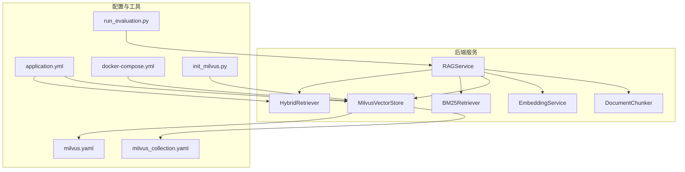
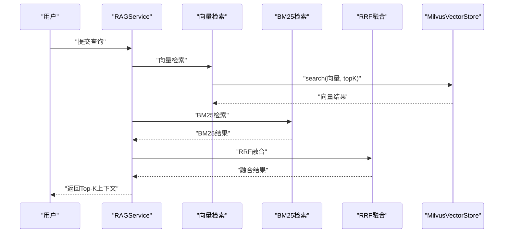
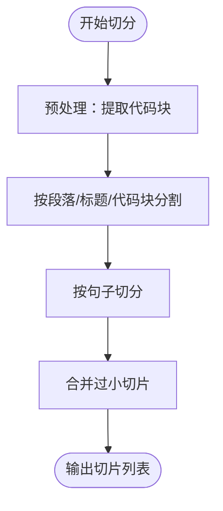
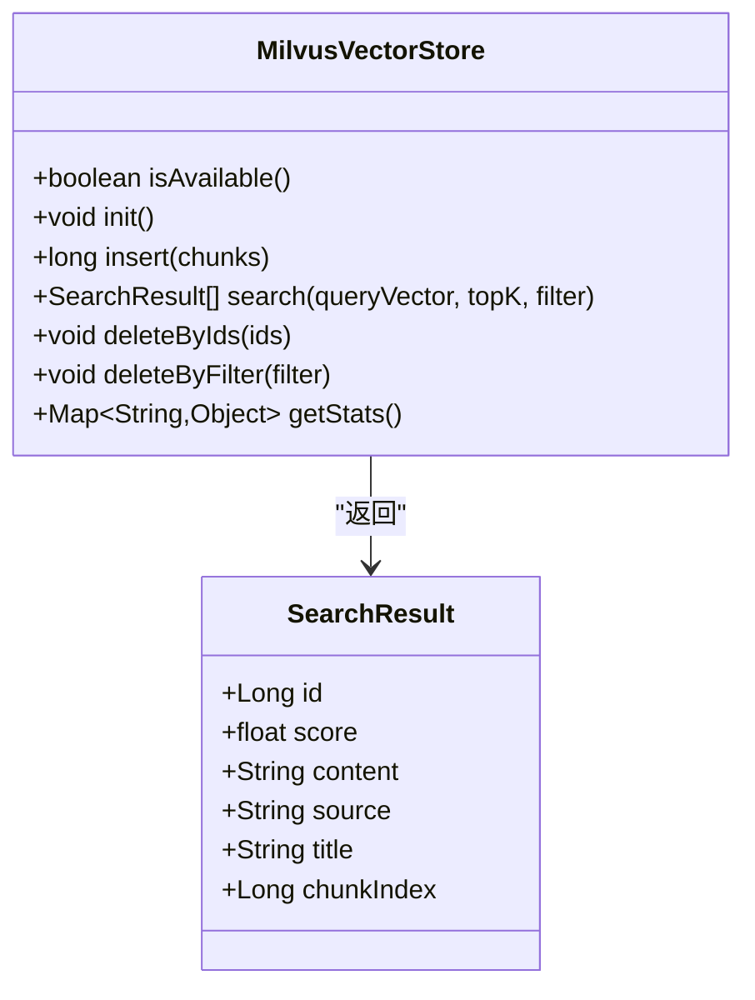
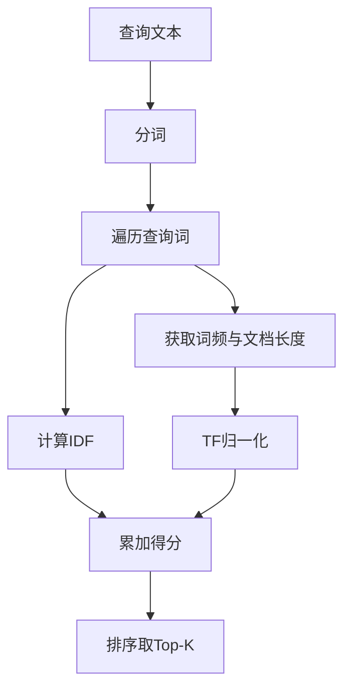
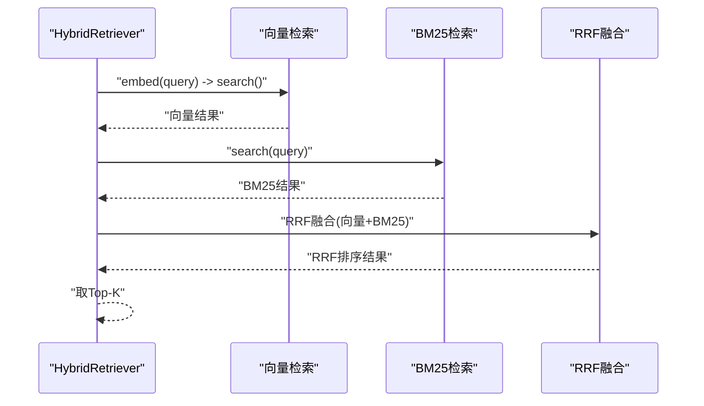
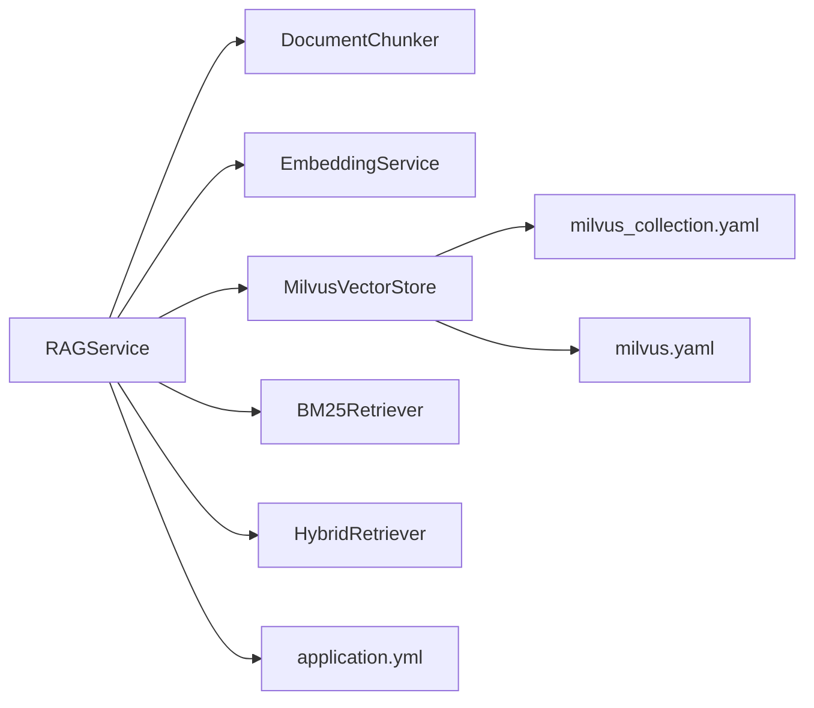

# RAG检索增强系统

<cite>
**本文档引用的文件**
- [BM25Retriever.java](file://netdata-ai-backend/src/main/java/com/netdata/ops/core/rag/BM25Retriever.java)
- [HybridRetriever.java](file://netdata-ai-backend/src/main/java/com/netdata/ops/core/rag/HybridRetriever.java)
- [MilvusVectorStore.java](file://netdata-ai-backend/src/main/java/com/netdata/ops/core/rag/MilvusVectorStore.java)
- [RAGService.java](file://netdata-ai-backend/src/main/java/com/netdata/ops/core/rag/RAGService.java)
- [DocumentChunker.java](file://netdata-ai-backend/src/main/java/com/netdata/ops/core/rag/DocumentChunker.java)
- [DocumentChunk.java](file://netdata-ai-backend/src/main/java/com/netdata/ops/core/rag/DocumentChunk.java)
- [EmbeddingService.java](file://netdata-ai-backend/src/main/java/com/netdata/ops/core/rag/EmbeddingService.java)
- [application.yml](file://netdata-ai-backend/src/main/resources/application.yml)
- [milvus_collection.yaml](file://config/milvus_collection.yaml)
- [milvus.yaml](file://config/milvus/milvus.yaml)
- [docker-compose.yml](file://docker-compose.yml)
- [init_milvus.py](file://scripts/init_milvus.py)
- [run_evaluation.py](file://evaluation/run_evaluation.py)
</cite>

## 目录
1. [简介](#简介)
2. [项目结构](#项目结构)
3. [核心组件](#核心组件)
4. [架构概览](#架构概览)
5. [详细组件分析](#详细组件分析)
6. [依赖关系分析](#依赖关系分析)
7. [性能考量](#性能考量)
8. [故障排除指南](#故障排除指南)
9. [结论](#结论)
10. [附录](#附录)

## 简介
本项目是一个混合检索增强生成（RAG）系统，结合向量检索与关键词检索（BM25），通过RRF（Reciprocal Rank Fusion）算法进行结果融合，并提供完整的文档入库、检索与上下文构建能力。系统采用Spring Boot后端，Milvus作为向量数据库，BGE-M3模型进行文本向量化，支持可选的reranker精排（当前实现为RRF融合）。文档切分策略采用语义切分，确保检索效果与内容完整性。

## 项目结构
后端采用Java/Spring Boot实现，RAG相关核心代码位于`netdata-ai-backend/src/main/java/com/netdata/ops/core/rag/`目录，配置文件位于`config/`与`application.yml`，Docker编排位于`docker-compose.yml`，初始化脚本位于`scripts/init_milvus.py`，评估脚本位于`evaluation/run_evaluation.py`。

**图表来源**
- [RAGService.java:1-212](file://netdata-ai-backend/src/main/java/com/netdata/ops/core/rag/RAGService.java#L1-212)
- [application.yml:101-137](file://netdata-ai-backend/src/main/resources/application.yml#L101-137)
- [milvus_collection.yaml:19-186](file://config/milvus_collection.yaml#L19-186)
- [milvus.yaml:1-583](file://config/milvus/milvus.yaml#L1-583)
- [docker-compose.yml:23-358](file://docker-compose.yml#L23-358)
- [init_milvus.py:1-525](file://scripts/init_milvus.py#L1-525)
- [run_evaluation.py:1-528](file://evaluation/run_evaluation.py#L1-528)

**章节来源**
- [RAGService.java:1-212](file://netdata-ai-backend/src/main/java/com/netdata/ops/core/rag/RAGService.java#L1-212)
- [application.yml:101-137](file://netdata-ai-backend/src/main/resources/application.yml#L101-137)

## 核心组件
- 文档切分器（DocumentChunker）：实现语义切分，按段落/标题/代码块等规则切分，保持语义完整性。
- 向量化服务（EmbeddingService）：调用本地BGE-M3模型生成1024维向量，支持批量处理与余弦相似度计算。
- 向量存储（MilvusVectorStore）：封装Milvus客户端，负责Collection创建、向量插入、搜索、删除与统计。
- 关键词检索（BM25Retriever）：基于词频与IDF的BM25算法，支持分词、倒排索引与统计信息。
- 混合检索（HybridRetriever）：整合向量与BM25结果，使用RRF融合算法进行排序。
- RAG服务（RAGService）：统一编排文档入库、检索与上下文构建流程。

**章节来源**
- [DocumentChunker.java:1-312](file://netdata-ai-backend/src/main/java/com/netdata/ops/core/rag/DocumentChunker.java#L1-312)
- [EmbeddingService.java:1-190](file://netdata-ai-backend/src/main/java/com/netdata/ops/core/rag/EmbeddingService.java#L1-190)
- [MilvusVectorStore.java:1-406](file://netdata-ai-backend/src/main/java/com/netdata/ops/core/rag/MilvusVectorStore.java#L1-406)
- [BM25Retriever.java:1-257](file://netdata-ai-backend/src/main/java/com/netdata/ops/core/rag/BM25Retriever.java#L1-257)
- [HybridRetriever.java:1-247](file://netdata-ai-backend/src/main/java/com/netdata/ops/core/rag/HybridRetriever.java#L1-247)
- [RAGService.java:1-212](file://netdata-ai-backend/src/main/java/com/netdata/ops/core/rag/RAGService.java#L1-212)

## 架构概览
系统采用“文档入库→向量检索+BM25检索→RRF融合→上下文构建”的RAG流程。Milvus作为向量数据库，EmbeddingService提供向量表示，BM25Retriever提供关键词匹配能力，HybridRetriever进行结果融合，最终由RAGService统一对外提供检索与上下文能力。

**图表来源**
- [RAGService.java:116-130](file://netdata-ai-backend/src/main/java/com/netdata/ops/core/rag/RAGService.java#L116-130)
- [HybridRetriever.java:75-100](file://netdata-ai-backend/src/main/java/com/netdata/ops/core/rag/HybridRetriever.java#L75-100)
- [MilvusVectorStore.java:274-324](file://netdata-ai-backend/src/main/java/com/netdata/ops/core/rag/MilvusVectorStore.java#L274-324)
- [BM25Retriever.java:132-178](file://netdata-ai-backend/src/main/java/com/netdata/ops/core/rag/BM25Retriever.java#L132-178)

## 详细组件分析

### 文档切分策略（语义切分）
- 切分流程：预处理（提取代码块）→按段落/标题/代码块分割→按句子切分→合并过小切片。
- 语义完整性：通过保留代码块原样、按段落与标题边界切分，避免语义断裂。
- 参数配置：切片大小、重叠、最小切片长度、是否启用语义切分等。

**图表来源**
- [DocumentChunker.java:81-104](file://netdata-ai-backend/src/main/java/com/netdata/ops/core/rag/DocumentChunker.java#L81-104)
- [DocumentChunker.java:112-147](file://netdata-ai-backend/src/main/java/com/netdata/ops/core/rag/DocumentChunker.java#L112-147)
- [DocumentChunker.java:152-197](file://netdata-ai-backend/src/main/java/com/netdata/ops/core/rag/DocumentChunker.java#L152-197)
- [DocumentChunker.java:267-297](file://netdata-ai-backend/src/main/java/com/netdata/ops/core/rag/DocumentChunker.java#L267-297)

**章节来源**
- [DocumentChunker.java:34-56](file://netdata-ai-backend/src/main/java/com/netdata/ops/core/rag/DocumentChunker.java#L34-56)
- [DocumentChunk.java:1-120](file://netdata-ai-backend/src/main/java/com/netdata/ops/core/rag/DocumentChunk.java#L1-120)

### 向量存储系统（Milvus）
- 连接与初始化：在Spring容器中初始化，检查并创建Collection，支持可用性检查。
- Collection结构：包含主键、内容、向量、来源、标题、切片索引等字段；向量维度固定为1024。
- 索引策略：IVF_FLAT索引，COSINE度量，nlist参数可调；支持按ID与过滤条件删除。
- 搜索优化：支持输出字段裁剪、一致性级别设置、过滤条件传入。

**图表来源**
- [MilvusVectorStore.java:42-103](file://netdata-ai-backend/src/main/java/com/netdata/ops/core/rag/MilvusVectorStore.java#L42-103)
- [MilvusVectorStore.java:127-209](file://netdata-ai-backend/src/main/java/com/netdata/ops/core/rag/MilvusVectorStore.java#L127-209)
- [MilvusVectorStore.java:274-324](file://netdata-ai-backend/src/main/java/com/netdata/ops/core/rag/MilvusVectorStore.java#L274-324)
- [milvus_collection.yaml:19-186](file://config/milvus_collection.yaml#L19-186)

**章节来源**
- [MilvusVectorStore.java:44-103](file://netdata-ai-backend/src/main/java/com/netdata/ops/core/rag/MilvusVectorStore.java#L44-103)
- [milvus_collection.yaml:70-101](file://config/milvus_collection.yaml#L70-101)
- [milvus.yaml:101-109](file://config/milvus/milvus.yaml#L101-109)

### 关键词检索（BM25）
- 倒排索引：以词为键，存储包含该词的文档及其词频。
- 分词策略：简化实现，按空格与标点分割，保留中文与英文字符，过滤单字。
- 分数计算：IDF与TF归一化，考虑文档长度归一化参数b与饱和参数k1。
- 统计与清理：维护文档长度、平均长度、文档总数；支持清空索引与统计查询。

**图表来源**
- [BM25Retriever.java:132-178](file://netdata-ai-backend/src/main/java/com/netdata/ops/core/rag/BM25Retriever.java#L132-178)
- [BM25Retriever.java:201-212](file://netdata-ai-backend/src/main/java/com/netdata/ops/core/rag/BM25Retriever.java#L201-212)
- [BM25Retriever.java:188-190](file://netdata-ai-backend/src/main/java/com/netdata/ops/core/rag/BM25Retriever.java#L188-190)

**章节来源**
- [BM25Retriever.java:43-66](file://netdata-ai-backend/src/main/java/com/netdata/ops/core/rag/BM25Retriever.java#L43-66)
- [BM25Retriever.java:84-124](file://netdata-ai-backend/src/main/java/com/netdata/ops/core/rag/BM25Retriever.java#L84-124)

### 混合检索器（RRF融合）
- 检索流程：向量检索→BM25检索→RRF融合→Top-K返回。
- RRF公式：对每个文档，将各检索器的排名取1/(k+rank)并求和，k为平滑参数（默认60）。
- 结果封装：包含向量分数、BM25分数、RRF分数与最终归一化分数。

**图表来源**
- [HybridRetriever.java:75-100](file://netdata-ai-backend/src/main/java/com/netdata/ops/core/rag/HybridRetriever.java#L75-100)
- [HybridRetriever.java:134-193](file://netdata-ai-backend/src/main/java/com/netdata/ops/core/rag/HybridRetriever.java#L134-193)

**章节来源**
- [HybridRetriever.java:46-56](file://netdata-ai-backend/src/main/java/com/netdata/ops/core/rag/HybridRetriever.java#L46-56)
- [HybridRetriever.java:108-120](file://netdata-ai-backend/src/main/java/com/netdata/ops/core/rag/HybridRetriever.java#L108-120)

### RAG服务编排
- 文档入库：切分→向量化→Milvus存储→更新BM25索引。
- 知识检索：委托HybridRetriever进行混合检索。
- 上下文构建：将检索结果格式化为提示上下文，便于LLM生成。
- 统计与删除：提供向量存储与BM25索引统计；按来源删除文档（BM25需重建索引）。

**章节来源**
- [RAGService.java:43-91](file://netdata-ai-backend/src/main/java/com/netdata/ops/core/rag/RAGService.java#L43-91)
- [RAGService.java:110-130](file://netdata-ai-backend/src/main/java/com/netdata/ops/core/rag/RAGService.java#L110-130)
- [RAGService.java:140-157](file://netdata-ai-backend/src/main/java/com/netdata/ops/core/rag/RAGService.java#L140-157)
- [RAGService.java:182-190](file://netdata-ai-backend/src/main/java/com/netdata/ops/core/rag/RAGService.java#L182-190)

## 依赖关系分析
- 组件耦合：RAGService聚合多个组件；HybridRetriever依赖向量存储、BM25检索与嵌入服务；MilvusVectorStore依赖Milvus客户端。
- 配置依赖：application.yml提供RAG与Milvus配置；milvus_collection.yaml定义Milvus结构与索引；milvus.yaml提供Milvus服务端配置。
- 外部依赖：Milvus SDK、WebClient（Embedding服务）、PyMilvus（初始化脚本）。

**图表来源**
- [RAGService.java:37-41](file://netdata-ai-backend/src/main/java/com/netdata/ops/core/rag/RAGService.java#L37-41)
- [application.yml:101-137](file://netdata-ai-backend/src/main/resources/application.yml#L101-137)
- [milvus_collection.yaml:19-186](file://config/milvus_collection.yaml#L19-186)
- [milvus.yaml:101-109](file://config/milvus/milvus.yaml#L101-109)

**章节来源**
- [application.yml:101-137](file://netdata-ai-backend/src/main/resources/application.yml#L101-137)
- [docker-compose.yml:99-155](file://docker-compose.yml#L99-155)

## 性能考量
- 向量检索优化
  - 索引参数：nlist与nprobe平衡精度与性能；建议根据数据规模调整（参考milvus_collection.yaml中的估算建议）。
  - 搜索参数：输出字段裁剪、一致性级别设置减少网络与解析开销。
  - 批量向量化：EmbeddingService支持批量处理，降低网络往返与模型调用开销。
- BM25检索优化
  - 分词策略：生产环境建议使用专业分词器（如IK、Jieba）提升准确性。
  - 倒排索引：定期统计与清理，避免索引膨胀。
- RRF融合
  - k参数：默认60，可根据检索器差异与数据分布微调。
  - Top-K：合理设置向量与BM25的Top-K，避免过多无关结果影响融合效率。
- 存储与部署
  - Milvus资源：Standalone模式适合开发，生产建议Cluster模式并合理分配内存。
  - Docker资源：Milvus建议4G以上内存，MySQL/Redis/Ollama按需分配。

**章节来源**
- [milvus_collection.yaml:175-184](file://config/milvus_collection.yaml#L175-184)
- [EmbeddingService.java:101-133](file://netdata-ai-backend/src/main/java/com/netdata/ops/core/rag/EmbeddingService.java#L101-133)
- [MilvusVectorStore.java:294-306](file://netdata-ai-backend/src/main/java/com/netdata/ops/core/rag/MilvusVectorStore.java#L294-306)
- [docker-compose.yml:148-155](file://docker-compose.yml#L148-155)

## 故障排除指南
- Milvus连接失败
  - 现象：Milvus连接失败日志，RAG功能降级。
  - 排查：检查主机、端口、数据库名配置；确认Milvus服务健康；查看初始化脚本与配置文件。
- 向量检索为空
  - 现象：向量检索返回空结果。
  - 排查：确认Embedding服务可用与模型一致；检查Milvus中是否有数据；核对向量维度与索引配置。
- BM25索引异常
  - 现象：BM25检索结果异常或为空。
  - 排查：确认索引统计信息；检查分词策略与过滤条件；必要时重建索引。
- 评估与监控
  - 使用评估脚本收集性能与功能指标，定位延迟与吞吐瓶颈。

**章节来源**
- [MilvusVectorStore.java:99-102](file://netdata-ai-backend/src/main/java/com/netdata/ops/core/rag/MilvusVectorStore.java#L99-102)
- [RAGService.java:182-190](file://netdata-ai-backend/src/main/java/com/netdata/ops/core/rag/RAGService.java#L182-190)
- [run_evaluation.py:197-241](file://evaluation/run_evaluation.py#L197-241)

## 结论
本系统通过语义切分、向量检索与BM25关键词检索的协同，结合RRF融合算法，实现了鲁棒且高效的RAG检索能力。Milvus提供高性能向量检索，BM25补充关键词精确匹配，整体架构具备良好的可扩展性与可维护性。建议在生产环境中根据数据规模与性能目标调整Milvus索引参数与查询策略，并持续通过评估脚本进行性能监控与优化。

## 附录

### 配置参数一览
- RAG配置（application.yml）
  - 文档切分：semantic-chunking、chunk-size、chunk-overlap、min-chunk-size
  - 检索配置：vector-top-k、bm25-top-k、final-top-k、rrf-k、similarity-threshold
- Milvus配置（application.yml + milvus_collection.yaml + milvus.yaml）
  - 连接参数：host、port、database、collection-name、vector-dimension
  - 索引参数：index.type、index.params.nlist、search.params.nprobe
  - 服务端参数：etcd、minio、proxy/queryNode等组件端口与资源限制

**章节来源**
- [application.yml:114-137](file://netdata-ai-backend/src/main/resources/application.yml#L114-137)
- [milvus_collection.yaml:70-101](file://config/milvus_collection.yaml#L70-101)
- [milvus.yaml:101-109](file://config/milvus/milvus.yaml#L101-109)

### 初始化与部署
- 初始化Milvus：使用Python脚本创建Collection、索引并插入测试数据。
- Docker编排：一键启动Milvus、MySQL、Redis、Ollama等服务，便于开发与测试。

**章节来源**
- [init_milvus.py:466-525](file://scripts/init_milvus.py#L466-525)
- [docker-compose.yml:23-358](file://docker-compose.yml#L23-358)