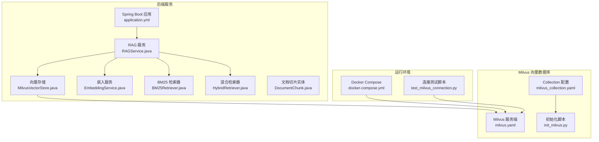
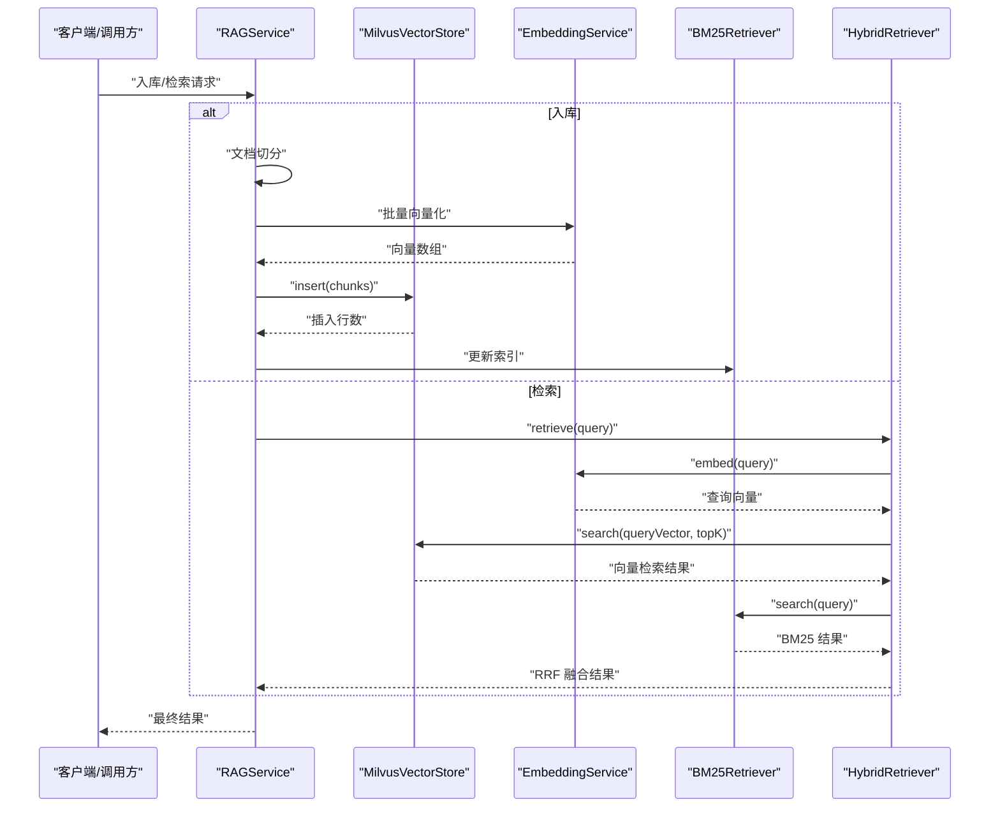
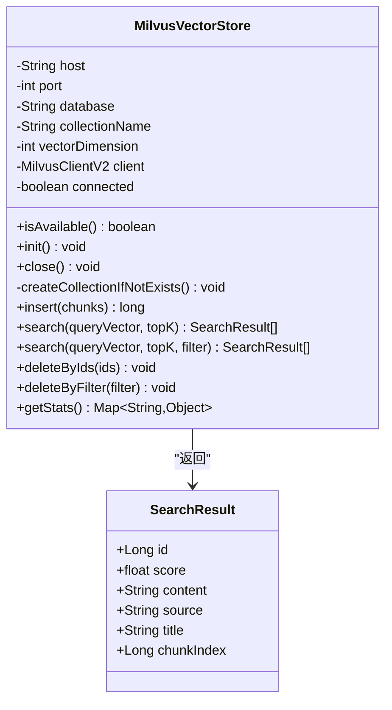
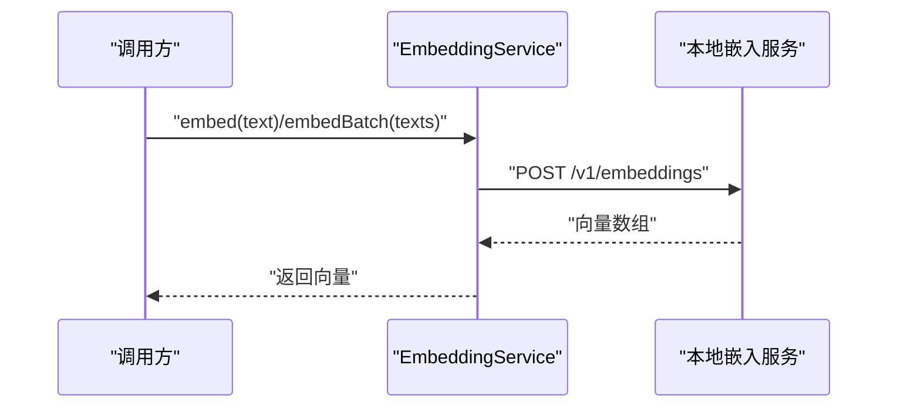
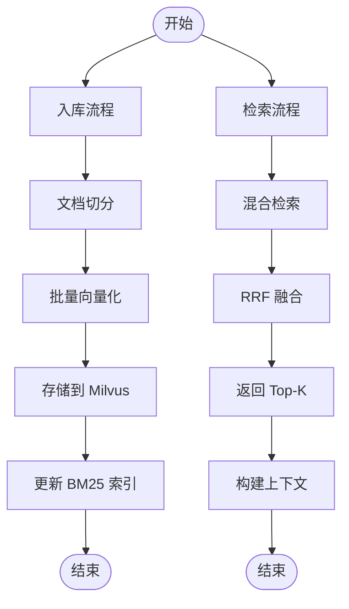
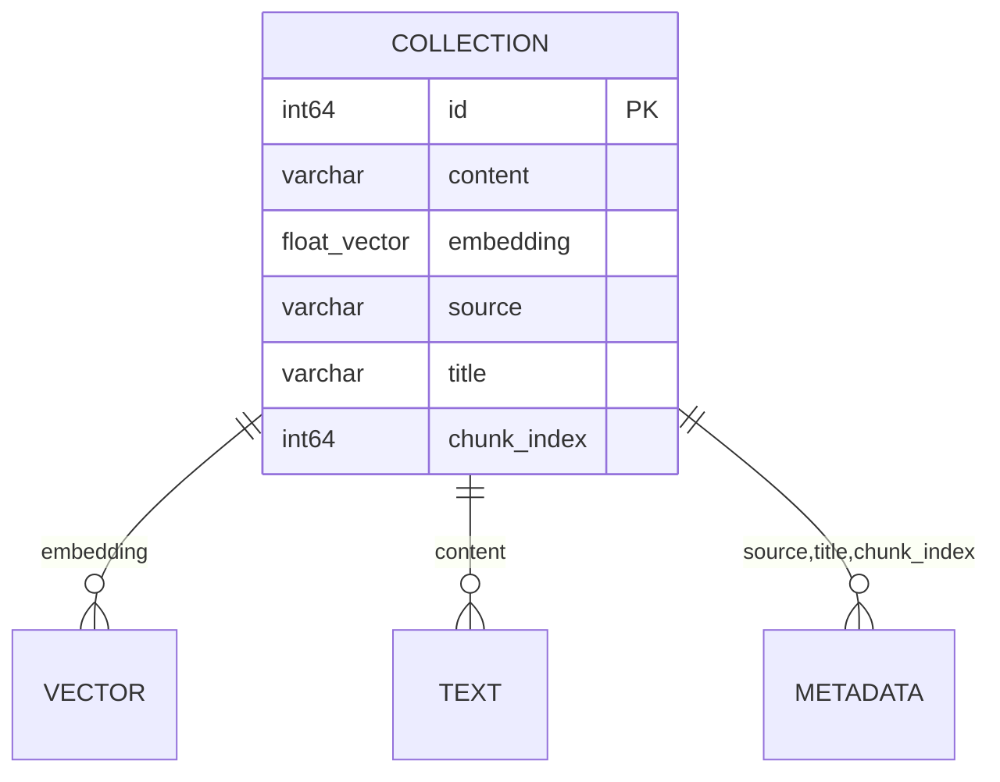
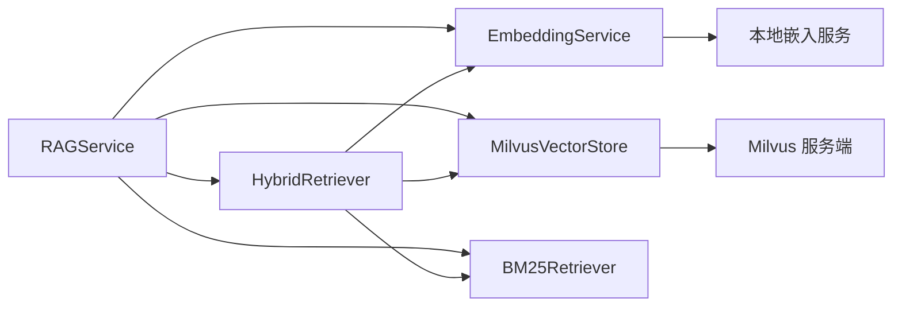
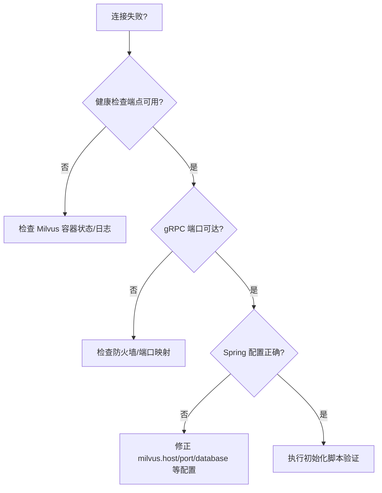

# 向量存储系统

<cite>
**本文引用的文件**
- [MilvusVectorStore.java](file://netdata-ai-backend/src/main/java/com/netdata/ops/core/rag/MilvusVectorStore.java)
- [application.yml](file://netdata-ai-backend/src/main/resources/application.yml)
- [milvus_collection.yaml](file://config/milvus_collection.yaml)
- [init_milvus.py](file://scripts/init_milvus.py)
- [EmbeddingService.java](file://netdata-ai-backend/src/main/java/com/netdata/ops/core/rag/EmbeddingService.java)
- [RAGService.java](file://netdata-ai-backend/src/main/java/com/netdata/ops/core/rag/RAGService.java)
- [BM25Retriever.java](file://netdata-ai-backend/src/main/java/com/netdata/ops/core/rag/BM25Retriever.java)
- [HybridRetriever.java](file://netdata-ai-backend/src/main/java/com/netdata/ops/core/rag/HybridRetriever.java)
- [DocumentChunk.java](file://netdata-ai-backend/src/main/java/com/netdata/ops/core/rag/DocumentChunk.java)
- [test_milvus_connection.py](file://tests/test_milvus_connection.py)
- [docker-compose.yml](file://docker-compose.yml)
- [milvus.yaml](file://config/milvus/milvus.yaml)
</cite>

## 目录
1. [简介](#简介)
2. [项目结构](#项目结构)
3. [核心组件](#核心组件)
4. [架构总览](#架构总览)
5. [详细组件分析](#详细组件分析)
6. [依赖分析](#依赖分析)
7. [性能考量](#性能考量)
8. [故障排查指南](#故障排查指南)
9. [结论](#结论)
10. [附录](#附录)

## 简介
本文件为“向量存储系统”的专业技术文档，聚焦于基于 Milvus 的向量数据库集成与应用。文档围绕以下目标展开：
- 深入解析 MilvusVectorStore 的实现原理与配置参数
- 阐述向量存储的数据模型设计（维度、索引类型、距离度量）
- 详解向量插入、查询、删除等核心操作
- 解释 Milvus 的索引策略与查询优化技术
- 提供性能调优与故障排除建议，并给出最佳实践

## 项目结构
本项目采用模块化与分层架构，向量存储位于后端 Java 工程的 RAG 子系统中，配合 Spring Boot 配置、Docker Compose 编排以及独立的 Milvus 初始化脚本与配置文件。

**图表来源**
- [application.yml:101-137](file://netdata-ai-backend/src/main/resources/application.yml#L101-L137)
- [RAGService.java:37-41](file://netdata-ai-backend/src/main/java/com/netdata/ops/core/rag/RAGService.java#L37-L41)
- [MilvusVectorStore.java:42-103](file://netdata-ai-backend/src/main/java/com/netdata/ops/core/rag/MilvusVectorStore.java#L42-L103)
- [EmbeddingService.java:36-48](file://netdata-ai-backend/src/main/java/com/netdata/ops/core/rag/EmbeddingService.java#L36-L48)
- [BM25Retriever.java:38-46](file://netdata-ai-backend/src/main/java/com/netdata/ops/core/rag/BM25Retriever.java#L38-L46)
- [HybridRetriever.java:42-57](file://netdata-ai-backend/src/main/java/com/netdata/ops/core/rag/HybridRetriever.java#L42-L57)
- [DocumentChunk.java:29-45](file://netdata-ai-backend/src/main/java/com/netdata/ops/core/rag/DocumentChunk.java#L29-L45)
- [milvus.yaml:1-583](file://config/milvus/milvus.yaml#L1-L583)
- [milvus_collection.yaml:22-140](file://config/milvus_collection.yaml#L22-L140)
- [init_milvus.py:142-251](file://scripts/init_milvus.py#L142-L251)
- [docker-compose.yml:23-155](file://docker-compose.yml#L23-L155)
- [test_milvus_connection.py:33-79](file://tests/test_milvus_connection.py#L33-L79)

**章节来源**
- [application.yml:101-137](file://netdata-ai-backend/src/main/resources/application.yml#L101-L137)
- [docker-compose.yml:23-155](file://docker-compose.yml#L23-L155)

## 核心组件
- MilvusVectorStore：封装 Milvus 客户端，负责 Collection 的创建/检查、向量插入、相似度搜索、按 ID/条件删除、统计查询等。
- EmbeddingService：负责将文本转换为向量（BGE-M3 1024 维），支持批量处理与余弦相似度计算。
- RAGService：文档入库（切分 → 向量化 → 存储）与知识检索（混合检索 → RRF 融合）的编排服务。
- BM25Retriever：基于词频的关键词检索器，补充向量检索的不足。
- HybridRetriever：整合向量与 BM25 检索结果，使用 RRF 算法融合并返回 Top-K。
- DocumentChunk：文档切片实体，承载内容、向量、元数据等。

**章节来源**
- [MilvusVectorStore.java:42-405](file://netdata-ai-backend/src/main/java/com/netdata/ops/core/rag/MilvusVectorStore.java#L42-L405)
- [EmbeddingService.java:36-190](file://netdata-ai-backend/src/main/java/com/netdata/ops/core/rag/EmbeddingService.java#L36-L190)
- [RAGService.java:35-212](file://netdata-ai-backend/src/main/java/com/netdata/ops/core/rag/RAGService.java#L35-L212)
- [BM25Retriever.java:38-257](file://netdata-ai-backend/src/main/java/com/netdata/ops/core/rag/BM25Retriever.java#L38-L257)
- [HybridRetriever.java:40-247](file://netdata-ai-backend/src/main/java/com/netdata/ops/core/rag/HybridRetriever.java#L40-L247)
- [DocumentChunk.java:29-120](file://netdata-ai-backend/src/main/java/com/netdata/ops/core/rag/DocumentChunk.java#L29-L120)

## 架构总览
下图展示了从应用到 Milvus 的整体调用链路与数据流：

**图表来源**
- [RAGService.java:57-130](file://netdata-ai-backend/src/main/java/com/netdata/ops/core/rag/RAGService.java#L57-L130)
- [HybridRetriever.java:64-100](file://netdata-ai-backend/src/main/java/com/netdata/ops/core/rag/HybridRetriever.java#L64-L100)
- [MilvusVectorStore.java:217-254](file://netdata-ai-backend/src/main/java/com/netdata/ops/core/rag/MilvusVectorStore.java#L217-L254)
- [EmbeddingService.java:72-93](file://netdata-ai-backend/src/main/java/com/netdata/ops/core/rag/EmbeddingService.java#L72-L93)
- [BM25Retriever.java:132-178](file://netdata-ai-backend/src/main/java/com/netdata/ops/core/rag/BM25Retriever.java#L132-L178)

## 详细组件分析

### MilvusVectorStore 组件分析
- 连接与初始化
  - 通过 @PostConstruct 在 Bean 初始化完成后建立连接，并检查/创建 Collection。
  - 连接失败时不会中断应用启动，而是标记不可用，便于上层降级。
- Collection 结构
  - 字段：id（自增主键）、content（VARCHAR）、embedding（FLOAT_VECTOR，维度由配置决定）、source、title、chunk_index。
  - 索引：embedding 字段使用 IVF_FLAT，度量类型 COSINE，nlist 由配置提供。
- 核心操作
  - 插入：将切片列表转换为行数据，批量插入 Milvus。
  - 查询：支持带/不带过滤条件的向量相似度搜索，返回内容、来源、标题、切片索引与分数。
  - 删除：支持按 ID 列表与过滤条件删除。
  - 统计：返回 Collection 当前实体数量与可用状态。
- 配置参数
  - milvus.host/port/database/collection-name/vector-dimension 通过 Spring 配置注入。
  - 索引参数 nlist 通过配置文件与代码共同决定。

**图表来源**
- [MilvusVectorStore.java:42-405](file://netdata-ai-backend/src/main/java/com/netdata/ops/core/rag/MilvusVectorStore.java#L42-L405)

**章节来源**
- [MilvusVectorStore.java:80-103](file://netdata-ai-backend/src/main/java/com/netdata/ops/core/rag/MilvusVectorStore.java#L80-L103)
- [MilvusVectorStore.java:127-209](file://netdata-ai-backend/src/main/java/com/netdata/ops/core/rag/MilvusVectorStore.java#L127-L209)
- [MilvusVectorStore.java:217-368](file://netdata-ai-backend/src/main/java/com/netdata/ops/core/rag/MilvusVectorStore.java#L217-L368)
- [application.yml:103-109](file://netdata-ai-backend/src/main/resources/application.yml#L103-L109)

### EmbeddingService 组件分析
- 功能要点
  - 通过 HTTP 客户端调用本地嵌入服务（BGE-M3），将文本转换为 1024 维向量。
  - 支持批量向量化与超时控制；提供余弦相似度计算工具方法。
- 配置参数
  - embedding.service.url、embedding.model、embedding.batch-size、embedding.timeout。

**图表来源**
- [EmbeddingService.java:72-133](file://netdata-ai-backend/src/main/java/com/netdata/ops/core/rag/EmbeddingService.java#L72-L133)

**章节来源**
- [EmbeddingService.java:36-190](file://netdata-ai-backend/src/main/java/com/netdata/ops/core/rag/EmbeddingService.java#L36-L190)
- [application.yml:141-144](file://netdata-ai-backend/src/main/resources/application.yml#L141-L144)

### RAGService 组件分析
- 入库流程
  - 文档切分 → 向量化 → 存储到 Milvus → 更新 BM25 索引。
- 检索流程
  - 混合检索（向量 + BM25）→ RRF 融合 → Top-K → 构建上下文。
- 删除与统计
  - 支持按来源删除文档；聚合向量存储与 BM25 统计信息。

**图表来源**
- [RAGService.java:57-130](file://netdata-ai-backend/src/main/java/com/netdata/ops/core/rag/RAGService.java#L57-L130)

**章节来源**
- [RAGService.java:35-212](file://netdata-ai-backend/src/main/java/com/netdata/ops/core/rag/RAGService.java#L35-L212)

### BM25Retriever 组件分析
- 基于词频的关键词检索，弥补向量检索对专有名词的不足。
- 使用简化的分词策略与 BM25 公式计算分数，支持批量索引与查询。

**章节来源**
- [BM25Retriever.java:38-257](file://netdata-ai-backend/src/main/java/com/netdata/ops/core/rag/BM25Retriever.java#L38-L257)

### HybridRetriever 组件分析
- 整合向量检索与 BM25 检索，采用 RRF 算法融合，返回最终 Top-K。
- 支持向量 Top-K、BM25 Top-K、RRF 平滑参数与最终 Top-K 的配置。

**章节来源**
- [HybridRetriever.java:40-247](file://netdata-ai-backend/src/main/java/com/netdata/ops/core/rag/HybridRetriever.java#L40-L247)

### 数据模型设计
- Collection 字段设计
  - id：INT64，主键，自增
  - content：VARCHAR(8000)，文档内容片段
  - embedding：FLOAT_VECTOR(维度由配置决定)，向量字段
  - source：VARCHAR(512)，文档来源
  - title：VARCHAR(256)，文档标题
  - chunk_index：INT64，同一文档内的切片索引
- 索引与度量
  - 索引类型：IVF_FLAT（平衡性能与精度）
  - 度量类型：COSINE（适合文本语义检索）
  - nlist：聚类中心数量，影响检索精度与速度
- 配置来源
  - Spring 配置：milvus.vector-dimension、milvus.collection-name 等
  - YAML 配置：milvus_collection.yaml 中的 fields、index、search 等

**图表来源**
- [milvus_collection.yaml:105-140](file://config/milvus_collection.yaml#L105-L140)
- [application.yml:103-109](file://netdata-ai-backend/src/main/resources/application.yml#L103-L109)

**章节来源**
- [milvus_collection.yaml:22-140](file://config/milvus_collection.yaml#L22-L140)
- [application.yml:103-109](file://netdata-ai-backend/src/main/resources/application.yml#L103-L109)

## 依赖分析
- 组件耦合
  - RAGService 依赖 EmbeddingService、MilvusVectorStore、BM25Retriever、HybridRetriever。
  - HybridRetriever 依赖 EmbeddingService、MilvusVectorStore、BM25Retriever。
  - MilvusVectorStore 依赖 Milvus 客户端与 Spring 配置。
- 外部依赖
  - Milvus 服务端（Standalone/Cluster 模式）
  - 本地嵌入服务（BGE-M3）
  - Docker Compose 编排与 MinIO/etcd 等基础设施

**图表来源**
- [RAGService.java:37-41](file://netdata-ai-backend/src/main/java/com/netdata/ops/core/rag/RAGService.java#L37-L41)
- [HybridRetriever.java:42-44](file://netdata-ai-backend/src/main/java/com/netdata/ops/core/rag/HybridRetriever.java#L42-L44)
- [MilvusVectorStore.java](file://netdata-ai-backend/src/main/java/com/netdata/ops/core/rag/MilvusVectorStore.java#L59)

**章节来源**
- [RAGService.java:35-212](file://netdata-ai-backend/src/main/java/com/netdata/ops/core/rag/RAGService.java#L35-L212)
- [HybridRetriever.java:40-247](file://netdata-ai-backend/src/main/java/com/netdata/ops/core/rag/HybridRetriever.java#L40-L247)

## 性能考量
- 索引与查询参数
  - nlist：数据量越大，建议增大 nlist；nprobe 建议为 nlist 的 10%-20%。
  - Top-K：向量检索与 BM25 检索的 Top-K 与最终 Top-K 需结合业务权衡。
- 内存与容量
  - 估算：每条记录约 1024×4 字节向量 + 元数据约 4.5KB；100 万条约 4.5GB。
  - 索引大小约为原始数据的 10%-20%。
- 运行时优化
  - 查询并发与缓存：合理配置 queryNode 缓存与并发参数。
  - gRPC 传输：适当增大 serverMaxRecvSize 以提升大批量返回效率。
  - 日志级别：生产环境降低 Milvus 日志级别以减少 I/O。

**章节来源**
- [milvus_collection.yaml:164-185](file://config/milvus_collection.yaml#L164-L185)
- [milvus.yaml:563-582](file://config/milvus/milvus.yaml#L563-L582)

## 故障排查指南
- 连接与可用性
  - 检查 Milvus 服务端健康状态与 gRPC 端口可达性。
  - 使用连接测试脚本验证健康检查端点与版本信息。
- 初始化与配置
  - 确认 Spring 配置与 Milvus 配置一致（如向量维度、索引参数）。
  - 使用初始化脚本验证 Collection 创建、索引构建与搜索流程。
- 容器与资源
  - Docker Compose 中 Milvus 需分配足够内存（建议 4GB+）。
  - MinIO/etcd 健康检查通过后再启动 Milvus。

**图表来源**
- [test_milvus_connection.py:33-79](file://tests/test_milvus_connection.py#L33-L79)
- [docker-compose.yml:133-139](file://docker-compose.yml#L133-L139)

**章节来源**
- [test_milvus_connection.py:118-144](file://tests/test_milvus_connection.py#L118-L144)
- [docker-compose.yml:102-155](file://docker-compose.yml#L102-L155)

## 结论
本向量存储系统以 Milvus 为核心，结合本地嵌入服务与混合检索策略，实现了从文档入库到知识检索的完整链路。通过合理的数据模型设计、索引策略与查询优化，系统在准确性与性能之间取得良好平衡。建议在生产环境中持续关注索引参数、内存与并发配置，并配合监控与日志进行迭代优化。

## 附录
- 配置清单
  - Milvus 客户端配置：milvus.host、milvus.port、milvus.database、milvus.collection-name、milvus.vector-dimension
  - RAG 检索配置：rag.retrieval.vector-top-k、rag.retrieval.bm25-top-k、rag.retrieval.final-top-k、rag.retrieval.rrf-k
  - 嵌入服务配置：embedding.service.url、embedding.model、embedding.batch-size、embedding.timeout
- 初始化与验证
  - 使用初始化脚本创建 Collection、构建索引、加载数据并验证搜索。
  - 使用连接测试脚本验证健康检查端点与服务版本。

**章节来源**
- [application.yml:103-144](file://netdata-ai-backend/src/main/resources/application.yml#L103-L144)
- [milvus_collection.yaml:22-140](file://config/milvus_collection.yaml#L22-L140)
- [init_milvus.py:466-525](file://scripts/init_milvus.py#L466-L525)
- [test_milvus_connection.py:118-144](file://tests/test_milvus_connection.py#L118-L144)