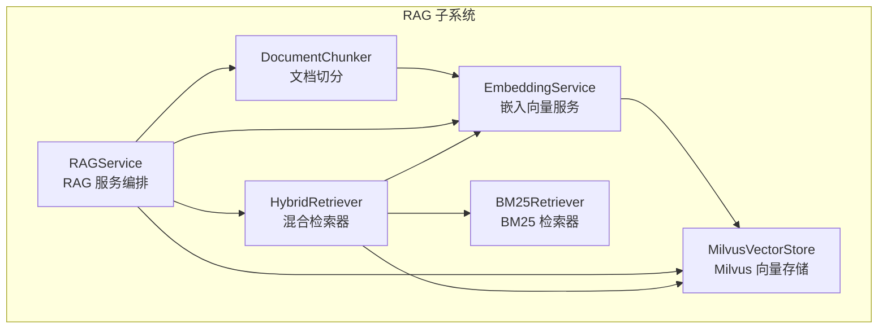
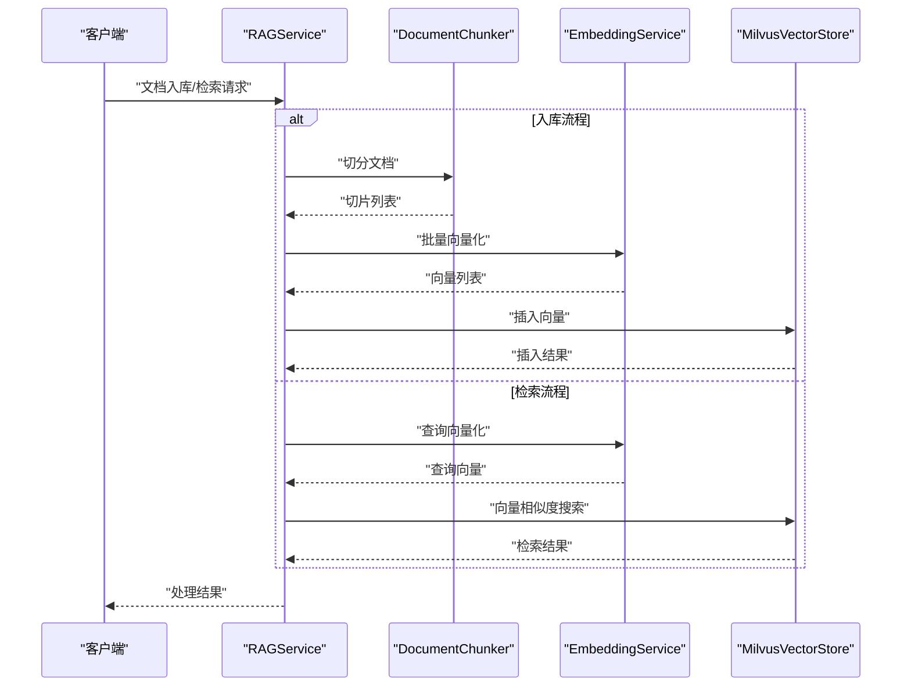
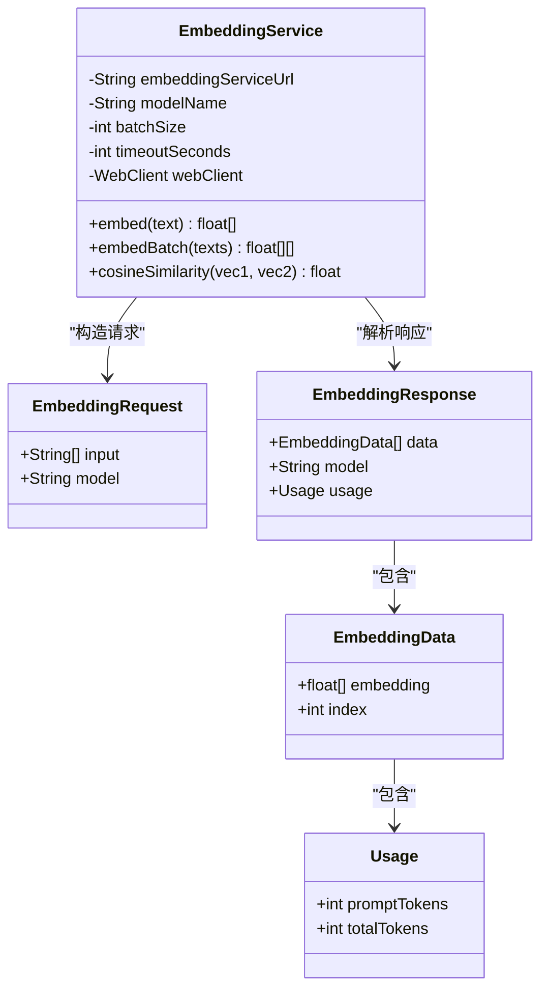
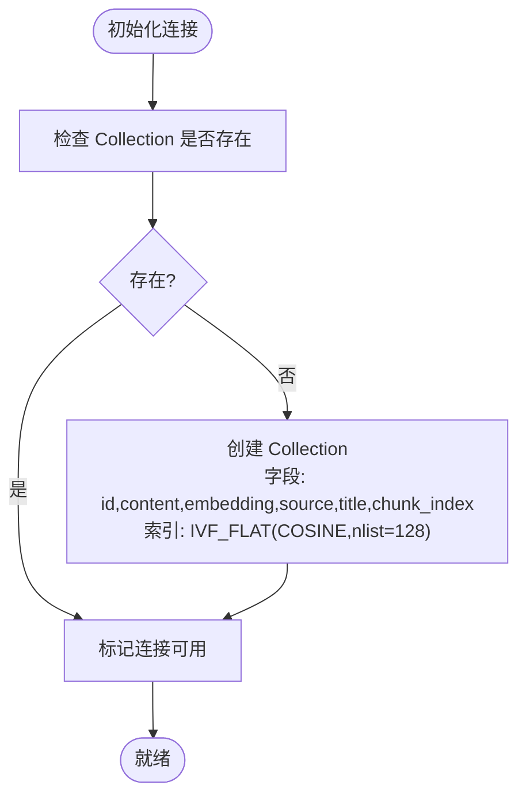
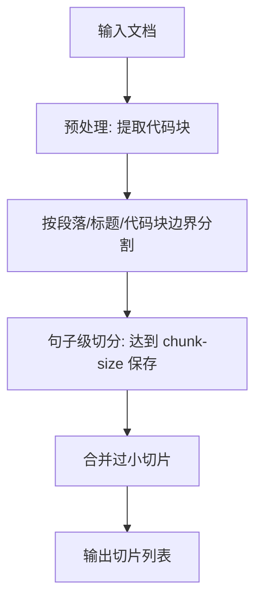
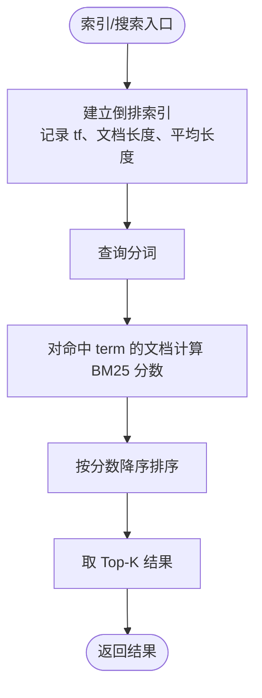
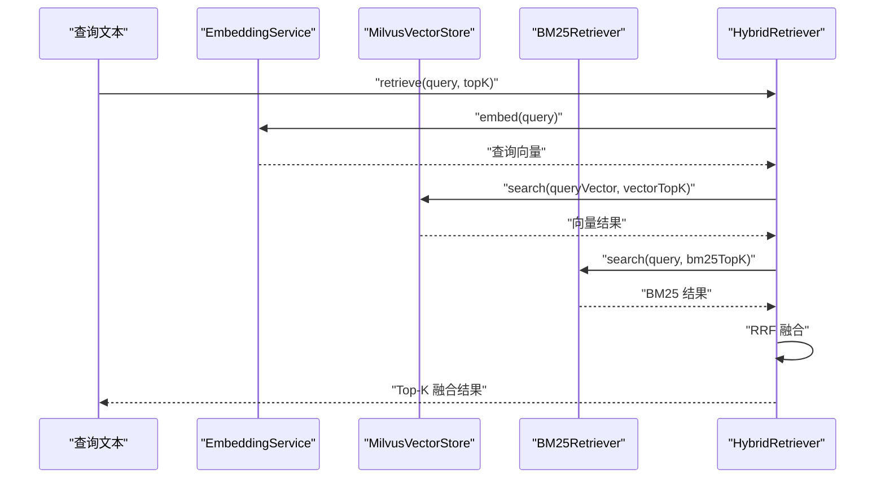
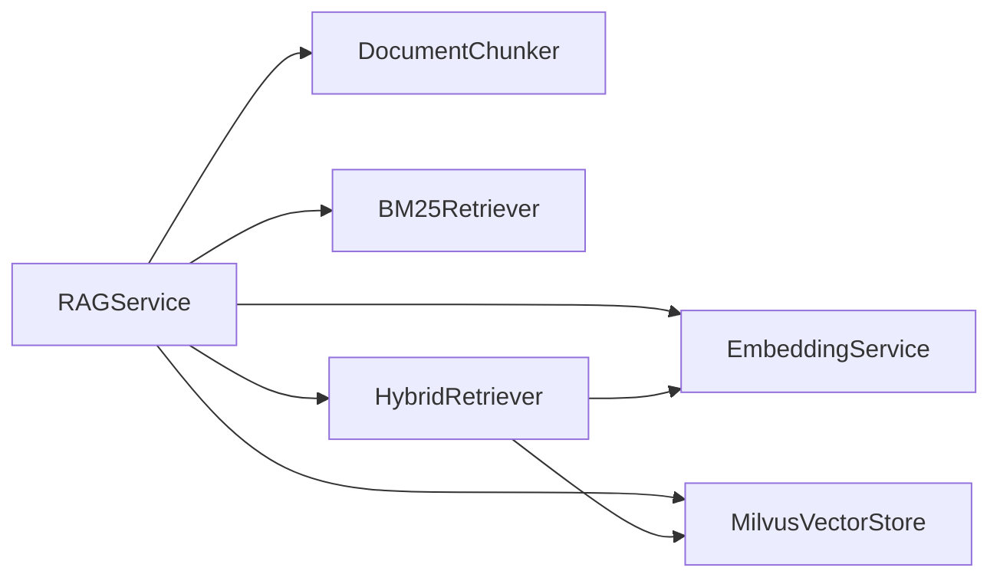

# 嵌入向量服务

<cite>
**本文引用的文件**
- [EmbeddingService.java](file://netdata-ai-backend/src/main/java/com/netdata/ops/core/rag/EmbeddingService.java)
- [MilvusVectorStore.java](file://netdata-ai-backend/src/main/java/com/netdata/ops/core/rag/MilvusVectorStore.java)
- [application.yml](file://netdata-ai-backend/src/main/resources/application.yml)
- [milvus_collection.yaml](file://config/milvus_collection.yaml)
- [RAGService.java](file://netdata-ai-backend/src/main/java/com/netdata/ops/core/rag/RAGService.java)
- [HybridRetriever.java](file://netdata-ai-backend/src/main/java/com/netdata/ops/core/rag/HybridRetriever.java)
- [BM25Retriever.java](file://netdata-ai-backend/src/main/java/com/netdata/ops/core/rag/BM25Retriever.java)
- [DocumentChunker.java](file://netdata-ai-backend/src/main/java/com/netdata/ops/core/rag/DocumentChunker.java)
- [DocumentChunk.java](file://netdata-ai-backend/src/main/java/com/netdata/ops/core/rag/DocumentChunk.java)
</cite>

## 目录
1. [简介](#简介)
2. [项目结构](#项目结构)
3. [核心组件](#核心组件)
4. [架构总览](#架构总览)
5. [详细组件分析](#详细组件分析)
6. [依赖分析](#依赖分析)
7. [性能考量](#性能考量)
8. [故障排查指南](#故障排查指南)
9. [结论](#结论)
10. [附录](#附录)

## 简介
本技术文档围绕嵌入向量服务展开，重点解析以下内容：
- EmbeddingService 的实现原理与调用机制
- bge-m3 模型的集成方式与配置要点
- 批量向量生成的优化策略（批处理大小、并发控制、内存管理）
- 向量维度与精度配置选项
- 模型参数调优指南与性能基准建议
- API 使用示例与错误处理策略
- 向量相似度计算与距离度量的实现细节

## 项目结构
本项目采用 Java/Spring Boot 实现，嵌入向量服务位于 RAG 子系统中，主要涉及以下模块：
- 文档切分：将长文档切分为语义完整的片段
- 向量服务：调用本地嵌入模型生成向量
- 向量存储：基于 Milvus 的向量检索与持久化
- 检索融合：向量检索与 BM25 检索的 RRF 融合
- 应用配置：统一的环境变量与 YAML 配置

图表来源
- [RAGService.java:35-91](file://netdata-ai-backend/src/main/java/com/netdata/ops/core/rag/RAGService.java#L35-L91)
- [EmbeddingService.java:36-133](file://netdata-ai-backend/src/main/java/com/netdata/ops/core/rag/EmbeddingService.java#L36-L133)
- [MilvusVectorStore.java:42-209](file://netdata-ai-backend/src/main/java/com/netdata/ops/core/rag/MilvusVectorStore.java#L42-L209)
- [HybridRetriever.java:40-100](file://netdata-ai-backend/src/main/java/com/netdata/ops/core/rag/HybridRetriever.java#L40-L100)
- [BM25Retriever.java:38-178](file://netdata-ai-backend/src/main/java/com/netdata/ops/core/rag/BM25Retriever.java#L38-L178)
- [DocumentChunker.java:32-104](file://netdata-ai-backend/src/main/java/com/netdata/ops/core/rag/DocumentChunker.java#L32-L104)

章节来源
- [application.yml:101-137](file://netdata-ai-backend/src/main/resources/application.yml#L101-L137)
- [milvus_collection.yaml:19-185](file://config/milvus_collection.yaml#L19-L185)

## 核心组件
- EmbeddingService：负责将文本转换为向量，支持单条与批量向量化，并提供余弦相似度计算。
- MilvusVectorStore：封装 Milvus 客户端，负责集合创建、向量插入、相似度搜索、删除与统计。
- DocumentChunker：对文档进行预处理、语义切分与后处理，保证切片语义完整性。
- BM25Retriever：基于词频的关键词检索，补充向量检索的不足。
- HybridRetriever：整合向量与 BM25 检索，使用 RRF 算法进行融合排序。
- RAGService：编排文档入库、检索与上下文构建流程。

章节来源
- [EmbeddingService.java:36-190](file://netdata-ai-backend/src/main/java/com/netdata/ops/core/rag/EmbeddingService.java#L36-L190)
- [MilvusVectorStore.java:42-405](file://netdata-ai-backend/src/main/java/com/netdata/ops/core/rag/MilvusVectorStore.java#L42-L405)
- [DocumentChunker.java:32-312](file://netdata-ai-backend/src/main/java/com/netdata/ops/core/rag/DocumentChunker.java#L32-L312)
- [BM25Retriever.java:38-257](file://netdata-ai-backend/src/main/java/com/netdata/ops/core/rag/BM25Retriever.java#L38-L257)
- [HybridRetriever.java:40-247](file://netdata-ai-backend/src/main/java/com/netdata/ops/core/rag/HybridRetriever.java#L40-L247)
- [RAGService.java:35-212](file://netdata-ai-backend/src/main/java/com/netdata/ops/core/rag/RAGService.java#L35-L212)

## 架构总览
嵌入向量服务在系统中的位置如下：

图表来源
- [RAGService.java:57-91](file://netdata-ai-backend/src/main/java/com/netdata/ops/core/rag/RAGService.java#L57-L91)
- [EmbeddingService.java:101-133](file://netdata-ai-backend/src/main/java/com/netdata/ops/core/rag/EmbeddingService.java#L101-L133)
- [MilvusVectorStore.java:217-254](file://netdata-ai-backend/src/main/java/com/netdata/ops/core/rag/MilvusVectorStore.java#L217-L254)

## 详细组件分析

### EmbeddingService 组件分析
- 模型集成与调用
  - 通过 WebClient 调用本地嵌入服务，URI 为 /v1/embeddings。
  - 请求体包含 input（文本列表）与 model（模型名称），响应体包含 data（向量数组）。
  - 单条向量化：返回 1024 维 float[]。
  - 批量向量化：按配置的批处理大小分批发送请求，累积返回结果。
- 配置项
  - embedding.service.url：嵌入服务地址，默认 http://localhost:8002。
  - embedding.model：模型名称，默认 bge-m3。
  - embedding.batch-size：批处理大小，默认 32。
  - embedding.timeout：超时秒数，默认 30（单条）与 60（批量）。
- 内存与性能
  - WebClient 默认最大内存缓冲为 10MB，避免大响应导致内存溢出。
  - 批处理大小直接影响网络往返次数与内存占用，需结合下游 Milvus 的写入能力权衡。
- 相似度计算
  - 提供余弦相似度计算，输入两个同维浮点向量，输出 [0,1] 的相似度。

图表来源
- [EmbeddingService.java:36-190](file://netdata-ai-backend/src/main/java/com/netdata/ops/core/rag/EmbeddingService.java#L36-L190)

章节来源
- [EmbeddingService.java:38-93](file://netdata-ai-backend/src/main/java/com/netdata/ops/core/rag/EmbeddingService.java#L38-L93)
- [EmbeddingService.java:101-133](file://netdata-ai-backend/src/main/java/com/netdata/ops/core/rag/EmbeddingService.java#L101-L133)
- [EmbeddingService.java:145-161](file://netdata-ai-backend/src/main/java/com/netdata/ops/core/rag/EmbeddingService.java#L145-L161)

### MilvusVectorStore 组件分析
- 连接与初始化
  - 通过 @PostConstruct 初始化连接，检查并创建 Collection（若不存在）。
  - 连接失败不会中断应用启动，而是降级为不可用状态，RAGService 在调用前会检查可用性。
- Collection 结构
  - 字段：id（主键自增）、content（VARCHAR）、embedding（FLOAT_VECTOR，维度 1024）、source、title、chunk_index。
  - 索引：embedding 字段使用 IVF_FLAT，度量类型 COSINE，nlist 为 128。
- 插入与检索
  - 插入：将 float[] 向量序列化为 JSON 列表后写入。
  - 检索：支持带过滤条件的 topK 搜索，返回 content、source、title、chunk_index 与分数。
- 统计与维护
  - 提供集合统计接口，便于监控入库规模与可用性。

图表来源
- [MilvusVectorStore.java:80-103](file://netdata-ai-backend/src/main/java/com/netdata/ops/core/rag/MilvusVectorStore.java#L80-L103)
- [MilvusVectorStore.java:127-209](file://netdata-ai-backend/src/main/java/com/netdata/ops/core/rag/MilvusVectorStore.java#L127-L209)

章节来源
- [MilvusVectorStore.java:44-103](file://netdata-ai-backend/src/main/java/com/netdata/ops/core/rag/MilvusVectorStore.java#L44-L103)
- [MilvusVectorStore.java:127-209](file://netdata-ai-backend/src/main/java/com/netdata/ops/core/rag/MilvusVectorStore.java#L127-L209)
- [MilvusVectorStore.java:217-324](file://netdata-ai-backend/src/main/java/com/netdata/ops/core/rag/MilvusVectorStore.java#L217-L324)

### DocumentChunker 组件分析
- 切分策略
  - 预处理：提取代码块并临时替换，保证代码完整性。
  - 语义段落：按空行、标题、代码块边界分割。
  - 句子级切分：在达到 chunk-size 时保存切片，最小切片长度由 min-chunk-size 控制。
  - 合并：将过小的切片与下一个合并，提升语义连贯性。
- 类型识别：标题、段落、代码块、列表、表格，便于后续处理与展示。
- 配置项
  - rag.chunk.chunk-size：默认 500
  - rag.chunk.chunk-overlap：默认 50
  - rag.chunk.min-chunk-size：默认 100
  - rag.chunk.semantic-chunking：默认开启

图表来源
- [DocumentChunker.java:112-147](file://netdata-ai-backend/src/main/java/com/netdata/ops/core/rag/DocumentChunker.java#L112-L147)
- [DocumentChunker.java:152-197](file://netdata-ai-backend/src/main/java/com/netdata/ops/core/rag/DocumentChunker.java#L152-L197)
- [DocumentChunker.java:267-297](file://netdata-ai-backend/src/main/java/com/netdata/ops/core/rag/DocumentChunker.java#L267-L297)

章节来源
- [DocumentChunker.java:37-56](file://netdata-ai-backend/src/main/java/com/netdata/ops/core/rag/DocumentChunker.java#L37-L56)
- [DocumentChunker.java:81-104](file://netdata-ai-backend/src/main/java/com/netdata/ops/core/rag/DocumentChunker.java#L81-L104)
- [DocumentChunker.java:152-197](file://netdata-ai-backend/src/main/java/com/netdata/ops/core/rag/DocumentChunker.java#L152-L197)
- [DocumentChunker.java:267-297](file://netdata-ai-backend/src/main/java/com/netdata/ops/core/rag/DocumentChunker.java#L267-L297)

### BM25Retriever 组件分析
- 功能概述
  - 基于词频的关键词检索，弥补向量检索在专有名词、缩写等方面的不足。
  - 使用简化的分词规则（按空格与标点分割，转小写，过滤单字符）。
- BM25 公式
  - 参数：k1=1.5，b=0.75；IDF 与词频归一化共同决定分数。
- 检索流程
  - 建立倒排索引（term -> 文档列表，含词频 tf）。
  - 查询时对命中 term 的文档累加分数，排序取 Top-K。

图表来源
- [BM25Retriever.java:84-124](file://netdata-ai-backend/src/main/java/com/netdata/ops/core/rag/BM25Retriever.java#L84-L124)
- [BM25Retriever.java:143-178](file://netdata-ai-backend/src/main/java/com/netdata/ops/core/rag/BM25Retriever.java#L143-L178)

章节来源
- [BM25Retriever.java:40-46](file://netdata-ai-backend/src/main/java/com/netdata/ops/core/rag/BM25Retriever.java#L40-L46)
- [BM25Retriever.java:132-178](file://netdata-ai-backend/src/main/java/com/netdata/ops/core/rag/BM25Retriever.java#L132-L178)

### HybridRetriever 组件分析
- 功能概述
  - 整合向量检索与 BM25 检索，使用 RRF（Reciprocal Rank Fusion）算法融合排序。
  - RRF 公式：对每个文档 d，RRF_score(d) = Σ (1 / (k + rank_i(d)))，其中 k 为平滑参数（默认 60）。
- 流程
  - 向量检索：将查询文本向量化后在 Milvus 中搜索，返回 Top-K。
  - BM25 检索：在倒排索引上搜索，返回 Top-K。
  - RRF 融合：为每个文档累计两个来源的 RRF 分数，按分数降序排序，取最终 Top-K。
- 配置项
  - rag.retrieval.vector-top-k：默认 20
  - rag.retrieval.bm25-top-k：默认 20
  - rag.retrieval.final-top-k：默认 5
  - rag.retrieval.rrf-k：默认 60

图表来源
- [HybridRetriever.java:75-100](file://netdata-ai-backend/src/main/java/com/netdata/ops/core/rag/HybridRetriever.java#L75-L100)
- [HybridRetriever.java:108-120](file://netdata-ai-backend/src/main/java/com/netdata/ops/core/rag/HybridRetriever.java#L108-L120)
- [HybridRetriever.java:134-193](file://netdata-ai-backend/src/main/java/com/netdata/ops/core/rag/HybridRetriever.java#L134-L193)

章节来源
- [HybridRetriever.java:46-56](file://netdata-ai-backend/src/main/java/com/netdata/ops/core/rag/HybridRetriever.java#L46-L56)
- [HybridRetriever.java:64-100](file://netdata-ai-backend/src/main/java/com/netdata/ops/core/rag/HybridRetriever.java#L64-L100)
- [HybridRetriever.java:134-193](file://netdata-ai-backend/src/main/java/com/netdata/ops/core/rag/HybridRetriever.java#L134-L193)

### RAGService 组件分析
- 入库流程
  - 文档切分 → 批量向量化 → 写入 Milvus → 更新 BM25 索引。
- 检索流程
  - 调用 HybridRetriever 进行混合检索，返回 Top-K 结果。
- 上下文构建
  - 将检索结果格式化为提示词上下文，便于注入给 LLM。
- 统计与维护
  - 提供向量存储与 BM25 索引的统计信息。

章节来源
- [RAGService.java:57-91](file://netdata-ai-backend/src/main/java/com/netdata/ops/core/rag/RAGService.java#L57-L91)
- [RAGService.java:116-130](file://netdata-ai-backend/src/main/java/com/netdata/ops/core/rag/RAGService.java#L116-L130)
- [RAGService.java:140-175](file://netdata-ai-backend/src/main/java/com/netdata/ops/core/rag/RAGService.java#L140-L175)

## 依赖分析
- 组件耦合
  - EmbeddingService 与 MilvusVectorStore 通过 HTTP 与数据库解耦，便于独立扩展与替换。
  - RAGService 作为编排者，依赖 DocumentChunker、EmbeddingService、MilvusVectorStore、BM25Retriever、HybridRetriever。
  - HybridRetriever 同时依赖 EmbeddingService 与 MilvusVectorStore，形成“查询向量化 + 向量检索”的闭环。
- 外部依赖
  - WebClient：用于调用本地嵌入服务。
  - Milvus 客户端：用于向量存储与检索。
  - Spring 配置：application.yml 与 milvus_collection.yaml 提供运行时参数。

图表来源
- [RAGService.java:37-41](file://netdata-ai-backend/src/main/java/com/netdata/ops/core/rag/RAGService.java#L37-L41)
- [HybridRetriever.java:42-44](file://netdata-ai-backend/src/main/java/com/netdata/ops/core/rag/HybridRetriever.java#L42-L44)

章节来源
- [RAGService.java:35-91](file://netdata-ai-backend/src/main/java/com/netdata/ops/core/rag/RAGService.java#L35-L91)
- [HybridRetriever.java:40-100](file://netdata-ai-backend/src/main/java/com/netdata/ops/core/rag/HybridRetriever.java#L40-L100)

## 性能考量
- 批处理大小与并发
  - EmbeddingService 的 embedding.batch-size 控制单次请求的文本数量，影响吞吐与延迟。
  - 批量向量化时，超时设置为单条的两倍，以应对更大负载。
- 内存管理
  - WebClient 默认最大内存缓冲为 10MB，避免大响应导致 OOM。
  - Milvus 插入时将 float[] 转为 JSON 列表，注意大数据量下的序列化开销。
- 向量维度与索引
  - 向量维度固定为 1024（BGE-M3），创建后不可更改。
  - Milvus 使用 IVF_FLAT 索引，nlist=128，COSINE 度量，适合文本语义检索。
- 检索参数建议
  - nprobe 建议为 nlist 的 10%-20%，在精度与速度间折中。
  - RRF 的 k 值（默认 60）对融合稳定性有影响，可根据业务调优。
- 配置参考
  - 向量维度：milvus.vector-dimension=1024
  - 索引类型：milvus.index.type=IVF_FLAT
  - 度量类型：milvus.metric.type=COSINE
  - nlist：milvus.index.params.nlist=128
  - nprobe：milvus.search.params.nprobe=16

章节来源
- [EmbeddingService.java:44-48](file://netdata-ai-backend/src/main/java/com/netdata/ops/core/rag/EmbeddingService.java#L44-L48)
- [EmbeddingService.java:57-63](file://netdata-ai-backend/src/main/java/com/netdata/ops/core/rag/EmbeddingService.java#L57-L63)
- [application.yml:108-109](file://netdata-ai-backend/src/main/resources/application.yml#L108-L109)
- [milvus_collection.yaml:70-90](file://config/milvus_collection.yaml#L70-L90)
- [milvus_collection.yaml:175-184](file://config/milvus_collection.yaml#L175-L184)

## 故障排查指南
- 常见问题与处理
  - 嵌入服务返回空结果：检查 embedding.service.url 与模型名称是否正确，确认服务可达。
  - Milvus 连接失败：检查 host/port/database，确认 Milvus 服务可用；组件会降级为不可用状态，不影响其他功能。
  - 向量维度不匹配：cosineSimilarity 会校验维度一致性，确保输入向量来自同一模型与配置。
  - 插入失败：检查 float[] 向量是否为 1024 维，以及 JSON 序列化是否正确。
- 日志与监控
  - application.yml 中配置了日志级别与输出格式，便于定位问题。
  - MilvusVectorStore 提供 getStats 接口，可用于监控集合状态与实体数量。

章节来源
- [EmbeddingService.java:87-92](file://netdata-ai-backend/src/main/java/com/netdata/ops/core/rag/EmbeddingService.java#L87-L92)
- [EmbeddingService.java:146-148](file://netdata-ai-backend/src/main/java/com/netdata/ops/core/rag/EmbeddingService.java#L146-L148)
- [MilvusVectorStore.java:98-102](file://netdata-ai-backend/src/main/java/com/netdata/ops/core/rag/MilvusVectorStore.java#L98-L102)
- [MilvusVectorStore.java:375-390](file://netdata-ai-backend/src/main/java/com/netdata/ops/core/rag/MilvusVectorStore.java#L375-L390)

## 结论
本嵌入向量服务以 BGE-M3 为核心，结合 Milvus 的向量检索与 RRF 融合策略，实现了从文档入库到知识检索的完整链路。通过合理的批处理大小、内存限制与索引参数配置，可在准确性与性能之间取得良好平衡。建议在生产环境中持续监控向量维度、索引参数与检索延迟，并根据业务场景进行参数微调。

## 附录

### API 使用示例（路径指引）
- 单条向量化
  - 调用路径：[EmbeddingService.embed:72-93](file://netdata-ai-backend/src/main/java/com/netdata/ops/core/rag/EmbeddingService.java#L72-L93)
- 批量向量化
  - 调用路径：[EmbeddingService.embedBatch:101-133](file://netdata-ai-backend/src/main/java/com/netdata/ops/core/rag/EmbeddingService.java#L101-L133)
- 余弦相似度
  - 调用路径：[EmbeddingService.cosineSimilarity:145-161](file://netdata-ai-backend/src/main/java/com/netdata/ops/core/rag/EmbeddingService.java#L145-L161)
- 向量插入
  - 调用路径：[MilvusVectorStore.insert:217-254](file://netdata-ai-backend/src/main/java/com/netdata/ops/core/rag/MilvusVectorStore.java#L217-L254)
- 向量搜索
  - 调用路径：[MilvusVectorStore.search:274-324](file://netdata-ai-backend/src/main/java/com/netdata/ops/core/rag/MilvusVectorStore.java#L274-L324)
- 文档入库
  - 调用路径：[RAGService.ingestDocument:57-91](file://netdata-ai-backend/src/main/java/com/netdata/ops/core/rag/RAGService.java#L57-L91)
- 混合检索
  - 调用路径：[RAGService.retrieve:116-130](file://netdata-ai-backend/src/main/java/com/netdata/ops/core/rag/RAGService.java#L116-L130)

### 配置项一览（路径指引）
- 嵌入服务配置
  - 地址与模型：[application.yml:103-109](file://netdata-ai-backend/src/main/resources/application.yml#L103-L109)
  - 批处理大小与超时：[EmbeddingService.java:44-48](file://netdata-ai-backend/src/main/java/com/netdata/ops/core/rag/EmbeddingService.java#L44-L48)
- Milvus 配置
  - 连接与集合：[application.yml:103-109](file://netdata-ai-backend/src/main/resources/application.yml#L103-L109)
  - 索引与度量：[milvus_collection.yaml:70-90](file://config/milvus_collection.yaml#L70-L90)
- 检索配置
  - Top-K 与 RRF 参数：[application.yml:125-136](file://netdata-ai-backend/src/main/resources/application.yml#L125-L136)
  - 文档切分参数：[application.yml:115-123](file://netdata-ai-backend/src/main/resources/application.yml#L115-L123)