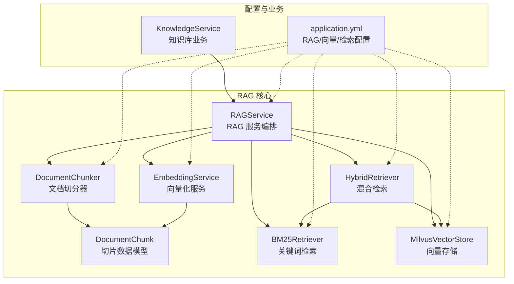
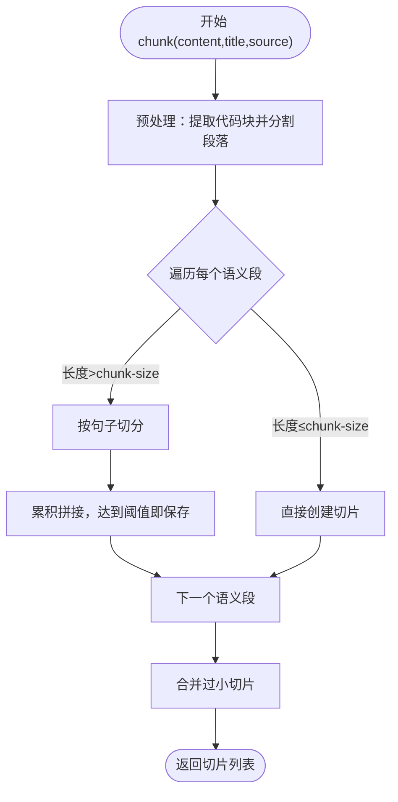
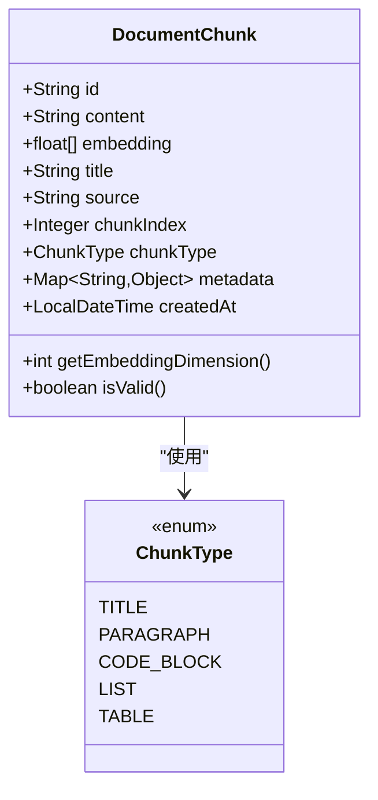
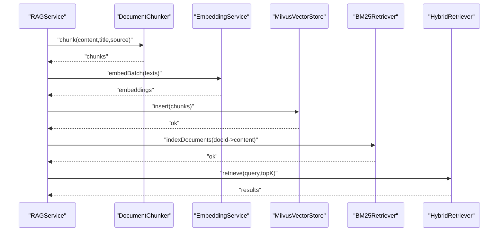
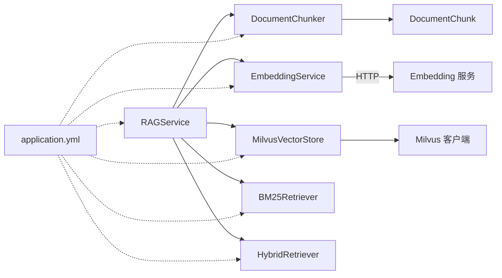

# 文档处理与切分

<cite>
**本文引用的文件**   
- [DocumentChunker.java](file://netdata-ai-backend/src/main/java/com/netdata/ops/core/rag/DocumentChunker.java)
- [DocumentChunk.java](file://netdata-ai-backend/src/main/java/com/netdata/ops/core/rag/DocumentChunk.java)
- [RAGService.java](file://netdata-ai-backend/src/main/java/com/netdata/ops/core/rag/RAGService.java)
- [EmbeddingService.java](file://netdata-ai-backend/src/main/java/com/netdata/ops/core/rag/EmbeddingService.java)
- [BM25Retriever.java](file://netdata-ai-backend/src/main/java/com/netdata/ops/core/rag/BM25Retriever.java)
- [HybridRetriever.java](file://netdata-ai-backend/src/main/java/com/netdata/ops/core/rag/HybridRetriever.java)
- [MilvusVectorStore.java](file://netdata-ai-backend/src/main/java/com/netdata/ops/core/rag/MilvusVectorStore.java)
- [application.yml](file://netdata-ai-backend/src/main/resources/application.yml)
- [KnowledgeService.java](file://netdata-ai-backend/src/main/java/com/netdata/ops/service/KnowledgeService.java)
</cite>

## 目录
1. [简介](#简介)
2. [项目结构](#项目结构)
3. [核心组件](#核心组件)
4. [架构总览](#架构总览)
5. [组件详解](#组件详解)
6. [依赖关系分析](#依赖关系分析)
7. [性能考量](#性能考量)
8. [故障排查指南](#故障排查指南)
9. [结论](#结论)
10. [附录](#附录)

## 简介
本技术文档围绕“文档处理与切分”模块展开，重点解析以下内容：
- DocumentChunker 的实现原理与语义切分算法工作机制
- DocumentChunk 数据模型的设计与字段作用
- 文档切分最佳实践：切分大小、重叠策略、语义边界检测
- 具体使用示例与流程图
- 性能优化建议与常见问题解决方案

## 项目结构
本模块位于后端 Java 工程的 RAG 子系统中，核心文件如下：
- 文档切分器：DocumentChunker
- 切片数据模型：DocumentChunk
- RAG 服务编排：RAGService
- 向量化服务：EmbeddingService
- BM25 检索器：BM25Retriever
- 混合检索器：HybridRetriever
- 向量存储：MilvusVectorStore
- 配置：application.yml
- 知识库服务（业务层）：KnowledgeService

图表来源
- [DocumentChunker.java:32-104](file://netdata-ai-backend/src/main/java/com/netdata/ops/core/rag/DocumentChunker.java#L32-L104)
- [DocumentChunk.java:29-119](file://netdata-ai-backend/src/main/java/com/netdata/ops/core/rag/DocumentChunk.java#L29-L119)
- [RAGService.java:35-91](file://netdata-ai-backend/src/main/java/com/netdata/ops/core/rag/RAGService.java#L35-L91)
- [EmbeddingService.java:36-133](file://netdata-ai-backend/src/main/java/com/netdata/ops/core/rag/EmbeddingService.java#L36-L133)
- [BM25Retriever.java:38-124](file://netdata-ai-backend/src/main/java/com/netdata/ops/core/rag/BM25Retriever.java#L38-L124)
- [HybridRetriever.java:40-100](file://netdata-ai-backend/src/main/java/com/netdata/ops/core/rag/HybridRetriever.java#L40-L100)
- [MilvusVectorStore.java:42-254](file://netdata-ai-backend/src/main/java/com/netdata/ops/core/rag/MilvusVectorStore.java#L42-L254)
- [application.yml:114-136](file://netdata-ai-backend/src/main/resources/application.yml#L114-L136)
- [KnowledgeService.java:68-92](file://netdata-ai-backend/src/main/java/com/netdata/ops/service/KnowledgeService.java#L68-L92)

章节来源
- [DocumentChunker.java:32-104](file://netdata-ai-backend/src/main/java/com/netdata/ops/core/rag/DocumentChunker.java#L32-L104)
- [DocumentChunk.java:29-119](file://netdata-ai-backend/src/main/java/com/netdata/ops/core/rag/DocumentChunk.java#L29-L119)
- [RAGService.java:35-91](file://netdata-ai-backend/src/main/java/com/netdata/ops/core/rag/RAGService.java#L35-L91)
- [application.yml:114-136](file://netdata-ai-backend/src/main/resources/application.yml#L114-L136)

## 核心组件
- DocumentChunker：负责将原始文档按段落/标题/代码块/表格/列表等语义边界进行切分，并在必要时进行句子级切分与最小切片合并。
- DocumentChunk：切片数据模型，承载内容、来源、类型、向量、元数据等信息。
- RAGService：编排入库与检索流程，串联切分、向量化、存储与检索。
- EmbeddingService：调用本地 Embedding 服务，将文本批量向量化。
- BM25Retriever：基于词频的关键词检索，补充向量检索的不足。
- HybridRetriever：使用 RRF 融合向量与 BM25 检索结果。
- MilvusVectorStore：向量数据库存取，支持插入、搜索、删除与统计。

章节来源
- [DocumentChunker.java:32-104](file://netdata-ai-backend/src/main/java/com/netdata/ops/core/rag/DocumentChunker.java#L32-L104)
- [DocumentChunk.java:29-119](file://netdata-ai-backend/src/main/java/com/netdata/ops/core/rag/DocumentChunk.java#L29-L119)
- [RAGService.java:35-91](file://netdata-ai-backend/src/main/java/com/netdata/ops/core/rag/RAGService.java#L35-L91)
- [EmbeddingService.java:36-133](file://netdata-ai-backend/src/main/java/com/netdata/ops/core/rag/EmbeddingService.java#L36-L133)
- [BM25Retriever.java:38-124](file://netdata-ai-backend/src/main/java/com/netdata/ops/core/rag/BM25Retriever.java#L38-L124)
- [HybridRetriever.java:40-100](file://netdata-ai-backend/src/main/java/com/netdata/ops/core/rag/HybridRetriever.java#L40-L100)
- [MilvusVectorStore.java:42-254](file://netdata-ai-backend/src/main/java/com/netdata/ops/core/rag/MilvusVectorStore.java#L42-L254)

## 架构总览
文档处理与切分的整体流程如下：
- 入库阶段：切分 → 向量化 → Milvus 存储 → BM25 索引更新
- 检索阶段：混合检索（向量 + BM25）→ RRF 融合 → Top-K 返回

```mermaid
sequenceDiagram
participant Svc as "RAGService"
participant Chunker as "DocumentChunker"
participant Emb as "EmbeddingService"
participant Vec as "MilvusVectorStore"
participant BM25 as "BM25Retriever"
Svc->>Chunker : "chunk(content, title, source)"
Chunker-->>Svc : "List<DocumentChunk>"
Svc->>Emb : "embedBatch(texts)"
Emb-->>Svc : "List<float[]>"
Svc->>Vec : "insert(chunks)"
Vec-->>Svc : "insertCnt"
Svc->>BM25 : "indexDocuments(docId->content)"
BM25-->>Svc : "OK"
```

图表来源
- [RAGService.java:57-91](file://netdata-ai-backend/src/main/java/com/netdata/ops/core/rag/RAGService.java#L57-L91)
- [DocumentChunker.java:81-104](file://netdata-ai-backend/src/main/java/com/netdata/ops/core/rag/DocumentChunker.java#L81-L104)
- [EmbeddingService.java:101-133](file://netdata-ai-backend/src/main/java/com/netdata/ops/core/rag/EmbeddingService.java#L101-L133)
- [MilvusVectorStore.java:217-254](file://netdata-ai-backend/src/main/java/com/netdata/ops/core/rag/MilvusVectorStore.java#L217-L254)
- [BM25Retriever.java:118-124](file://netdata-ai-backend/src/main/java/com/netdata/ops/core/rag/BM25Retriever.java#L118-L124)

## 组件详解

### DocumentChunker 实现原理与语义切分算法
- 切分策略
  - 预处理：提取并临时替换代码块，避免代码块被切分破坏语法完整性。
  - 段落/标题/代码块/表格/列表识别：通过正则与规则识别不同类型的语义段。
  - 句子级切分：对超过设定阈值的段落按中英文句号/问号/感叹号与换行进行切分。
  - 最小切片合并：将过小的切片与相邻切片合并，保证语义连贯性。
- 关键参数（来自配置）
  - chunk-size：默认 500 字符
  - chunk-overlap：默认 50 字符
  - min-chunk-size：默认 100 字符
  - semantic-chunking：是否启用语义切分（默认开启）

图表来源
- [DocumentChunker.java:81-104](file://netdata-ai-backend/src/main/java/com/netdata/ops/core/rag/DocumentChunker.java#L81-L104)
- [DocumentChunker.java:112-147](file://netdata-ai-backend/src/main/java/com/netdata/ops/core/rag/DocumentChunker.java#L112-L147)
- [DocumentChunker.java:152-197](file://netdata-ai-backend/src/main/java/com/netdata/ops/core/rag/DocumentChunker.java#L152-L197)
- [DocumentChunker.java:267-297](file://netdata-ai-backend/src/main/java/com/netdata/ops/core/rag/DocumentChunker.java#L267-L297)

章节来源
- [DocumentChunker.java:34-56](file://netdata-ai-backend/src/main/java/com/netdata/ops/core/rag/DocumentChunker.java#L34-L56)
- [DocumentChunker.java:62-71](file://netdata-ai-backend/src/main/java/com/netdata/ops/core/rag/DocumentChunker.java#L62-L71)
- [DocumentChunker.java:81-104](file://netdata-ai-backend/src/main/java/com/netdata/ops/core/rag/DocumentChunker.java#L81-L104)
- [DocumentChunker.java:112-147](file://netdata-ai-backend/src/main/java/com/netdata/ops/core/rag/DocumentChunker.java#L112-L147)
- [DocumentChunker.java:152-197](file://netdata-ai-backend/src/main/java/com/netdata/ops/core/rag/DocumentChunker.java#L152-L197)
- [DocumentChunker.java:203-213](file://netdata-ai-backend/src/main/java/com/netdata/ops/core/rag/DocumentChunker.java#L203-L213)
- [DocumentChunker.java:218-232](file://netdata-ai-backend/src/main/java/com/netdata/ops/core/rag/DocumentChunker.java#L218-L232)
- [DocumentChunker.java:237-253](file://netdata-ai-backend/src/main/java/com/netdata/ops/core/rag/DocumentChunker.java#L237-L253)
- [DocumentChunker.java:267-297](file://netdata-ai-backend/src/main/java/com/netdata/ops/core/rag/DocumentChunker.java#L267-L297)
- [application.yml:114-124](file://netdata-ai-backend/src/main/resources/application.yml#L114-L124)

### DocumentChunk 数据模型设计
- 字段说明
  - id：切片唯一标识
  - content：切片内容（文本）
  - embedding：向量表示（BGE-M3，1024 维）
  - title/source：来源文档标题与来源路径/URL
  - chunkIndex：同一文档内的切片顺序索引
  - chunkType：切片类型（标题/段落/代码块/列表/表格）
  - metadata：扩展元数据
  - createdAt：创建时间
- 校验与维度
  - getEmbeddingDimension：返回向量维度
  - isValid：校验 content 非空且 embedding 维度为 1024

图表来源
- [DocumentChunk.java:29-119](file://netdata-ai-backend/src/main/java/com/netdata/ops/core/rag/DocumentChunk.java#L29-L119)

章节来源
- [DocumentChunk.java:31-75](file://netdata-ai-backend/src/main/java/com/netdata/ops/core/rag/DocumentChunk.java#L31-L75)
- [DocumentChunk.java:78-101](file://netdata-ai-backend/src/main/java/com/netdata/ops/core/rag/DocumentChunk.java#L78-L101)
- [DocumentChunk.java:107-118](file://netdata-ai-backend/src/main/java/com/netdata/ops/core/rag/DocumentChunk.java#L107-L118)

### RAGService：文档入库与检索编排
- 入库流程
  - 调用 DocumentChunker 进行切分
  - 使用 EmbeddingService 批量向量化
  - 写入 MilvusVectorStore
  - 更新 BM25Retriever 索引
- 检索流程
  - 调用 HybridRetriever 进行混合检索与 RRF 融合
  - 构建上下文与引用来源

图表来源
- [RAGService.java:57-91](file://netdata-ai-backend/src/main/java/com/netdata/ops/core/rag/RAGService.java#L57-L91)
- [RAGService.java:116-130](file://netdata-ai-backend/src/main/java/com/netdata/ops/core/rag/RAGService.java#L116-L130)
- [HybridRetriever.java:64-100](file://netdata-ai-backend/src/main/java/com/netdata/ops/core/rag/HybridRetriever.java#L64-L100)

章节来源
- [RAGService.java:57-91](file://netdata-ai-backend/src/main/java/com/netdata/ops/core/rag/RAGService.java#L57-L91)
- [RAGService.java:116-130](file://netdata-ai-backend/src/main/java/com/netdata/ops/core/rag/RAGService.java#L116-L130)
- [RAGService.java:140-175](file://netdata-ai-backend/src/main/java/com/netdata/ops/core/rag/RAGService.java#L140-L175)

### EmbeddingService：向量化服务
- 支持单条与批量向量化
- 使用 WebClient 调用本地 Embedding 服务（默认 BGE-M3）
- 提供余弦相似度计算工具方法

章节来源
- [EmbeddingService.java:38-48](file://netdata-ai-backend/src/main/java/com/netdata/ops/core/rag/EmbeddingService.java#L38-L48)
- [EmbeddingService.java:72-93](file://netdata-ai-backend/src/main/java/com/netdata/ops/core/rag/EmbeddingService.java#L72-L93)
- [EmbeddingService.java:101-133](file://netdata-ai-backend/src/main/java/com/netdata/ops/core/rag/EmbeddingService.java#L101-L133)
- [EmbeddingService.java:145-161](file://netdata-ai-backend/src/main/java/com/netdata/ops/core/rag/EmbeddingService.java#L145-L161)

### BM25Retriever：关键词检索
- 基于词频与 BM25 公式的关键词检索
- 支持批量索引与搜索
- 与向量检索互补，提升专有名词召回

章节来源
- [BM25Retriever.java:40-46](file://netdata-ai-backend/src/main/java/com/netdata/ops/core/rag/BM25Retriever.java#L40-L46)
- [BM25Retriever.java:84-124](file://netdata-ai-backend/src/main/java/com/netdata/ops/core/rag/BM25Retriever.java#L84-L124)
- [BM25Retriever.java:132-178](file://netdata-ai-backend/src/main/java/com/netdata/ops/core/rag/BM25Retriever.java#L132-L178)
- [BM25Retriever.java:201-212](file://netdata-ai-backend/src/main/java/com/netdata/ops/core/rag/BM25Retriever.java#L201-L212)

### HybridRetriever：RRF 融合
- 整合向量检索与 BM25 检索结果
- 使用 RRF（Reciprocal Rank Fusion）融合，无需调参，鲁棒性好

章节来源
- [HybridRetriever.java:46-56](file://netdata-ai-backend/src/main/java/com/netdata/ops/core/rag/HybridRetriever.java#L46-L56)
- [HybridRetriever.java:64-100](file://netdata-ai-backend/src/main/java/com/netdata/ops/core/rag/HybridRetriever.java#L64-L100)
- [HybridRetriever.java:134-193](file://netdata-ai-backend/src/main/java/com/netdata/ops/core/rag/HybridRetriever.java#L134-L193)

### MilvusVectorStore：向量存储
- 自动创建集合与索引（IVF_FLAT，COSINE）
- 支持插入、搜索、删除与统计查询
- 与 RAGService 协同完成向量入库与检索

章节来源
- [MilvusVectorStore.java:80-103](file://netdata-ai-backend/src/main/java/com/netdata/ops/core/rag/MilvusVectorStore.java#L80-L103)
- [MilvusVectorStore.java:127-209](file://netdata-ai-backend/src/main/java/com/netdata/ops/core/rag/MilvusVectorStore.java#L127-L209)
- [MilvusVectorStore.java:217-254](file://netdata-ai-backend/src/main/java/com/netdata/ops/core/rag/MilvusVectorStore.java#L217-L254)
- [MilvusVectorStore.java:274-324](file://netdata-ai-backend/src/main/java/com/netdata/ops/core/rag/MilvusVectorStore.java#L274-L324)
- [MilvusVectorStore.java:355-368](file://netdata-ai-backend/src/main/java/com/netdata/ops/core/rag/MilvusVectorStore.java#L355-L368)
- [MilvusVectorStore.java:375-390](file://netdata-ai-backend/src/main/java/com/netdata/ops/core/rag/MilvusVectorStore.java#L375-L390)

## 依赖关系分析
- 组件耦合
  - RAGService 依赖 DocumentChunker、EmbeddingService、MilvusVectorStore、BM25Retriever、HybridRetriever
  - DocumentChunker 依赖 DocumentChunk（仅类型与 builder）
  - EmbeddingService 依赖外部 Embedding 服务（HTTP）
  - MilvusVectorStore 依赖 Milvus 客户端
- 配置依赖
  - application.yml 提供 RAG、检索、向量维度等关键参数

图表来源
- [RAGService.java:37-41](file://netdata-ai-backend/src/main/java/com/netdata/ops/core/rag/RAGService.java#L37-L41)
- [DocumentChunker.java:32-32](file://netdata-ai-backend/src/main/java/com/netdata/ops/core/rag/DocumentChunker.java#L32-L32)
- [EmbeddingService.java:36-50](file://netdata-ai-backend/src/main/java/com/netdata/ops/core/rag/EmbeddingService.java#L36-L50)
- [MilvusVectorStore.java:42-59](file://netdata-ai-backend/src/main/java/com/netdata/ops/core/rag/MilvusVectorStore.java#L42-L59)
- [application.yml:114-136](file://netdata-ai-backend/src/main/resources/application.yml#L114-L136)

章节来源
- [RAGService.java:37-41](file://netdata-ai-backend/src/main/java/com/netdata/ops/core/rag/RAGService.java#L37-L41)
- [application.yml:114-136](file://netdata-ai-backend/src/main/resources/application.yml#L114-L136)

## 性能考量
- 切分参数
  - chunk-size：建议根据文档类型调整（技术文档可适当增大，降低切片数量；长篇说明可减小，提升定位精度）
  - chunk-overlap：保留 50–100 字符重叠，有助于跨切片语义连续性
  - min-chunk-size：确保最小语义完整性，避免过短切片
- 向量化
  - EmbeddingService 支持 batch-size 控制，避免单次请求过大导致内存压力
  - timeout 控制防止阻塞
- 检索
  - vector-top-k 与 bm25-top-k 控制候选集规模，final-top-k 控制最终返回
  - rrf-k 默认 60，通常无需调整
- 存储
  - Milvus 使用 IVF_FLAT + COSINE，nlist 可根据数据规模调优
  - 向量维度固定 1024，创建后不可更改

章节来源
- [application.yml:114-136](file://netdata-ai-backend/src/main/resources/application.yml#L114-L136)
- [EmbeddingService.java:44-48](file://netdata-ai-backend/src/main/java/com/netdata/ops/core/rag/EmbeddingService.java#L44-L48)
- [EmbeddingService.java:101-133](file://netdata-ai-backend/src/main/java/com/netdata/ops/core/rag/EmbeddingService.java#L101-L133)
- [MilvusVectorStore.java:187-192](file://netdata-ai-backend/src/main/java/com/netdata/ops/core/rag/MilvusVectorStore.java#L187-L192)

## 故障排查指南
- 向量化为空或异常
  - 现象：Embedding 服务返回空结果
  - 处理：检查 Embedding 服务地址、超时设置、网络连通性
  - 参考：[EmbeddingService.java:72-93](file://netdata-ai-backend/src/main/java/com/netdata/ops/core/rag/EmbeddingService.java#L72-L93)
- Milvus 不可用
  - 现象：连接失败或不可用
  - 处理：确认 Milvus 地址、端口、数据库名；RAGService 会在不可用时降级
  - 参考：[MilvusVectorStore.java:80-103](file://netdata-ai-backend/src/main/java/com/netdata/ops/core/rag/MilvusVectorStore.java#L80-L103)
- 切片无效
  - 现象：isValid 返回 false
  - 处理：检查 embedding 维度是否为 1024，content 是否为空
  - 参考：[DocumentChunk.java:115-118](file://netdata-ai-backend/src/main/java/com/netdata/ops/core/rag/DocumentChunk.java#L115-L118)
- BM25 索引删除问题
  - 现象：按条件删除需重建索引
  - 处理：生产环境考虑增量更新机制
  - 参考：[RAGService.java:182-190](file://netdata-ai-backend/src/main/java/com/netdata/ops/core/rag/RAGService.java#L182-L190)

章节来源
- [EmbeddingService.java:72-93](file://netdata-ai-backend/src/main/java/com/netdata/ops/core/rag/EmbeddingService.java#L72-L93)
- [MilvusVectorStore.java:80-103](file://netdata-ai-backend/src/main/java/com/netdata/ops/core/rag/MilvusVectorStore.java#L80-L103)
- [DocumentChunk.java:115-118](file://netdata-ai-backend/src/main/java/com/netdata/ops/core/rag/DocumentChunk.java#L115-L118)
- [RAGService.java:182-190](file://netdata-ai-backend/src/main/java/com/netdata/ops/core/rag/RAGService.java#L182-L190)

## 结论
本模块通过“语义切分 + 向量检索 + BM25 关键词检索 + RRF 融合”的组合，实现了高质量的知识入库与检索能力。DocumentChunker 的预处理、段落识别、句子切分与最小切片合并策略，配合 EmbeddingService 的批量向量化与 Milvus 的高效存储，形成了稳定可靠的 RAG 流水线。建议在生产环境中结合业务文档类型与规模，合理配置切分参数与检索参数，并关注向量化与 Milvus 的资源瓶颈。

## 附录

### 配置项速览（节选）
- RAG 切分参数
  - rag.chunk.chunk-size：默认 500
  - rag.chunk.chunk-overlap：默认 50
  - rag.chunk.min-chunk-size：默认 100
  - rag.chunk.semantic-chunking：默认 true
- 检索参数
  - rag.retrieval.vector-top-k：默认 20
  - rag.retrieval.bm25-top-k：默认 20
  - rag.retrieval.final-top-k：默认 5
  - rag.retrieval.rrf-k：默认 60
- 向量参数
  - milvus.vector-dimension：默认 1024
  - embedding.batch-size：默认 32
  - embedding.timeout：默认 30 秒

章节来源
- [application.yml:114-136](file://netdata-ai-backend/src/main/resources/application.yml#L114-L136)

### 使用示例（路径指引）
- 入库流程（RAGService）
  - 入库入口：[RAGService.java:57-91](file://netdata-ai-backend/src/main/java/com/netdata/ops/core/rag/RAGService.java#L57-L91)
  - 混合检索入口：[RAGService.java:116-130](file://netdata-ai-backend/src/main/java/com/netdata/ops/core/rag/RAGService.java#L116-L130)
- 切分流程（DocumentChunker）
  - 入口方法：[DocumentChunker.java:81-104](file://netdata-ai-backend/src/main/java/com/netdata/ops/core/rag/DocumentChunker.java#L81-L104)
  - 句子切分：[DocumentChunker.java:203-213](file://netdata-ai-backend/src/main/java/com/netdata/ops/core/rag/DocumentChunker.java#L203-L213)
  - 类型检测：[DocumentChunker.java:218-232](file://netdata-ai-backend/src/main/java/com/netdata/ops/core/rag/DocumentChunker.java#L218-L232)
- 向量化（EmbeddingService）
  - 批量向量化：[EmbeddingService.java:101-133](file://netdata-ai-backend/src/main/java/com/netdata/ops/core/rag/EmbeddingService.java#L101-L133)
- 检索（HybridRetriever）
  - RRF 融合：[HybridRetriever.java:134-193](file://netdata-ai-backend/src/main/java/com/netdata/ops/core/rag/HybridRetriever.java#L134-L193)
- 存储（MilvusVectorStore）
  - 插入：[MilvusVectorStore.java:217-254](file://netdata-ai-backend/src/main/java/com/netdata/ops/core/rag/MilvusVectorStore.java#L217-L254)
  - 搜索：[MilvusVectorStore.java:274-324](file://netdata-ai-backend/src/main/java/com/netdata/ops/core/rag/MilvusVectorStore.java#L274-L324)