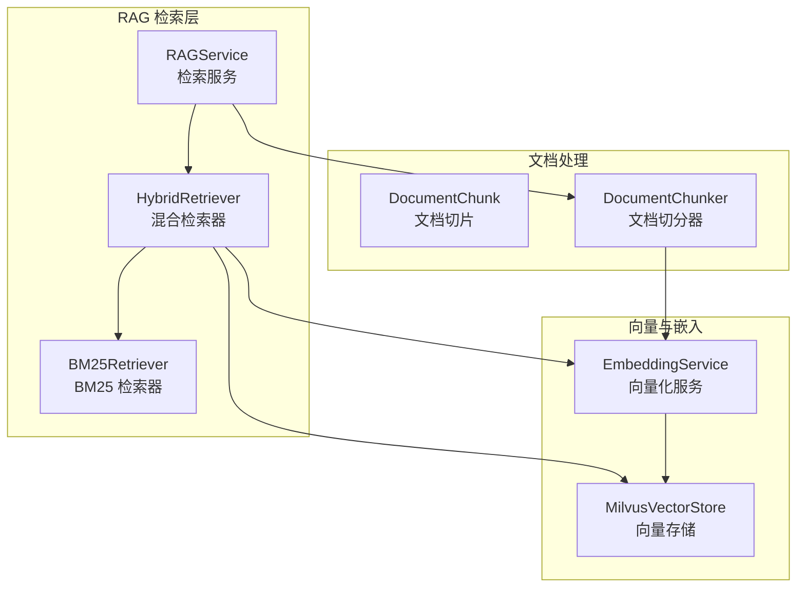
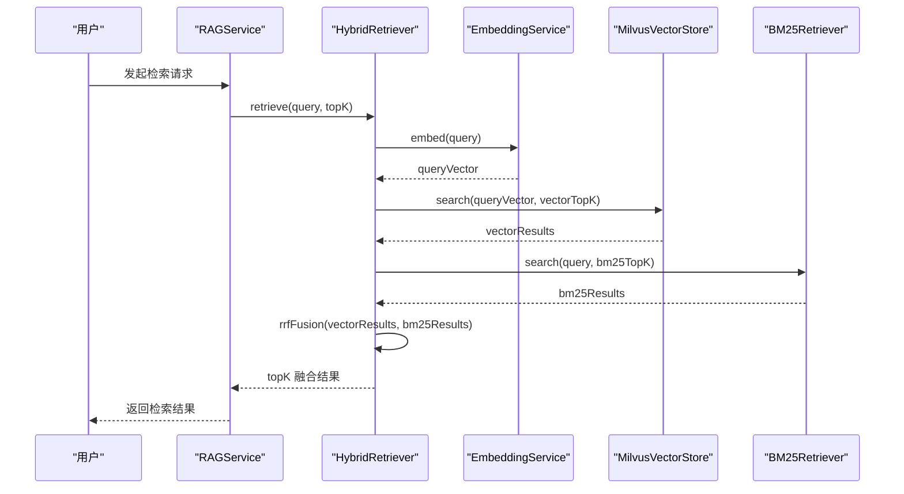
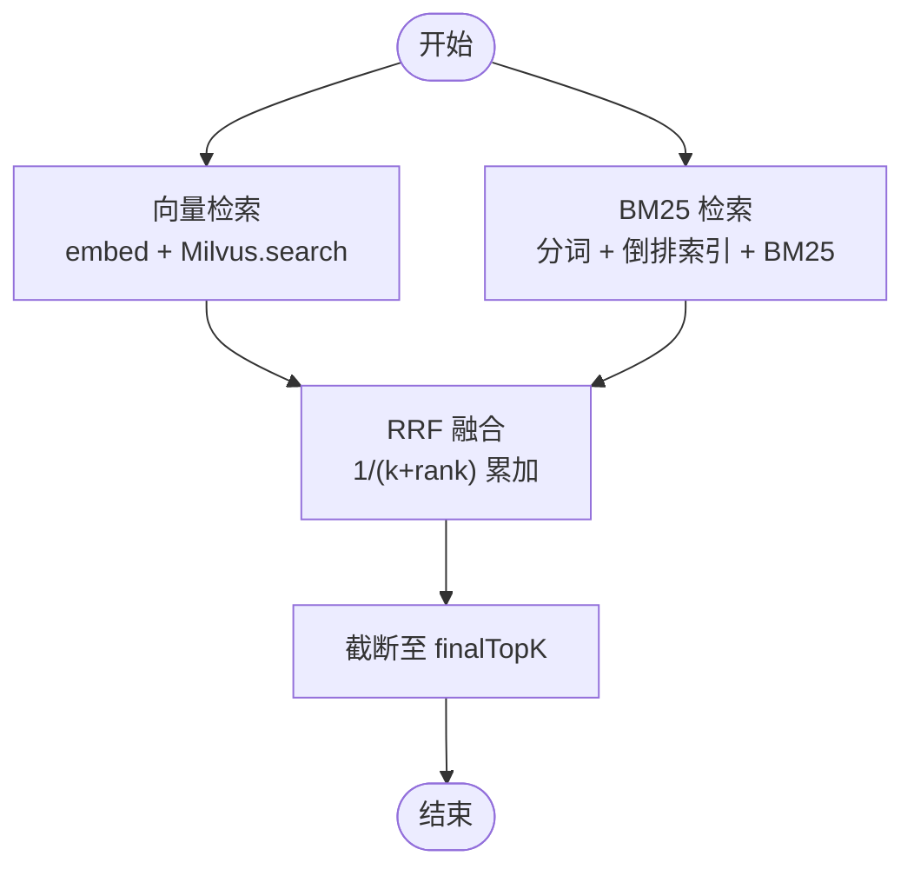
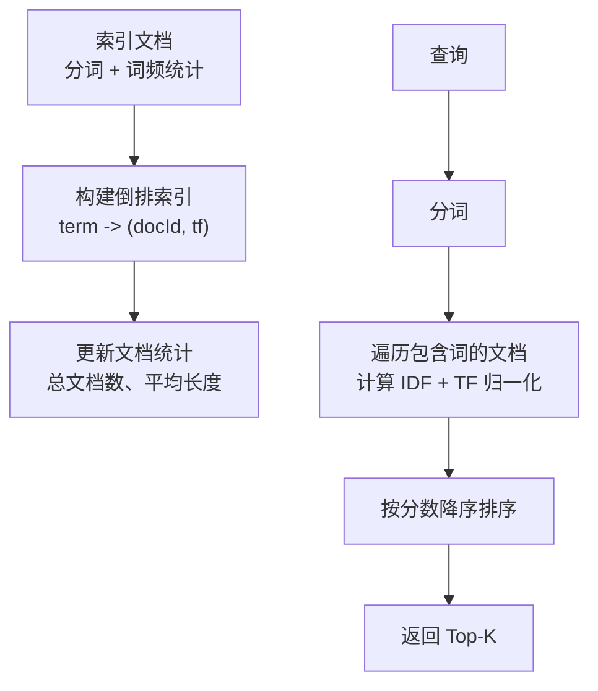
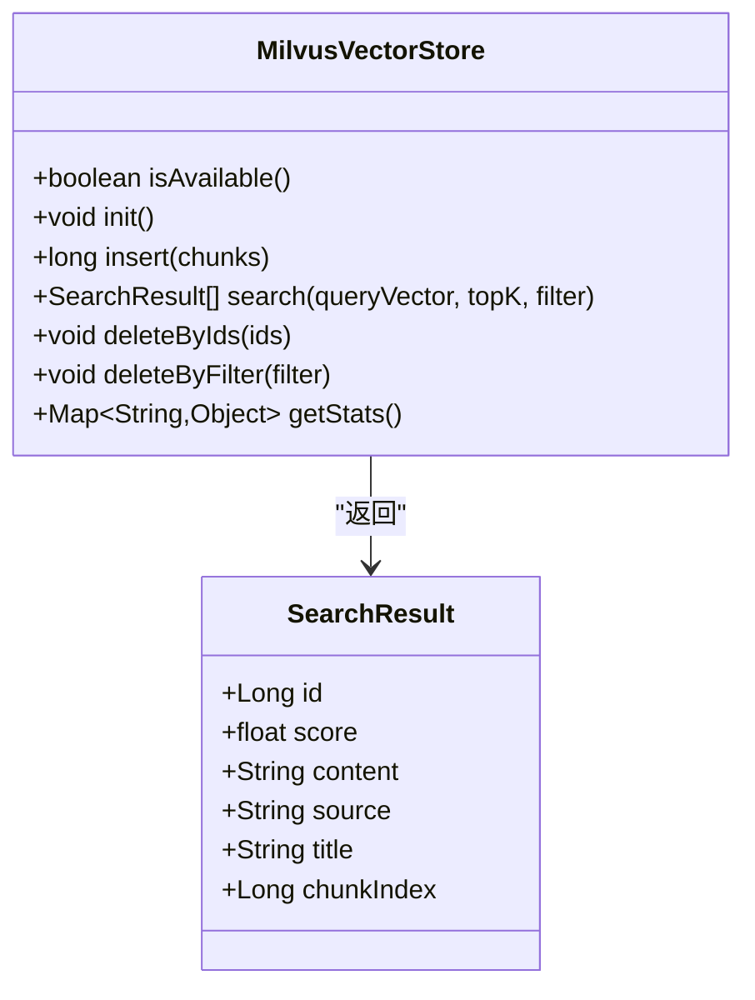
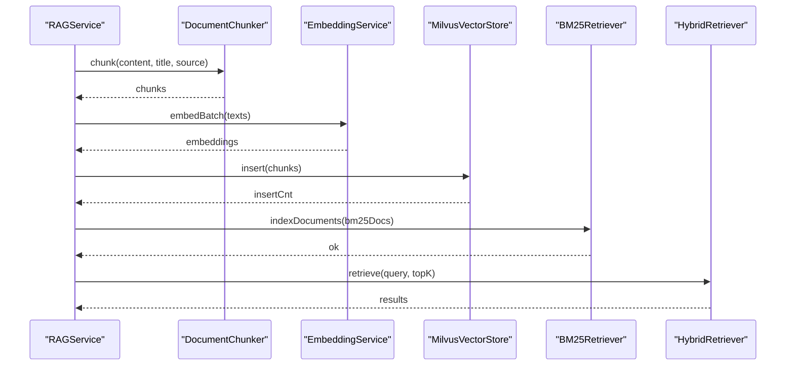
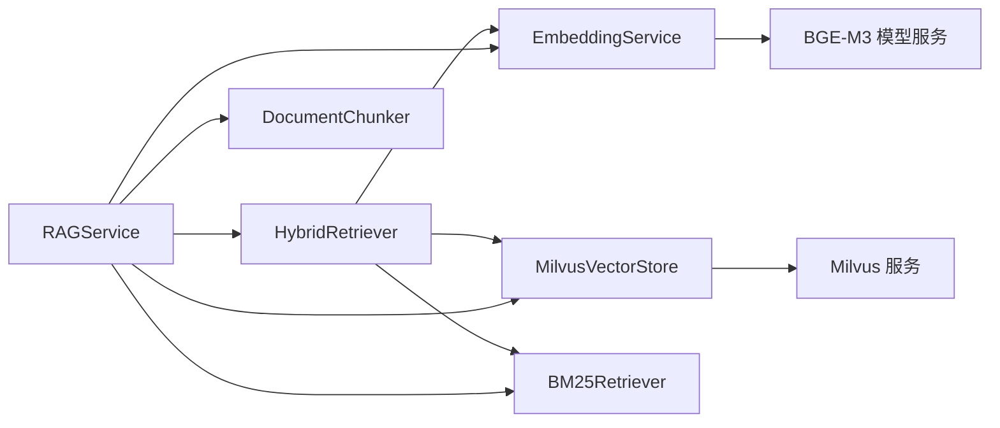

# 混合检索器

<cite>
**本文引用的文件**
- [HybridRetriever.java](file://netdata-ai-backend/src/main/java/com/netdata/ops/core/rag/HybridRetriever.java)
- [BM25Retriever.java](file://netdata-ai-backend/src/main/java/com/netdata/ops/core/rag/BM25Retriever.java)
- [MilvusVectorStore.java](file://netdata-ai-backend/src/main/java/com/netdata/ops/core/rag/MilvusVectorStore.java)
- [RAGService.java](file://netdata-ai-backend/src/main/java/com/netdata/ops/core/rag/RAGService.java)
- [EmbeddingService.java](file://netdata-ai-backend/src/main/java/com/netdata/ops/core/rag/EmbeddingService.java)
- [DocumentChunk.java](file://netdata-ai-backend/src/main/java/com/netdata/ops/core/rag/DocumentChunk.java)
- [DocumentChunker.java](file://netdata-ai-backend/src/main/java/com/netdata/ops/core/rag/DocumentChunker.java)
- [application.yml](file://netdata-ai-backend/src/main/resources/application.yml)
</cite>

## 目录
1. [简介](#简介)
2. [项目结构](#项目结构)
3. [核心组件](#核心组件)
4. [架构总览](#架构总览)
5. [详细组件分析](#详细组件分析)
6. [依赖关系分析](#依赖关系分析)
7. [性能考量](#性能考量)
8. [故障排查指南](#故障排查指南)
9. [结论](#结论)
10. [附录](#附录)

## 简介
本文件面向“混合检索器”的技术文档，系统性阐述 HybridRetriever 的设计原理与实现架构，重点包括：
- 向量检索与 BM25 检索的协同工作机制
- RRF（Reciprocal Rank Fusion）融合算法的数学原理与实现细节（权重调节与排序公式）
- 混合检索的查询流程（并行检索、结果合并、分数计算等）
- 不同检索策略的性能对比与适用场景分析
- 配置参数与调优建议

## 项目结构
混合检索器位于后端 Java 工程的 RAG 子模块中，围绕检索、向量化、向量存储与 BM25 索引展开。核心文件如下：
- 混合检索器：HybridRetriever
- BM25 检索器：BM25Retriever
- 向量存储：MilvusVectorStore
- 检索服务：RAGService
- 向量化服务：EmbeddingService
- 文档切片：DocumentChunk、DocumentChunker
- 配置：application.yml

图表来源
- [HybridRetriever.java:1-247](file://netdata-ai-backend/src/main/java/com/netdata/ops/core/rag/HybridRetriever.java#L1-L247)
- [BM25Retriever.java:1-257](file://netdata-ai-backend/src/main/java/com/netdata/ops/core/rag/BM25Retriever.java#L1-L257)
- [MilvusVectorStore.java:1-406](file://netdata-ai-backend/src/main/java/com/netdata/ops/core/rag/MilvusVectorStore.java#L1-L406)
- [RAGService.java:1-212](file://netdata-ai-backend/src/main/java/com/netdata/ops/core/rag/RAGService.java#L1-L212)
- [EmbeddingService.java:1-190](file://netdata-ai-backend/src/main/java/com/netdata/ops/core/rag/EmbeddingService.java#L1-L190)
- [DocumentChunk.java:1-120](file://netdata-ai-backend/src/main/java/com/netdata/ops/core/rag/DocumentChunk.java#L1-L120)
- [DocumentChunker.java:1-312](file://netdata-ai-backend/src/main/java/com/netdata/ops/core/rag/DocumentChunker.java#L1-L312)

章节来源
- [application.yml:112-137](file://netdata-ai-backend/src/main/resources/application.yml#L112-L137)

## 核心组件
- HybridRetriever：负责并行执行向量检索与 BM25 检索，并使用 RRF 融合算法对结果进行排序与打分。
- BM25Retriever：基于倒排索引与 BM25 公式进行关键词检索，补充向量检索在术语、缩写等方面的不足。
- MilvusVectorStore：封装 Milvus 客户端，提供集合创建、向量插入、相似度搜索、删除等能力。
- RAGService：对外提供文档入库与检索接口，串联切分、向量化、存储与检索流程。
- EmbeddingService：调用本地 BGE-M3 模型服务，将文本转换为 1024 维向量。
- DocumentChunk/DocumentChunker：文档切片与语义切分，保证检索片段的语义完整性。

章节来源
- [HybridRetriever.java:40-100](file://netdata-ai-backend/src/main/java/com/netdata/ops/core/rag/HybridRetriever.java#L40-L100)
- [BM25Retriever.java:38-178](file://netdata-ai-backend/src/main/java/com/netdata/ops/core/rag/BM25Retriever.java#L38-L178)
- [MilvusVectorStore.java:42-103](file://netdata-ai-backend/src/main/java/com/netdata/ops/core/rag/MilvusVectorStore.java#L42-L103)
- [RAGService.java:35-130](file://netdata-ai-backend/src/main/java/com/netdata/ops/core/rag/RAGService.java#L35-L130)
- [EmbeddingService.java:36-93](file://netdata-ai-backend/src/main/java/com/netdata/ops/core/rag/EmbeddingService.java#L36-L93)
- [DocumentChunk.java:25-120](file://netdata-ai-backend/src/main/java/com/netdata/ops/core/rag/DocumentChunk.java#L25-L120)
- [DocumentChunker.java:30-104](file://netdata-ai-backend/src/main/java/com/netdata/ops/core/rag/DocumentChunker.java#L30-L104)

## 架构总览
混合检索的整体流程如下：
1. 用户发起检索请求
2. HybridRetriever 并行执行向量检索与 BM25 检索
3. 使用 RRF 融合算法对两个检索结果进行排序与打分
4. 返回 Top-K 的融合结果

图表来源
- [RAGService.java:127-130](file://netdata-ai-backend/src/main/java/com/netdata/ops/core/rag/RAGService.java#L127-L130)
- [HybridRetriever.java:64-100](file://netdata-ai-backend/src/main/java/com/netdata/ops/core/rag/HybridRetriever.java#L64-L100)
- [EmbeddingService.java:72-93](file://netdata-ai-backend/src/main/java/com/netdata/ops/core/rag/EmbeddingService.java#L72-L93)
- [MilvusVectorStore.java:274-324](file://netdata-ai-backend/src/main/java/com/netdata/ops/core/rag/MilvusVectorStore.java#L274-L324)
- [BM25Retriever.java:132-178](file://netdata-ai-backend/src/main/java/com/netdata/ops/core/rag/BM25Retriever.java#L132-L178)

## 详细组件分析

### 混合检索器（HybridRetriever）
- 设计要点
  - 并行检索：向量检索与 BM25 检索并行执行，减少总延迟
  - RRF 融合：无需调参，鲁棒性强；考虑排名而非原始分数，消除尺度差异
  - 可配置：支持向量 Top-K、BM25 Top-K、最终 Top-K、RRF 平滑参数等
- 关键流程
  - 向量检索：将查询文本向量化后，调用 Milvus 进行相似度搜索
  - BM25 检索：对查询进行分词后，基于倒排索引与 BM25 公式计算分数
  - RRF 融合：对每个文档的两个排名分别计算 1/(k+rank)，累加得到 RRF 分数并排序
  - 结果返回：限制最终返回数量并记录各分数

图表来源
- [HybridRetriever.java:64-100](file://netdata-ai-backend/src/main/java/com/netdata/ops/core/rag/HybridRetriever.java#L64-L100)
- [HybridRetriever.java:134-193](file://netdata-ai-backend/src/main/java/com/netdata/ops/core/rag/HybridRetriever.java#L134-L193)

章节来源
- [HybridRetriever.java:11-36](file://netdata-ai-backend/src/main/java/com/netdata/ops/core/rag/HybridRetriever.java#L11-L36)
- [HybridRetriever.java:46-56](file://netdata-ai-backend/src/main/java/com/netdata/ops/core/rag/HybridRetriever.java#L46-L56)
- [HybridRetriever.java:108-120](file://netdata-ai-backend/src/main/java/com/netdata/ops/core/rag/HybridRetriever.java#L108-L120)
- [HybridRetriever.java:134-193](file://netdata-ai-backend/src/main/java/com/netdata/ops/core/rag/HybridRetriever.java#L134-L193)

### BM25 检索器（BM25Retriever）
- 设计要点
  - 倒排索引：词 -> 文档列表（含词频）
  - BM25 公式：考虑词频饱和与文档长度归一化
  - 分词策略：简化实现（按空格与标点分割），生产环境建议使用专业分词器
- 关键流程
  - 索引阶段：文档入库时构建倒排索引与文档长度统计
  - 检索阶段：查询分词后，遍历包含查询词的文档，计算 BM25 分数并排序

图表来源
- [BM25Retriever.java:84-124](file://netdata-ai-backend/src/main/java/com/netdata/ops/core/rag/BM25Retriever.java#L84-L124)
- [BM25Retriever.java:143-178](file://netdata-ai-backend/src/main/java/com/netdata/ops/core/rag/BM25Retriever.java#L143-L178)
- [BM25Retriever.java:188-190](file://netdata-ai-backend/src/main/java/com/netdata/ops/core/rag/BM25Retriever.java#L188-L190)
- [BM25Retriever.java:201-212](file://netdata-ai-backend/src/main/java/com/netdata/ops/core/rag/BM25Retriever.java#L201-L212)

章节来源
- [BM25Retriever.java:11-34](file://netdata-ai-backend/src/main/java/com/netdata/ops/core/rag/BM25Retriever.java#L11-L34)
- [BM25Retriever.java:43-45](file://netdata-ai-backend/src/main/java/com/netdata/ops/core/rag/BM25Retriever.java#L43-L45)
- [BM25Retriever.java:84-124](file://netdata-ai-backend/src/main/java/com/netdata/ops/core/rag/BM25Retriever.java#L84-L124)
- [BM25Retriever.java:143-178](file://netdata-ai-backend/src/main/java/com/netdata/ops/core/rag/BM25Retriever.java#L143-L178)

### 向量存储（MilvusVectorStore）
- 设计要点
  - 集合结构：主键、内容、向量、来源、标题、切片索引
  - 索引类型：IVF_FLAT（平衡性能与精度）
  - 相似度：COSINE（适合语义检索）
  - 可选依赖：连接失败不中断整体流程，RAGService 调用前检查可用性
- 关键流程
  - 初始化：连接 Milvus、检查并创建集合
  - 插入：将切片批量插入集合
  - 搜索：根据查询向量进行相似度搜索，支持过滤条件
  - 删除：按 ID 或过滤条件删除

图表来源
- [MilvusVectorStore.java:42-103](file://netdata-ai-backend/src/main/java/com/netdata/ops/core/rag/MilvusVectorStore.java#L42-L103)
- [MilvusVectorStore.java:217-254](file://netdata-ai-backend/src/main/java/com/netdata/ops/core/rag/MilvusVectorStore.java#L217-L254)
- [MilvusVectorStore.java:274-324](file://netdata-ai-backend/src/main/java/com/netdata/ops/core/rag/MilvusVectorStore.java#L274-L324)
- [MilvusVectorStore.java:397-404](file://netdata-ai-backend/src/main/java/com/netdata/ops/core/rag/MilvusVectorStore.java#L397-L404)

章节来源
- [MilvusVectorStore.java:22-39](file://netdata-ai-backend/src/main/java/com/netdata/ops/core/rag/MilvusVectorStore.java#L22-L39)
- [MilvusVectorStore.java:127-209](file://netdata-ai-backend/src/main/java/com/netdata/ops/core/rag/MilvusVectorStore.java#L127-L209)
- [MilvusVectorStore.java:274-324](file://netdata-ai-backend/src/main/java/com/netdata/ops/core/rag/MilvusVectorStore.java#L274-L324)

### 检索服务（RAGService）
- 设计要点
  - 文档入库：切分 -> 向量化 -> 存储 -> 更新 BM25 索引
  - 知识检索：委托 HybridRetriever 执行混合检索
  - 上下文构建：将检索结果格式化为 Prompt 上下文
- 关键流程
  - 入库：切分文档、批量向量化、插入 Milvus、更新 BM25 索引
  - 检索：直接调用 HybridRetriever.retrieve
  - 上下文：为 LLM 生成提供结构化上下文

图表来源
- [RAGService.java:57-91](file://netdata-ai-backend/src/main/java/com/netdata/ops/core/rag/RAGService.java#L57-L91)
- [RAGService.java:116-130](file://netdata-ai-backend/src/main/java/com/netdata/ops/core/rag/RAGService.java#L116-L130)
- [RAGService.java:140-157](file://netdata-ai-backend/src/main/java/com/netdata/ops/core/rag/RAGService.java#L140-L157)

章节来源
- [RAGService.java:43-91](file://netdata-ai-backend/src/main/java/com/netdata/ops/core/rag/RAGService.java#L43-L91)
- [RAGService.java:116-130](file://netdata-ai-backend/src/main/java/com/netdata/ops/core/rag/RAGService.java#L116-L130)
- [RAGService.java:140-175](file://netdata-ai-backend/src/main/java/com/netdata/ops/core/rag/RAGService.java#L140-L175)

### 向量化服务（EmbeddingService）
- 设计要点
  - 调用本地 BGE-M3 模型服务，输出 1024 维向量
  - 支持批量处理，设置超时与批次大小
  - 提供余弦相似度计算工具方法
- 关键流程
  - 单条向量化：构造请求、发送、解析响应
  - 批量向量化：分批处理，累计结果

章节来源
- [EmbeddingService.java:66-93](file://netdata-ai-backend/src/main/java/com/netdata/ops/core/rag/EmbeddingService.java#L66-L93)
- [EmbeddingService.java:95-133](file://netdata-ai-backend/src/main/java/com/netdata/ops/core/rag/EmbeddingService.java#L95-L133)
- [EmbeddingService.java:135-161](file://netdata-ai-backend/src/main/java/com/netdata/ops/core/rag/EmbeddingService.java#L135-L161)

### 文档切片与切分（DocumentChunk/DocumentChunker）
- 设计要点
  - 切片实体：包含内容、向量、元数据、类型、索引等
  - 切分策略：先按段落/标题分割，再按句子与阈值进行语义切分，最后合并过小切片
  - 类型识别：标题、段落、代码块、列表、表格
- 关键流程
  - 预处理：提取代码块并替换占位符
  - 切分：按句子切分，超过阈值处切分
  - 合并：将过小切片合并到相邻切片

章节来源
- [DocumentChunk.java:29-120](file://netdata-ai-backend/src/main/java/com/netdata/ops/core/rag/DocumentChunk.java#L29-L120)
- [DocumentChunker.java:81-104](file://netdata-ai-backend/src/main/java/com/netdata/ops/core/rag/DocumentChunker.java#L81-L104)
- [DocumentChunker.java:112-147](file://netdata-ai-backend/src/main/java/com/netdata/ops/core/rag/DocumentChunker.java#L112-L147)
- [DocumentChunker.java:152-197](file://netdata-ai-backend/src/main/java/com/netdata/ops/core/rag/DocumentChunker.java#L152-L197)
- [DocumentChunker.java:218-232](file://netdata-ai-backend/src/main/java/com/netdata/ops/core/rag/DocumentChunker.java#L218-L232)
- [DocumentChunker.java:267-297](file://netdata-ai-backend/src/main/java/com/netdata/ops/core/rag/DocumentChunker.java#L267-L297)

## 依赖关系分析
- 组件耦合
  - HybridRetriever 依赖 EmbeddingService、MilvusVectorStore、BM25Retriever
  - RAGService 依赖 DocumentChunker、EmbeddingService、MilvusVectorStore、BM25Retriever、HybridRetriever
  - MilvusVectorStore 依赖外部 Milvus 服务
  - EmbeddingService 依赖本地 BGE-M3 模型服务
- 外部依赖
  - Milvus：向量检索与存储
  - BGE-M3：文本向量化
  - Spring Boot：配置与依赖注入

图表来源
- [HybridRetriever.java:42-44](file://netdata-ai-backend/src/main/java/com/netdata/ops/core/rag/HybridRetriever.java#L42-L44)
- [RAGService.java:37-41](file://netdata-ai-backend/src/main/java/com/netdata/ops/core/rag/RAGService.java#L37-L41)
- [EmbeddingService.java:38-42](file://netdata-ai-backend/src/main/java/com/netdata/ops/core/rag/EmbeddingService.java#L38-L42)
- [MilvusVectorStore.java:44-54](file://netdata-ai-backend/src/main/java/com/netdata/ops/core/rag/MilvusVectorStore.java#L44-L54)

## 性能考量
- 并行检索
  - 向量检索与 BM25 检索并行执行，缩短总延迟
- RRF 融合
  - 无需调参，鲁棒性好；考虑排名而非原始分数，消除不同检索器分数尺度差异
- 向量检索
  - Milvus 使用 COSINE 相似度与 IVF_FLAT 索引，平衡性能与精度
  - 向量维度固定为 1024（BGE-M3），创建后不可更改
- BM25 检索
  - 倒排索引与 IDF/TF 归一化，适合关键词精确匹配
  - 分词策略为简化实现，生产环境建议使用专业分词器
- 批量处理
  - EmbeddingService 支持批量向量化，设置批次大小与超时，避免内存溢出
- 可选依赖降级
  - Milvus 不可用时，系统仍可运行（向量检索返回空结果），RAGService 调用前检查可用性

章节来源
- [HybridRetriever.java:29-32](file://netdata-ai-backend/src/main/java/com/netdata/ops/core/rag/HybridRetriever.java#L29-L32)
- [MilvusVectorStore.java:32-36](file://netdata-ai-backend/src/main/java/com/netdata/ops/core/rag/MilvusVectorStore.java#L32-L36)
- [EmbeddingService.java:44-48](file://netdata-ai-backend/src/main/java/com/netdata/ops/core/rag/EmbeddingService.java#L44-L48)
- [MilvusVectorStore.java:76-79](file://netdata-ai-backend/src/main/java/com/netdata/ops/core/rag/MilvusVectorStore.java#L76-L79)

## 故障排查指南
- Milvus 连接失败
  - 现象：向量检索返回空结果，日志出现连接警告
  - 处理：检查 Milvus 地址、端口、数据库名配置；确认服务可用性
- Embedding 服务异常
  - 现象：向量化请求超时或返回空结果
  - 处理：检查 BGE-M3 服务地址与模型名称；调整超时与批次大小
- BM25 索引为空
  - 现象：BM25 检索返回空结果
  - 处理：确认文档已入库并更新索引；检查分词与过滤逻辑
- 检索结果为空
  - 现象：混合检索返回空结果
  - 处理：增大 Top-K 参数；检查查询分词与 BM25 参数；确认 Milvus 中是否有数据

章节来源
- [MilvusVectorStore.java:98-102](file://netdata-ai-backend/src/main/java/com/netdata/ops/core/rag/MilvusVectorStore.java#L98-L102)
- [EmbeddingService.java:87-90](file://netdata-ai-backend/src/main/java/com/netdata/ops/core/rag/EmbeddingService.java#L87-L90)
- [RAGService.java:182-190](file://netdata-ai-backend/src/main/java/com/netdata/ops/core/rag/RAGService.java#L182-L190)

## 结论
混合检索器通过并行执行向量检索与 BM25 检索，并采用 RRF 融合算法，实现了鲁棒、高效的检索方案。其设计兼顾了语义理解与关键词精确匹配，适用于多种业务场景。通过合理的配置与调优，可在准确性与性能之间取得良好平衡。

## 附录

### RRF 融合算法详解
- 数学原理
  - 对每个文档 d，计算来自两个检索器的排名 r1(d)、r2(d)
  - RRF 分数：Σ 1/(k + rank_i(d))
  - k 为平滑参数，默认 60；越大，排名差异对分数影响越小
- 实现细节
  - 为每个文档维护累积分数
  - 按分数降序排序，返回 Top-K
  - 同时保留向量分数与 BM25 分数，便于后续精排或可视化

章节来源
- [HybridRetriever.java:21-28](file://netdata-ai-backend/src/main/java/com/netdata/ops/core/rag/HybridRetriever.java#L21-L28)
- [HybridRetriever.java:134-193](file://netdata-ai-backend/src/main/java/com/netdata/ops/core/rag/HybridRetriever.java#L134-L193)

### 配置参数与调优建议
- 检索配置（application.yml）
  - rag.retrieval.vector-top-k：向量检索 Top-K（默认 20）
  - rag.retrieval.bm25-top-k：BM25 检索 Top-K（默认 20）
  - rag.retrieval.final-top-k：最终返回数量（默认 5）
  - rag.retrieval.rrf-k：RRF 平滑参数（默认 60）
  - rag.retrieval.similarity-threshold：相似度阈值（默认 0.7）
- 向量存储配置（application.yml）
  - milvus.host/port/database/collection-name/vector-dimension：Milvus 连接与集合配置
- 向量化配置（application.yml）
  - embedding.service.url/model/batch-size/timeout：Embedding 服务配置
- 调优建议
  - 向量 Top-K：若召回质量不高，适当增大；若延迟敏感，适当减小
  - BM25 Top-K：与向量 Top-K 协同，避免重复过多
  - RRF k：默认 60；若希望更重视排名差异，可减小；若希望更平滑，可增大
  - 相似度阈值：结合业务需求调整，过滤低质量结果
  - 分词器：生产环境建议使用专业分词器（如 IK、Jieba），提升 BM25 准确性

章节来源
- [application.yml:126-137](file://netdata-ai-backend/src/main/resources/application.yml#L126-L137)
- [application.yml:103-109](file://netdata-ai-backend/src/main/resources/application.yml#L103-L109)
- [application.yml:38-48](file://netdata-ai-backend/src/main/resources/application.yml#L38-L48)