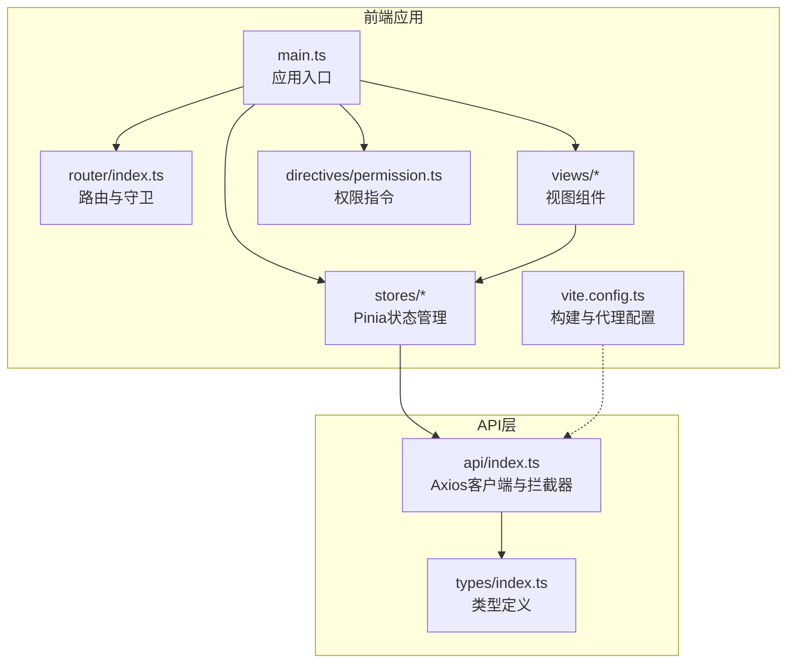
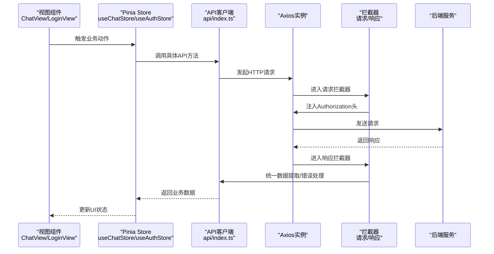
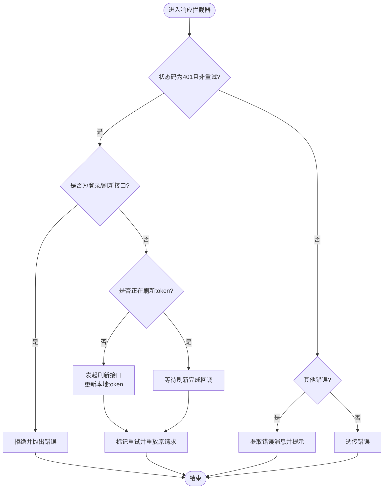
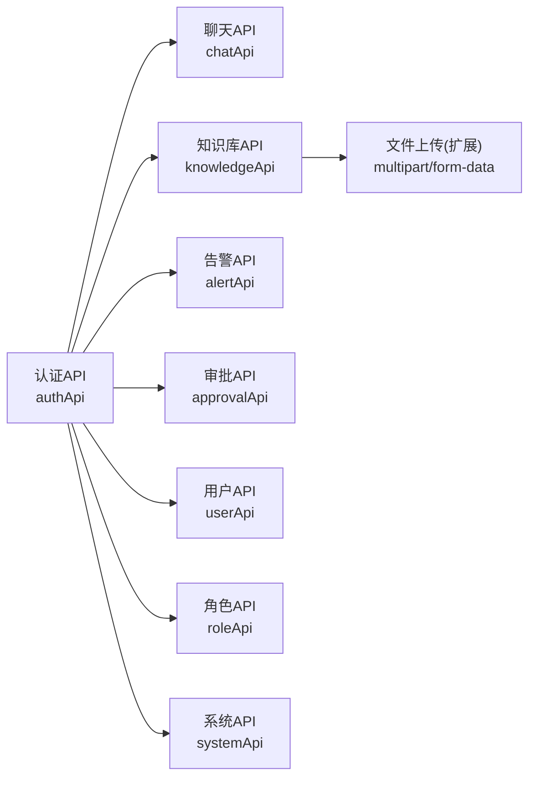
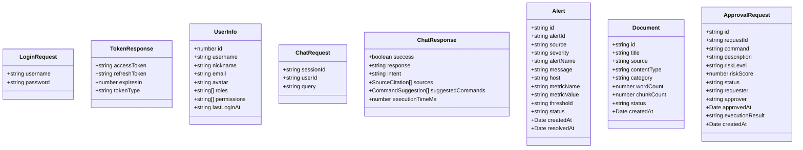
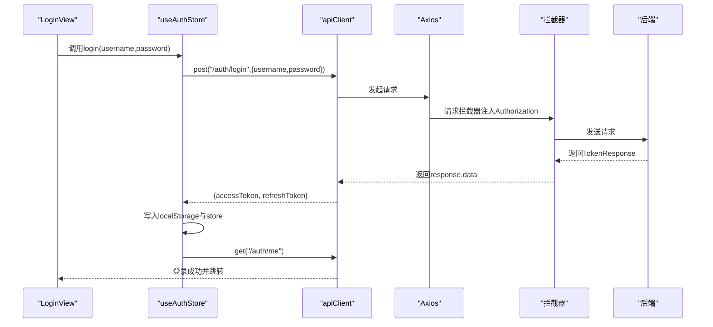
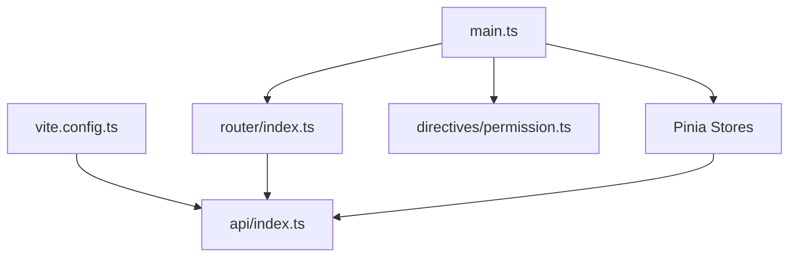

# API接口封装

<cite>
**本文引用的文件**
- [src/api/index.ts](file://netdata-ai-frontend/src/api/index.ts)
- [src/types/index.ts](file://netdata-ai-frontend/src/types/index.ts)
- [src/stores/auth.ts](file://netdata-ai-frontend/src/stores/auth.ts)
- [src/stores/chat.ts](file://netdata-ai-frontend/src/stores/chat.ts)
- [src/router/index.ts](file://netdata-ai-frontend/src/router/index.ts)
- [src/directives/permission.ts](file://netdata-ai-frontend/src/directives/permission.ts)
- [vite.config.ts](file://netdata-ai-frontend/vite.config.ts)
- [src/main.ts](file://netdata-ai-frontend/src/main.ts)
- [src/views/LoginView.vue](file://netdata-ai-frontend/src/views/LoginView.vue)
- [src/views/ChatView.vue](file://netdata-ai-frontend/src/views/ChatView.vue)
</cite>

## 目录
1. [简介](#简介)
2. [项目结构](#项目结构)
3. [核心组件](#核心组件)
4. [架构总览](#架构总览)
5. [详细组件分析](#详细组件分析)
6. [依赖关系分析](#依赖关系分析)
7. [性能考虑](#性能考虑)
8. [故障排除指南](#故障排除指南)
9. [结论](#结论)
10. [附录](#附录)

## 简介
本文件为“API接口封装”的架构文档，聚焦于前端API客户端的设计与实现，涵盖以下要点：
- Axios配置、请求/响应拦截器与统一错误处理
- HTTP请求处理：参数序列化、响应解析、错误统一处理
- API分类管理：认证、业务、文件上传的分层设计
- 类型安全：TypeScript接口定义、数据校验与类型推断
- 最佳实践：请求缓存策略、并发控制、超时处理
- 完整调用流程与错误处理示例

## 项目结构
前端采用Vue 3 + TypeScript + Pinia + Element Plus技术栈，API封装位于src/api/index.ts，类型定义位于src/types/index.ts，状态管理位于src/stores，路由与权限指令位于src/router与src/directives。

图表来源
- [src/main.ts:1-35](file://netdata-ai-frontend/src/main.ts#L1-L35)
- [src/router/index.ts:1-70](file://netdata-ai-frontend/src/router/index.ts#L1-L70)
- [src/api/index.ts:1-290](file://netdata-ai-frontend/src/api/index.ts#L1-L290)
- [src/types/index.ts:1-169](file://netdata-ai-frontend/src/types/index.ts#L1-L169)
- [vite.config.ts:1-52](file://netdata-ai-frontend/vite.config.ts#L1-L52)

章节来源
- [src/main.ts:1-35](file://netdata-ai-frontend/src/main.ts#L1-L35)
- [vite.config.ts:1-52](file://netdata-ai-frontend/vite.config.ts#L1-L52)

## 核心组件
- Axios客户端与拦截器：统一基础配置、请求头注入、401自动刷新、403/429/其他错误统一提示
- API模块化封装：按功能域拆分为认证、聊天、知识库、告警、审批、用户、角色、系统等API对象
- 类型系统：以TypeScript接口定义请求/响应模型，确保调用端类型安全
- 状态管理：Pinia Store负责认证态、聊天态、设置态等
- 路由与权限：路由守卫与指令实现访问控制与UI级权限隐藏

章节来源
- [src/api/index.ts:1-290](file://netdata-ai-frontend/src/api/index.ts#L1-L290)
- [src/types/index.ts:1-169](file://netdata-ai-frontend/src/types/index.ts#L1-L169)
- [src/stores/auth.ts:1-119](file://netdata-ai-frontend/src/stores/auth.ts#L1-L119)
- [src/stores/chat.ts:1-210](file://netdata-ai-frontend/src/stores/chat.ts#L1-L210)
- [src/router/index.ts:1-70](file://netdata-ai-frontend/src/router/index.ts#L1-L70)
- [src/directives/permission.ts:1-63](file://netdata-ai-frontend/src/directives/permission.ts#L1-L63)

## 架构总览
下图展示从视图到API再到后端的整体调用链路与拦截器处理流程。

图表来源
- [src/views/ChatView.vue:1-335](file://netdata-ai-frontend/src/views/ChatView.vue#L1-L335)
- [src/views/LoginView.vue:1-150](file://netdata-ai-frontend/src/views/LoginView.vue#L1-L150)
- [src/stores/chat.ts:1-210](file://netdata-ai-frontend/src/stores/chat.ts#L1-L210)
- [src/stores/auth.ts:1-119](file://netdata-ai-frontend/src/stores/auth.ts#L1-L119)
- [src/api/index.ts:1-290](file://netdata-ai-frontend/src/api/index.ts#L1-L290)

## 详细组件分析

### Axios客户端与拦截器
- 基础配置：baseURL、超时、Content-Type
- 请求拦截器：从本地存储读取token并注入Authorization头
- 响应拦截器：统一返回data；401自动刷新token并重试；403/429提示；其他错误统一弹窗

图表来源
- [src/api/index.ts:44-112](file://netdata-ai-frontend/src/api/index.ts#L44-L112)

章节来源
- [src/api/index.ts:8-112](file://netdata-ai-frontend/src/api/index.ts#L8-L112)

### API分类管理
- 认证API：登录、登出、刷新、获取当前用户
- 业务API：聊天（含流式占位）、知识库（文档增删改查）、告警（列表与统计）、审批（待审批、通过/拒绝）
- 系统API：健康检查
- 文件上传：在知识库上传处预留字段，便于扩展multipart/form-data

图表来源
- [src/api/index.ts:120-287](file://netdata-ai-frontend/src/api/index.ts#L120-L287)

章节来源
- [src/api/index.ts:120-287](file://netdata-ai-frontend/src/api/index.ts#L120-L287)

### 类型安全实现
- 请求/响应接口：LoginRequest、TokenResponse、UserInfo、ChatRequest、ChatResponse、Alert、Document、ApprovalRequest等
- 泛型与字面量联合类型：如MessageRole、AlertSeverity、AlertStatus、ApprovalStatus等
- 在store与API调用处直接使用接口进行类型约束与自动推断

图表来源
- [src/types/index.ts:10-169](file://netdata-ai-frontend/src/types/index.ts#L10-L169)

章节来源
- [src/types/index.ts:10-169](file://netdata-ai-frontend/src/types/index.ts#L10-L169)

### HTTP请求处理细节
- 参数序列化：GET查询参数通过axios config.params传递；POST/PUT体通过对象传递
- 响应解析：拦截器统一返回response.data，调用方获得纯净数据
- 错误处理：401自动刷新并重试；403/429提示；其他错误提取message并提示

章节来源
- [src/api/index.ts:44-112](file://netdata-ai-frontend/src/api/index.ts#L44-L112)
- [src/stores/chat.ts:120-138](file://netdata-ai-frontend/src/stores/chat.ts#L120-L138)
- [src/stores/auth.ts:42-62](file://netdata-ai-frontend/src/stores/auth.ts#L42-L62)

### 调用流程与错误处理示例
- 登录流程：LoginView -> useAuthStore.login -> apiClient.post('/auth/login') -> 响应拦截器返回data -> 存储token并拉取用户信息
- 聊天流程：ChatView -> useChatStore.sendMessage -> chatApi.sendMessage -> Axios -> 拦截器 -> 后端 -> 成功更新消息或失败显示错误

图表来源
- [src/views/LoginView.vue:79-95](file://netdata-ai-frontend/src/views/LoginView.vue#L79-L95)
- [src/stores/auth.ts:42-62](file://netdata-ai-frontend/src/stores/auth.ts#L42-L62)
- [src/api/index.ts:220-233](file://netdata-ai-frontend/src/api/index.ts#L220-L233)

章节来源
- [src/views/LoginView.vue:79-95](file://netdata-ai-frontend/src/views/LoginView.vue#L79-L95)
- [src/stores/auth.ts:42-62](file://netdata-ai-frontend/src/stores/auth.ts#L42-L62)
- [src/api/index.ts:220-233](file://netdata-ai-frontend/src/api/index.ts#L220-L233)

## 依赖关系分析
- 构建与代理：Vite配置将/api前缀代理至后端服务，便于开发联调
- 应用入口：main.ts注册插件、路由、状态管理与权限指令，并初始化认证状态
- 路由守卫：对非公开路由进行token校验，未登录重定向至登录页
- 权限指令：v-permission与v-role在挂载/更新时根据store权限决定元素可见性

图表来源
- [src/main.ts:1-35](file://netdata-ai-frontend/src/main.ts#L1-L35)
- [src/router/index.ts:49-67](file://netdata-ai-frontend/src/router/index.ts#L49-L67)
- [src/directives/permission.ts:59-62](file://netdata-ai-frontend/src/directives/permission.ts#L59-L62)
- [vite.config.ts:28-37](file://netdata-ai-frontend/vite.config.ts#L28-L37)

章节来源
- [src/main.ts:1-35](file://netdata-ai-frontend/src/main.ts#L1-L35)
- [src/router/index.ts:49-67](file://netdata-ai-frontend/src/router/index.ts#L49-L67)
- [src/directives/permission.ts:59-62](file://netdata-ai-frontend/src/directives/permission.ts#L59-L62)
- [vite.config.ts:28-37](file://netdata-ai-frontend/vite.config.ts#L28-L37)

## 性能考虑
- 请求超时：Axios已配置较长超时时间，适用于长文本生成场景
- 并发控制：当前未实现全局并发限制，建议在store中引入队列或信号量控制
- 缓存策略：可针对只读列表（如告警、知识库）增加ETag/Last-Modified缓存
- 重试策略：401自动刷新一次，避免重复重试造成风暴
- 构建优化：Vite已按依赖拆包，减少首屏体积

## 故障排除指南
- 401未认证
  - 现象：触发自动刷新token并重试
  - 处理：若刷新失败，清除本地token并跳转登录
- 403权限不足
  - 现象：弹窗提示权限不足
  - 处理：检查用户角色/权限或路由meta.permission
- 429请求频繁
  - 现象：弹窗提示请稍后再试
  - 处理：前端退避重试或降低请求频率
- 网络异常/服务不可达
  - 现象：统一错误消息提示
  - 处理：检查代理配置与后端连通性

章节来源
- [src/api/index.ts:44-112](file://netdata-ai-frontend/src/api/index.ts#L44-L112)
- [src/router/index.ts:49-67](file://netdata-ai-frontend/src/router/index.ts#L49-L67)

## 结论
该API封装以Axios为核心，结合拦截器实现了统一的认证、错误与响应处理；通过模块化的API对象与严格的TypeScript类型定义，提升了代码可维护性与可测试性；配合Pinia状态管理与路由守卫，形成了清晰的前后端协作架构。建议后续补充并发控制、缓存与重试策略，进一步提升用户体验与稳定性。

## 附录
- 开发代理配置：将/api前缀代理至后端服务，便于本地联调
- 认证初始化：应用启动时读取本地token并尝试拉取用户信息

章节来源
- [vite.config.ts:28-37](file://netdata-ai-frontend/vite.config.ts#L28-L37)
- [src/main.ts:30-32](file://netdata-ai-frontend/src/main.ts#L30-L32)