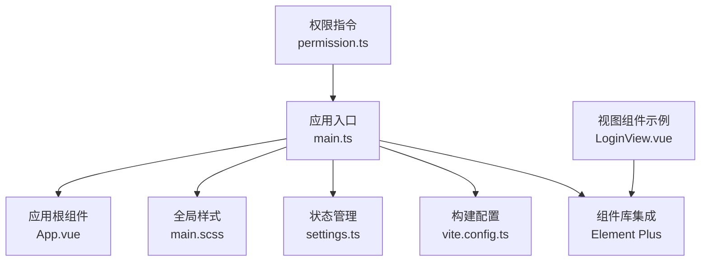
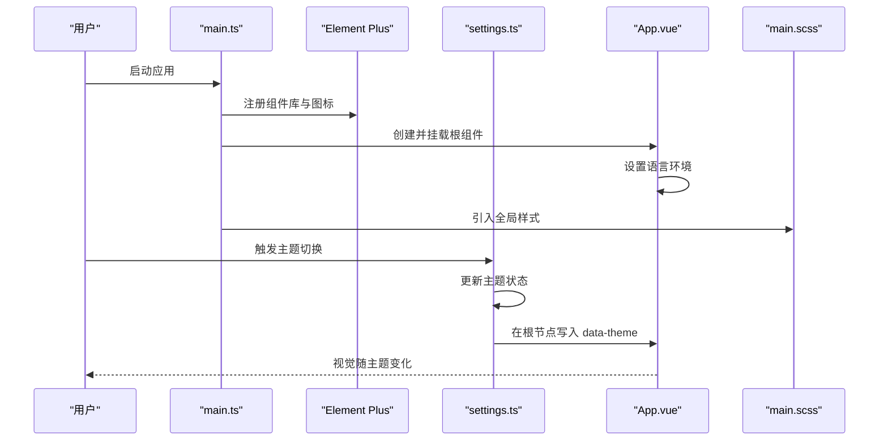
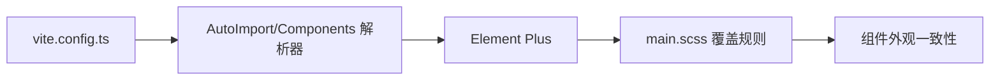
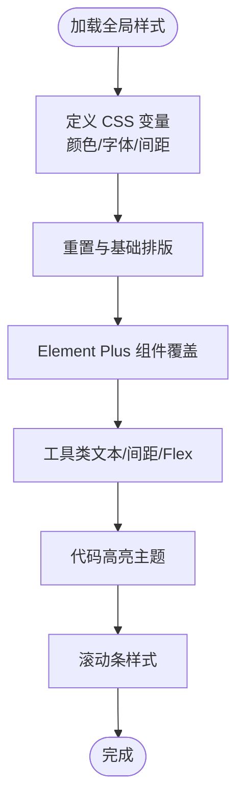
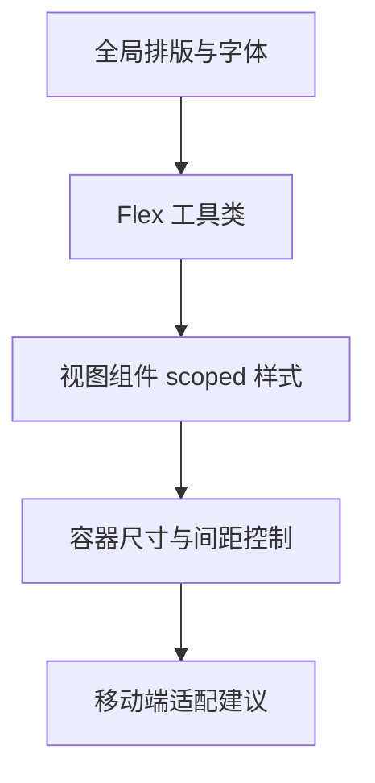
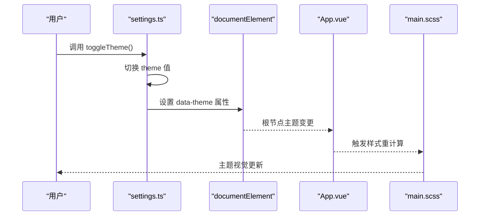
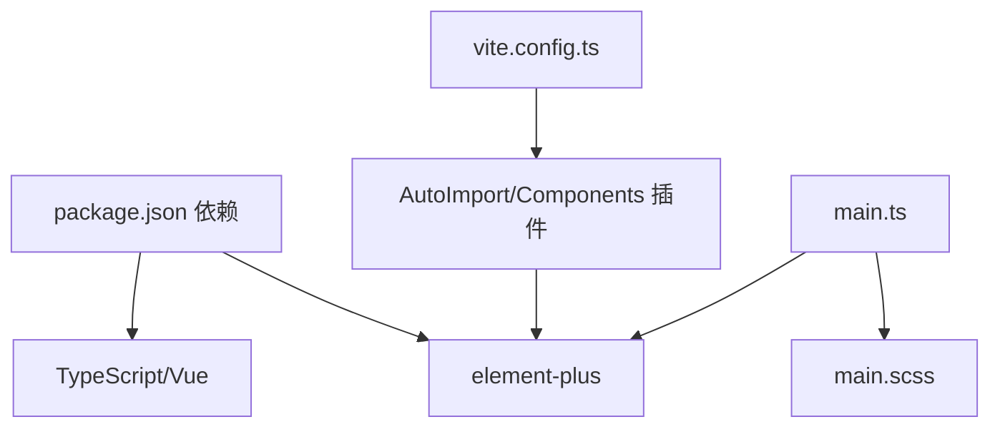

# UI主题与样式设计

<cite>
**本文档引用的文件**
- [package.json](file://netdata-ai-frontend/package.json)
- [vite.config.ts](file://netdata-ai-frontend/vite.config.ts)
- [main.ts](file://netdata-ai-frontend/src/main.ts)
- [App.vue](file://netdata-ai-frontend/src/App.vue)
- [settings.ts](file://netdata-ai-frontend/src/stores/settings.ts)
- [main.scss](file://netdata-ai-frontend/src/assets/main.scss)
- [LoginView.vue](file://netdata-ai-frontend/src/views/LoginView.vue)
- [permission.ts](file://netdata-ai-frontend/src/directives/permission.ts)
</cite>

## 目录
1. [引言](#引言)
2. [项目结构](#项目结构)
3. [核心组件](#核心组件)
4. [架构总览](#架构总览)
5. [详细组件分析](#详细组件分析)
6. [依赖关系分析](#依赖关系分析)
7. [性能考虑](#性能考虑)
8. [故障排除指南](#故障排除指南)
9. [结论](#结论)
10. [附录](#附录)

## 引言
本文件围绕前端工程中的UI主题与样式设计进行系统化梳理，重点涵盖以下方面：
- Element Plus 组件库的集成方式与样式覆盖策略
- SCSS 架构设计（变量系统、工具类与模块化）
- 响应式设计与移动端适配思路
- 主题切换机制（深色/浅色模式）与动态更新
- 样式开发最佳实践（CSS-in-JS 使用建议、性能优化与浏览器兼容）

## 项目结构
前端采用 Vue 3 + Vite + TypeScript 技术栈，样式以 SCSS 为主，结合 Element Plus 的组件样式覆盖与自定义工具类，形成统一的视觉与交互体系。

图表来源
- [main.ts:1-35](file://netdata-ai-frontend/src/main.ts#L1-L35)
- [App.vue:1-19](file://netdata-ai-frontend/src/App.vue#L1-L19)
- [main.scss:1-176](file://netdata-ai-frontend/src/assets/main.scss#L1-L176)
- [settings.ts:1-32](file://netdata-ai-frontend/src/stores/settings.ts#L1-L32)
- [vite.config.ts:1-52](file://netdata-ai-frontend/vite.config.ts#L1-L52)
- [LoginView.vue:1-150](file://netdata-ai-frontend/src/views/LoginView.vue#L1-L150)
- [permission.ts:1-63](file://netdata-ai-frontend/src/directives/permission.ts#L1-L63)

章节来源
- [package.json:1-37](file://netdata-ai-frontend/package.json#L1-L37)
- [vite.config.ts:1-52](file://netdata-ai-frontend/vite.config.ts#L1-L52)
- [main.ts:1-35](file://netdata-ai-frontend/src/main.ts#L1-L35)
- [App.vue:1-19](file://netdata-ai-frontend/src/App.vue#L1-L19)
- [main.scss:1-176](file://netdata-ai-frontend/src/assets/main.scss#L1-L176)
- [settings.ts:1-32](file://netdata-ai-frontend/src/stores/settings.ts#L1-L32)
- [LoginView.vue:1-150](file://netdata-ai-frontend/src/views/LoginView.vue#L1-L150)
- [permission.ts:1-63](file://netdata-ai-frontend/src/directives/permission.ts#L1-L63)

## 核心组件
- 应用入口与插件注册：负责初始化 Element Plus、图标注册、Pinia、路由以及全局样式的引入。
- 全局样式与变量：通过 CSS 变量集中管理主色、文本、边框与背景等基础色彩，并提供滚动条与 Element Plus 组件的覆盖样式。
- 主题状态管理：通过 Pinia 管理主题状态并在 DOM 上标注 data-theme 属性，便于后续样式按主题生效。
- 视图级样式：在具体页面中使用 scoped SCSS 实现局部样式隔离与渐变背景等视觉效果。
- 权限指令：基于指令实现元素级权限控制，减少冗余渲染与逻辑分散。

章节来源
- [main.ts:1-35](file://netdata-ai-frontend/src/main.ts#L1-L35)
- [main.scss:1-176](file://netdata-ai-frontend/src/assets/main.scss#L1-L176)
- [settings.ts:1-32](file://netdata-ai-frontend/src/stores/settings.ts#L1-L32)
- [LoginView.vue:1-150](file://netdata-ai-frontend/src/views/LoginView.vue#L1-L150)
- [permission.ts:1-63](file://netdata-ai-frontend/src/directives/permission.ts#L1-L63)

## 架构总览
下图展示了从应用启动到样式生效的整体流程，包括 Element Plus 集成、自动导入、主题状态与样式覆盖的关系。

图表来源
- [main.ts:1-35](file://netdata-ai-frontend/src/main.ts#L1-L35)
- [App.vue:1-19](file://netdata-ai-frontend/src/App.vue#L1-L19)
- [settings.ts:1-32](file://netdata-ai-frontend/src/stores/settings.ts#L1-L32)
- [main.scss:1-176](file://netdata-ai-frontend/src/assets/main.scss#L1-L176)

## 详细组件分析

### Element Plus 集成与样式覆盖
- 自动导入与解析器：通过 Vite 插件与解析器实现 Element Plus 组件与图标的自动导入，减少手动引入成本。
- 全局样式覆盖：在全局 SCSS 中对 Element Plus 的卡片、按钮、输入框等组件进行圆角、阴影与边框的统一风格化。
- 图标系统：在入口处批量注册 Element Plus 图标，便于在模板中直接使用。

图表来源
- [vite.config.ts:1-52](file://netdata-ai-frontend/vite.config.ts#L1-L52)
- [main.scss:62-76](file://netdata-ai-frontend/src/assets/main.scss#L62-L76)
- [main.ts:18-21](file://netdata-ai-frontend/src/main.ts#L18-L21)

章节来源
- [vite.config.ts:1-52](file://netdata-ai-frontend/vite.config.ts#L1-L52)
- [main.ts:18-21](file://netdata-ai-frontend/src/main.ts#L18-L21)
- [main.scss:62-76](file://netdata-ai-frontend/src/assets/main.scss#L62-L76)

### SCSS 架构设计
- 变量系统：以 CSS 变量为核心，集中定义主色、语义色、文本色、边框色与背景色，确保跨组件一致的色彩体系。
- 工具类：提供常用的文本对齐、间距与 Flex 布局工具类，提升开发效率与样式复用度。
- 代码高亮主题：针对代码展示场景提供暗色系高亮主题，增强可读性。
- 滚动条样式：统一浏览器滚动条的尺寸与悬停态，改善交互体验。

图表来源
- [main.scss:5-24](file://netdata-ai-frontend/src/assets/main.scss#L5-L24)
- [main.scss:26-41](file://netdata-ai-frontend/src/assets/main.scss#L26-L41)
- [main.scss:62-106](file://netdata-ai-frontend/src/assets/main.scss#L62-L106)
- [main.scss:108-175](file://netdata-ai-frontend/src/assets/main.scss#L108-L175)

章节来源
- [main.scss:5-24](file://netdata-ai-frontend/src/assets/main.scss#L5-L24)
- [main.scss:26-41](file://netdata-ai-frontend/src/assets/main.scss#L26-L41)
- [main.scss:62-106](file://netdata-ai-frontend/src/assets/main.scss#L62-L106)
- [main.scss:108-175](file://netdata-ai-frontend/src/assets/main.scss#L108-L175)

### 响应式设计与移动端适配
- 基础排版：全局字体大小与行高设定，配合 CSS 变量实现主题色与文本色的统一。
- Flex 工具类：提供 flex、align-items、justify-content 等常用布局属性，便于快速搭建响应式布局。
- 页面级样式：在视图组件中使用 scoped SCSS 控制容器尺寸、内边距与背景，保证在不同屏幕下的视觉一致性。

图表来源
- [main.scss:33-41](file://netdata-ai-frontend/src/assets/main.scss#L33-L41)
- [main.scss:153-175](file://netdata-ai-frontend/src/assets/main.scss#L153-L175)
- [LoginView.vue:98-149](file://netdata-ai-frontend/src/views/LoginView.vue#L98-L149)

章节来源
- [main.scss:33-41](file://netdata-ai-frontend/src/assets/main.scss#L33-L41)
- [main.scss:153-175](file://netdata-ai-frontend/src/assets/main.scss#L153-L175)
- [LoginView.vue:98-149](file://netdata-ai-frontend/src/views/LoginView.vue#L98-L149)

### 主题切换机制
- 主题状态：通过 Pinia 管理当前主题（light/dark），并在切换时向根节点写入 data-theme 属性。
- 动态更新：配合全局样式与组件覆盖，实现主题切换时的即时视觉反馈。
- 语言环境：在根组件中设置 Element Plus 的本地化语言，保证国际化提示与日期等组件显示正确。

图表来源
- [settings.ts:14-18](file://netdata-ai-frontend/src/stores/settings.ts#L14-L18)
- [App.vue:2-4](file://netdata-ai-frontend/src/App.vue#L2-L4)

章节来源
- [settings.ts:14-18](file://netdata-ai-frontend/src/stores/settings.ts#L14-L18)
- [App.vue:2-4](file://netdata-ai-frontend/src/App.vue#L2-L4)

### 样式开发最佳实践
- CSS-in-JS 使用建议：当前项目主要采用 SCSS 与全局样式，建议在需要运行时动态样式的场景（如主题色映射）使用 CSS 变量或运行时注入 CSS 变量的方式，避免过度依赖 CSS-in-JS。
- 样式性能优化：利用 Vite 的分包策略将 Element Plus 与 Vue 生态独立打包，减少重复依赖；在组件中使用 scoped 样式避免全局污染。
- 浏览器兼容性：通过 CSS 变量与基础 reset 提升兼容性；对于不支持 CSS 变量的场景，可在构建阶段生成降级方案或在入口处提供 polyfill。

章节来源
- [vite.config.ts:38-50](file://netdata-ai-frontend/vite.config.ts#L38-L50)
- [main.ts:5](file://netdata-ai-frontend/src/main.ts#L5)

## 依赖关系分析
- 组件库与自动导入：Vite 插件与解析器负责自动导入 Element Plus 组件与图标，简化开发流程。
- 样式依赖链：全局样式在入口处被引入，随后被各组件共享；主题状态通过根节点属性影响样式层。
- 构建优化：手动分包策略将 Element Plus 与 Vue 生态拆分为独立 chunk，降低首屏体积。

图表来源
- [package.json:13-23](file://netdata-ai-frontend/package.json#L13-L23)
- [vite.config.ts:10-22](file://netdata-ai-frontend/vite.config.ts#L10-L22)
- [main.ts:3-5](file://netdata-ai-frontend/src/main.ts#L3-L5)

章节来源
- [package.json:13-23](file://netdata-ai-frontend/package.json#L13-L23)
- [vite.config.ts:10-22](file://netdata-ai-frontend/vite.config.ts#L10-L22)
- [main.ts:3-5](file://netdata-ai-frontend/src/main.ts#L3-L5)

## 性能考虑
- 代码分割：通过手动分包策略将 Element Plus 与 Vue 生态独立打包，减少重复依赖与缓存失效。
- 样式体积：全局样式集中管理，避免重复定义；组件内样式使用 scoped，减少样式冲突与无效选择器。
- 运行时开销：主题切换通过 data-theme 属性与 CSS 变量实现，避免频繁 DOM 重绘与复杂动画。

## 故障排除指南
- 主题切换无效：确认主题状态已更新且根节点存在 data-theme 属性；检查全局样式中是否存在按该属性生效的选择器。
- 组件样式未覆盖：确认 Element Plus 的 CSS 已正确引入，且覆盖规则优先级足够高；避免使用 !important 导致难以维护。
- 权限指令导致元素消失：检查指令绑定值与用户权限/角色匹配逻辑，确保边界条件（空值、数组）被正确处理。

章节来源
- [settings.ts:14-18](file://netdata-ai-frontend/src/stores/settings.ts#L14-L18)
- [main.scss:62-76](file://netdata-ai-frontend/src/assets/main.scss#L62-L76)
- [permission.ts:18-30](file://netdata-ai-frontend/src/directives/permission.ts#L18-L30)

## 结论
本项目通过 Element Plus 与 SCSS 的有机结合，建立了清晰的主题与样式体系。借助 Pinia 的主题状态管理与 Vite 的构建优化，实现了良好的开发体验与运行性能。建议在后续迭代中进一步完善深色模式的 CSS 变量覆盖与移动端断点策略，以提升整体可用性与一致性。

## 附录
- 主题定制示例路径：[settings.ts:14-18](file://netdata-ai-frontend/src/stores/settings.ts#L14-L18)
- 全局样式覆盖路径：[main.scss:62-76](file://netdata-ai-frontend/src/assets/main.scss#L62-L76)
- 视图级样式示例路径：[LoginView.vue:98-149](file://netdata-ai-frontend/src/views/LoginView.vue#L98-L149)