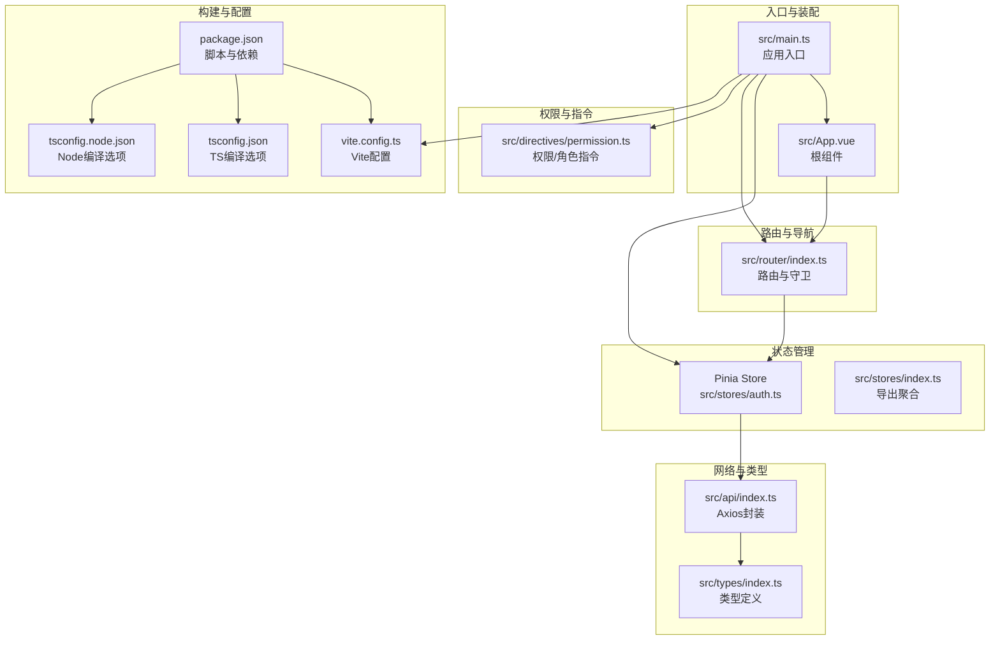
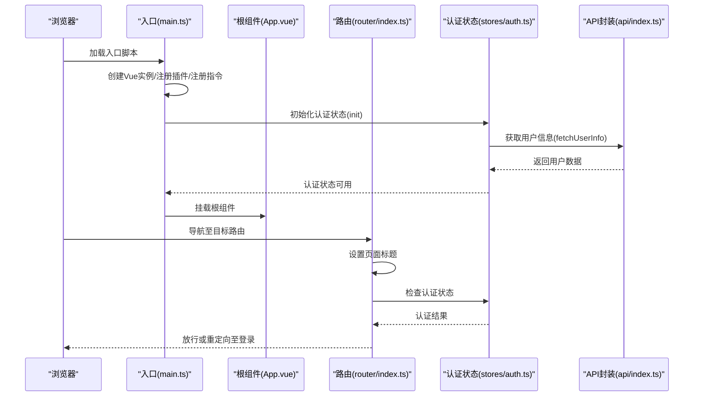
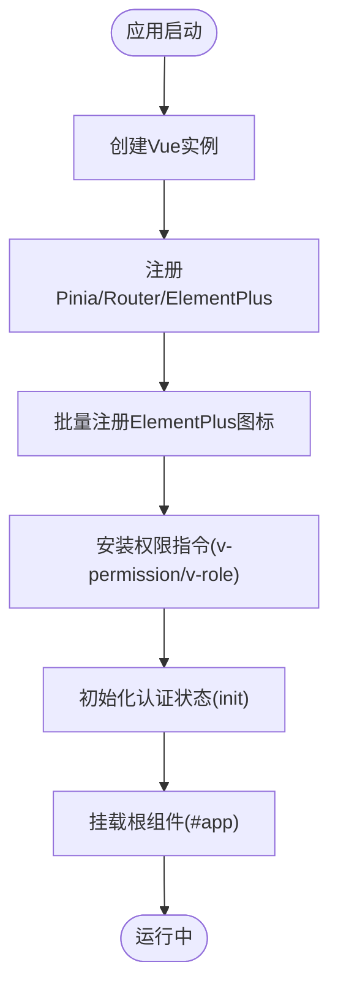
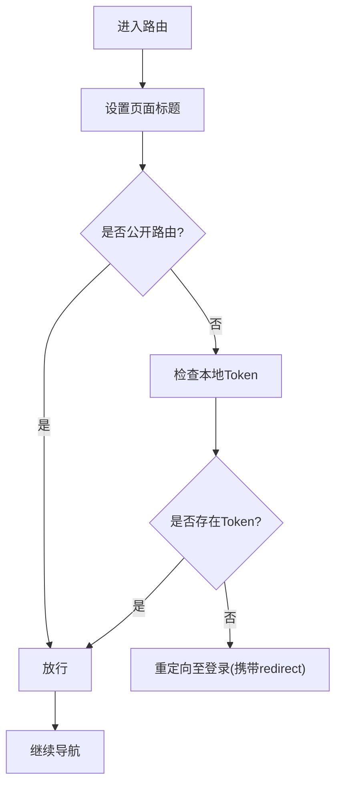
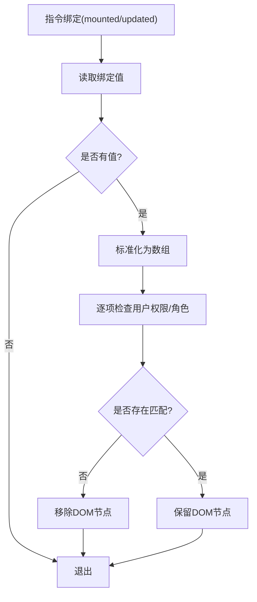
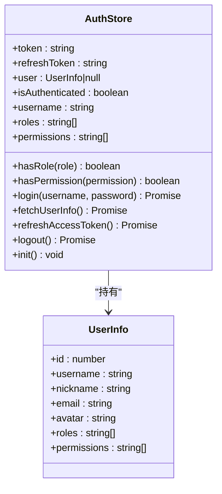
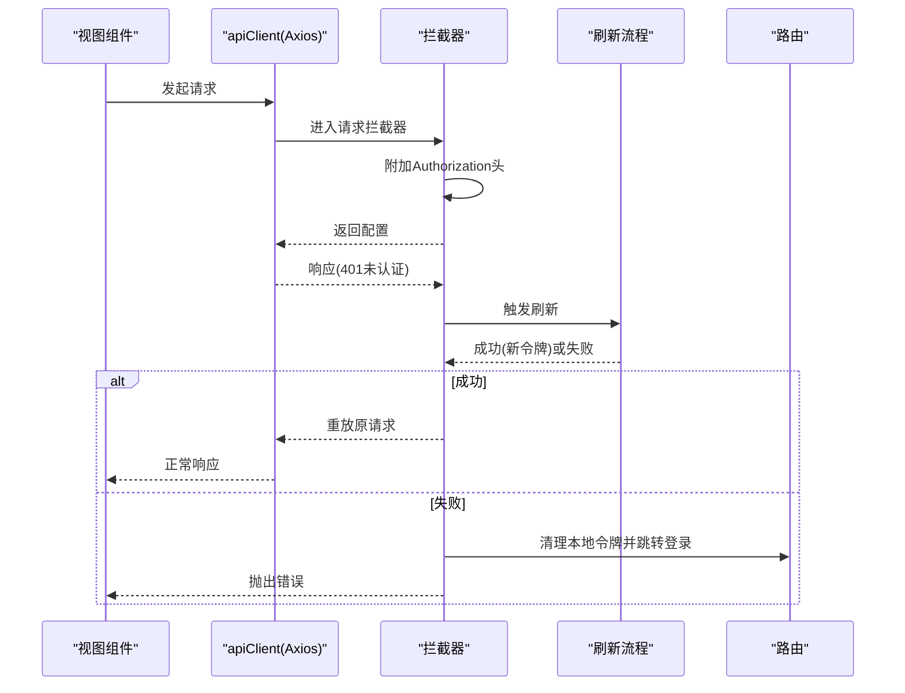
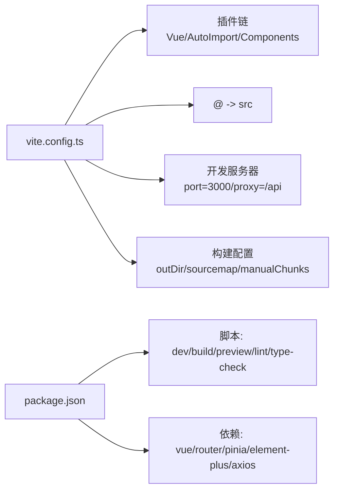
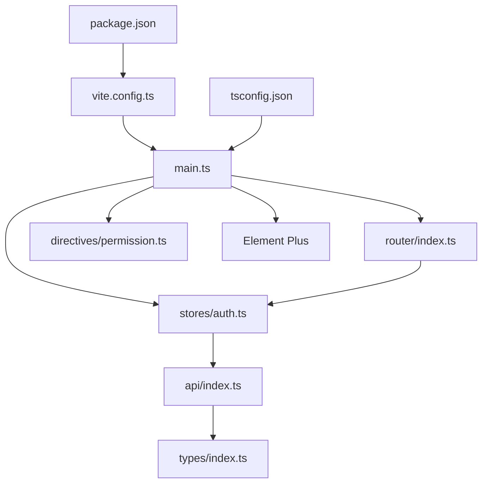

# Vue应用初始化与配置

<cite>
**本文档引用的文件**
- [main.ts](file://netdata-ai-frontend/src/main.ts)
- [App.vue](file://netdata-ai-frontend/src/App.vue)
- [router/index.ts](file://netdata-ai-frontend/src/router/index.ts)
- [directives/permission.ts](file://netdata-ai-frontend/src/directives/permission.ts)
- [stores/auth.ts](file://netdata-ai-frontend/src/stores/auth.ts)
- [stores/index.ts](file://netdata-ai-frontend/src/stores/index.ts)
- [api/index.ts](file://netdata-ai-frontend/src/api/index.ts)
- [types/index.ts](file://netdata-ai-frontend/src/types/index.ts)
- [vite.config.ts](file://netdata-ai-frontend/vite.config.ts)
- [package.json](file://netdata-ai-frontend/package.json)
- [tsconfig.json](file://netdata-ai-frontend/tsconfig.json)
- [tsconfig.node.json](file://netdata-ai-frontend/tsconfig.node.json)
</cite>

## 目录
1. [简介](#简介)
2. [项目结构](#项目结构)
3. [核心组件](#核心组件)
4. [架构总览](#架构总览)
5. [详细组件分析](#详细组件分析)
6. [依赖关系分析](#依赖关系分析)
7. [性能考虑](#性能考虑)
8. [故障排查指南](#故障排查指南)
9. [结论](#结论)
10. [附录](#附录)

## 简介
本文件面向Vue.js应用的初始化与配置，围绕netdata-ai-frontend前端工程展开，系统性阐述应用入口初始化流程、插件与UI框架集成、图标组件注册、权限指令设置、应用配置选项（Vite、TypeScript、ESLint、代码格式化）、生命周期管理（认证状态初始化与全局状态预加载）、开发与生产环境差异以及项目结构组织原则。内容以仓库实际文件为依据，避免臆测，确保可追溯性。

## 项目结构
前端工程采用基于功能域的模块化组织方式，入口文件负责应用实例创建与插件装配；路由模块集中定义页面与守卫；状态管理采用Pinia；权限控制通过自定义指令与路由守卫结合；API层封装Axios并内置鉴权与错误处理；TypeScript与Vite提供类型安全与现代化构建能力。

**图表来源**
- [main.ts:1-35](file://netdata-ai-frontend/src/main.ts#L1-L35)
- [App.vue:1-19](file://netdata-ai-frontend/src/App.vue#L1-L19)
- [router/index.ts:1-70](file://netdata-ai-frontend/src/router/index.ts#L1-L70)
- [directives/permission.ts:1-63](file://netdata-ai-frontend/src/directives/permission.ts#L1-L63)
- [stores/auth.ts:1-119](file://netdata-ai-frontend/src/stores/auth.ts#L1-L119)
- [stores/index.ts:1-4](file://netdata-ai-frontend/src/stores/index.ts#L1-L4)
- [api/index.ts:1-290](file://netdata-ai-frontend/src/api/index.ts#L1-L290)
- [types/index.ts:1-169](file://netdata-ai-frontend/src/types/index.ts#L1-L169)
- [vite.config.ts:1-52](file://netdata-ai-frontend/vite.config.ts#L1-L52)
- [package.json:1-37](file://netdata-ai-frontend/package.json#L1-L37)
- [tsconfig.json:1-35](file://netdata-ai-frontend/tsconfig.json#L1-L35)
- [tsconfig.node.json:1-12](file://netdata-frontend/tsconfig.node.json#L1-L12)

**章节来源**
- [main.ts:1-35](file://netdata-ai-frontend/src/main.ts#L1-L35)
- [vite.config.ts:1-52](file://netdata-ai-frontend/vite.config.ts#L1-L52)
- [package.json:1-37](file://netdata-ai-frontend/package.json#L1-L37)
- [tsconfig.json:1-35](file://netdata-ai-frontend/tsconfig.json#L1-L35)
- [tsconfig.node.json:1-12](file://netdata-ai-frontend/tsconfig.node.json#L1-L12)

## 核心组件
- 应用入口与装配：在入口文件中完成Vue实例创建、Pinia与Router注册、Element Plus集成、图标组件批量注册、权限指令安装以及认证状态初始化。
- 根组件：提供Element Plus语言包配置与基础样式占位。
- 路由与守卫：集中定义页面路由、公共页面标记、动态导入与前置守卫（认证检查、页面标题设置）。
- 权限指令：提供v-permission与v-role指令，基于Pinia状态进行渲染控制。
- 状态管理：Pinia Store封装认证状态、用户信息、登录/登出/刷新逻辑与初始化方法。
- API封装：Axios实例化、请求/响应拦截器、统一错误处理、Token刷新队列与重试机制。
- 构建与类型：Vite插件链（自动导入、组件解析）、路径别名、开发服务器与代理、构建产物与分包策略；TypeScript严格模式与路径映射。

**章节来源**
- [main.ts:1-35](file://netdata-ai-frontend/src/main.ts#L1-L35)
- [App.vue:1-19](file://netdata-ai-frontend/src/App.vue#L1-L19)
- [router/index.ts:1-70](file://netdata-ai-frontend/src/router/index.ts#L1-L70)
- [directives/permission.ts:1-63](file://netdata-ai-frontend/src/directives/permission.ts#L1-L63)
- [stores/auth.ts:1-119](file://netdata-ai-frontend/src/stores/auth.ts#L1-L119)
- [api/index.ts:1-290](file://netdata-ai-frontend/src/api/index.ts#L1-L290)

## 架构总览
下图展示从应用启动到路由导航的关键交互流程，涵盖入口装配、认证初始化、路由守卫与状态管理协作。

**图表来源**
- [main.ts:30-34](file://netdata-ai-frontend/src/main.ts#L30-L34)
- [stores/auth.ts:95-100](file://netdata-ai-frontend/src/stores/auth.ts#L95-L100)
- [router/index.ts:49-67](file://netdata-ai-frontend/src/router/index.ts#L49-L67)
- [api/index.ts:55-62](file://netdata-ai-frontend/src/api/index.ts#L55-L62)

## 详细组件分析

### 应用入口初始化流程
- 实例创建与插件注册：创建Vue应用实例，注册Pinia、Router与Element Plus。
- 图标组件注册：遍历Element Plus图标集合，批量注册为全局组件，便于模板直接使用。
- 权限指令设置：调用指令安装函数，注册v-permission与v-role指令。
- 生命周期初始化：在挂载前读取本地存储中的令牌，若存在则拉取用户信息，完成认证状态预加载。
- 根组件挂载：将应用挂载至DOM节点。

**图表来源**
- [main.ts:15-34](file://netdata-ai-frontend/src/main.ts#L15-L34)

**章节来源**
- [main.ts:1-35](file://netdata-ai-frontend/src/main.ts#L1-L35)

### 路由与导航守卫
- 路由定义：集中声明登录页、聊天、告警仪表板、知识库、审批、用户管理等路由，并使用动态导入按需加载。
- 导航守卫：在进入路由前设置页面标题；对非公开路由检查本地Token；未认证则重定向至登录并携带重定向地址；认证通过则放行。
- 历史模式：基于浏览器History API，结合BASE_URL环境变量。

**图表来源**
- [router/index.ts:49-67](file://netdata-ai-frontend/src/router/index.ts#L49-L67)

**章节来源**
- [router/index.ts:1-70](file://netdata-ai-frontend/src/router/index.ts#L1-L70)

### 权限指令与角色指令
- v-permission：支持字符串或数组形式的权限校验，若用户无对应权限，指令会移除该DOM节点。
- v-role：支持字符串或数组形式的角色校验，若用户无对应角色，指令会移除该DOM节点。
- 指令安装：通过统一安装函数注册两个指令，供模板使用。

**图表来源**
- [directives/permission.ts:9-30](file://netdata-ai-frontend/src/directives/permission.ts#L9-L30)
- [directives/permission.ts:36-57](file://netdata-ai-frontend/src/directives/permission.ts#L36-L57)

**章节来源**
- [directives/permission.ts:1-63](file://netdata-ai-frontend/src/directives/permission.ts#L1-L63)

### 认证状态管理（Pinia）
- 状态：维护访问令牌、刷新令牌与用户信息；计算属性提供认证态、用户名、角色与权限集合。
- 行为：登录写入令牌与本地存储、获取用户信息；刷新令牌时持久化新令牌并返回成功与否；登出清理状态并跳转登录。
- 初始化：若存在令牌则拉取用户信息，实现启动前的全局状态预加载。

**图表来源**
- [stores/auth.ts:22-119](file://netdata-ai-frontend/src/stores/auth.ts#L22-L119)

**章节来源**
- [stores/auth.ts:1-119](file://netdata-ai-frontend/src/stores/auth.ts#L1-L119)

### API封装与拦截器
- Axios实例：设置基础URL、超时与通用头。
- 请求拦截：自动附加Authorization头（Bearer Token）。
- 响应拦截：统一提取响应数据；401未认证触发刷新流程（互斥刷新、订阅重试队列）；403提示权限不足；429提示限流；其他错误统一提示。
- 刷新流程：并发请求共享刷新状态，刷新成功后重放原请求；刷新失败则清空本地令牌并跳转登录。

**图表来源**
- [api/index.ts:29-112](file://netdata-ai-frontend/src/api/index.ts#L29-L112)

**章节来源**
- [api/index.ts:1-290](file://netdata-ai-frontend/src/api/index.ts#L1-L290)

### 构建配置与开发体验
- Vite插件链：Vue插件、自动导入（ElementPlus解析器）、组件自动注册（ElementPlus解析器），生成类型声明文件。
- 路径别名：@指向src目录，提升导入可读性。
- 开发服务器：端口3000，配置后端API代理（/api -> http://localhost:8080）。
- 构建优化：输出目录dist，禁用SourceMap，增大警告阈值；Rollup手动分包，将element-plus与Vue生态拆分为独立vendor块。
- 脚本与依赖：开发(dev)、构建(build)、预览(preview)、ESLint修复(lint)、类型检查(type-check)；依赖包含Vue3、Router、Pinia、Element Plus、Axios等。

**图表来源**
- [vite.config.ts:9-51](file://netdata-ai-frontend/vite.config.ts#L9-L51)
- [package.json:6-12](file://netdata-ai-frontend/package.json#L6-L12)

**章节来源**
- [vite.config.ts:1-52](file://netdata-ai-frontend/vite.config.ts#L1-L52)
- [package.json:1-37](file://netdata-ai-frontend/package.json#L1-L37)

### TypeScript配置与类型体系
- 编译选项：目标ES2020、模块ESNext、Bundler解析、严格模式、路径映射@/*、类型声明vite/client与element-plus/global。
- 参考配置：Node侧tsconfig.node.json用于Vite配置文件类型检查。
- 类型定义：集中于src/types/index.ts，覆盖认证、聊天、告警、审批、知识库等业务类型。

**章节来源**
- [tsconfig.json:1-35](file://netdata-ai-frontend/tsconfig.json#L1-L35)
- [tsconfig.node.json:1-12](file://netdata-ai-frontend/tsconfig.node.json#L1-L12)
- [types/index.ts:1-169](file://netdata-ai-frontend/src/types/index.ts#L1-L169)

## 依赖关系分析
- 入口对各子系统的耦合：入口同时依赖状态、路由、指令与UI框架，形成“装配中心”角色。
- 路由与状态：路由守卫依赖认证状态；页面组件通过状态驱动UI与权限控制。
- API与状态：状态管理依赖API进行登录、刷新与用户信息获取；API拦截器依赖状态（本地存储）与路由（登录跳转）。
- 构建与开发：Vite配置影响自动导入与组件解析；TypeScript配置影响类型推断与IDE体验。

**图表来源**
- [main.ts:1-35](file://netdata-ai-frontend/src/main.ts#L1-L35)
- [stores/auth.ts:1-119](file://netdata-ai-frontend/src/stores/auth.ts#L1-L119)
- [router/index.ts:1-70](file://netdata-ai-frontend/src/router/index.ts#L1-L70)
- [directives/permission.ts:1-63](file://netdata-ai-frontend/src/directives/permission.ts#L1-L63)
- [api/index.ts:1-290](file://netdata-ai-frontend/src/api/index.ts#L1-L290)
- [vite.config.ts:1-52](file://netdata-ai-frontend/vite.config.ts#L1-L52)
- [package.json:1-37](file://netdata-ai-frontend/package.json#L1-L37)
- [tsconfig.json:1-35](file://netdata-ai-frontend/tsconfig.json#L1-L35)

**章节来源**
- [main.ts:1-35](file://netdata-ai-frontend/src/main.ts#L1-L35)
- [stores/auth.ts:1-119](file://netdata-ai-frontend/src/stores/auth.ts#L1-L119)
- [router/index.ts:1-70](file://netdata-ai-frontend/src/router/index.ts#L1-L70)
- [directives/permission.ts:1-63](file://netdata-ai-frontend/src/directives/permission.ts#L1-L63)
- [api/index.ts:1-290](file://netdata-ai-frontend/src/api/index.ts#L1-L290)
- [vite.config.ts:1-52](file://netdata-ai-frontend/vite.config.ts#L1-L52)
- [package.json:1-37](file://netdata-ai-frontend/package.json#L1-L37)
- [tsconfig.json:1-35](file://netdata-ai-frontend/tsconfig.json#L1-L35)

## 性能考虑
- 分包策略：通过manualChunks将element-plus与Vue相关依赖拆分为独立vendor块，有利于缓存复用与并行加载。
- 资源体积：禁用构建SourceMap以减小产物体积；合理拆分第三方库，降低首屏打包体积。
- 请求优化：API层统一拦截与错误处理，减少重复逻辑；Token刷新采用互斥与订阅队列，避免并发刷新风暴。
- 开发体验：自动导入与组件解析减少样板代码；TypeScript严格模式与路径映射提升开发效率与准确性。

[本节为通用性能讨论，不直接分析具体文件]

## 故障排查指南
- 登录后仍被重定向至登录页
  - 检查本地存储中access_token与refresh_token是否存在；确认路由守卫逻辑与登录接口返回。
  - 关注认证状态初始化与登录流程，确保令牌写入与用户信息拉取成功。
- 权限指令无效或按钮未隐藏
  - 确认指令已正确安装；检查绑定值是否为空或格式错误；核对用户角色/权限集合。
- 接口401频繁刷新
  - 检查刷新令牌是否有效；确认刷新流程互斥标志与订阅队列是否正确处理；关注刷新失败后的登录跳转逻辑。
- 构建产物过大或内存告警
  - 调整chunkSizeWarningLimit；审视manualChunks策略；确认是否引入不必要的依赖。
- ESLint报错或类型检查失败
  - 使用脚本修复与类型检查；核对tsconfig与路径映射配置；确保类型声明文件生成。

**章节来源**
- [router/index.ts:49-67](file://netdata-ai-frontend/src/router/index.ts#L49-L67)
- [directives/permission.ts:18-30](file://netdata-ai-frontend/src/directives/permission.ts#L18-L30)
- [api/index.ts:59-92](file://netdata-ai-frontend/src/api/index.ts#L59-L92)
- [vite.config.ts:38-50](file://netdata-ai-frontend/vite.config.ts#L38-L50)
- [package.json:6-12](file://netdata-ai-frontend/package.json#L6-L12)
- [tsconfig.json:17-31](file://netdata-ai-frontend/tsconfig.json#L17-L31)

## 结论
本项目以入口文件为核心，串联状态、路由、指令与UI框架，形成清晰的初始化与装配流程；通过自动导入与组件解析提升开发效率；借助严格的TypeScript配置与ESLint脚本保障代码质量；构建配置兼顾分包与体积控制。认证初始化与全局状态预加载确保应用启动即具备可用的用户上下文；路由守卫与权限指令共同实现细粒度的访问控制。整体架构层次分明、职责清晰，适合在大型前端项目中推广实践。

[本节为总结性内容，不直接分析具体文件]

## 附录
- 开发环境与生产环境差异
  - 开发环境：启用代理(/api -> 后端服务)、热更新与调试友好配置。
  - 生产环境：关闭SourceMap、启用分包策略、最小化产物体积；可通过环境变量进一步区分行为。
- 代码规范与格式化
  - 使用ESLint脚本统一修复；结合Prettier或VSCode格式化扩展保持一致性。
- 项目结构组织原则
  - 功能域划分：按页面、状态、指令、API、类型等维度组织文件；入口仅做装配，业务逻辑下沉至对应模块。

[本节为概念性内容，不直接分析具体文件]