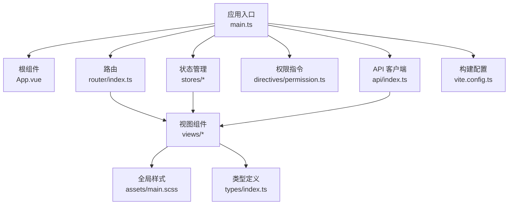
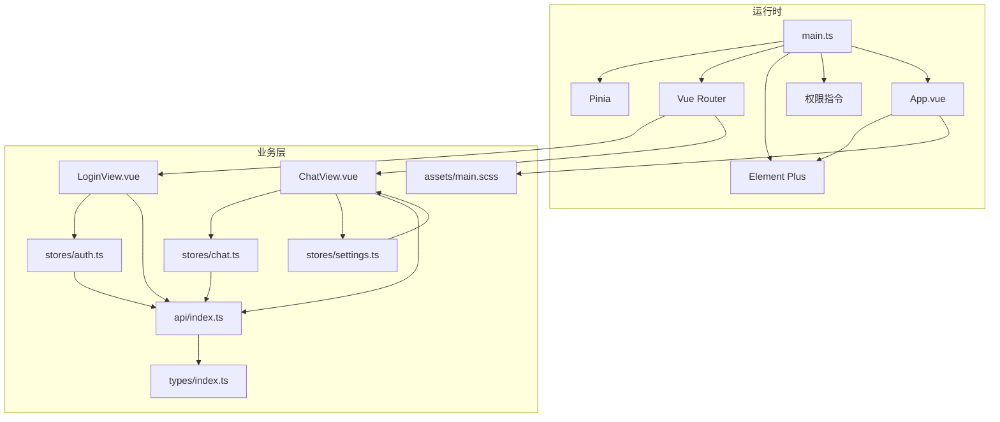
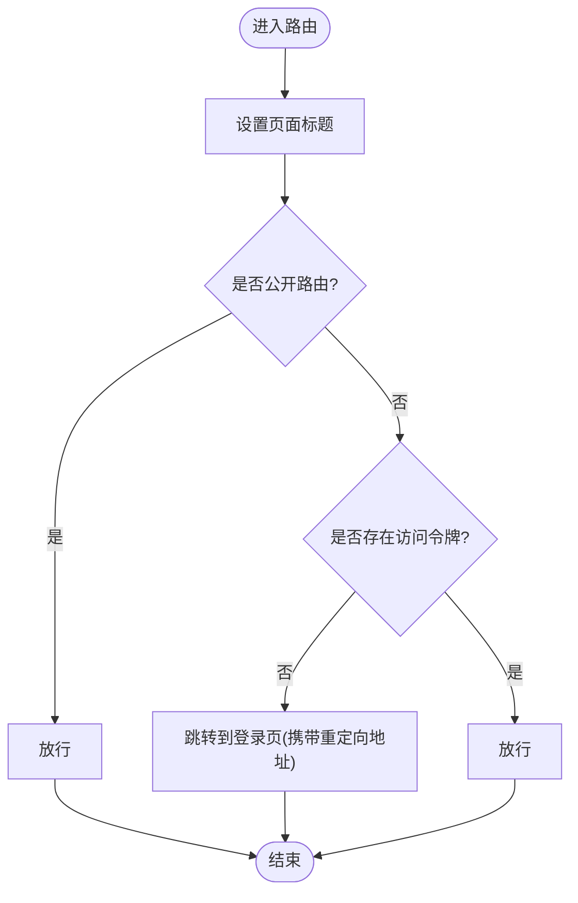
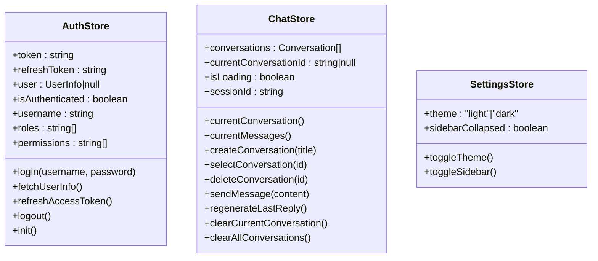
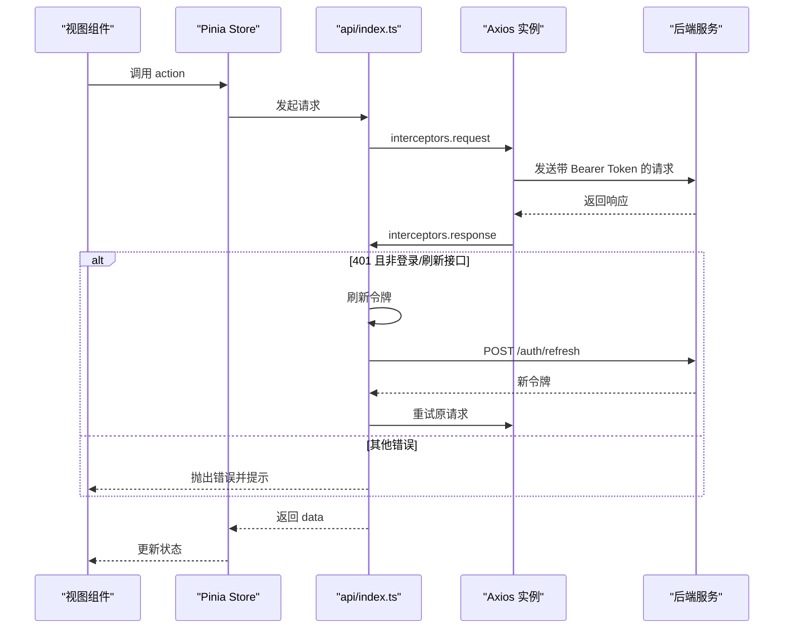
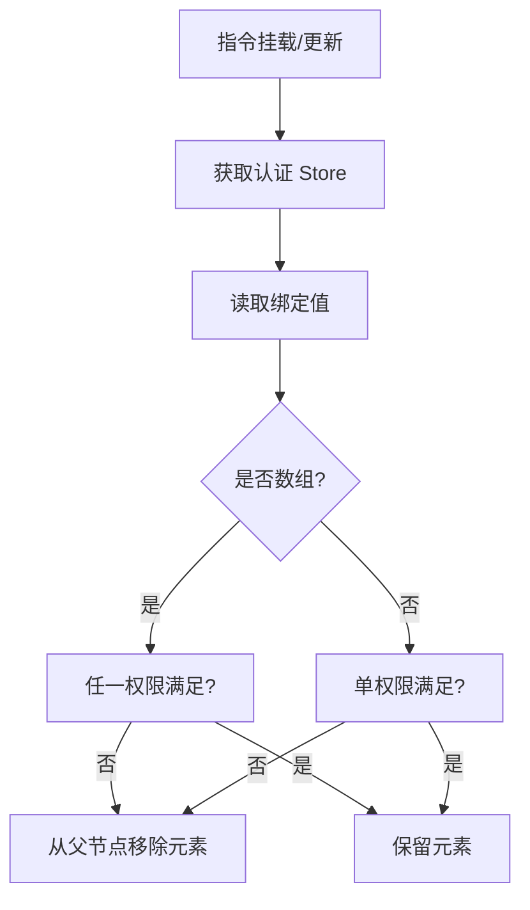
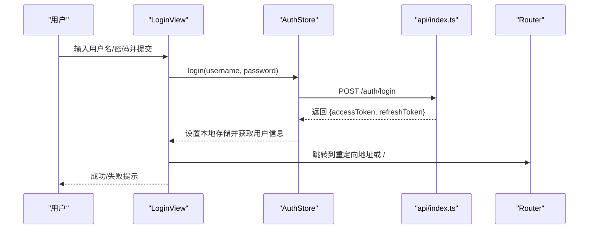
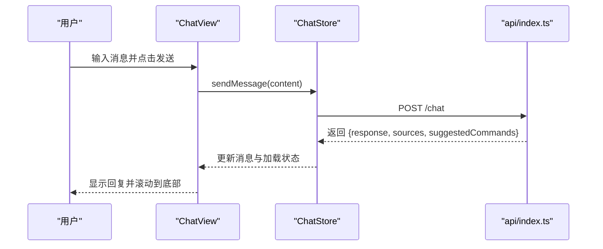
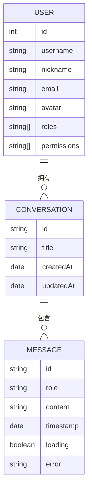
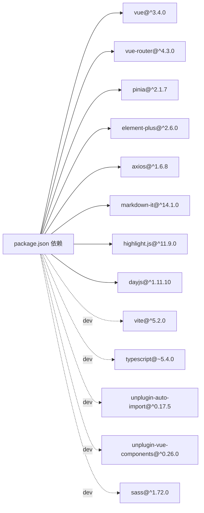

# 前端应用架构

<cite>
**本文引用的文件**
- [package.json](file://netdata-ai-frontend/package.json)
- [main.ts](file://netdata-ai-frontend/src/main.ts)
- [App.vue](file://netdata-ai-frontend/src/App.vue)
- [router/index.ts](file://netdata-ai-frontend/src/router/index.ts)
- [stores/index.ts](file://netdata-ai-frontend/src/stores/index.ts)
- [stores/auth.ts](file://netdata-ai-frontend/src/stores/auth.ts)
- [stores/chat.ts](file://netdata-ai-frontend/src/stores/chat.ts)
- [stores/settings.ts](file://netdata-ai-frontend/src/stores/settings.ts)
- [directives/permission.ts](file://netdata-ai-frontend/src/directives/permission.ts)
- [api/index.ts](file://netdata-ai-frontend/src/api/index.ts)
- [vite.config.ts](file://netdata-ai-frontend/vite.config.ts)
- [views/LoginView.vue](file://netdata-ai-frontend/src/views/LoginView.vue)
- [views/ChatView.vue](file://netdata-ai-frontend/src/views/ChatView.vue)
- [types/index.ts](file://netdata-ai-frontend/src/types/index.ts)
- [assets/main.scss](file://netdata-ai-frontend/src/assets/main.scss)
</cite>

## 目录
1. [引言](#引言)
2. [项目结构](#项目结构)
3. [核心组件](#核心组件)
4. [架构总览](#架构总览)
5. [详细组件分析](#详细组件分析)
6. [依赖关系分析](#依赖关系分析)
7. [性能考量](#性能考量)
8. [故障排查指南](#故障排查指南)
9. [结论](#结论)
10. [附录](#附录)

## 引言
本文件为基于 Vue 3 + TypeScript 的前端应用架构文档，聚焦于组件层次结构、状态管理模式（Pinia）、路由配置、Element Plus 组件库集成与主题定制、API 接口封装（请求/响应拦截与统一错误处理）、以及组件开发最佳实践与用户交互流程。目标是帮助开发者快速理解并高效扩展该系统。

## 项目结构
应用采用典型的 Vue 3 单页应用结构，核心模块包括：
- 应用入口与插件注册：main.ts
- 根组件与国际化配置：App.vue
- 路由与导航守卫：router/index.ts
- 状态管理（Pinia Store）：stores 下各模块
- 权限指令：directives/permission.ts
- API 客户端与业务接口封装：api/index.ts
- 构建与开发配置：vite.config.ts
- 视图组件：views 下各页面
- 类型定义：types/index.ts
- 全局样式：assets/main.scss

图表来源
- [main.ts:1-35](file://netdata-ai-frontend/src/main.ts#L1-L35)
- [App.vue:1-19](file://netdata-ai-frontend/src/App.vue#L1-L19)
- [router/index.ts:1-70](file://netdata-ai-frontend/src/router/index.ts#L1-L70)
- [stores/index.ts:1-4](file://netdata-ai-frontend/src/stores/index.ts#L1-L4)
- [directives/permission.ts:1-63](file://netdata-ai-frontend/src/directives/permission.ts#L1-L63)
- [api/index.ts:1-290](file://netdata-ai-frontend/src/api/index.ts#L1-L290)
- [vite.config.ts:1-52](file://netdata-ai-frontend/vite.config.ts#L1-L52)
- [views/LoginView.vue:1-150](file://netdata-ai-frontend/src/views/LoginView.vue#L1-L150)
- [views/ChatView.vue:1-335](file://netdata-ai-frontend/src/views/ChatView.vue#L1-L335)
- [types/index.ts:1-169](file://netdata-ai-frontend/src/types/index.ts#L1-L169)
- [assets/main.scss:1-176](file://netdata-ai-frontend/src/assets/main.scss#L1-L176)

章节来源
- [package.json:1-37](file://netdata-ai-frontend/package.json#L1-L37)
- [main.ts:1-35](file://netdata-ai-frontend/src/main.ts#L1-L35)
- [App.vue:1-19](file://netdata-ai-frontend/src/App.vue#L1-L19)
- [router/index.ts:1-70](file://netdata-ai-frontend/src/router/index.ts#L1-L70)
- [vite.config.ts:1-52](file://netdata-ai-frontend/vite.config.ts#L1-L52)

## 核心组件
- 应用入口与插件初始化：创建应用实例、注册 Pinia、路由、Element Plus、图标、权限指令，并在挂载前初始化认证状态。
- 根组件：通过 Element Plus Config Provider 设置语言环境。
- 路由系统：定义页面路由、导航守卫（认证检查、页面标题设置）。
- 状态管理：认证状态、聊天状态、全局设置三类 Store，均使用组合式 Store API。
- 权限指令：v-permission 与 v-role，基于认证 Store 动态控制 DOM 可见性。
- API 客户端：Axios 实例封装，统一请求头、拦截器、错误处理与 Token 刷新。
- 构建配置：Vite 插件自动导入 Element Plus 组件与类型、路径别名、开发代理与产物分包。

章节来源
- [main.ts:1-35](file://netdata-ai-frontend/src/main.ts#L1-L35)
- [App.vue:1-19](file://netdata-ai-frontend/src/App.vue#L1-L19)
- [router/index.ts:1-70](file://netdata-ai-frontend/src/router/index.ts#L1-L70)
- [stores/auth.ts:1-119](file://netdata-ai-frontend/src/stores/auth.ts#L1-L119)
- [stores/chat.ts:1-210](file://netdata-ai-frontend/src/stores/chat.ts#L1-L210)
- [stores/settings.ts:1-32](file://netdata-ai-frontend/src/stores/settings.ts#L1-L32)
- [directives/permission.ts:1-63](file://netdata-ai-frontend/src/directives/permission.ts#L1-L63)
- [api/index.ts:1-290](file://netdata-ai-frontend/src/api/index.ts#L1-L290)
- [vite.config.ts:1-52](file://netdata-ai-frontend/vite.config.ts#L1-L52)

## 架构总览
整体采用“入口 -> 插件注册 -> 路由 -> 视图 -> Store/API”的线性架构，配合 Element Plus 组件库与自动导入机制提升开发效率；状态管理以 Pinia 为核心，围绕认证、聊天与设置三大域进行解耦；API 层通过 Axios 拦截器实现统一鉴权、刷新与错误处理。

图表来源
- [main.ts:1-35](file://netdata-ai-frontend/src/main.ts#L1-L35)
- [App.vue:1-19](file://netdata-ai-frontend/src/App.vue#L1-L19)
- [router/index.ts:1-70](file://netdata-ai-frontend/src/router/index.ts#L1-L70)
- [stores/auth.ts:1-119](file://netdata-ai-frontend/src/stores/auth.ts#L1-L119)
- [stores/chat.ts:1-210](file://netdata-ai-frontend/src/stores/chat.ts#L1-L210)
- [stores/settings.ts:1-32](file://netdata-ai-frontend/src/stores/settings.ts#L1-L32)
- [api/index.ts:1-290](file://netdata-ai-frontend/src/api/index.ts#L1-L290)
- [views/LoginView.vue:1-150](file://netdata-ai-frontend/src/views/LoginView.vue#L1-L150)
- [views/ChatView.vue:1-335](file://netdata-ai-frontend/src/views/ChatView.vue#L1-L335)
- [types/index.ts:1-169](file://netdata-ai-frontend/src/types/index.ts#L1-L169)
- [assets/main.scss:1-176](file://netdata-ai-frontend/src/assets/main.scss#L1-L176)

## 详细组件分析

### 路由与导航守卫
- 路由定义：登录页、聊天页、告警仪表板、知识库、审批、用户管理等。
- 导航守卫：设置页面标题；对非公开路由进行认证校验；未认证跳转至登录页并携带重定向地址。
- 历史模式：基于浏览器 History API。

图表来源
- [router/index.ts:49-67](file://netdata-ai-frontend/src/router/index.ts#L49-L67)

章节来源
- [router/index.ts:1-70](file://netdata-ai-frontend/src/router/index.ts#L1-L70)

### 状态管理（Pinia）
- 认证状态（useAuthStore）
  - 状态：访问令牌、刷新令牌、用户信息。
  - 计算属性：是否已认证、用户名、角色、权限。
  - 行为：登录、获取用户信息、刷新访问令牌、登出、初始化。
  - 权限判定：支持角色与权限判断，超级管理员绕过权限。
- 聊天状态（useChatStore）
  - 状态：对话列表、当前对话 ID、加载状态、会话 ID。
  - 计算属性：当前对话、当前消息列表。
  - 行为：创建/选择/删除对话、发送消息、重新生成回复、清空对话、生成唯一标识。
- 全局设置（useSettingsStore）
  - 状态：主题（明/暗）、侧边栏折叠。
  - 行为：切换主题、切换侧边栏。

图表来源
- [stores/auth.ts:22-118](file://netdata-ai-frontend/src/stores/auth.ts#L22-L118)
- [stores/chat.ts:12-209](file://netdata-ai-frontend/src/stores/chat.ts#L12-L209)
- [stores/settings.ts:7-31](file://netdata-ai-frontend/src/stores/settings.ts#L7-L31)

章节来源
- [stores/auth.ts:1-119](file://netdata-ai-frontend/src/stores/auth.ts#L1-L119)
- [stores/chat.ts:1-210](file://netdata-ai-frontend/src/stores/chat.ts#L1-L210)
- [stores/settings.ts:1-32](file://netdata-ai-frontend/src/stores/settings.ts#L1-L32)
- [stores/index.ts:1-4](file://netdata-ai-frontend/src/stores/index.ts#L1-L4)

### API 接口封装（Axios + 拦截器）
- 客户端配置：基础 URL、超时、内容类型。
- 请求拦截器：自动附加 Authorization 头。
- 响应拦截器：统一返回 data；401 自动刷新令牌并重试；403 提示权限不足；429 提示限流；其他错误统一弹窗提示。
- 令牌刷新：单实例并发控制，订阅等待刷新完成的请求队列。
- API 分组：聊天、知识库、告警、审批、认证、用户、角色、系统健康检查等。

图表来源
- [api/index.ts:29-112](file://netdata-ai-frontend/src/api/index.ts#L29-L112)
- [api/index.ts:123-233](file://netdata-ai-frontend/src/api/index.ts#L123-L233)

章节来源
- [api/index.ts:1-290](file://netdata-ai-frontend/src/api/index.ts#L1-L290)

### Element Plus 集成与主题配置
- 插件注册：在入口文件中注册 Element Plus，并批量注册图标组件。
- 自动导入：Vite 插件自动导入 Element Plus 组件与类型，减少手动引入。
- 国际化：根组件通过 Config Provider 设置语言为简体中文。
- 样式覆盖：全局样式覆盖 Element Plus 组件样式，统一圆角、阴影与滚动条风格；代码高亮主题适配。

章节来源
- [main.ts:3-25](file://netdata-ai-frontend/src/main.ts#L3-L25)
- [vite.config.ts:10-22](file://netdata-ai-frontend/vite.config.ts#L10-L22)
- [App.vue:1-10](file://netdata-ai-frontend/src/App.vue#L1-L10)
- [assets/main.scss:62-106](file://netdata-ai-frontend/src/assets/main.scss#L62-L106)

### 权限指令与页面级权限控制
- v-permission：根据所需权限集合动态移除无权限元素。
- v-role：根据所需角色集合动态移除无角色元素。
- 在入口处注册指令，确保全局可用。

图表来源
- [directives/permission.ts:9-30](file://netdata-ai-frontend/src/directives/permission.ts#L9-L30)
- [directives/permission.ts:36-57](file://netdata-ai-frontend/src/directives/permission.ts#L36-L57)

章节来源
- [directives/permission.ts:1-63](file://netdata-ai-frontend/src/directives/permission.ts#L1-L63)

### 视图组件与交互流程

#### 登录视图（LoginView）
- 表单校验：用户名必填、密码长度不少于 6。
- 登录流程：调用认证 Store 登录，成功后读取重定向地址并跳转，失败弹出错误提示。

图表来源
- [views/LoginView.vue:79-95](file://netdata-ai-frontend/src/views/LoginView.vue#L79-L95)
- [stores/auth.ts:42-53](file://netdata-ai-frontend/src/stores/auth.ts#L42-L53)
- [api/index.ts:220-233](file://netdata-ai-frontend/src/api/index.ts#L220-L233)

章节来源
- [views/LoginView.vue:1-150](file://netdata-ai-frontend/src/views/LoginView.vue#L1-L150)
- [stores/auth.ts:1-119](file://netdata-ai-frontend/src/stores/auth.ts#L1-L119)
- [api/index.ts:1-290](file://netdata-ai-frontend/src/api/index.ts#L1-L290)

#### 聊天视图（ChatView）
- 侧边栏：显示对话列表，支持新建、选择、删除对话。
- 主面板：消息列表、输入区、快捷示例、清空对话。
- 交互：发送消息、回车换行、Shift+Enter 换行、自动滚动到底部、重试消息、清空确认。

图表来源
- [views/ChatView.vue:127-138](file://netdata-ai-frontend/src/views/ChatView.vue#L127-L138)
- [stores/chat.ts:82-138](file://netdata-ai-frontend/src/stores/chat.ts#L82-L138)
- [api/index.ts:123-144](file://netdata-ai-frontend/src/api/index.ts#L123-L144)

章节来源
- [views/ChatView.vue:1-335](file://netdata-ai-frontend/src/views/ChatView.vue#L1-L335)
- [stores/chat.ts:1-210](file://netdata-ai-frontend/src/stores/chat.ts#L1-L210)
- [api/index.ts:1-290](file://netdata-ai-frontend/src/api/index.ts#L1-L290)

### 类型系统与数据模型
- 认证相关：登录请求、Token 响应、用户信息。
- 聊天相关：消息角色、消息、来源引用、命令建议、对话会话。
- 告警相关：告警级别、状态、记录。
- 审批相关：审批状态、请求。
- 知识库相关：文档、上传请求。
- API 响应：聊天请求/响应等。

图表来源
- [types/index.ts:24-34](file://netdata-ai-frontend/src/types/index.ts#L24-L34)
- [types/index.ts:74-80](file://netdata-ai-frontend/src/types/index.ts#L74-L80)
- [types/index.ts:41-55](file://netdata-ai-frontend/src/types/index.ts#L41-L55)

章节来源
- [types/index.ts:1-169](file://netdata-ai-frontend/src/types/index.ts#L1-L169)

## 依赖关系分析
- 运行时依赖：Vue 3、Vue Router、Pinia、Element Plus、Axios、markdown-it、highlight.js、dayjs。
- 开发依赖：Vite、Vue TS、TypeScript、自动导入与组件解析插件、Sass。
- 构建优化：按需拆分 vendor 包，Element Plus 与 Vue/Pinia 独立分包，减少重复依赖。

图表来源
- [package.json:13-35](file://netdata-ai-frontend/package.json#L13-L35)

章节来源
- [package.json:1-37](file://netdata-ai-frontend/package.json#L1-L37)
- [vite.config.ts:38-50](file://netdata-ai-frontend/vite.config.ts#L38-L50)

## 性能考量
- 代码分割：通过 Vite 的 manualChunks 将 Element Plus 与 Vue 生态独立打包，降低缓存失效影响。
- 组件懒加载：路由组件使用动态导入，减少首屏体积。
- 状态粒度：Store 按功能域拆分，避免全局状态臃肿。
- 样式按需：Element Plus 样式通过自动导入解析器按需引入，减少冗余。
- 交互优化：聊天视图监听消息数量变化自动滚动，提升用户体验。

章节来源
- [vite.config.ts:38-50](file://netdata-ai-frontend/vite.config.ts#L38-L50)
- [router/index.ts:9-44](file://netdata-ai-frontend/src/router/index.ts#L9-L44)
- [views/ChatView.vue:170-176](file://netdata-ai-frontend/src/views/ChatView.vue#L170-L176)

## 故障排查指南
- 登录失败
  - 检查表单校验与错误提示；确认后端接口与代理配置。
  - 参考：[views/LoginView.vue:79-95](file://netdata-ai-frontend/src/views/LoginView.vue#L79-L95)，[api/index.ts:220-233](file://netdata-ai-frontend/src/api/index.ts#L220-L233)
- 401 未认证
  - 检查本地存储的访问/刷新令牌；确认刷新逻辑与拦截器处理。
  - 参考：[api/index.ts:44-112](file://netdata-ai-frontend/src/api/index.ts#L44-L112)
- 403 权限不足
  - 检查用户角色/权限；确认 v-permission 指令是否正确应用。
  - 参考：[api/index.ts:94-98](file://netdata-ai-frontend/src/api/index.ts#L94-L98)，[directives/permission.ts:18-30](file://netdata-ai-frontend/src/directives/permission.ts#L18-L30)
- 429 请求频繁
  - 适当降低请求频率或增加节流；参考提示信息。
  - 参考：[api/index.ts:99-102](file://netdata-frontend/src/api/index.ts#L99-L102)
- 聊天消息不显示
  - 检查 Store 中当前对话与消息列表计算属性；确认发送流程与响应数据。
  - 参考：[stores/chat.ts:29-37](file://netdata-ai-frontend/src/stores/chat.ts#L29-L37)，[stores/chat.ts:82-138](file://netdata-ai-frontend/src/stores/chat.ts#L82-L138)
- 代理与跨域
  - 确认 Vite 代理配置指向后端服务端口。
  - 参考：[vite.config.ts:28-37](file://netdata-ai-frontend/vite.config.ts#L28-L37)

章节来源
- [views/LoginView.vue:1-150](file://netdata-ai-frontend/src/views/LoginView.vue#L1-L150)
- [api/index.ts:1-290](file://netdata-ai-frontend/src/api/index.ts#L1-L290)
- [directives/permission.ts:1-63](file://netdata-ai-frontend/src/directives/permission.ts#L1-L63)
- [stores/chat.ts:1-210](file://netdata-ai-frontend/src/stores/chat.ts#L1-L210)
- [vite.config.ts:28-37](file://netdata-ai-frontend/vite.config.ts#L28-L37)

## 结论
该前端应用以 Vue 3 + TypeScript 为基础，结合 Pinia 实现清晰的状态管理，通过 Element Plus 提升组件开发效率，并以 Axios 拦截器实现统一的认证、刷新与错误处理。路由与权限指令保障了页面安全与可见性控制。整体架构具备良好的可维护性与扩展性，适合在多视图场景下持续演进。

## 附录
- 开发脚本：dev、build、preview、lint、type-check。
- 构建输出：dist 目录，开启 sourcemap 控制与警告阈值调整。
- 路径别名：@ 指向 src，便于模块导入。

章节来源
- [package.json:6-12](file://netdata-ai-frontend/package.json#L6-L12)
- [vite.config.ts:23-27](file://netdata-ai-frontend/vite.config.ts#L23-L27)