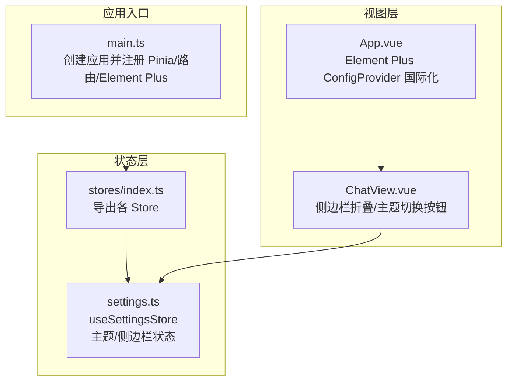
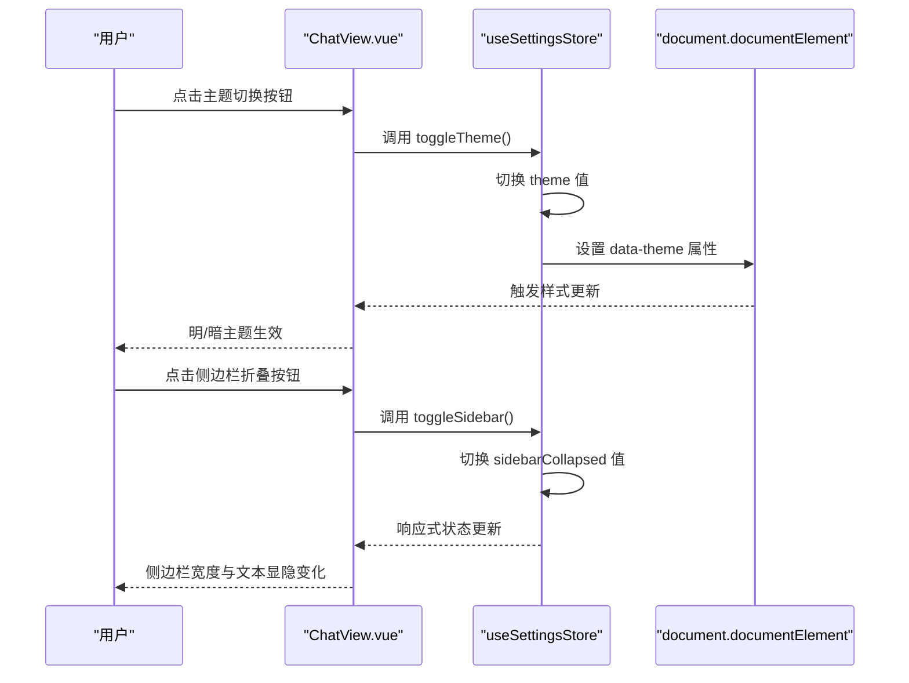
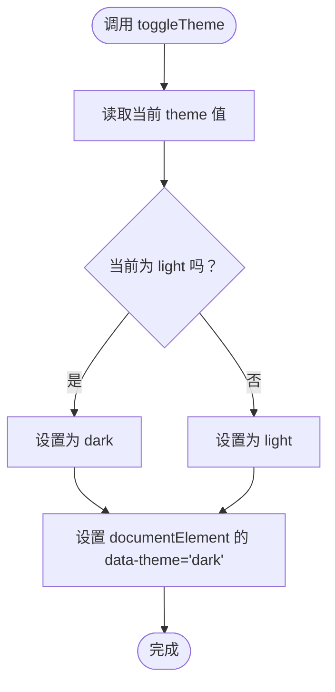
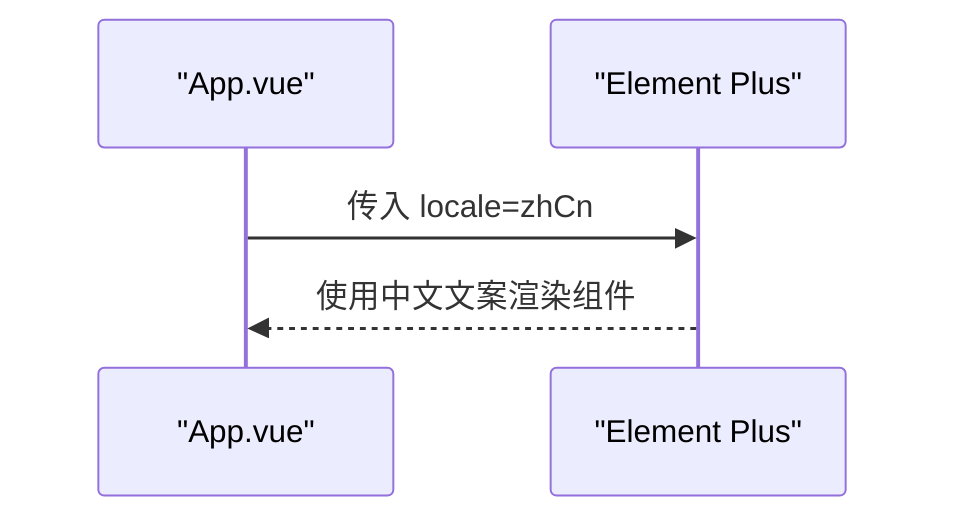
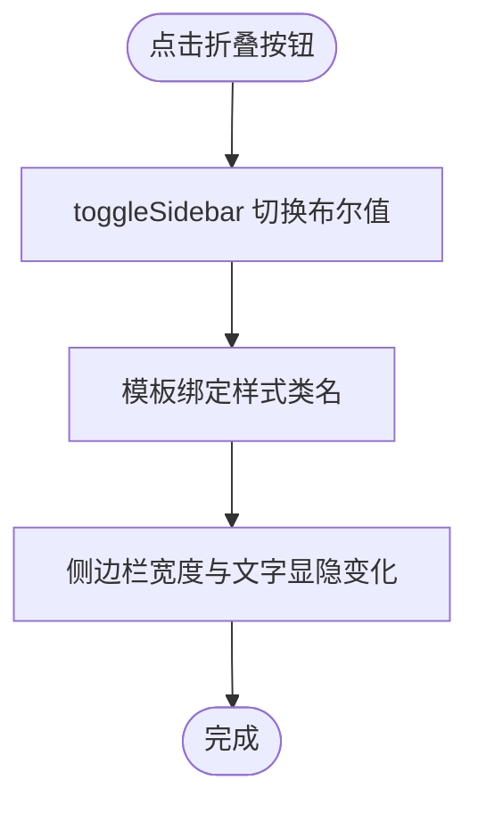
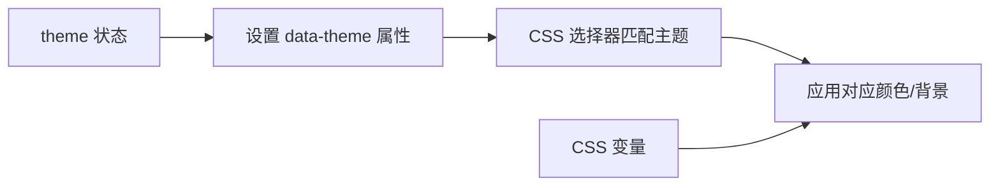
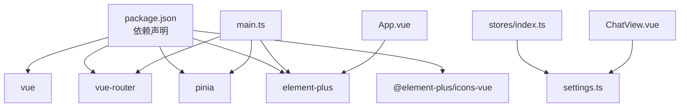
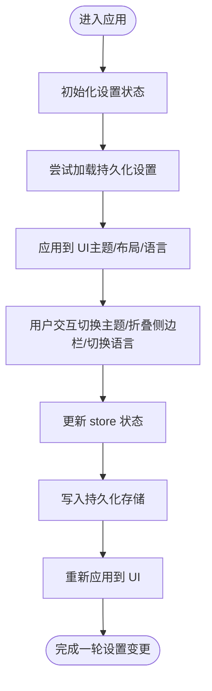

# 全局设置状态

<cite>
**本文引用的文件**
- [settings.ts](file://netdata-ai-frontend/src/stores/settings.ts)
- [index.ts](file://netdata-ai-frontend/src/stores/index.ts)
- [main.ts](file://netdata-ai-frontend/src/main.ts)
- [ChatView.vue](file://netdata-ai-frontend/src/views/ChatView.vue)
- [App.vue](file://netdata-ai-frontend/src/App.vue)
- [main.scss](file://netdata-ai-frontend/src/assets/main.scss)
- [package.json](file://netdata-ai-frontend/package.json)
</cite>

## 目录
1. [简介](#简介)
2. [项目结构](#项目结构)
3. [核心组件](#核心组件)
4. [架构总览](#架构总览)
5. [详细组件分析](#详细组件分析)
6. [依赖关系分析](#依赖关系分析)
7. [性能考量](#性能考量)
8. [故障排除指南](#故障排除指南)
9. [结论](#结论)
10. [附录](#附录)

## 简介
本文件围绕“全局设置状态”进行系统化技术文档编写，聚焦于前端应用中的主题配置、界面布局偏好与国际化支持的实现与扩展建议。当前仓库中已实现的基础设置包括：明暗主题切换与侧边栏折叠控制；主题切换通过根元素属性驱动样式变化；布局偏好通过组件级样式类名控制；国际化通过 Element Plus 的 ConfigProvider 组件完成。本文将从系统架构、数据结构、持久化策略、响应式处理、最佳实践到流程图与配置项说明进行全面阐述。

## 项目结构
前端采用 Vue 3 + Pinia 架构，设置状态集中于独立的 store 中，并在应用入口统一注册。组件通过组合式 API 访问设置状态，实现主题与布局的即时响应。

**图表来源**
- [main.ts:1-35](file://netdata-ai-frontend/src/main.ts#L1-L35)
- [index.ts:1-4](file://netdata-ai-frontend/src/stores/index.ts#L1-L4)
- [settings.ts:1-32](file://netdata-ai-frontend/src/stores/settings.ts#L1-L32)
- [App.vue:1-19](file://netdata-ai-frontend/src/App.vue#L1-L19)
- [ChatView.vue:1-335](file://netdata-ai-frontend/src/views/ChatView.vue#L1-L335)

**章节来源**
- [main.ts:1-35](file://netdata-ai-frontend/src/main.ts#L1-L35)
- [index.ts:1-4](file://netdata-ai-frontend/src/stores/index.ts#L1-L4)
- [settings.ts:1-32](file://netdata-ai-frontend/src/stores/settings.ts#L1-L32)
- [App.vue:1-19](file://netdata-ai-frontend/src/App.vue#L1-L19)
- [ChatView.vue:1-335](file://netdata-ai-frontend/src/views/ChatView.vue#L1-L335)

## 核心组件
- 设置状态 store（useSettingsStore）
  - 状态字段
    - theme：字符串枚举，取值为 light 或 dark
    - sidebarCollapsed：布尔值，表示侧边栏是否折叠
  - 行为方法
    - toggleTheme：切换主题并在根元素设置 data-theme 属性
    - toggleSidebar：切换侧边栏折叠状态
  - 返回值
    - 暴露 theme、sidebarCollapsed、toggleTheme、toggleSidebar

- 国际化配置
  - 在应用根组件中通过 Element Plus 的 ConfigProvider 设置 locale 为 zhCn，实现界面文案的中文显示

- 布局偏好
  - 侧边栏宽度与内容区的切换由 ChatView 中的样式类名控制，受 settings.sidebarCollapsed 影响

**章节来源**
- [settings.ts:7-31](file://netdata-ai-frontend/src/stores/settings.ts#L7-L31)
- [App.vue:2-4](file://netdata-ai-frontend/src/App.vue#L2-L4)
- [ChatView.vue:4,38-40](file://netdata-ai-frontend/src/views/ChatView.vue#L4,L38-L40)

## 架构总览
设置状态在整个应用中的交互路径如下：

**图表来源**
- [ChatView.vue:38-40](file://netdata-ai-frontend/src/views/ChatView.vue#L38-L40)
- [settings.ts:15-23](file://netdata-ai-frontend/src/stores/settings.ts#L15-L23)

## 详细组件分析

### 设置状态 store（useSettingsStore）
- 设计原则
  - 单一职责：仅负责主题与布局偏好的状态管理
  - 响应式：基于 ref 的响应式数据，确保视图层自动更新
  - 最小耦合：通过根元素属性驱动样式，避免对组件内部样式的直接侵入
- 数据结构
  - theme: 枚举类型 light/dark
  - sidebarCollapsed: 布尔类型
- 处理逻辑
  - toggleTheme：切换枚举值并写入根元素的 data-theme，便于 CSS 选择器按主题应用不同样式
  - toggleSidebar：切换布尔值，影响侧边栏的宽度与文字显示
- 扩展点
  - 可增加更多主题（如 auto）、语言（多语言）、布局模式（紧凑/宽松）等字段
  - 可引入持久化策略（localStorage/sessionStorage）

**图表来源**
- [settings.ts:15-18](file://netdata-ai-frontend/src/stores/settings.ts#L15-L18)

**章节来源**
- [settings.ts:7-31](file://netdata-ai-frontend/src/stores/settings.ts#L7-L31)

### 国际化支持（Element Plus ConfigProvider）
- 实现方式
  - 在应用根组件中通过 ConfigProvider 的 locale 属性绑定 zhCn，使 Element Plus 组件使用中文文案
- 适用范围
  - 表单校验提示、弹框标题与按钮文案、分页组件等
- 扩展建议
  - 支持动态切换语言时，可将 locale 作为 store 字段管理，并在切换时更新

**图表来源**
- [App.vue:2-4](file://netdata-ai-frontend/src/App.vue#L2-L4)

**章节来源**
- [App.vue:2-4](file://netdata-ai-frontend/src/App.vue#L2-L4)

### 布局偏好（侧边栏折叠）
- 实现方式
  - ChatView 中根据 settings.sidebarCollapsed 动态绑定样式类名，控制侧边栏宽度与文字显隐
- 响应式更新
  - 通过 Pinia 的响应式状态，当 sidebarCollapsed 改变时，模板自动重新计算并应用样式
- 扩展建议
  - 可增加布局模式（如紧凑/宽松）、导航位置（左侧/右侧）等

**图表来源**
- [ChatView.vue:4,38-40](file://netdata-ai-frontend/src/views/ChatView.vue#L4,L38-L40)
- [settings.ts:21-23](file://netdata-ai-frontend/src/stores/settings.ts#L21-L23)

**章节来源**
- [ChatView.vue:4,38-40](file://netdata-ai-frontend/src/views/ChatView.vue#L4,L38-L40)
- [settings.ts:21-23](file://netdata-ai-frontend/src/stores/settings.ts#L21-L23)

### 样式与主题联动
- CSS 变量与根元素属性
  - 根元素上设置 data-theme 属性后，可通过 CSS 选择器按主题应用不同颜色与背景
  - 全局样式文件定义了基础 CSS 变量，供组件与 Element Plus 组件共享
- 代码高亮主题
  - 代码高亮组件使用深色背景，适配暗主题场景

**图表来源**
- [settings.ts:15-18](file://netdata-ai-frontend/src/stores/settings.ts#L15-L18)
- [main.scss:6-24](file://netdata-ai-frontend/src/assets/main.scss#L6-L24)

**章节来源**
- [settings.ts:15-18](file://netdata-ai-frontend/src/stores/settings.ts#L15-L18)
- [main.scss:6-24](file://netdata-ai-frontend/src/assets/main.scss#L6-L24)

## 依赖关系分析
- 应用入口依赖
  - main.ts 注册 Pinia、路由与 Element Plus，并初始化认证状态
- 状态导出与使用
  - stores/index.ts 导出 useSettingsStore，组件通过组合式 API 访问
- 组件依赖
  - ChatView.vue 依赖 useSettingsStore 与 useChatStore，实现布局与消息交互
- 依赖图

**图表来源**
- [package.json:13-22](file://netdata-ai-frontend/package.json#L13-L22)
- [main.ts:16-25](file://netdata-ai-frontend/src/main.ts#L16-L25)
- [index.ts:2](file://netdata-ai-frontend/src/stores/index.ts#L2)
- [ChatView.vue:103-108](file://netdata-ai-frontend/src/views/ChatView.vue#L103-L108)
- [App.vue:2-4](file://netdata-ai-frontend/src/App.vue#L2-L4)

**章节来源**
- [package.json:13-22](file://netdata-ai-frontend/package.json#L13-L22)
- [main.ts:16-25](file://netdata-ai-frontend/src/main.ts#L16-L25)
- [index.ts:2](file://netdata-ai-frontend/src/stores/index.ts#L2)
- [ChatView.vue:103-108](file://netdata-ai-frontend/src/views/ChatView.vue#L103-L108)
- [App.vue:2-4](file://netdata-ai-frontend/src/App.vue#L2-L4)

## 性能考量
- 响应式更新粒度
  - 使用 ref 粒度的状态更新，避免不必要的组件重渲染
- DOM 操作最小化
  - 主题切换仅设置根元素属性，不触发大规模样式重排
- 样式复用
  - CSS 变量与 Element Plus 组件样式复用，减少重复计算

## 故障排除指南
- 主题切换无效
  - 检查根元素是否存在 data-theme 属性，确认 CSS 选择器是否正确匹配
  - 确认 useSettingsStore 的 toggleTheme 是否被调用
- 侧边栏切换无效果
  - 检查 ChatView 中是否正确绑定样式类名与 settings.sidebarCollapsed
  - 确认 toggleSidebar 是否被调用且状态已更新
- 国际化未生效
  - 确认 App.vue 中 ConfigProvider 的 locale 是否设置为 zhCn
  - 检查 Element Plus 版本与 zhCn 的导入路径是否一致

**章节来源**
- [settings.ts:15-23](file://netdata-ai-frontend/src/stores/settings.ts#L15-L23)
- [ChatView.vue:4,38-40](file://netdata-ai-frontend/src/views/ChatView.vue#L4,L38-L40)
- [App.vue:2-4](file://netdata-ai-frontend/src/App.vue#L2-L4)

## 结论
当前设置状态实现了主题与布局偏好的基础能力，具备良好的响应式与低耦合特性。建议后续引入持久化策略与国际化动态切换、主题扩展与布局模式增强，以提升用户体验与可维护性。

## 附录

### 设置管理流程图（概念性）

### 配置项说明
- 主题（theme）
  - 类型：枚举（light/dark）
  - 默认值：light
  - 影响：通过根元素 data-theme 属性驱动 CSS 选择器
- 侧边栏折叠（sidebarCollapsed）
  - 类型：布尔
  - 默认值：false
  - 影响：控制 ChatView 侧边栏宽度与文字显隐
- 国际化（locale）
  - 类型：Element Plus locale 对象
  - 默认值：zhCn
  - 影响：Element Plus 组件文案