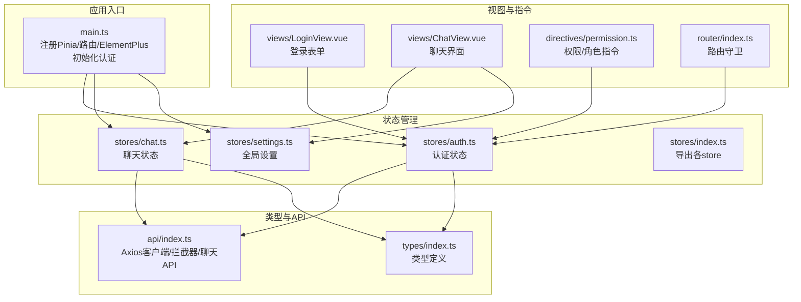
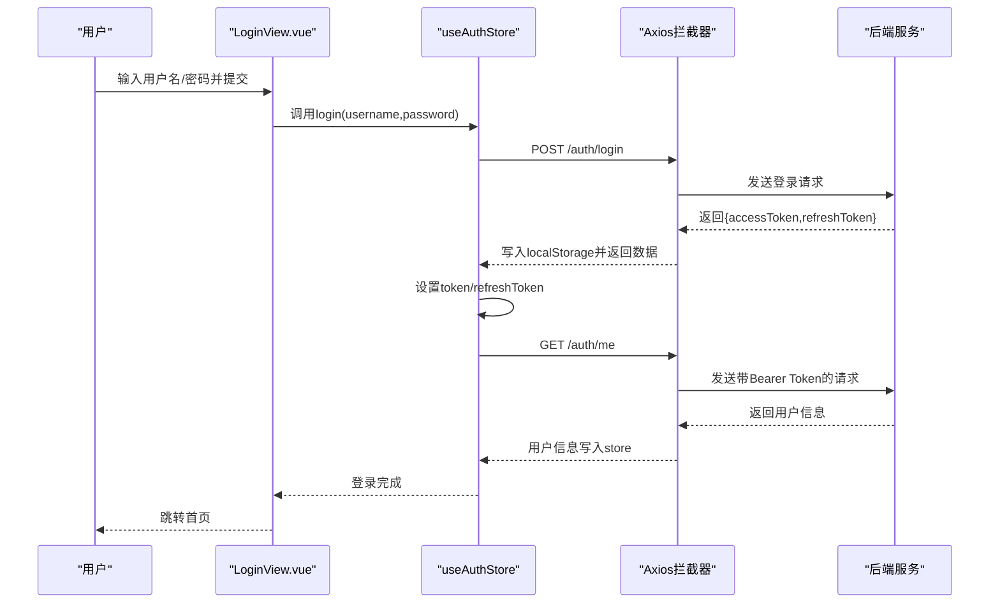
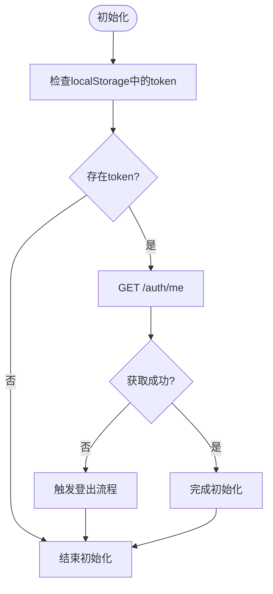
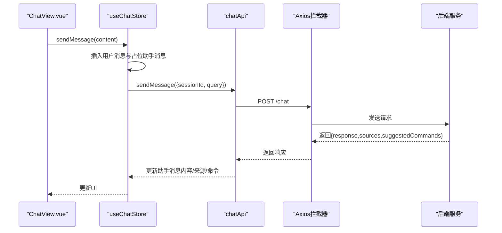
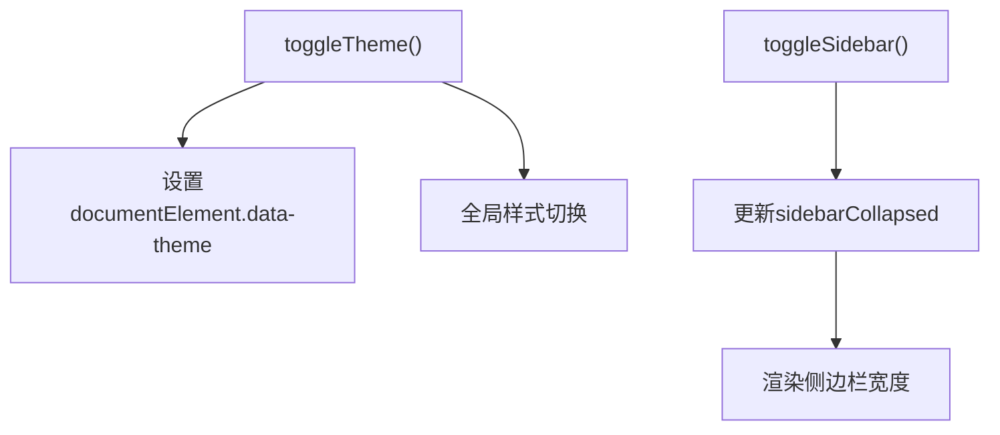
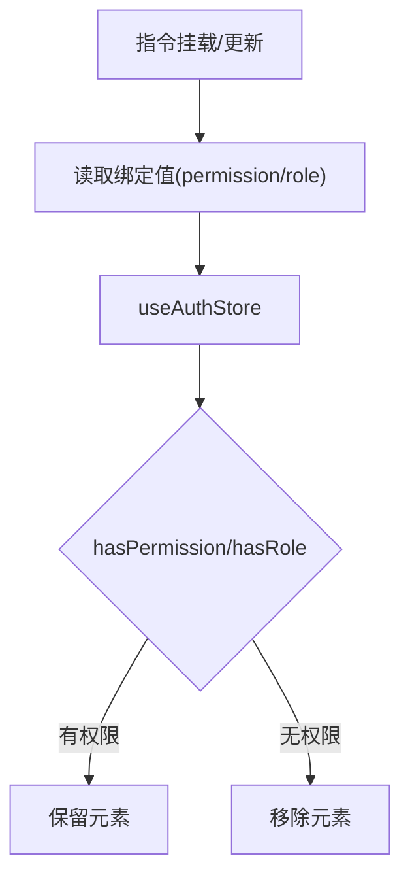
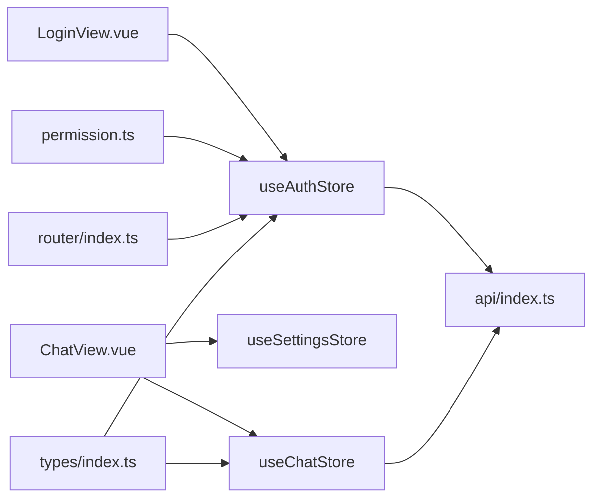

# 状态管理设计

<cite>
**本文引用的文件**
- [stores/index.ts](file://netdata-ai-frontend/src/stores/index.ts)
- [stores/auth.ts](file://netdata-ai-frontend/src/stores/auth.ts)
- [stores/chat.ts](file://netdata-ai-frontend/src/stores/chat.ts)
- [stores/settings.ts](file://netdata-ai-frontend/src/stores/settings.ts)
- [types/index.ts](file://netdata-ai-frontend/src/types/index.ts)
- [api/index.ts](file://netdata-ai-frontend/src/api/index.ts)
- [main.ts](file://netdata-ai-frontend/src/main.ts)
- [views/LoginView.vue](file://netdata-ai-frontend/src/views/LoginView.vue)
- [views/ChatView.vue](file://netdata-ai-frontend/src/views/ChatView.vue)
- [directives/permission.ts](file://netdata-ai-frontend/src/directives/permission.ts)
- [router/index.ts](file://netdata-ai-frontend/src/router/index.ts)
</cite>

## 目录
1. [简介](#简介)
2. [项目结构](#项目结构)
3. [核心组件](#核心组件)
4. [架构总览](#架构总览)
5. [详细组件分析](#详细组件分析)
6. [依赖关系分析](#依赖关系分析)
7. [性能考量](#性能考量)
8. [故障排查指南](#故障排查指南)
9. [结论](#结论)
10. [附录](#附录)

## 简介
本文件为基于 Pinia 的状态管理架构文档，聚焦以下目标：
- 解释状态分区与模块化设计，以及状态持久化策略
- 详述认证状态管理（用户信息、权限状态、登录状态同步）
- 阐明聊天状态管理（消息历史、会话状态、实时通信状态）
- 解释全局设置状态（主题、语言、布局偏好）
- 提供状态设计原则、异步处理、调试与性能优化的最佳实践
- 给出状态流转图与数据流分析

## 项目结构
前端采用模块化组织，状态管理集中在 stores 目录，类型定义在 types 目录，API 客户端在 api 目录，视图组件在 views 目录，权限指令在 directives 目录，路由在 router 目录。应用入口 main.ts 中注册 Pinia 并初始化认证状态。

图表来源
- [main.ts:1-35](file://netdata-ai-frontend/src/main.ts#L1-L35)
- [stores/index.ts:1-4](file://netdata-ai-frontend/src/stores/index.ts#L1-L4)
- [stores/auth.ts:1-119](file://netdata-ai-frontend/src/stores/auth.ts#L1-L119)
- [stores/chat.ts:1-210](file://netdata-ai-frontend/src/stores/chat.ts#L1-L210)
- [stores/settings.ts:1-32](file://netdata-ai-frontend/src/stores/settings.ts#L1-L32)
- [types/index.ts:1-169](file://netdata-ai-frontend/src/types/index.ts#L1-L169)
- [api/index.ts:1-290](file://netdata-ai-frontend/src/api/index.ts#L1-L290)
- [views/LoginView.vue:1-150](file://netdata-ai-frontend/src/views/LoginView.vue#L1-L150)
- [views/ChatView.vue:1-335](file://netdata-ai-frontend/src/views/ChatView.vue#L1-L335)
- [directives/permission.ts:1-63](file://netdata-frontend/src/directives/permission.ts#L1-L63)
- [router/index.ts:1-70](file://netdata-frontend/src/router/index.ts#L1-L70)

章节来源
- [main.ts:1-35](file://netdata-ai-frontend/src/main.ts#L1-L35)
- [stores/index.ts:1-4](file://netdata-ai-frontend/src/stores/index.ts#L1-L4)

## 核心组件
- 认证状态（useAuthStore）
  - 状态：访问令牌、刷新令牌、用户信息
  - 计算属性：是否已认证、用户名、角色集合、权限集合
  - 行为：登录、刷新访问令牌、获取用户信息、登出、初始化
  - 持久化：本地存储访问令牌与刷新令牌
- 聊天状态（useChatStore）
  - 状态：对话列表、当前对话ID、加载状态、会话ID
  - 计算属性：当前对话、当前消息列表
  - 行为：创建/选择/删除对话、发送消息、重新生成回复、清空对话/全部对话
  - 持久化：会话ID（运行时生成），消息历史在内存中维护
- 全局设置（useSettingsStore）
  - 状态：主题(light/dark)、侧边栏折叠
  - 行为：切换主题、切换侧边栏
  - 持久化：主题通过DOM属性持久化到data-theme，侧边栏状态可在需要时持久化

章节来源
- [stores/auth.ts:22-119](file://netdata-ai-frontend/src/stores/auth.ts#L22-L119)
- [stores/chat.ts:12-210](file://netdata-ai-frontend/src/stores/chat.ts#L12-L210)
- [stores/settings.ts:7-32](file://netdata-ai-frontend/src/stores/settings.ts#L7-L32)

## 架构总览
Pinia 作为单一事实来源，结合 Axios 拦截器实现统一的认证与错误处理。路由守卫与权限指令共同保障页面级访问控制。聊天与认证状态分别管理各自的数据域，通过 API 层解耦后端交互。

图表来源
- [views/LoginView.vue:79-95](file://netdata-ai-frontend/src/views/LoginView.vue#L79-L95)
- [stores/auth.ts:42-62](file://netdata-ai-frontend/src/stores/auth.ts#L42-L62)
- [api/index.ts:29-41](file://netdata-ai-frontend/src/api/index.ts#L29-L41)
- [api/index.ts:220-233](file://netdata-ai-frontend/src/api/index.ts#L220-L233)

## 详细组件分析

### 认证状态管理（useAuthStore）
- 设计要点
  - 状态分区：分离访问令牌与刷新令牌，避免混淆；用户信息独立存储
  - 权限模型：支持角色与权限，超级管理员拥有豁免权
  - 生命周期：应用启动时从本地存储恢复令牌并拉取用户信息
- 数据结构与复杂度
  - 用户信息与权限数组查询：O(n)（n为角色/权限数量）
  - hasRole/hasPermission：线性查找，适合小规模RBAC
- 错误处理与同步
  - 登录失败：捕获异常并提示
  - 刷新令牌：统一拦截器处理401，串行刷新队列避免并发刷新
  - 登出：调用后端接口并清理本地存储与路由跳转

图表来源
- [stores/auth.ts:96-100](file://netdata-ai-frontend/src/stores/auth.ts#L96-L100)
- [stores/auth.ts:55-62](file://netdata-ai-frontend/src/stores/auth.ts#L55-L62)

章节来源
- [stores/auth.ts:22-119](file://netdata-ai-frontend/src/stores/auth.ts#L22-L119)
- [api/index.ts:16-27](file://netdata-ai-frontend/src/api/index.ts#L16-L27)
- [api/index.ts:44-112](file://netdata-ai-frontend/src/api/index.ts#L44-L112)
- [main.ts:30-32](file://netdata-ai-frontend/src/main.ts#L30-L32)

### 聊天状态管理（useChatStore）
- 设计要点
  - 会话分区：每个会话独立维护消息历史，支持多会话并存
  - 实时通信：当前实现为普通POST，预留SSE流式接口占位
  - 加载与错误：消息项内含loading/error字段，UI层据此渲染
- 数据结构与复杂度
  - 对话列表查找：O(n)（n为会话数）
  - 当前对话消息列表：O(1)计算属性
- 处理逻辑
  - 发送消息：先插入用户消息与占位助手消息，再发起请求更新内容
  - 重新生成：定位最后一条用户消息并删除末尾助手消息后重发
  - 清空：支持清空当前或全部会话

图表来源
- [views/ChatView.vue:128-138](file://netdata-ai-frontend/src/views/ChatView.vue#L128-L138)
- [stores/chat.ts:82-138](file://netdata-ai-frontend/src/stores/chat.ts#L82-L138)
- [api/index.ts:123-144](file://netdata-ai-frontend/src/api/index.ts#L123-L144)

章节来源
- [stores/chat.ts:12-210](file://netdata-ai-frontend/src/stores/chat.ts#L12-L210)
- [types/index.ts:36-99](file://netdata-ai-frontend/src/types/index.ts#L36-L99)
- [views/ChatView.vue:1-335](file://netdata-ai-frontend/src/views/ChatView.vue#L1-L335)

### 全局设置状态（useSettingsStore）
- 设计要点
  - 主题切换：通过设置data-theme属性影响全局样式
  - 侧边栏折叠：控制聊天界面侧边栏宽度
- 持久化策略
  - 主题：通过DOM属性持久化，刷新后仍生效
  - 侧边栏：可扩展为本地存储，当前实现为内存状态

图表来源
- [stores/settings.ts:14-23](file://netdata-ai-frontend/src/stores/settings.ts#L14-L23)
- [views/ChatView.vue:38-40](file://netdata-ai-frontend/src/views/ChatView.vue#L38-L40)

章节来源
- [stores/settings.ts:7-32](file://netdata-ai-frontend/src/stores/settings.ts#L7-L32)
- [views/ChatView.vue:1-335](file://netdata-ai-frontend/src/views/ChatView.vue#L1-L335)

### 权限与角色指令（v-permission/v-role）
- 设计要点
  - 在挂载与更新阶段动态校验权限/角色
  - 无权限时直接移除DOM节点，避免渲染无效UI
- 与认证状态的协作
  - 指令读取useAuthStore的hasPermission/hasRole结果进行判定

图表来源
- [directives/permission.ts:9-30](file://netdata-ai-frontend/src/directives/permission.ts#L9-L30)
- [directives/permission.ts:36-57](file://netdata-ai-frontend/src/directives/permission.ts#L36-L57)
- [stores/auth.ts:34-39](file://netdata-frontend/src/stores/auth.ts#L34-L39)

章节来源
- [directives/permission.ts:1-63](file://netdata-ai-frontend/src/directives/permission.ts#L1-L63)
- [stores/auth.ts:22-119](file://netdata-ai-frontend/src/stores/auth.ts#L22-L119)

## 依赖关系分析
- 组件耦合
  - ChatView 依赖 useChatStore 与 useSettingsStore
  - LoginView 依赖 useAuthStore
  - 权限指令依赖 useAuthStore
  - 路由守卫依赖 localStorage 与 useAuthStore
- 外部依赖
  - Axios 拦截器负责统一鉴权头注入与401刷新
  - Element Plus 提供UI与消息提示
- 潜在循环依赖
  - 当前结构未发现循环依赖；若未来引入更多跨模块依赖，需谨慎拆分

图表来源
- [views/ChatView.vue:103-108](file://netdata-ai-frontend/src/views/ChatView.vue#L103-L108)
- [views/LoginView.vue:57-61](file://netdata-ai-frontend/src/views/LoginView.vue#L57-L61)
- [directives/permission.ts:1-63](file://netdata-ai-frontend/src/directives/permission.ts#L1-L63)
- [router/index.ts:49-67](file://netdata-ai-frontend/src/router/index.ts#L49-L67)
- [api/index.ts:1-290](file://netdata-ai-frontend/src/api/index.ts#L1-L290)
- [types/index.ts:1-169](file://netdata-ai-frontend/src/types/index.ts#L1-L169)

章节来源
- [router/index.ts:1-70](file://netdata-ai-frontend/src/router/index.ts#L1-L70)
- [api/index.ts:1-290](file://netdata-ai-frontend/src/api/index.ts#L1-L290)

## 性能考量
- 状态分区与计算属性
  - 使用 computed 仅在依赖变更时重算，降低渲染成本
- 异步处理
  - Axios 拦截器统一处理401刷新，避免重复请求与竞态
- UI渲染
  - 聊天消息列表按需渲染，避免一次性渲染大量DOM
- 存储策略
  - 认证令牌持久化于 localStorage，减少重复登录
  - 主题通过 data-theme 持久化，避免样式闪烁
- 建议
  - 对超大消息历史可考虑分页或虚拟滚动
  - 对高频权限判断可缓存结果或使用更高效的数据结构

## 故障排查指南
- 登录失败
  - 检查后端接口返回与错误消息提示
  - 确认用户名/密码格式与后端规则一致
- 401未认证
  - 检查本地存储是否存在refresh_token
  - 查看拦截器是否正确注入Authorization头
  - 确认刷新流程未被阻塞（isRefreshing状态）
- 权限不足
  - 检查用户角色/权限是否包含所需资源
  - 确认指令绑定值格式与权限字符串一致
- 聊天消息不显示
  - 检查isLoading与assistantMessage.loading状态
  - 确认后端响应字段与类型定义一致
- 主题切换无效
  - 检查data-theme属性是否正确设置
  - 确认样式文件对[data-theme]选择器生效

章节来源
- [api/index.ts:44-112](file://netdata-ai-frontend/src/api/index.ts#L44-L112)
- [directives/permission.ts:18-30](file://netdata-ai-frontend/src/directives/permission.ts#L18-L30)
- [stores/chat.ts:120-138](file://netdata-ai-frontend/src/stores/chat.ts#L120-L138)
- [stores/settings.ts:15-18](file://netdata-ai-frontend/src/stores/settings.ts#L15-L18)

## 结论
该状态管理方案以 Pinia 为核心，结合 Axios 拦截器与路由守卫，实现了清晰的状态分区与模块化设计。认证、聊天与全局设置三大领域职责明确，通过类型定义与API封装保证了数据一致性与可维护性。建议在未来进一步完善聊天消息的历史持久化、权限缓存与主题状态的本地持久化，并持续优化大规模数据场景下的渲染性能。

## 附录
- 状态设计原则
  - 单一职责：每个store专注一个业务域
  - 明确边界：通过类型定义约束输入输出
  - 可测试性：将副作用（API）隔离在store外部
- 异步状态处理
  - 使用loading/error字段标记请求状态
  - 在拦截器中统一处理401/403/429等错误
- 状态调试
  - 利用浏览器开发工具观察Pinia状态树
  - 为关键动作添加日志或断点
- 性能优化
  - 合理使用computed与浅拷贝
  - 控制消息历史长度与渲染范围
  - 避免不必要的全局订阅