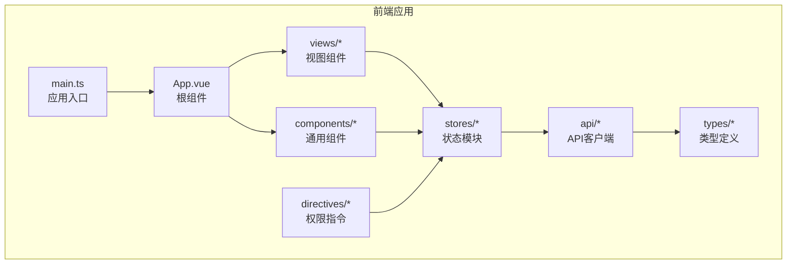
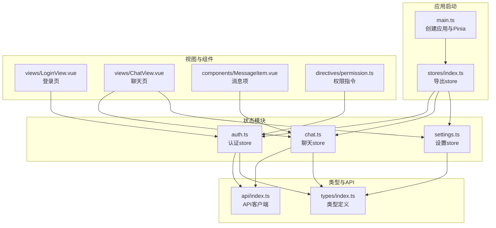
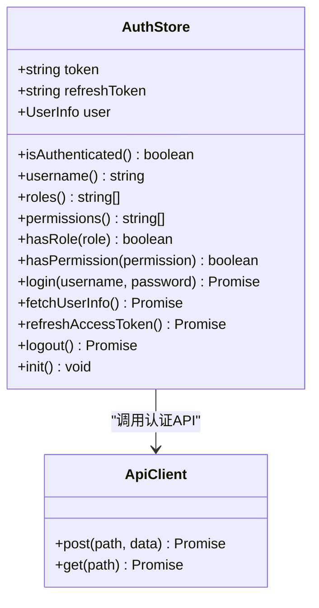
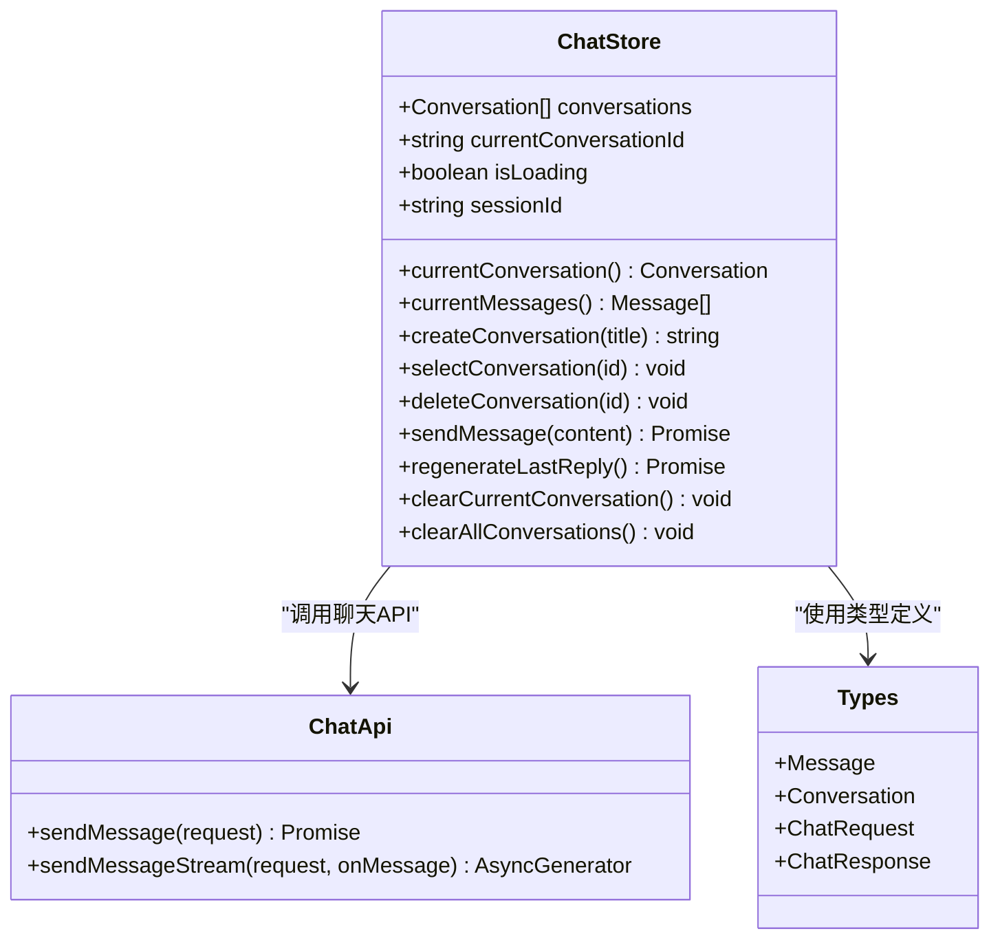
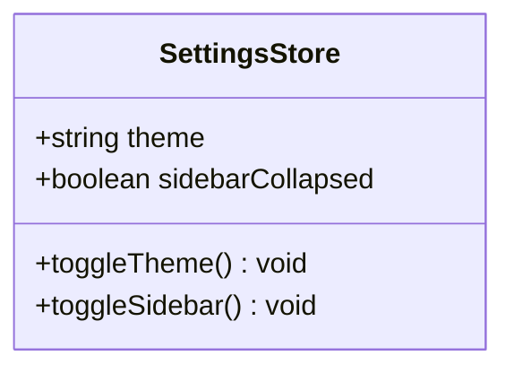
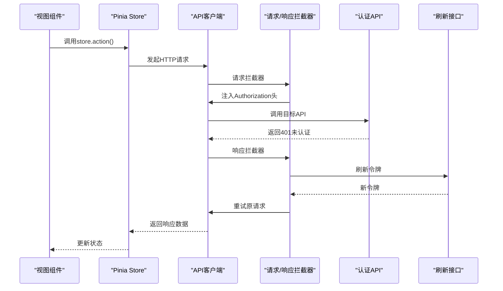
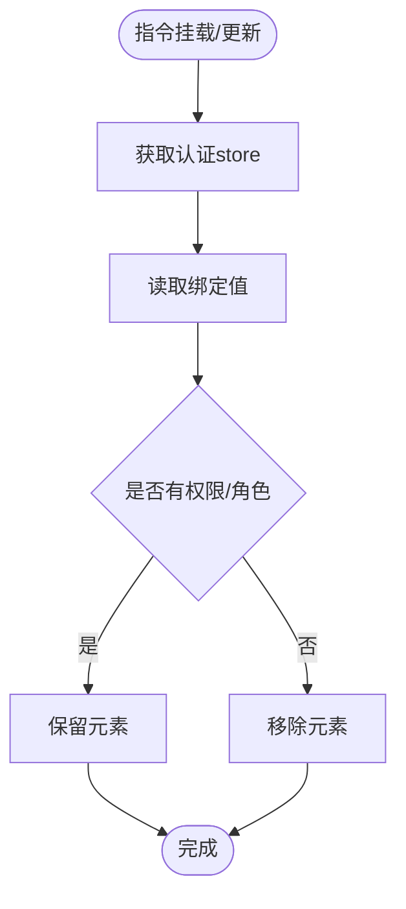
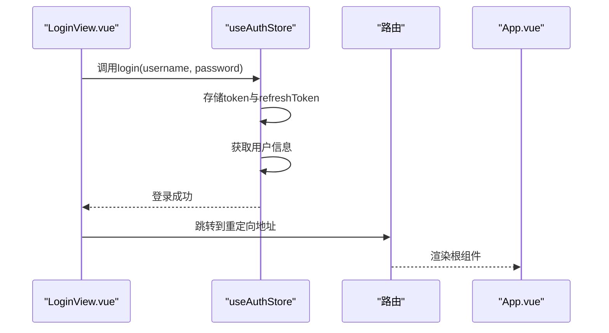
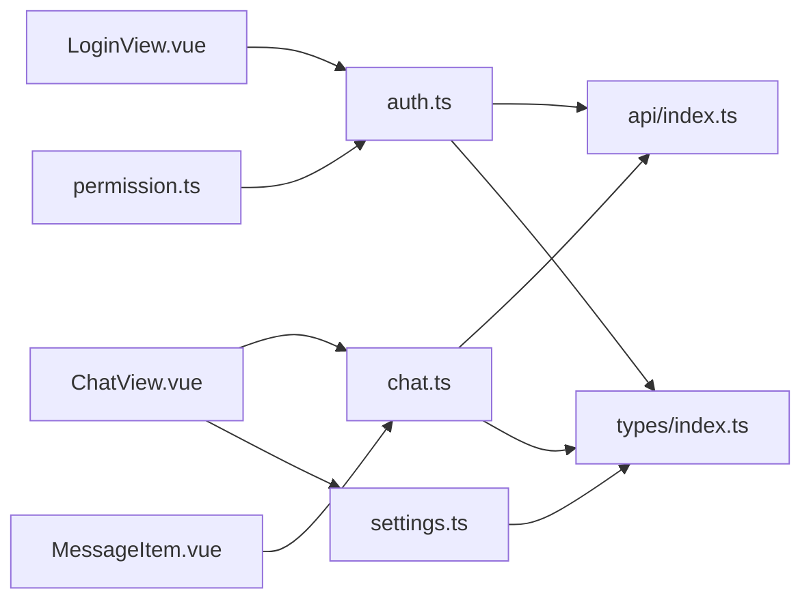

# 状态管理集成

<cite>
**本文档引用的文件**
- [main.ts](file://netdata-ai-frontend/src/main.ts)
- [stores/index.ts](file://netdata-ai-frontend/src/stores/index.ts)
- [stores/auth.ts](file://netdata-ai-frontend/src/stores/auth.ts)
- [stores/chat.ts](file://netdata-ai-frontend/src/stores/chat.ts)
- [stores/settings.ts](file://netdata-ai-frontend/src/stores/settings.ts)
- [types/index.ts](file://netdata-ai-frontend/src/types/index.ts)
- [api/index.ts](file://netdata-ai-frontend/src/api/index.ts)
- [views/LoginView.vue](file://netdata-ai-frontend/src/views/LoginView.vue)
- [views/ChatView.vue](file://netdata-ai-frontend/src/views/ChatView.vue)
- [components/MessageItem.vue](file://netdata-ai-frontend/src/components/MessageItem.vue)
- [directives/permission.ts](file://netdata-ai-frontend/src/directives/permission.ts)
- [App.vue](file://netdata-ai-frontend/src/App.vue)
</cite>

## 目录
1. [引言](#引言)
2. [项目结构](#项目结构)
3. [核心组件](#核心组件)
4. [架构总览](#架构总览)
5. [详细组件分析](#详细组件分析)
6. [依赖关系分析](#依赖关系分析)
7. [性能考虑](#性能考虑)
8. [故障排除指南](#故障排除指南)
9. [结论](#结论)
10. [附录](#附录)

## 引言
本文件针对前端状态管理集成进行系统性技术文档整理，重点覆盖以下方面：
- 多个store模块的协调工作机制，包括状态共享、模块间通信与依赖管理
- store的注册与初始化流程，涵盖模块导入、实例创建与生命周期管理
- 状态管理整体架构，包括store之间的依赖关系、数据流向与事件传播机制
- 状态管理与Vue组件的集成方式，包括响应式数据绑定、计算属性与侦听器的使用
- 最佳实践，包括模块化设计原则、性能优化策略与调试技巧
- 提供完整的状态管理架构图与集成流程分析

## 项目结构
本项目采用前后端分离架构，前端使用Vue 3 + TypeScript + Pinia进行状态管理。状态管理相关的核心目录与文件如下：
- stores目录：集中存放各业务域的store模块（认证、聊天、设置）
- types目录：集中存放TypeScript类型定义，确保store与API交互的数据结构一致性
- api目录：封装HTTP客户端与拦截器，统一处理鉴权、刷新与错误处理
- views与components：展示层组件通过组合式API使用store，实现UI与状态的解耦
- directives：权限指令通过store进行权限校验，实现UI层面的权限控制

图表来源
- [main.ts:1-35](file://netdata-ai-frontend/src/main.ts#L1-L35)
- [stores/index.ts:1-4](file://netdata-ai-frontend/src/stores/index.ts#L1-L4)
- [types/index.ts:1-169](file://netdata-ai-frontend/src/types/index.ts#L1-L169)
- [api/index.ts:1-290](file://netdata-ai-frontend/src/api/index.ts#L1-L290)

章节来源
- [main.ts:1-35](file://netdata-ai-frontend/src/main.ts#L1-L35)
- [stores/index.ts:1-4](file://netdata-ai-frontend/src/stores/index.ts#L1-L4)

## 核心组件
本节从架构视角概述三个核心store模块及其职责边界：
- 认证store（auth.ts）：负责用户登录、令牌管理、用户信息获取与权限校验
- 聊天store（chat.ts）：负责对话管理、消息发送与渲染、会话状态维护
- 设置store（settings.ts）：负责应用主题与侧边栏状态等UI配置

它们共同依赖：
- Pinia作为状态容器
- Vue响应式系统（ref/computed）
- 类型系统（types/index.ts）
- API客户端（api/index.ts）

章节来源
- [stores/auth.ts:1-119](file://netdata-ai-frontend/src/stores/auth.ts#L1-L119)
- [stores/chat.ts:1-210](file://netdata-ai-frontend/src/stores/chat.ts#L1-L210)
- [stores/settings.ts:1-32](file://netdata-ai-frontend/src/stores/settings.ts#L1-L32)
- [types/index.ts:1-169](file://netdata-ai-frontend/src/types/index.ts#L1-L169)
- [api/index.ts:1-290](file://netdata-ai-frontend/src/api/index.ts#L1-L290)

## 架构总览
下图展示了状态管理在应用中的整体架构与交互关系：

图表来源
- [main.ts:1-35](file://netdata-ai-frontend/src/main.ts#L1-L35)
- [stores/index.ts:1-4](file://netdata-ai-frontend/src/stores/index.ts#L1-L4)
- [stores/auth.ts:1-119](file://netdata-ai-frontend/src/stores/auth.ts#L1-L119)
- [stores/chat.ts:1-210](file://netdata-ai-frontend/src/stores/chat.ts#L1-L210)
- [stores/settings.ts:1-32](file://netdata-ai-frontend/src/stores/settings.ts#L1-L32)
- [types/index.ts:1-169](file://netdata-ai-frontend/src/types/index.ts#L1-L169)
- [api/index.ts:1-290](file://netdata-ai-frontend/src/api/index.ts#L1-L290)
- [views/LoginView.vue:1-150](file://netdata-ai-frontend/src/views/LoginView.vue#L1-L150)
- [views/ChatView.vue:1-335](file://netdata-ai-frontend/src/views/ChatView.vue#L1-L335)
- [components/MessageItem.vue:1-381](file://netdata-ai-frontend/src/components/MessageItem.vue#L1-L381)
- [directives/permission.ts:1-63](file://netdata-ai-frontend/src/directives/permission.ts#L1-L63)

## 详细组件分析

### 认证store（auth.ts）
认证store负责用户身份与权限的全生命周期管理，包括登录、令牌刷新、用户信息获取与权限校验。其核心特性：
- 状态：token、refreshToken、user
- 计算属性：isAuthenticated、username、roles、permissions
- 行为：login、fetchUserInfo、refreshAccessToken、logout、init
- 依赖：api/index.ts中的authApi、localStorage持久化、路由跳转

图表来源
- [stores/auth.ts:22-118](file://netdata-ai-frontend/src/stores/auth.ts#L22-L118)
- [api/index.ts:220-233](file://netdata-ai-frontend/src/api/index.ts#L220-L233)

章节来源
- [stores/auth.ts:1-119](file://netdata-ai-frontend/src/stores/auth.ts#L1-L119)
- [api/index.ts:1-290](file://netdata-ai-frontend/src/api/index.ts#L1-L290)

### 聊天store（chat.ts）
聊天store负责对话与消息的全生命周期管理，包括对话创建、消息发送、加载状态与会话标识。其核心特性：
- 状态：conversations、currentConversationId、isLoading、sessionId
- 计算属性：currentConversation、currentMessages
- 行为：createConversation、selectConversation、deleteConversation、sendMessage、regenerateLastReply、clearCurrentConversation、clearAllConversations
- 依赖：api/index.ts中的chatApi、types/index.ts中的类型定义

图表来源
- [stores/chat.ts:12-209](file://netdata-ai-frontend/src/stores/chat.ts#L12-L209)
- [api/index.ts:123-144](file://netdata-ai-frontend/src/api/index.ts#L123-L144)
- [types/index.ts:41-99](file://netdata-ai-frontend/src/types/index.ts#L41-L99)

章节来源
- [stores/chat.ts:1-210](file://netdata-ai-frontend/src/stores/chat.ts#L1-L210)
- [api/index.ts:1-290](file://netdata-ai-frontend/src/api/index.ts#L1-L290)
- [types/index.ts:1-169](file://netdata-ai-frontend/src/types/index.ts#L1-L169)

### 设置store（settings.ts）
设置store负责应用UI配置，如主题切换与侧边栏折叠状态。其核心特性：
- 状态：theme、sidebarCollapsed
- 行为：toggleTheme、toggleSidebar
- 依赖：DOM属性设置（data-theme）

图表来源
- [stores/settings.ts:7-31](file://netdata-ai-frontend/src/stores/settings.ts#L7-L31)

章节来源
- [stores/settings.ts:1-32](file://netdata-ai-frontend/src/stores/settings.ts#L1-L32)

### API客户端与拦截器（api/index.ts）
API客户端通过Axios封装HTTP请求，统一处理：
- 请求头注入Authorization（Bearer token）
- 响应拦截器统一错误处理与401自动刷新
- 403权限不足提示、429限流提示
- 令牌刷新订阅队列，避免并发刷新

图表来源
- [api/index.ts:29-112](file://netdata-ai-frontend/src/api/index.ts#L29-L112)
- [api/index.ts:220-233](file://netdata-ai-frontend/src/api/index.ts#L220-L233)

章节来源
- [api/index.ts:1-290](file://netdata-ai-frontend/src/api/index.ts#L1-L290)

### 权限指令（directives/permission.ts）
权限指令通过store进行运行时权限校验，支持v-permission与v-role两种形式：
- v-permission：校验用户权限集合
- v-role：校验用户角色集合
- 在mounted与updated钩子中动态移除无权限元素

图表来源
- [directives/permission.ts:9-30](file://netdata-ai-frontend/src/directives/permission.ts#L9-L30)
- [directives/permission.ts:36-57](file://netdata-frontend/src/directives/permission.ts#L36-L57)

章节来源
- [directives/permission.ts:1-63](file://netdata-ai-frontend/src/directives/permission.ts#L1-L63)

### 组件与store的集成
- 登录页（LoginView.vue）：通过useAuthStore发起登录，成功后跳转首页
- 聊天页（ChatView.vue）：同时使用useChatStore与useSettingsStore，实现对话管理与UI配置联动
- 消息项（MessageItem.vue）：接收来自store的Message对象，渲染Markdown、来源引用与建议命令
- 应用根组件（App.vue）：提供Element Plus本地化配置

图表来源
- [views/LoginView.vue:79-95](file://netdata-ai-frontend/src/views/LoginView.vue#L79-L95)
- [stores/auth.ts:42-62](file://netdata-ai-frontend/src/stores/auth.ts#L42-L62)
- [App.vue:1-19](file://netdata-ai-frontend/src/App.vue#L1-L19)

章节来源
- [views/LoginView.vue:1-150](file://netdata-ai-frontend/src/views/LoginView.vue#L1-L150)
- [views/ChatView.vue:1-335](file://netdata-ai-frontend/src/views/ChatView.vue#L1-L335)
- [components/MessageItem.vue:1-381](file://netdata-ai-frontend/src/components/MessageItem.vue#L1-L381)
- [App.vue:1-19](file://netdata-ai-frontend/src/App.vue#L1-L19)

## 依赖关系分析
- 模块内聚与耦合
  - 各store模块相对独立，仅在必要处通过API或类型相互依赖
  - API客户端作为统一入口，避免store直接耦合具体HTTP实现
- 外部依赖
  - Pinia：提供响应式状态容器与组合式API
  - Vue：响应式系统与生命周期钩子
  - Element Plus：UI组件与国际化配置
  - Axios：HTTP客户端与拦截器
- 循环依赖规避
  - 通过集中导出（stores/index.ts）与按需导入，避免循环引用
  - 权限指令通过运行时获取store实例，避免编译期依赖

图表来源
- [stores/auth.ts:1-119](file://netdata-ai-frontend/src/stores/auth.ts#L1-L119)
- [stores/chat.ts:1-210](file://netdata-ai-frontend/src/stores/chat.ts#L1-L210)
- [stores/settings.ts:1-32](file://netdata-ai-frontend/src/stores/settings.ts#L1-L32)
- [api/index.ts:1-290](file://netdata-ai-frontend/src/api/index.ts#L1-L290)
- [types/index.ts:1-169](file://netdata-ai-frontend/src/types/index.ts#L1-L169)
- [views/LoginView.vue:1-150](file://netdata-ai-frontend/src/views/LoginView.vue#L1-L150)
- [views/ChatView.vue:1-335](file://netdata-ai-frontend/src/views/ChatView.vue#L1-L335)
- [components/MessageItem.vue:1-381](file://netdata-ai-frontend/src/components/MessageItem.vue#L1-L381)
- [directives/permission.ts:1-63](file://netdata-ai-frontend/src/directives/permission.ts#L1-L63)

章节来源
- [stores/index.ts:1-4](file://netdata-ai-frontend/src/stores/index.ts#L1-L4)

## 性能考虑
- 响应式粒度控制
  - 将大数组拆分为多个小状态，减少不必要的重渲染
  - 使用computed缓存派生状态，避免重复计算
- 异步操作优化
  - API拦截器中使用订阅队列处理并发刷新，避免重复请求
  - 在聊天store中通过isLoading标志位控制UI渲染，提升用户体验
- 内存管理
  - 在退出登录时清理store状态与本地存储，释放内存
- 组件渲染优化
  - 使用key确保列表正确更新，避免重复渲染
  - 对长列表使用虚拟滚动（如需要）以降低DOM压力

## 故障排除指南
- 登录失败
  - 检查用户名/密码是否正确，确认API返回的错误信息
  - 查看浏览器控制台是否存在跨域或网络异常
- 401未认证
  - 确认本地存储中是否存在有效的access_token与refresh_token
  - 检查刷新逻辑是否正常执行，避免死循环刷新
- 权限不足
  - 使用v-permission或v-role指令验证权限是否正确传递
  - 确认用户角色与权限集合是否包含所需权限
- 聊天消息不显示
  - 检查currentConversationId是否正确设置
  - 确认sendMessage流程中assistantMessage是否被正确更新
- 主题切换无效
  - 确认data-theme属性是否正确写入DOM节点

章节来源
- [api/index.ts:44-112](file://netdata-ai-frontend/src/api/index.ts#L44-L112)
- [directives/permission.ts:18-30](file://netdata-ai-frontend/src/directives/permission.ts#L18-L30)
- [stores/chat.ts:82-138](file://netdata-ai-frontend/src/stores/chat.ts#L82-L138)
- [stores/settings.ts:14-18](file://netdata-ai-frontend/src/stores/settings.ts#L14-L18)

## 结论
本项目通过Pinia实现了清晰的模块化状态管理，结合Vue组合式API与TypeScript类型系统，构建了高内聚、低耦合的状态架构。认证、聊天与设置三大store模块分别承担身份、对话与UI配置职责，通过API客户端与类型定义形成稳定的依赖关系。配合权限指令与组件集成，实现了从UI到状态的完整闭环。建议在后续迭代中进一步引入持久化策略与更细粒度的性能监控，以持续优化用户体验与系统稳定性。

## 附录
- 状态管理最佳实践清单
  - 使用defineStore定义store，保持单一职责
  - 将API调用集中在api/index.ts，避免store直接依赖HTTP实现
  - 通过computed缓存派生状态，减少重复计算
  - 在组件中使用useStore组合式函数，避免直接访问全局状态
  - 使用类型定义约束store与API交互的数据结构
  - 在应用入口统一初始化store，确保状态可用性
  - 使用权限指令进行UI级权限控制，避免越权渲染