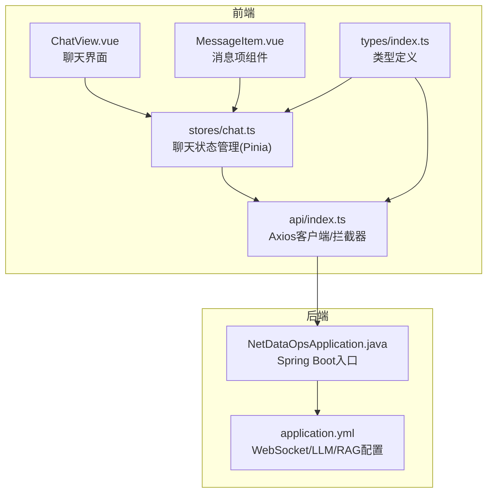
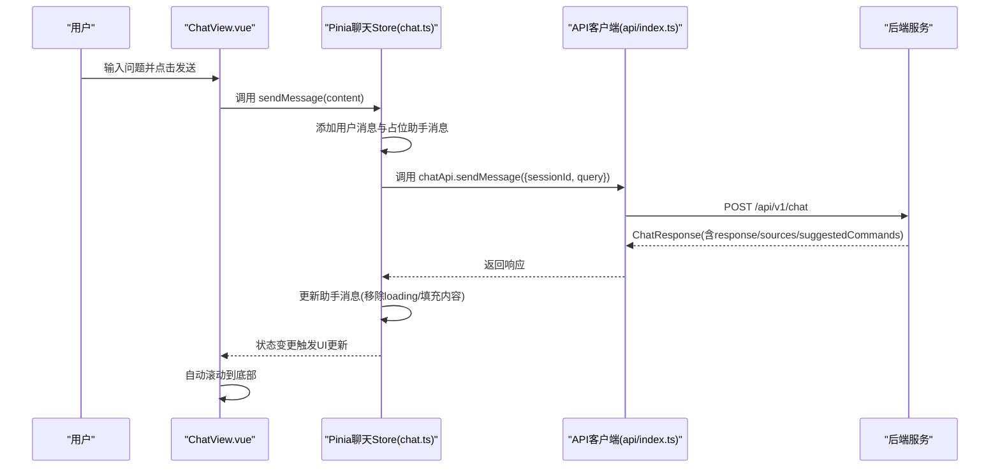
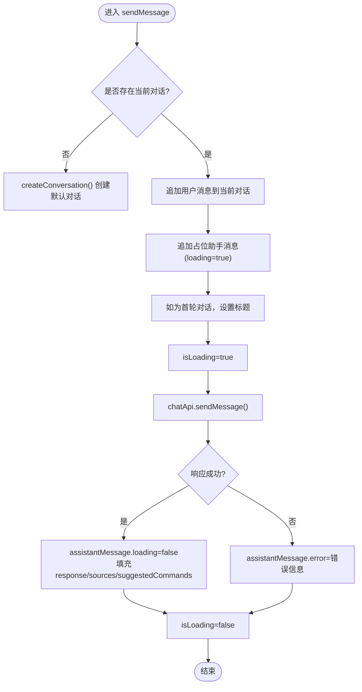
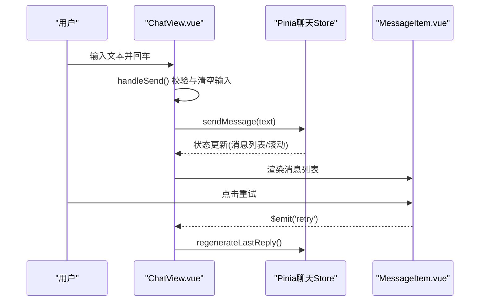
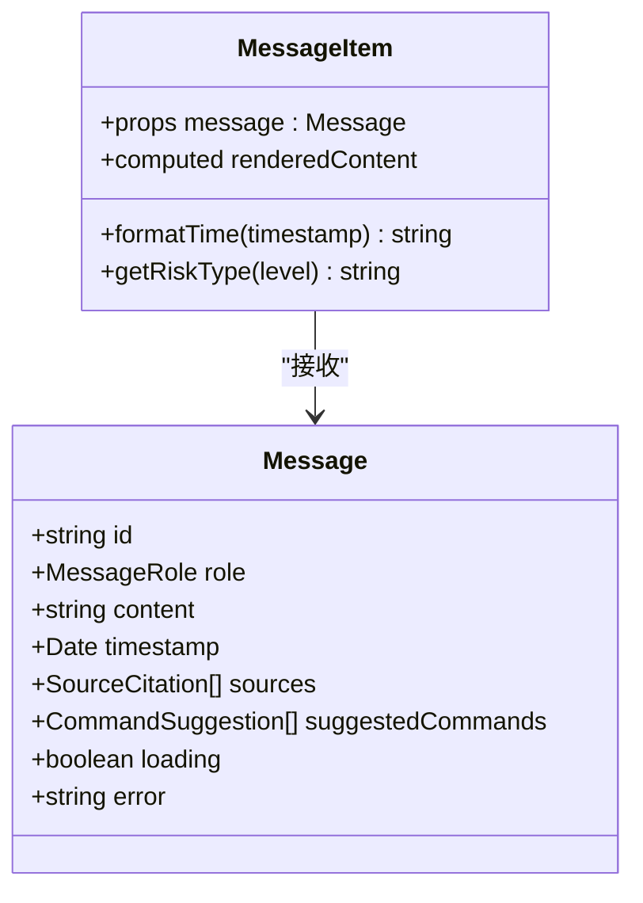
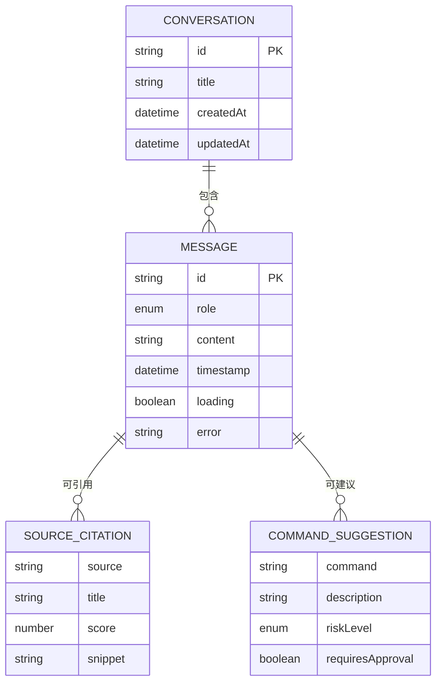
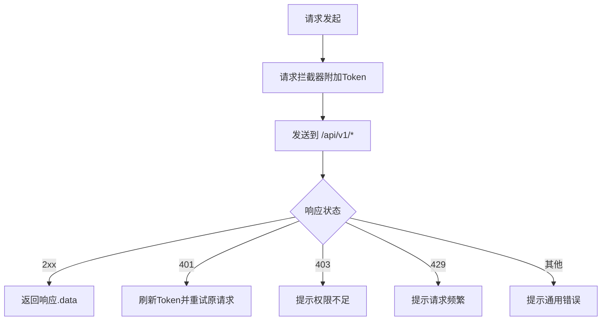
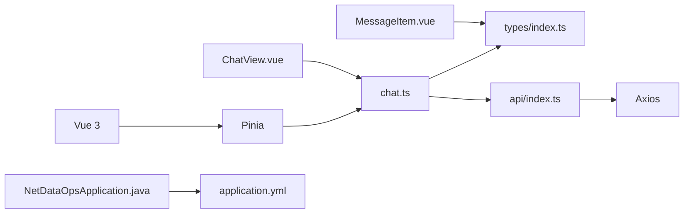

# 聊天状态管理

<cite>
**本文引用的文件**
- [chat.ts](file://netdata-ai-frontend/src/stores/chat.ts)
- [ChatView.vue](file://netdata-ai-frontend/src/views/ChatView.vue)
- [MessageItem.vue](file://netdata-ai-frontend/src/components/MessageItem.vue)
- [index.ts](file://netdata-ai-frontend/src/types/index.ts)
- [index.ts](file://netdata-ai-frontend/src/api/index.ts)
- [package.json](file://netdata-ai-frontend/package.json)
- [application.yml](file://netdata-ai-backend/src/main/resources/application.yml)
- [NetDataOpsApplication.java](file://netdata-ai-backend/src/main/java/com/netdata/ops/NetDataOpsApplication.java)
</cite>

## 目录
1. [引言](#引言)
2. [项目结构](#项目结构)
3. [核心组件](#核心组件)
4. [架构总览](#架构总览)
5. [详细组件分析](#详细组件分析)
6. [依赖分析](#依赖分析)
7. [性能考虑](#性能考虑)
8. [故障排查指南](#故障排查指南)
9. [结论](#结论)
10. [附录](#附录)

## 引言
本文件围绕“聊天状态管理”进行系统化技术文档编写，聚焦于前端聊天状态设计与实现，涵盖消息历史存储、会话状态管理、实时通信状态处理、异步消息处理机制、与后端API交互、以及最佳实践与性能优化建议。文档同时提供关键流程图与状态流转分析，帮助开发者快速理解并扩展聊天功能。

## 项目结构
前端项目采用Vue 3 + TypeScript + Pinia架构，聊天状态集中在Pinia Store中集中管理；视图层负责UI渲染与用户交互；组件层封装消息项展示与Markdown渲染；类型定义统一约束数据结构；API层封装Axios客户端与拦截器，提供统一的错误处理与鉴权能力。

**图表来源**
- [ChatView.vue:1-335](file://netdata-ai-frontend/src/views/ChatView.vue#L1-L335)
- [MessageItem.vue:1-381](file://netdata-ai-frontend/src/components/MessageItem.vue#L1-L381)
- [chat.ts:1-210](file://netdata-ai-frontend/src/stores/chat.ts#L1-L210)
- [index.ts:1-290](file://netdata-ai-frontend/src/api/index.ts#L1-L290)
- [index.ts:1-169](file://netdata-ai-frontend/src/types/index.ts#L1-L169)
- [NetDataOpsApplication.java:1-36](file://netdata-ai-backend/src/main/java/com/netdata/ops/NetDataOpsApplication.java#L1-L36)
- [application.yml:250-256](file://netdata-ai-backend/src/main/resources/application.yml#L250-L256)

**章节来源**
- [package.json:1-37](file://netdata-ai-frontend/package.json#L1-L37)
- [chat.ts:1-210](file://netdata-ai-frontend/src/stores/chat.ts#L1-L210)
- [ChatView.vue:1-335](file://netdata-ai-frontend/src/views/ChatView.vue#L1-L335)
- [MessageItem.vue:1-381](file://netdata-ai-frontend/src/components/MessageItem.vue#L1-L381)
- [index.ts:1-169](file://netdata-ai-frontend/src/types/index.ts#L1-L169)
- [index.ts:1-290](file://netdata-ai-frontend/src/api/index.ts#L1-L290)
- [NetDataOpsApplication.java:1-36](file://netdata-ai-backend/src/main/java/com/netdata/ops/NetDataOpsApplication.java#L1-L36)
- [application.yml:250-256](file://netdata-ai-backend/src/main/resources/application.yml#L250-L256)

## 核心组件
- Pinia聊天状态仓库：集中管理对话列表、当前对话、会话ID、加载状态，并提供创建/选择/删除对话、发送消息、重新生成回复、清空对话等动作。
- 聊天视图组件：负责渲染侧边栏对话列表、消息容器、输入区与快捷示例，绑定键盘事件与滚动行为。
- 消息项组件：渲染用户/助手消息、Markdown内容、来源引用、建议命令、错误与加载态，并支持重试。
- 类型系统：统一定义消息、会话、来源引用、命令建议、聊天请求/响应等数据结构。
- API客户端：基于Axios封装，内置请求/响应拦截器，统一处理鉴权、401刷新、403/429/其他错误提示。

**章节来源**
- [chat.ts:12-209](file://netdata-ai-frontend/src/stores/chat.ts#L12-L209)
- [ChatView.vue:1-335](file://netdata-ai-frontend/src/views/ChatView.vue#L1-L335)
- [MessageItem.vue:1-381](file://netdata-ai-frontend/src/components/MessageItem.vue#L1-L381)
- [index.ts:41-99](file://netdata-ai-frontend/src/types/index.ts#L41-L99)
- [index.ts:8-144](file://netdata-ai-frontend/src/api/index.ts#L8-L144)

## 架构总览
前端通过Pinia Store维护聊天状态，视图层触发动作，Store调用API模块发起HTTP请求，后端根据配置启用WebSocket路径，前端当前实现以REST请求为主，保留SSE/WS扩展点。

**图表来源**
- [ChatView.vue:127-138](file://netdata-ai-frontend/src/views/ChatView.vue#L127-L138)
- [chat.ts:82-138](file://netdata-ai-frontend/src/stores/chat.ts#L82-L138)
- [index.ts:123-144](file://netdata-ai-frontend/src/api/index.ts#L123-L144)
- [application.yml:250-256](file://netdata-ai-backend/src/main/resources/application.yml#L250-L256)

## 详细组件分析

### Pinia聊天状态仓库（chat.ts）
- 状态字段
  - conversations：对话数组，包含id、title、messages、createdAt、updatedAt。
  - currentConversationId：当前选中的对话ID。
  - isLoading：全局发送状态，控制按钮禁用与加载动画。
  - sessionId：会话标识，用于API请求携带。
- 计算属性
  - currentConversation：根据currentConversationId筛选当前对话。
  - currentMessages：当前对话的消息列表。
- 动作方法
  - createConversation：创建新对话并置为当前。
  - selectConversation/deleteConversation：切换与删除对话。
  - sendMessage：添加用户消息与占位助手消息，调用API获取响应后更新助手消息，处理错误与加载态。
  - regenerateLastReply：删除最后一条助手消息并重新发送。
  - clearCurrentConversation/clearAllConversations：清空当前或全部对话。
- 辅助函数
  - generateId/generateSessionId：生成唯一ID与会话ID。

**图表来源**
- [chat.ts:82-138](file://netdata-ai-frontend/src/stores/chat.ts#L82-L138)

**章节来源**
- [chat.ts:12-209](file://netdata-ai-frontend/src/stores/chat.ts#L12-L209)

### 聊天视图组件（ChatView.vue）
- 侧边栏：渲染对话列表，支持新建、激活、删除。
- 主区域：顶部工具栏、消息容器、输入区与快捷示例。
- 行为逻辑：监听消息数量变化自动滚动；处理回车发送；清空对话确认框；调用store动作。
- 与组件交互：MessageItem接收消息并支持重试回调。

**图表来源**
- [ChatView.vue:127-176](file://netdata-ai-frontend/src/views/ChatView.vue#L127-L176)
- [MessageItem.vue:124-126](file://netdata-ai-frontend/src/components/MessageItem.vue#L124-L126)
- [chat.ts:143-159](file://netdata-ai-frontend/src/stores/chat.ts#L143-L159)

**章节来源**
- [ChatView.vue:1-335](file://netdata-ai-frontend/src/views/ChatView.vue#L1-L335)

### 消息项组件（MessageItem.vue）
- 渲染逻辑：根据消息角色渲染头像与背景；时间格式化；Markdown渲染与代码高亮。
- 状态显示：loading点阵动画、错误提示与重试按钮、来源引用列表、建议命令列表（含风险等级标签）。
- 交互：对外抛出retry事件供父组件处理。

**图表来源**
- [MessageItem.vue:110-163](file://netdata-ai-frontend/src/components/MessageItem.vue#L110-L163)
- [index.ts:41-71](file://netdata-ai-frontend/src/types/index.ts#L41-L71)

**章节来源**
- [MessageItem.vue:1-381](file://netdata-ai-frontend/src/components/MessageItem.vue#L1-L381)
- [index.ts:41-71](file://netdata-ai-frontend/src/types/index.ts#L41-L71)

### 类型系统（types/index.ts）
- 消息结构：id、role、content、timestamp、可选loading/error、可选来源引用与建议命令。
- 会话结构：id、title、messages数组、createdAt/updatedAt。
- 聊天请求/响应：sessionId、userId、query、intent、sources、suggestedCommands、executionTimeMs等。

**图表来源**
- [index.ts:41-99](file://netdata-ai-frontend/src/types/index.ts#L41-L99)

**章节来源**
- [index.ts:1-169](file://netdata-ai-frontend/src/types/index.ts#L1-L169)

### API客户端与拦截器（api/index.ts）
- Axios实例：baseURL=/api/v1、超时60秒、JSON头。
- 请求拦截器：自动附加Authorization头。
- 响应拦截器：统一错误处理；401自动刷新token并重试；403/429提示；其他错误弹窗。
- 聊天API：sendMessage普通POST；sendMessageStream保留SSE接口签名（当前简化为普通请求）。

**图表来源**
- [index.ts:8-112](file://netdata-ai-frontend/src/api/index.ts#L8-L112)
- [index.ts:123-144](file://netdata-ai-frontend/src/api/index.ts#L123-L144)

**章节来源**
- [index.ts:1-290](file://netdata-ai-frontend/src/api/index.ts#L1-L290)

### 后端WebSocket配置与入口（NetDataOpsApplication.java, application.yml）
- WebSocket路径：/ws，允许任意来源。
- Spring Boot入口类启用异步，便于后续集成WebSocket或异步任务。
- 后端配置文件包含WebSocket、LLM、RAG、限流、安全等关键配置项。

**章节来源**
- [NetDataOpsApplication.java:28-35](file://netdata-ai-backend/src/main/java/com/netdata/ops/NetDataOpsApplication.java#L28-L35)
- [application.yml:250-256](file://netdata-ai-backend/src/main/resources/application.yml#L250-L256)

## 依赖分析
- 前端依赖：vue、pinia、axios、markdown-it、highlight.js、dayjs、element-plus等。
- 聊天状态与视图/组件/类型/API之间存在清晰的单向依赖：视图依赖Store，Store依赖API与类型，组件依赖类型与Store。
- 后端依赖：Spring Boot、Spring AI、Milvus、Redis、MyBatis-Plus、Resilience4j等（由配置文件体现）。

**图表来源**
- [package.json:13-23](file://netdata-ai-frontend/package.json#L13-L23)
- [chat.ts:1-210](file://netdata-ai-frontend/src/stores/chat.ts#L1-L210)
- [index.ts:1-169](file://netdata-ai-frontend/src/types/index.ts#L1-L169)
- [index.ts:1-290](file://netdata-ai-frontend/src/api/index.ts#L1-L290)
- [ChatView.vue:1-335](file://netdata-ai-frontend/src/views/ChatView.vue#L1-L335)
- [MessageItem.vue:1-381](file://netdata-ai-frontend/src/components/MessageItem.vue#L1-L381)
- [NetDataOpsApplication.java:1-36](file://netdata-ai-backend/src/main/java/com/netdata/ops/NetDataOpsApplication.java#L1-L36)
- [application.yml:1-314](file://netdata-ai-backend/src/main/resources/application.yml#L1-L314)

**章节来源**
- [package.json:1-37](file://netdata-ai-frontend/package.json#L1-L37)
- [chat.ts:1-210](file://netdata-ai-frontend/src/stores/chat.ts#L1-L210)
- [index.ts:1-169](file://netdata-ai-frontend/src/types/index.ts#L1-L169)
- [index.ts:1-290](file://netdata-ai-frontend/src/api/index.ts#L1-L290)
- [ChatView.vue:1-335](file://netdata-ai-frontend/src/views/ChatView.vue#L1-L335)
- [MessageItem.vue:1-381](file://netdata-ai-frontend/src/components/MessageItem.vue#L1-L381)
- [NetDataOpsApplication.java:1-36](file://netdata-ai-backend/src/main/java/com/netdata/ops/NetDataOpsApplication.java#L1-L36)
- [application.yml:1-314](file://netdata-ai-backend/src/main/resources/application.yml#L1-L314)

## 性能考虑
- 渲染优化
  - 使用虚拟滚动或分页加载长对话（当前未实现，建议在消息容器中引入滚动条虚拟化方案）。
  - 消息Markdown渲染与代码高亮仅在内容变更时计算，利用computed缓存。
- 状态更新
  - 通过Pinia响应式更新，避免不必要的整树重渲染；仅对当前对话与消息列表进行局部更新。
- 网络与并发
  - isLoading全局控制防止重复提交；401自动刷新避免频繁手动登录。
  - 超时60秒，建议根据业务场景调整；对高频请求增加防抖/节流。
- 存储与持久化
  - 当前状态驻内存；建议结合浏览器存储实现会话持久化（localStorage/sessionStorage），并在应用启动时恢复。
- 实时通信
  - 当前以REST请求为主；若需实时性，可在后端启用WebSocket，前端以WebSocket替代或补充SSE；注意连接状态管理、断线重连与消息队列处理。

[本节为通用指导，不直接分析具体文件，故无“章节来源”]

## 故障排查指南
- 发送失败
  - 检查API拦截器是否正确附加Authorization头；确认401刷新流程是否生效。
  - 查看响应拦截器对403/429/其他错误的提示与日志。
- 加载态异常
  - 确认sendMessage中isLoading在try/catch/finally中均被正确重置。
  - 检查MessageItem中loading点阵动画与错误态渲染逻辑。
- 消息不显示
  - 确认currentMessages计算属性与消息列表渲染逻辑。
  - 检查Markdown渲染器初始化与代码高亮依赖。
- WebSocket集成
  - 若启用WebSocket，确认后端application.yml中websocket.path与allowed-origins配置。
  - 前端需实现连接建立、心跳、断线重连与消息队列处理策略。

**章节来源**
- [index.ts:29-112](file://netdata-ai-frontend/src/api/index.ts#L29-L112)
- [chat.ts:82-138](file://netdata-ai-frontend/src/stores/chat.ts#L82-L138)
- [MessageItem.vue:18-104](file://netdata-ai-frontend/src/components/MessageItem.vue#L18-L104)
- [application.yml:250-256](file://netdata-ai-backend/src/main/resources/application.yml#L250-L256)

## 结论
本项目以Pinia为核心构建聊天状态管理，配合Vue组件化与Axios拦截器，实现了简洁可靠的聊天交互流程。当前以REST请求为主，具备良好的扩展性，可在后端启用WebSocket与SSE的基础上进一步提升实时性与用户体验。建议在现有基础上完善状态持久化、消息虚拟滚动、断线重连与消息队列处理，以满足复杂场景需求。

[本节为总结性内容，不直接分析具体文件，故无“章节来源”]

## 附录
- 关键流程图回顾
  - 发送消息流程：用户输入 → 视图触发 → Store更新 → API请求 → 响应更新 → UI刷新。
  - 错误处理流程：401自动刷新 → 403/429提示 → 其他错误弹窗。
- 最佳实践清单
  - 状态持久化：localStorage/sessionStorage保存会话与消息片段。
  - 性能优化：虚拟滚动、computed缓存、请求去重与防抖。
  - 实时通信：WebSocket路径与跨域配置、心跳与重连策略、消息队列与幂等处理。
  - 用户体验：加载态与错误态明确提示、快捷示例引导、自动滚动与键盘快捷键。

[本节为补充性内容，不直接分析具体文件，故无“章节来源”]