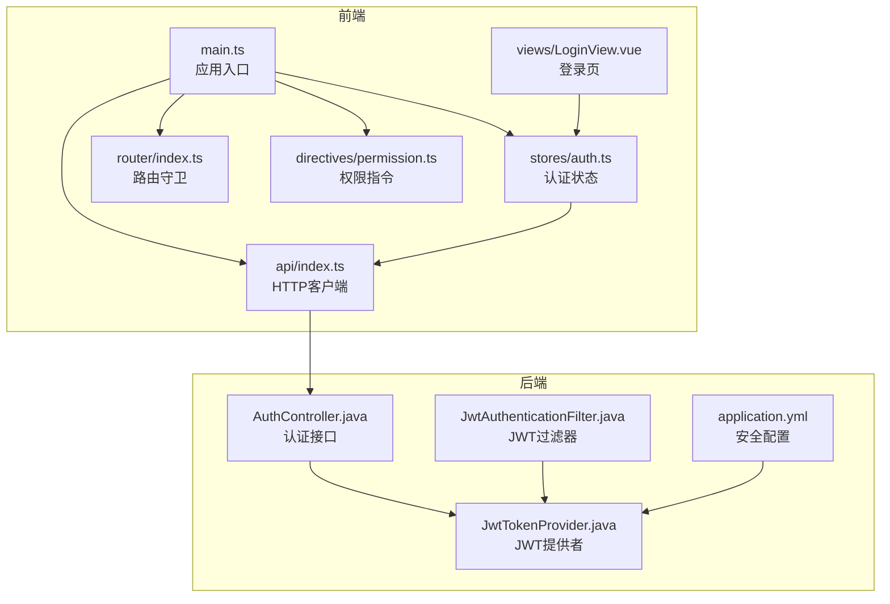
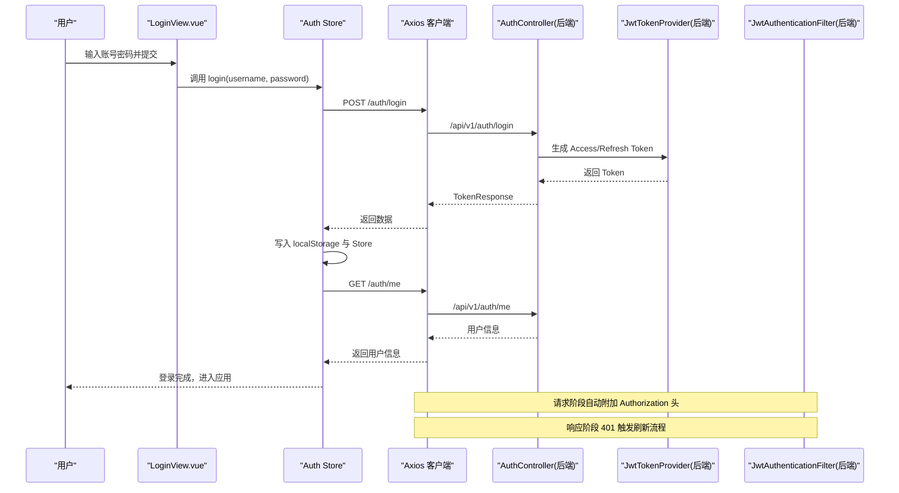
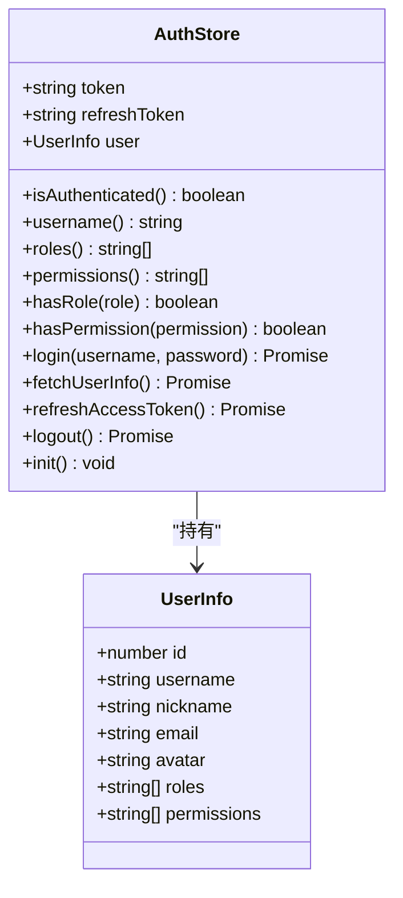
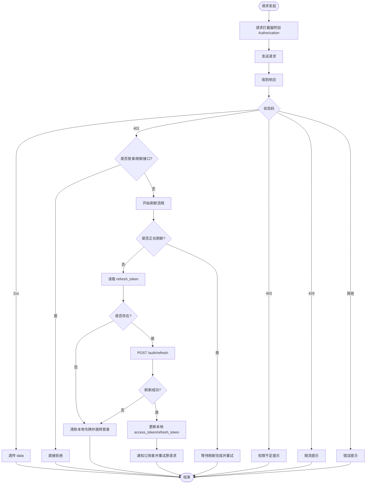
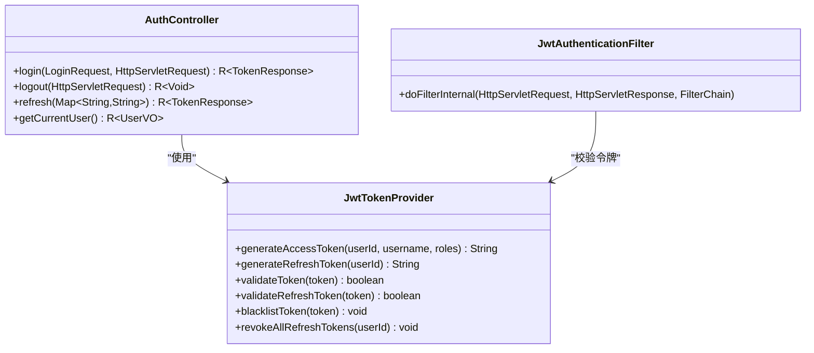
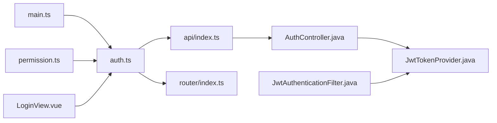

# 认证状态管理

<cite>
**本文引用的文件**
- [auth.ts](file://netdata-ai-frontend/src/stores/auth.ts)
- [index.ts（API客户端）](file://netdata-ai-frontend/src/api/index.ts)
- [index.ts（路由）](file://netdata-ai-frontend/src/router/index.ts)
- [permission.ts（权限指令）](file://netdata-ai-frontend/src/directives/permission.ts)
- [index.ts（类型定义）](file://netdata-ai-frontend/src/types/index.ts)
- [LoginView.vue](file://netdata-ai-frontend/src/views/LoginView.vue)
- [main.ts](file://netdata-ai-frontend/src/main.ts)
- [JwtTokenProvider.java](file://netdata-ai-backend/src/main/java/com/netdata/ops/security/JwtTokenProvider.java)
- [JwtAuthenticationFilter.java](file://netdata-ai-backend/src/main/java/com/netdata/ops/security/JwtAuthenticationFilter.java)
- [AuthController.java](file://netdata-ai-backend/src/main/java/com/netdata/ops/controller/AuthController.java)
- [application.yml](file://netdata-ai-backend/src/main/resources/application.yml)
</cite>

## 目录
1. [简介](#简介)
2. [项目结构](#项目结构)
3. [核心组件](#核心组件)
4. [架构总览](#架构总览)
5. [详细组件分析](#详细组件分析)
6. [依赖分析](#依赖分析)
7. [性能考量](#性能考量)
8. [故障排查指南](#故障排查指南)
9. [结论](#结论)
10. [附录](#附录)

## 简介
本技术文档围绕前端认证状态管理进行深入剖析，涵盖登录状态管理、JWT令牌存储与刷新、权限状态同步、异步认证流程、与API接口的集成方式以及最佳实践与错误处理策略。文档同时提供认证流程图与状态转换分析，帮助开发者与运维人员快速理解并优化系统的认证与授权机制。

## 项目结构
前端采用 Vue + Pinia + Axios 的组合：
- 认证状态集中在 Pinia Store 中，负责用户信息、角色权限与访问令牌的存取与同步。
- Axios 作为 HTTP 客户端，内置请求/响应拦截器，实现自动注入 Authorization 头与 401 自动刷新。
- 路由守卫根据本地存储的令牌决定是否放行。
- 权限指令在视图层对元素进行可见性控制，避免越权渲染。

图表来源
- [main.ts:30-32](file://netdata-ai-frontend/src/main.ts#L30-L32)
- [auth.ts:22-118](file://netdata-ai-frontend/src/stores/auth.ts#L22-L118)
- [index.ts（API客户端）:8-14](file://netdata-ai-frontend/src/api/index.ts#L8-L14)
- [index.ts（路由）:49-67](file://netdata-ai-frontend/src/router/index.ts#L49-L67)
- [permission.ts:9-62](file://netdata-ai-frontend/src/directives/permission.ts#L9-L62)
- [LoginView.vue:79-95](file://netdata-ai-frontend/src/views/LoginView.vue#L79-L95)
- [AuthController.java:24-77](file://netdata-ai-backend/src/main/java/com/netdata/ops/controller/AuthController.java#L24-L77)
- [JwtTokenProvider.java:23-42](file://netdata-ai-backend/src/main/java/com/netdata/ops/security/JwtTokenProvider.java#L23-L42)
- [JwtAuthenticationFilter.java:27-62](file://netdata-ai-backend/src/main/java/com/netdata/ops/security/JwtAuthenticationFilter.java#L27-L62)
- [application.yml:193-202](file://netdata-ai-backend/src/main/resources/application.yml#L193-L202)

章节来源
- [main.ts:1-35](file://netdata-ai-frontend/src/main.ts#L1-L35)
- [auth.ts:1-119](file://netdata-ai-frontend/src/stores/auth.ts#L1-L119)
- [index.ts（API客户端）:1-290](file://netdata-ai-frontend/src/api/index.ts#L1-L290)
- [index.ts（路由）:1-70](file://netdata-ai-frontend/src/router/index.ts#L1-L70)
- [permission.ts:1-63](file://netdata-ai-frontend/src/directives/permission.ts#L1-L63)
- [LoginView.vue:1-150](file://netdata-ai-frontend/src/views/LoginView.vue#L1-L150)
- [AuthController.java:1-78](file://netdata-ai-backend/src/main/java/com/netdata/ops/controller/AuthController.java#L1-L78)
- [JwtTokenProvider.java:1-204](file://netdata-ai-backend/src/main/java/com/netdata/ops/security/JwtTokenProvider.java#L1-L204)
- [JwtAuthenticationFilter.java:1-75](file://netdata-ai-backend/src/main/java/com/netdata/ops/security/JwtAuthenticationFilter.java#L1-L75)
- [application.yml:193-202](file://netdata-ai-backend/src/main/resources/application.yml#L193-L202)

## 核心组件
- 认证状态 Store（Pinia）
  - 状态：访问令牌、刷新令牌、用户信息。
  - 计算属性：登录态、用户名、角色集合、权限集合。
  - 方法：登录、获取用户信息、刷新访问令牌、登出、初始化。
- HTTP 客户端（Axios）
  - 请求拦截器：自动附加 Authorization 头。
  - 响应拦截器：统一错误处理；401 自动刷新令牌；并发请求排队等待刷新完成。
- 路由守卫
  - 非公开路由需具备有效访问令牌才放行。
- 权限指令
  - v-permission 与 v-role 在视图层进行权限/角色校验，无权限元素直接移除。
- 登录页
  - 表单校验、调用认证 Store 执行登录、跳转与提示。

章节来源
- [auth.ts:22-118](file://netdata-ai-frontend/src/stores/auth.ts#L22-L118)
- [index.ts（API客户端）:29-112](file://netdata-ai-frontend/src/api/index.ts#L29-L112)
- [index.ts（路由）:49-67](file://netdata-ai-frontend/src/router/index.ts#L49-L67)
- [permission.ts:9-62](file://netdata-ai-frontend/src/directives/permission.ts#L9-L62)
- [LoginView.vue:79-95](file://netdata-ai-frontend/src/views/LoginView.vue#L79-L95)

## 架构总览
前后端认证链路概览如下：
- 前端登录成功后，将访问令牌与刷新令牌写入本地存储，并拉取用户信息。
- 请求阶段，自动在请求头注入 Authorization: Bearer。
- 响应阶段，若返回 401 且非登录/刷新接口，则触发刷新流程：并发控制、队列等待、替换令牌并重试原请求。
- 后端通过 JWT 过滤器从请求头解析令牌，校验有效性与黑名单，设置安全上下文。
- 刷新令牌与登出时，后端将刷新令牌持久化至 Redis 并支持主动注销。

图表来源
- [LoginView.vue:79-95](file://netdata-ai-frontend/src/views/LoginView.vue#L79-L95)
- [auth.ts:42-62](file://netdata-ai-frontend/src/stores/auth.ts#L42-L62)
- [index.ts（API客户端）:29-112](file://netdata-ai-frontend/src/api/index.ts#L29-L112)
- [AuthController.java:30-68](file://netdata-ai-backend/src/main/java/com/netdata/ops/controller/AuthController.java#L30-L68)
- [JwtTokenProvider.java:47-84](file://netdata-ai-backend/src/main/java/com/netdata/ops/security/JwtTokenProvider.java#L47-L84)
- [JwtAuthenticationFilter.java:35-62](file://netdata-ai-backend/src/main/java/com/netdata/ops/security/JwtAuthenticationFilter.java#L35-L62)

## 详细组件分析

### 认证状态 Store（Pinia）
- 数据结构
  - 访问令牌与刷新令牌：字符串，持久化于 localStorage。
  - 用户信息：包含用户标识、用户名、昵称、邮箱、头像、角色数组、权限数组等。
- 关键方法
  - 登录：发送登录请求，接收 TokenResponse，更新 Store 与本地存储，并拉取用户信息。
  - 获取用户信息：调用 /auth/me 接口，填充用户信息。
  - 刷新访问令牌：POST /auth/refresh，成功后更新 Store 与本地存储；失败则触发登出并跳转登录。
  - 登出：调用 /auth/logout，清空 Store 与本地存储，强制跳转登录。
  - 初始化：若存在访问令牌，则尝试拉取用户信息。
- 权限判定
  - hasRole：判断是否包含指定角色。
  - hasPermission：超级管理员直接放行；否则判断是否包含指定权限。

图表来源
- [auth.ts:6-14](file://netdata-ai-frontend/src/stores/auth.ts#L6-L14)
- [auth.ts:22-118](file://netdata-ai-frontend/src/stores/auth.ts#L22-L118)

章节来源
- [auth.ts:6-14](file://netdata-ai-frontend/src/stores/auth.ts#L6-L14)
- [auth.ts:22-118](file://netdata-ai-frontend/src/stores/auth.ts#L22-L118)
- [index.ts（类型定义）:24-34](file://netdata-ai-frontend/src/types/index.ts#L24-L34)

### HTTP 客户端与拦截器
- 请求拦截器
  - 从 localStorage 读取访问令牌，若存在则在请求头添加 Authorization: Bearer。
- 响应拦截器
  - 成功响应：透传 data 字段。
  - 401 未认证：
    - 若为登录或刷新接口，直接拒绝。
    - 否则触发刷新流程：并发标志、订阅队列、读取刷新令牌、调用 /auth/refresh、更新本地存储与请求头、重试原始请求。
  - 403 权限不足：全局提示。
  - 429 限流：全局提示。
  - 其他错误：统一错误提示。
- 认证 API 封装
  - 提供 login、logout、refresh、me 等方法，便于 Store 调用。

图表来源
- [index.ts（API客户端）:29-112](file://netdata-ai-frontend/src/api/index.ts#L29-L112)

章节来源
- [index.ts（API客户端）:8-14](file://netdata-ai-frontend/src/api/index.ts#L8-L14)
- [index.ts（API客户端）:29-112](file://netdata-ai-frontend/src/api/index.ts#L29-L112)
- [index.ts（API客户端）:220-233](file://netdata-ai-frontend/src/api/index.ts#L220-L233)

### 路由守卫与页面标题
- 公开页面（如登录页）无需认证。
- 非公开路由：若本地不存在访问令牌，则重定向至登录页并携带重定向地址。
- 动态设置页面标题。

章节来源
- [index.ts（路由）:49-67](file://netdata-ai-frontend/src/router/index.ts#L49-L67)

### 权限指令（v-permission / v-role）
- v-permission：当用户不具有所需权限时，移除该元素。
- v-role：当用户不具有所需角色时，移除该元素。
- 支持单个权限/角色或数组形式。

章节来源
- [permission.ts:9-62](file://netdata-ai-frontend/src/directives/permission.ts#L9-L62)

### 登录页与登录流程
- 表单校验：用户名必填，密码至少6位。
- 调用认证 Store 的 login 方法，成功后提示并跳转至重定向地址，失败则提示错误。

章节来源
- [LoginView.vue:71-95](file://netdata-ai-frontend/src/views/LoginView.vue#L71-L95)
- [auth.ts:42-53](file://netdata-ai-frontend/src/stores/auth.ts#L42-L53)

### 后端认证组件
- 认证控制器
  - /api/v1/auth/login：接收登录请求，返回 TokenResponse。
  - /api/v1/auth/logout：提取 Authorization 头中的令牌并执行登出。
  - /api/v1/auth/refresh：接收 refreshToken，返回新的 TokenResponse。
  - /api/v1/auth/me：返回当前用户信息。
- JWT 提供者
  - 生成访问令牌与刷新令牌，支持 Redis 存储刷新令牌与黑名单。
  - 校验访问令牌与刷新令牌，支持黑名单检查。
- JWT 过滤器
  - 从请求头提取 Bearer 令牌，校验有效性并设置安全上下文。
- 安全配置
  - JWT 密钥、访问令牌与刷新令牌过期时间、限流配置等。

图表来源
- [AuthController.java:24-77](file://netdata-ai-backend/src/main/java/com/netdata/ops/controller/AuthController.java#L24-L77)
- [JwtTokenProvider.java:47-194](file://netdata-ai-backend/src/main/java/com/netdata/ops/security/JwtTokenProvider.java#L47-L194)
- [JwtAuthenticationFilter.java:35-62](file://netdata-ai-backend/src/main/java/com/netdata/ops/security/JwtAuthenticationFilter.java#L35-L62)

章节来源
- [AuthController.java:24-77](file://netdata-ai-backend/src/main/java/com/netdata/ops/controller/AuthController.java#L24-L77)
- [JwtTokenProvider.java:23-42](file://netdata-ai-backend/src/main/java/com/netdata/ops/security/JwtTokenProvider.java#L23-L42)
- [JwtTokenProvider.java:47-194](file://netdata-ai-backend/src/main/java/com/netdata/ops/security/JwtTokenProvider.java#L47-L194)
- [JwtAuthenticationFilter.java:27-62](file://netdata-ai-backend/src/main/java/com/netdata/ops/security/JwtAuthenticationFilter.java#L27-L62)
- [application.yml:193-202](file://netdata-ai-backend/src/main/resources/application.yml#L193-L202)

## 依赖分析
- 前端
  - main.ts 初始化认证状态，确保应用启动即恢复登录态。
  - Auth Store 依赖 API 客户端与路由模块。
  - 权限指令依赖 Auth Store 的权限判定方法。
- 后端
  - AuthController 依赖 AuthService（未在本仓库展示），并调用 JwtTokenProvider 生成/校验令牌。
  - JwtAuthenticationFilter 依赖 JwtTokenProvider 与 UserDetailsService，从请求头提取并校验令牌。

图表来源
- [main.ts:30-32](file://netdata-ai-frontend/src/main.ts#L30-L32)
- [auth.ts:22-118](file://netdata-ai-frontend/src/stores/auth.ts#L22-L118)
- [index.ts（API客户端）:220-233](file://netdata-ai-frontend/src/api/index.ts#L220-L233)
- [index.ts（路由）:49-67](file://netdata-ai-frontend/src/router/index.ts#L49-L67)
- [permission.ts:18-30](file://netdata-ai-frontend/src/directives/permission.ts#L18-L30)
- [LoginView.vue:79-95](file://netdata-ai-frontend/src/views/LoginView.vue#L79-L95)
- [AuthController.java:28-56](file://netdata-ai-backend/src/main/java/com/netdata/ops/controller/AuthController.java#L28-L56)
- [JwtTokenProvider.java:47-84](file://netdata-ai-backend/src/main/java/com/netdata/ops/security/JwtTokenProvider.java#L47-L84)
- [JwtAuthenticationFilter.java:39-55](file://netdata-ai-backend/src/main/java/com/netdata/ops/security/JwtAuthenticationFilter.java#L39-L55)

章节来源
- [main.ts:30-32](file://netdata-ai-frontend/src/main.ts#L30-L32)
- [auth.ts:22-118](file://netdata-ai-frontend/src/stores/auth.ts#L22-L118)
- [index.ts（API客户端）:220-233](file://netdata-ai-frontend/src/api/index.ts#L220-L233)
- [index.ts（路由）:49-67](file://netdata-ai-frontend/src/router/index.ts#L49-L67)
- [permission.ts:18-30](file://netdata-ai-frontend/src/directives/permission.ts#L18-L30)
- [LoginView.vue:79-95](file://netdata-ai-frontend/src/views/LoginView.vue#L79-L95)
- [AuthController.java:28-56](file://netdata-ai-backend/src/main/java/com/netdata/ops/controller/AuthController.java#L28-L56)
- [JwtTokenProvider.java:47-84](file://netdata-ai-backend/src/main/java/com/netdata/ops/security/JwtTokenProvider.java#L47-L84)
- [JwtAuthenticationFilter.java:39-55](file://netdata-ai-backend/src/main/java/com/netdata/ops/security/JwtAuthenticationFilter.java#L39-L55)

## 性能考量
- 令牌刷新并发控制：通过 isRefreshing 标志与订阅队列避免重复刷新与并发风暴。
- 请求重试：刷新成功后一次性重试所有等待中的请求，减少网络往返。
- 本地存储：令牌持久化于 localStorage，减少每次刷新的网络请求成本。
- 后端校验：JWT 校验与黑名单检查在过滤器中完成，避免业务层重复逻辑。
- 限流与错误提示：后端限流配置与前端统一错误提示，提升用户体验与系统稳定性。

## 故障排查指南
- 401 未认证
  - 检查是否为登录/刷新接口；若是则直接拒绝。
  - 否则检查 refresh_token 是否存在；不存在则跳转登录。
  - 刷新失败则清空本地令牌并跳转登录。
- 403 权限不足
  - 前端会弹出“权限不足”提示；检查用户角色/权限是否正确。
- 429 限流
  - 前端会提示“请求过于频繁，请稍后再试”；适当降低请求频率。
- 登录失败
  - 检查用户名/密码是否正确；查看后端日志定位问题。
- 令牌过期
  - 确认访问令牌过期时间与刷新令牌有效期配置；检查刷新流程是否正常。
- 后端校验失败
  - 检查 JWT 密钥、签名算法与 Redis 存储的刷新令牌/黑名单状态。

章节来源
- [index.ts（API客户端）:48-112](file://netdata-ai-frontend/src/api/index.ts#L48-L112)
- [auth.ts:64-93](file://netdata-ai-frontend/src/stores/auth.ts#L64-L93)
- [JwtTokenProvider.java:89-107](file://netdata-ai-backend/src/main/java/com/netdata/ops/security/JwtTokenProvider.java#L89-L107)
- [application.yml:193-202](file://netdata-ai-backend/src/main/resources/application.yml#L193-L202)

## 结论
本系统采用前后端分离的认证方案：前端通过 Pinia Store 管理登录态与令牌，Axios 拦截器实现自动注入与 401 刷新；后端通过 JWT 提供者与过滤器保障令牌有效性与黑名单控制。配合路由守卫与权限指令，实现了从界面到接口的全链路安全控制。建议在生产环境中强化密钥管理、完善令牌黑名单策略与审计日志，持续优化限流与错误提示策略。

## 附录
- 认证状态数据结构
  - 访问令牌与刷新令牌：字符串，分别持久化于 localStorage。
  - 用户信息：包含用户标识、用户名、昵称、邮箱、头像、角色数组、权限数组等。
- 最佳实践
  - 安全性：使用 HTTPS、定期轮换密钥、限制令牌有效期、启用黑名单。
  - 状态持久化：优先使用 localStorage；敏感场景可考虑 HttpOnly Cookie。
  - 错误处理：统一错误提示与日志记录；对 401 自动刷新与 403 权限提示。
  - 性能：并发刷新控制、请求重试、合理限流与缓存策略。