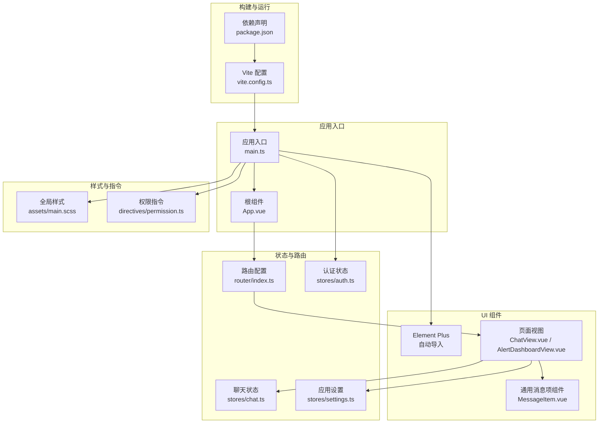
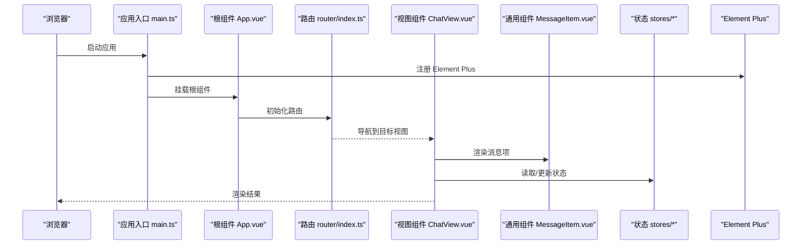
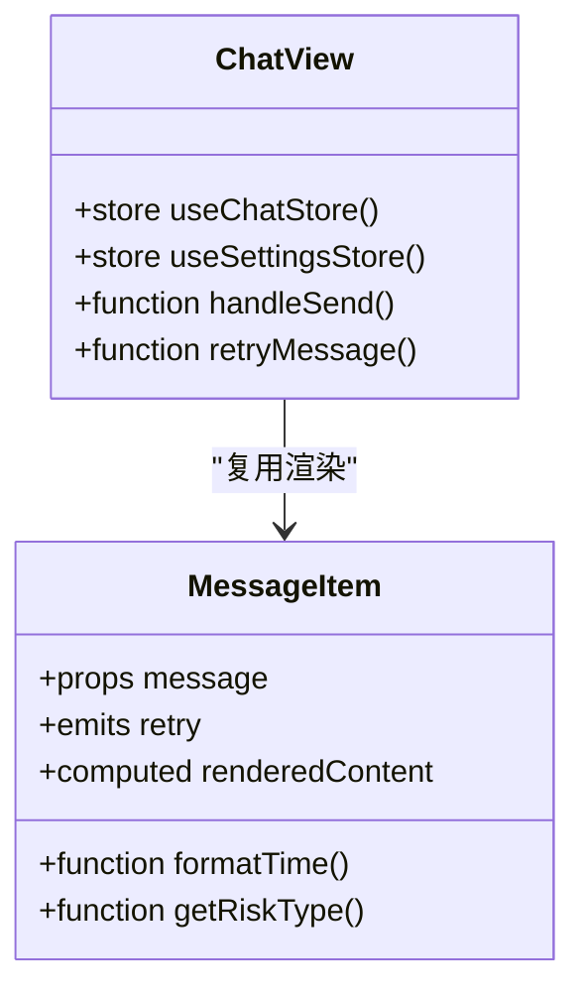
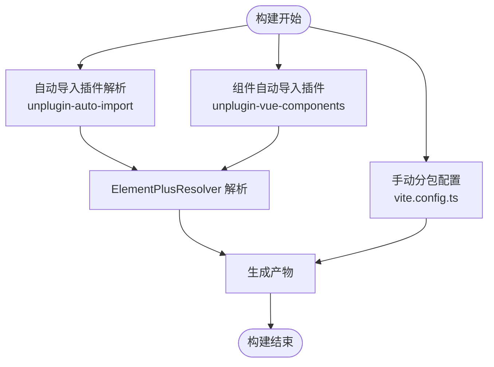
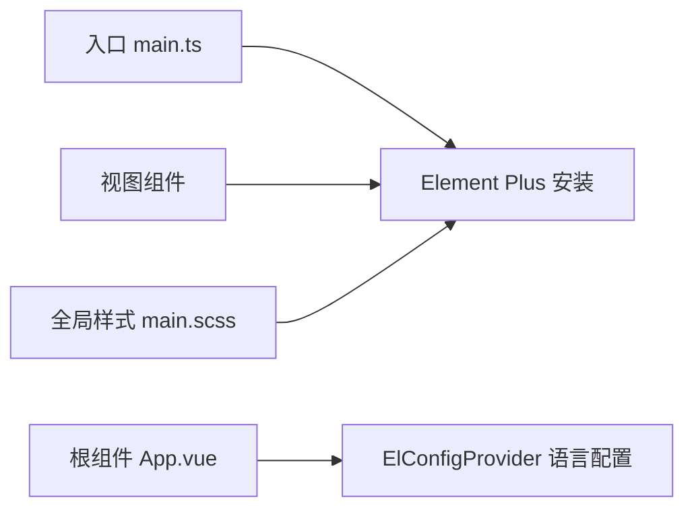
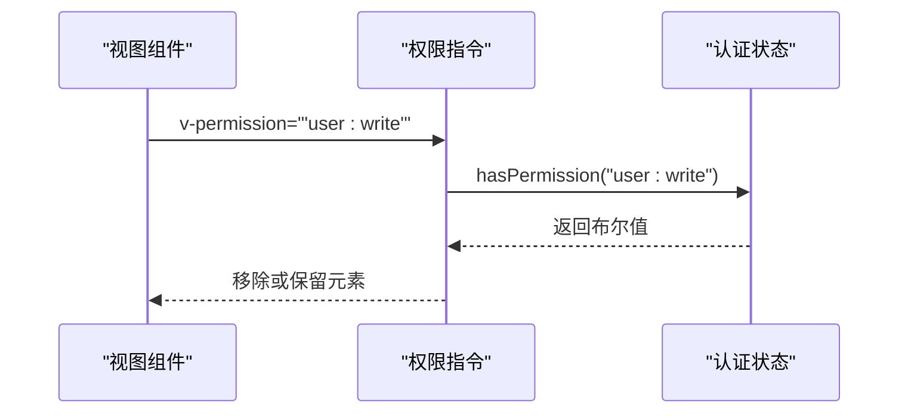
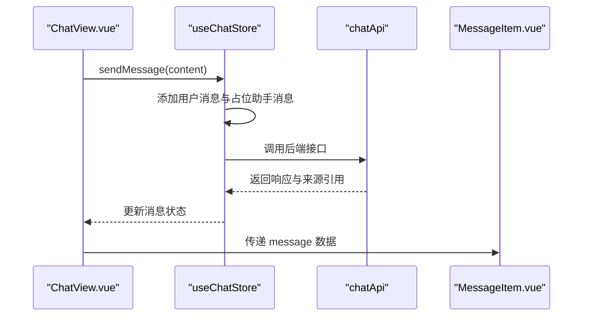
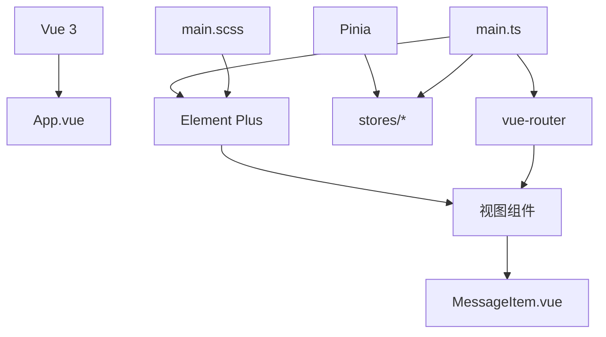

# 组件复用策略

<cite>
**本文引用的文件**
- [package.json](file://netdata-ai-frontend/package.json)
- [vite.config.ts](file://netdata-ai-frontend/vite.config.ts)
- [main.ts](file://netdata-ai-frontend/src/main.ts)
- [App.vue](file://netdata-ai-frontend/src/App.vue)
- [MessageItem.vue](file://netdata-ai-frontend/src/components/MessageItem.vue)
- [permission.ts](file://netdata-ai-frontend/src/directives/permission.ts)
- [index.ts](file://netdata-ai-frontend/src/router/index.ts)
- [auth.ts](file://netdata-ai-frontend/src/stores/auth.ts)
- [main.scss](file://netdata-ai-frontend/src/assets/main.scss)
- [ChatView.vue](file://netdata-ai-frontend/src/views/ChatView.vue)
- [AlertDashboardView.vue](file://netdata-ai-frontend/src/views/AlertDashboardView.vue)
- [index.ts](file://netdata-ai-frontend/src/types/index.ts)
- [chat.ts](file://netdata-ai-frontend/src/stores/chat.ts)
- [settings.ts](file://netdata-ai-frontend/src/stores/settings.ts)
</cite>

## 目录
1. [引言](#引言)
2. [项目结构](#项目结构)
3. [核心组件](#核心组件)
4. [架构总览](#架构总览)
5. [详细组件分析](#详细组件分析)
6. [依赖关系分析](#依赖关系分析)
7. [性能考量](#性能考量)
8. [故障排查指南](#故障排查指南)
9. [结论](#结论)
10. [附录](#附录)

## 引言
本指南围绕 Vue.js 在本项目中的组件复用策略展开，目标是帮助团队在保持一致性的同时提升开发效率与可维护性。内容涵盖通用组件设计原则（单一职责、可配置性、可扩展性）、组件库封装策略（注册、导出、版本管理）、第三方组件集成（Element Plus 的使用与主题覆盖）、最佳实践（命名约定、API 设计、文档规范），并结合具体案例与性能优化技巧进行落地指导。

## 项目结构
前端采用 Vite + Vue 3 + TypeScript 构建，使用 Element Plus 作为基础 UI 组件库，并通过自动导入插件减少样板代码。全局样式通过 SCSS 变量与覆盖实现统一风格；路由与状态管理分别通过 vue-router 和 Pinia 实现；权限控制通过自定义指令完成。

图表来源
- [vite.config.ts:1-52](file://netdata-ai-frontend/vite.config.ts#L1-L52)
- [package.json:1-37](file://netdata-ai-frontend/package.json#L1-L37)
- [main.ts:1-35](file://netdata-ai-frontend/src/main.ts#L1-L35)
- [App.vue:1-19](file://netdata-ai-frontend/src/App.vue#L1-L19)
- [MessageItem.vue:1-381](file://netdata-ai-frontend/src/components/MessageItem.vue#L1-L381)
- [ChatView.vue:1-335](file://netdata-ai-frontend/src/views/ChatView.vue#L1-L335)
- [AlertDashboardView.vue:1-235](file://netdata-ai-frontend/src/views/AlertDashboardView.vue#L1-L235)
- [index.ts:1-70](file://netdata-ai-frontend/src/router/index.ts#L1-L70)
- [auth.ts:1-119](file://netdata-ai-frontend/src/stores/auth.ts#L1-L119)
- [chat.ts:1-210](file://netdata-ai-frontend/src/stores/chat.ts#L1-L210)
- [settings.ts:1-32](file://netdata-ai-frontend/src/stores/settings.ts#L1-L32)
- [main.scss:1-176](file://netdata-ai-frontend/src/assets/main.scss#L1-L176)
- [permission.ts:1-63](file://netdata-ai-frontend/src/directives/permission.ts#L1-L63)

章节来源
- [vite.config.ts:1-52](file://netdata-ai-frontend/vite.config.ts#L1-L52)
- [package.json:1-37](file://netdata-ai-frontend/package.json#L1-L37)
- [main.ts:1-35](file://netdata-ai-frontend/src/main.ts#L1-L35)

## 核心组件
- 通用消息项组件 MessageItem.vue：负责渲染用户/助手消息、Markdown 内容、来源引用、建议命令等，具备良好的可配置性与可扩展性，适合在多处复用。
- 权限指令 permission.ts：提供 v-permission 与 v-role 指令，基于 Pinia 认证状态动态控制元素可见性，便于在模板中进行细粒度权限控制。
- 聊天视图 ChatView.vue：展示对话侧边栏、消息列表、输入区，内部复用 MessageItem 并与聊天状态 store 协作。
- 告警仪表盘 AlertDashboardView.vue：展示统计卡片与告警表格，体现 Element Plus 组件的组合复用。
- 全局样式 main.scss：集中管理 CSS 变量、通用样式与 Element Plus 覆盖，确保跨组件一致的视觉与交互体验。

章节来源
- [MessageItem.vue:1-381](file://netdata-ai-frontend/src/components/MessageItem.vue#L1-L381)
- [permission.ts:1-63](file://netdata-frontend/src/directives/permission.ts#L1-L63)
- [ChatView.vue:1-335](file://netdata-ai-frontend/src/views/ChatView.vue#L1-L335)
- [AlertDashboardView.vue:1-235](file://netdata-ai-frontend/src/views/AlertDashboardView.vue#L1-L235)
- [main.scss:1-176](file://netdata-ai-frontend/src/assets/main.scss#L1-L176)

## 架构总览
下图展示了从入口到视图、组件、状态与指令的整体调用链路，以及 Element Plus 的集成方式。

图表来源
- [main.ts:1-35](file://netdata-ai-frontend/src/main.ts#L1-L35)
- [App.vue:1-19](file://netdata-ai-frontend/src/App.vue#L1-L19)
- [index.ts:1-70](file://netdata-ai-frontend/src/router/index.ts#L1-L70)
- [ChatView.vue:1-335](file://netdata-ai-frontend/src/views/ChatView.vue#L1-L335)
- [MessageItem.vue:1-381](file://netdata-ai-frontend/src/components/MessageItem.vue#L1-L381)
- [chat.ts:1-210](file://netdata-ai-frontend/src/stores/chat.ts#L1-L210)

## 详细组件分析

### 通用组件设计原则与复用模式
- 单一职责：MessageItem 专注于“消息内容渲染”，不直接处理业务逻辑，通过 props 接收数据，通过 emits 触发事件，职责清晰。
- 可配置性：通过 props 传入 message 数据模型，支持 loading/error/success 三种渲染分支；通过事件回调（如 retry）与父组件解耦。
- 可扩展性：在样式层使用 SCSS 变量与深度作用选择器，便于在不同场景下覆盖样式；在功能上预留扩展点（如新增消息类型、来源引用格式等）。

图表来源
- [MessageItem.vue:110-163](file://netdata-ai-frontend/src/components/MessageItem.vue#L110-L163)
- [ChatView.vue:99-177](file://netdata-ai-frontend/src/views/ChatView.vue#L99-L177)

章节来源
- [MessageItem.vue:1-381](file://netdata-ai-frontend/src/components/MessageItem.vue#L1-L381)
- [ChatView.vue:1-335](file://netdata-ai-frontend/src/views/ChatView.vue#L1-L335)

### 组件库封装策略（注册、导出、版本管理）
- 组件注册与自动导入
  - 通过 unplugin-auto-import 与 unplugin-vue-components 插件，结合 ElementPlusResolver，实现图标与组件的按需自动导入，减少手动注册成本。
  - 在入口 main.ts 中注册 Element Plus 图标组件，保证图标在全局可用。
- 版本管理与打包优化
  - package.json 中声明 Element Plus 与相关依赖版本。
  - vite.config.ts 中对 element-plus 与 vue-vendor 进行手动分包，降低首屏体积并提升缓存命中率。
- 导出规范
  - 通用组件通过单文件组件形式直接引入使用；对于需要全局注册的图标或指令，在入口统一注册，避免重复导入。

图表来源
- [vite.config.ts:1-52](file://netdata-ai-frontend/vite.config.ts#L1-L52)
- [package.json:13-23](file://netdata-ai-frontend/package.json#L13-L23)
- [main.ts:18-21](file://netdata-ai-frontend/src/main.ts#L18-L21)

章节来源
- [vite.config.ts:1-52](file://netdata-ai-frontend/vite.config.ts#L1-L52)
- [package.json:1-37](file://netdata-ai-frontend/package.json#L1-L37)
- [main.ts:1-35](file://netdata-ai-frontend/src/main.ts#L1-L35)

### 第三方组件集成（Element Plus）
- 使用方式
  - 在 main.ts 中安装 Element Plus，并注册图标组件。
  - 在 App.vue 中通过 ElConfigProvider 设置语言环境。
  - 在各视图与组件中直接使用 Element Plus 组件（如 el-card、el-table、el-button 等）。
- 主题与样式覆盖
  - 通过 main.scss 定义 CSS 变量与通用样式。
  - 对 Element Plus 组件进行局部覆盖（如圆角、阴影、滚动条等），确保整体风格一致。
- 自动导入与图标
  - 通过自动导入插件与 ElementPlusResolver，减少手动引入与注册步骤。

图表来源
- [main.ts:1-35](file://netdata-ai-frontend/src/main.ts#L1-L35)
- [App.vue:1-19](file://netdata-ai-frontend/src/App.vue#L1-L19)
- [main.scss:1-176](file://netdata-ai-frontend/src/assets/main.scss#L1-L176)

章节来源
- [main.ts:1-35](file://netdata-ai-frontend/src/main.ts#L1-L35)
- [App.vue:1-19](file://netdata-ai-frontend/src/App.vue#L1-L19)
- [main.scss:1-176](file://netdata-ai-frontend/src/assets/main.scss#L1-L176)

### 权限控制与指令复用
- v-permission 与 v-role 指令
  - 基于 Pinia 认证 store 动态判断用户权限与角色，未满足条件时移除 DOM 节点，避免无权限元素渲染。
  - 支持字符串与数组两种绑定值，增强灵活性。
- 与路由守卫配合
  - 路由守卫根据 meta 字段与 token 控制访问，结合指令实现更细粒度的界面元素控制。

图表来源
- [permission.ts:1-63](file://netdata-ai-frontend/src/directives/permission.ts#L1-L63)
- [auth.ts:34-39](file://netdata-ai-frontend/src/stores/auth.ts#L34-L39)
- [index.ts:1-70](file://netdata-ai-frontend/src/router/index.ts#L1-L70)

章节来源
- [permission.ts:1-63](file://netdata-ai-frontend/src/directives/permission.ts#L1-L63)
- [auth.ts:1-119](file://netdata-ai-frontend/src/stores/auth.ts#L1-L119)
- [index.ts:1-70](file://netdata-ai-frontend/src/router/index.ts#L1-L70)

### 状态与数据流（聊天组件复用）
- 状态管理
  - useChatStore 管理对话列表、当前对话、消息列表与加载状态；提供创建、选择、删除、发送、重试、清空等动作。
  - useSettingsStore 管理主题与侧边栏状态。
- 数据流
  - ChatView 通过 store 读取状态并触发动作；MessageItem 仅消费数据，不直接写入状态，保证单向数据流。
- 类型约束
  - types/index.ts 提供 Message、Conversation、CommandSuggestion 等类型，确保组件间契约清晰。

图表来源
- [chat.ts:1-210](file://netdata-ai-frontend/src/stores/chat.ts#L1-L210)
- [ChatView.vue:99-177](file://netdata-ai-frontend/src/views/ChatView.vue#L99-L177)
- [MessageItem.vue:110-163](file://netdata-ai-frontend/src/components/MessageItem.vue#L110-L163)
- [index.ts:41-80](file://netdata-ai-frontend/src/types/index.ts#L41-L80)

章节来源
- [chat.ts:1-210](file://netdata-ai-frontend/src/stores/chat.ts#L1-L210)
- [ChatView.vue:1-335](file://netdata-ai-frontend/src/views/ChatView.vue#L1-L335)
- [MessageItem.vue:1-381](file://netdata-ai-frontend/src/components/MessageItem.vue#L1-L381)
- [index.ts:1-169](file://netdata-ai-frontend/src/types/index.ts#L1-L169)

### 最佳实践（命名约定、API 设计、文档规范）
- 命名约定
  - 组件文件采用 PascalCase（如 MessageItem.vue），便于自动导入识别与语义化。
  - 视图组件统一以 View 结尾（如 ChatView.vue），便于区分页面级与通用组件。
- API 设计规范
  - 通用组件通过 props 明确输入，通过 emits 明确输出事件，避免隐式副作用。
  - 状态管理动作命名清晰（如 createConversation、sendMessage、regenerateLastReply），便于协作与测试。
- 文档编写标准
  - 组件注释说明 props、emits、computed 与函数用途，便于二次开发。
  - 类型定义集中管理，确保前后端契约一致。

章节来源
- [MessageItem.vue:110-163](file://netdata-ai-frontend/src/components/MessageItem.vue#L110-L163)
- [chat.ts:1-210](file://netdata-ai-frontend/src/stores/chat.ts#L1-L210)
- [index.ts:1-169](file://netdata-ai-frontend/src/types/index.ts#L1-L169)

## 依赖关系分析
- 外部依赖
  - Vue 3、Element Plus、Pinia、vue-router、axios 等。
- 内部依赖
  - 视图组件依赖通用组件与状态 store；指令依赖认证 store；样式覆盖 Element Plus 组件。
- 构建依赖
  - Vite 插件链路：vue -> auto-import -> components -> element-plus resolver；手动分包 element-plus 与 vue-vendor。

图表来源
- [package.json:13-23](file://netdata-ai-frontend/package.json#L13-L23)
- [main.ts:1-35](file://netdata-ai-frontend/src/main.ts#L1-L35)
- [App.vue:1-19](file://netdata-ai-frontend/src/App.vue#L1-L19)
- [ChatView.vue:1-335](file://netdata-ai-frontend/src/views/ChatView.vue#L1-L335)
- [MessageItem.vue:1-381](file://netdata-ai-frontend/src/components/MessageItem.vue#L1-L381)
- [chat.ts:1-210](file://netdata-ai-frontend/src/stores/chat.ts#L1-L210)
- [main.scss:1-176](file://netdata-ai-frontend/src/assets/main.scss#L1-L176)

章节来源
- [package.json:1-37](file://netdata-ai-frontend/package.json#L1-L37)
- [vite.config.ts:1-52](file://netdata-ai-frontend/vite.config.ts#L1-L52)
- [main.ts:1-35](file://netdata-ai-frontend/src/main.ts#L1-L35)

## 性能考量
- 代码分割与懒加载
  - 路由层面使用动态导入实现页面级懒加载，减少初始包体。
- 手动分包
  - 将 element-plus 与 vue 生态独立拆分，提升缓存复用率与加载速度。
- 组件按需与自动导入
  - 通过 ElementPlusResolver 与自动导入插件，避免全量引入，降低体积。
- 样式与渲染
  - 通用组件内部使用计算属性与浅层渲染，避免不必要的重绘；全局样式集中管理，减少重复定义。

章节来源
- [index.ts:1-70](file://netdata-ai-frontend/src/router/index.ts#L1-L70)
- [vite.config.ts:38-50](file://netdata-ai-frontend/vite.config.ts#L38-L50)
- [main.ts:1-35](file://netdata-ai-frontend/src/main.ts#L1-L35)
- [main.scss:1-176](file://netdata-ai-frontend/src/assets/main.scss#L1-L176)

## 故障排查指南
- Element Plus 图标不可用
  - 检查 main.ts 中是否正确注册图标组件。
- 权限指令无效
  - 确认指令已在入口注册；检查认证 store 是否初始化成功；确认绑定值格式（字符串或数组）。
- 路由跳转后页面标题未更新
  - 检查路由 meta.title 是否设置；确认路由守卫逻辑。
- 构建后样式覆盖不生效
  - 确认 main.scss 是否被正确引入；检查作用域与优先级。

章节来源
- [main.ts:18-21](file://netdata-ai-frontend/src/main.ts#L18-L21)
- [permission.ts:59-62](file://netdata-ai-frontend/src/directives/permission.ts#L59-L62)
- [index.ts:49-67](file://netdata-ai-frontend/src/router/index.ts#L49-L67)
- [main.scss:62-106](file://netdata-ai-frontend/src/assets/main.scss#L62-L106)

## 结论
本项目通过“通用组件 + 自动导入 + 状态管理 + 权限指令”的组合，实现了高内聚、低耦合的组件复用体系。遵循单一职责、可配置性与可扩展性的设计原则，辅以明确的命名约定与 API 规范，能够有效提升开发效率与可维护性。结合手动分包与按需导入策略，可在保证功能完整性的同时优化性能表现。

## 附录
- 复用案例
  - MessageItem 在 ChatView 中被大量复用，承载多种消息形态与交互行为。
  - 权限指令在多个视图中用于控制按钮与区域显示，统一了权限控制逻辑。
- 性能优化技巧
  - 使用动态导入与手动分包；减少全局样式重复；组件内部尽量使用计算属性与浅渲染。