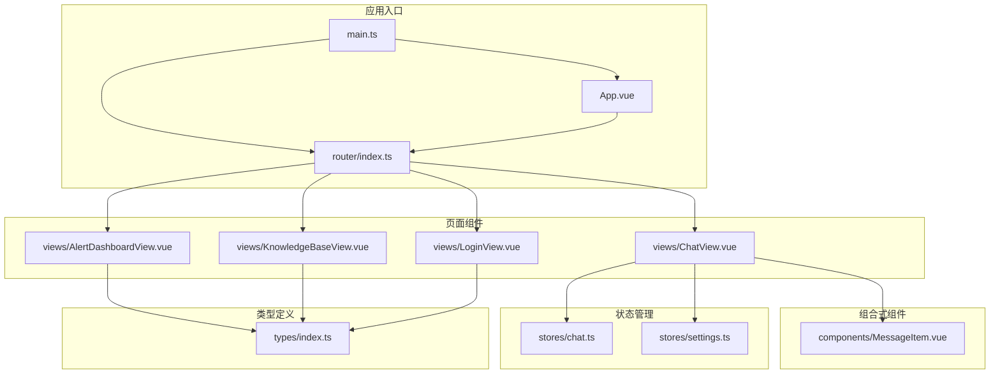
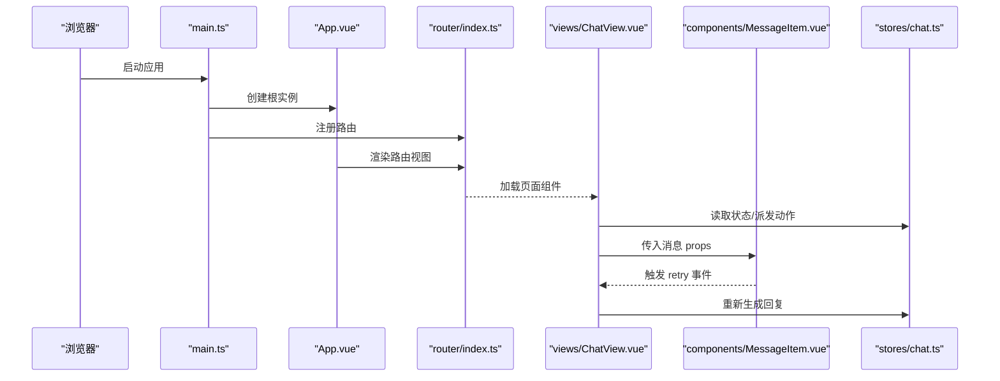
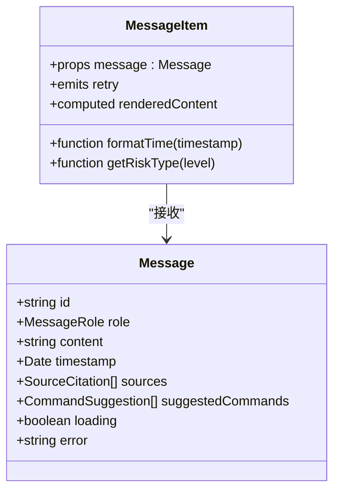
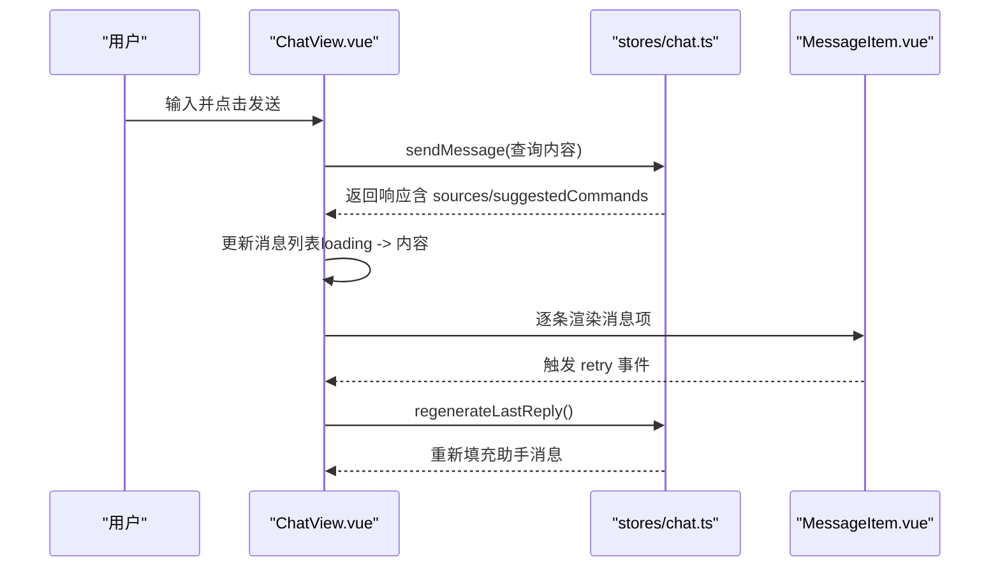
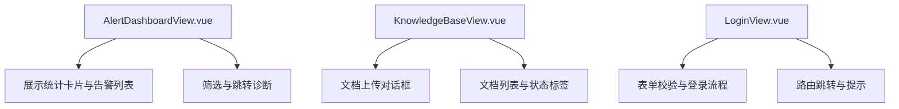
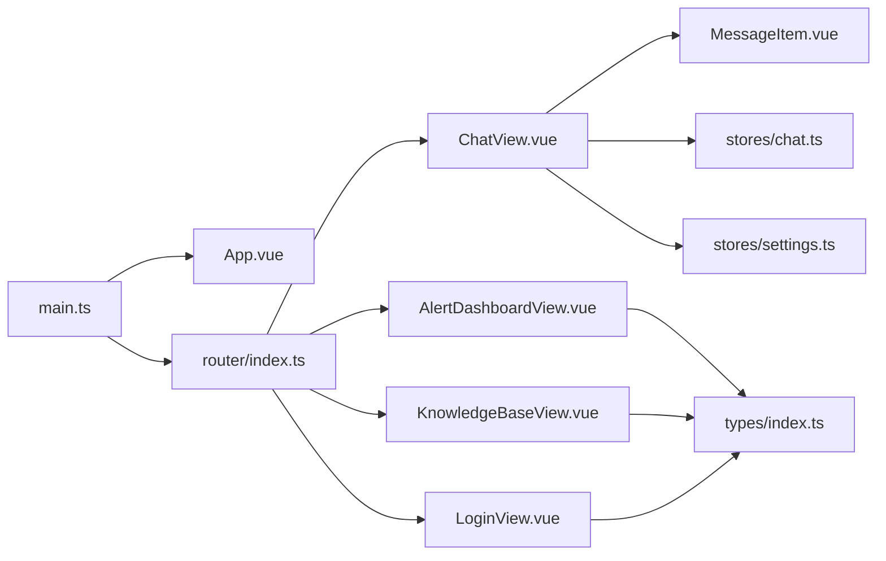

# 组件层次结构

<cite>
**本文引用的文件**
- [MessageItem.vue](file://netdata-ai-frontend/src/components/MessageItem.vue)
- [ChatView.vue](file://netdata-ai-frontend/src/views/ChatView.vue)
- [AlertDashboardView.vue](file://netdata-frontend/src/views/AlertDashboardView.vue)
- [KnowledgeBaseView.vue](file://netdata-frontend/src/views/KnowledgeBaseView.vue)
- [LoginView.vue](file://netdata-frontend/src/views/LoginView.vue)
- [App.vue](file://netdata-frontend/src/App.vue)
- [main.ts](file://netdata-frontend/src/main.ts)
- [router/index.ts](file://netdata-frontend/src/router/index.ts)
- [stores/chat.ts](file://netdata-frontend/src/stores/chat.ts)
- [stores/settings.ts](file://netdata-frontend/src/stores/settings.ts)
- [types/index.ts](file://netdata-frontend/src/types/index.ts)
- [package.json](file://netdata-frontend/package.json)
</cite>

## 目录
1. [引言](#引言)
2. [项目结构](#项目结构)
3. [核心组件](#核心组件)
4. [架构总览](#架构总览)
5. [详细组件分析](#详细组件分析)
6. [依赖分析](#依赖分析)
7. [性能考虑](#性能考虑)
8. [故障排除指南](#故障排除指南)
9. [结论](#结论)
10. [附录](#附录)

## 引言
本文件围绕 Vue.js 前端工程中的组件层次结构展开，系统性梳理基础组件、业务组件与页面组件的分层设计原则与职责划分；重点阐释 MessageItem 基础组件的设计理念与复用策略，以及页面组件在布局结构与业务逻辑封装方面的实现方式；并总结组件命名规范、文件组织结构与依赖关系管理的最佳实践，辅以具体代码片段路径帮助读者快速定位实现细节。

## 项目结构
前端采用典型的“页面视图 + 组合式组件 + 状态管理 + 类型定义”的分层组织方式：
- 视图层（页面组件）：负责布局、交互与业务流程编排，如聊天页、告警页、知识库页等。
- 组合式组件（基础组件）：封装通用 UI 与行为，如消息项组件 MessageItem，强调可复用与可配置。
- 状态管理层：通过 Pinia Store 管理全局或局部状态，如聊天状态、应用设置等。
- 类型定义层：集中声明接口与类型，确保组件间契约清晰。
- 应用入口与路由：统一注册插件、图标、国际化与路由守卫。

图表来源
- [main.ts:1-35](file://netdata-frontend/src/main.ts#L1-L35)
- [App.vue:1-19](file://netdata-frontend/src/App.vue#L1-L19)
- [router/index.ts:1-70](file://netdata-frontend/src/router/index.ts#L1-L70)
- [ChatView.vue:1-335](file://netdata-frontend/src/views/ChatView.vue#L1-L335)
- [MessageItem.vue:1-381](file://netdata-frontend/src/components/MessageItem.vue#L1-L381)
- [stores/chat.ts:1-210](file://netdata-frontend/src/stores/chat.ts#L1-L210)
- [stores/settings.ts:1-32](file://netdata-frontend/src/stores/settings.ts#L1-L32)
- [types/index.ts:1-169](file://netdata-frontend/src/types/index.ts#L1-L169)

章节来源
- [main.ts:1-35](file://netdata-frontend/src/main.ts#L1-L35)
- [router/index.ts:1-70](file://netdata-frontend/src/router/index.ts#L1-L70)

## 核心组件
本节聚焦基础组件与页面组件的职责边界与协作方式：
- 基础组件（组合式组件）：封装单一职责、可复用的 UI 与行为，如消息项组件 MessageItem，负责渲染不同角色的消息、Markdown 内容、来源引用与建议命令等。
- 业务组件（页面组件）：负责页面布局、交互流程与状态编排，如 ChatView，负责侧边栏、消息列表、输入区与工具栏，并通过 Store 管理对话生命周期。
- 类型定义：集中于 types/index.ts，为组件与 Store 提供强类型约束，保证跨层级契约一致。

章节来源
- [MessageItem.vue:1-381](file://netdata-frontend/src/components/MessageItem.vue#L1-L381)
- [ChatView.vue:1-335](file://netdata-frontend/src/views/ChatView.vue#L1-L335)
- [types/index.ts:1-169](file://netdata-frontend/src/types/index.ts#L1-L169)

## 架构总览
下图展示从应用入口到页面组件与基础组件的调用链路，以及状态管理与类型定义的支撑作用：

图表来源
- [main.ts:1-35](file://netdata-frontend/src/main.ts#L1-L35)
- [App.vue:1-19](file://netdata-frontend/src/App.vue#L1-L19)
- [router/index.ts:1-70](file://netdata-frontend/src/router/index.ts#L1-L70)
- [ChatView.vue:1-335](file://netdata-frontend/src/views/ChatView.vue#L1-L335)
- [MessageItem.vue:1-381](file://netdata-frontend/src/components/MessageItem.vue#L1-L381)
- [stores/chat.ts:1-210](file://netdata-frontend/src/stores/chat.ts#L1-L210)

## 详细组件分析

### 基础组件：MessageItem 的设计理念与复用策略
MessageItem 是一个典型的“组合式基础组件”，其设计遵循以下原则：
- 单一职责：渲染消息内容、头像、时间、Markdown、来源引用与建议命令。
- 可复用性：通过 props 接收消息对象，支持用户与助手两种角色，内部根据角色切换样式与头像。
- 可扩展性：通过事件机制对外暴露 retry 行为，便于上层页面组件进行错误重试与再生成。
- 内聚性：内置 Markdown 渲染器与高亮、时间格式化、风险等级映射等辅助函数，降低上层耦合。

图表来源
- [MessageItem.vue:110-163](file://netdata-frontend/src/components/MessageItem.vue#L110-L163)
- [types/index.ts:41-71](file://netdata-frontend/src/types/index.ts#L41-L71)

章节来源
- [MessageItem.vue:1-381](file://netdata-frontend/src/components/MessageItem.vue#L1-L381)
- [types/index.ts:1-169](file://netdata-frontend/src/types/index.ts#L1-L169)

### 页面组件：ChatView 的布局与业务逻辑封装
ChatView 是一个“页面级业务组件”，承担以下职责：
- 布局结构：侧边栏（对话列表）、主聊天区域（头部工具栏、消息容器、输入区）。
- 业务逻辑：创建/选择/删除对话、发送消息、清空对话、滚动控制、示例问题触发、重试消息与重新生成回复。
- 与 Store 的协作：通过 useChatStore 与 useSettingsStore 管理对话状态、加载状态与侧边栏设置。
- 与基础组件的组合：循环渲染 MessageItem，传递 message 并监听 retry 事件。

图表来源
- [ChatView.vue:127-177](file://netdata-frontend/src/views/ChatView.vue#L127-L177)
- [stores/chat.ts:82-138](file://netdata-frontend/src/stores/chat.ts#L82-L138)
- [MessageItem.vue:123-126](file://netdata-frontend/src/components/MessageItem.vue#L123-L126)

章节来源
- [ChatView.vue:1-335](file://netdata-frontend/src/views/ChatView.vue#L1-L335)
- [stores/chat.ts:1-210](file://netdata-frontend/src/stores/chat.ts#L1-L210)

### 其他页面组件：布局与职责示意
- 告警仪表板（AlertDashboardView）：展示统计卡片与告警表格，提供筛选与跳转至聊天页进行诊断的能力。
- 知识库管理（KnowledgeBaseView）：提供文档上传、搜索与列表展示，演示 CRUD 场景下的页面封装。
- 登录页（LoginView）：表单校验、登录流程与路由跳转，体现页面组件对认证流程的封装。

图表来源
- [AlertDashboardView.vue:1-235](file://netdata-frontend/src/views/AlertDashboardView.vue#L1-L235)
- [KnowledgeBaseView.vue:1-209](file://netdata-frontend/src/views/KnowledgeBaseView.vue#L1-L209)
- [LoginView.vue:1-150](file://netdata-frontend/src/views/LoginView.vue#L1-L150)

章节来源
- [AlertDashboardView.vue:1-235](file://netdata-frontend/src/views/AlertDashboardView.vue#L1-L235)
- [KnowledgeBaseView.vue:1-209](file://netdata-frontend/src/views/KnowledgeBaseView.vue#L1-L209)
- [LoginView.vue:1-150](file://netdata-frontend/src/views/LoginView.vue#L1-L150)

## 依赖分析
- 组件依赖：ChatView 依赖 MessageItem；各页面组件依赖类型定义与 Element Plus 组件库。
- 状态依赖：ChatView 依赖 useChatStore 与 useSettingsStore；Store 依赖类型定义与 API 模块。
- 应用依赖：main.ts 注册 Element Plus、图标、Pinia、路由与权限指令；App.vue 作为根组件包裹路由视图与国际化配置。

图表来源
- [main.ts:1-35](file://netdata-frontend/src/main.ts#L1-L35)
- [router/index.ts:1-70](file://netdata-frontend/src/router/index.ts#L1-L70)
- [ChatView.vue:104-108](file://netdata-frontend/src/views/ChatView.vue#L104-L108)
- [stores/chat.ts:1-5](file://netdata-frontend/src/stores/chat.ts#L1-L5)
- [stores/settings.ts:1-32](file://netdata-frontend/src/stores/settings.ts#L1-L32)
- [types/index.ts:1-169](file://netdata-frontend/src/types/index.ts#L1-L169)

章节来源
- [package.json:13-35](file://netdata-frontend/package.json#L13-L35)
- [main.ts:1-35](file://netdata-frontend/src/main.ts#L1-L35)

## 性能考虑
- 渲染优化
  - ChatView 中使用 v-for 渲染消息列表时，确保 key 唯一且稳定，避免不必要的重渲染。
  - MessageItem 内部使用 computed 缓存 Markdown 渲染结果，减少重复计算。
- 事件与滚动
  - 在消息新增时仅在 nextTick 后滚动到底部，避免频繁 DOM 查询导致的回流。
- 状态粒度
  - 将对话列表、当前对话、加载状态拆分为独立响应式字段，避免无关状态变更触发页面重绘。
- 资源加载
  - 按需加载路由组件，减少首屏体积；合理引入第三方库（如 highlight.js），避免全量引入。

## 故障排除指南
- 重试机制
  - MessageItem 在错误状态下提供重试按钮并通过事件通知上层；ChatView 监听 retry 事件并调用 Store 的重新生成方法。
- 路由守卫
  - 未登录访问受保护路由时，路由守卫会重定向至登录页并携带 redirect 参数，便于登录后跳转。
- 表单校验
  - LoginView 使用 Element Plus 表单校验规则，错误时弹出提示消息，提升用户体验。
- 状态初始化
  - main.ts 在挂载应用前初始化认证状态，避免首次访问出现状态不一致。

章节来源
- [MessageItem.vue:28-38](file://netdata-frontend/src/components/MessageItem.vue#L28-L38)
- [ChatView.vue:146-149](file://netdata-frontend/src/views/ChatView.vue#L146-L149)
- [router/index.ts:49-67](file://netdata-frontend/src/router/index.ts#L49-L67)
- [LoginView.vue:79-95](file://netdata-frontend/src/views/LoginView.vue#L79-L95)
- [main.ts:30-33](file://netdata-frontend/src/main.ts#L30-L33)

## 结论
该前端工程通过“页面组件 + 组合式组件 + 状态管理 + 类型定义”的分层架构，实现了清晰的职责划分与良好的可维护性。MessageItem 作为基础组件，以 props 与事件为核心，实现了高内聚、低耦合的复用；ChatView 作为页面组件，将布局、交互与业务流程有机整合，并通过 Store 解耦状态与数据流。配合统一的类型定义与路由守卫，整体具备较强的扩展性与可演进性。

## 附录

### 最佳实践清单
- 组件命名规范
  - 基础组件：语义明确、去歧义，如 MessageItem。
  - 页面组件：以 View 结尾，如 ChatView、AlertDashboardView。
- 文件组织结构
  - 基础组件集中于 components 目录，页面组件集中于 views 目录，按功能域划分 Store 与类型定义。
- 依赖关系管理
  - 明确单向数据流：页面组件通过 Store 管理状态，基础组件只消费 props 与触发事件。
  - 避免跨层级直接依赖：页面组件与 Store 之间通过组合式函数解耦。
- 类型驱动开发
  - 在 types/index.ts 中集中定义接口，组件与 Store 严格遵守类型约束，减少运行时错误。
- 事件与回调
  - 基础组件以事件形式向上抛出交互意图，页面组件负责具体业务处理，保持组件职责单一。

### 关键实现路径参考
- 基础组件 MessageItem
  - [模板与样式:1-108](file://netdata-frontend/src/components/MessageItem.vue#L1-L108)
  - [脚本与渲染逻辑:110-163](file://netdata-frontend/src/components/MessageItem.vue#L110-L163)
- 页面组件 ChatView
  - [布局与交互:1-97](file://netdata-frontend/src/views/ChatView.vue#L1-L97)
  - [业务逻辑与 Store 调用:99-177](file://netdata-frontend/src/views/ChatView.vue#L99-L177)
- 状态管理
  - [聊天 Store:1-210](file://netdata-frontend/src/stores/chat.ts#L1-L210)
  - [设置 Store:1-32](file://netdata-frontend/src/stores/settings.ts#L1-L32)
- 类型定义
  - [消息与对话类型:41-80](file://netdata-frontend/src/types/index.ts#L41-L80)
- 应用入口与路由
  - [应用启动与插件注册:1-35](file://netdata-frontend/src/main.ts#L1-L35)
  - [路由配置与守卫:1-70](file://netdata-frontend/src/router/index.ts#L1-L70)