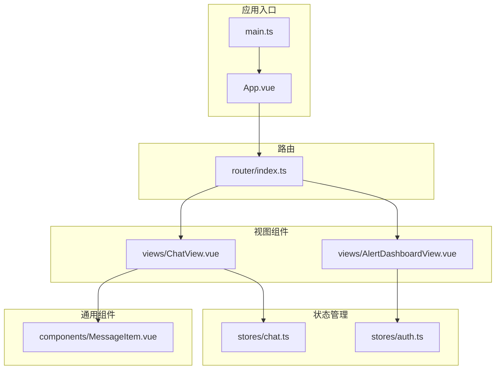
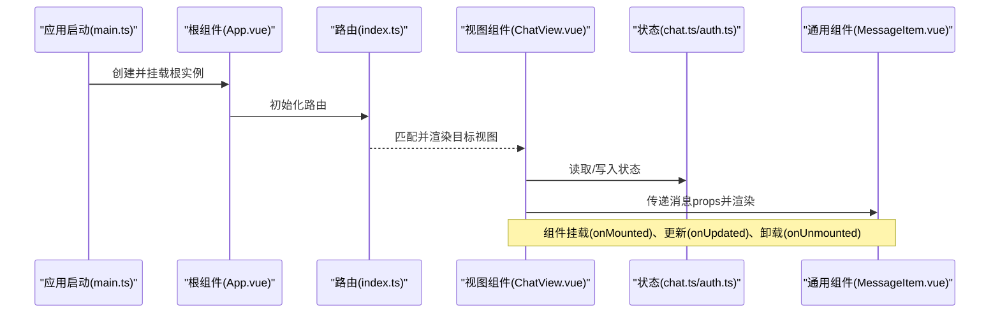
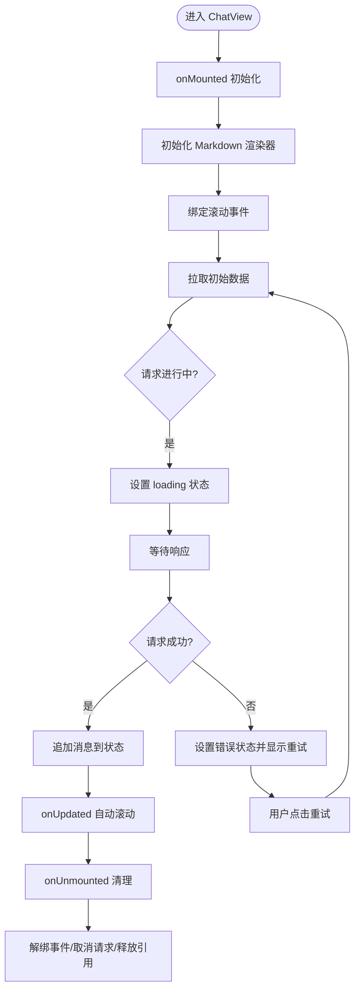
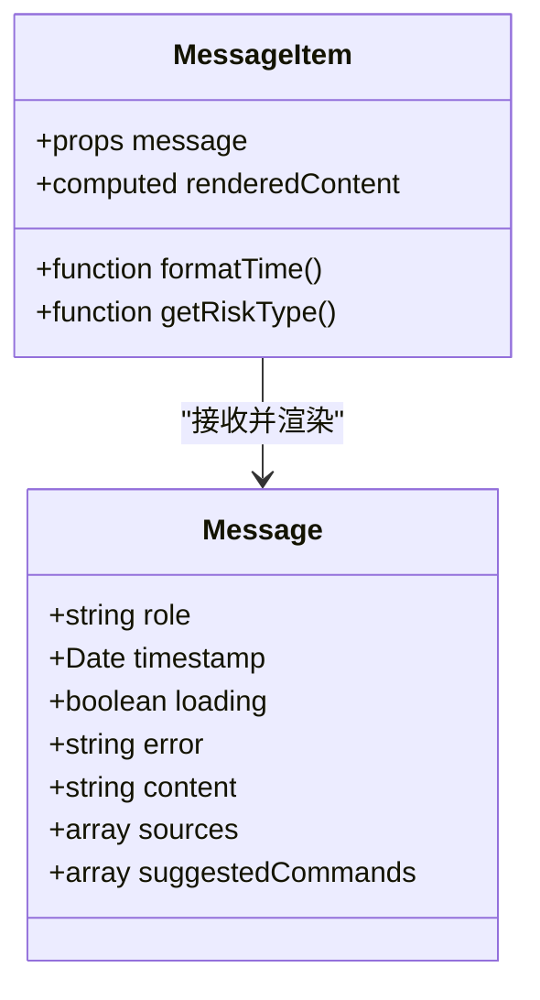
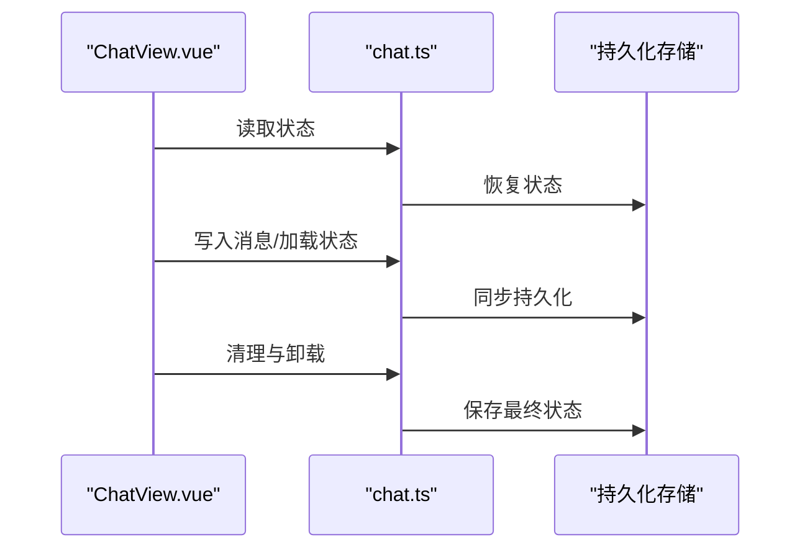

# 组件生命周期管理

<cite>
**本文引用的文件**
- [App.vue](file://netdata-ai-frontend/src/App.vue)
- [MessageItem.vue](file://netdata-ai-frontend/src/components/MessageItem.vue)
- [ChatView.vue](file://netdata-ai-frontend/src/views/ChatView.vue)
- [AlertDashboardView.vue](file://netdata-ai-frontend/src/views/AlertDashboardView.vue)
- [chat.ts](file://netdata-ai-frontend/src/stores/chat.ts)
- [auth.ts](file://netdata-ai-frontend/src/stores/auth.ts)
- [index.ts](file://netdata-ai-frontend/src/router/index.ts)
- [main.ts](file://netdata-ai-frontend/src/main.ts)
- [package.json](file://netdata-ai-frontend/package.json)
</cite>

## 目录
1. [引言](#引言)
2. [项目结构](#项目结构)
3. [核心组件](#核心组件)
4. [架构总览](#架构总览)
5. [详细组件分析](#详细组件分析)
6. [依赖分析](#依赖分析)
7. [性能考虑](#性能考虑)
8. [故障排查指南](#故障排查指南)
9. [结论](#结论)
10. [附录](#附录)

## 引言
本文件聚焦于 Vue.js 组件生命周期管理的最佳实践与工程化落地，结合项目中的实际组件与状态管理模块，系统阐述以下主题：
- 生命周期钩子的使用时机与最佳实践（如 onMounted、onUnmounted、onUpdated 等）
- 组件间状态共享、数据持久化与内存管理策略
- 异步操作的生命周期处理（请求取消、错误处理、加载状态管理）
- 组件销毁与资源清理的完整方案
- 实际生命周期管理示例与常见问题解决方案

## 项目结构
前端采用 Vite + Vue 3 + TypeScript 技术栈，采用 Composition API 与单文件组件组织方式；路由与状态管理分别位于 router 与 stores 目录中；视图层组件按功能划分在 views 目录，通用展示型组件位于 components 目录。

图表来源
- [main.ts](file://netdata-ai-frontend/src/main.ts)
- [App.vue](file://netdata-ai-frontend/src/App.vue)
- [index.ts](file://netdata-ai-frontend/src/router/index.ts)
- [ChatView.vue](file://netdata-ai-frontend/src/views/ChatView.vue)
- [AlertDashboardView.vue](file://netdata-ai-frontend/src/views/AlertDashboardView.vue)
- [MessageItem.vue](file://netdata-ai-frontend/src/components/MessageItem.vue)
- [chat.ts](file://netdata-ai-frontend/src/stores/chat.ts)
- [auth.ts](file://netdata-ai-frontend/src/stores/auth.ts)

章节来源
- [main.ts](file://netdata-ai-frontend/src/main.ts)
- [App.vue](file://netdata-ai-frontend/src/App.vue)
- [index.ts](file://netdata-ai-frontend/src/router/index.ts)

## 核心组件
- 应用根组件：负责全局配置与路由出口，承载页面级生命周期（挂载、卸载）。
- 聊天视图：承载消息列表渲染、Markdown 渲染器初始化、滚动行为与输入交互，是生命周期与异步处理的典型场景。
- 消息项组件：展示消息内容、来源引用与建议命令，演示基于 props 的响应式更新与计算属性的使用。
- 状态管理：聊天与认证状态通过 Pinia 进行集中管理，提供持久化与跨组件共享能力。

章节来源
- [App.vue](file://netdata-ai-frontend/src/App.vue)
- [ChatView.vue](file://netdata-ai-frontend/src/views/ChatView.vue)
- [MessageItem.vue](file://netdata-ai-frontend/src/components/MessageItem.vue)
- [chat.ts](file://netdata-ai-frontend/src/stores/chat.ts)
- [auth.ts](file://netdata-ai-frontend/src/stores/auth.ts)

## 架构总览
下图展示了从应用启动到视图渲染、再到状态驱动的数据流与生命周期交互：

图表来源
- [main.ts](file://netdata-ai-frontend/src/main.ts)
- [App.vue](file://netdata-ai-frontend/src/App.vue)
- [index.ts](file://netdata-frontend/src/router/index.ts)
- [ChatView.vue](file://netdata-ai-frontend/src/views/ChatView.vue)
- [MessageItem.vue](file://netdata-ai-frontend/src/components/MessageItem.vue)
- [chat.ts](file://netdata-ai-frontend/src/stores/chat.ts)
- [auth.ts](file://netdata-ai-frontend/src/stores/auth.ts)

## 详细组件分析

### 根组件 App.vue 的生命周期要点
- 全局配置提供者：在根组件中注入语言环境配置，确保全局 UI 组件的语言一致性。
- 生命周期位置：作为应用入口，其 onMounted 对应应用首次挂载；onUnmounted 对应应用卸载。
- 最佳实践：
  - 将全局副作用（如国际化、主题、埋点初始化）放在根组件的 onMounted 中，避免重复初始化。
  - 在 onUnmounted 中统一清理全局事件监听或定时器，防止内存泄漏。

章节来源
- [App.vue](file://netdata-ai-frontend/src/App.vue)

### 聊天视图 ChatView.vue 的生命周期与异步处理
- 组件职责：维护消息列表、Markdown 渲染器、滚动行为、输入框交互与发送逻辑。
- 生命周期使用：
  - onMounted：初始化 Markdown 渲染器、绑定滚动容器事件、拉取初始数据。
  - onUpdated：根据新消息自动滚动到底部；根据 props 变化触发局部更新。
  - onUnmounted：解绑滚动事件、清理渲染器引用、取消未完成的异步任务。
- 异步处理：
  - 请求取消：使用 AbortController 或服务端支持的取消语义，在组件卸载时中断请求。
  - 错误处理：捕获网络异常与业务错误，设置错误状态并通过 UI 展示“重试”按钮。
  - 加载状态：在请求开始时设置 loading 状态，结束时清除，避免 UI 闪烁。
- 状态同步：
  - 通过 Pinia chat 状态集中管理消息队列与输入值，实现跨组件共享与持久化。
  - 使用 computed 与 watchEffect 监听状态变化，驱动 DOM 更新与副作用执行。

图表来源
- [ChatView.vue](file://netdata-ai-frontend/src/views/ChatView.vue)
- [chat.ts](file://netdata-ai-frontend/src/stores/chat.ts)

章节来源
- [ChatView.vue](file://netdata-ai-frontend/src/views/ChatView.vue)
- [chat.ts](file://netdata-ai-frontend/src/stores/chat.ts)

### 消息项组件 MessageItem.vue 的响应式与渲染优化
- Props 驱动渲染：通过 message props 控制头像、角色标签、时间、内容渲染与来源引用。
- 计算属性：将 Markdown 内容转换为 HTML 字符串，减少重复计算与模板内复杂表达式。
- 状态分支：根据 message.loading 与 message.error 切换不同 UI 分支，提升可访问性与用户体验。
- 最佳实践：
  - 将昂贵的渲染器初始化放在父组件生命周期中，子组件仅消费 props 并渲染。
  - 使用 v-html 渲染受信任的 Markdown 输出，避免 XSS 风险。
  - 对于动态样式与动画，尽量使用 scoped 样式与 CSS 变量，避免频繁重排。

图表来源
- [MessageItem.vue](file://netdata-ai-frontend/src/components/MessageItem.vue)
- [MessageItem.vue](file://netdata-ai-frontend/src/components/MessageItem.vue)

章节来源
- [MessageItem.vue](file://netdata-ai-frontend/src/components/MessageItem.vue)

### 状态管理与生命周期协同
- Pinia 状态：chat.ts 提供消息列表、输入值、加载与错误状态；auth.ts 提供认证信息与权限状态。
- 生命周期协同：
  - onMounted：从持久化存储恢复状态（如 localStorage），避免刷新丢失。
  - onUpdated：根据状态变化触发副作用（如滚动、日志上报）。
  - onUnmounted：序列化状态到持久化存储，清理定时器与订阅。
- 数据持久化：
  - 使用浏览器存储或服务端同步，确保组件重建后状态一致。
  - 对敏感数据进行脱敏与最小化存储，遵循隐私保护原则。

图表来源
- [chat.ts](file://netdata-ai-frontend/src/stores/chat.ts)
- [ChatView.vue](file://netdata-ai-frontend/src/views/ChatView.vue)

章节来源
- [chat.ts](file://netdata-ai-frontend/src/stores/chat.ts)
- [auth.ts](file://netdata-ai-frontend/src/stores/auth.ts)

## 依赖分析
- 运行时依赖：Element Plus、Day.js、MarkdownIt、highlight.js 等。
- 构建与开发依赖：Vite、TypeScript、ESLint、Prettier 等。
- 依赖关系对生命周期的影响：
  - 第三方库初始化应在 onMounted 中进行，避免 SSR 或非浏览器环境报错。
  - 动画与渲染库的引用需在组件卸载时释放，防止内存泄漏。

章节来源
- [package.json](file://netdata-ai-frontend/package.json)

## 性能考虑
- 渲染性能：
  - 使用 computed 缓存计算结果，避免重复渲染。
  - 对长列表使用虚拟滚动或分页，降低 DOM 节点数量。
- 网络性能：
  - 合理设置超时与重试策略，避免长时间阻塞 UI。
  - 使用请求去抖与节流，减少高频请求。
- 内存管理：
  - 在 onUnmounted 中统一清理事件监听、定时器、WebSocket 连接与第三方库实例。
  - 避免闭包持有大对象导致的内存泄漏。

## 故障排查指南
- 常见问题与定位方法：
  - 卸载后仍触发回调：确认在 onUnmounted 中正确解绑事件与取消请求。
  - 状态不一致：检查持久化存储的读写时机与并发写入冲突。
  - 渲染卡顿：排查计算属性与模板表达式复杂度，必要时拆分组件。
  - 第三方库报错：确认运行环境与初始化顺序，避免在非浏览器环境初始化。
- 排查步骤：
  - 使用浏览器开发者工具的 Performance 与 Memory 面板定位瓶颈。
  - 在关键生命周期钩子中添加日志，追踪执行顺序与耗时。
  - 对异步流程增加超时与错误边界，避免静默失败。

## 结论
通过在根组件、视图组件与通用组件中合理运用生命周期钩子，并配合 Pinia 状态管理与持久化策略，可以构建出稳定、高性能且易于维护的 Vue.js 应用。重点在于：
- 明确生命周期职责边界
- 将昂贵操作延迟到 onMounted
- 在 onUnmounted 中统一清理
- 以状态驱动 UI，减少手动 DOM 操作
- 以错误边界与加载态提升用户体验

## 附录
- 示例参考路径（不展示具体代码内容）：
  - 根组件生命周期与全局配置：[App.vue](file://netdata-ai-frontend/src/App.vue)
  - 聊天视图生命周期与异步处理：[ChatView.vue](file://netdata-ai-frontend/src/views/ChatView.vue)
  - 消息项组件渲染与计算属性：[MessageItem.vue](file://netdata-ai-frontend/src/components/MessageItem.vue)
  - 聊天状态管理与持久化：[chat.ts](file://netdata-ai-frontend/src/stores/chat.ts)
  - 认证状态管理：[auth.ts](file://netdata-ai-frontend/src/stores/auth.ts)
  - 路由与应用入口：[index.ts](file://netdata-ai-frontend/src/router/index.ts), [main.ts](file://netdata-ai-frontend/src/main.ts)
  - 依赖清单：[package.json](file://netdata-ai-frontend/package.json)