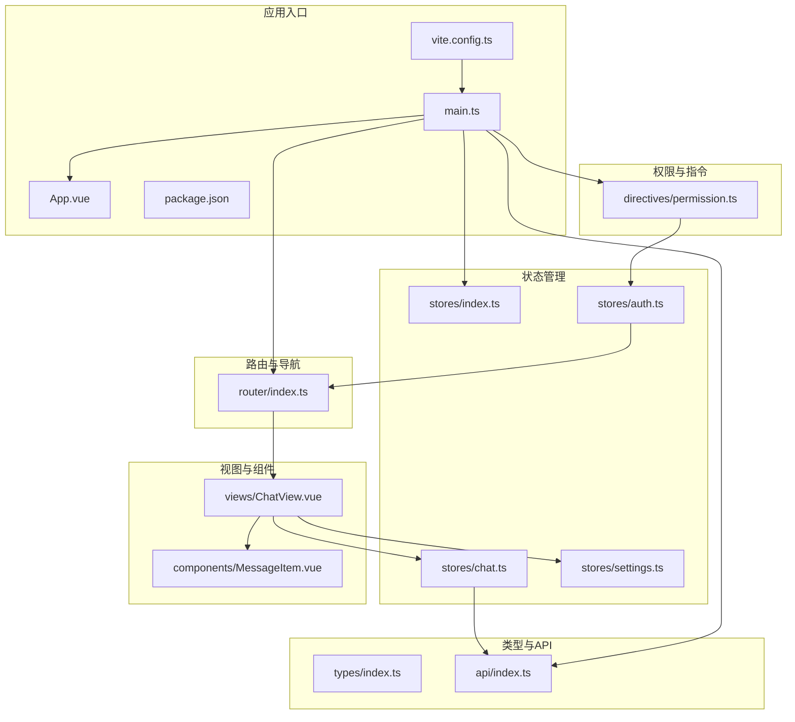
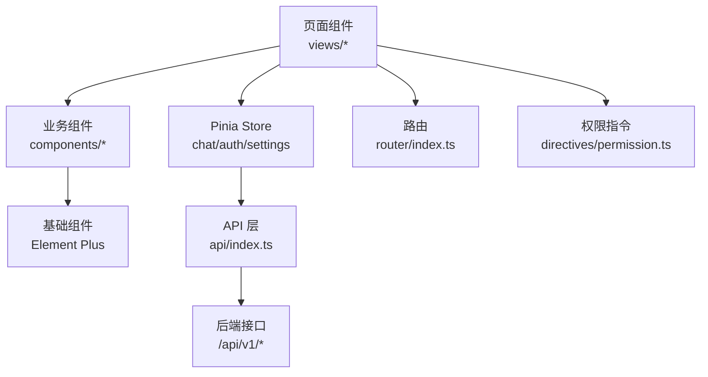
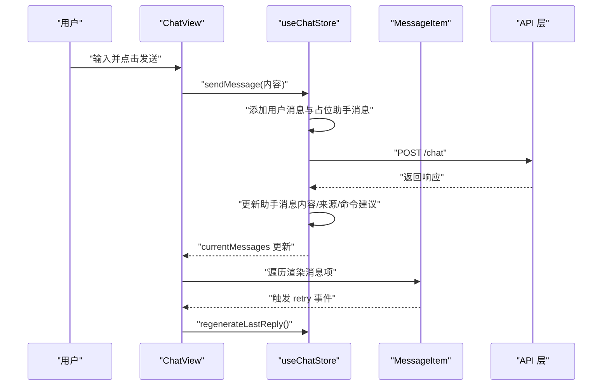
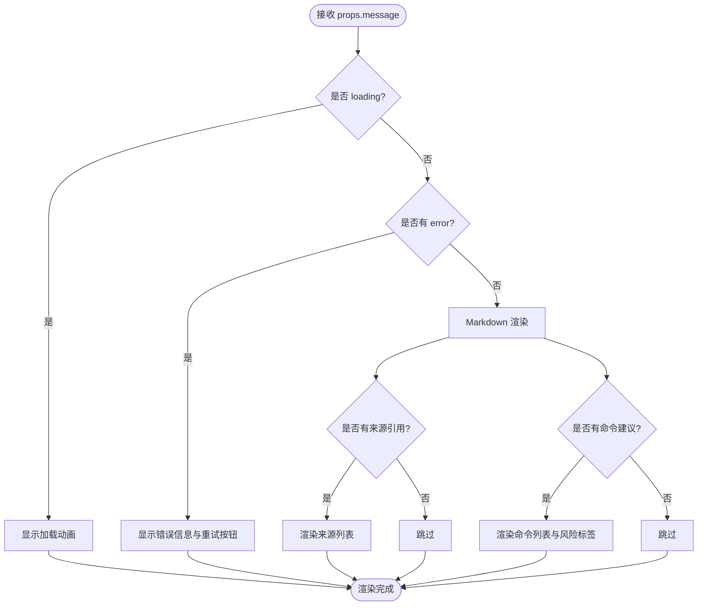
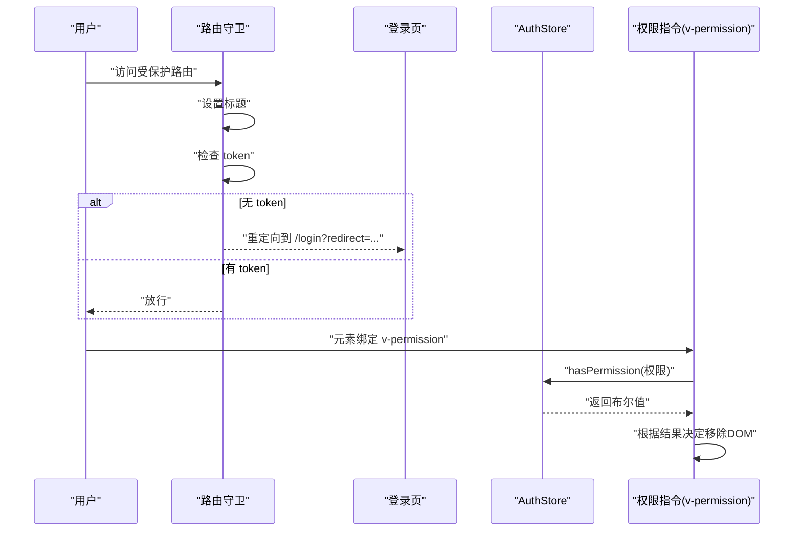
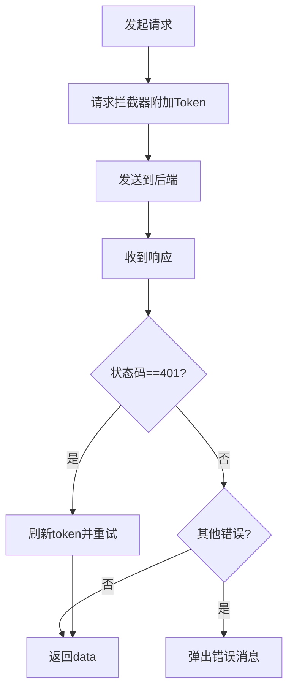
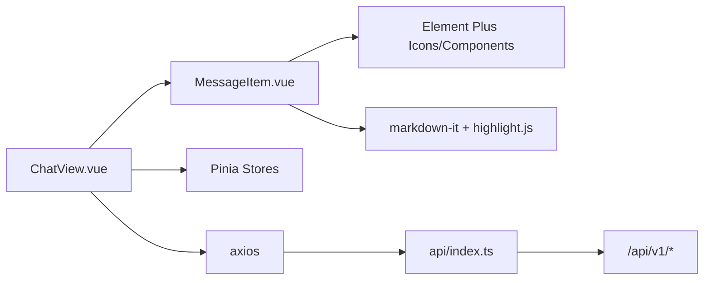

# 组件系统架构

<cite>
**本文引用的文件**
- [App.vue](file://netdata-ai-frontend/src/App.vue)
- [main.ts](file://netdata-ai-frontend/src/main.ts)
- [router/index.ts](file://netdata-ai-frontend/src/router/index.ts)
- [directives/permission.ts](file://netdata-ai-frontend/src/directives/permission.ts)
- [stores/index.ts](file://netdata-ai-frontend/src/stores/index.ts)
- [stores/chat.ts](file://netdata-ai-frontend/src/stores/chat.ts)
- [stores/auth.ts](file://netdata-ai-frontend/src/stores/auth.ts)
- [stores/settings.ts](file://netdata-ai-frontend/src/stores/settings.ts)
- [components/MessageItem.vue](file://netdata-ai-frontend/src/components/MessageItem.vue)
- [views/ChatView.vue](file://netdata-ai-frontend/src/views/ChatView.vue)
- [types/index.ts](file://netdata-ai-frontend/src/types/index.ts)
- [api/index.ts](file://netdata-ai-frontend/src/api/index.ts)
- [vite.config.ts](file://netdata-ai-frontend/vite.config.ts)
- [package.json](file://netdata-ai-frontend/package.json)
</cite>

## 目录
1. [引言](#引言)
2. [项目结构](#项目结构)
3. [核心组件](#核心组件)
4. [架构总览](#架构总览)
5. [组件详细分析](#组件详细分析)
6. [依赖关系分析](#依赖关系分析)
7. [性能考量](#性能考量)
8. [故障排查指南](#故障排查指南)
9. [结论](#结论)
10. [附录](#附录)

## 引言
本文件为 Vue.js 组件系统架构文档，聚焦于前端工程 netdata-ai-frontend 的组件分层、通信机制、复用策略、生命周期与状态同步、开发最佳实践以及测试策略。系统采用 Vue 3 + TypeScript + Pinia + Element Plus + Vite 技术栈，围绕“页面组件-业务组件-基础组件”的分层设计，结合路由守卫、权限指令、状态管理与 API 层，形成清晰的职责边界与可维护性。

## 项目结构
前端项目采用按功能域划分的组织方式：
- 根应用入口与全局配置：App.vue、main.ts、vite.config.ts、package.json
- 路由与导航：router/index.ts
- 权限与指令：directives/permission.ts
- 状态管理：stores/*（chat、auth、settings）
- 类型定义：types/index.ts
- API 层：api/index.ts
- 视图与组件：views/*、components/*



图表来源
- [main.ts:1-35](file://netdata-ai-frontend/src/main.ts#L1-L35)
- [router/index.ts:1-70](file://netdata-ai-frontend/src/router/index.ts#L1-L70)
- [stores/index.ts:1-4](file://netdata-ai-frontend/src/stores/index.ts#L1-L4)
- [stores/chat.ts:1-210](file://netdata-ai-frontend/src/stores/chat.ts#L1-L210)
- [stores/auth.ts:1-119](file://netdata-ai-frontend/src/stores/auth.ts#L1-L119)
- [stores/settings.ts:1-32](file://netdata-ai-frontend/src/stores/settings.ts#L1-L32)
- [components/MessageItem.vue:1-381](file://netdata-ai-frontend/src/components/MessageItem.vue#L1-L381)
- [views/ChatView.vue:1-335](file://netdata-ai-frontend/src/views/ChatView.vue#L1-L335)
- [types/index.ts:1-169](file://netdata-ai-frontend/src/types/index.ts#L1-L169)
- [api/index.ts:1-290](file://netdata-ai-frontend/src/api/index.ts#L1-L290)
- [vite.config.ts:1-52](file://netdata-ai-frontend/vite.config.ts#L1-L52)
- [package.json:1-37](file://netdata-ai-frontend/package.json#L1-L37)

章节来源
- [main.ts:1-35](file://netdata-ai-frontend/src/main.ts#L1-L35)
- [vite.config.ts:1-52](file://netdata-ai-frontend/vite.config.ts#L1-L52)
- [package.json:1-37](file://netdata-ai-frontend/package.json#L1-L37)

## 核心组件
- 页面组件（Page Components）
  - ChatView：聊天主界面，负责对话列表、消息渲染、输入与发送、清空对话等交互；依赖 Pinia 状态与指令。
  - 其他视图：AlertDashboardView、KnowledgeBaseView、ExecutionApprovalView、UserManagementView、LoginView，均由路由懒加载引入。
- 业务组件（Business Components）
  - MessageItem：单条消息展示组件，支持 Markdown 渲染、来源引用、命令建议、重试事件等。
- 基础组件（Base Components）
  - 通过 Element Plus 提供的基础 UI 组件（按钮、输入框、标签、滚动条等），在 Vite 中通过自动导入解析器按需注册。

章节来源
- [views/ChatView.vue:1-335](file://netdata-ai-frontend/src/views/ChatView.vue#L1-L335)
- [components/MessageItem.vue:1-381](file://netdata-ai-frontend/src/components/MessageItem.vue#L1-L381)
- [router/index.ts:1-70](file://netdata-ai-frontend/src/router/index.ts#L1-L70)
- [vite.config.ts:10-22](file://netdata-ai-frontend/vite.config.ts#L10-L22)

## 架构总览
系统采用“页面-业务-基础”三层结构：
- 页面组件负责页面级布局与交互编排，调用 Pinia 状态与指令。
- 业务组件封装具体业务能力（如消息渲染），通过 props 接收数据，通过 emits 向父组件反馈事件。
- 基础组件由 Element Plus 提供，通过自动导入减少样板代码。
- 路由负责页面级导航与鉴权前置校验；权限指令在 DOM 层面控制可见性。
- 状态管理集中于 Pinia，分别管理聊天、认证与设置；API 层统一处理请求/响应拦截与错误提示。



图表来源
- [views/ChatView.vue:1-335](file://netdata-ai-frontend/src/views/ChatView.vue#L1-L335)
- [components/MessageItem.vue:1-381](file://netdata-frontend/src/components/MessageItem.vue#L1-L381)
- [stores/chat.ts:1-210](file://netdata-ai-frontend/src/stores/chat.ts#L1-L210)
- [stores/auth.ts:1-119](file://netdata-ai-frontend/src/stores/auth.ts#L1-L119)
- [stores/settings.ts:1-32](file://netdata-ai-frontend/src/stores/settings.ts#L1-L32)
- [router/index.ts:1-70](file://netdata-ai-frontend/src/router/index.ts#L1-L70)
- [directives/permission.ts:1-63](file://netdata-ai-frontend/src/directives/permission.ts#L1-L63)
- [api/index.ts:1-290](file://netdata-ai-frontend/src/api/index.ts#L1-L290)

## 组件详细分析

### 页面组件：ChatView
- 职责
  - 聊天布局与交互：侧边栏对话列表、顶部工具栏、消息容器、输入区。
  - 与 Pinia 协作：使用 useChatStore 管理对话与消息；useSettingsStore 控制侧边栏与主题。
  - 事件处理：发送消息、清空对话、示例问题、重试消息。
- 数据流
  - 输入文本 -> sendMessage -> 状态更新 -> 消息渲染 -> 自动滚动。
- 生命周期与状态同步
  - 通过 watch 监听消息长度变化，nextTick 后滚动到底部，保证 DOM 更新完成再滚动。
- 通信机制
  - 子组件 MessageItem 通过 props 接收 message；通过 emits 通知父组件 retry 事件。
- 性能与可访问性
  - 使用虚拟滚动容器（滚动条组件）提升长列表性能；输入区支持多行与快捷键。
  - 样式中包含滚动条自定义，提升可用性。



图表来源
- [views/ChatView.vue:127-177](file://netdata-ai-frontend/src/views/ChatView.vue#L127-L177)
- [stores/chat.ts:82-138](file://netdata-ai-frontend/src/stores/chat.ts#L82-L138)
- [components/MessageItem.vue:119-126](file://netdata-ai-frontend/src/components/MessageItem.vue#L119-L126)
- [api/index.ts:123-144](file://netdata-ai-frontend/src/api/index.ts#L123-L144)

章节来源
- [views/ChatView.vue:1-335](file://netdata-ai-frontend/src/views/ChatView.vue#L1-L335)
- [stores/chat.ts:1-210](file://netdata-ai-frontend/src/stores/chat.ts#L1-L210)
- [components/MessageItem.vue:1-381](file://netdata-ai-frontend/src/components/MessageItem.vue#L1-L381)
- [api/index.ts:1-290](file://netdata-ai-frontend/src/api/index.ts#L1-L290)

### 业务组件：MessageItem
- 职责
  - 渲染单条消息，支持用户/助手两类角色头像、时间戳、Markdown 内容、来源引用、命令建议。
  - 加载态、错误态与重试事件。
- 通信机制
  - props 接收 Message 类型对象；emits 声明 retry 事件，向上冒泡。
- 复用策略
  - 通过 props 与 emits 实现与父组件解耦；Markdown 渲染器与高亮库内聚在组件内部，便于独立演进。
- 样式隔离
  - 使用 scoped 与 :deep 选择器，确保样式不泄漏到其他组件。



图表来源
- [components/MessageItem.vue:119-162](file://netdata-ai-frontend/src/components/MessageItem.vue#L119-L162)
- [components/MessageItem.vue:145-147](file://netdata-ai-frontend/src/components/MessageItem.vue#L145-L147)

章节来源
- [components/MessageItem.vue:1-381](file://netdata-ai-frontend/src/components/MessageItem.vue#L1-L381)
- [types/index.ts:41-80](file://netdata-ai-frontend/src/types/index.ts#L41-L80)

### 状态管理：Pinia Store
- useChatStore
  - 管理对话列表、当前对话、消息、加载状态与会话 ID；提供创建/选择/删除对话、发送消息、重试回复、清空对话等动作。
- useAuthStore
  - 管理 token、用户信息、角色与权限；提供登录、刷新、登出、初始化等动作，并暴露 hasRole/hasPermission 辅助方法。
- useSettingsStore
  - 管理主题与侧边栏折叠状态；提供切换方法。
- 设计要点
  - 使用组合式 Store（setup 语法）简化状态与逻辑；通过 computed getter 派生派生状态，避免重复计算。
  - API 调用集中在 api/index.ts，Store 仅负责状态与调度。

```mermaid
classDiagram
class ChatStore {
+conversations : Conversation[]
+currentConversationId : string
+isLoading : boolean
+sessionId : string
+currentConversation()
+currentMessages()
+createConversation(title)
+selectConversation(id)
+deleteConversation(id)
+sendMessage(content)
+regenerateLastReply()
+clearCurrentConversation()
+clearAllConversations()
}
class AuthStore {
+token : string
+refreshToken : string
+user : UserInfo
+isAuthenticated()
+username()
+roles()
+permissions()
+hasRole(role)
+hasPermission(permission)
+login(username,password)
+fetchUserInfo()
+refreshAccessToken()
+logout()
+init()
}
class SettingsStore {
+theme : "light"|"dark"
+sidebarCollapsed : boolean
+toggleTheme()
+toggleSidebar()
}
ChatStore --> "使用" API["api/index.ts"]
AuthStore --> "使用" Router["router/index.ts"]
```

图表来源
- [stores/chat.ts:12-209](file://netdata-ai-frontend/src/stores/chat.ts#L12-L209)
- [stores/auth.ts:22-118](file://netdata-ai-frontend/src/stores/auth.ts#L22-L118)
- [stores/settings.ts:7-31](file://netdata-ai-frontend/src/stores/settings.ts#L7-L31)
- [api/index.ts:123-233](file://netdata-ai-frontend/src/api/index.ts#L123-L233)
- [router/index.ts:49-67](file://netdata-ai-frontend/src/router/index.ts#L49-L67)

章节来源
- [stores/chat.ts:1-210](file://netdata-ai-frontend/src/stores/chat.ts#L1-L210)
- [stores/auth.ts:1-119](file://netdata-ai-frontend/src/stores/auth.ts#L1-L119)
- [stores/settings.ts:1-32](file://netdata-ai-frontend/src/stores/settings.ts#L1-L32)
- [api/index.ts:1-290](file://netdata-ai-frontend/src/api/index.ts#L1-L290)

### 路由与权限：路由守卫与指令
- 路由守卫
  - 设置页面标题；对非公开路由进行认证检查；未登录重定向至登录页并携带 redirect 参数。
- 权限指令
  - v-permission 与 v-role 在挂载/更新时检查用户权限或角色，无权限则从 DOM 移除元素，避免无效渲染。
- 与状态管理协作
  - 权限指令依赖 useAuthStore 的 hasPermission/hasRole 方法；路由守卫读取 localStorage 中的 token。



图表来源
- [router/index.ts:49-67](file://netdata-ai-frontend/src/router/index.ts#L49-L67)
- [directives/permission.ts:9-30](file://netdata-ai-frontend/src/directives/permission.ts#L9-L30)
- [directives/permission.ts:36-57](file://netdata-ai-frontend/src/directives/permission.ts#L36-L57)
- [stores/auth.ts:34-39](file://netdata-ai-frontend/src/stores/auth.ts#L34-L39)

章节来源
- [router/index.ts:1-70](file://netdata-ai-frontend/src/router/index.ts#L1-L70)
- [directives/permission.ts:1-63](file://netdata-ai-frontend/src/directives/permission.ts#L1-L63)
- [stores/auth.ts:1-119](file://netdata-ai-frontend/src/stores/auth.ts#L1-L119)

### API 层与拦截器
- 统一配置
  - 基础路径 /api/v1，超时 60s，JSON 默认头。
- 请求拦截器
  - 自动附加 Authorization: Bearer token。
- 响应拦截器
  - 统一错误处理：403 权限不足、429 限流、401 自动刷新 token 并重试；其他错误弹出消息。
- 流式对话
  - 提供 sendMessageStream 接口（当前以普通请求实现，注释提示后续升级为 SSE）。



图表来源
- [api/index.ts:29-112](file://netdata-ai-frontend/src/api/index.ts#L29-L112)

章节来源
- [api/index.ts:1-290](file://netdata-ai-frontend/src/api/index.ts#L1-L290)

## 依赖关系分析
- 组件依赖
  - ChatView 依赖 MessageItem、Pinia Store、Element Plus 组件。
  - MessageItem 依赖 Element Plus 图标、MarkdownIt、highlight.js。
- 外部依赖
  - Vue 3、Vue Router、Pinia、Element Plus、Axios、Day.js、Markdown-it、highlight.js。
- 构建与自动导入
  - Vite 插件自动导入 Element Plus 组件与图标，减少手动注册成本。



图表来源
- [views/ChatView.vue:104-104](file://netdata-ai-frontend/src/views/ChatView.vue#L104-L104)
- [components/MessageItem.vue:112-116](file://netdata-ai-frontend/src/components/MessageItem.vue#L112-L116)
- [api/index.ts:1-290](file://netdata-ai-frontend/src/api/index.ts#L1-L290)

章节来源
- [package.json:13-23](file://netdata-ai-frontend/package.json#L13-L23)
- [vite.config.ts:10-22](file://netdata-ai-frontend/vite.config.ts#L10-L22)

## 性能考量
- 代码分割与懒加载
  - 路由组件使用动态导入，按需加载，降低首屏体积。
- 分包策略
  - Vite 构建配置将 element-plus 与 vue-vendor 独立分包，提升缓存命中率。
- 组件渲染优化
  - MessageItem 使用 computed 缓存渲染结果；ChatView 通过 nextTick 与 watch 控制滚动时机，避免不必要的重排。
- 图标与样式
  - Element Plus 图标按需注册；组件样式 scoped + :deep，避免全局污染。
- 可选优化
  - 将 ChatView 的长列表容器替换为虚拟滚动组件；对 Markdown 渲染结果做缓存；对高频事件（如输入）使用防抖。

章节来源
- [router/index.ts:9-9](file://netdata-ai-frontend/src/router/index.ts#L9-L9)
- [vite.config.ts:38-50](file://netdata-ai-frontend/vite.config.ts#L38-L50)
- [views/ChatView.vue:170-176](file://netdata-ai-frontend/src/views/ChatView.vue#L170-L176)
- [components/MessageItem.vue:145-147](file://netdata-ai-frontend/src/components/MessageItem.vue#L145-L147)

## 故障排查指南
- 登录与鉴权
  - 现象：访问受保护路由被重定向到登录页。
  - 排查：确认 localStorage 中是否存在 access_token；检查路由守卫逻辑与 token 刷新流程。
- 权限控制失效
  - 现象：元素未按预期隐藏。
  - 排查：确认指令绑定值格式（字符串或数组）；检查 useAuthStore.hasPermission 返回值。
- 请求失败与错误提示
  - 现象：出现权限不足、请求频繁、未知错误等提示。
  - 排查：查看响应拦截器分支；确认 401 刷新流程是否成功；检查本地存储 token 是否存在。
- 消息不显示或不更新
  - 现象：消息列表空白或不更新。
  - 排查：确认 useChatStore.currentMessages 计算属性是否正确；检查 API 返回字段与类型定义一致性。

章节来源
- [router/index.ts:49-67](file://netdata-ai-frontend/src/router/index.ts#L49-L67)
- [directives/permission.ts:18-30](file://netdata-ai-frontend/src/directives/permission.ts#L18-L30)
- [api/index.ts:44-112](file://netdata-ai-frontend/src/api/index.ts#L44-L112)
- [stores/chat.ts:29-37](file://netdata-ai-frontend/src/stores/chat.ts#L29-L37)
- [types/index.ts:41-99](file://netdata-ai-frontend/src/types/index.ts#L41-L99)

## 结论
该组件系统通过清晰的分层设计与完善的基础设施（路由、权限、状态、API），实现了页面交互、业务渲染与基础 UI 的解耦。组件间通信以 props/emit 为主，配合 Pinia 管理跨组件状态，满足复杂业务场景下的可维护性与扩展性。建议后续在长列表、渲染缓存与流式对话方面进一步优化，并完善单元测试与 E2E 测试覆盖。

## 附录
- 组件开发最佳实践
  - 命名规范：页面组件以 View 结尾，业务组件以 Item/Panel 等语义化后缀；store 使用 useXxx 形式导出。
  - 样式隔离：优先使用 scoped 与 :deep；避免全局样式污染。
  - 性能优化：合理拆分组件与路由；对长列表与高频渲染做缓存与节流；利用构建分包策略。
  - 可访问性：为交互元素提供明确的标签与键盘支持；错误提示使用语义化消息组件。
- 开发流程
  - 新增页面：创建路由与视图组件，按需引入业务组件与 store。
  - 新增业务组件：定义 props/emit，封装内部状态与渲染逻辑，保持对外接口稳定。
  - 状态管理：在 store 中集中处理副作用与异步逻辑，避免在组件中直接调用 API。
  - 权限控制：优先使用指令在模板层面过滤不可见元素，减少无效渲染。
- 测试策略
  - 单元测试：针对 store 的 action 与 getter、指令的权限判断、组件的渲染逻辑。
  - 集成测试：端到端验证路由守卫、登录流程、消息发送与渲染链路。
  - 回归测试：在新增功能时回归核心交互（滚动、重试、清空对话）。