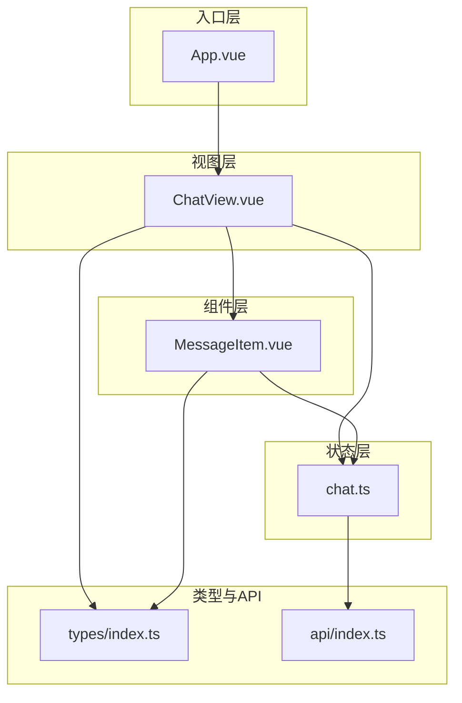
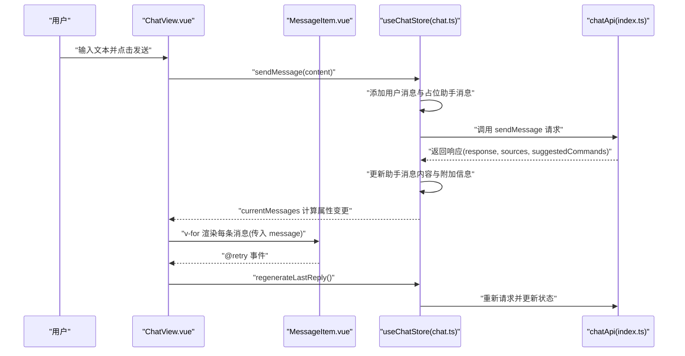
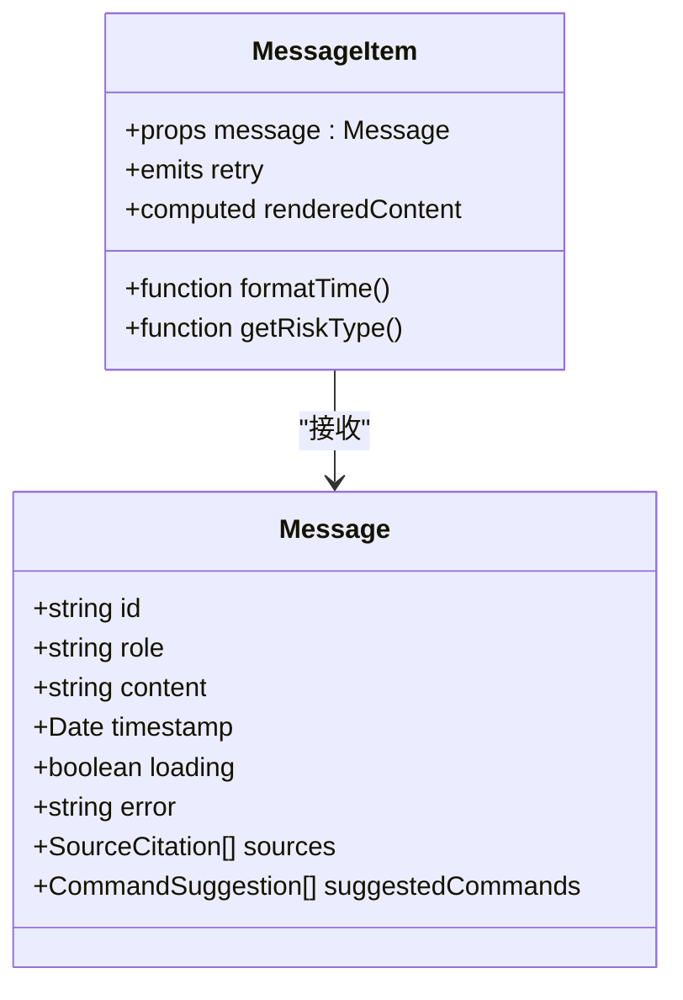
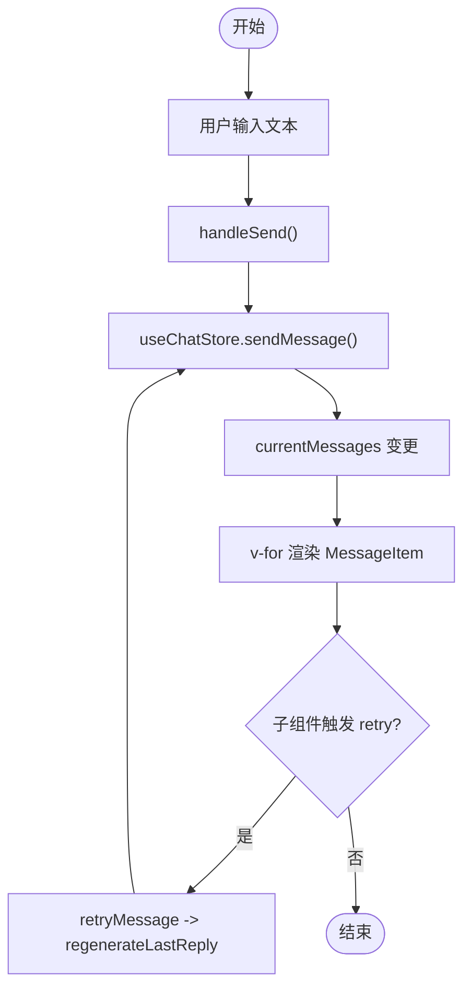
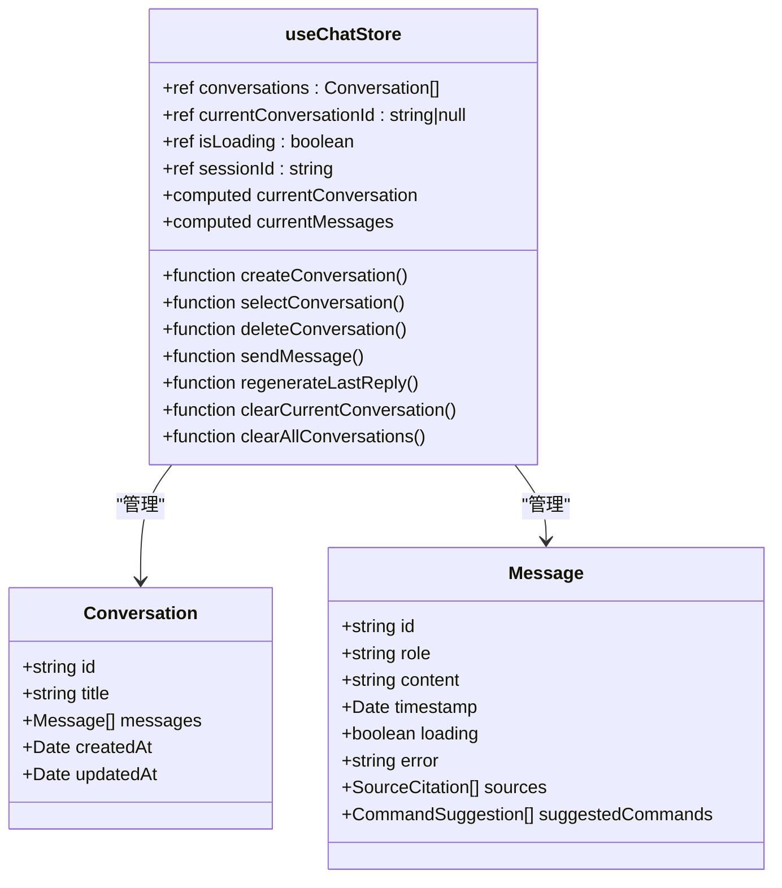
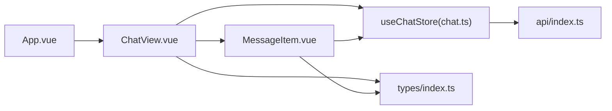

# 组件通信机制

<cite>
**本文引用的文件**
- [App.vue](file://netdata-ai-frontend/src/App.vue)
- [MessageItem.vue](file://netdata-ai-frontend/src/components/MessageItem.vue)
- [ChatView.vue](file://netdata-ai-frontend/src/views/ChatView.vue)
- [chat.ts](file://netdata-ai-frontend/src/stores/chat.ts)
- [index.ts](file://netdata-ai-frontend/src/stores/index.ts)
- [index.ts](file://netdata-ai-frontend/src/types/index.ts)
- [index.ts](file://netdata-ai-frontend/src/api/index.ts)
</cite>

## 目录
1. [引言](#引言)
2. [项目结构](#项目结构)
3. [核心组件](#核心组件)
4. [架构总览](#架构总览)
5. [详细组件分析](#详细组件分析)
6. [依赖关系分析](#依赖关系分析)
7. [性能考量](#性能考量)
8. [故障排查指南](#故障排查指南)
9. [结论](#结论)
10. [附录](#附录)

## 引言
本技术文档围绕 Vue.js 组件通信机制展开，结合实际代码仓库中的组件与状态管理实现，系统讲解以下主题：
- props 属性传递：类型定义、默认值与校验
- 事件发射与监听：$emit/$listeners 的使用与自定义事件
- provide/inject 依赖注入：适用场景与实现要点
- 插槽（slots）：具名插槽、作用域插槽与动态插槽
- Pinia 状态管理在组件通信中的应用：跨层级共享与响应式更新
- 完整通信示例与最佳实践

文档以“从视图到组件再到状态”的层次递进方式组织，并通过多种可视化图表帮助读者建立整体认知。

## 项目结构
本项目前端采用 Vue 3 + TypeScript + Pinia 架构，组件通信主要通过以下路径实现：
- 视图层：ChatView.vue 作为聊天主界面，负责输入、消息渲染与交互控制
- 子组件：MessageItem.vue 用于渲染单条消息，包含 Markdown 渲染、来源引用与建议命令等
- 状态层：chat.ts 定义聊天相关的状态、计算属性与动作，供视图层直接消费
- 类型层：types/index.ts 提供消息、对话、来源引用、命令建议等类型定义
- API 层：api/index.ts 封装与后端交互的接口调用
- 入口层：App.vue 提供全局配置与路由出口

**图表来源**
- [App.vue:1-19](file://netdata-ai-frontend/src/App.vue#L1-L19)
- [ChatView.vue:1-335](file://netdata-ai-frontend/src/views/ChatView.vue#L1-L335)
- [MessageItem.vue:1-381](file://netdata-ai-frontend/src/components/MessageItem.vue#L1-L381)
- [chat.ts:1-210](file://netdata-ai-frontend/src/stores/chat.ts#L1-L210)
- [index.ts](file://netdata-ai-frontend/src/types/index.ts)
- [index.ts](file://netdata-ai-frontend/src/api/index.ts)

**章节来源**
- [App.vue:1-19](file://netdata-ai-frontend/src/App.vue#L1-L19)
- [ChatView.vue:1-335](file://netdata-ai-frontend/src/views/ChatView.vue#L1-L335)
- [MessageItem.vue:1-381](file://netdata-ai-frontend/src/components/MessageItem.vue#L1-L381)
- [chat.ts:1-210](file://netdata-ai-frontend/src/stores/chat.ts#L1-L210)
- [index.ts](file://netdata-ai-frontend/src/types/index.ts)
- [index.ts](file://netdata-ai-frontend/src/api/index.ts)

## 核心组件
本节聚焦于组件通信的关键点：props 类型、事件发射与监听、状态共享与响应式更新。

- props 属性传递
  - 在 MessageItem.vue 中，通过 defineProps 定义了 message 参数，类型来自 types/index.ts 中的 Message 接口，确保父组件传入的数据具备明确结构与可选字段（如 sources、suggestedCommands、error、loading 等）
  - 该设计避免了运行时类型错误，提升了组件复用性与可维护性

- 事件发射与监听
  - 在 MessageItem.vue 中，通过 defineEmits 声明了 retry 自定义事件，父组件 ChatView.vue 在使用 MessageItem 时绑定 @retry="retryMessage"，实现从子组件向父组件的事件回传
  - ChatView.vue 内部将 retry 事件映射到 useChatStore 的 regenerateLastReply 动作，完成“重新生成回复”的业务逻辑

- Pinia 状态管理
  - chat.ts 使用 defineStore 定义聊天状态，包含 conversations、currentConversationId、isLoading、sessionId 等状态，以及 currentConversation、currentMessages 计算属性与 createConversation、sendMessage、regenerateLastReply 等动作
  - ChatView.vue 通过 useChatStore 直接访问状态与动作，无需层层 props 下传，降低耦合度

**章节来源**
- [MessageItem.vue:118-126](file://netdata-ai-frontend/src/components/MessageItem.vue#L118-L126)
- [ChatView.vue:63-68](file://netdata-ai-frontend/src/views/ChatView.vue#L63-L68)
- [chat.ts:12-209](file://netdata-ai-frontend/src/stores/chat.ts#L12-L209)

## 架构总览
下图展示了从用户输入到消息渲染与状态更新的完整流程，体现 props、事件与 Pinia 的协同：

**图表来源**
- [ChatView.vue:127-138](file://netdata-ai-frontend/src/views/ChatView.vue#L127-L138)
- [MessageItem.vue:33-35](file://netdata-ai-frontend/src/components/MessageItem.vue#L33-L35)
- [chat.ts:82-138](file://netdata-ai-frontend/src/stores/chat.ts#L82-L138)
- [index.ts](file://netdata-ai-frontend/src/api/index.ts)

## 详细组件分析

### MessageItem 组件（props 与事件）
MessageItem 是一个纯展示型组件，负责渲染单条消息，包含角色头像、时间、Markdown 内容、来源引用与建议命令等。其通信机制如下：
- 接收 props：message（类型由 types/index.ts 中的 Message 接口约束），支持 loading、error、sources、suggestedCommands 等可选字段
- 发出事件：retry（用于触发父组件重新生成回复）

**图表来源**
- [MessageItem.vue:118-162](file://netdata-ai-frontend/src/components/MessageItem.vue#L118-L162)
- [index.ts](file://netdata-ai-frontend/src/types/index.ts)

**章节来源**
- [MessageItem.vue:1-381](file://netdata-ai-frontend/src/components/MessageItem.vue#L1-L381)

### ChatView 视图（事件监听与状态消费）
ChatView 作为聊天主界面，承担输入处理、消息渲染与事件转发职责：
- 使用 Pinia：useChatStore 与 useSettingsStore 提供状态与动作
- 渲染消息：v-for 遍历 currentMessages，将 message 作为 props 传给 MessageItem
- 监听事件：@retry="retryMessage" 将子组件事件映射到 store 的 regenerateLastReply
- 交互行为：handleSend 调用 sendMessage，clearChat 清空当前对话，scrollToBottom 自动滚动

**图表来源**
- [ChatView.vue:127-149](file://netdata-ai-frontend/src/views/ChatView.vue#L127-L149)
- [chat.ts:82-159](file://netdata-ai-frontend/src/stores/chat.ts#L82-L159)

**章节来源**
- [ChatView.vue:1-335](file://netdata-ai-frontend/src/views/ChatView.vue#L1-L335)
- [chat.ts:1-210](file://netdata-ai-frontend/src/stores/chat.ts#L1-L210)

### Pinia 状态管理（useChatStore）
useChatStore 将聊天相关的状态、计算属性与动作集中管理，支撑跨层级通信：
- State：conversations、currentConversationId、isLoading、sessionId
- Getters：currentConversation、currentMessages
- Actions：createConversation、selectConversation、deleteConversation、sendMessage、regenerateLastReply、clearCurrentConversation、clearAllConversations

**图表来源**
- [chat.ts:12-209](file://netdata-ai-frontend/src/stores/chat.ts#L12-L209)
- [index.ts](file://netdata-ai-frontend/src/types/index.ts)

**章节来源**
- [chat.ts:1-210](file://netdata-ai-frontend/src/stores/chat.ts#L1-L210)
- [index.ts:1-4](file://netdata-ai-frontend/src/stores/index.ts#L1-L4)

### provide/inject 依赖注入（适用场景与实现要点）
- 适用场景
  - 跨多层级组件共享配置或服务实例（如主题、语言、认证令牌、日志服务等）
  - 解决深层嵌套组件间的“属性风暴”问题
  - 在插件或第三方组件中提供统一上下文
- 实现要点
  - 在祖先组件使用 provide 注入值或函数
  - 在后代组件使用 inject 获取并使用
  - 结合 TypeScript 使用泛型与默认值，确保类型安全与健壮性
- 注意事项
  - 避免过度使用，保持组件边界清晰
  - 明确注入值的生命周期与更新策略，防止内存泄漏
  - 与 Pinia 协同：将可变状态放入 Pinia，仅将不可变配置或轻量服务通过 provide/inject 注入

[本小节为概念性说明，不直接分析具体文件，故无“章节来源”]

### 插槽（slots）使用指南
- 具名插槽
  - 通过 <slot name="..."> 定义命名出口，父组件使用 <template #name> 提供内容
  - 适用于需要在组件内部固定布局但允许外部替换特定区域的场景
- 作用域插槽
  - 通过 <slot :prop="value"> 向父组件暴露数据；父组件使用 <template #default="{ prop }"> 接收
  - 适合组件内部生成列表或复杂结构，同时允许父组件自定义渲染
- 动态插槽
  - 通过 v-slot:[dynamicName] 或 slot="..." 动态绑定插槽名称
  - 适合根据条件切换不同插槽内容的场景
- 最佳实践
  - 明确插槽语义，避免过度拆分导致维护困难
  - 为插槽提供合理的默认内容，保证组件可独立使用
  - 与 TypeScript 结合，为插槽暴露的数据定义接口

[本小节为概念性说明，不直接分析具体文件，故无“章节来源”]

## 依赖关系分析
组件间依赖关系与数据流向如下：

**图表来源**
- [App.vue:1-19](file://netdata-ai-frontend/src/App.vue#L1-L19)
- [ChatView.vue:1-335](file://netdata-ai-frontend/src/views/ChatView.vue#L1-L335)
- [MessageItem.vue:1-381](file://netdata-ai-frontend/src/components/MessageItem.vue#L1-L381)
- [chat.ts:1-210](file://netdata-ai-frontend/src/stores/chat.ts#L1-L210)
- [index.ts](file://netdata-ai-frontend/src/types/index.ts)
- [index.ts](file://netdata-ai-frontend/src/api/index.ts)

**章节来源**
- [index.ts:1-4](file://netdata-ai-frontend/src/stores/index.ts#L1-L4)

## 性能考量
- 响应式更新粒度
  - 将大对象拆分为多个独立 ref/computed，减少不必要的重渲染
  - 使用 computed 缓存派生结果，避免重复计算
- 列表渲染优化
  - 为 v-for 设置稳定且唯一的 key，提升 diff 效率
  - 对长列表使用虚拟滚动或分页策略
- 事件处理
  - 在高频事件中避免创建新函数，优先使用已绑定的方法或防抖/节流
- 状态管理
  - 将可序列化的状态放入 Pinia，避免在组件内存储大量临时数据
  - 使用 getters 聚合计算，减少组件内的重复逻辑

[本节提供通用指导，不直接分析具体文件，故无“章节来源”]

## 故障排查指南
- props 类型不匹配
  - 症状：运行时报错或渲染异常
  - 排查：确认 MessageItem 接收的 message 字段是否符合 types/index.ts 中的 Message 接口；检查可选字段是否存在默认值
  - 参考路径：[MessageItem.vue:118-126](file://netdata-ai-frontend/src/components/MessageItem.vue#L118-L126)，[index.ts](file://netdata-ai-frontend/src/types/index.ts)
- 事件未触发
  - 症状：子组件点击按钮无反应
  - 排查：确认父组件是否正确绑定 @retry="retryMessage"；检查子组件是否通过 defineEmits 声明 retry 事件
  - 参考路径：[ChatView.vue:63-68](file://netdata-ai-frontend/src/views/ChatView.vue#L63-L68)，[MessageItem.vue:123-126](file://netdata-ai-frontend/src/components/MessageItem.vue#L123-L126)
- 状态未更新
  - 症状：消息发送后界面不刷新
  - 排查：确认 useChatStore 的 sendMessage 是否正确更新 currentMessages；检查 currentMessages 计算属性是否被正确依赖
  - 参考路径：[chat.ts:34-37](file://netdata-ai-frontend/src/stores/chat.ts#L34-L37)，[chat.ts:120-138](file://netdata-ai-frontend/src/stores/chat.ts#L120-L138)
- API 调用失败
  - 症状：助手消息显示错误信息
  - 排查：检查 api/index.ts 中的 sendMessage 实现与后端接口一致性；确认错误分支是否设置 message.error
  - 参考路径：[chat.ts:132-137](file://netdata-ai-frontend/src/stores/chat.ts#L132-L137)，[index.ts](file://netdata-ai-frontend/src/api/index.ts)

**章节来源**
- [MessageItem.vue:118-126](file://netdata-ai-frontend/src/components/MessageItem.vue#L118-L126)
- [ChatView.vue:63-68](file://netdata-ai-frontend/src/views/ChatView.vue#L63-L68)
- [chat.ts:34-37](file://netdata-ai-frontend/src/stores/chat.ts#L34-L37)
- [chat.ts:120-138](file://netdata-ai-frontend/src/stores/chat.ts#L120-L138)
- [index.ts](file://netdata-ai-frontend/src/api/index.ts)

## 结论
本项目通过 props、事件与 Pinia 的组合，实现了清晰、可维护的组件通信体系：
- props 类型约束确保数据结构安全
- 自定义事件实现子到父的解耦回传
- Pinia 提供跨层级的状态共享与响应式更新
配合插槽与 provide/inject，可在复杂场景中进一步增强组件的灵活性与可扩展性。遵循本文的最佳实践，可有效提升开发效率与系统稳定性。

[本节为总结性内容，不直接分析具体文件，故无“章节来源”]

## 附录
- 完整通信示例（步骤说明）
  - 父组件 ChatView.vue 接收用户输入，调用 useChatStore.sendMessage
  - store 内部添加用户消息与占位助手消息，发起 API 请求
  - API 返回后，store 更新助手消息内容与附加信息
  - ChatView.vue 通过 currentMessages 计算属性感知变化，重新渲染 MessageItem
  - MessageItem 渲染 Markdown、来源与命令建议；当出现错误时，子组件通过 retry 事件通知父组件
  - 父组件调用 regenerateLastReply，store 重新请求并更新状态
- 最佳实践清单
  - 明确 props 类型与默认值，必要时提供校验
  - 事件命名语义化，避免过多参数
  - 将可变状态放入 Pinia，组件保持无状态或最小状态
  - 合理使用插槽与 provide/inject，避免过度耦合
  - 对高频操作进行防抖/节流与批量更新

[本节为补充说明，不直接分析具体文件，故无“章节来源”]