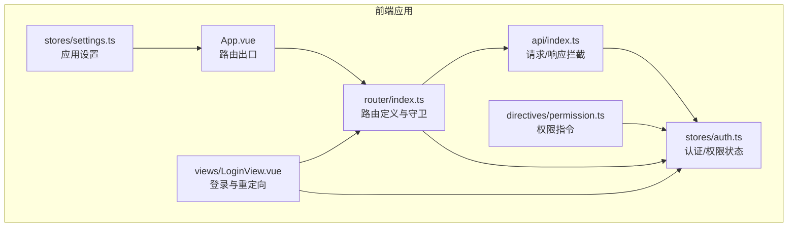
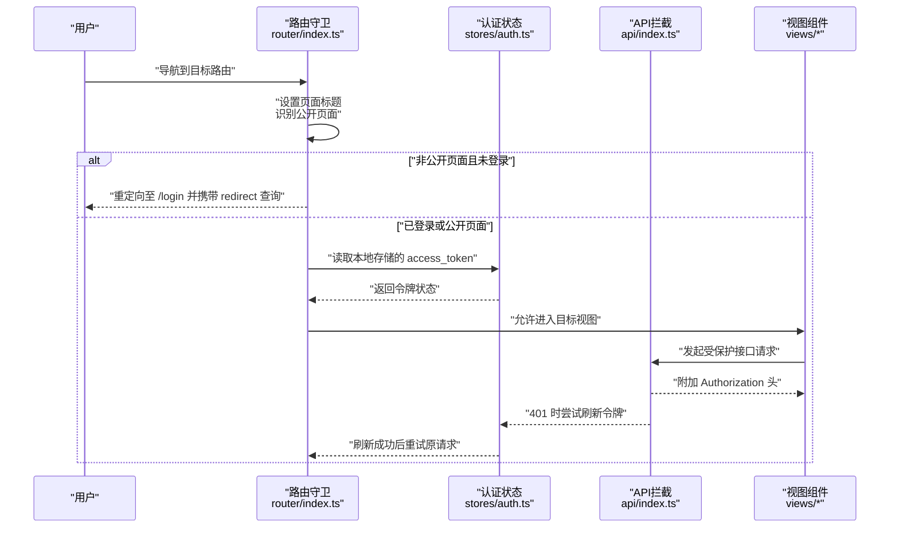
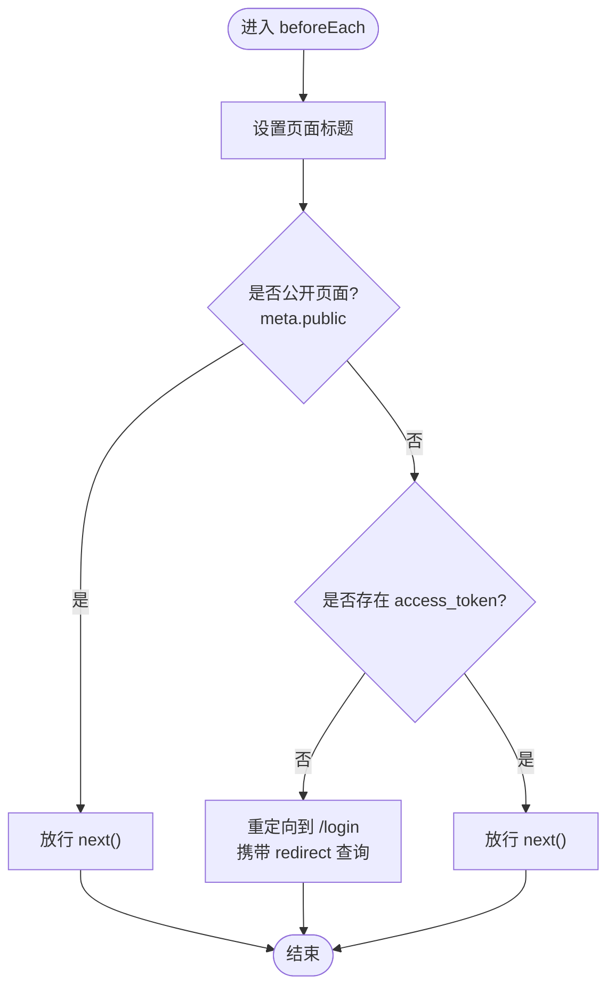
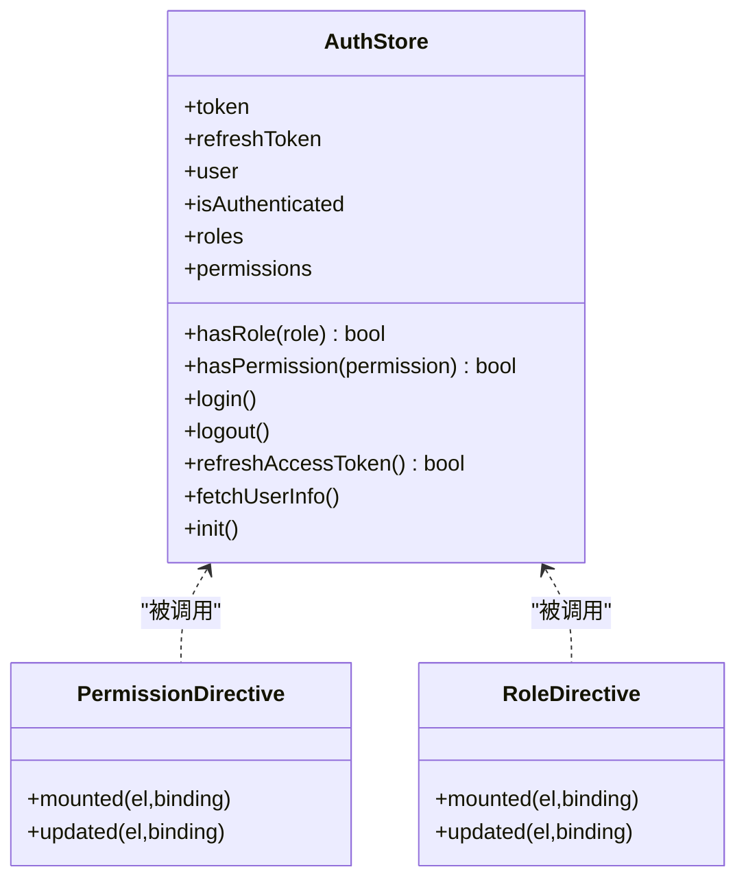
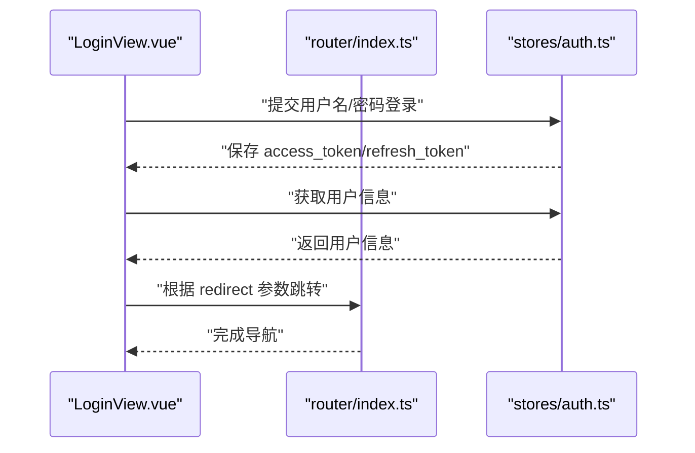
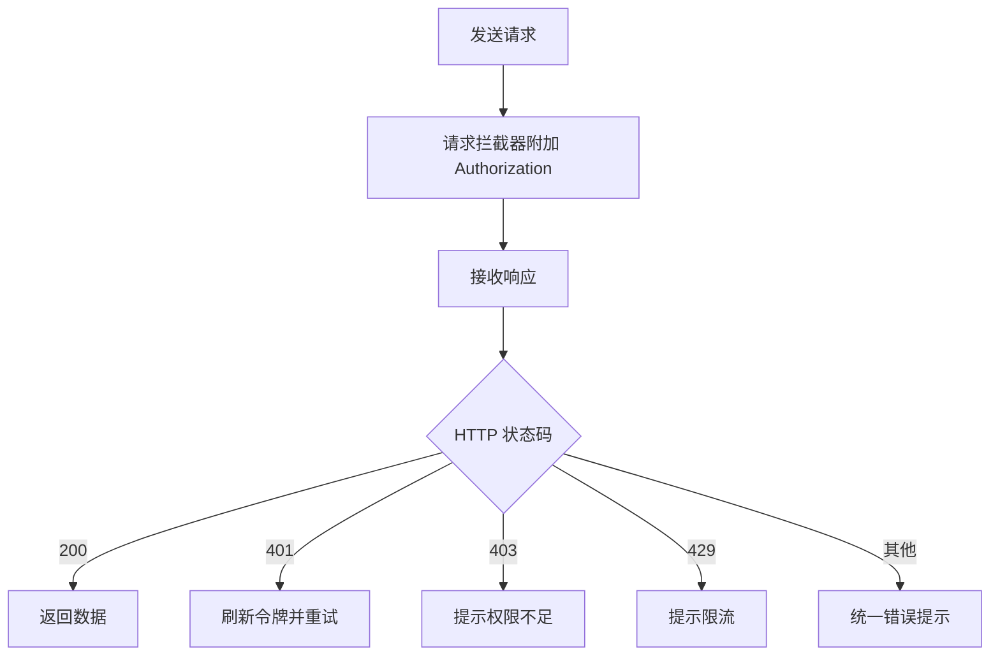
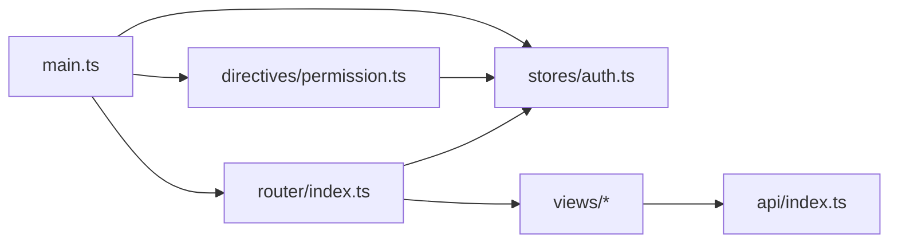

# 路由与导航系统

<cite>
**本文引用的文件**
- [router/index.ts](file://netdata-ai-frontend/src/router/index.ts)
- [stores/auth.ts](file://netdata-ai-frontend/src/stores/auth.ts)
- [directives/permission.ts](file://netdata-ai-frontend/src/directives/permission.ts)
- [main.ts](file://netdata-ai-frontend/src/main.ts)
- [views/LoginView.vue](file://netdata-ai-frontend/src/views/LoginView.vue)
- [views/ChatView.vue](file://netdata-ai-frontend/src/views/ChatView.vue)
- [App.vue](file://netdata-ai-frontend/src/App.vue)
- [api/index.ts](file://netdata-ai-frontend/src/api/index.ts)
- [stores/settings.ts](file://netdata-ai-frontend/src/stores/settings.ts)
- [package.json](file://netdata-ai-frontend/package.json)
</cite>

## 目录
1. [简介](#简介)
2. [项目结构](#项目结构)
3. [核心组件](#核心组件)
4. [架构总览](#架构总览)
5. [详细组件分析](#详细组件分析)
6. [依赖关系分析](#依赖关系分析)
7. [性能考量](#性能考量)
8. [故障排查指南](#故障排查指南)
9. [结论](#结论)
10. [附录](#附录)

## 简介
本文件围绕 Vue Router 路由系统进行系统性梳理，覆盖路由配置设计（路径、层级、懒加载与元信息）、导航守卫机制（全局前置守卫、路由独享守卫与组件内守卫的使用场景）、权限控制实现（基于角色与权限的访问控制、菜单权限动态生成与路由权限验证）、导航拦截与重定向策略（未登录跳转、权限不足处理与路由缓存机制），并提供路由开发最佳实践（参数传递、查询字符串处理与元信息设计）。文末包含完整的导航流程图与权限控制示例。

## 项目结构
前端路由与导航相关的关键文件组织如下：
- 路由定义与守卫：router/index.ts
- 认证与权限状态：stores/auth.ts
- 权限指令（按钮级权限）：directives/permission.ts
- 应用入口与初始化：main.ts
- 登录视图与路由交互：views/LoginView.vue
- 主应用布局与路由出口：App.vue
- API 客户端与鉴权拦截：api/index.ts
- 设置状态（如侧边栏折叠等）：stores/settings.ts
- 依赖与版本：package.json

图表来源
- [App.vue:1-19](file://netdata-ai-frontend/src/App.vue#L1-L19)
- [router/index.ts:1-70](file://netdata-ai-frontend/src/router/index.ts#L1-L70)
- [stores/auth.ts:1-119](file://netdata-ai-frontend/src/stores/auth.ts#L1-L119)
- [directives/permission.ts:1-63](file://netdata-ai-frontend/src/directives/permission.ts#L1-L63)
- [views/LoginView.vue:1-150](file://netdata-ai-frontend/src/views/LoginView.vue#L1-L150)
- [api/index.ts:1-290](file://netdata-ai-frontend/src/api/index.ts#L1-L290)
- [stores/settings.ts:1-32](file://netdata-ai-frontend/src/stores/settings.ts#L1-L32)

章节来源
- [router/index.ts:1-70](file://netdata-ai-frontend/src/router/index.ts#L1-L70)
- [main.ts:1-35](file://netdata-ai-frontend/src/main.ts#L1-L35)
- [package.json:1-37](file://netdata-ai-frontend/package.json#L1-L37)

## 核心组件
- 路由定义与懒加载：采用动态导入实现按需加载视图组件，减少首屏体积。
- 全局前置守卫：统一设置页面标题、识别公开页面、校验令牌并进行未登录重定向。
- 认证与权限状态：Pinia Store 维护 token、用户信息、角色与权限集合，并提供权限判断方法。
- 权限指令：在模板层面根据权限/角色动态隐藏 DOM 元素，避免无意义渲染。
- API 客户端拦截：请求自动附加 Authorization 头；响应拦截处理 401/403/429 等错误，含 token 刷新与兜底跳转。

章节来源
- [router/index.ts:1-70](file://netdata-ai-frontend/src/router/index.ts#L1-L70)
- [stores/auth.ts:1-119](file://netdata-ai-frontend/src/stores/auth.ts#L1-L119)
- [directives/permission.ts:1-63](file://netdata-ai-frontend/src/directives/permission.ts#L1-L63)
- [api/index.ts:1-290](file://netdata-ai-frontend/src/api/index.ts#L1-L290)

## 架构总览
下图展示从用户导航到页面渲染、鉴权与权限控制的整体流程。

图表来源
- [router/index.ts:49-67](file://netdata-ai-frontend/src/router/index.ts#L49-L67)
- [stores/auth.ts:64-93](file://netdata-ai-frontend/src/stores/auth.ts#L64-L93)
- [api/index.ts:29-118](file://netdata-ai-frontend/src/api/index.ts#L29-L118)
- [views/LoginView.vue:79-95](file://netdata-ai-frontend/src/views/LoginView.vue#L79-L95)

## 详细组件分析

### 路由配置设计
- 路径与层级
  - 根路径重定向至聊天页，提升用户体验。
  - 各功能模块以独立路径呈现，如聊天、告警、知识库、审批、用户管理。
- 嵌套路由
  - 当前路由表未显式声明子路由，但可通过在父级路由中引入布局组件并在其内部再定义 children 实现嵌套（建议在需要共享头部/侧边栏时采用）。
- 动态路由与懒加载
  - 所有视图组件均通过动态导入实现懒加载，降低初始包体。
- 元信息设计
  - 使用 meta.title 设置页面标题；meta.public 标记公开页面；meta.permission 用于路由级权限标识（便于后续扩展菜单与路由权限联动）。

章节来源
- [router/index.ts:5-47](file://netdata-ai-frontend/src/router/index.ts#L5-L47)

### 导航守卫机制
- 全局前置守卫
  - 设置页面标题：依据 meta.title 动态更新。
  - 公开页面放行：meta.public 为真时直接放行。
  - 未登录拦截：若无 access_token，则重定向到 /login 并携带 redirect 查询参数。
- 路由独享守卫与组件内守卫
  - 当前未使用路由独享守卫与组件内守卫；可在需要精细化控制时补充（例如进入前拉取数据、离开前确认等）。

图表来源
- [router/index.ts:49-67](file://netdata-ai-frontend/src/router/index.ts#L49-L67)

章节来源
- [router/index.ts:49-67](file://netdata-ai-frontend/src/router/index.ts#L49-L67)

### 权限控制实现
- 基于角色与权限的访问控制
  - 认证 Store 提供 hasRole 与 hasPermission 方法；其中 SUPER_ADMIN 角色拥有最高权限。
  - hasPermission 内置对超级管理员的豁免逻辑。
- 菜单权限动态生成
  - 路由表中的 meta.permission 可作为菜单项的权限标识；结合用户权限集合，前端可据此过滤可显示的菜单项。
- 路由权限验证
  - 全局守卫已实现“未登录拦截”；可扩展“权限不足拦截”：当用户具备路由所需权限时才放行，否则提示或回退。
- 按钮级权限控制
  - v-permission 与 v-role 指令根据用户权限/角色动态移除 DOM，避免无效渲染。

图表来源
- [stores/auth.ts:22-118](file://netdata-ai-frontend/src/stores/auth.ts#L22-L118)
- [directives/permission.ts:9-62](file://netdata-ai-frontend/src/directives/permission.ts#L9-L62)

章节来源
- [stores/auth.ts:34-39](file://netdata-ai-frontend/src/stores/auth.ts#L34-L39)
- [directives/permission.ts:18-30](file://netdata-ai-frontend/src/directives/permission.ts#L18-L30)
- [directives/permission.ts:45-57](file://netdata-ai-frontend/src/directives/permission.ts#L45-L57)

### 导航拦截与重定向策略
- 未登录跳转
  - 全局守卫检测到未登录时，重定向至 /login，并将目标路径作为 redirect 查询参数传入。
  - 登录成功后，读取 redirect 并跳转到该路径。
- 权限不足处理
  - API 层面 403 将弹出提示；路由层面可扩展在守卫中进行权限校验并提示或回退。
- 路由缓存机制
  - 当前未见显式的 keep-alive 缓存配置；可在需要时在布局层或视图层引入缓存策略以优化切换体验。

图表来源
- [views/LoginView.vue:79-95](file://netdata-ai-frontend/src/views/LoginView.vue#L79-L95)
- [stores/auth.ts:42-62](file://netdata-ai-frontend/src/stores/auth.ts#L42-L62)
- [router/index.ts:60-66](file://netdata-ai-frontend/src/router/index.ts#L60-L66)

章节来源
- [views/LoginView.vue:79-95](file://netdata-ai-frontend/src/views/LoginView.vue#L79-L95)
- [router/index.ts:60-66](file://netdata-ai-frontend/src/router/index.ts#L60-L66)

### API 客户端与鉴权拦截
- 请求拦截：自动附加 Bearer Token。
- 响应拦截：统一错误处理；401 时触发刷新流程；403 提示权限不足；429 提示限流；其他错误统一提示。

图表来源
- [api/index.ts:29-118](file://netdata-ai-frontend/src/api/index.ts#L29-L118)

章节来源
- [api/index.ts:29-118](file://netdata-ai-frontend/src/api/index.ts#L29-L118)

### 路由开发最佳实践
- 路由参数传递
  - 使用动态段与 params/query 进行参数传递；在守卫中读取并校验。
- 查询字符串处理
  - 登录重定向时利用 query.redirect 传递目标路径；登录成功后读取并跳转。
- 路由元信息设计
  - 使用 meta.title 设置页面标题；使用 meta.public 标记公开页面；使用 meta.permission 作为路由权限标识，便于菜单与权限联动。

章节来源
- [router/index.ts:10](file://netdata-ai-frontend/src/router/index.ts#L10)
- [router/index.ts:62](file://netdata-ai-frontend/src/router/index.ts#L62)
- [views/LoginView.vue:87](file://netdata-ai-frontend/src/views/LoginView.vue#L87)

## 依赖关系分析
- 路由与状态
  - 路由守卫依赖认证 Store 的令牌状态；认证 Store 在应用启动时初始化。
- 路由与视图
  - 视图组件通过路由懒加载按需加载；登录视图负责导航到目标路径。
- 路由与 API
  - API 客户端拦截器在请求阶段附加令牌；响应阶段处理 401/403/429 错误。
- 权限指令
  - 指令在挂载与更新时读取认证 Store 的权限集合，动态移除无权限元素。

图表来源
- [router/index.ts:1-70](file://netdata-ai-frontend/src/router/index.ts#L1-L70)
- [stores/auth.ts:1-119](file://netdata-ai-frontend/src/stores/auth.ts#L1-L119)
- [directives/permission.ts:1-63](file://netdata-ai-frontend/src/directives/permission.ts#L1-L63)
- [main.ts:1-35](file://netdata-ai-frontend/src/main.ts#L1-L35)
- [api/index.ts:1-290](file://netdata-ai-frontend/src/api/index.ts#L1-L290)

章节来源
- [main.ts:9-32](file://netdata-ai-frontend/src/main.ts#L9-L32)
- [router/index.ts:49-67](file://netdata-ai-frontend/src/router/index.ts#L49-L67)

## 性能考量
- 懒加载与代码分割：路由视图采用动态导入，有助于减小首屏体积。
- Keep-alive 缓存：可在布局层或视图层引入缓存策略，减少重复渲染与请求。
- 请求去抖与并发控制：在 API 层可增加去抖与并发限制，避免频繁请求导致的性能问题。
- 标题与元信息：统一设置页面标题与 meta 信息，有利于 SEO 与用户体验。

## 故障排查指南
- 401 未认证
  - 现象：接口返回 401。
  - 处理：自动触发刷新流程；若刷新失败则跳转登录页。
- 403 权限不足
  - 现象：接口返回 403。
  - 处理：弹出提示“权限不足，无法执行此操作”。
- 429 请求过于频繁
  - 现象：接口返回 429。
  - 处理：弹出提示“请求过于频繁，请稍后再试”。

章节来源
- [api/index.ts:48-118](file://netdata-ai-frontend/src/api/index.ts#L48-L118)

## 结论
本项目通过 Vue Router 的全局前置守卫实现了统一的认证与页面标题管理；借助 Pinia Store 提供的角色与权限判断能力，结合 v-permission/v-role 指令，完成了页面级与按钮级的权限控制；API 客户端拦截器完善了鉴权与错误处理链路。建议后续在路由层扩展“权限不足拦截”，并在布局层引入缓存策略以进一步提升性能与体验。

## 附录
- 依赖版本
  - Vue 3、Vue Router 4、Pinia、Axios、Element Plus 等。

章节来源
- [package.json:13-23](file://netdata-ai-frontend/package.json#L13-L23)