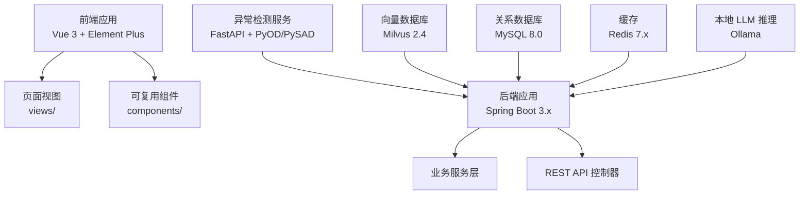
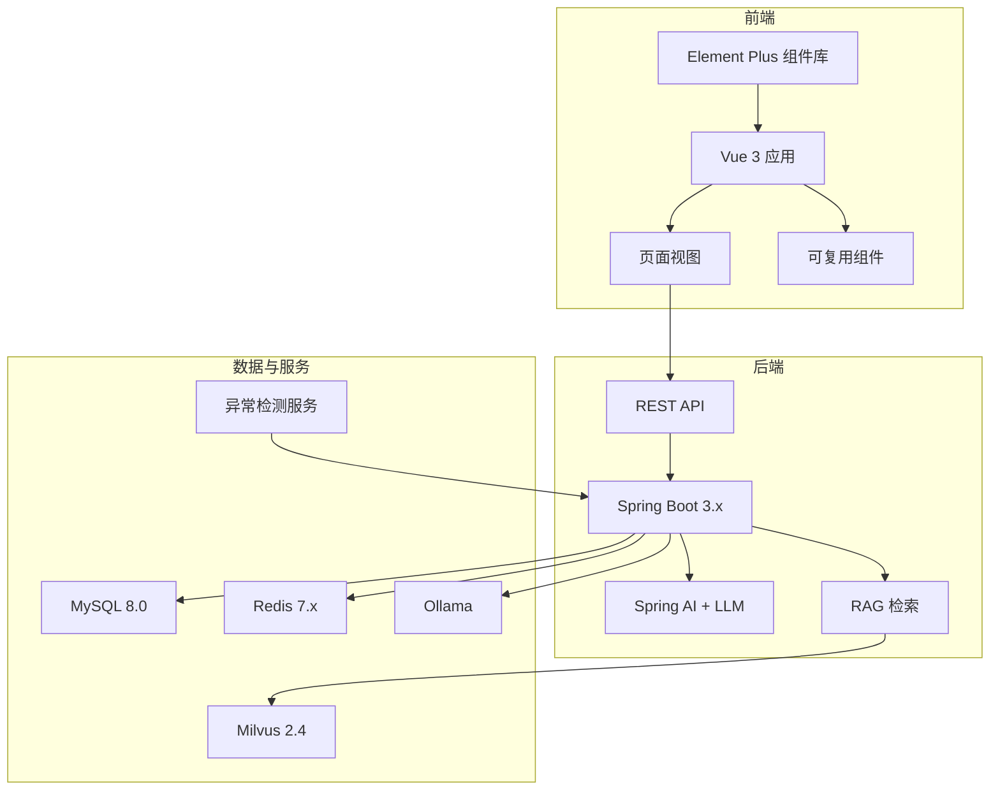
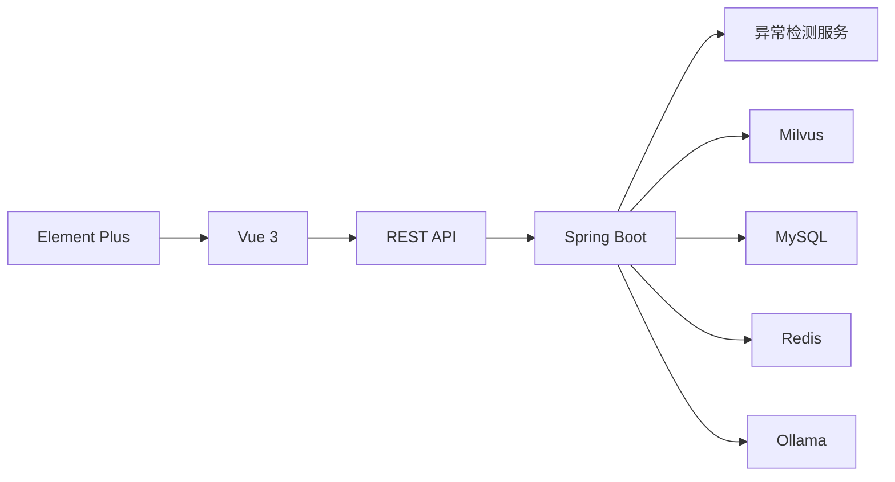
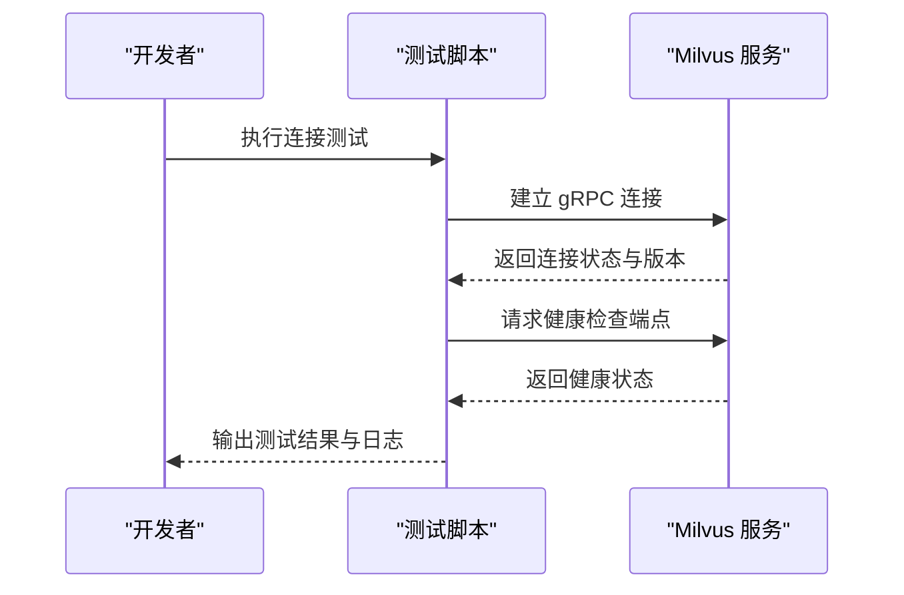

# UI组件库集成

<cite>
**本文引用的文件**
- [PROJECT_CONTEXT.md](file://PROJECT_CONTEXT.md)
- [开题报告_精简版.md](file://开题报告_精简版.md)
- [docker-compose.yml](file://docker-compose.yml)
- [config/milvus_collection.yaml](file://config/milvus_collection.yaml)
- [scripts/init_milvus.py](file://scripts/init_milvus.py)
- [sql/init.sql](file://sql/init.sql)
- [tests/test_milvus_connection.py](file://tests/test_milvus_connection.py)
</cite>

## 目录
1. [简介](#简介)
2. [项目结构](#项目结构)
3. [核心组件](#核心组件)
4. [架构总览](#架构总览)
5. [组件详解](#组件详解)
6. [依赖分析](#依赖分析)
7. [性能考量](#性能考量)
8. [故障排查指南](#故障排查指南)
9. [结论](#结论)
10. [附录](#附录)

## 简介
本项目围绕“面向 NetData 监控数据的智能运维问答与执行系统”，在前端采用 Vue 3 + Element Plus 技术栈，构建聊天界面与运维工单界面，支撑多 Agent 协同的智能运维平台。Element Plus 作为 Vue 3 的官方组件库，提供了丰富的 UI 组件与良好的可访问性支持，能够满足本系统在数据展示、交互反馈与操作引导方面的高要求。

本使用文档聚焦以下目标：
- 解释 Element Plus 的选型理由与版本兼容性
- 说明常用组件（表格、表单、对话框、按钮等）的配置与事件处理
- 提供自定义主题、主题切换与品牌色定制的实现思路
- 阐述响应式布局的设计原则与实现方案
- 总结组件封装最佳实践、属性传递机制与性能优化技巧
- 说明无障碍访问与键盘导航的实现要点
- 提供调试与测试方法与工具建议

## 项目结构
项目采用前后端分离架构，前端位于 netdata-ai-frontend 目录，后端位于 netdata-ai-backend 目录，异常检测服务位于 anomaly-detection-service 目录。前端目录包含 views 与 components，用于承载页面视图与可复用组件。Element Plus 作为前端 UI 基础库，配合 Vue 3 的 Composition API 与响应式系统，实现高性能与可维护性的界面。

图表来源
- [PROJECT_CONTEXT.md:120-149](file://PROJECT_CONTEXT.md#L120-L149)

章节来源
- [PROJECT_CONTEXT.md:120-149](file://PROJECT_CONTEXT.md#L120-L149)

## 核心组件
- 表格组件：用于展示监控指标、告警记录、执行审计等结构化数据，支持排序、筛选、分页与列宽自适应。
- 表单组件：用于输入查询条件、命令模板参数、用户登录与配置项编辑，支持校验规则与联动。
- 对话框组件：用于弹窗确认、提示信息、复杂表单编辑与操作二次确认。
- 按钮组件：用于触发操作、批量处理、状态切换与辅助功能，强调可访问性与视觉层级。
- 其他：标签页、分页器、进度条、空状态占位、图标与提示气泡等，共同构成一致的交互体验。

章节来源
- [开题报告_精简版.md:109-111](file://开题报告_精简版.md#L109-L111)

## 架构总览
前端通过 Element Plus 组件与 Vue 3 生态，构建聊天界面与运维工单界面；后端通过 Spring Boot 提供 REST API；异常检测服务通过 Python 微服务提供实时异常检测；Milvus 作为向量数据库支撑 RAG 检索；MySQL、Redis、Ollama 分别承担关系数据、缓存与推理能力。

图表来源
- [开题报告_精简版.md:118-152](file://开题报告_精简版.md#L118-L152)
- [PROJECT_CONTEXT.md:25-40](file://PROJECT_CONTEXT.md#L25-L40)

章节来源
- [开题报告_精简版.md:118-152](file://开题报告_精简版.md#L118-L152)
- [PROJECT_CONTEXT.md:25-40](file://PROJECT_CONTEXT.md#L25-L40)

## 组件详解

### 表格组件（ElTable）
- 适用场景：展示监控指标、告警记录、执行审计、知识库文档等。
- 常用配置：
  - 数据源绑定与列定义
  - 排序与筛选（可结合后端分页）
  - 分页器联动（每页条数、当前页、总数）
  - 行样式与单元格格式化
- 事件处理：
  - 行点击、双击、右键菜单
  - 列排序与筛选变更回调
  - 分页器页码切换回调
- 可访问性：
  - 为每一行提供可读的 aria-label
  - 为排序列提供升/降序状态提示
  - 为操作列提供键盘可达的按钮

章节来源
- [开题报告_精简版.md:109-111](file://开题报告_精简版.md#L109-L111)

### 表单组件（ElForm + ElFormItem）
- 适用场景：登录、查询条件、命令模板参数、配置项编辑。
- 常用配置：
  - 校验规则（必填、长度、正则、自定义）
  - 栅格布局与标签宽度
  - 动态表单项（根据选择动态增删）
- 事件处理：
  - 表单提交（防重复提交、加载态）
  - 校验触发时机（即时校验、失焦校验）
  - 表单项联动（级联选择、联动隐藏/显示）

章节来源
- [开题报告_精简版.md:109-111](file://开题报告_精简版.md#L109-L111)

### 对话框组件（ElDialog）
- 适用场景：二次确认、复杂表单编辑、提示信息弹窗。
- 常用配置：
  - 显示/隐藏控制
  - 宽度与尺寸
  - 确认/取消按钮文案与禁用状态
- 事件处理：
  - 确认回调（携带表单数据或操作参数）
  - 取消回调（回滚状态或清空表单）
  - 关闭回调（销毁/卸载钩子）

章节来源
- [开题报告_精简版.md:109-111](file://开题报告_精简版.md#L109-L111)

### 按钮组件（ElButton）
- 适用场景：提交、重置、删除、批量操作、状态切换。
- 常用配置：
  - 类型（primary、success、warning、danger、info）
  - 尺寸（small、default、large）
  - 禁用状态与加载态
- 事件处理：
  - 点击回调（携带上下文参数）
  - 长按/双击（如需）
- 可访问性：
  - 为按钮提供明确的 aria-label
  - 支持 Enter/Space 键激活
  - 焦点可见性与键盘顺序

章节来源
- [开题报告_精简版.md:109-111](file://开题报告_精简版.md#L109-L111)

### 自定义主题与品牌色定制
- CSS 变量覆盖：通过覆盖 Element Plus 的 CSS 变量（如 --el-color-primary、--el-border-radius-base 等）实现品牌色与圆角风格统一。
- 主题切换：在应用入口注入主题变量映射，根据用户偏好或系统主题动态切换。
- 品牌色彩：定义主色、辅色与中性色，确保对比度与可读性符合 WCAG AA 标准。

章节来源
- [开题报告_精简版.md:109-111](file://开题报告_精简版.md#L109-L111)

### 响应式布局设计
- 设计原则：移动端优先、断点清晰、弹性布局、网格系统。
- 实现方案：结合 CSS Grid/Flexbox 与 Element Plus 的栅格组件，实现卡片、表格、表单在不同屏幕尺寸下的自适应排列与密度调整。

章节来源
- [开题报告_精简版.md:109-111](file://开题报告_精简版.md#L109-L111)

### 组件封装最佳实践
- 设计模式：可复用组件采用“容器组件 + 展示组件”分离，属性透传与事件上冒，避免过度耦合。
- 属性传递机制：使用 v-bind="$attrs" 与 v-on="$listeners"（或 Vue 3 的 defineEmits/defineProps）实现属性与事件的透明传递。
- 状态管理：在父组件集中管理复杂状态，子组件只负责渲染与事件上报。
- 可访问性：为交互元素提供语义化标签与键盘导航支持，确保轮椅使用者与键盘用户可用。

章节来源
- [开题报告_精简版.md:109-111](file://开题报告_精简版.md#L109-L111)

### 组件性能优化
- 渲染优化：虚拟滚动（ElTable/ElSelect 等）用于大数据量场景；懒加载与分页减少首屏压力。
- 事件节流/防抖：对高频输入与滚动事件进行节流/防抖处理。
- 图片与资源：使用 WebP、懒加载与 CDN，减少首屏时间。
- 组件拆分：按需引入组件与样式，避免全量打包。

章节来源
- [开题报告_精简版.md:109-111](file://开题报告_精简版.md#L109-L111)

### 无障碍访问与键盘导航
- 可访问性：为按钮、链接、表单控件提供 aria-label/aria-describedby；为模态对话框提供 aria-modal；为表格提供 caption 与排序状态提示。
- 键盘导航：Tab 顺序合理，焦点可见；支持 Enter/Space 触发；Esc 关闭对话框；方向键在选择器中移动。
- 屏幕阅读器：语义化 HTML 与 ARIA 属性配合，确保语音朗读准确。

章节来源
- [开题报告_精简版.md:109-111](file://开题报告_精简版.md#L109-L111)

## 依赖分析
- Element Plus 与 Vue 3 的版本兼容性：遵循 Element Plus 官方文档中的 Vue 3 兼容矩阵，确保组件 API 稳定与行为一致。
- 后端依赖：Spring Boot 3.x、Spring AI、MyBatis-Plus、Milvus、Neo4j、Redis、MySQL 等，前端通过 REST API 与后端交互。
- 数据流：前端发起请求 → 后端处理 → 异常检测服务/向量检索 → 返回结果 → 前端渲染。

图表来源
- [PROJECT_CONTEXT.md:25-40](file://PROJECT_CONTEXT.md#L25-L40)

章节来源
- [PROJECT_CONTEXT.md:25-40](file://PROJECT_CONTEXT.md#L25-L40)

## 性能考量
- 组件渲染：对长列表使用虚拟滚动与分页；对频繁更新的表格列采用浅比较与计算属性。
- 网络请求：合并请求、缓存策略、超时与重试；对搜索与检索接口进行防抖。
- 资源加载：按需加载组件与样式；图片与字体资源优化；CDN 与缓存头配置。
- 内存管理：及时清理定时器、事件监听与订阅；避免闭包持有大对象。

## 故障排查指南
- Milvus 连接与健康检查：通过测试脚本验证 gRPC 连接与健康检查端点，定位容器状态与网络问题。
- 数据库初始化：检查 SQL 初始化脚本是否成功执行，确认表结构与索引是否存在。
- Docker 编排：核对 docker-compose.yml 中的服务依赖与端口映射，确保各服务健康状态。

图表来源
- [tests/test_milvus_connection.py:33-78](file://tests/test_milvus_connection.py#L33-L78)
- [tests/test_milvus_connection.py:81-115](file://tests/test_milvus_connection.py#L81-L115)

章节来源
- [tests/test_milvus_connection.py:118-147](file://tests/test_milvus_connection.py#L118-L147)

## 结论
Element Plus 与 Vue 3 的组合为本系统提供了稳定、可扩展且可访问的前端基础。通过合理的组件封装、主题定制与性能优化策略，能够在保证用户体验的同时，满足智能运维平台在数据密集与交互复杂场景下的需求。结合后端的多 Agent 架构与 Milvus 的 RAG 能力，前端组件将更好地服务于聊天界面与运维工单界面的构建与迭代。

## 附录
- Element Plus 版本与 Vue 3 兼容性：参考 Element Plus 官方文档中的版本矩阵，确保组件 API 稳定。
- 品牌色与主题变量：在应用入口集中管理 CSS 变量，实现主题切换与品牌色统一。
- 响应式断点：结合 Element Plus 的栅格系统与媒体查询，实现移动端与桌面端的差异化布局。
- 可访问性清单：为每个交互元素提供语义化标签、键盘可达性与焦点可见性，确保符合 WCAG 标准。