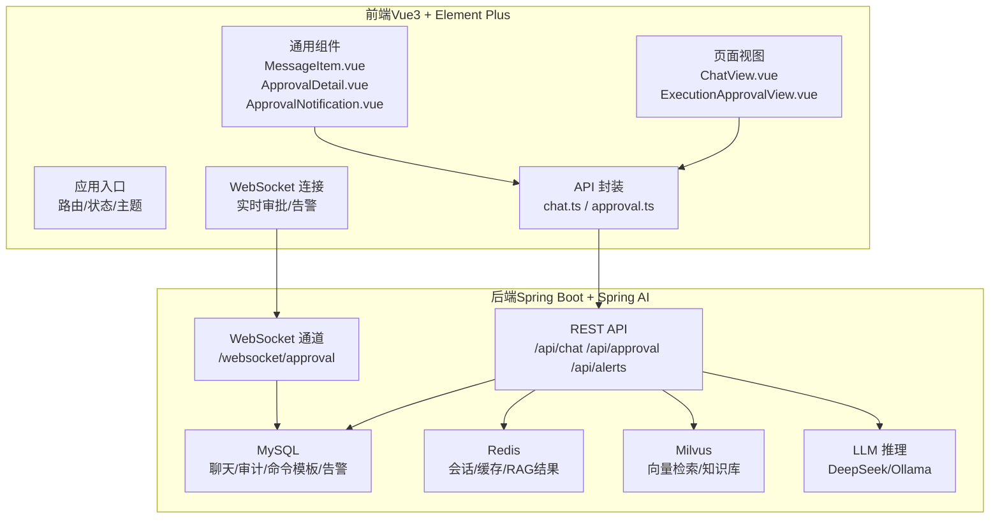
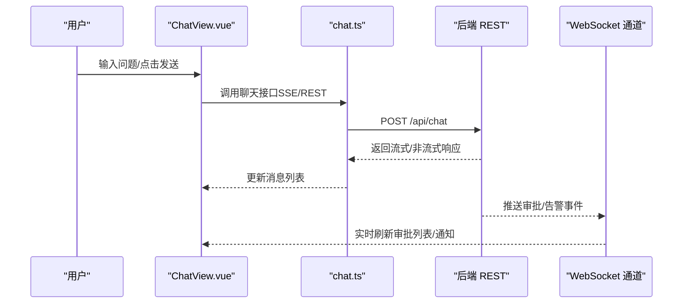
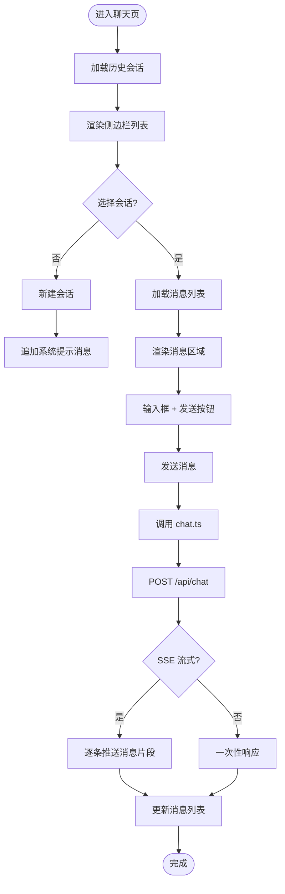
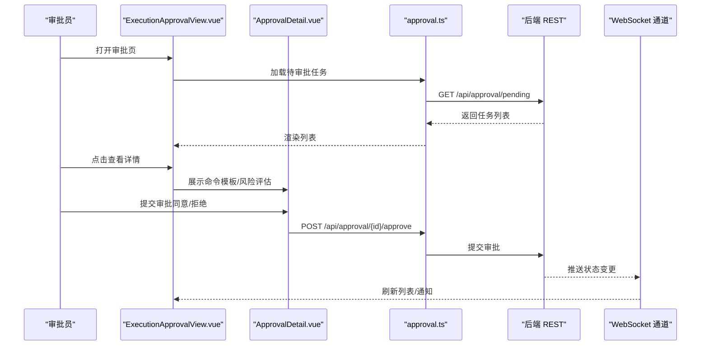
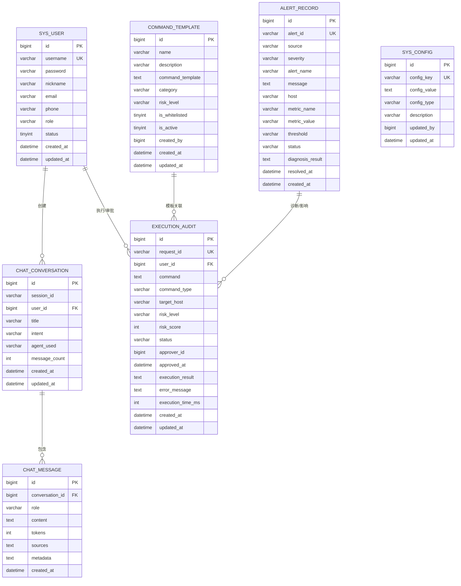
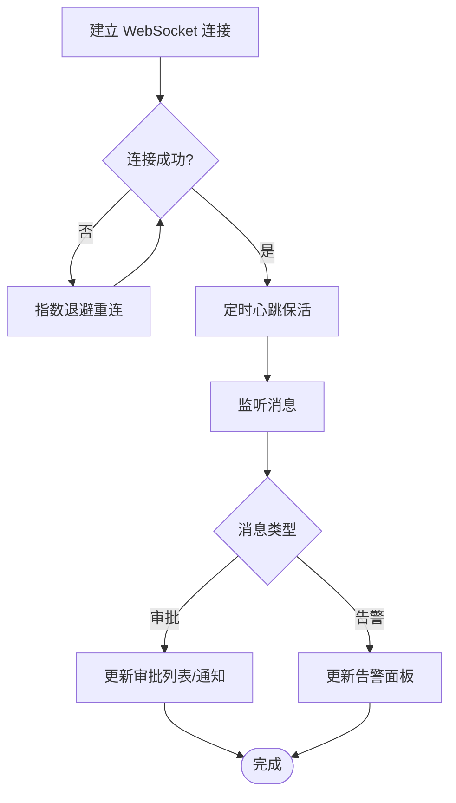
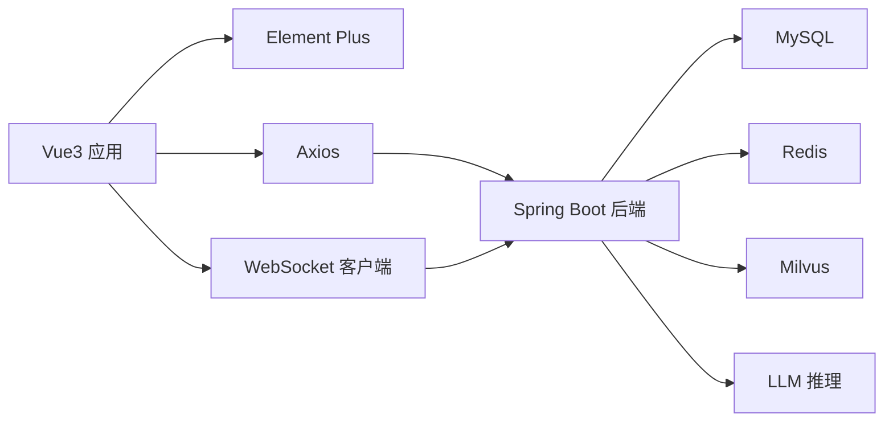

# 前端界面设计

<cite>
**本文引用的文件**
- [PROJECT_CONTEXT.md](file://PROJECT_CONTEXT.md)
- [development-prompt-library.md](file://docs/prompts/development-prompt-library.md)
- [init.sql](file://sql/init.sql)
- [docker-compose.yml](file://docker-compose.yml)
- [orchestrator-system-prompt.md](file://docs/prompts/orchestrator-system-prompt.md)
</cite>

## 目录
1. [简介](#简介)
2. [项目结构](#项目结构)
3. [核心组件](#核心组件)
4. [架构总览](#架构总览)
5. [详细组件分析](#详细组件分析)
6. [依赖分析](#依赖分析)
7. [性能考虑](#性能考虑)
8. [故障排查指南](#故障排查指南)
9. [结论](#结论)
10. [附录](#附录)

## 简介
本设计文档面向 Vue3 前端界面，围绕“智能运维问答与执行系统”的聊天界面与运维工单（审批与执行状态跟踪）界面展开，系统性阐述组件架构、实时通信机制、消息渲染逻辑、Element Plus 组件库使用与主题配置、前后端接口对接与数据交互模式、响应式与移动端适配方案，并总结前端开发最佳实践与性能优化建议。文档同时给出 WebSocket 实时通信的实现思路与错误处理机制，帮助开发者在现有后端能力（MySQL、Redis、Milvus、Ollama/DeepSeek）与 Agent 架构（Orchestrator-Subagent）之上，构建稳定、可扩展、易维护的前端界面。

## 项目结构
根据项目上下文与提示库，前端位于独立的 Vue3 工程中，采用 Element Plus 作为 UI 组件库，使用 TypeScript、Composition API、Pinia 状态管理与 Vue Router 路由管理。后端采用 Spring Boot + Spring AI，提供 REST API 与 WebSocket 实时通道，支撑聊天、告警、审批与执行状态的前端展示。

**图表来源**
- [PROJECT_CONTEXT.md:120-149](file://PROJECT_CONTEXT.md#L120-L149)
- [development-prompt-library.md:365-390](file://docs/prompts/development-prompt-library.md#L365-L390)
- [docker-compose.yml:23-357](file://docker-compose.yml#L23-L357)

**章节来源**
- [PROJECT_CONTEXT.md:120-149](file://PROJECT_CONTEXT.md#L120-L149)
- [development-prompt-library.md:365-390](file://docs/prompts/development-prompt-library.md#L365-L390)

## 核心组件
- 聊天界面（ChatView.vue）
  - 侧边栏：历史对话列表，支持新建/切换会话
  - 主区域：消息列表 + 输入框，支持 Markdown 渲染、代码高亮、来源引用
  - 状态管理：Pinia chat store，保存会话、消息、输入、加载状态
  - API 封装：chat.ts，封装 SSE/REST 调用
- 消息组件（MessageItem.vue）
  - 区分 user/assistant/system 角色样式
  - 支持 Markdown 渲染、代码块高亮、来源卡片
- 审批界面（ExecutionApprovalView.vue）
  - 列表：待审批任务，按风险等级/紧急度排序
  - 详情：ApprovalDetail.vue，展示命令模板、风险评估、影响范围
  - 通知：ApprovalNotification.vue，WebSocket 推送提醒
- 状态管理与 API
  - chat.ts：封装聊天与历史查询
  - approval.ts：封装审批状态查询与提交
- WebSocket 集成
  - 连接 /websocket/approval，订阅审批状态变更与告警推送

**章节来源**
- [development-prompt-library.md:367-390](file://docs/prompts/development-prompt-library.md#L367-L390)
- [development-prompt-library.md:338-362](file://docs/prompts/development-prompt-library.md#L338-L362)

## 架构总览
前端通过 Axios 与后端 REST API 交互，使用 WebSocket 获取实时审批与告警推送。Element Plus 提供统一 UI 组件与暗色主题，Pinia 管理全局状态，Vue Router 管理页面导航。后端提供：
- 聊天：会话与消息的增删改查、意图路由、RAG 检索
- 审批：命令模板、风险评估、审批流程、执行审计
- 告警：实时告警事件、诊断结果、状态流转

**图表来源**
- [development-prompt-library.md:367-390](file://docs/prompts/development-prompt-library.md#L367-L390)
- [docker-compose.yml:23-357](file://docker-compose.yml#L23-L357)

## 详细组件分析

### 聊天界面（ChatView.vue）
- 组件职责
  - 历史会话管理：新建、切换、删除
  - 消息渲染：区分角色、Markdown 渲染、代码高亮、来源卡片
  - 输入处理：文本输入、发送按钮、清空历史
  - 加载与错误：SSE 流式输出、网络错误提示
- 状态管理（Pinia）
  - 状态字段：会话列表、当前会话、消息数组、输入文本、加载状态、错误信息
  - 动作：创建会话、追加消息、更新输入、标记加载、重置错误
- API 封装（chat.ts）
  - 方法：获取历史、发送消息、中断流式输出
  - 交互：REST 接口 /api/chat，SSE 流式返回
- 消息渲染（MessageItem.vue）
  - 角色样式：user（右对齐）、assistant（左对齐）、system（中性）
  - 内容：Markdown 渲染、代码高亮、来源 JSON 解析显示
- 响应式布局
  - 侧边栏折叠/展开，主区域自适应宽度
  - 移动端：底部输入框固定，消息列表滚动

**图表来源**
- [development-prompt-library.md:367-390](file://docs/prompts/development-prompt-library.md#L367-L390)

**章节来源**
- [development-prompt-library.md:367-390](file://docs/prompts/development-prompt-library.md#L367-L390)

### 运维工单界面（ExecutionApprovalView.vue）
- 组件职责
  - 审批任务列表：按状态（pending/approved/rejected/executing/completed/failed）筛选
  - 任务详情：命令模板、变量占位、风险评估、影响范围
  - 决策提交：同意/拒绝，附带审批意见
  - 实时通知：WebSocket 推送审批状态变更
- 状态管理（Pinia）
  - 状态字段：审批任务列表、当前任务、过滤条件、加载状态
  - 动作：加载任务、筛选过滤、提交审批、刷新状态
- API 封装（approval.ts）
  - 方法：获取待审批列表、获取任务详情、提交审批
  - 交互：REST 接口 /api/approval
- WebSocket 集成
  - 连接 /websocket/approval，订阅审批状态变更事件，自动刷新列表

**图表来源**
- [development-prompt-library.md:338-362](file://docs/prompts/development-prompt-library.md#L338-L362)

**章节来源**
- [development-prompt-library.md:338-362](file://docs/prompts/development-prompt-library.md#L338-L362)

### Element Plus 组件库与主题配置
- 组件使用
  - 表单：ElForm/ElFormItem/ElInput/ElSelect/ElRadio
  - 表格：ElTable/ElTableColumn
  - 弹窗：ElDialog/ElMessageBox
  - 导航：ElMenu/ElMenuItem/ElBreadcrumb
  - 按钮：ElButton（不同尺寸/状态）
  - 分页：ElPagination
  - 通知：ElNotification
- 主题配置
  - 暗色主题：通过全局 CSS 变量或 Element Plus 暗色模式开关
  - 色彩规范：品牌色、成功/警告/危险色、中性色
  - 字体与字号：遵循 Element Plus 设计规范
  - 响应式断点：基于 Element Plus 栅格系统

**章节来源**
- [development-prompt-library.md:338-362](file://docs/prompts/development-prompt-library.md#L338-L362)

### 前后端接口对接与数据交互模式
- REST API
  - 聊天：POST /api/chat（SSE/JSON）、GET /api/chat/history
  - 审批：GET /api/approval/pending、GET /api/approval/{id}、POST /api/approval/{id}/approve
  - 告警：GET /api/alerts（分页/筛选）
- WebSocket
  - 订阅：/websocket/approval，推送审批状态变更
  - 告警：/websocket/alerts，推送实时告警事件
- 数据模型（后端表结构）
  - sys_user：用户信息
  - chat_conversation / chat_message：对话与消息
  - execution_audit：命令执行审计
  - command_template：命令模板
  - alert_record：告警记录
  - anomaly_detection：异常检测结果
  - sys_config：系统配置

**图表来源**
- [init.sql:25-274](file://sql/init.sql#L25-L274)

**章节来源**
- [init.sql:25-274](file://sql/init.sql#L25-L274)

### WebSocket 实时通信与错误处理
- 连接建立
  - 审批：ws://host/websocket/approval
  - 告警：ws://host/websocket/alerts
- 消息类型
  - 审批：状态变更（pending/approved/rejected/executing/completed/failed）
  - 告警：新增/恢复事件、诊断结果
- 错误处理
  - 连接失败：重连策略（指数退避）、提示用户
  - 服务端异常：捕获异常消息，显示友好提示
  - 断线恢复：自动重连、消息去重、状态同步
- 前端实现要点
  - 使用浏览器原生 WebSocket 或 Socket.IO
  - 统一封装连接工厂，集中处理心跳、重连、鉴权
  - 在 Pinia 中维护连接状态与消息队列

**图表来源**
- [development-prompt-library.md:338-362](file://docs/prompts/development-prompt-library.md#L338-L362)

**章节来源**
- [development-prompt-library.md:338-362](file://docs/prompts/development-prompt-library.md#L338-L362)

## 依赖分析
- 前端依赖
  - Vue 3 + TypeScript + Vue Router + Pinia
  - Element Plus（UI 组件库）
  - Axios（HTTP 客户端）
  - WebSocket 客户端（原生或 Socket.IO）
- 后端依赖
  - Spring Boot + Spring AI（LLM 集成）
  - MySQL（关系数据）
  - Redis（缓存/会话）
  - Milvus（向量检索）
  - Ollama/DeepSeek（推理）

**图表来源**
- [PROJECT_CONTEXT.md:25-40](file://PROJECT_CONTEXT.md#L25-L40)
- [docker-compose.yml:23-357](file://docker-compose.yml#L23-L357)

**章节来源**
- [PROJECT_CONTEXT.md:25-40](file://PROJECT_CONTEXT.md#L25-L40)
- [docker-compose.yml:23-357](file://docker-compose.yml#L23-L357)

## 性能考虑
- 前端性能
  - 组件懒加载与路由懒加载，减少首屏体积
  - 消息列表虚拟滚动，提升长对话渲染性能
  - 图片/代码高亮按需加载，避免阻塞主线程
  - Pinia 状态分片，避免全局状态过大
- 网络性能
  - REST 接口使用分页与条件筛选，减少数据传输
  - SSE 流式输出，及时展示响应片段
  - WebSocket 复用连接，避免频繁握手
- 缓存策略
  - Redis 缓存热门检索结果与会话摘要
  - 浏览器本地缓存（IndexedDB）存储少量离线数据
- 资源优化
  - Element Plus 按需引入，减小包体积
  - 图标与字体资源 CDN 化

## 故障排查指南
- WebSocket 连接失败
  - 检查后端 WebSocket 端点是否正确暴露
  - 确认跨域配置与代理转发
  - 查看浏览器网络面板与后端日志
- 审批状态不同步
  - 确认 WebSocket 订阅是否成功
  - 检查消息去重与状态合并逻辑
- 聊天消息渲染异常
  - 检查 Markdown 渲染库版本与安全策略
  - 确认消息来源字段格式（JSON）
- 审批详情为空
  - 核对审批 ID 是否正确
  - 检查后端权限与数据一致性

**章节来源**
- [development-prompt-library.md:338-362](file://docs/prompts/development-prompt-library.md#L338-L362)

## 结论
本文从架构、组件、实时通信、接口对接、主题与响应式、性能与故障排查等方面，系统梳理了 Vue3 前端在“智能运维问答与执行系统”中的设计与实现要点。依托 Element Plus 的组件体系与 Pinia 的状态管理，结合 REST 与 WebSocket 的双通道交互，前端能够高效承载聊天问答与运维工单两大核心场景。配合后端的 MySQL/Redis/Milvus/Ollama/DeepSeek 能力，整体系统具备良好的扩展性与稳定性。

## 附录
- 开发阶段提示模板（Prompt Library）
  - 聊天界面：ChatView.vue、MessageItem.vue、chat.ts、stores/chat.ts
  - 审批界面：ExecutionApprovalView.vue、ApprovalDetail.vue、ApprovalNotification.vue、approval.ts
- 数据库初始化脚本
  - 包含用户、对话、消息、审计、模板、告警、异常检测、系统配置等表结构与默认数据

**章节来源**
- [development-prompt-library.md:367-390](file://docs/prompts/development-prompt-library.md#L367-L390)
- [development-prompt-library.md:338-362](file://docs/prompts/development-prompt-library.md#L338-L362)
- [init.sql:25-274](file://sql/init.sql#L25-L274)